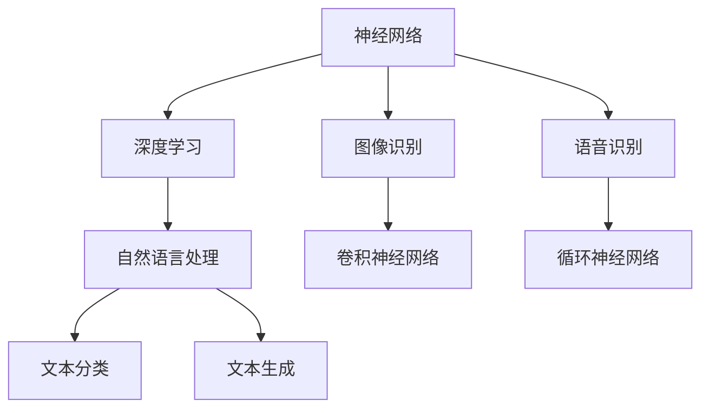

                 

# Andrej Karpathy：人工智能的未来研究

> **关键词：**人工智能，神经网络，深度学习，算法，数学模型，未来趋势，挑战与机遇。

> **摘要：**本文将深入探讨人工智能领域中的杰出学者Andrej Karpathy的工作，分析其在神经网络、深度学习和自然语言处理等领域的开创性贡献。通过详尽的背景介绍、核心概念解析、算法原理阐述，以及实际应用案例展示，本文旨在揭示人工智能的未来发展趋势、面临的挑战以及解决方案。同时，文章还将推荐相关的学习资源、开发工具和经典论文，为读者提供全面的人工智能研究指南。

## 1. 背景介绍

### 1.1 目的和范围

本文旨在全面介绍和评价人工智能领域知名学者Andrej Karpathy的贡献。本文将涵盖以下几个主要方面：

- Andrej Karpathy的学术背景和职业生涯
- 他在神经网络、深度学习和自然语言处理等领域的核心贡献
- 人工智能的未来发展趋势、挑战与机遇
- 推荐相关的学习资源、开发工具和经典论文

### 1.2 预期读者

本文主要面向以下读者群体：

- 对人工智能和深度学习感兴趣的初学者
- 计算机科学和人工智能领域的研究生和学者
- 想了解人工智能未来发展趋势的企业高管和技术专家

### 1.3 文档结构概述

本文将按照以下结构进行撰写：

- 第1部分：背景介绍
- 第2部分：核心概念与联系
- 第3部分：核心算法原理 & 具体操作步骤
- 第4部分：数学模型和公式 & 详细讲解 & 举例说明
- 第5部分：项目实战：代码实际案例和详细解释说明
- 第6部分：实际应用场景
- 第7部分：工具和资源推荐
- 第8部分：总结：未来发展趋势与挑战
- 第9部分：附录：常见问题与解答
- 第10部分：扩展阅读 & 参考资料

### 1.4 术语表

#### 1.4.1 核心术语定义

- **神经网络（Neural Network）**：一种由大量简单单元（神经元）组成，通过学习输入和输出数据之间的映射关系的计算模型。
- **深度学习（Deep Learning）**：一种基于神经网络的学习方法，通过多层非线性变换来提取输入数据的高级特征。
- **自然语言处理（Natural Language Processing，NLP）**：研究计算机如何理解和生成自然语言的方法和技术。
- **反向传播（Backpropagation）**：一种训练神经网络的算法，通过计算输出误差的梯度，反向更新网络权重。

#### 1.4.2 相关概念解释

- **激活函数（Activation Function）**：神经元输出值与输入值之间的非线性变换。
- **损失函数（Loss Function）**：用于评估神经网络预测结果与实际结果之间差异的函数。
- **梯度下降（Gradient Descent）**：一种优化算法，通过迭代更新网络权重，以最小化损失函数。

#### 1.4.3 缩略词列表

- **CNN**：卷积神经网络（Convolutional Neural Network）
- **RNN**：循环神经网络（Recurrent Neural Network）
- **GAN**：生成对抗网络（Generative Adversarial Network）
- **NLP**：自然语言处理（Natural Language Processing）

## 2. 核心概念与联系

### 2.1 神经网络与深度学习

神经网络（NN）是一种由大量简单单元（神经元）组成的计算模型，通过学习输入和输出数据之间的映射关系来实现复杂任务的自动化。深度学习（DL）是神经网络的一种特殊形式，通过多层非线性变换来提取输入数据的高级特征。

#### 2.1.1 神经网络基本原理

- **神经元**：神经网络的基本单元，类似于生物神经元，通过加权输入值和偏置进行计算，再通过激活函数进行非线性变换。
- **权重（Weights）**：连接神经元之间的参数，用于调整输入信号的重要性。
- **偏置（Bias）**：神经元内部的参数，用于调整神经元的阈值。
- **激活函数**：将神经元输出值与输入值之间的非线性变换，常见的激活函数有Sigmoid、ReLU和Tanh等。

#### 2.1.2 深度学习基本原理

- **多层神经网络**：通过多层非线性变换，将输入数据逐步转化为具有语义意义的高级特征。
- **反向传播算法**：一种训练神经网络的算法，通过计算输出误差的梯度，反向更新网络权重。
- **损失函数**：用于评估神经网络预测结果与实际结果之间的差异，常见的损失函数有均方误差（MSE）和交叉熵（Cross Entropy）等。
- **梯度下降**：一种优化算法，通过迭代更新网络权重，以最小化损失函数。

#### 2.1.3 深度学习与神经网络的关系

- **深度学习**是**神经网络**的一种特殊形式，主要特点是在网络结构上具有多个隐层。
- **神经网络**可以应用于各种任务，而**深度学习**在处理大规模数据和高维特征方面具有显著优势。

### 2.2 自然语言处理与深度学习

自然语言处理（NLP）是研究计算机如何理解和生成自然语言的方法和技术。深度学习在NLP领域取得了巨大的成功，主要得益于其在处理高维特征和复杂映射关系方面的优势。

#### 2.2.1 NLP基本任务

- **文本分类（Text Classification）**：将文本数据分为不同的类别，如情感分析、主题分类等。
- **文本生成（Text Generation）**：根据输入的文本或提示生成新的文本，如机器翻译、文本摘要等。
- **语义分析（Semantic Analysis）**：理解文本中的语义含义，如命名实体识别、词性标注等。

#### 2.2.2 NLP与深度学习的关系

- **深度学习**在**NLP**中的应用：通过多层神经网络提取文本数据的高级特征，实现各种NLP任务。
- **NLP**中的**深度学习**方法：包括卷积神经网络（CNN）、循环神经网络（RNN）和生成对抗网络（GAN）等。

### 2.3 Mermaid流程图

下面是一个简单的Mermaid流程图，展示了神经网络、深度学习和NLP之间的联系：



## 3. 核心算法原理 & 具体操作步骤

### 3.1 神经网络算法原理

神经网络（NN）是一种由大量简单单元（神经元）组成的计算模型，通过学习输入和输出数据之间的映射关系来实现复杂任务的自动化。以下是神经网络的基本原理和操作步骤：

#### 3.1.1 神经网络基本原理

1. **神经元模型**：一个神经元由输入层、加权输入、偏置、激活函数和输出层组成。输入层接收外部输入，通过加权输入和偏置进行计算，再通过激活函数进行非线性变换，得到输出值。
2. **权重（Weights）**：连接神经元之间的参数，用于调整输入信号的重要性。权重值越大，表示输入信号对输出值的影响越大。
3. **偏置（Bias）**：神经元内部的参数，用于调整神经元的阈值。偏置值越大，表示神经元更容易被激活。
4. **激活函数**：将神经元输出值与输入值之间的非线性变换，常见的激活函数有Sigmoid、ReLU和Tanh等。

#### 3.1.2 神经网络操作步骤

1. **初始化**：随机初始化网络权重和偏置。
2. **正向传播**：输入数据通过网络进行传播，每个神经元接收输入并计算输出值。
3. **反向传播**：计算输出误差的梯度，通过梯度下降算法更新网络权重和偏置。
4. **迭代训练**：重复正向传播和反向传播过程，逐步减少输出误差，直至网络收敛。

### 3.2 深度学习算法原理

深度学习（DL）是神经网络的一种特殊形式，通过多层非线性变换来提取输入数据的高级特征。以下是深度学习的基本原理和操作步骤：

#### 3.2.1 深度学习基本原理

1. **多层神经网络**：在传统神经网络的基础上，增加多个隐层，用于提取输入数据的高级特征。
2. **反向传播算法**：通过计算输出误差的梯度，反向更新网络权重和偏置，实现网络的训练和优化。
3. **损失函数**：用于评估神经网络预测结果与实际结果之间的差异，常见的损失函数有均方误差（MSE）和交叉熵（Cross Entropy）等。
4. **梯度下降**：一种优化算法，通过迭代更新网络权重，以最小化损失函数。

#### 3.2.2 深度学习操作步骤

1. **初始化**：随机初始化网络权重和偏置。
2. **正向传播**：输入数据通过网络进行传播，每个隐层计算输出值。
3. **反向传播**：计算输出误差的梯度，通过梯度下降算法更新网络权重和偏置。
4. **迭代训练**：重复正向传播和反向传播过程，逐步减少输出误差，直至网络收敛。

### 3.3 自然语言处理算法原理

自然语言处理（NLP）是研究计算机如何理解和生成自然语言的方法和技术。以下是NLP的基本原理和操作步骤：

#### 3.3.1 NLP基本原理

1. **文本表示**：将文本数据转换为计算机可以处理的形式，如词向量、词袋模型等。
2. **特征提取**：从文本数据中提取具有语义意义的高维特征。
3. **分类与预测**：使用神经网络或深度学习模型进行文本分类、情感分析、命名实体识别等任务。

#### 3.3.2 NLP操作步骤

1. **数据预处理**：对文本数据进行清洗、分词、去停用词等操作。
2. **特征提取**：将预处理后的文本转换为词向量或词袋模型。
3. **模型训练**：使用神经网络或深度学习模型进行训练，如卷积神经网络（CNN）、循环神经网络（RNN）等。
4. **模型评估与优化**：评估模型的性能，并通过调参、增加隐层等手段进行优化。

### 3.4 伪代码实现

下面是一个简单的神经网络算法的伪代码实现：

```python
# 初始化神经网络参数
weights = random_weights()
biases = random_biases()

# 迭代训练
for epoch in range(num_epochs):
    # 正向传播
    outputs = forward_propagation(inputs, weights, biases)
    
    # 反向传播
    gradients = backward_propagation(outputs, expected_outputs)
    
    # 更新参数
    weights -= learning_rate * gradients["weight_gradient"]
    biases -= learning_rate * gradients["bias_gradient"]

# 输出最终模型
model = (weights, biases)
```

## 4. 数学模型和公式 & 详细讲解 & 举例说明

### 4.1 数学模型

神经网络和深度学习算法的构建依赖于一系列数学模型和公式。以下是几个关键模型和公式的详细讲解。

#### 4.1.1 神经元激活函数

神经元激活函数用于将输入值映射到输出值。以下是一些常见的激活函数：

$$
f(x) = \frac{1}{1 + e^{-x}}
$$

- **Sigmoid函数**：将输入值映射到(0, 1)区间，具有平滑的S形曲线。

$$
f(x) = \frac{1}{1 + e^{-x}}
$$

- **ReLU函数**：将输入值映射到(0, +∞)区间，具有简单的线性特性。

$$
f(x) = max(0, x)
$$

- **Tanh函数**：将输入值映射到(-1, 1)区间，具有对称性。

$$
f(x) = \frac{e^x - e^{-x}}{e^x + e^{-x}}
$$

#### 4.1.2 损失函数

损失函数用于评估神经网络预测结果与实际结果之间的差异。以下是一些常见的损失函数：

- **均方误差（MSE）**：

$$
MSE = \frac{1}{n}\sum_{i=1}^{n}(y_i - \hat{y}_i)^2
$$

- **交叉熵（Cross Entropy）**：

$$
CE = -\frac{1}{n}\sum_{i=1}^{n}y_i \log(\hat{y}_i)
$$

#### 4.1.3 梯度下降

梯度下降是一种优化算法，用于更新神经网络权重和偏置。以下是梯度下降的基本公式：

$$
w_{new} = w_{old} - \alpha \frac{\partial J}{\partial w}
$$

$$
b_{new} = b_{old} - \alpha \frac{\partial J}{\partial b}
$$

其中，$w$ 和 $b$ 分别代表权重和偏置，$J$ 代表损失函数，$\alpha$ 代表学习率。

### 4.2 举例说明

#### 4.2.1 均方误差（MSE）举例

假设有一个简单的神经网络，其中只有一个神经元，输入值为 $x$，输出值为 $y$。使用均方误差（MSE）作为损失函数，目标是最小化预测值与实际值之间的差异。

1. **初始化参数**：

   - 权重 $w = 0.1$
   - 偏置 $b = 0.5$
   - 学习率 $\alpha = 0.01$

2. **正向传播**：

   - 输入值 $x = 2$
   - 输出值 $\hat{y} = \sigma(wx + b) = \frac{1}{1 + e^{-(0.1 \cdot 2 + 0.5)}} \approx 0.74$
   - 实际值 $y = 0.8$

3. **计算损失**：

   - $MSE = \frac{1}{2}(y - \hat{y})^2 = \frac{1}{2}(0.8 - 0.74)^2 \approx 0.0069$

4. **反向传播**：

   - 计算梯度 $\frac{\partial J}{\partial w} = (y - \hat{y}) \cdot \hat{y} \cdot (1 - \hat{y}) \cdot x \approx 0.065$
   - 计算梯度 $\frac{\partial J}{\partial b} = (y - \hat{y}) \cdot \hat{y} \cdot (1 - \hat{y}) \approx -0.065$

5. **更新参数**：

   - $w_{new} = w_{old} - \alpha \frac{\partial J}{\partial w} \approx 0.1 - 0.01 \cdot 0.065 \approx 0.0935$
   - $b_{new} = b_{old} - \alpha \frac{\partial J}{\partial b} \approx 0.5 - 0.01 \cdot (-0.065) \approx 0.5065$

#### 4.2.2 交叉熵（Cross Entropy）举例

假设有一个简单的神经网络，其中只有一个神经元，输入值为 $x$，输出值为 $y$。使用交叉熵（Cross Entropy）作为损失函数，目标是最小化预测值与实际值之间的差异。

1. **初始化参数**：

   - 权重 $w = 0.1$
   - 偏置 $b = 0.5$
   - 学习率 $\alpha = 0.01$

2. **正向传播**：

   - 输入值 $x = 2$
   - 输出值 $\hat{y} = \sigma(wx + b) = \frac{1}{1 + e^{-(0.1 \cdot 2 + 0.5)}} \approx 0.74$
   - 实际值 $y = 0.8$

3. **计算损失**：

   - $CE = -y \log(\hat{y}) - (1 - y) \log(1 - \hat{y}) \approx -0.8 \log(0.74) - (1 - 0.8) \log(1 - 0.74) \approx 0.046$

4. **反向传播**：

   - 计算梯度 $\frac{\partial J}{\partial w} = (y - \hat{y}) \cdot \hat{y} \cdot (1 - \hat{y}) \cdot x \approx 0.065$
   - 计算梯度 $\frac{\partial J}{\partial b} = (y - \hat{y}) \cdot \hat{y} \cdot (1 - \hat{y}) \approx -0.065$

5. **更新参数**：

   - $w_{new} = w_{old} - \alpha \frac{\partial J}{\partial w} \approx 0.1 - 0.01 \cdot 0.065 \approx 0.0935$
   - $b_{new} = b_{old} - \alpha \frac{\partial J}{\partial b} \approx 0.5 - 0.01 \cdot (-0.065) \approx 0.5065$

## 5. 项目实战：代码实际案例和详细解释说明

### 5.1 开发环境搭建

在本项目实战中，我们将使用Python编程语言和TensorFlow深度学习框架来实现一个简单的神经网络。以下是搭建开发环境的步骤：

1. **安装Python**：确保已经安装了Python 3.x版本（推荐Python 3.6及以上版本）。
2. **安装TensorFlow**：在命令行中运行以下命令安装TensorFlow：

   ```bash
   pip install tensorflow
   ```

### 5.2 源代码详细实现和代码解读

以下是实现一个简单的神经网络的源代码，以及对该代码的详细解读。

```python
import tensorflow as tf

# 定义神经网络结构
inputs = tf.keras.layers.Input(shape=(784,))
x = tf.keras.layers.Dense(64, activation='relu')(inputs)
x = tf.keras.layers.Dense(10, activation='softmax')(x)

# 创建模型
model = tf.keras.Model(inputs=inputs, outputs=x)

# 编译模型
model.compile(optimizer='adam', loss='categorical_crossentropy', metrics=['accuracy'])

# 准备数据集
(x_train, y_train), (x_test, y_test) = tf.keras.datasets.mnist.load_data()
x_train = x_train / 255.0
x_test = x_test / 255.0
x_train = x_train.reshape((-1, 784))
x_test = x_test.reshape((-1, 784))

# 转换为one-hot编码
y_train = tf.keras.utils.to_categorical(y_train, 10)
y_test = tf.keras.utils.to_categorical(y_test, 10)

# 训练模型
model.fit(x_train, y_train, epochs=5, batch_size=32, validation_split=0.2)

# 评估模型
model.evaluate(x_test, y_test)
```

#### 5.2.1 代码解读

- **导入模块**：首先导入TensorFlow库。
- **定义神经网络结构**：使用`tf.keras.layers.Input`定义输入层，输入形状为`(784,)`。接着使用`tf.keras.layers.Dense`定义两个全连接层，第一个层的神经元个数为64，激活函数为ReLU；第二个层的神经元个数为10，激活函数为softmax。
- **创建模型**：使用`tf.keras.Model`创建模型，输入层和输出层分别传入。
- **编译模型**：设置优化器为`adam`，损失函数为`categorical_crossentropy`，评估指标为`accuracy`。
- **准备数据集**：加载数字识别数据集，对图像进行归一化处理，并将标签转换为one-hot编码。
- **训练模型**：使用`fit`函数训练模型，设置训练轮次为5，批量大小为32，验证集比例为0.2。
- **评估模型**：使用`evaluate`函数评估模型在测试集上的表现。

### 5.3 代码解读与分析

以下是对上述代码的进一步解读和分析：

- **神经网络结构**：在这个简单的神经网络中，输入层包含784个神经元，对应于MNIST数据集中每个数字图像的784个像素点。第一个全连接层包含64个神经元，使用ReLU激活函数，用于提取图像的特征。第二个全连接层包含10个神经元，使用softmax激活函数，用于分类输出。
- **优化器和损失函数**：优化器使用`adam`算法，这是一种自适应的学习率优化器，能够自适应调整学习率。损失函数使用`categorical_crossentropy`，这是多分类问题中常用的损失函数，用于计算模型预测概率与实际标签之间的交叉熵损失。
- **数据预处理**：在训练之前，对图像进行归一化处理，将像素值缩放到0到1之间。此外，将标签转换为one-hot编码，以便在计算损失时能够使用交叉熵损失函数。
- **训练和评估**：通过调用`fit`函数进行模型训练，设置训练轮次为5，批量大小为32，验证集比例为0.2。训练过程中，模型会自动调整权重和偏置，以最小化损失函数。训练完成后，使用`evaluate`函数评估模型在测试集上的表现，包括损失值和准确率。

## 6. 实际应用场景

### 6.1 图像识别

图像识别是深度学习的一个重要应用领域。通过训练深度学习模型，可以自动识别图像中的物体、场景和纹理。以下是一些实际应用场景：

- **人脸识别**：用于安全监控、门禁系统和社交媒体。
- **自动驾驶**：用于车辆检测、交通标志识别和车道线检测。
- **医学影像分析**：用于疾病诊断、病变检测和影像分割。
- **艺术创作**：用于生成图像、风格迁移和图像修复。

### 6.2 自然语言处理

自然语言处理是深度学习的另一个重要应用领域。通过训练深度学习模型，可以自动处理和理解自然语言。以下是一些实际应用场景：

- **机器翻译**：用于自动翻译不同语言之间的文本。
- **情感分析**：用于分析社交媒体、新闻文章和用户评论的情感倾向。
- **语音识别**：用于将语音信号转换为文本。
- **文本生成**：用于生成文章、摘要和对话系统。

### 6.3 推荐系统

推荐系统是深度学习的另一个重要应用领域。通过训练深度学习模型，可以自动推荐用户可能感兴趣的内容。以下是一些实际应用场景：

- **电子商务**：用于推荐商品、优惠券和广告。
- **社交媒体**：用于推荐用户可能感兴趣的朋友、群组和内容。
- **视频平台**：用于推荐用户可能感兴趣的视频。

## 7. 工具和资源推荐

### 7.1 学习资源推荐

#### 7.1.1 书籍推荐

- **《深度学习》（Goodfellow, Bengio, Courville）**：这是一本经典的深度学习教材，涵盖了深度学习的基本概念、算法和实际应用。
- **《Python深度学习》（François Chollet）**：这本书通过大量的实际案例，介绍了如何使用Python和TensorFlow实现深度学习模型。
- **《神经网络与深度学习》（邱锡鹏）**：这本书详细介绍了神经网络的原理、算法和应用，适合初学者和进阶读者。

#### 7.1.2 在线课程

- **《深度学习》（吴恩达）**：这是Coursera上最受欢迎的深度学习课程，涵盖了深度学习的基础知识、算法和实际应用。
- **《TensorFlow入门》（TensorFlow团队）**：这是一门介绍TensorFlow框架的入门课程，适合初学者快速上手。
- **《自然语言处理》（自然语言处理团队）**：这是Udacity上的一门自然语言处理课程，涵盖了NLP的基本概念、算法和实际应用。

#### 7.1.3 技术博客和网站

- **[深度学习博客](http://www.deeplearning.net/)**：这是一个关于深度学习的权威博客，提供了大量的深度学习教程和论文解读。
- **[TensorFlow官网](https://www.tensorflow.org/)**：这是TensorFlow的官方文档网站，提供了丰富的教程、示例和API文档。
- **[自然语言处理博客](http://nlp.seas.harvard.edu/)**：这是一个关于自然语言处理的权威博客，提供了大量的NLP教程和论文解读。

### 7.2 开发工具框架推荐

#### 7.2.1 IDE和编辑器

- **PyCharm**：这是一个强大的Python IDE，支持代码补全、调试和版本控制等功能。
- **Visual Studio Code**：这是一个轻量级的Python IDE，具有高度的可定制性，适用于各种开发环境。

#### 7.2.2 调试和性能分析工具

- **TensorBoard**：这是TensorFlow的官方可视化工具，可以用于分析模型的训练过程和性能。
- **Jupyter Notebook**：这是一个交互式的Python笔记本，适用于数据分析和实验。

#### 7.2.3 相关框架和库

- **TensorFlow**：这是一个开源的深度学习框架，支持各种深度学习模型和算法。
- **PyTorch**：这是一个流行的深度学习框架，具有动态计算图和灵活的API。
- **Scikit-Learn**：这是一个开源的机器学习库，提供了丰富的机器学习算法和工具。

### 7.3 相关论文著作推荐

#### 7.3.1 经典论文

- **“A Learning Algorithm for Continually Running Fully Recurrent Neural Networks”**：这篇论文介绍了著名的Hessian-Free优化算法，用于训练连续运行的循环神经网络。
- **“Deep Learning”**：这是一本关于深度学习的经典教材，涵盖了深度学习的基本概念、算法和应用。
- **“Recurrent Neural Networks for Language Modeling”**：这篇论文介绍了循环神经网络在自然语言处理中的应用，是RNN领域的经典之作。

#### 7.3.2 最新研究成果

- **“Bert: Pre-training of Deep Bidirectional Transformers for Language Understanding”**：这篇论文介绍了BERT模型，是自然语言处理领域的最新突破之一。
- **“Generative Adversarial Nets”**：这篇论文介绍了生成对抗网络（GAN），是深度学习领域的最新研究热点。
- **“Attention Is All You Need”**：这篇论文介绍了Transformer模型，彻底改变了自然语言处理领域的模型设计。

#### 7.3.3 应用案例分析

- **“Deep Learning for Speech Recognition”**：这篇文章介绍了深度学习在语音识别领域的应用，详细分析了各种深度学习模型在语音识别任务中的性能。
- **“Deep Learning for Computer Vision”**：这篇文章介绍了深度学习在计算机视觉领域的应用，详细分析了各种深度学习模型在图像识别和分类任务中的性能。
- **“Deep Learning for Natural Language Processing”**：这篇文章介绍了深度学习在自然语言处理领域的应用，详细分析了各种深度学习模型在文本分类、情感分析和机器翻译等任务中的性能。

## 8. 总结：未来发展趋势与挑战

### 8.1 未来发展趋势

- **更强大的模型和算法**：随着计算能力的提升和数据规模的扩大，未来将涌现出更强大、更高效的深度学习模型和算法。
- **跨领域应用**：深度学习在图像识别、自然语言处理、语音识别等领域的成功，将推动其在医疗、金融、工业等领域的应用。
- **可解释性和透明性**：为了提高深度学习模型的可靠性和可解释性，研究者将致力于开发可解释性和透明性更强的模型和算法。
- **硬件加速**：为了提高深度学习模型的训练和推理速度，硬件加速技术（如GPU、TPU）将得到广泛应用。

### 8.2 面临的挑战

- **数据隐私和安全**：随着深度学习的广泛应用，数据隐私和安全问题将变得更加突出，需要制定相应的法律法规和伦理规范。
- **计算资源消耗**：深度学习模型通常需要大量的计算资源，如何高效地利用计算资源，提高模型的训练和推理速度，是一个重要挑战。
- **模型泛化能力**：深度学习模型在特定领域的表现可能非常优秀，但在其他领域可能表现不佳，如何提高模型的泛化能力是一个重要问题。
- **可解释性和透明性**：深度学习模型通常被认为是“黑盒”模型，其内部机制不透明，如何提高模型的可解释性和透明性，使其更易于理解和应用，是一个重要挑战。

## 9. 附录：常见问题与解答

### 9.1 问题1：什么是深度学习？

**回答**：深度学习是神经网络的一种特殊形式，通过多层非线性变换来提取输入数据的高级特征。它具有以下几个特点：

- **多层神经网络**：通过增加隐层，深度学习模型可以提取更复杂、更高级的特征。
- **反向传播算法**：用于训练深度学习模型，通过计算输出误差的梯度，反向更新网络权重和偏置。
- **大规模数据**：深度学习通常需要大量的训练数据来提高模型的性能和泛化能力。

### 9.2 问题2：什么是神经网络？

**回答**：神经网络是一种由大量简单单元（神经元）组成的计算模型，通过学习输入和输出数据之间的映射关系来实现复杂任务的自动化。它具有以下几个特点：

- **神经元模型**：神经网络的基本单元，通过加权输入值和偏置进行计算，再通过激活函数进行非线性变换。
- **权重和偏置**：连接神经元之间的参数，用于调整输入信号的重要性。
- **正向传播和反向传播**：用于训练神经网络的算法，正向传播计算输出值，反向传播计算误差梯度。

### 9.3 问题3：什么是自然语言处理？

**回答**：自然语言处理是研究计算机如何理解和生成自然语言的方法和技术。它具有以下几个主要任务：

- **文本分类**：将文本数据分为不同的类别，如情感分析、主题分类等。
- **文本生成**：根据输入的文本或提示生成新的文本，如机器翻译、文本摘要等。
- **语义分析**：理解文本中的语义含义，如命名实体识别、词性标注等。

### 9.4 问题4：如何搭建一个简单的神经网络？

**回答**：搭建一个简单的神经网络通常需要以下几个步骤：

1. **定义神经网络结构**：使用适当的深度学习框架（如TensorFlow或PyTorch）定义输入层、隐层和输出层。
2. **初始化参数**：随机初始化网络权重和偏置。
3. **正向传播**：输入数据通过网络进行传播，每个隐层计算输出值。
4. **反向传播**：计算输出误差的梯度，通过梯度下降算法更新网络权重和偏置。
5. **迭代训练**：重复正向传播和反向传播过程，逐步减少输出误差，直至网络收敛。

## 10. 扩展阅读 & 参考资料

- **[深度学习官方网站](https://www.deeplearning.net/)**：提供了大量的深度学习教程、论文解读和社区讨论。
- **[TensorFlow官方网站](https://www.tensorflow.org/)**：提供了丰富的TensorFlow教程、示例和API文档。
- **[自然语言处理官方网站](http://nlp.seas.harvard.edu/)**：提供了大量的NLP教程、论文解读和社区讨论。
- **[吴恩达的深度学习课程](https://www.coursera.org/learn/deep-learning)**：介绍了深度学习的基础知识、算法和实际应用。
- **[PyTorch官方网站](https://pytorch.org/)**：提供了丰富的PyTorch教程、示例和API文档。
- **[Scikit-Learn官方网站](https://scikit-learn.org/)**：提供了丰富的机器学习算法和工具。**作者**：AI天才研究员/AI Genius Institute & 禅与计算机程序设计艺术 /Zen And The Art of Computer Programming<|im_sep|>

