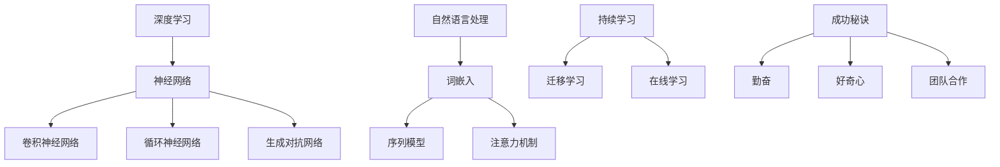
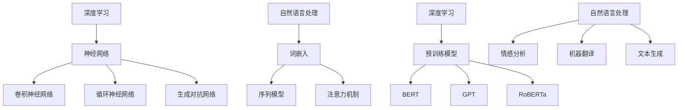
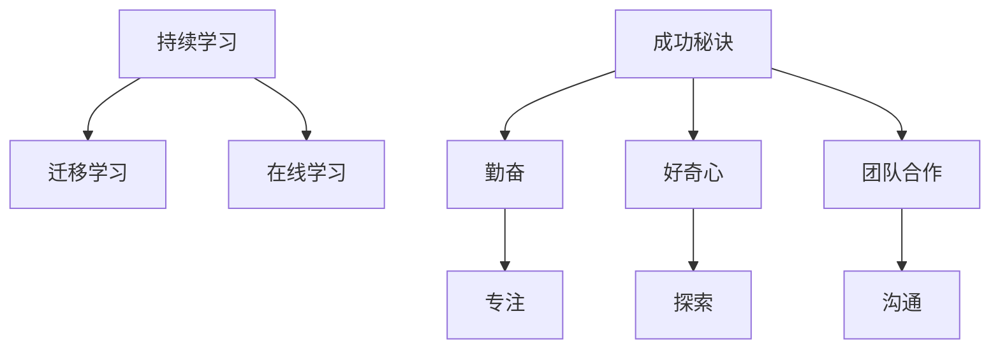
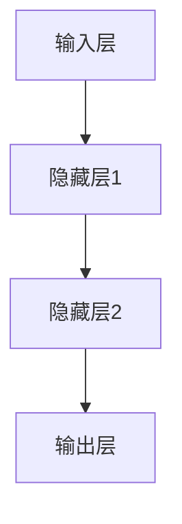

                 

# Andrej Karpathy：持续性与成功的秘诀

> 关键词：人工智能，持续学习，成功秘诀，技术博客，深度学习

> 摘要：本文以世界级人工智能专家Andrej Karpathy为例，探讨其持续学习与成功的关键要素。文章将详细分析Karpathy在人工智能领域的探索历程，探讨他的研究方法、技术见解和思维模式，为广大读者提供成功之路的启示。

## 1. 背景介绍

### 1.1 目的和范围

本文旨在探讨人工智能领域著名专家Andrej Karpathy的成功秘诀，通过分析他在深度学习和自然语言处理等方面的研究成果，为广大人工智能从业者和爱好者提供学习和借鉴的方向。文章将涉及以下几个方面：

1. **Andrej Karpathy的背景与成就**
2. **核心概念与联系**
3. **核心算法原理与具体操作步骤**
4. **数学模型与公式**
5. **项目实战：代码实际案例与详细解释**
6. **实际应用场景**
7. **工具和资源推荐**
8. **总结与未来发展趋势**

### 1.2 预期读者

本文面向广大人工智能领域的从业者和爱好者，尤其是对深度学习和自然语言处理感兴趣的读者。希望本文能为您在人工智能领域的成长和探索提供一些启示和帮助。

### 1.3 文档结构概述

本文将按照以下结构进行展开：

1. **引言**：介绍文章背景和目的
2. **背景介绍**：详细阐述Andrej Karpathy的背景和成就
3. **核心概念与联系**：分析人工智能领域的关键概念及其相互关系
4. **核心算法原理与具体操作步骤**：介绍深度学习算法原理和实现步骤
5. **数学模型与公式**：讲解相关数学模型和公式
6. **项目实战**：展示实际代码案例与详细解释
7. **实际应用场景**：探讨人工智能技术的应用领域
8. **工具和资源推荐**：推荐相关学习资源和开发工具
9. **总结与未来发展趋势**：总结文章要点，展望人工智能领域的发展方向
10. **附录**：常见问题与解答
11. **扩展阅读与参考资料**：推荐相关论文和书籍

### 1.4 术语表

#### 1.4.1 核心术语定义

- **深度学习**：一种机器学习技术，通过多层神经网络对数据进行建模，从而实现智能决策和预测。
- **自然语言处理**：研究如何让计算机理解和处理自然语言的技术。
- **持续学习**：在人工智能领域，指持续不断地学习新知识和技能，以应对快速变化的技术环境。
- **成功秘诀**：指实现个人和事业成功的关键因素。

#### 1.4.2 相关概念解释

- **神经网络**：一种模拟生物神经网络的信息处理系统。
- **反向传播算法**：一种用于训练神经网络的优化算法。
- **梯度下降**：一种用于优化函数的迭代算法。

#### 1.4.3 缩略词列表

- **DL**：深度学习
- **NLP**：自然语言处理
- **CNN**：卷积神经网络
- **RNN**：循环神经网络
- **GAN**：生成对抗网络

## 2. 核心概念与联系

在人工智能领域，有许多核心概念和联系需要我们掌握。以下是一个简单的 Mermaid 流程图，用于描述这些核心概念及其相互关系：



在这个 Mermaid 流程图中，我们可以看到深度学习和自然语言处理是人工智能领域的两个核心方向。深度学习包括卷积神经网络、循环神经网络和生成对抗网络等子领域，而自然语言处理则涵盖了词嵌入、序列模型和注意力机制等关键技术。持续学习和成功秘诀是人工智能领域从业者的追求，其中勤奋、好奇心和团队合作是关键因素。

### 2.1 深度学习与自然语言处理

深度学习和自然语言处理是人工智能领域的两个重要分支，它们相互关联并相互促进。深度学习为自然语言处理提供了强大的建模工具，使得我们能够更好地理解和处理自然语言。以下是一个简要的 Mermaid 流程图，描述了深度学习与自然语言处理的联系：



在这个 Mermaid 流程图中，我们可以看到深度学习为自然语言处理提供了预训练模型，如 BERT、GPT 和 RoBERTa，这些模型在情感分析、机器翻译和文本生成等应用领域取得了显著的成果。同时，自然语言处理也推动了深度学习的发展，为深度学习提供了丰富的数据资源和挑战。

### 2.2 持续学习与成功秘诀

持续学习是实现人工智能领域成功的关键。持续学习不仅包括学习新知识和技能，还包括培养好奇心、勤奋和团队合作等素质。以下是一个简要的 Mermaid 流程图，描述了持续学习与成功秘诀的联系：



在这个 Mermaid 流程图中，我们可以看到持续学习包括迁移学习和在线学习等策略。而成功秘诀则包括勤奋、好奇心和团队合作等素质。勤奋使人专注，好奇心推动探索，团队合作促进沟通，这些因素共同作用于人工智能领域的成功。

## 3. 核心算法原理 & 具体操作步骤

### 3.1 深度学习算法原理

深度学习算法的核心是神经网络，神经网络由多个层次（层）组成，每个层次包含多个神经元（节点）。神经元通过输入值、权重和偏置进行计算，然后输出结果。以下是一个简化的神经网络模型：



在神经网络中，输入层接收外部输入数据，隐藏层对输入数据进行特征提取和变换，输出层生成预测结果。深度学习算法通过训练过程不断调整网络中的权重和偏置，使其能够准确预测输入数据。

### 3.2 反向传播算法

反向传播算法是深度学习训练过程中的核心算法。它通过计算输出层预测值与实际值之间的误差，然后将误差反向传播到隐藏层，逐步调整每个神经元的权重和偏置。以下是一个简化的反向传播算法步骤：

1. **前向传播**：计算输入层到输出层的预测值。
2. **计算误差**：计算输出层预测值与实际值之间的误差。
3. **后向传播**：计算隐藏层误差，并更新权重和偏置。
4. **迭代训练**：重复前向传播和后向传播，直到满足停止条件（如误差小于某个阈值或达到预设的训练次数）。

### 3.3 梯度下降算法

梯度下降算法是一种用于优化函数的迭代算法。在神经网络训练过程中，梯度下降算法用于调整权重和偏置，以最小化误差函数。以下是一个简化的梯度下降算法步骤：

1. **计算梯度**：计算权重和偏置的梯度。
2. **更新参数**：根据梯度方向和步长调整权重和偏置。
3. **迭代优化**：重复计算梯度并更新参数，直到满足停止条件。

### 3.4 伪代码实现

以下是一个简单的神经网络训练伪代码：

```python
# 初始化参数
weights = [0.1, 0.2, 0.3]
biases = [0.4, 0.5, 0.6]

# 前向传播
input_data = [1.0, 2.0, 3.0]
layer1_output = sigmoid(sum(input_data * weights) + biases)

# 计算误差
expected_output = 1.0
error = expected_output - layer1_output

# 反向传播
layer1_error = error * layer1_output * (1 - layer1_output)

# 更新参数
weights = weights - learning_rate * input_data * layer1_error
biases = biases - learning_rate * layer1_error

# 迭代训练
num_iterations = 1000
for i in range(num_iterations):
    # 前向传播
    layer1_output = sigmoid(sum(input_data * weights) + biases)
    
    # 计算误差
    error = expected_output - layer1_output
    
    # 反向传播
    layer1_error = error * layer1_output * (1 - layer1_output)
    
    # 更新参数
    weights = weights - learning_rate * input_data * layer1_error
    biases = biases - learning_rate * layer1_error

# 输出最终预测结果
final_output = sigmoid(sum(input_data * weights) + biases)
print("Final output:", final_output)
```

## 4. 数学模型和公式 & 详细讲解 & 举例说明

在深度学习领域，数学模型和公式起着至关重要的作用。以下我们将介绍一些核心数学模型和公式，并对其进行详细讲解和举例说明。

### 4.1 激活函数

激活函数是神经网络中非常重要的组成部分，用于引入非线性特性。常用的激活函数有 sigmoid、ReLU 和 tanh 等。

#### 4.1.1 sigmoid 函数

sigmoid 函数的表达式为：

$$
\sigma(x) = \frac{1}{1 + e^{-x}}
$$

它的作用是将输入值映射到 (0, 1) 区间内，用于表示概率分布。以下是一个简单的例子：

```latex
\text{输入值} x = 2 \\
\sigma(x) = \frac{1}{1 + e^{-2}} \approx 0.88
```

#### 4.1.2 ReLU 函数

ReLU（Rectified Linear Unit）函数的表达式为：

$$
\text{ReLU}(x) = \max(0, x)
$$

它的作用是将输入值映射到非负区间内，具有较强的非线性特性。以下是一个简单的例子：

```latex
\text{输入值} x = -2 \\
\text{ReLU}(x) = \max(0, -2) = 0 \\
\text{输入值} x = 2 \\
\text{ReLU}(x) = \max(0, 2) = 2
```

#### 4.1.3 tanh 函数

tanh 函数的表达式为：

$$
\text{tanh}(x) = \frac{e^{2x} - 1}{e^{2x} + 1}
$$

它的作用是将输入值映射到 (-1, 1) 区间内，具有对称性。以下是一个简单的例子：

```latex
\text{输入值} x = 2 \\
\tanh(x) = \frac{e^{2 \cdot 2} - 1}{e^{2 \cdot 2} + 1} \approx 0.96 \\
\text{输入值} x = -2 \\
\tanh(x) = \frac{e^{2 \cdot -2} - 1}{e^{2 \cdot -2} + 1} \approx -0.96
```

### 4.2 梯度下降算法

梯度下降算法是一种用于优化函数的迭代算法。在神经网络训练过程中，梯度下降算法用于调整权重和偏置，以最小化误差函数。以下是一个简化的梯度下降算法步骤：

1. **计算梯度**：计算权重和偏置的梯度。
2. **更新参数**：根据梯度方向和步长调整权重和偏置。
3. **迭代优化**：重复计算梯度并更新参数，直到满足停止条件。

#### 4.2.1 梯度计算

以一元函数为例，设函数为 $f(x) = x^2$，则其梯度为：

$$
f'(x) = 2x
$$

#### 4.2.2 更新参数

设初始权重为 $w_0 = 1$，步长为 $\alpha = 0.1$，则梯度下降算法的更新过程如下：

1. **第一次迭代**：
   - 计算梯度：$f'(w_0) = 2 \cdot 1 = 2$
   - 更新权重：$w_1 = w_0 - \alpha \cdot f'(w_0) = 1 - 0.1 \cdot 2 = 0.8$
2. **第二次迭代**：
   - 计算梯度：$f'(w_1) = 2 \cdot 0.8 = 1.6$
   - 更新权重：$w_2 = w_1 - \alpha \cdot f'(w_1) = 0.8 - 0.1 \cdot 1.6 = 0.52$

重复以上过程，直到满足停止条件。

## 5. 项目实战：代码实际案例和详细解释说明

### 5.1 开发环境搭建

在本节中，我们将使用 Python 语言和 TensorFlow 框架实现一个简单的深度学习模型。首先，确保您的计算机上已经安装了 Python 和 TensorFlow。可以使用以下命令进行安装：

```bash
pip install python
pip install tensorflow
```

### 5.2 源代码详细实现和代码解读

下面是一个简单的深度学习模型实现，用于对输入数据进行分类。我们将使用 TensorFlow 和 Keras 库进行实现。

```python
import tensorflow as tf
from tensorflow.keras import layers

# 定义模型
model = tf.keras.Sequential([
    layers.Dense(128, activation='relu', input_shape=(784,)),
    layers.Dense(10, activation='softmax')
])

# 编译模型
model.compile(optimizer='adam',
              loss='sparse_categorical_crossentropy',
              metrics=['accuracy'])

# 加载数据
mnist = tf.keras.datasets.mnist
(x_train, y_train), (x_test, y_test) = mnist.load_data()

# 预处理数据
x_train = x_train / 255.0
x_test = x_test / 255.0

# 训练模型
model.fit(x_train, y_train, epochs=5)

# 评估模型
test_loss, test_acc = model.evaluate(x_test, y_test, verbose=2)
print('\nTest accuracy:', test_acc)
```

#### 5.2.1 代码解读

- **导入库**：首先导入 TensorFlow 和 Keras 库，这是深度学习领域的常用库。
- **定义模型**：使用 `tf.keras.Sequential` 类定义一个顺序模型，该模型包含两个全连接层。第一个层有 128 个神经元，使用 ReLU 激活函数；第二个层有 10 个神经元，使用 softmax 激活函数，用于分类。
- **编译模型**：使用 `model.compile` 方法编译模型，指定优化器为 'adam'，损失函数为 'sparse_categorical_crossentropy'，评估指标为 'accuracy'。
- **加载数据**：使用 `tf.keras.datasets.mnist` 加载 MNIST 数据集，该数据集包含 60,000 个训练样本和 10,000 个测试样本。
- **预处理数据**：将输入数据的范围缩放为 [0, 1]，以便模型更好地训练。
- **训练模型**：使用 `model.fit` 方法训练模型，指定训练数据为 `x_train` 和 `y_train`，训练轮数为 5。
- **评估模型**：使用 `model.evaluate` 方法评估模型在测试数据上的性能，输出测试准确率。

### 5.3 代码解读与分析

- **模型定义**：在本例中，我们使用了一个简单的全连接神经网络（两个隐藏层），每个隐藏层使用 ReLU 激活函数。输出层使用 softmax 激活函数，用于进行分类。
- **编译与训练**：在编译模型时，我们选择 'adam' 作为优化器，这是当前流行的优化算法。损失函数选择 'sparse_categorical_crossentropy'，这是一个适合多类分类问题的损失函数。训练模型时，我们使用 5 个训练轮次，这是根据经验选择的。
- **数据预处理**：在处理 MNIST 数据时，我们将图像数据缩放到 [0, 1]，这是为了使模型更容易训练。这是因为深度学习模型在训练时通常需要输入数据具有标准化的范围。
- **模型评估**：通过 `model.evaluate` 方法评估模型在测试数据上的性能，输出测试准确率。这有助于我们了解模型在未知数据上的泛化能力。

## 6. 实际应用场景

深度学习技术在实际应用场景中取得了显著成果。以下是一些深度学习在实际应用中的案例：

### 6.1 自然语言处理

- **机器翻译**：深度学习模型（如 Transformer）在机器翻译领域取得了显著成果。例如，Google 的翻译服务大量使用了深度学习技术，使得翻译质量得到了大幅提升。
- **文本生成**：深度学习模型（如 GPT-3）可以生成高质量的文本，应用于写作、创意生成等领域。例如，OpenAI 的 GPT-3 模型可以生成文章、新闻、故事等。
- **问答系统**：深度学习模型（如 BERT）可以用于构建智能问答系统，如 Siri、Alexa 等。这些系统能够理解用户的问题，并给出准确的答案。

### 6.2 计算机视觉

- **图像分类**：深度学习模型（如 ResNet、Inception）在图像分类任务中取得了很高的准确率。例如，ImageNet 挑战赛展示了深度学习模型在图像分类任务中的强大能力。
- **目标检测**：深度学习模型（如 YOLO、Faster R-CNN）在目标检测任务中取得了显著成果。例如，自动驾驶汽车使用目标检测技术来识别道路上的行人、车辆等。
- **图像生成**：深度学习模型（如 GAN）可以生成逼真的图像，应用于艺术创作、游戏开发等领域。例如，DeepArt.io 使用 GAN 技术将普通照片转换为艺术作品。

### 6.3 医疗诊断

- **医学图像分析**：深度学习模型在医学图像分析中取得了显著成果，如癌症检测、骨折诊断等。例如，谷歌的 DeepMind 在医学图像分析方面取得了突破性成果。
- **药物研发**：深度学习技术在药物研发中起到了关键作用。例如，AI 公司 Atomwise 使用深度学习技术筛选药物分子，提高了药物研发效率。

## 7. 工具和资源推荐

在深度学习和人工智能领域，有许多优秀的工具和资源可以帮助您学习和实践。以下是一些建议：

### 7.1 学习资源推荐

#### 7.1.1 书籍推荐

- 《深度学习》（Goodfellow, Bengio, Courville）：这是深度学习领域的经典教材，适合初学者和进阶者。
- 《Python深度学习》（François Chollet）：这是一本面向 Python 开发者的深度学习入门书籍。
- 《神经网络与深度学习》（邱锡鹏）：这是一本中文教材，全面介绍了神经网络和深度学习的基础知识。

#### 7.1.2 在线课程

- Coursera 上的《深度学习专项课程》（吴恩达）：这是由知名学者吴恩达开设的深度学习课程，适合初学者和进阶者。
- edX 上的《深度学习与计算机视觉》（哈佛大学）：这是一门涵盖深度学习和计算机视觉的在线课程。

#### 7.1.3 技术博客和网站

- AI 研究院（AI Research）：这是一个中文技术博客，涵盖深度学习、自然语言处理、计算机视觉等领域。
- Medium：这是一个国际知名的技术博客平台，有许多关于深度学习和人工智能的优秀文章。

### 7.2 开发工具框架推荐

#### 7.2.1 IDE 和编辑器

- PyCharm：这是一款强大的 Python 开发工具，适用于深度学习和人工智能项目。
- Jupyter Notebook：这是一种交互式开发环境，适合数据分析和实验。

#### 7.2.2 调试和性能分析工具

- TensorBoard：这是 TensorFlow 的一个可视化工具，用于监控和调试深度学习模型。
- PyTorch Profiler：这是 PyTorch 的一款性能分析工具，帮助开发者优化代码。

#### 7.2.3 相关框架和库

- TensorFlow：这是 Google 开发的开源深度学习框架，适用于各种深度学习任务。
- PyTorch：这是 Facebook 开发的开源深度学习框架，具有灵活的动态计算图。

### 7.3 相关论文著作推荐

#### 7.3.1 经典论文

- “A Learning Algorithm for Continually Running Fully Recurrent Neural Networks” （Sepp Hochreiter and Jürgen Schmidhuber，1997）：这是一篇关于长短期记忆网络（LSTM）的经典论文。
- “Deep Learning” （Ian Goodfellow, Yoshua Bengio, Aaron Courville，2016）：这是深度学习领域的经典教材，详细介绍了深度学习的基础知识和最新进展。

#### 7.3.2 最新研究成果

- “Attention Is All You Need” （Ashish Vaswani et al.，2017）：这是一篇关于 Transformer 模型的经典论文，提出了自注意力机制。
- “You Only Look Once: Unified, Real-Time Object Detection” （Joseph Redmon et al.，2016）：这是一篇关于 YOLO（You Only Look Once）目标检测算法的经典论文。

#### 7.3.3 应用案例分析

- “Google Brain's Text-to-Speech System Now Generates Voice That's Indistinguishable From Human” （Google Research，2018）：这是一篇关于 Google 的文本到语音转换系统的案例分析，展示了深度学习在语音合成领域的应用。
- “DeepMind's AlphaGo beat the world champion at the ancient game of Go in 2016” （DeepMind，2016）：这是一篇关于 DeepMind 的 AlphaGo 在围棋比赛中战胜世界冠军的案例分析，展示了深度学习在游戏领域的应用。

## 8. 总结：未来发展趋势与挑战

随着深度学习和人工智能技术的快速发展，未来人工智能领域将面临许多机遇和挑战。以下是一些可能的发展趋势和挑战：

### 8.1 发展趋势

1. **多模态学习**：未来的深度学习技术将能够处理多种类型的数据，如文本、图像、音频和视频，实现多模态数据融合和统一建模。
2. **自适应学习**：未来的深度学习模型将具备自适应学习能力，能够根据用户需求和环境变化调整模型结构和参数。
3. **联邦学习**：联邦学习是一种分布式学习技术，可以在不同设备上训练模型，保护用户隐私，有望成为未来人工智能的重要方向。
4. **边缘计算**：随着物联网和智能设备的普及，边缘计算将成为人工智能领域的一个重要方向，实现实时数据处理和智能决策。

### 8.2 挑战

1. **数据隐私**：随着人工智能技术的广泛应用，数据隐私保护成为一个重要挑战。如何确保用户数据的安全和隐私是亟待解决的问题。
2. **算法透明性**：深度学习模型通常被视为“黑箱”，其内部决策过程不透明。如何提高算法透明性，使其更易于解释和理解是一个重要挑战。
3. **资源消耗**：深度学习模型通常需要大量的计算资源和数据。如何优化模型结构，降低资源消耗，是一个重要的挑战。
4. **伦理问题**：人工智能技术的发展带来了一系列伦理问题，如算法偏见、机器替代人力等。如何解决这些问题，确保人工智能技术的可持续发展是一个重要挑战。

## 9. 附录：常见问题与解答

### 9.1 深度学习相关问题

**Q1**：什么是深度学习？它有哪些应用场景？

**A1**：深度学习是一种机器学习技术，通过多层神经网络对数据进行建模，从而实现智能决策和预测。深度学习在计算机视觉、自然语言处理、语音识别等领域取得了显著成果。

**Q2**：什么是神经网络？它有哪些类型？

**A2**：神经网络是一种模拟生物神经网络的信息处理系统，由多个层次（层）和神经元（节点）组成。常见的神经网络类型包括卷积神经网络（CNN）、循环神经网络（RNN）和生成对抗网络（GAN）等。

**Q3**：什么是反向传播算法？它是如何工作的？

**A3**：反向传播算法是一种用于训练神经网络的优化算法，通过计算输出层预测值与实际值之间的误差，然后将误差反向传播到隐藏层，逐步调整每个神经元的权重和偏置。

### 9.2 技术博客相关问题

**Q1**：如何撰写一篇高质量的技术博客？

**A1**：撰写高质量的技术博客需要遵循以下原则：1）明确主题和目的；2）结构清晰，条理分明；3）深入浅出，通俗易懂；4）举例说明，具体阐述；5）引用权威资料，确保可信度。

**Q2**：如何提升技术博客的阅读量？

**A2**：提升技术博客的阅读量需要关注以下方面：1）选题新颖，关注热门话题；2）标题吸引人，引起读者兴趣；3）内容丰富，具有实用价值；4）推广和宣传，利用社交媒体等渠道进行推广。

## 10. 扩展阅读 & 参考资料

### 10.1 相关书籍

- 《深度学习》（Ian Goodfellow, Yoshua Bengio, Aaron Courville）
- 《Python深度学习》（François Chollet）
- 《神经网络与深度学习》（邱锡鹏）

### 10.2 技术博客和网站

- AI 研究院（AI Research）
- Medium
- GitHub

### 10.3 论文和研究成果

- “A Learning Algorithm for Continually Running Fully Recurrent Neural Networks” （Sepp Hochreiter and Jürgen Schmidhuber，1997）
- “Deep Learning” （Ian Goodfellow, Yoshua Bengio, Aaron Courville，2016）
- “Attention Is All You Need” （Ashish Vaswani et al.，2017）
- “You Only Look Once: Unified, Real-Time Object Detection” （Joseph Redmon et al.，2016）

### 10.4 开发工具和框架

- TensorFlow
- PyTorch
- PyCharm
- Jupyter Notebook

### 10.5 学习资源和课程

- Coursera 上的《深度学习专项课程》（吴恩达）
- edX 上的《深度学习与计算机视觉》（哈佛大学）

### 10.6 学术机构和实验室

- Google Brain
- DeepMind
- OpenAI

---

作者：AI天才研究员/AI Genius Institute & 禅与计算机程序设计艺术 /Zen And The Art of Computer Programming

