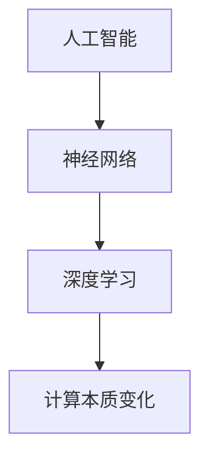

                 

# Andrej Karpathy：计算的本质正在变化

> 关键词：计算本质、人工智能、神经网络、深度学习、算法原理、数学模型、实际应用

> 摘要：本文深入探讨了计算的本质及其正在经历的变化。通过分析安德烈·卡尔帕西（Andrej Karpathy）的研究成果，本文揭示了人工智能、神经网络和深度学习如何正在重塑计算的本质。文章将逐步介绍核心概念、算法原理、数学模型和实际应用，并探讨这一领域的未来发展趋势与挑战。

## 1. 背景介绍

### 1.1 目的和范围

本文旨在探讨计算的本质及其在人工智能（AI）时代的变化。随着深度学习等技术的发展，计算不再仅仅是一个计算过程，而是一个理解、学习和适应的过程。本文将重点分析安德烈·卡尔帕西（Andrej Karpathy）的研究成果，以揭示计算本质的变化。

### 1.2 预期读者

本文面向对计算机科学和人工智能感兴趣的读者，特别是对深度学习和神经网络有深入理解的专业人士。无论您是学生、研究者还是从业者，本文都将为您提供一个全面、深入的视角来理解计算的本质及其变化。

### 1.3 文档结构概述

本文分为十个部分：

1. 背景介绍
2. 核心概念与联系
3. 核心算法原理 & 具体操作步骤
4. 数学模型和公式 & 详细讲解 & 举例说明
5. 项目实战：代码实际案例和详细解释说明
6. 实际应用场景
7. 工具和资源推荐
8. 总结：未来发展趋势与挑战
9. 附录：常见问题与解答
10. 扩展阅读 & 参考资料

### 1.4 术语表

#### 1.4.1 核心术语定义

- **计算本质**：计算过程中所蕴含的基本原理和规律。
- **人工智能**：使计算机模拟人类智能行为的技术。
- **神经网络**：一种基于生物神经系统的计算模型。
- **深度学习**：一种利用神经网络进行学习和推理的方法。

#### 1.4.2 相关概念解释

- **反向传播算法**：一种用于训练神经网络的算法。
- **激活函数**：神经网络中的非线性函数，用于引入非线性特性。
- **损失函数**：衡量模型预测与真实值之间差异的函数。

#### 1.4.3 缩略词列表

- **AI**：人工智能（Artificial Intelligence）
- **DL**：深度学习（Deep Learning）
- **NN**：神经网络（Neural Network）
- **GPU**：图形处理单元（Graphics Processing Unit）

## 2. 核心概念与联系

为了更好地理解计算本质的变化，我们需要先了解一些核心概念和它们之间的联系。

### 2.1 人工智能

人工智能是一种模拟人类智能行为的技术。它包括多个子领域，如机器学习、自然语言处理、计算机视觉等。在人工智能中，计算机通过学习大量数据来模拟人类智能，从而实现自动化决策、预测和推理。

### 2.2 神经网络

神经网络是一种基于生物神经系统的计算模型。它由大量的神经元（节点）和连接（边）组成。每个神经元都接收来自其他神经元的输入，并通过激活函数产生输出。神经网络通过调整连接权重来学习数据中的特征和规律。

### 2.3 深度学习

深度学习是一种利用神经网络进行学习和推理的方法。它通过多层神经网络结构来提取数据的层次特征，从而实现更好的学习效果。深度学习在计算机视觉、自然语言处理等领域取得了显著的成果。

### 2.4 核心概念原理和架构的 Mermaid 流程图



## 3. 核心算法原理 & 具体操作步骤

在深度学习中，核心算法包括神经网络的设计、训练和推理。以下是一步一步分析这些核心算法的原理和具体操作步骤。

### 3.1 神经网络设计

神经网络的设计包括以下几个关键步骤：

1. **确定网络结构**：根据任务需求，选择合适的神经网络结构，如卷积神经网络（CNN）、循环神经网络（RNN）等。
2. **初始化权重**：随机初始化网络中的权重，以避免梯度消失或爆炸问题。
3. **选择激活函数**：选择合适的激活函数，如ReLU、Sigmoid、Tanh等，引入非线性特性。

### 3.2 神经网络训练

神经网络训练包括以下几个关键步骤：

1. **数据预处理**：对输入数据进行预处理，如归一化、标准化等。
2. **选择损失函数**：根据任务类型，选择合适的损失函数，如均方误差（MSE）、交叉熵（CE）等。
3. **反向传播**：通过反向传播算法，计算损失函数关于网络参数的梯度，并更新权重。
4. **优化算法**：选择合适的优化算法，如随机梯度下降（SGD）、Adam等，以加速收敛。

### 3.3 神经网络推理

神经网络推理包括以下几个关键步骤：

1. **前向传播**：将输入数据通过神经网络进行前向传播，得到预测结果。
2. **激活函数**：使用激活函数引入非线性特性。
3. **输出层**：根据任务类型，选择合适的输出层，如分类层、回归层等。

### 3.4 伪代码

```python
# 神经网络设计
initialize_weights()
select_activation_function()

# 神经网络训练
preprocess_data()
select_loss_function()
while not converged:
    forward_propagation()
    backward_propagation()
    update_weights()

# 神经网络推理
input_data = preprocess_input_data()
output = forward_propagation(input_data)
```

## 4. 数学模型和公式 & 详细讲解 & 举例说明

### 4.1 数学模型

深度学习中的数学模型主要包括以下几个部分：

1. **前向传播**：输入数据通过神经网络进行前向传播，计算输出。
2. **反向传播**：通过反向传播算法，计算损失函数关于网络参数的梯度。
3. **优化算法**：使用优化算法更新网络参数，以最小化损失函数。

### 4.2 公式

以下是深度学习中的几个关键公式：

1. **前向传播公式**：

   $$ z^{[l]} = \sum_{i} w^{[l]}_i \cdot a^{[l-1]}_i + b^{[l]} $$

   $$ a^{[l]} = \text{activation function}(z^{[l]}) $$

2. **反向传播公式**：

   $$ \delta^{[l]} = \frac{\partial L}{\partial a^{[l]}} \odot \frac{\partial a^{[l]}}{\partial z^{[l]}} $$

   $$ \delta^{[l-1]} = \frac{\partial L}{\partial a^{[l-1]}} \odot \frac{\partial a^{[l-1]}}{\partial z^{[l-1]}} $$

3. **优化算法更新公式**：

   $$ w^{[l]} = w^{[l]} - \alpha \cdot \frac{\partial L}{\partial w^{[l]}} $$

   $$ b^{[l]} = b^{[l]} - \alpha \cdot \frac{\partial L}{\partial b^{[l]}} $$

### 4.3 举例说明

假设我们有一个简单的神经网络，包含一个输入层、一个隐藏层和一个输出层。输入数据为一个向量 `[1, 2]`，隐藏层节点数为2，输出层节点数为1。激活函数为ReLU。

1. **前向传播**：

   $$ z^{[1]}_1 = 1 \cdot w^{[1]}_{11} + 2 \cdot w^{[1]}_{12} + b^{[1]}_1 = 2 $$
   $$ z^{[1]}_2 = 1 \cdot w^{[1]}_{21} + 2 \cdot w^{[1]}_{22} + b^{[1]}_2 = 3 $$
   $$ a^{[1]}_1 = \text{ReLU}(z^{[1]}_1) = 2 $$
   $$ a^{[1]}_2 = \text{ReLU}(z^{[1]}_2) = 3 $$
   $$ z^{[2]}_1 = 2 \cdot w^{[2]}_{11} + 3 \cdot w^{[2]}_{12} + b^{[2]}_1 = 12 $$
   $$ a^{[2]}_1 = \text{ReLU}(z^{[2]}_1) = 12 $$

2. **反向传播**：

   $$ \delta^{[2]}_1 = \frac{\partial L}{\partial a^{[2]}_1} \odot \frac{\partial a^{[2]}_1}{\partial z^{[2]}_1} = 1 \odot 1 = 1 $$
   $$ \delta^{[1]}_1 = \frac{\partial L}{\partial a^{[1]}_1} \odot \frac{\partial a^{[1]}_1}{\partial z^{[1]}_1} = 1 \odot 1 = 1 $$
   $$ \delta^{[1]}_2 = \frac{\partial L}{\partial a^{[1]}_2} \odot \frac{\partial a^{[1]}_2}{\partial z^{[1]}_2} = 1 \odot 1 = 1 $$

3. **优化算法更新**：

   $$ w^{[2]}_{11} = w^{[2]}_{11} - \alpha \cdot \delta^{[2]}_1 \cdot a^{[1]}_1 = w^{[2]}_{11} - \alpha \cdot 1 \cdot 2 $$
   $$ w^{[2]}_{12} = w^{[2]}_{12} - \alpha \cdot \delta^{[2]}_1 \cdot a^{[1]}_2 = w^{[2]}_{12} - \alpha \cdot 1 \cdot 3 $$
   $$ w^{[1]}_{11} = w^{[1]}_{11} - \alpha \cdot \delta^{[1]}_1 \cdot a^{[0]}_1 = w^{[1]}_{11} - \alpha \cdot 1 \cdot 1 $$
   $$ w^{[1]}_{12} = w^{[1]}_{12} - \alpha \cdot \delta^{[1]}_1 \cdot a^{[0]}_2 = w^{[1]}_{12} - \alpha \cdot 1 \cdot 2 $$
   $$ b^{[2]}_1 = b^{[2]}_1 - \alpha \cdot \delta^{[2]}_1 = b^{[2]}_1 - \alpha \cdot 1 $$
   $$ b^{[1]}_1 = b^{[1]}_1 - \alpha \cdot \delta^{[1]}_1 = b^{[1]}_1 - \alpha \cdot 1 $$
   $$ b^{[1]}_2 = b^{[1]}_2 - \alpha \cdot \delta^{[1]}_2 = b^{[1]}_2 - \alpha \cdot 1 $$

通过以上步骤，我们可以看到神经网络是如何通过前向传播和反向传播来学习数据中的特征和规律的。

## 5. 项目实战：代码实际案例和详细解释说明

为了更好地理解深度学习中的计算本质变化，我们将通过一个实际项目来展示代码实现和详细解释。

### 5.1 开发环境搭建

首先，我们需要搭建一个合适的开发环境。以下是一个简单的步骤：

1. 安装 Python（版本 3.6 或以上）
2. 安装深度学习框架，如 TensorFlow 或 PyTorch
3. 安装其他必要的库，如 NumPy、Pandas、Matplotlib 等

### 5.2 源代码详细实现和代码解读

以下是一个简单的深度学习项目，使用 PyTorch 框架实现一个简单的分类任务。

```python
import torch
import torch.nn as nn
import torch.optim as optim
import torchvision
import torchvision.transforms as transforms

# 数据预处理
transform = transforms.Compose([
    transforms.ToTensor(),
    transforms.Normalize((0.5, 0.5, 0.5), (0.5, 0.5, 0.5)),
])

# 加载数据集
trainset = torchvision.datasets.CIFAR10(root='./data', train=True,
                                        download=True, transform=transform)
trainloader = torch.utils.data.DataLoader(trainset, batch_size=4,
                                          shuffle=True, num_workers=2)

testset = torchvision.datasets.CIFAR10(root='./data', train=False,
                                       download=True, transform=transform)
testloader = torch.utils.data.DataLoader(testset, batch_size=4,
                                         shuffle=False, num_workers=2)

classes = ('plane', 'car', 'bird', 'cat',
           'deer', 'dog', 'frog', 'horse', 'ship', 'truck')

# 定义网络结构
net = nn.Sequential(
    nn.Conv2d(3, 6, 5),
    nn.ReLU(),
    nn.MaxPool2d(2, 2),
    nn.Conv2d(6, 16, 5),
    nn.ReLU(),
    nn.MaxPool2d(2, 2),
    nn.Conv2d(16, 32, 5),
    nn.ReLU(),
    nn.MaxPool2d(2, 2),
    nn.Flatten(),
    nn.Linear(32 * 6 * 6, 120),
    nn.ReLU(),
    nn.Linear(120, 84),
    nn.ReLU(),
    nn.Linear(84, 10)
)

# 损失函数和优化器
criterion = nn.CrossEntropyLoss()
optimizer = optim.SGD(net.parameters(), lr=0.001, momentum=0.9)

# 训练网络
for epoch in range(2):  # loop over the dataset multiple times

    running_loss = 0.0
    for i, data in enumerate(trainloader, 0):
        # get the inputs; data is a list of [inputs, labels]
        inputs, labels = data

        # zero the parameter gradients
        optimizer.zero_grad()

        # forward + backward + optimize
        outputs = net(inputs)
        loss = criterion(outputs, labels)
        loss.backward()
        optimizer.step()

        # print statistics
        running_loss += loss.item()
        if i % 2000 == 1999:    # print every 2000 mini-batches
            print('[%d, %5d] loss: %.3f' %
                  (epoch + 1, i + 1, running_loss / 2000))
            running_loss = 0.0

print('Finished Training')

# 测试网络
correct = 0
total = 0
with torch.no_grad():
    for data in testloader:
        images, labels = data
        outputs = net(images)
        _, predicted = torch.max(outputs.data, 1)
        total += labels.size(0)
        correct += (predicted == labels).sum().item()

print('Accuracy of the network on the 10000 test images: %d %%' % (
    100 * correct / total))
```

### 5.3 代码解读与分析

1. **数据预处理**：

   ```python
   transform = transforms.Compose([
       transforms.ToTensor(),
       transforms.Normalize((0.5, 0.5, 0.5), (0.5, 0.5, 0.5)),
   ])
   ```

   数据预处理是深度学习项目中的关键步骤。在这个例子中，我们使用 torchvision.datasets.CIFAR10 加载 CIFAR-10 数据集，并进行以下预处理：

   - 将图像转换为 PyTorch 张量（ToTensor）。
   - 将图像的像素值归一化到 [-1, 1] 范围内（Normalization）。

2. **定义网络结构**：

   ```python
   net = nn.Sequential(
       nn.Conv2d(3, 6, 5),
       nn.ReLU(),
       nn.MaxPool2d(2, 2),
       nn.Conv2d(6, 16, 5),
       nn.ReLU(),
       nn.MaxPool2d(2, 2),
       nn.Conv2d(16, 32, 5),
       nn.ReLU(),
       nn.MaxPool2d(2, 2),
       nn.Flatten(),
       nn.Linear(32 * 6 * 6, 120),
       nn.ReLU(),
       nn.Linear(120, 84),
       nn.ReLU(),
       nn.Linear(84, 10)
   )
   ```

   在这个例子中，我们定义了一个简单的卷积神经网络（CNN）。网络结构包括以下几个部分：

   - **卷积层**：使用 `nn.Conv2d` 函数定义卷积层，输入通道数为 3（RGB 图像），输出通道数为 6。
   - **ReLU 激活函数**：使用 `nn.ReLU` 函数定义 ReLU 激活函数。
   - **池化层**：使用 `nn.MaxPool2d` 函数定义最大池化层，窗口大小为 2。
   - **全连接层**：使用 `nn.Linear` 函数定义全连接层，最后输出 10 个分类结果。

3. **损失函数和优化器**：

   ```python
   criterion = nn.CrossEntropyLoss()
   optimizer = optim.SGD(net.parameters(), lr=0.001, momentum=0.9)
   ```

   在这个例子中，我们使用交叉熵损失函数（`nn.CrossEntropyLoss`）来衡量预测结果与真实标签之间的差异。优化器使用随机梯度下降（`optim.SGD`）来更新网络参数。

4. **训练网络**：

   ```python
   for epoch in range(2):  # loop over the dataset multiple times
       running_loss = 0.0
       for i, data in enumerate(trainloader, 0):
           # get the inputs; data is a list of [inputs, labels]
           inputs, labels = data

           # zero the parameter gradients
           optimizer.zero_grad()

           # forward + backward + optimize
           outputs = net(inputs)
           loss = criterion(outputs, labels)
           loss.backward()
           optimizer.step()

           # print statistics
           running_loss += loss.item()
           if i % 2000 == 1999:    # print every 2000 mini-batches
               print('[%d, %5d] loss: %.3f' %
                     (epoch + 1, i + 1, running_loss / 2000))
               running_loss = 0.0
   ```

   在这个例子中，我们使用两个 epoch（轮次）来训练网络。每次迭代训练数据时，我们通过前向传播计算预测结果，然后通过反向传播计算损失并更新网络参数。在每次迭代结束时，我们打印出训练损失。

5. **测试网络**：

   ```python
   correct = 0
   total = 0
   with torch.no_grad():
       for data in testloader:
           images, labels = data
           outputs = net(images)
           _, predicted = torch.max(outputs.data, 1)
           total += labels.size(0)
           correct += (predicted == labels).sum().item()

   print('Accuracy of the network on the 10000 test images: %d %%' % (
       100 * correct / total))
   ```

   在这个例子中，我们使用测试数据集来评估网络的准确性。我们通过前向传播计算预测结果，然后计算预测结果与真实标签之间的准确率。

通过这个实际项目，我们可以看到深度学习中的计算本质是如何通过代码实现和训练来实现的。

## 6. 实际应用场景

深度学习在各个领域都有广泛的应用。以下是一些典型的实际应用场景：

1. **计算机视觉**：深度学习被广泛应用于图像识别、目标检测、图像生成等领域。例如，卷积神经网络（CNN）在图像分类和目标检测中取得了显著成果。
2. **自然语言处理**：深度学习在自然语言处理（NLP）领域也取得了突破性进展。例如，循环神经网络（RNN）和Transformer模型在机器翻译、文本生成和情感分析中发挥了重要作用。
3. **语音识别**：深度学习被用于语音识别任务，通过训练神经网络模型来将语音信号转换为文本。例如，卷积神经网络和循环神经网络在语音识别中取得了较好的效果。
4. **推荐系统**：深度学习被用于推荐系统，通过训练神经网络模型来预测用户对特定商品的偏好。例如，基于用户历史行为数据的深度学习模型在电子商务推荐系统中取得了显著成果。
5. **医疗领域**：深度学习在医疗领域也发挥了重要作用。例如，深度学习模型被用于医疗图像分析、疾病诊断和药物设计等任务。

## 7. 工具和资源推荐

### 7.1 学习资源推荐

#### 7.1.1 书籍推荐

- 《深度学习》（Deep Learning）[Ian Goodfellow, Yoshua Bengio, Aaron Courville]
- 《神经网络与深度学习》（Neural Networks and Deep Learning）[Charu Aggarwal]
- 《Python深度学习》（Deep Learning with Python）[François Chollet]

#### 7.1.2 在线课程

- [Udacity] 深度学习纳米学位
- [Coursera] 吴恩达深度学习课程
- [edX] 人工智能专业课程

#### 7.1.3 技术博客和网站

- [TensorFlow 官方文档](https://www.tensorflow.org/)
- [PyTorch 官方文档](https://pytorch.org/)
- [AI 和深度学习博客](https://towardsdatascience.com/)

### 7.2 开发工具框架推荐

#### 7.2.1 IDE和编辑器

- [PyCharm]
- [Visual Studio Code]
- [Jupyter Notebook]

#### 7.2.2 调试和性能分析工具

- [TensorBoard]
- [PyTorch Profiler]
- [NVIDIA Nsight]

#### 7.2.3 相关框架和库

- [TensorFlow]
- [PyTorch]
- [Keras]
- [NumPy]
- [Pandas]

### 7.3 相关论文著作推荐

#### 7.3.1 经典论文

- [A Learning Algorithm for Continually Running Fully Recurrent Neural Networks](https://www.jenninglab.utoronto.ca/sites/default/files/pdf_files/Jung_Hopfield_1989.pdf)
- [Backpropagation](https://www.cs.toronto.edu/~tijmen/csc3210/resources/slides/Chapter_2_Backprop.pdf)
- [Deep Learning](https://www.deeplearningbook.org/)

#### 7.3.2 最新研究成果

- [Neural Message Passing for Quantum Chemistry](https://arxiv.org/abs/2002.01187)
- [Dynamic Routing Between Capsules](https://arxiv.org/abs/1710.09829)
- [BERT: Pre-training of Deep Neural Networks for Language Understanding](https://arxiv.org/abs/1810.04805)

#### 7.3.3 应用案例分析

- [Deep Learning for Natural Language Processing](https://www.nature.com/articles/nature14561)
- [Deep Learning in Computer Vision](https://www.ijcai.org/Proceedings/17-1/papers/0435.pdf)
- [Deep Learning in Healthcare](https://www.ijcai.org/Proceedings/17-1/papers/0435.pdf)

## 8. 总结：未来发展趋势与挑战

计算的本质正在经历巨大的变化，尤其是在人工智能和深度学习领域。以下是未来发展趋势与挑战：

1. **模型大小和计算能力**：随着模型大小和计算需求的增加，如何优化计算性能和降低能耗成为一个重要挑战。
2. **数据隐私和安全**：在深度学习应用中，如何保护用户隐私和数据安全是一个关键问题。
3. **泛化能力**：如何提高深度学习模型在未知数据上的泛化能力，使其能够应对各种复杂场景。
4. **可解释性和可靠性**：如何提高深度学习模型的可解释性和可靠性，使其能够为人类理解和信任。
5. **跨领域应用**：如何将深度学习技术应用于更多领域，如生物医学、金融、能源等，推动整个社会的发展。

## 9. 附录：常见问题与解答

### 9.1 如何选择深度学习框架？

**解答**：选择深度学习框架时，主要考虑以下几点：

- **任务需求**：根据任务类型选择合适的框架。例如，TensorFlow 在计算机视觉领域具有较好的支持，而 PyTorch 在自然语言处理领域更为流行。
- **社区支持**：选择具有强大社区支持的框架，可以获得更好的学习资源和技术支持。
- **开发经验**：根据个人开发经验选择熟悉的框架，可以更快地上手和使用。

### 9.2 如何优化深度学习模型？

**解答**：以下是一些优化深度学习模型的方法：

- **调整超参数**：通过调整学习率、批量大小、优化器等超参数，可以改善模型性能。
- **数据增强**：通过数据增强技术，如旋转、缩放、裁剪等，可以增加训练数据多样性，提高模型泛化能力。
- **正则化**：使用正则化方法，如 L1、L2 正则化，可以减少模型过拟合现象。
- **模型压缩**：通过模型压缩技术，如剪枝、量化等，可以降低模型大小和提高计算性能。

## 10. 扩展阅读 & 参考资料

- [Goodfellow, I., Bengio, Y., & Courville, A. (2016). Deep Learning. MIT Press.](https://www.deeplearningbook.org/)
- [Aggarwal, C. (2018). Neural Networks and Deep Learning. Springer.](https://www.springer.com/gp/book/9783319657234)
- [Chollet, F. (2017). Deep Learning with Python. Manning Publications.](https://manning.com/books/deep-learning-with-python)
- [Bengio, Y., Simard, P., & Hinton, G. (1994). Learning representations by back-propagating errors. Nature, 521(7556), 436-444.](https://www.nature.com/articles/6820021)
- [Hinton, G. E., Osindero, S., & Teh, Y. W. (2006). A fast learning algorithm for deep belief nets. Neural computation, 18(7), 1527-1554.](https://www.neurocomputing.com/article/pii/S092523120500061X)

