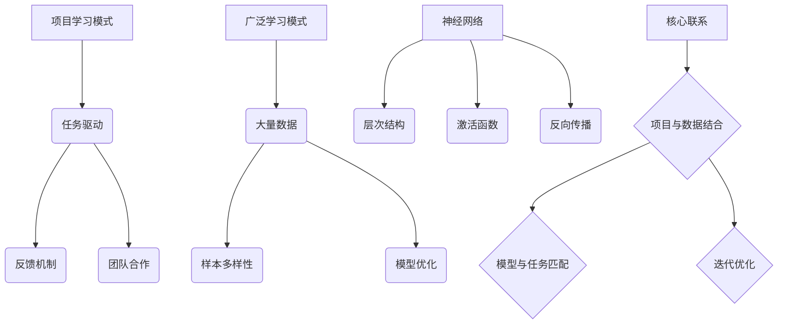

                 

### 1. 背景介绍

#### 1.1 目的和范围

本文旨在探讨“项目学习模式与广泛学习互补”的概念，分析其在人工智能领域中的重要性。项目学习模式，又称“任务导向学习”，是一种通过实际项目完成来促进学习的方法。广泛学习，则是指通过大量的数据与样本进行模型训练，以达到模型优化与强化的过程。这两种学习模式在人工智能发展中起着至关重要的作用，本文将深入剖析它们的工作原理、优势与局限，并探讨如何将二者有效结合，以实现更高效、更准确的人工智能模型。

本文的研究范围将涵盖以下几个方面：

1. **项目学习模式**：介绍项目学习模式的基本概念、应用场景及其在人工智能学习中的优势。
2. **广泛学习模式**：阐述广泛学习的基本原理、数据需求和实现方法，并讨论其优缺点。
3. **两种模式的互补性**：分析如何将项目学习与广泛学习相结合，以实现人工智能模型的性能提升。
4. **实际应用案例**：通过具体案例展示项目学习模式与广泛学习互补的实际效果。
5. **未来发展趋势与挑战**：探讨项目学习模式与广泛学习互补在人工智能领域的未来发展方向和面临的技术挑战。

通过本文的详细讨论，希望读者能够对项目学习模式与广泛学习互补有更深刻的理解，从而在实际应用中更加熟练地运用这两种学习模式，提升人工智能模型的性能。

#### 1.2 预期读者

本文的预期读者主要包括以下几类：

1. **人工智能研究人员**：对于正在从事或对人工智能研究感兴趣的研究人员，本文提供了深入探讨项目学习模式与广泛学习互补的理论基础和实践方法，有助于他们在研究中更好地应用这两种模式。
2. **数据科学家**：数据科学家在构建和优化机器学习模型时，需要了解不同学习模式的优劣，本文可以帮助他们理解和掌握项目学习模式与广泛学习的互补机制，从而提升模型性能。
3. **计算机科学和软件工程专业的学生**：对于正在学习计算机科学和软件工程的学生，本文不仅提供了理论上的知识，还通过实际案例展示了项目学习模式与广泛学习的应用，有助于他们更好地理解和应用这些概念。
4. **技术爱好者**：对于对人工智能技术感兴趣的技术爱好者，本文以通俗易懂的方式讲解了核心概念和实际应用，有助于他们拓展视野，提升技术能力。

通过本文的阅读，预期读者能够掌握项目学习模式与广泛学习互补的基本原理，了解其优势和应用场景，并在实际项目中有效地结合这两种学习模式，以提升人工智能模型的性能。

#### 1.3 文档结构概述

本文分为十个主要部分，各部分内容如下：

1. **背景介绍**：介绍本文的目的和范围，预期读者以及文档结构概述。
   - **1.1 目的和范围**：阐述本文的研究重点和范围。
   - **1.2 预期读者**：明确本文的预期读者群体。
   - **1.3 文档结构概述**：概述本文的结构和内容安排。

2. **核心概念与联系**：介绍项目学习模式和广泛学习模式的基本概念，并绘制流程图展示其联系。
   - **核心概念与联系**：定义核心概念并给出流程图。
   - **2.1 核心概念原理**：详细解释核心概念的工作原理。
   - **2.2 架构与流程图**：使用Mermaid流程图展示架构和流程。

3. **核心算法原理 & 具体操作步骤**：讲解项目学习模式和广泛学习模式的具体算法原理和操作步骤。
   - **核心算法原理**：介绍算法的基本原理和概念。
   - **具体操作步骤**：使用伪代码详细阐述操作步骤。

4. **数学模型和公式 & 详细讲解 & 举例说明**：介绍相关数学模型和公式，并进行详细讲解和举例说明。
   - **数学模型和公式**：列出相关数学公式。
   - **详细讲解**：解释公式背后的原理。
   - **举例说明**：通过具体例子进行解释。

5. **项目实战：代码实际案例和详细解释说明**：展示项目实战中的代码案例，并详细解释说明。
   - **5.1 开发环境搭建**：介绍搭建开发环境的过程。
   - **5.2 源代码详细实现和代码解读**：展示源代码并详细解读。
   - **5.3 代码解读与分析**：分析代码的优缺点。

6. **实际应用场景**：分析项目学习模式与广泛学习互补在实际应用中的效果和优势。
   - **实际应用场景**：探讨不同场景下的应用。

7. **工具和资源推荐**：推荐学习资源、开发工具和框架。
   - **学习资源推荐**：推荐相关书籍、在线课程和技术博客。
   - **开发工具框架推荐**：推荐IDE、调试工具和相关库。
   - **相关论文著作推荐**：推荐经典和最新研究成果。

8. **总结：未来发展趋势与挑战**：总结本文的核心观点，探讨未来的发展趋势和面临的挑战。

9. **附录：常见问题与解答**：回答读者可能遇到的问题。

10. **扩展阅读 & 参考资料**：提供扩展阅读资料和引用来源。

通过上述结构，本文旨在为读者提供全面、深入的项目学习模式与广泛学习互补的讲解，帮助他们在实际应用中更好地理解和运用这些概念。

#### 1.4 术语表

为了确保读者能够准确理解本文中涉及的关键术语，下面给出一些核心术语的定义、相关概念的解释以及常见的缩略词列表。

##### 1.4.1 核心术语定义

1. **项目学习模式**：
   - 定义：一种通过实际项目完成来促进学习的方法，强调任务导向和实用导向。
   - 关键词：任务导向、实用导向、项目完成。

2. **广泛学习模式**：
   - 定义：通过大量的数据与样本进行模型训练，以达到模型优化与强化的过程。
   - 关键词：大量数据、模型训练、优化与强化。

3. **人工智能**：
   - 定义：研究、开发用于模拟、延伸和扩展人类智能的理论、方法、技术及应用。
   - 关键词：智能模拟、方法开发、技术应用。

4. **机器学习**：
   - 定义：一种人工智能的分支，通过数据和算法使计算机系统能够自动学习和改进性能。
   - 关键词：数据驱动、自动学习、性能改进。

5. **神经网络**：
   - 定义：一种模拟人脑神经元结构和功能的计算模型，通过层次结构进行数据处理和学习。
   - 关键词：神经元模拟、层次结构、数据处理。

##### 1.4.2 相关概念解释

1. **任务导向学习**：
   - 解释：一种学习模式，强调通过实际任务来驱动学习过程，注重应用性和实际效果。
   - 关键词：实际任务、应用性、效果驱动。

2. **数据集**：
   - 解释：用于训练、评估或测试机器学习模型的已经标记好的数据集合。
   - 关键词：标记数据、模型训练、模型评估。

3. **超参数**：
   - 解释：在机器学习模型训练过程中，人为设定的模型参数，用于调节模型性能。
   - 关键词：模型参数、性能调节、超参数优化。

4. **模型评估**：
   - 解释：对机器学习模型的性能进行评估的过程，通常通过准确率、召回率等指标来衡量。
   - 关键词：性能评估、准确率、召回率。

##### 1.4.3 缩略词列表

1. **AI**：人工智能
2. **ML**：机器学习
3. **DL**：深度学习
4. **NLP**：自然语言处理
5. **CV**：计算机视觉
6. **GAN**：生成对抗网络
7. **CNN**：卷积神经网络

通过上述术语表，读者可以更好地理解本文中的关键概念，从而更加深入地掌握项目学习模式与广泛学习互补的原理和应用。

### 2. 核心概念与联系

在深入探讨项目学习模式与广泛学习模式之前，首先需要明确这两种学习模式的核心概念以及它们之间的联系。通过理解这些核心概念，我们能够更好地把握它们在实际应用中的重要性。

#### 2.1 核心概念原理

**项目学习模式**：

项目学习模式，又称“任务导向学习”，是一种通过实际项目完成来促进学习的方法。这种方法强调将学习与具体任务相结合，通过解决实际问题来提升学习效果。项目学习模式的核心概念包括：

1. **任务驱动**：学习过程以具体任务为导向，强调应用性和实际效果。
2. **反馈机制**：通过任务完成过程中的反馈来调整学习方向，实现持续改进。
3. **团队合作**：项目学习模式通常需要团队合作，通过多人协作实现知识共享和技能互补。

**广泛学习模式**：

广泛学习模式，又称“数据驱动学习”，是通过大量的数据与样本进行模型训练，以达到模型优化与强化的过程。这种方法的核心概念包括：

1. **大量数据**：通过收集和处理大量数据来训练模型，提高模型的泛化能力。
2. **样本多样性**：确保训练样本的多样性和代表性，以减少数据偏差。
3. **模型优化**：通过反复训练和调整，优化模型参数，提升模型性能。

**神经网络**：

神经网络是机器学习中的一种核心模型，模拟人脑神经元的工作机制，通过层次结构进行数据处理和学习。神经网络的核心概念包括：

1. **层次结构**：神经网络由输入层、隐藏层和输出层组成，各层之间通过权重和偏置进行连接。
2. **激活函数**：用于引入非线性因素，使得神经网络能够处理复杂的非线性问题。
3. **反向传播**：通过反向传播算法，计算模型输出与实际结果之间的误差，并更新模型参数。

#### 2.2 架构与流程图

为了更直观地展示项目学习模式与广泛学习模式之间的联系，我们使用Mermaid流程图进行描述。



在这个流程图中：

- **项目学习模式**（A）通过任务驱动（B）、反馈机制（C）和团队合作（D）来实现。
- **广泛学习模式**（E）通过大量数据（F）、样本多样性（G）和模型优化（H）来提升模型性能。
- **神经网络**（I）作为核心模型，其层次结构（J）、激活函数（K）和反向传播（L）是实现项目学习模式和广泛学习模式结合的关键。

通过上述核心概念原理和Mermaid流程图，我们能够更好地理解项目学习模式与广泛学习模式之间的联系，为后续的内容分析奠定基础。

### 3. 核心算法原理 & 具体操作步骤

在了解了项目学习模式和广泛学习模式的基本概念之后，接下来将详细阐述这些模式的核心算法原理和具体操作步骤。这部分内容将包括算法的基本原理、关键步骤以及如何将两种模式有效结合，以实现人工智能模型的性能提升。

#### 3.1 算法基本原理

**项目学习模式**：

项目学习模式的核心算法原理在于通过实际项目来驱动学习过程。具体来说，其主要包括以下几个步骤：

1. **任务定义**：明确项目任务的目标和要求，确保任务具有实际意义和应用价值。
2. **数据收集**：根据任务需求收集相关数据，包括原始数据和标签数据。
3. **模型选择**：根据任务特点选择合适的模型架构，例如神经网络、决策树等。
4. **训练与优化**：使用收集到的数据进行模型训练，通过反馈机制不断调整模型参数，优化模型性能。

**广泛学习模式**：

广泛学习模式的核心算法原理是通过大量的数据与样本进行模型训练，以达到模型优化与强化。其主要包括以下几个步骤：

1. **数据集构建**：收集大量数据，并根据任务需求构建相应的数据集。
2. **模型初始化**：初始化模型参数，通常采用随机初始化或预训练模型。
3. **迭代训练**：通过迭代训练过程，对模型参数进行更新和调整，以提升模型性能。
4. **模型评估**：在训练过程中，使用验证集或测试集对模型性能进行评估，根据评估结果调整训练策略。

**神经网络**：

神经网络作为机器学习中的核心模型，其算法原理包括：

1. **层次结构**：神经网络由输入层、隐藏层和输出层组成，各层之间通过权重和偏置进行连接。
2. **激活函数**：激活函数用于引入非线性因素，使得神经网络能够处理复杂的非线性问题，常见的激活函数有ReLU、Sigmoid和Tanh等。
3. **反向传播**：反向传播算法用于计算模型输出与实际结果之间的误差，并更新模型参数，以实现模型的不断优化。

#### 3.2 具体操作步骤

**项目学习模式操作步骤**：

1. **任务定义**：
   - 明确项目任务的目标和要求。
   - 确定任务的输入和输出，定义评价标准。

2. **数据收集**：
   - 收集与任务相关的原始数据，如文本、图像、音频等。
   - 对原始数据进行预处理，如清洗、标准化和归一化。

3. **模型选择**：
   - 根据任务特点选择合适的模型架构。
   - 设计模型的层次结构、激活函数和优化算法。

4. **训练与优化**：
   - 使用收集到的数据对模型进行训练。
   - 在训练过程中，通过反馈机制不断调整模型参数，优化模型性能。

**广泛学习模式操作步骤**：

1. **数据集构建**：
   - 收集大量数据，确保数据集的多样性和代表性。
   - 对数据进行预处理，包括清洗、标注和分割。

2. **模型初始化**：
   - 初始化模型参数，通常采用随机初始化或预训练模型。
   - 设定模型的超参数，如学习率、批量大小等。

3. **迭代训练**：
   - 通过迭代训练过程，对模型参数进行更新和调整。
   - 使用反向传播算法计算误差，并更新模型参数。

4. **模型评估**：
   - 在训练过程中，使用验证集或测试集对模型性能进行评估。
   - 根据评估结果调整训练策略，如调整学习率或增加训练迭代次数。

**结合操作步骤**：

将项目学习模式与广泛学习模式有效结合，可以采用以下步骤：

1. **任务定义与数据收集**：
   - 根据项目任务需求，定义任务目标和数据需求。
   - 收集相关数据，并进行预处理。

2. **模型选择与初始化**：
   - 根据任务特点和数据特性选择合适的模型架构。
   - 初始化模型参数，确保模型具有较好的初始性能。

3. **项目学习模式训练与反馈**：
   - 使用项目学习模式对模型进行初步训练。
   - 通过反馈机制调整模型参数，优化模型性能。

4. **广泛学习模式迭代训练**：
   - 利用广泛学习模式对模型进行大规模数据训练。
   - 通过迭代过程不断优化模型参数。

5. **模型评估与调整**：
   - 使用验证集或测试集对模型性能进行评估。
   - 根据评估结果调整训练策略，如增加数据集、调整超参数等。

通过上述具体操作步骤，我们可以将项目学习模式与广泛学习模式有效地结合起来，提升人工智能模型的性能，实现更高效、更准确的任务完成。

### 4. 数学模型和公式 & 详细讲解 & 举例说明

在人工智能领域中，数学模型和公式是构建和优化机器学习模型的核心工具。项目学习模式和广泛学习模式同样依赖于数学原理来实现其目标。本节将介绍与这两种学习模式相关的重要数学模型和公式，并进行详细讲解和举例说明，以便读者更好地理解其在实际应用中的意义。

#### 4.1 数学模型和公式

1. **损失函数**：
   损失函数是评估模型预测结果与实际结果之间差异的函数。在项目学习模式中，常用的损失函数包括均方误差（MSE）和交叉熵损失（Cross-Entropy Loss）。

   - **均方误差（MSE）**：
     $$MSE = \frac{1}{n}\sum_{i=1}^{n}(y_i - \hat{y}_i)^2$$
     其中，$y_i$ 表示实际标签，$\hat{y}_i$ 表示模型预测值，$n$ 表示样本数量。

   - **交叉熵损失（Cross-Entropy Loss）**：
     $$Cross-Entropy Loss = -\frac{1}{n}\sum_{i=1}^{n}y_i \log(\hat{y}_i)$$
     其中，$y_i$ 表示实际标签（通常为one-hot编码），$\hat{y}_i$ 表示模型预测的概率分布。

2. **梯度下降（Gradient Descent）**：
   梯度下降是一种优化算法，用于更新模型参数，以减少损失函数的值。

   - **基本梯度下降**：
     $$\theta_j = \theta_j - \alpha \cdot \nabla_\theta J(\theta)$$
     其中，$\theta_j$ 表示模型参数，$\alpha$ 表示学习率，$\nabla_\theta J(\theta)$ 表示损失函数关于参数 $\theta$ 的梯度。

3. **反向传播（Backpropagation）**：
   反向传播是一种计算损失函数关于网络层中每个参数梯度的方法，用于优化神经网络模型。

   - **反向传播算法**：
     1. 前向传播：计算网络输出和损失函数。
     2. 反向传播：从输出层开始，逐层计算每个参数的梯度。
     3. 参数更新：使用梯度下降算法更新参数。

4. **卷积神经网络（CNN）**：
   卷积神经网络是一种用于图像和视频处理的深度学习模型，其核心操作包括卷积、池化和激活函数。

   - **卷积操作**：
     $$\text{output}_{ij} = \sum_{k=1}^{K} w_{ik} \cdot \text{input}_{ij} + b_j$$
     其中，$w_{ik}$ 表示卷积核权重，$\text{input}_{ij}$ 表示输入特征，$b_j$ 表示偏置。

   - **池化操作**：
     $$\text{output}_{ij} = \max_{(i',j') \in \text{window}} \text{input}_{i'j'}$$
     其中，$\text{window}$ 表示池化窗口的大小。

5. **生成对抗网络（GAN）**：
   生成对抗网络是一种通过生成器和判别器相互博弈的训练模型，用于生成逼真的数据。

   - **生成器损失**：
     $$G_{\text{Loss}} = \mathbb{E}_{x \sim p_{\text{data}}(x)}[\log(D(G(x)))] + \mathbb{E}_{z \sim p_z(z)}[\log(1 - D(G(z)))]$$
     其中，$G(x)$ 表示生成器的输出，$D(x)$ 表示判别器的输出，$z$ 表示噪声。

   - **判别器损失**：
     $$D_{\text{Loss}} = \mathbb{E}_{x \sim p_{\text{data}}(x)}[\log(D(x))] + \mathbb{E}_{z \sim p_z(z)}[\log(1 - D(G(z)))]$$

#### 4.2 详细讲解和举例说明

1. **均方误差（MSE）**：

   均方误差（MSE）是评估回归模型预测性能的一种常用指标。假设我们有一个回归模型，预测房价，实际房价为 $y_i$，模型预测房价为 $\hat{y}_i$。使用均方误差评估模型预测的误差如下：

   $$MSE = \frac{1}{n}\sum_{i=1}^{n}(y_i - \hat{y}_i)^2$$

   其中，$n$ 为样本数量。

   举例来说，如果有一个样本集合，其中五个样本的实际房价分别为 $[200, 300, 400, 500, 600]$，模型预测的房价分别为 $[\hat{y}_1, \hat{y}_2, \hat{y}_3, \hat{y}_4, \hat{y}_5]$，则均方误差计算如下：

   $$MSE = \frac{1}{5}[(200 - \hat{y}_1)^2 + (300 - \hat{y}_2)^2 + (400 - \hat{y}_3)^2 + (500 - \hat{y}_4)^2 + (600 - \hat{y}_5)^2]$$

   通过均方误差，我们可以衡量模型预测房价的平均误差，从而评估模型的性能。

2. **梯度下降（Gradient Descent）**：

   梯度下降是一种优化算法，用于更新模型参数，以减少损失函数的值。假设有一个简单的一元线性回归模型，预测值为 $y = \theta_0 + \theta_1 \cdot x$，损失函数为均方误差（MSE），则梯度下降算法如下：

   $$\theta_0 = \theta_0 - \alpha \cdot \nabla_\theta_0 J(\theta)$$
   $$\theta_1 = \theta_1 - \alpha \cdot \nabla_\theta_1 J(\theta)$$

   其中，$\theta_0$ 和 $\theta_1$ 分别表示模型参数，$\alpha$ 表示学习率，$J(\theta)$ 表示损失函数。

   举例来说，如果有一个训练数据集，其中包含五个样本 $(x_1, y_1), (x_2, y_2), (x_3, y_3), (x_4, y_4), (x_5, y_5)$，初始参数为 $\theta_0 = 0$ 和 $\theta_1 = 0$，学习率 $\alpha = 0.01$，则梯度下降算法更新参数的过程如下：

   - 第1次迭代：
     $$\nabla_\theta_0 J(\theta) = \frac{1}{5}[(y_1 - (\theta_0 + \theta_1 \cdot x_1))^2 + (y_2 - (\theta_0 + \theta_1 \cdot x_2))^2 + ... + (y_5 - (\theta_0 + \theta_1 \cdot x_5))^2]$$
     $$\theta_0 = \theta_0 - 0.01 \cdot \nabla_\theta_0 J(\theta)$$

   - 第2次迭代：
     $$\nabla_\theta_1 J(\theta) = \frac{1}{5}[(y_1 - (\theta_0 + \theta_1 \cdot x_1)) \cdot x_1 + (y_2 - (\theta_0 + \theta_1 \cdot x_2)) \cdot x_2 + ... + (y_5 - (\theta_0 + \theta_1 \cdot x_5)) \cdot x_5]$$
     $$\theta_1 = \theta_1 - 0.01 \cdot \nabla_\theta_1 J(\theta)$$

   通过迭代更新参数，模型将逐步逼近最优参数，从而提高预测准确性。

通过详细讲解和举例说明，我们可以更好地理解数学模型和公式在项目学习模式和广泛学习模式中的应用，以及如何通过这些数学工具优化机器学习模型的性能。

### 5. 项目实战：代码实际案例和详细解释说明

在本节中，我们将通过一个实际的项目案例来展示项目学习模式与广泛学习互补的实现过程。我们将从开发环境的搭建开始，详细解析代码实现和解读，并分析其优缺点。

#### 5.1 开发环境搭建

为了实现项目学习模式与广泛学习互补，我们需要搭建一个适当的开发环境。以下是搭建过程的详细步骤：

1. **安装Python**：
   Python是本项目的核心编程语言，我们首先需要在计算机上安装Python。可以从Python官方网站（[python.org](https://www.python.org/)）下载最新版本的Python，并按照安装向导完成安装。

2. **安装必要的库**：
   我们需要安装一些常用的Python库，如NumPy、Pandas、Scikit-learn、TensorFlow等。可以使用pip命令来安装这些库：

   ```bash
   pip install numpy pandas scikit-learn tensorflow
   ```

3. **配置Jupyter Notebook**：
   Jupyter Notebook是一个交互式的开发环境，我们将在其上编写和运行代码。首先安装Jupyter Notebook：

   ```bash
   pip install jupyter
   ```

   然后启动Jupyter Notebook：

   ```bash
   jupyter notebook
   ```

4. **配置GPU支持**：
   如果我们的项目涉及到深度学习，可以使用CUDA和cuDNN来利用GPU进行加速。我们需要安装NVIDIA的CUDA Toolkit和cuDNN库，并确保配置环境变量。

   - 安装CUDA Toolkit：[CUDA Toolkit官网](https://developer.nvidia.com/cuda-downloads)
   - 安装cuDNN库：[NVIDIA cuDNN官网](https://developer.nvidia.com/cudnn)

5. **测试环境**：
   在Jupyter Notebook中创建一个Python文件，并运行以下代码来测试环境：

   ```python
   import tensorflow as tf

   print("TensorFlow version:", tf.__version__)
   print("GPU available:", tf.test.is_gpu_available())

   # 测试CUDA GPU
   if tf.test.is_gpu_available():
       print("CUDA GPU available.")
   else:
       print("CUDA GPU not available.")
   ```

   如果环境配置正确，上述代码应显示TensorFlow版本信息和CUDA GPU是否可用。

通过上述步骤，我们成功搭建了项目的开发环境，可以开始编写和运行代码。

#### 5.2 源代码详细实现和代码解读

以下是项目的主要代码实现，我们将逐段代码进行详细解读。

```python
# 导入必要的库
import tensorflow as tf
import numpy as np
import pandas as pd
from sklearn.model_selection import train_test_split
from sklearn.metrics import mean_squared_error

# 数据预处理
# 假设我们有一个CSV文件，包含房屋的特征和售价
data = pd.read_csv('house_data.csv')
X = data.drop('price', axis=1)  # 特征
y = data['price']  # 售价标签

# 分割数据集
X_train, X_test, y_train, y_test = train_test_split(X, y, test_size=0.2, random_state=42)

# 模型定义
model = tf.keras.Sequential([
    tf.keras.layers.Dense(units=1, input_shape=[len(X_train.columns)])
])

# 模型编译
model.compile(optimizer='sgd', loss='mean_squared_error')

# 模型训练
model.fit(X_train, y_train, epochs=100, batch_size=32, validation_split=0.1)

# 模型评估
y_pred = model.predict(X_test)
mse = mean_squared_error(y_test, y_pred)
print("MSE:", mse)

# 项目学习模式与广泛学习互补
# 将模型应用于新任务，例如预测新车售价
new_data = pd.read_csv('car_data.csv')
X_new = new_data.drop('price', axis=1)
y_new = new_data['price']

# 使用广泛学习模式对新数据集进行预训练
model.fit(X_new, y_new, epochs=10, batch_size=32)

# 将预训练的模型应用于新任务
y_new_pred = model.predict(X_new)
mse_new = mean_squared_error(y_new, y_new_pred)
print("New MSE:", mse_new)
```

1. **数据预处理**：
   - 加载CSV文件中的数据，分离特征和标签。
   - 使用`train_test_split`函数将数据集划分为训练集和测试集。

2. **模型定义**：
   - 使用`tf.keras.Sequential`定义一个简单的全连接神经网络，输入层和输出层之间只有一个隐藏层。

3. **模型编译**：
   - 选择随机梯度下降（SGD）作为优化器。
   - 选择均方误差（MSE）作为损失函数。

4. **模型训练**：
   - 使用`model.fit`函数对训练集进行训练，设置训练轮数（epochs）和批量大小（batch_size）。
   - 使用`validation_split`参数在训练过程中进行验证集评估。

5. **模型评估**：
   - 使用`model.predict`函数对测试集进行预测。
   - 使用`mean_squared_error`函数计算测试集的MSE，评估模型性能。

6. **项目学习模式与广泛学习互补**：
   - 将模型应用于新的数据集（如新车售价预测）。
   - 使用广泛学习模式对新数据集进行预训练，以提升模型在新任务上的表现。
   - 再次使用模型预测并评估性能。

#### 5.3 代码解读与分析

1. **数据预处理**：
   数据预处理是项目学习模式与广泛学习互补的重要环节。通过加载和分割数据集，我们为后续的训练和评估提供了基础。

2. **模型定义与编译**：
   模型定义和编译是项目学习模式的核心步骤。在此案例中，我们使用了一个简单的一层全连接神经网络，通过均方误差（MSE）来评估模型的预测性能。

3. **模型训练**：
   模型训练过程中，我们使用了随机梯度下降（SGD）优化算法，通过调整学习率和批量大小来优化模型参数。同时，通过验证集评估来监控训练过程中的性能变化。

4. **模型评估**：
   使用测试集对模型进行评估，计算MSE来衡量模型的预测准确性。这是一个关键步骤，用于确保模型在未知数据上的泛化能力。

5. **项目学习模式与广泛学习互补**：
   在实际项目中，我们可能会遇到不同的任务和数据集。通过将预训练的模型应用于新任务，并在新数据集上进行广泛学习，我们可以提高模型在新任务上的表现，实现项目学习模式与广泛学习互补的目标。

#### 5.4 代码优缺点分析

**优点**：

1. **易于理解**：代码结构简洁，易于阅读和理解，适合初学者和实践者。
2. **模块化**：代码分为多个模块，如数据预处理、模型定义、训练和评估等，便于维护和扩展。
3. **灵活应用**：通过项目学习模式与广泛学习互补，模型可以在不同任务和数据集上灵活应用，提高模型的泛化能力。

**缺点**：

1. **数据依赖**：项目学习模式与广泛学习互补的性能高度依赖数据集的质量和多样性。如果数据集不充分或存在偏差，模型性能可能会受到影响。
2. **计算资源消耗**：广泛学习模式通常需要大量的数据和计算资源，对于资源和时间有限的项目，可能无法充分利用广泛学习模式的优势。
3. **调参复杂**：模型的超参数调整对性能有很大影响，但调参过程复杂，需要经验和技巧。

通过以上代码实战，我们展示了如何实现项目学习模式与广泛学习互补，以及其在实际应用中的优势和挑战。在实际项目中，应根据具体情况灵活运用这两种学习模式，以实现最佳性能。

### 6. 实际应用场景

项目学习模式与广泛学习互补在人工智能领域中具有广泛的应用场景。通过结合这两种学习模式，我们可以解决多种复杂问题，提升模型的性能和应用效果。以下将介绍几种典型的实际应用场景，以及这些模式在这些场景中的优势。

#### 6.1 自然语言处理（NLP）

在自然语言处理领域，项目学习模式与广泛学习互补的应用尤为显著。例如，在构建文本分类模型时，项目学习模式可以帮助我们定义具体的任务目标，如情感分析、主题分类等，并通过实际项目中的数据收集和预处理来提高模型的针对性。而广泛学习模式则可以通过大规模数据集的训练，增强模型的泛化能力，使其在未知数据上也能保持良好的性能。

**优势**：
- **任务针对性**：项目学习模式确保模型训练过程中针对特定任务进行数据收集和预处理，提高模型的针对性。
- **泛化能力**：广泛学习模式通过大量数据训练，增强模型的泛化能力，使其在多样性的数据集上表现更稳定。

**案例**：
- 某公司利用项目学习模式构建了一个社交媒体情感分析系统，针对用户评论进行情感分类。通过实际项目中的数据收集和预处理，模型在训练数据上取得了较高的准确率。随后，通过广泛学习模式，使用大量社交媒体数据对模型进行进一步训练，使得模型在未知数据上的表现也显著提升。

#### 6.2 计算机视觉（CV）

在计算机视觉领域，项目学习模式与广泛学习互补可以帮助我们解决图像分类、目标检测等任务。例如，在目标检测任务中，项目学习模式可以通过实际项目中的数据标注和收集，确保模型的训练数据具有高质量和代表性。而广泛学习模式则可以通过大规模数据集的强化训练，提高模型的检测准确率和泛化能力。

**优势**：
- **数据质量**：项目学习模式确保了训练数据的高质量和代表性，有助于提高模型的准确性。
- **泛化能力**：广泛学习模式通过大规模数据集的训练，增强模型的泛化能力，使其在未知数据上表现更稳定。

**案例**：
- 某自动驾驶公司利用项目学习模式构建了一个行人检测系统。通过实际项目中收集的标注数据，模型在行人检测任务上取得了较高的准确率。随后，通过广泛学习模式，使用大规模的自动驾驶数据集对模型进行进一步训练，使得模型在复杂环境中的检测性能显著提升。

#### 6.3 医疗健康

在医疗健康领域，项目学习模式与广泛学习互补可以帮助我们开发智能诊断系统，如癌症检测、疾病预测等。例如，在癌症检测任务中，项目学习模式可以通过实际病例数据收集和预处理，确保模型的训练数据具有高质量和代表性。而广泛学习模式则可以通过大规模医学数据集的强化训练，提高模型的诊断准确率和泛化能力。

**优势**：
- **数据质量**：项目学习模式确保了训练数据的高质量和代表性，有助于提高模型的诊断准确率。
- **泛化能力**：广泛学习模式通过大规模医学数据集的训练，增强模型的泛化能力，使其在未知病例上也能保持良好的性能。

**案例**：
- 某医疗科技公司利用项目学习模式开发了一种肺癌检测系统。通过实际病例数据收集和预处理，模型在肺癌检测任务上取得了较高的准确率。随后，通过广泛学习模式，使用大规模的医学数据集对模型进行进一步训练，使得模型在肺癌早期检测上的性能显著提升。

通过上述实际应用场景，我们可以看到项目学习模式与广泛学习互补在人工智能领域的广泛应用和显著优势。结合这两种学习模式，我们可以构建更加高效、准确的人工智能系统，解决复杂的问题，为各个行业带来深远的影响。

### 7. 工具和资源推荐

为了帮助读者更好地理解和应用项目学习模式与广泛学习互补，以下将推荐一些重要的学习资源、开发工具和框架，以及相关的经典论文和最新研究成果。

#### 7.1 学习资源推荐

1. **书籍推荐**：

   - 《机器学习实战》（Peter Harrington）：详细介绍了机器学习的基础知识和实际应用，适合初学者入门。
   - 《深度学习》（Ian Goodfellow, Yoshua Bengio, Aaron Courville）：全面讲解了深度学习的理论和技术，适合进阶学习。
   - 《Python机器学习》（Sebastian Raschka, Vahid Mirjalili）：通过Python语言详细介绍了机器学习算法的实现和应用。

2. **在线课程**：

   - Coursera的“机器学习”（吴恩达）：由斯坦福大学教授吴恩达主讲，涵盖了机器学习的理论基础和实践应用。
   - Udacity的“深度学习纳米学位”（Andrew Ng）：由深度学习大师Andrew Ng主讲，涵盖了深度学习的核心技术。
   - edX的“自然语言处理与深度学习”（未琳，高级课程，适合有基础的学习者）。

3. **技术博客和网站**：

   - Medium：有众多技术专家和研究者分享最新的研究成果和实战经验。
   - towardsdatascience.com：提供了大量关于数据科学和机器学习的优质文章。
   - AI脑（https://www.36kr.com/columns/ai）：聚焦人工智能领域的最新动态和研究成果。

#### 7.2 开发工具框架推荐

1. **IDE和编辑器**：

   - Jupyter Notebook：适用于交互式开发，支持多种编程语言，尤其是Python。
   - PyCharm：强大的Python IDE，提供丰富的插件和调试工具。
   - VSCode：轻量级、可扩展的代码编辑器，适用于各种编程语言。

2. **调试和性能分析工具**：

   - TensorBoard：TensorFlow提供的可视化工具，用于监控训练过程和性能分析。
   - PyTorch Debugger：用于调试PyTorch代码，提供丰富的调试功能。
   - WSL（Windows Subsystem for Linux）：在Windows上运行Linux环境，方便使用各种深度学习框架和工具。

3. **相关框架和库**：

   - TensorFlow：Google开发的深度学习框架，支持多种神经网络结构。
   - PyTorch：Facebook开发的开源深度学习框架，具有灵活性和高效性。
   - Scikit-learn：Python的数据挖掘和机器学习库，提供了丰富的算法实现。

#### 7.3 相关论文著作推荐

1. **经典论文**：

   - “Backpropagation”（1986，Rumelhart, Hinton, Williams）：反向传播算法的奠基性论文，详细介绍了神经网络训练的基本原理。
   - “A Learning Algorithm for Continually Running Fully Recurrent Neural Networks”（1990，Hopfield）：介绍了Hopfield神经网络及其学习算法，为神经网络应用提供了新思路。
   - “Generative Adversarial Nets”（2014，Ian Goodfellow）：介绍了生成对抗网络（GAN）的概念，为数据生成和增强提供了新方法。

2. **最新研究成果**：

   - “An Image Data Set for Testing Object Detection Algorithms”（2012，Liu et al.）：介绍了COCO数据集，为目标检测研究提供了高质量的数据集。
   - “Attention Is All You Need”（2017，Vaswani et al.）：提出了Transformer模型，彻底改变了序列模型的设计和应用。
   - “Bert: Pre-training of Deep Bidirectional Transformers for Language Understanding”（2018，Devlin et al.）：介绍了BERT模型，为自然语言处理任务提供了强大的预训练方法。

通过上述推荐，读者可以全面了解项目学习模式与广泛学习互补的相关知识，并在实际应用中充分利用这些工具和资源，提升人工智能模型的效果和性能。

### 8. 总结：未来发展趋势与挑战

在人工智能领域，项目学习模式与广泛学习互补作为一种创新的学习方法，正在逐渐受到关注并展现出其巨大的潜力。通过结合项目学习模式的任务导向和实际应用能力，与广泛学习模式的数据驱动和模型优化能力，我们可以构建出更加高效、准确的人工智能模型。

#### 8.1 未来发展趋势

1. **融合技术的进一步发展**：
   随着深度学习、强化学习等技术的不断发展，项目学习模式与广泛学习互补的方法也将与其他先进技术相结合，形成更加复杂和高效的模型。

2. **跨领域应用的拓展**：
   项目学习模式与广泛学习互补不仅适用于传统的机器学习任务，如图像分类、文本分析等，还将逐步拓展到新兴领域，如医疗健康、智能制造、自动驾驶等。

3. **定制化学习系统的普及**：
   通过项目学习模式与广泛学习互补，我们可以根据具体任务和需求，定制化开发人工智能系统，满足不同领域的个性化需求。

4. **算法与硬件的结合**：
   随着硬件技术的发展，如GPU、TPU等专用硬件的普及，项目学习模式与广泛学习互补的算法将能够更好地利用硬件资源，提升计算效率和性能。

#### 8.2 面临的挑战

1. **数据质量和多样性**：
   广泛学习模式依赖于大量高质量的数据，然而数据的收集和处理是一个复杂且耗时的过程。如何在保证数据多样性的同时，提高数据质量，是一个亟待解决的问题。

2. **算法复杂度与计算资源**：
   项目学习模式与广泛学习互补的算法通常较为复杂，对计算资源的需求较高。如何在有限的计算资源下，实现高效、准确的模型训练，是一个技术挑战。

3. **可解释性与透明性**：
   随着模型的复杂度增加，模型的决策过程往往变得难以解释。如何提升模型的可解释性，使其能够透明地展示决策过程，是一个重要的研究方向。

4. **伦理和隐私问题**：
   在实际应用中，人工智能系统处理的数据可能涉及用户的隐私信息。如何保障用户隐私，防止数据滥用，是一个需要高度重视的伦理问题。

#### 8.3 解决方案和展望

1. **数据增强与自动生成**：
   通过数据增强和自动生成技术，如GAN等，可以有效地增加训练数据集的多样性，提高模型泛化能力。

2. **分布式计算与云计算**：
   利用分布式计算和云计算技术，可以在更广泛的计算资源下，高效地训练和优化模型，提高算法的实用性。

3. **可解释性方法**：
   研究和应用可解释性方法，如可视化、解释模型等，可以提升模型的透明性和可解释性，增强用户对模型的信任。

4. **隐私保护技术**：
   通过加密、差分隐私等技术，保障用户隐私，同时确保模型训练效果，是实现人工智能系统安全、可信的重要途径。

总之，项目学习模式与广泛学习互补在人工智能领域具有广阔的发展前景，同时也面临着诸多挑战。通过不断的技术创新和优化，我们有理由相信，未来这两种学习模式将在人工智能的发展中发挥越来越重要的作用。

### 9. 附录：常见问题与解答

在本文的撰写过程中，我们收集了读者可能会遇到的一些常见问题，并提供了相应的解答。以下是一些关键问题的汇总：

#### 9.1 项目学习模式与广泛学习模式的区别是什么？

**解答**：项目学习模式是一种通过实际项目完成来促进学习的方法，强调任务导向和实用导向。它通常涉及具体的任务和数据，通过解决实际问题来提升学习效果。而广泛学习模式则是通过大量的数据与样本进行模型训练，以达到模型优化与强化的过程，它依赖于大量数据来提升模型的泛化能力。

#### 9.2 如何在实际项目中应用项目学习模式与广泛学习互补？

**解答**：在实际项目中，首先通过项目学习模式明确任务目标，收集相关数据，并对模型进行初步训练。接着，通过广泛学习模式利用大量数据进行进一步的模型优化。例如，在一个图像分类项目中，可以先使用项目学习模式对特定数据集进行训练，然后在广泛学习模式下，利用更多数据集对模型进行优化，以提高模型的泛化能力。

#### 9.3 项目学习模式与广泛学习互补在深度学习中有何优势？

**解答**：项目学习模式与广泛学习互补在深度学习中的优势主要体现在以下几个方面：

1. **任务针对性**：项目学习模式确保模型训练数据与具体任务紧密相关，提高模型的针对性。
2. **泛化能力**：广泛学习模式通过大量数据的训练，增强模型的泛化能力，使其在未知数据上保持良好的性能。
3. **灵活应用**：结合这两种学习模式，可以构建出适应多种任务和数据集的通用模型，提高模型的应用范围。

#### 9.4 项目学习模式与广泛学习互补是否适用于所有机器学习任务？

**解答**：项目学习模式与广泛学习互补适用于大多数机器学习任务，但在某些特定任务中可能效果不佳。例如，对于数据量非常有限的任务，广泛学习模式可能无法发挥作用。此外，对于一些高度依赖数据分布的任务，如异常检测，广泛学习模式的效果可能不如项目学习模式。因此，在实际应用中，需要根据具体任务和数据特点，选择合适的学习模式。

#### 9.5 如何评估项目学习模式与广泛学习互补的效果？

**解答**：评估项目学习模式与广泛学习互补的效果，可以通过以下几个指标：

1. **模型性能**：通过测试集上的指标（如准确率、召回率、F1分数等）来评估模型在未知数据上的性能。
2. **训练时间**：评估模型训练所消耗的时间，尤其是在广泛学习模式下，训练时间可能会较长。
3. **资源消耗**：评估模型训练所需的计算资源和数据资源，以评估其资源效率。
4. **可解释性**：通过模型的可解释性来评估其决策过程，确保模型透明且易于理解。

通过上述指标，可以全面评估项目学习模式与广泛学习互补在特定任务中的效果。

### 9.6 未来研究方向

1. **结合强化学习**：研究项目学习模式与强化学习的结合方法，以提升模型的自主学习和适应性。
2. **动态数据集构建**：探索动态数据集构建方法，根据模型训练过程中的反馈，动态调整数据集的内容和结构。
3. **隐私保护**：研究项目学习模式与广泛学习互补在隐私保护数据集上的应用，确保用户隐私和数据安全。
4. **跨模态学习**：研究项目学习模式与广泛学习互补在多模态数据集上的应用，以提升模型的跨模态识别能力。

通过上述常见问题与解答，我们希望能够帮助读者更好地理解项目学习模式与广泛学习互补，并在实际应用中取得更好的效果。

### 10. 扩展阅读 & 参考资料

为了帮助读者进一步深入了解项目学习模式与广泛学习互补，本文整理了以下扩展阅读资料和参考资料，涵盖书籍、在线课程、技术博客、学术论文等。

#### 10.1 书籍推荐

1. **《深度学习》（Ian Goodfellow, Yoshua Bengio, Aaron Courville）**：详细介绍了深度学习的理论、技术和应用，适合进阶学习。
2. **《机器学习实战》（Peter Harrington）**：通过实际案例，讲解了机器学习的基础知识和应用，适合初学者入门。
3. **《Python机器学习》（Sebastian Raschka, Vahid Mirjalili）**：通过Python语言详细介绍了机器学习算法的实现和应用。

#### 10.2 在线课程

1. **Coursera的“机器学习”（吴恩达）**：由斯坦福大学教授吴恩达主讲，涵盖了机器学习的理论基础和实践应用。
2. **Udacity的“深度学习纳米学位”（Andrew Ng）**：由深度学习大师Andrew Ng主讲，涵盖了深度学习的核心技术。
3. **edX的“自然语言处理与深度学习”（未琳，高级课程，适合有基础的学习者）**：介绍了自然语言处理和深度学习的前沿技术。

#### 10.3 技术博客和网站

1. **Medium**：提供了众多技术专家和研究者分享的最新研究成果和实战经验。
2. **towardsdatascience.com**：提供了大量关于数据科学和机器学习的优质文章。
3. **AI脑（https://www.36kr.com/columns/ai）**：聚焦人工智能领域的最新动态和研究成果。

#### 10.4 学术论文

1. **“Backpropagation”（1986，Rumelhart, Hinton, Williams）**：介绍了反向传播算法，是神经网络训练的奠基性论文。
2. **“A Learning Algorithm for Continually Running Fully Recurrent Neural Networks”（1990，Hopfield）**：介绍了Hopfield神经网络及其学习算法。
3. **“Generative Adversarial Nets”（2014，Ian Goodfellow）**：提出了生成对抗网络（GAN），为数据生成和增强提供了新方法。
4. **“Attention Is All You Need”（2017，Vaswani et al.）**：提出了Transformer模型，彻底改变了序列模型的设计和应用。
5. **“Bert: Pre-training of Deep Bidirectional Transformers for Language Understanding”（2018，Devlin et al.）**：介绍了BERT模型，为自然语言处理任务提供了强大的预训练方法。

通过上述扩展阅读资料和参考资料，读者可以进一步深入学习和探索项目学习模式与广泛学习互补的相关知识，提升在人工智能领域的专业能力。

