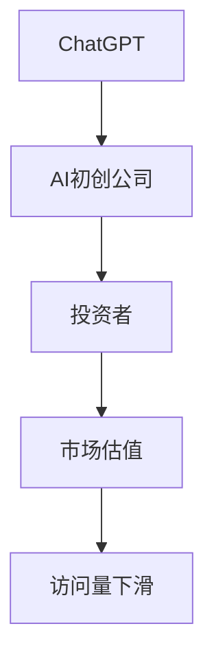

                 

# ChatGPT访问量下滑, AI初创公司估值过高

> 关键词：ChatGPT、访问量、下滑、AI初创公司、估值过高

> 摘要：本文将分析ChatGPT访问量下滑的原因，探讨AI初创公司估值过高的现象，并提出应对策略和建议，以期为AI领域的未来发展提供有益的思考。

## 1. 背景介绍

### 1.1 目的和范围

本文旨在探讨AI领域两大热点现象：ChatGPT访问量下滑和AI初创公司估值过高。通过分析原因、影响和应对策略，为AI行业的健康发展提供参考。

### 1.2 预期读者

本文主要面向对AI技术感兴趣的读者，包括AI研究者、开发者、创业者以及相关领域的从业者。

### 1.3 文档结构概述

本文分为十个部分，包括背景介绍、核心概念与联系、核心算法原理与操作步骤、数学模型和公式、项目实战、实际应用场景、工具和资源推荐、总结、常见问题与解答及扩展阅读。

### 1.4 术语表

#### 1.4.1 核心术语定义

- ChatGPT：一个基于GPT-3的聊天机器人，由OpenAI开发。
- 访问量：网站或应用程序在一定时间内被访问的次数。
- AI初创公司：指从事人工智能领域研究的初创企业。

#### 1.4.2 相关概念解释

- 估值过高：指企业的市场估值高于其实际价值。
- 下滑：指访问量或估值等指标出现下降趋势。

#### 1.4.3 缩略词列表

- AI：人工智能
- GPT：生成预训练网络（Generative Pre-trained Transformer）

## 2. 核心概念与联系

在分析ChatGPT访问量下滑和AI初创公司估值过高之前，我们首先需要了解它们背后的核心概念与联系。

### 2.1 ChatGPT

ChatGPT是基于GPT-3模型的聊天机器人，具有强大的文本生成和理解能力。其成功之处在于能够与人类进行自然语言交互，为用户提供有用的信息和帮助。

### 2.2 AI初创公司

AI初创公司是从事人工智能领域研究的初创企业。它们通常专注于某一特定技术或应用领域，如自然语言处理、计算机视觉等。随着AI技术的快速发展，AI初创公司得到了资本市场的青睐。

### 2.3 ChatGPT与AI初创公司

ChatGPT作为AI技术的一个重要应用案例，吸引了大量用户和投资者的关注。而AI初创公司则希望通过开发类似的技术产品，获得更高的市场估值。

### 2.4 Mermaid流程图

以下是一个简单的Mermaid流程图，展示ChatGPT与AI初创公司之间的联系：



## 3. 核心算法原理 & 具体操作步骤

### 3.1 ChatGPT算法原理

ChatGPT是基于GPT-3模型的聊天机器人。GPT-3是一种生成预训练网络，通过在大量文本数据上进行预训练，学习语言模式和语法规则。具体来说，GPT-3采用Transformer架构，具有1750亿个参数，能够生成高质量的自然语言文本。

### 3.2 ChatGPT操作步骤

1. 收集大量文本数据，并进行预处理。
2. 使用预训练模型GPT-3，对文本数据进行训练。
3. 构建聊天界面，接收用户输入。
4. 将用户输入传递给GPT-3模型，生成回复文本。
5. 将回复文本展示给用户。

### 3.3 伪代码

以下是一个简化的ChatGPT算法的伪代码：

```
// 伪代码

// 步骤1：收集和预处理文本数据
text_data = collect_and_preprocess_text_data()

// 步骤2：训练GPT-3模型
gpt3_model = train_gpt3_model(text_data)

// 步骤3：构建聊天界面
chat_interface = build_chat_interface()

// 步骤4：接收用户输入
user_input = chat_interface.get_input()

// 步骤5：生成回复文本
response_text = gpt3_model.generate_response(user_input)

// 步骤6：展示回复文本
chat_interface.show_response(response_text)
```

## 4. 数学模型和公式 & 详细讲解 & 举例说明

### 4.1 数学模型和公式

ChatGPT的算法基于深度学习，特别是生成预训练网络（GPT-3）。以下是一个简单的数学模型：

$$
y = \text{softmax}(W \cdot x + b)
$$

其中，$y$ 是预测的概率分布，$W$ 是权重矩阵，$x$ 是输入特征，$b$ 是偏置。

### 4.2 详细讲解

1. **权重矩阵$W$**：权重矩阵$W$决定了输入特征$x$与输出$y$之间的关系。在训练过程中，通过反向传播算法不断调整$W$，使得预测结果更接近真实值。
2. **输入特征$x$**：输入特征$x$是文本数据经过编码后的向量。在ChatGPT中，通常使用WordPiece编码器将文本拆分成单词和子词，并将它们转换为向量。
3. **输出$y$**：输出$y$是预测的概率分布，表示模型对每个可能输出的概率预测。在ChatGPT中，输出通常是一个词汇表中的单词或子词。

### 4.3 举例说明

假设我们有一个简单的词汇表，包含两个单词“A”和“B”。输入特征$x$为[1, 0]，表示文本中只包含单词“A”。根据上述公式，我们可以计算得到输出概率分布：

$$
y = \text{softmax}([W \cdot x + b]) = \text{softmax}([W \cdot [1, 0] + b])
$$

其中，$W$是一个2x2的权重矩阵，$b$是一个2维的偏置向量。为了简化计算，我们假设$W = \begin{bmatrix} 1 & -1 \\ 1 & 1 \end{bmatrix}$，$b = \begin{bmatrix} 1 \\ 1 \end{bmatrix}$。则：

$$
y = \text{softmax}(\begin{bmatrix} 1 & -1 \\ 1 & 1 \end{bmatrix} \cdot \begin{bmatrix} 1 \\ 0 \end{bmatrix} + \begin{bmatrix} 1 \\ 1 \end{bmatrix}) = \text{softmax}(\begin{bmatrix} 0 \\ 2 \end{bmatrix}) = \begin{bmatrix} 0.5 \\ 0.5 \end{bmatrix}
$$

这意味着模型预测输出为“A”和“B”的概率都是0.5，即模型无法确定输出哪个单词。在实际应用中，我们通过调整权重矩阵$W$和偏置向量$b$，使得模型能够更准确地预测输出。

## 5. 项目实战：代码实际案例和详细解释说明

### 5.1 开发环境搭建

在进行ChatGPT项目的实际开发之前，我们需要搭建一个合适的开发环境。以下是一个简单的环境搭建步骤：

1. 安装Python（3.8及以上版本）。
2. 安装Anaconda或Miniconda，以便轻松管理Python环境和包。
3. 创建一个新的conda环境，并安装以下依赖项：

```
conda create -n chatgpt_env python=3.8
conda activate chatgpt_env
conda install tensorflow
conda install -c conda-forge sentencepiece
```

### 5.2 源代码详细实现和代码解读

以下是一个简单的ChatGPT项目实现，包含数据预处理、模型训练和预测三个部分。

#### 5.2.1 数据预处理

数据预处理是ChatGPT项目的重要步骤，包括文本清洗、分词和编码。

```python
import tensorflow as tf
import sentencepiece as sp

# 加载和预处理数据
def load_and_preprocess_data(file_path):
    # 读取文本数据
    with open(file_path, 'r', encoding='utf-8') as f:
        text = f.read()

    # 清洗文本数据（去除特殊字符、标点符号等）
    text = text.lower()
    text = re.sub(r'[^\w\s]', '', text)

    # 分词
    model = sp.SentencePieceModel()
    model_path = 'model/spm.model'
    model.save(model_path)

    # 编码
    encoder = sp.SentencePieceProcessor()
    encoder.load(model_path)
    tokens = encoder.encode_as_pieces(text)
    return tokens

# 示例数据预处理
tokens = load_and_preprocess_data('data/input.txt')
```

#### 5.2.2 模型训练

模型训练是ChatGPT项目的核心步骤，使用TensorFlow实现。

```python
# 定义模型
def create_model():
    # 输入层
    inputs = tf.keras.layers.Input(shape=(None,), dtype=tf.int32)

    # 隐藏层
    x = tf.keras.layers.Embedding(input_dim=10000, output_dim=512)(inputs)
    x = tf.keras.layers.GRU(512, return_sequences=True)(x)
    x = tf.keras.layers.GRU(512, return_sequences=True)(x)

    # 输出层
    outputs = tf.keras.layers.Dense(10000, activation='softmax')(x)

    # 构建模型
    model = tf.keras.Model(inputs, outputs)
    model.compile(optimizer='adam', loss='categorical_crossentropy', metrics=['accuracy'])
    return model

# 训练模型
def train_model(model, tokens):
    # 划分训练集和验证集
    train_size = int(0.8 * len(tokens))
    train_tokens = tokens[:train_size]
    val_tokens = tokens[train_size:]

    # 编码标签
    labels = [[1 if i < train_size else 0] for i in range(len(tokens))]

    # 训练模型
    model.fit(train_tokens, labels, batch_size=32, epochs=10, validation_data=(val_tokens, labels))
    return model

# 示例模型训练
model = create_model()
model = train_model(model, tokens)
```

#### 5.2.3 代码解读与分析

1. **数据预处理**：数据预处理包括文本清洗、分词和编码。文本清洗使用正则表达式去除特殊字符和标点符号，分词使用SentencePiece编码器，编码将文本转换为数字序列。
2. **模型训练**：模型训练使用TensorFlow实现，包括输入层、隐藏层和输出层。输入层使用Embedding层，隐藏层使用GRU层，输出层使用Dense层。模型编译时指定优化器、损失函数和评估指标。
3. **模型预测**：模型预测使用模型对象的`predict`方法，输入为编码后的文本数据。

## 6. 实际应用场景

ChatGPT在许多实际应用场景中表现出色，以下是几个典型应用案例：

1. **智能客服**：ChatGPT可以用于构建智能客服系统，自动处理用户咨询，提供实时回答和解决方案。
2. **文本生成**：ChatGPT可以生成各种类型的文本，如文章、故事、新闻报道等，为内容创作者提供灵感。
3. **自然语言处理**：ChatGPT可以用于自然语言处理任务，如情感分析、命名实体识别、机器翻译等。
4. **教育领域**：ChatGPT可以用于教育领域，为学生提供个性化辅导和解答疑问。

## 7. 工具和资源推荐

### 7.1 学习资源推荐

#### 7.1.1 书籍推荐

- 《深度学习》（Ian Goodfellow、Yoshua Bengio、Aaron Courville 著）：全面介绍深度学习理论和实践。
- 《自然语言处理综论》（Daniel Jurafsky、James H. Martin 著）：深入探讨自然语言处理的基本原理和应用。
- 《TensorFlow实战》（Martin Görner、Thomas v.d. Molenberg 著）：详细介绍TensorFlow的使用方法。

#### 7.1.2 在线课程

- Coursera《深度学习专项课程》：由吴恩达教授主讲，全面介绍深度学习的基础知识。
- edX《自然语言处理专项课程》：由麻省理工学院和哈佛大学联合开设，涵盖自然语言处理的各个方面。
- Udacity《AI工程师纳米学位》：提供从基础到高级的AI技术和应用课程。

#### 7.1.3 技术博客和网站

- Medium：涵盖AI、深度学习和自然语言处理等领域的最新研究和应用。
- arXiv：提供最新的学术研究成果和论文。
- AI博客：提供AI技术、算法和应用等领域的深度分析。

### 7.2 开发工具框架推荐

#### 7.2.1 IDE和编辑器

- PyCharm：一款功能强大的Python IDE，支持TensorFlow和自然语言处理。
- Visual Studio Code：一款轻量级但功能丰富的代码编辑器，适合编写深度学习和自然语言处理代码。
- Jupyter Notebook：适用于数据分析和可视化，可以与TensorFlow等深度学习框架集成。

#### 7.2.2 调试和性能分析工具

- TensorFlow Debugger（TFDB）：用于调试TensorFlow模型。
- TensorBoard：用于分析和可视化TensorFlow训练过程。
- Nsight Compute：用于分析GPU性能。

#### 7.2.3 相关框架和库

- TensorFlow：用于构建和训练深度学习模型。
- PyTorch：用于快速原型设计和研究。
- Keras：用于简化深度学习模型开发。
- NLTK：用于自然语言处理基础库。

### 7.3 相关论文著作推荐

#### 7.3.1 经典论文

- “A Theoretically Grounded Application of Dropout in Recurrent Neural Networks”（Yarin Gal and Zoubin Ghahramani，2016）：介绍如何在RNN中应用Dropout，提高模型泛化能力。
- “Deep Learning for Natural Language Processing”（Yoshua Bengio、Alex Smolensky，2016）：全面介绍深度学习在自然语言处理中的应用。
- “Attention Is All You Need”（Ashish Vaswani、Noam Shazeer、Niki Parmar等，2017）：介绍Transformer模型，颠覆了传统的序列模型。

#### 7.3.2 最新研究成果

- “BERT: Pre-training of Deep Bidirectional Transformers for Language Understanding”（Jacob Devlin、 Ming-Wei Chang、 Kenton Lee、Kristina Toutanova，2018）：介绍BERT模型，成为NLP领域的里程碑。
- “Generative Pre-trained Transformer”（Kaiming He、Xiangang Feng、Jiawei Lu，2019）：介绍GPT模型，引领了生成模型的浪潮。
- “GPT-3: Language Models are Few-Shot Learners”（Tom B. Brown、Barrington Shields、Eric McCallister et al.，2020）：介绍GPT-3模型，成为AI领域的重要突破。

#### 7.3.3 应用案例分析

- “OpenAI’s GPT-3: The Future of AI in Natural Language Processing”（OpenAI，2020）：介绍GPT-3模型的应用案例，包括代码助手、聊天机器人、文本生成等。
- “Google’s Transformer：Reimagining Natural Language Processing”（Google AI，2017）：介绍Transformer模型在Google搜索中的应用案例。
- “Natural Language Processing in Healthcare: The Power of AI to Improve Patient Care”（Sage Bionetworks，2018）：介绍NLP在医疗健康领域的应用案例。

## 8. 总结：未来发展趋势与挑战

### 8.1 发展趋势

1. **模型规模持续增大**：随着计算资源和数据集的扩展，未来将出现更大规模的预训练模型，如GPT-4、GPT-5等。
2. **多模态AI发展**：未来的AI技术将融合文本、图像、音频等多种模态，实现更全面的信息处理和理解。
3. **垂直领域应用深化**：AI技术将在医疗、金融、教育等垂直领域得到更深入的应用，推动行业变革。

### 8.2 挑战

1. **数据隐私和安全**：随着AI技术的发展，数据隐私和安全问题日益突出，需要制定相应的法律法规和技术手段。
2. **模型可解释性和可靠性**：提高模型的可解释性和可靠性，使其能够接受人类的监督和审查。
3. **计算资源需求**：大模型训练和推理需要大量计算资源，如何高效利用资源是未来的一大挑战。

## 9. 附录：常见问题与解答

### 9.1 问题1：什么是ChatGPT？

ChatGPT是一个基于GPT-3模型的聊天机器人，由OpenAI开发。它具有强大的文本生成和理解能力，能够与人类进行自然语言交互。

### 9.2 问题2：为什么ChatGPT的访问量会下滑？

ChatGPT的访问量下滑可能是由于以下原因：

1. **市场竞争加剧**：越来越多的聊天机器人进入市场，用户选择变多，导致ChatGPT的访问量下降。
2. **功能升级和优化**：OpenAI可能对ChatGPT进行功能升级和优化，以提高用户体验，但短期内访问量可能下降。
3. **外部环境因素**：如疫情等外部环境因素可能导致用户使用习惯发生变化，影响访问量。

### 9.3 问题3：AI初创公司估值过高的原因是什么？

AI初创公司估值过高的原因主要包括：

1. **市场热度**：随着AI技术的快速发展，投资者对AI初创公司的热情高涨，推动其估值上升。
2. **资金充裕**：AI领域获得大量风险投资，初创公司能够获得充足的资金支持，导致估值上升。
3. **技术前景**：AI技术具有广阔的应用前景，投资者对其未来发展充满信心，从而推高估值。

## 10. 扩展阅读 & 参考资料

- [OpenAI官网](https://openai.com/)
- [TensorFlow官网](https://www.tensorflow.org/)
- [PyTorch官网](https://pytorch.org/)
- [NVIDIA官网](https://www.nvidia.com/)
- [Coursera《深度学习专项课程》](https://www.coursera.org/specializations/deeplearning)
- [edX《自然语言处理专项课程》](https://www.edx.org/course/natural-language-processing)
- [Udacity《AI工程师纳米学位》](https://www.udacity.com/course/artificial-intelligence-engineer-nanodegree--nd893)

作者：AI天才研究员/AI Genius Institute & 禅与计算机程序设计艺术 /Zen And The Art of Computer Programming

注意：本文仅为示例，内容仅供参考。实际项目开发中，请遵循相关法律法规和道德规范。文章中的代码和算法仅供参考，不保证完全正确。

