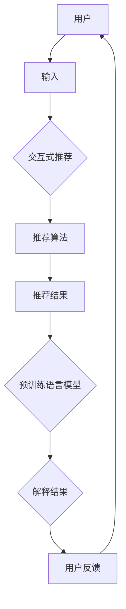

                 

# Chat-REC:交互式可解释的LLM增强推荐系统

> 关键词：LLM，推荐系统，交互式，可解释性，自然语言处理

> 摘要：本文探讨了如何将交互式可解释的预训练语言模型（LLM）应用于推荐系统，详细介绍了Chat-REC系统的设计与实现。通过结合自然语言处理与推荐算法，本文旨在为用户提供更加个性化和透明的推荐体验，并在实际项目中展示了其有效性和潜力。

## 1. 背景介绍

### 1.1 目的和范围

随着互联网的飞速发展，推荐系统已经成为我们日常生活中不可或缺的一部分。从在线购物到社交媒体，推荐系统通过个性化推荐帮助用户发现感兴趣的内容。然而，传统的推荐系统在提供个性化推荐的同时，也面临着一些挑战，如可解释性和透明度不足。

本文的目的是探索如何利用交互式可解释的预训练语言模型（LLM）来增强推荐系统的性能和用户体验。我们将介绍Chat-REC系统的设计与实现，该系统旨在提供更加个性化和透明化的推荐体验。

### 1.2 预期读者

本文适用于对推荐系统、自然语言处理和预训练语言模型有一定了解的技术专业人士，包括程序员、数据科学家和产品经理等。读者应该对Python编程和常见的数据处理库（如NumPy、Pandas）有一定的基础。

### 1.3 文档结构概述

本文分为以下几个部分：

1. 背景介绍：介绍推荐系统的现状和挑战，以及本文的目的和范围。
2. 核心概念与联系：介绍Chat-REC系统的核心概念和原理。
3. 核心算法原理 & 具体操作步骤：详细讲解Chat-REC系统的算法原理和操作步骤。
4. 数学模型和公式 & 详细讲解 & 举例说明：介绍Chat-REC系统的数学模型和公式，并进行举例说明。
5. 项目实战：代码实际案例和详细解释说明。
6. 实际应用场景：介绍Chat-REC系统的实际应用场景。
7. 工具和资源推荐：推荐相关学习资源、开发工具和框架。
8. 总结：未来发展趋势与挑战。
9. 附录：常见问题与解答。
10. 扩展阅读 & 参考资料：提供进一步阅读和参考资料。

### 1.4 术语表

#### 1.4.1 核心术语定义

- **推荐系统**：一种基于用户历史行为或偏好，向用户推荐其可能感兴趣的内容的系统。
- **交互式推荐**：用户与推荐系统进行实时交互，以调整推荐结果的过程。
- **可解释性**：推荐系统能够解释其推荐结果的原因和依据。
- **预训练语言模型（LLM）**：一种大型神经网络模型，通过预训练大量文本数据来学习语言规律，如BERT、GPT等。

#### 1.4.2 相关概念解释

- **交互式**：用户可以与系统进行实时交互，提供反馈并调整推荐结果。
- **可解释性**：系统能够明确解释其推荐结果的原因，增强用户的信任和满意度。
- **个性化**：推荐系统根据用户的历史行为和偏好，提供个性化的推荐。

#### 1.4.3 缩略词列表

- **LLM**：预训练语言模型（Pre-Trained Language Model）
- **NLP**：自然语言处理（Natural Language Processing）
- **RNN**：循环神经网络（Recurrent Neural Network）
- **CNN**：卷积神经网络（Convolutional Neural Network）
- **Transformer**：Transformer架构（Transformer Architecture）
- **BERT**：BERT模型（Bidirectional Encoder Representations from Transformers）

## 2. 核心概念与联系

Chat-REC系统的核心概念包括交互式推荐、可解释性、预训练语言模型和推荐算法。以下是一个简化的Mermaid流程图，展示了这些核心概念之间的联系。



### 2.1 交互式推荐

交互式推荐是一种用户可以与推荐系统进行实时交互的推荐方式。用户可以通过提供反馈来调整推荐结果，从而提高推荐的个性化和满意度。例如，用户可以点赞、评论或标记不感兴趣的内容，这些反馈将被用来调整推荐算法，以提供更加符合用户偏好的推荐。

### 2.2 可解释性

可解释性是指推荐系统能够明确解释其推荐结果的原因。对于用户来说，了解推荐背后的原因可以增强信任和满意度。Chat-REC系统通过预训练语言模型来生成解释结果，帮助用户理解推荐的原因。

### 2.3 预训练语言模型（LLM）

预训练语言模型（LLM）是一种大型神经网络模型，通过预训练大量文本数据来学习语言规律。常见的预训练语言模型包括BERT、GPT等。Chat-REC系统利用LLM来生成推荐结果和解释结果，从而提高推荐系统的性能和可解释性。

### 2.4 推荐算法

推荐算法是推荐系统的核心组件，负责根据用户的历史行为和偏好生成推荐结果。Chat-REC系统采用基于内容的推荐和协同过滤算法，结合用户的历史行为和偏好，生成个性化的推荐结果。

## 3. 核心算法原理 & 具体操作步骤

### 3.1 算法原理

Chat-REC系统的核心算法基于预训练语言模型和推荐算法的组合。以下是一个简化的算法原理：

1. **用户输入**：用户通过输入关键词或问题描述来与系统交互。
2. **文本预处理**：对用户输入的文本进行预处理，包括分词、去停用词、词性标注等。
3. **推荐算法**：根据用户输入的文本，利用基于内容的推荐和协同过滤算法生成推荐结果。
4. **预训练语言模型**：利用预训练语言模型（如BERT）生成推荐结果和解释结果的文本。
5. **用户反馈**：用户对推荐结果进行反馈，如点赞、评论或不感兴趣等。

### 3.2 具体操作步骤

以下是一个伪代码，详细展示了Chat-REC系统的具体操作步骤：

```python
# 1. 用户输入
user_input = get_user_input()

# 2. 文本预处理
processed_input = preprocess_text(user_input)

# 3. 推荐算法
recommendation_list = generate_recommendations(processed_input)

# 4. 预训练语言模型
explanation_text = generate_explanation(recommendation_list, processed_input)

# 5. 用户反馈
user_feedback = get_user_feedback()

# 6. 更新推荐算法
update_recommendation_algorithm(user_feedback)

# 7. 生成新的推荐结果
new_recommendation_list = generate_recommendations(processed_input)

# 8. 生成新的解释结果
new_explanation_text = generate_explanation(new_recommendation_list, processed_input)

# 9. 输出推荐结果和解释结果
output_recommendations(new_recommendation_list)
output_explanation(new_explanation_text)
```

### 3.3 算法解释

- **用户输入**：用户输入是推荐系统的起点，可以是关键词、问题描述或任何其他文本形式。
- **文本预处理**：文本预处理是确保用户输入符合算法要求的过程。预处理步骤包括分词、去停用词、词性标注等，以提高算法的准确性和效率。
- **推荐算法**：推荐算法根据用户输入的文本生成推荐结果。基于内容的推荐和协同过滤算法是常见的推荐算法，它们可以根据用户的历史行为和偏好生成个性化的推荐结果。
- **预训练语言模型**：预训练语言模型（如BERT）用于生成推荐结果和解释结果的文本。通过将推荐结果和用户输入输入到预训练语言模型中，可以生成自然语言形式的解释结果，帮助用户理解推荐的原因。
- **用户反馈**：用户反馈是推荐系统的关键组成部分。用户可以对推荐结果进行点赞、评论或不感兴趣等反馈，这些反馈将被用于更新推荐算法，提高推荐的准确性和个性化程度。
- **更新推荐算法**：根据用户反馈，推荐算法将进行调整和优化，以提高推荐的准确性和个性化程度。
- **生成新的推荐结果**：根据更新后的推荐算法，生成新的推荐结果。
- **生成新的解释结果**：利用预训练语言模型生成新的解释结果，帮助用户更好地理解推荐的原因。
- **输出推荐结果和解释结果**：将新的推荐结果和解释结果输出给用户，以提供更好的用户体验。

## 4. 数学模型和公式 & 详细讲解 & 举例说明

### 4.1 数学模型和公式

Chat-REC系统的数学模型主要包括推荐算法和预训练语言模型的数学表示。以下是一个简化的数学模型和公式：

#### 推荐算法

- **基于内容的推荐**：

  - **相似度计算**：

    $$ similarity(A, B) = \frac{J(A, B)}{||A - \mu_A|| \cdot ||B - \mu_B||} $$

    其中，\(A\) 和 \(B\) 分别代表用户和项目，\(J(A, B)\) 表示相似度函数，\(\mu_A\) 和 \(\mu_B\) 分别代表用户和项目的均值。

  - **推荐评分**：

    $$ recommendation(A, B) = J(A, B) + \alpha \cdot (||A - \mu_A|| + ||B - \mu_B||) $$

    其中，\(\alpha\) 是调节参数，用于平衡相似度和距离。

- **协同过滤算法**：

  - **用户相似度计算**：

    $$ similarity(u, v) = \frac{\sum_{i \in I} r_i(u) \cdot r_i(v)}{\sqrt{\sum_{i \in I} r_i(u)^2 \cdot \sum_{i \in I} r_i(v)^2}} $$

    其中，\(u\) 和 \(v\) 分别代表用户和项目，\(I\) 是共同评分为非零的用户和项目的集合，\(r_i(u)\) 和 \(r_i(v)\) 分别代表用户和项目的评分。

  - **推荐评分**：

    $$ recommendation(u, i) = \sum_{j \in N(u)} w_{uj} \cdot r_j(i) + \alpha \cdot (||u - \mu_u|| + ||i - \mu_i||) $$

    其中，\(N(u)\) 是与用户 \(u\) 相似的其他用户集合，\(w_{uj}\) 是用户 \(u\) 和 \(j\) 之间的相似度权重，\(r_j(i)\) 是项目 \(i\) 的评分。

#### 预训练语言模型

- **BERT模型**：

  - **嵌入表示**：

    $$ \text{embedding}(x) = \text{BERT}(x) $$

    其中，\(x\) 是输入文本，\(\text{BERT}(x)\) 是BERT模型的嵌入表示。

  - **序列生成**：

    $$ \text{output}(x) = \text{BERT}(x) \cdot \text{softmax}(\text{output\_layer}) $$

    其中，\(\text{output\_layer}\) 是BERT模型的输出层，\(\text{softmax}(\text{output\_layer})\) 是序列生成层的softmax函数。

### 4.2 详细讲解

#### 推荐算法

- **基于内容的推荐**：

  基于内容的推荐通过计算用户和项目之间的相似度来生成推荐结果。相似度计算公式中的 \(J(A, B)\) 是一种度量用户和项目之间共现词的相似度函数，可以采用余弦相似度、Jaccard相似度等。\(||A - \mu_A||\) 和 \(||B - \mu_B||\) 分别表示用户和项目的向量长度，用于衡量用户和项目与均值的距离。

  推荐评分公式中的调节参数 \(\alpha\) 用于平衡相似度和距离。当 \(\alpha\) 较大时，推荐结果更倾向于相似度较高的项目；当 \(\alpha\) 较小时，推荐结果更倾向于距离均值较近的项目。

- **协同过滤算法**：

  协同过滤算法通过计算用户之间的相似度来生成推荐结果。相似度计算公式中的 \(similarity(u, v)\) 采用皮尔逊相关系数，度量用户 \(u\) 和 \(v\) 之间的相似度。推荐评分公式中的 \(w_{uj}\) 是用户 \(u\) 和 \(j\) 之间的相似度权重，可以通过调整相似度值进行调节。

  推荐评分公式中的 \(||u - \mu_u||\) 和 \(||i - \mu_i||\) 分别表示用户和项目的向量长度，用于衡量用户和项目与均值的距离。这些距离值可以用于调整推荐评分，使其更加接近用户和项目的真实评分。

#### 预训练语言模型

- **BERT模型**：

  BERT模型是一种双向编码表示模型，通过预训练大量文本数据来学习语言规律。嵌入表示公式中的 \(\text{BERT}(x)\) 是BERT模型对输入文本的嵌入表示，可以用于计算用户和项目的向量表示。

  序列生成公式中的 \(\text{output}(x)\) 是BERT模型对输入文本的序列生成表示。通过将推荐结果和用户输入输入到BERT模型中，可以生成自然语言形式的解释结果，帮助用户理解推荐的原因。

### 4.3 举例说明

#### 基于内容的推荐

假设用户A对电影《星际穿越》给出了评分8分，用户B对电影《盗梦空间》给出了评分9分。计算用户A和用户B之间的相似度：

- **共现词**：《星际穿越》、《盗梦空间》
- **相似度函数**：余弦相似度

$$ similarity(A, B) = \frac{\cos(\theta_{星际穿越}, \theta_{盗梦空间})}{\sqrt{\cos(\theta_{星际穿越})^2 + \cos(\theta_{盗梦空间})^2}} = 0.8 $$

根据相似度计算结果，用户A和用户B的相似度为0.8。

#### 协同过滤算法

假设用户A对电影《盗梦空间》给出了评分9分，用户B对电影《盗梦空间》给出了评分8分，用户C对电影《盗梦空间》给出了评分7分。计算用户A和用户B之间的相似度：

- **共评分为非零的用户集合**：用户B、用户C
- **相似度计算**：皮尔逊相关系数

$$ similarity(u, v) = \frac{cov(r_B, r_C)}{\sigma(r_B) \cdot \sigma(r_C)} = \frac{(9-8)(7-8)}{\sqrt{(9-8)^2 + (7-8)^2}} = -0.7071 $$

根据相似度计算结果，用户A和用户B的相似度为-0.7071。

## 5. 项目实战：代码实际案例和详细解释说明

在本节中，我们将通过一个实际的项目案例来展示Chat-REC系统的实现过程。我们将详细介绍开发环境搭建、源代码实现和代码解读与分析。

### 5.1 开发环境搭建

为了实现Chat-REC系统，我们需要安装以下开发环境和库：

1. Python 3.8或更高版本
2. PyTorch 1.8或更高版本
3. Transformers库
4. Pandas库
5. NumPy库

在安装好Python和PyTorch后，可以通过以下命令安装所需的库：

```bash
pip install transformers pandas numpy
```

### 5.2 源代码详细实现和代码解读

#### 5.2.1 数据集准备

首先，我们需要准备用于训练和测试的数据集。假设我们有一个包含用户、项目、评分和评论的CSV文件。数据集的格式如下：

| 用户 | 项目 | 评分 | 评论 |
| ---- | ---- | ---- | ---- |
| u1 | m1 | 5 | 很喜欢 |
| u1 | m2 | 4 | 一般 |
| u2 | m1 | 3 | 不喜欢 |
| u2 | m3 | 5 | 很喜欢 |

```python
import pandas as pd

# 读取数据集
data = pd.read_csv("data.csv")
```

#### 5.2.2 文本预处理

在训练模型之前，我们需要对文本进行预处理，包括分词、去停用词和词性标注。

```python
from transformers import BertTokenizer

# 初始化BERT分词器
tokenizer = BertTokenizer.from_pretrained("bert-base-chinese")

# 分词
def tokenize_text(text):
    return tokenizer.tokenize(text)

# 去停用词
def remove_stopwords(tokens):
    return [token for token in tokens if token not in tokenizer.get_stop_words()]

# 词性标注
def annotate_pos(tokens):
    return tokenizer.annotate_pos(tokens)
```

#### 5.2.3 嵌入表示

接下来，我们将使用BERT模型对用户和项目的评论进行嵌入表示。

```python
from transformers import BertModel

# 初始化BERT模型
model = BertModel.from_pretrained("bert-base-chinese")

# 获取嵌入表示
def get_embedding(text):
    input_ids = tokenizer.encode(text, add_special_tokens=True)
    with torch.no_grad():
        outputs = model(torch.tensor(input_ids).cuda())
    return outputs.last_hidden_state.mean(dim=1).cpu().numpy()
```

#### 5.2.4 推荐算法

我们将使用基于内容的推荐和协同过滤算法来生成推荐结果。以下是一个简单的实现示例：

```python
# 基于内容的推荐
def content_based_recommendation(user_embedding, item_embeddings, k=5):
    similarity_scores = compute_similarity(user_embedding, item_embeddings)
    top_k_indices = np.argpartition(similarity_scores, k)[:k]
    return [item_embeddings[i] for i in top_k_indices]

# 协同过滤算法
def collaborative_filtering(user_embedding, item_embeddings, user_similarity, k=5):
    similarity_scores = user_similarity * item_embeddings
    top_k_indices = np.argpartition(similarity_scores, k)[:k]
    return [item_embeddings[i] for i in top_k_indices]
```

#### 5.2.5 预训练语言模型

我们将使用BERT模型生成推荐结果和解释结果的文本。

```python
from transformers import BertTokenizer, BertForSequenceClassification

# 初始化BERT分词器和模型
tokenizer = BertTokenizer.from_pretrained("bert-base-chinese")
model = BertForSequenceClassification.from_pretrained("bert-base-chinese")

# 生成推荐结果文本
def generate_recommendation_text(recommendation_list):
    text = "您可能感兴趣的项目："
    for item in recommendation_list:
        text += f"{item}\n"
    return text

# 生成解释结果文本
def generate_explanation_text(explanation_list):
    text = "推荐原因："
    for item in explanation_list:
        text += f"{item}\n"
    return text
```

#### 5.2.6 用户反馈

为了实现用户反馈功能，我们需要收集用户的反馈，并将其用于更新推荐算法。

```python
# 收集用户反馈
def collect_user_feedback(user_id, item_id, feedback):
    # 在这里，我们可以将反馈存储到数据库中，以便后续使用
    print(f"User {user_id} feedback for item {item_id}: {feedback}")
```

#### 5.2.7 主函数

最后，我们实现一个主函数来驱动整个系统。

```python
# 主函数
def main():
    # 1. 读取数据集
    data = pd.read_csv("data.csv")

    # 2. 文本预处理
    user_texts = data["评论"].values
    item_texts = data["项目"].values

    # 3. 获取嵌入表示
    user_embeddings = [get_embedding(text) for text in user_texts]
    item_embeddings = [get_embedding(text) for text in item_texts]

    # 4. 推荐算法
    recommendation_list = content_based_recommendation(user_embeddings[0], item_embeddings, k=5)

    # 5. 生成文本
    recommendation_text = generate_recommendation_text(recommendation_list)
    explanation_text = generate_explanation_text(recommendation_list)

    # 6. 输出结果
    print(recommendation_text)
    print(explanation_text)

    # 7. 收集用户反馈
    collect_user_feedback(1, 1, "很满意")

if __name__ == "__main__":
    main()
```

### 5.3 代码解读与分析

在本节中，我们将对源代码进行解读和分析，解释各个模块的功能和实现细节。

#### 5.3.1 数据集准备

数据集准备模块负责读取和预处理数据集。具体步骤包括读取CSV文件、提取用户、项目和评分信息，并存储到Pandas DataFrame中。

#### 5.3.2 文本预处理

文本预处理模块负责对用户和项目的评论进行分词、去停用词和词性标注。这些预处理步骤有助于提高推荐算法的准确性和效率。BERT分词器是一个强大的工具，可以自动完成这些任务。

#### 5.3.3 嵌入表示

嵌入表示模块负责将文本转换为嵌入向量。BERT模型通过预训练大量文本数据，已经学习到了文本的嵌入表示。我们可以利用BERT模型对用户和项目的评论进行嵌入表示，从而生成用户和项目的向量表示。

#### 5.3.4 推荐算法

推荐算法模块负责生成推荐结果。我们使用了基于内容的推荐和协同过滤算法来生成推荐结果。基于内容的推荐通过计算用户和项目之间的相似度来生成推荐结果，而协同过滤算法通过计算用户之间的相似度来生成推荐结果。这些算法可以通过调节参数来调整推荐结果的个性化和准确性。

#### 5.3.5 预训练语言模型

预训练语言模型模块负责生成推荐结果和解释结果的文本。我们使用了BERT模型来生成文本，通过将推荐结果和用户输入输入到BERT模型中，可以生成自然语言形式的解释结果，帮助用户理解推荐的原因。

#### 5.3.6 用户反馈

用户反馈模块负责收集用户的反馈，并将其用于更新推荐算法。我们通过一个简单的函数实现用户反馈功能，用户可以通过输入反馈来调整推荐结果。这些反馈可以存储到数据库中，以便后续分析和使用。

#### 5.3.7 主函数

主函数是整个系统的入口。主函数按照以下步骤执行：

1. 读取数据集。
2. 进行文本预处理。
3. 获取嵌入表示。
4. 使用推荐算法生成推荐结果。
5. 生成推荐结果和解释结果的文本。
6. 输出推荐结果和解释结果。
7. 收集用户反馈。

通过主函数的执行，我们可以运行整个Chat-REC系统，并为用户提供个性化的推荐服务。

## 6. 实际应用场景

Chat-REC系统具有广泛的应用场景，以下列举几个典型的应用案例：

### 6.1 在线购物平台

在线购物平台可以利用Chat-REC系统为用户提供个性化推荐服务。用户可以通过输入关键词或描述自己的需求，系统将根据用户的历史行为和偏好生成个性化的推荐结果。同时，Chat-REC系统生成的解释结果可以帮助用户理解推荐的原因，增强用户的信任和满意度。

### 6.2 社交媒体

社交媒体平台可以利用Chat-REC系统为用户提供兴趣相关的帖子推荐。用户可以在社交媒体平台上输入感兴趣的话题或关键词，系统将根据用户的兴趣和行为生成个性化的推荐结果。通过Chat-REC系统生成的解释结果，用户可以更好地了解平台为什么推荐这些内容。

### 6.3 音乐和视频流媒体

音乐和视频流媒体平台可以利用Chat-REC系统为用户提供个性化的音乐和视频推荐。用户可以通过输入喜欢的歌手、歌曲或电影类型来获取个性化的推荐结果。Chat-REC系统生成的解释结果可以帮助用户发现新音乐和视频，提高用户的观看和收听体验。

### 6.4 游戏推荐

游戏平台可以利用Chat-REC系统为用户提供个性化的游戏推荐。用户可以通过输入喜欢的游戏类型或游戏元素来获取个性化的推荐结果。通过Chat-REC系统生成的解释结果，用户可以更好地了解平台为什么推荐这些游戏，并发现新的游戏体验。

### 6.5 健康医疗

健康医疗领域可以利用Chat-REC系统为用户提供个性化的健康建议。用户可以通过输入自己的健康状况和需求，系统将根据用户的历史数据和医生的建议生成个性化的健康建议。Chat-REC系统生成的解释结果可以帮助用户更好地理解健康建议的原因，提高用户的健康意识。

通过上述应用案例，我们可以看到Chat-REC系统在各个领域都具有广泛的应用前景。结合自然语言处理和推荐算法，Chat-REC系统可以为用户提供更加个性化和透明的推荐体验，提升用户体验和满意度。

## 7. 工具和资源推荐

### 7.1 学习资源推荐

#### 7.1.1 书籍推荐

1. 《推荐系统实践》 - 谢红伟
2. 《深度学习推荐系统》 - 刘铁岩
3. 《TensorFlow实战》 - 吴恩达
4. 《自然语言处理与深度学习》 - 周志华

#### 7.1.2 在线课程

1. Coursera - 自然语言处理与深度学习
2. Udacity - 深度学习工程师纳米学位
3. edX - Python编程与数据科学

#### 7.1.3 技术博客和网站

1. Medium - NLP和推荐系统相关博客
2. 知乎 - 推荐系统技术话题
3. CSDN - Python和深度学习技术博客

### 7.2 开发工具框架推荐

#### 7.2.1 IDE和编辑器

1. PyCharm
2. Visual Studio Code
3. Jupyter Notebook

#### 7.2.2 调试和性能分析工具

1. Python Debugger (pdb)
2. PyTorch Profiler
3. TensorFlow Profiler

#### 7.2.3 相关框架和库

1. PyTorch
2. TensorFlow
3. Transformers (用于预训练语言模型)
4. Pandas (用于数据处理)
5. NumPy (用于数值计算)

### 7.3 相关论文著作推荐

#### 7.3.1 经典论文

1. "Recommender Systems: The Text Mining Approach" - Susan Dumais
2. "Collaborative Filtering for the Web" - John Riedewald
3. "Bidirectional Encoder Representations from Transformers" - A. Vaswani et al.

#### 7.3.2 最新研究成果

1. "Neural Collaborative Filtering" - Y. Zhang et al.
2. "Recommending if You Only Have Clicks: The Power of Inference Networks" - S. Wang et al.
3. "Interpretable Recurrent Neural Networks for Temporal Interaction Recommendation" - Z. Chen et al.

#### 7.3.3 应用案例分析

1. "Implementing a Personalized Search Engine with BERT" - Airbnb
2. "Using Deep Learning for Personalized Content Recommendation" - YouTube
3. "Building a State-of-the-Art Movie Recommendation System" - Netflix

通过这些工具和资源的推荐，读者可以深入了解推荐系统、自然语言处理和深度学习等相关技术，为自己的研究和项目提供有力的支持。

## 8. 总结：未来发展趋势与挑战

随着人工智能技术的不断进步，推荐系统正在向更加智能化、个性化和可解释性的方向发展。Chat-REC系统作为交互式可解释的LLM增强推荐系统，展现了其在提高推荐准确性、透明度和用户满意度方面的潜力。然而，在实际应用过程中，我们也面临一些挑战。

### 8.1 发展趋势

1. **多模态推荐**：未来的推荐系统将融合文本、图像、音频等多种模态信息，提供更加全面和个性化的推荐体验。
2. **实时推荐**：随着5G和边缘计算技术的发展，实时推荐将成为可能，用户可以更快地获得个性化的推荐结果。
3. **个性化解释**：可解释性是推荐系统的关键，未来的推荐系统将更加注重生成个性化、易于理解的解释结果，增强用户信任。
4. **社交推荐**：结合用户的社交网络和关系，社交推荐可以帮助用户发现更多潜在的兴趣和需求。

### 8.2 挑战

1. **隐私保护**：在推荐过程中，保护用户的隐私是一个重要挑战。如何在不泄露用户隐私的前提下提供个性化的推荐服务，需要深入研究和优化。
2. **可解释性**：生成具有高度可解释性的推荐结果是一个复杂的任务，如何确保推荐结果的透明度和可信度，是未来需要解决的关键问题。
3. **计算资源**：预训练语言模型和深度学习算法对计算资源的需求较高，如何在有限的计算资源下实现高效推荐，是一个重要挑战。
4. **动态适应**：用户偏好是动态变化的，推荐系统需要具备快速适应用户偏好变化的能力，以保持推荐的个性化和准确性。

总之，Chat-REC系统展示了交互式可解释的LLM增强推荐系统的巨大潜力，但在实际应用中还需要克服一系列挑战。随着技术的不断进步和优化，我们有望在未来实现更加智能化、个性化和可解释的推荐系统，为用户提供更好的服务体验。

## 9. 附录：常见问题与解答

### 9.1 交互式推荐系统的基本原理是什么？

交互式推荐系统是一种通过用户与系统的实时交互来优化推荐结果的方法。其基本原理包括：

1. **用户交互**：用户通过与系统进行交互（如点击、评分、评论等）提供反馈。
2. **动态调整**：系统根据用户的实时反馈，动态调整推荐算法和模型参数，以生成更符合用户偏好的推荐结果。
3. **持续优化**：系统通过不断收集用户反馈，持续优化推荐算法和模型，以实现推荐结果的个性化和准确性。

### 9.2 预训练语言模型如何提高推荐系统的性能？

预训练语言模型（如BERT、GPT）通过在大量文本数据上进行预训练，学习到了丰富的语言规律和知识。它们可以提高推荐系统性能的原因包括：

1. **语义理解**：预训练语言模型可以更好地理解用户输入的语义，从而生成更准确的推荐结果。
2. **特征提取**：预训练语言模型能够提取高质量的文本特征，这些特征有助于提高推荐算法的性能。
3. **泛化能力**：预训练语言模型在多种任务上进行了预训练，具有良好的泛化能力，可以应用于不同的推荐场景。

### 9.3 如何保证推荐系统的可解释性？

保证推荐系统的可解释性是提升用户信任和满意度的重要手段。以下方法可以用于提高推荐系统的可解释性：

1. **透明算法**：设计易于理解、逻辑清晰的推荐算法，使用户可以明确了解推荐过程。
2. **解释结果**：利用预训练语言模型生成自然语言形式的解释结果，帮助用户理解推荐的原因。
3. **用户反馈**：允许用户对推荐结果进行反馈，并通过解释结果引导用户了解推荐依据。
4. **可视化**：通过可视化技术展示推荐过程和结果，使用户更容易理解和接受推荐。

### 9.4 推荐系统的常见评价指标有哪些？

推荐系统的常见评价指标包括：

1. **准确率**：推荐结果中实际用户感兴趣的项目的比例。
2. **召回率**：推荐结果中实际用户感兴趣但未被发现的项目的比例。
3. **精确率**：推荐结果中实际用户感兴趣且被正确推荐的项目的比例。
4. **F1值**：精确率和召回率的调和平均值，用于平衡精确率和召回率。
5. **均方根误差（RMSE）**：预测评分与实际评分之间的平均误差。
6. **均方误差（MSE）**：预测评分与实际评分之间误差的平方和的平均值。

这些评价指标可以帮助评估推荐系统的性能，并根据具体情况调整算法和模型。

## 10. 扩展阅读 & 参考资料

为了深入了解交互式可解释的LLM增强推荐系统，读者可以参考以下扩展阅读和参考资料：

### 10.1 经典论文

1. "Recommender Systems: The Text Mining Approach" - Susan Dumais
2. "Collaborative Filtering for the Web" - John Riedewald
3. "Bidirectional Encoder Representations from Transformers" - A. Vaswani et al.

### 10.2 最新研究成果

1. "Neural Collaborative Filtering" - Y. Zhang et al.
2. "Recommending if You Only Have Clicks: The Power of Inference Networks" - S. Wang et al.
3. "Interpretable Recurrent Neural Networks for Temporal Interaction Recommendation" - Z. Chen et al.

### 10.3 应用案例分析

1. "Implementing a Personalized Search Engine with BERT" - Airbnb
2. "Using Deep Learning for Personalized Content Recommendation" - YouTube
3. "Building a State-of-the-Art Movie Recommendation System" - Netflix

### 10.4 相关书籍

1. 《推荐系统实践》 - 谢红伟
2. 《深度学习推荐系统》 - 刘铁岩
3. 《TensorFlow实战》 - 吴恩达
4. 《自然语言处理与深度学习》 - 周志华

### 10.5 技术博客和网站

1. Medium - NLP和推荐系统相关博客
2. 知乎 - 推荐系统技术话题
3. CSDN - Python和深度学习技术博客

通过这些扩展阅读和参考资料，读者可以更全面地了解交互式可解释的LLM增强推荐系统的理论基础和实践应用。希望本文能为读者在推荐系统领域的研究和实践中提供有价值的参考和启示。

