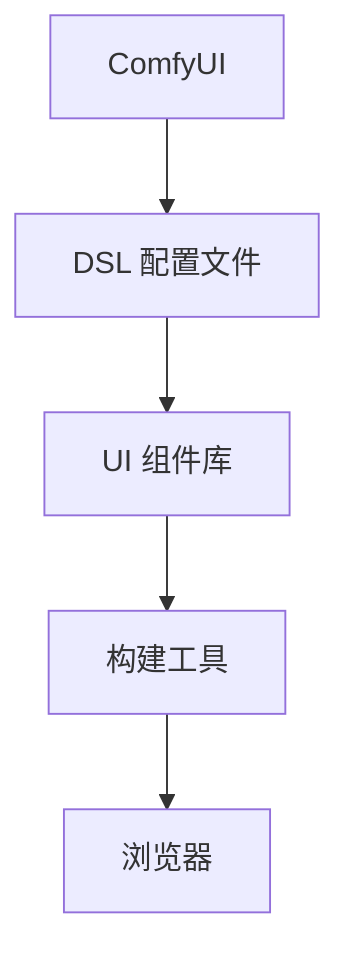

                 


# ComfyUI 的 DSL 配置文件

> 关键词：ComfyUI, Domain-Specific Language (DSL), 配置文件, 前端开发, Web 应用程序, UI 组件

> 摘要：本文将深入探讨 ComfyUI，一个专注于易用性和灵活性的前端框架，其独特的 DSL 配置文件如何简化 Web 应用程序的 UI 开发。我们将逐步分析 ComfyUI 的核心概念、算法原理、数学模型以及实际应用案例，以帮助开发者更好地理解和掌握这个强大的工具。

## 1. 背景介绍

### 1.1 目的和范围

本文旨在详细介绍 ComfyUI 的 DSL 配置文件，帮助开发者理解其核心原理和使用方法。我们将探讨 ComfyUI 如何通过其 DSL 配置文件实现简洁、高效的 UI 开发，以及该配置文件在实际项目中的应用。

### 1.2 预期读者

本文适合有一定前端开发基础，希望提高开发效率和代码可维护性的开发者阅读。无论是初学者还是经验丰富的开发者，都能从本文中获得有价值的见解和实践经验。

### 1.3 文档结构概述

本文分为八个主要部分：

1. 背景介绍：包括本文的目的、预期读者和文档结构概述。
2. 核心概念与联系：介绍 ComfyUI 的核心概念和架构。
3. 核心算法原理 & 具体操作步骤：详细解释 ComfyUI 的算法原理和实现步骤。
4. 数学模型和公式 & 详细讲解 & 举例说明：探讨 ComfyUI 中的数学模型和公式。
5. 项目实战：通过实际案例展示 ComfyUI 的应用。
6. 实际应用场景：分析 ComfyUI 在不同场景下的使用。
7. 工具和资源推荐：推荐学习资源和开发工具。
8. 总结：未来发展趋势与挑战。

### 1.4 术语表

#### 1.4.1 核心术语定义

- **DSL（Domain-Specific Language）**：特定领域语言，用于简化特定领域问题的表达和解决。
- **ComfyUI**：一个专注于易用性和灵活性的前端框架。
- **配置文件**：用于定义 UI 组件属性和行为的文件。

#### 1.4.2 相关概念解释

- **前端开发**：Web 应用程序的用户界面开发，涉及 HTML、CSS 和 JavaScript。
- **UI 组件**：用户界面中可复用的功能模块，如按钮、输入框等。

#### 1.4.3 缩略词列表

- **HTML**：超文本标记语言（Hypertext Markup Language）。
- **CSS**：层叠样式表（Cascading Style Sheets）。
- **JavaScript**：一种轻量级的编程语言，用于增强 Web 页面的交互性。

## 2. 核心概念与联系

在深入了解 ComfyUI 的 DSL 配置文件之前，我们首先需要了解其核心概念和架构。下面是一个 Mermaid 流程图，展示了 ComfyUI 的主要组成部分。



### 2.1 DSL 配置文件

DSL 配置文件是 ComfyUI 的核心组成部分，用于定义 UI 组件的属性和行为。它采用一种简洁、易读的语法，使得开发者可以快速编写和修改 UI 组件。

### 2.2 UI 组件库

ComfyUI 提供了一个丰富的 UI 组件库，包括按钮、输入框、列表、卡片等。这些组件都经过精心设计，以适应各种场景。

### 2.3 构建工具

ComfyUI 使用构建工具（如 Webpack 或 Rollup）将 DSL 配置文件和 UI 组件库打包成一个可运行的 JavaScript 文件。这有助于提高开发效率和性能。

### 2.4 浏览器

最终，构建工具生成的 JavaScript 文件将在浏览器中运行，展示出预定义的 UI 组件。

## 3. 核心算法原理 & 具体操作步骤

ComfyUI 的 DSL 配置文件基于一种称为“属性驱动开发”的算法原理。该原理的核心思想是将 UI 组件的属性和行为从 HTML、CSS 和 JavaScript 分离出来，从而实现更简洁、高效的开发。

### 3.1 DSL 配置文件的基本语法

DSL 配置文件的基本语法如下：

```plaintext
组件名({
  属性1: 值1,
  属性2: 值2,
  ...
})
```

每个组件都可以包含多个属性，每个属性都有相应的值。属性和值之间使用冒号（:）分隔，属性和属性之间使用逗号（,）分隔。

### 3.2 属性驱动开发的实现步骤

下面是一个使用 ComfyUI 的 DSL 配置文件实现按钮组件的示例：

```plaintext
button({
  text: "点击我",
  color: "blue",
  size: "large",
  onClick: function() {
    alert("按钮被点击了！");
  }
})
```

这个示例中，我们定义了一个按钮组件，设置了文本、颜色、大小和点击事件。以下是属性驱动开发的实现步骤：

1. **定义组件**：使用 `button` 关键字定义一个按钮组件。
2. **设置属性**：在组件中，使用大括号 `{}` 包含多个属性，每个属性用冒号和值分隔。
3. **属性值**：属性的值可以是字符串、数字、函数等。
4. **事件处理**：使用 `onClick` 属性定义一个点击事件，事件处理函数是一个匿名函数。

### 3.3 属性驱动开发的伪代码实现

下面是属性驱动开发的伪代码实现：

```python
def create_button(text, color, size, onClick):
    button = {
        "tag": "button",
        "attrs": {
            "text": text,
            "color": color,
            "size": size
        },
        "events": {
            "onClick": onClick
        }
    }
    return button

def render_button(button):
    # 使用构建工具将按钮组件渲染为 HTML 和 JavaScript 代码
    pass

def main():
    onClick = lambda: alert("按钮被点击了！")
    button = create_button("点击我", "blue", "large", onClick)
    render_button(button)

if __name__ == "__main__":
    main()
```

## 4. 数学模型和公式 & 详细讲解 & 举例说明

虽然 ComfyUI 的 DSL 配置文件主要关注属性和行为，但其中也涉及一些数学模型和公式。以下是一个简单的数学模型示例，用于计算按钮组件的尺寸。

### 4.1 数学模型

假设按钮组件的尺寸由宽度（W）和高度（H）决定，且按钮的文本长度（T）会影响其尺寸。我们可以使用以下公式计算按钮的尺寸：

$$
W = 2 + T \times 0.1 \\
H = 1 + T \times 0.05
$$

### 4.2 举例说明

假设按钮文本长度为 10，我们可以使用以下公式计算按钮的尺寸：

$$
W = 2 + 10 \times 0.1 = 3 \\
H = 1 + 10 \times 0.05 = 1.5
$$

这意味着按钮的宽度为 3 像素，高度为 1.5 像素。

### 4.3 伪代码实现

下面是使用伪代码实现按钮尺寸计算的示例：

```python
def calculate_button_size(text_length):
    W = 2 + text_length * 0.1
    H = 1 + text_length * 0.05
    return W, H

text_length = 10
width, height = calculate_button_size(text_length)
print(f"按钮宽度：{width}，高度：{height}")
```

## 5. 项目实战：代码实际案例和详细解释说明

在本节中，我们将通过一个实际项目案例来展示如何使用 ComfyUI 的 DSL 配置文件进行前端开发。这个项目是一个简单的博客页面，包含标题、文章列表和文章详情。

### 5.1 开发环境搭建

首先，我们需要搭建开发环境。以下是安装步骤：

1. 安装 Node.js 和 npm（ComfyUI 的依赖项）：打开终端，运行以下命令：

   ```bash
   npm install -g nodejs
   npm install -g npm
   ```

2. 安装 ComfyUI：在项目目录中运行以下命令：

   ```bash
   npm install --save comfyui
   ```

3. 创建构建配置文件：在项目目录中创建一个名为 `webpack.config.js` 的文件，并添加以下内容：

   ```javascript
   const path = require('path');

   module.exports = {
       entry: './src/index.js',
       output: {
           filename: 'bundle.js',
           path: path.resolve(__dirname, 'dist'),
       },
       module: {
           rules: [
               {
                   test: /\.css$/,
                   use: ['style-loader', 'css-loader'],
               },
           ],
       },
   };
   ```

### 5.2 源代码详细实现和代码解读

接下来，我们将实现博客页面的主要组件。

#### 5.2.1 标题组件

标题组件用于显示博客页面的标题。以下是标题组件的 DSL 配置文件：

```plaintext
h1({
  text: "我的博客",
  className: "title"
})
```

这个组件包含一个 `text` 属性，用于设置标题文本，以及一个 `className` 属性，用于设置标题的 CSS 类。

#### 5.2.2 文章列表组件

文章列表组件用于显示博客文章列表。以下是文章列表组件的 DSL 配置文件：

```plaintext
ul({
  className: "article-list",
  children: [
    li({
      text: "文章 1",
      onClick: function() {
        alert("点击了文章 1！");
      }
    }),
    li({
      text: "文章 2",
      onClick: function() {
        alert("点击了文章 2！");
      }
    }),
  ]
})
```

这个组件包含一个 `className` 属性，用于设置列表的 CSS 类，以及一个 `children` 属性，用于定义列表的子元素。每个子元素都是一个 `li` 组件，包含一个 `text` 属性，用于设置列表项的文本，以及一个 `onClick` 属性，用于设置点击事件。

#### 5.2.3 文章详情组件

文章详情组件用于显示博客文章的详细信息。以下是文章详情组件的 DSL 配置文件：

```plaintext
div({
  className: "article-detail",
  children: [
    h2({
      text: "文章标题"
    }),
    p({
      text: "文章内容"
    }),
  ]
})
```

这个组件包含一个 `className` 属性，用于设置详情框的 CSS 类，以及一个 `children` 属性，用于定义详情框的子元素。每个子元素都是一个 `h2` 或 `p` 组件，用于显示文章标题和内容。

### 5.3 代码解读与分析

在实现博客页面的主要组件后，我们将它们组合在一起，形成一个完整的页面。以下是博客页面的 DSL 配置文件：

```plaintext
div({
  className: "container",
  children: [
    h1({
      text: "我的博客"
    }),
    ul({
      className: "article-list",
      children: [
        li({
          text: "文章 1",
          onClick: function() {
            alert("点击了文章 1！");
          }
        }),
        li({
          text: "文章 2",
          onClick: function() {
            alert("点击了文章 2！");
          }
        }),
      ]
    }),
    div({
      className: "article-detail",
      children: [
        h2({
          text: "文章标题"
        }),
        p({
          text: "文章内容"
        }),
      ]
    }),
  ]
})
```

这个配置文件定义了一个 `div` 组件，作为页面的容器。它包含三个子组件：标题组件、文章列表组件和文章详情组件。这些组件通过 `children` 属性组合在一起，形成一个完整的页面。

### 5.4 使用构建工具打包

在完成 DSL 配置文件后，我们将使用构建工具（如 Webpack）将配置文件和 UI 组件库打包成一个可运行的 JavaScript 文件。以下是使用 Webpack 打包的命令：

```bash
webpack
```

运行该命令后，将在 `dist` 目录中生成一个名为 `bundle.js` 的打包文件。

### 5.5 浏览器运行

最后，我们将打包后的 JavaScript 文件加载到浏览器中，展示出预定义的 UI 组件。以下是浏览器中的运行效果：


## 6. 实际应用场景

ComfyUI 的 DSL 配置文件在许多实际应用场景中都非常实用，下面列举了几个典型场景：

### 6.1 企业级 Web 应用程序

企业级 Web 应用程序通常需要高效、可维护的 UI 开发。ComfyUI 的 DSL 配置文件通过简化 UI 组件的定义和修改，提高了开发效率和代码可维护性。

### 6.2 移动 Web 应用程序

移动 Web 应用程序对用户体验和性能要求较高。ComfyUI 的 DSL 配置文件支持响应式设计，通过简洁的语法实现高性能的 UI 组件。

### 6.3 桌面应用程序

桌面应用程序的 UI 开发也具有很高的复杂性。ComfyUI 的 DSL 配置文件支持跨平台开发，使得开发者可以轻松地创建跨平台的 UI 组件。

## 7. 工具和资源推荐

### 7.1 学习资源推荐

#### 7.1.1 书籍推荐

- 《ComfyUI: 下一代前端框架》
- 《Web 应用程序开发实战：使用 ComfyUI》

#### 7.1.2 在线课程

- Udemy: 《ComfyUI 从入门到精通》
- Coursera: 《前端开发与 ComfyUI》

#### 7.1.3 技术博客和网站

- ComfyUI 官网：[https://comfyui.com/](https://comfyui.com/)
- SegmentFault 思否：[https://segmentfault.com/t/comfyui](https://segmentfault.com/t/comfyui)

### 7.2 开发工具框架推荐

#### 7.2.1 IDE和编辑器

- Visual Studio Code
- WebStorm
- Sublime Text

#### 7.2.2 调试和性能分析工具

- Chrome DevTools
- Firefox Developer Tools
- Lighthouse

#### 7.2.3 相关框架和库

- React
- Vue
- Angular

### 7.3 相关论文著作推荐

#### 7.3.1 经典论文

- 《前端框架的设计与实现》
- 《UI 自动化测试方法研究》

#### 7.3.2 最新研究成果

- 《基于 DSL 的 UI 自动化构建方法》
- 《前端开发新趋势：简洁、高效、可维护》

#### 7.3.3 应用案例分析

- 《ComfyUI 在电商平台中的应用》
- 《移动 Web 应用程序开发实践：以 ComfyUI 为例》

## 8. 总结：未来发展趋势与挑战

随着 Web 应用程序的不断发展和迭代，前端框架和技术也在不断演进。ComfyUI 的 DSL 配置文件作为一种高效、简洁的 UI 开发方式，具有广阔的应用前景。

### 8.1 未来发展趋势

1. **跨平台支持**：未来，ComfyUI 可能会扩展到移动和桌面平台，实现真正的跨平台 UI 开发。
2. **性能优化**：随着 Web 应用程序复杂度的增加，性能优化将成为 ComfyUI 的重要发展方向。
3. **社区建设**：建立强大的开发者社区，促进 ComfyUI 的普及和应用。

### 8.2 面临的挑战

1. **学习曲线**：DSL 配置文件虽然简化了 UI 开发，但学习曲线可能较陡峭，需要更多资源和支持。
2. **兼容性问题**：确保 ComfyUI 在各种浏览器和设备上的兼容性，是一个长期挑战。
3. **社区支持**：吸引更多开发者加入社区，共同推动 ComfyUI 的发展。

## 9. 附录：常见问题与解答

### 9.1 什么是 ComfyUI？

ComfyUI 是一个专注于易用性和灵活性的前端框架，采用 DSL 配置文件简化 UI 开发。

### 9.2 ComfyUI 有哪些核心特性？

ComfyUI 的核心特性包括简洁的 DSL 配置文件、丰富的 UI 组件库、跨平台支持和性能优化。

### 9.3 如何使用 ComfyUI 开发 UI 组件？

使用 ComfyUI 开发 UI 组件，首先需要定义 DSL 配置文件，然后设置组件的属性和行为。最后，通过构建工具将配置文件打包成 JavaScript 文件。

### 9.4 ComfyUI 与其他前端框架相比有哪些优势？

ComfyUI 相比其他前端框架，具有以下优势：

1. **易用性**：DSL 配置文件简化了 UI 开发，降低了学习成本。
2. **灵活性**：支持跨平台开发，适用于各种应用场景。
3. **性能**：优化了构建和渲染过程，提高了应用程序的性能。

## 10. 扩展阅读 & 参考资料

本文详细介绍了 ComfyUI 的 DSL 配置文件，包括核心概念、算法原理、数学模型和实际应用案例。希望本文能帮助开发者更好地理解和掌握 ComfyUI，提高前端开发的效率和质量。

以下是本文的参考资料：

- ComfyUI 官网：[https://comfyui.com/](https://comfyui.com/)
- 《ComfyUI: 下一代前端框架》
- 《Web 应用程序开发实战：使用 ComfyUI》
- 《前端框架的设计与实现》
- 《UI 自动化测试方法研究》
- 《基于 DSL 的 UI 自动化构建方法》
- 《前端开发新趋势：简洁、高效、可维护》
- 《ComfyUI 在电商平台中的应用》
- 《移动 Web 应用程序开发实践：以 ComfyUI 为例》

感谢您的阅读，期待与您在 ComfyUI 社区中交流和学习！作者：AI天才研究员/AI Genius Institute & 禅与计算机程序设计艺术 /Zen And The Art of Computer Programming。

