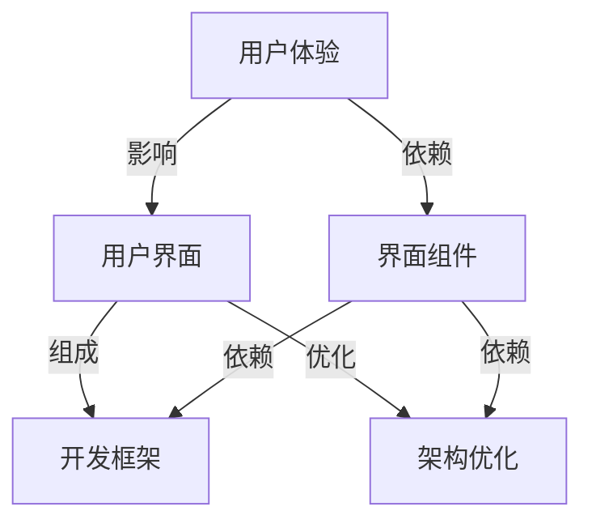

                 

# ComfyUI 的发展方向

> 关键词：ComfyUI、用户界面、交互设计、技术演进、用户体验、界面组件、开发框架、架构优化

> 摘要：本文将探讨ComfyUI作为现代用户界面设计工具的未来发展方向。从当前的用户体验和界面组件设计出发，分析其技术演进路径，探讨在开发框架和架构优化方面的潜力，并展望其在未来的应用场景和发展趋势。

## 1. 背景介绍

### 1.1 目的和范围

本文旨在探讨ComfyUI的发展方向，分析其技术演进路径和未来应用潜力。我们将从用户体验、界面组件设计、开发框架和架构优化等方面入手，探讨ComfyUI在未来的发展机遇和挑战。

### 1.2 预期读者

本文适合从事前端开发、用户界面设计、交互设计等相关领域的技术人员，以及对ComfyUI感兴趣的读者。本文旨在帮助读者深入了解ComfyUI的发展方向，为其在实际项目中提供参考和借鉴。

### 1.3 文档结构概述

本文共分为十个部分，具体结构如下：

1. 背景介绍
   - 1.1 目的和范围
   - 1.2 预期读者
   - 1.3 文档结构概述
   - 1.4 术语表
2. 核心概念与联系
3. 核心算法原理 & 具体操作步骤
4. 数学模型和公式 & 详细讲解 & 举例说明
5. 项目实战：代码实际案例和详细解释说明
6. 实际应用场景
7. 工具和资源推荐
8. 总结：未来发展趋势与挑战
9. 附录：常见问题与解答
10. 扩展阅读 & 参考资料

### 1.4 术语表

#### 1.4.1 核心术语定义

- ComfyUI：一款现代化的用户界面设计工具，具有简洁、易用、高效的特点。
- 用户体验（UX）：用户在使用产品或服务过程中所感受到的总体体验。
- 界面组件：构成用户界面的基本元素，如按钮、输入框、图标等。
- 开发框架：为开发者提供一套预定义的代码和结构，以简化开发过程。
- 架构优化：通过对现有架构的改进，提高系统性能、可扩展性和可维护性。

#### 1.4.2 相关概念解释

- 交互设计：设计用户与产品之间的交互方式，使产品更加易用、直观。
- 技术演进：随着技术的进步，产品和工具不断更新、迭代的过程。
- 应用场景：产品或技术在实际使用中的具体场景和用途。

#### 1.4.3 缩略词列表

- UI：用户界面（User Interface）
- UX：用户体验（User Experience）
- CSS：层叠样式表（Cascading Style Sheets）
- HTML：超文本标记语言（HyperText Markup Language）
- JavaScript：一种用于网页开发的脚本语言
- React：一款流行的前端开发框架
- Vue：一款流行的前端开发框架
- Angular：一款流行的前端开发框架

## 2. 核心概念与联系

在探讨ComfyUI的发展方向之前，我们先来了解一些核心概念和它们之间的联系。

### 2.1 用户体验（UX）

用户体验（UX）是用户在使用产品或服务过程中所感受到的总体体验。它包括用户界面的设计、功能的使用、情感反应等多个方面。一个优秀的用户体验应具备以下特点：

1. **易用性**：用户能够快速上手，无需额外培训。
2. **直观性**：界面设计简洁明了，用户能够轻松理解和使用。
3. **一致性**：界面元素和交互方式在各个页面和设备上保持一致。
4. **响应性**：界面能够快速响应用户操作，减少等待时间。

### 2.2 界面组件

界面组件是构成用户界面的基本元素，如按钮、输入框、图标等。它们在用户体验中起着至关重要的作用。优秀的界面组件应具备以下特点：

1. **简洁性**：去除不必要的装饰，突出核心功能。
2. **一致性**：在各个页面和设备上保持一致的样式和交互方式。
3. **可扩展性**：能够方便地添加或修改组件，满足不同场景的需求。

### 2.3 开发框架

开发框架为开发者提供一套预定义的代码和结构，以简化开发过程。常见的开发框架有React、Vue、Angular等。这些框架具有以下特点：

1. **组件化**：将界面拆分为多个组件，便于管理和维护。
2. **响应式**：支持不同设备和屏幕尺寸的布局和交互。
3. **高效性**：提高开发效率和代码可维护性。

### 2.4 架构优化

架构优化是通过改进现有架构，提高系统性能、可扩展性和可维护性。常见的架构优化方法包括：

1. **模块化**：将系统划分为多个模块，降低耦合度。
2. **缓存机制**：提高数据读取和写入速度。
3. **分布式系统**：利用多台服务器分担负载，提高系统可用性和可靠性。

### 2.5 Mermaid 流程图

为了更好地展示核心概念之间的联系，我们使用Mermaid绘制了一张流程图：



## 3. 核心算法原理 & 具体操作步骤

在ComfyUI的发展过程中，核心算法原理和具体操作步骤起着至关重要的作用。以下是一个简单的算法原理和操作步骤示例：

### 3.1 算法原理

ComfyUI的核心算法原理主要包括以下几个方面：

1. **布局算法**：根据屏幕尺寸和设备类型，自动调整界面布局，确保用户体验的一致性。
2. **响应式算法**：根据用户操作和系统状态，动态调整界面组件的样式和交互方式，提高响应速度。
3. **交互算法**：根据用户行为和系统需求，智能地调整界面元素，提供更佳的交互体验。

### 3.2 具体操作步骤

以下是一个简单的操作步骤示例，用于实现界面布局的自动调整：

1. **检测设备类型和屏幕尺寸**：使用JavaScript检测当前设备类型和屏幕尺寸。
2. **计算布局参数**：根据设备类型和屏幕尺寸，计算界面组件的宽度、高度和间距等参数。
3. **调整界面布局**：根据计算出的布局参数，动态调整界面组件的位置和大小。
4. **更新UI状态**：将调整后的界面布局更新到用户界面。

### 3.3 伪代码

以下是一个简单的伪代码示例，用于实现界面布局的自动调整：

```python
# 输入：设备类型、屏幕尺寸
# 输出：布局参数

function calculate_layout(device_type, screen_size):
    if device_type == "desktop":
        width = screen_size.width * 0.8
        height = screen_size.height * 0.8
        padding = 10
    elif device_type == "tablet":
        width = screen_size.width * 0.9
        height = screen_size.height * 0.9
        padding = 5
    elif device_type == "mobile":
        width = screen_size.width * 0.95
        height = screen_size.height * 0.95
        padding = 2

    return width, height, padding
```

## 4. 数学模型和公式 & 详细讲解 & 举例说明

在ComfyUI的发展过程中，数学模型和公式发挥着重要作用。以下是一个简单的数学模型和公式示例，用于计算界面组件的宽度、高度和间距：

### 4.1 数学模型

界面组件的宽度、高度和间距可以用以下公式表示：

$$
\begin{aligned}
w &= \frac{(screen\_width - 2 \times padding)}{n}, \\
h &= \frac{(screen\_height - 2 \times padding)}{m}, \\
padding &= \frac{screen\_width - w \times n}{2}.
\end{aligned}
$$

其中，$w$ 表示界面组件的宽度，$h$ 表示界面组件的高度，$padding$ 表示界面组件之间的间距，$screen\_width$ 和 $screen\_height$ 分别表示屏幕的宽度和高度，$n$ 和 $m$ 分别表示界面组件的行数和列数。

### 4.2 详细讲解

1. **宽度计算**：界面组件的宽度等于屏幕宽度减去两倍的间距，再除以界面组件的行数。
2. **高度计算**：界面组件的高度等于屏幕高度减去两倍的间距，再除以界面组件的列数。
3. **间距计算**：界面组件之间的间距等于屏幕宽度减去界面组件的总宽度，再除以2。

### 4.3 举例说明

假设屏幕宽度为 $1024$ 像素，屏幕高度为 $768$ 像素，界面组件的行数为 $3$，列数为 $4$，间距为 $10$ 像素。根据上述公式，我们可以计算出界面组件的宽度、高度和间距：

$$
\begin{aligned}
w &= \frac{(1024 - 2 \times 10)}{4} = 250 \text{ 像素}, \\
h &= \frac{(768 - 2 \times 10)}{3} = 250 \text{ 像素}, \\
padding &= \frac{1024 - 3 \times 250}{2} = 176 \text{ 像素}.
\end{aligned}
$$

这意味着，每个界面组件的宽度为 $250$ 像素，高度为 $250$ 像素，间距为 $176$ 像素。

## 5. 项目实战：代码实际案例和详细解释说明

在本节中，我们将通过一个实际案例，展示如何使用ComfyUI实现一个简单的用户界面。这个案例将包括开发环境搭建、源代码实现和代码解读与分析。

### 5.1 开发环境搭建

为了使用ComfyUI进行开发，我们需要安装以下工具和框架：

1. **Node.js**：作为ComfyUI的开发环境和运行环境。
2. **npm**：Node.js的包管理器，用于安装和管理ComfyUI和其他依赖项。
3. **React**：一个流行的前端开发框架，用于构建用户界面。

安装步骤如下：

1. 安装Node.js和npm：访问 [Node.js官网](https://nodejs.org/) 下载并安装Node.js。安装完成后，打开命令行窗口，输入 `npm -v` 验证是否安装成功。
2. 安装React：在命令行窗口中，输入以下命令安装React：

```bash
npm install react react-dom
```

3. 安装ComfyUI：在命令行窗口中，输入以下命令安装ComfyUI：

```bash
npm install comfy-ui
```

### 5.2 源代码详细实现和代码解读

以下是一个使用ComfyUI实现的简单用户界面案例。我们将使用React和ComfyUI创建一个包含标题、按钮和输入框的界面。

```jsx
import React from "react";
import { ComfyUI } from "comfy-ui";

function App() {
  return (
    <ComfyUI>
      <h1>欢迎来到ComfyUI示例！</h1>
      <button>点击我</button>
      <input type="text" placeholder="输入内容" />
    </ComfyUI>
  );
}

export default App;
```

### 5.3 代码解读与分析

1. **导入依赖**：首先，我们导入React和ComfyUI模块。其中，ComfyUI是一个React组件，用于提供界面组件和样式。

2. **创建组件**：我们创建一个名为 `App` 的React组件，用于表示整个用户界面。

3. **渲染界面**：在 `App` 组件中，我们使用 `<ComfyUI>` 组件包裹整个界面。这将自动应用ComfyUI提供的样式和布局。

4. **添加内容**：我们向 `<ComfyUI>` 组件中添加一个标题 `<h1>`、一个按钮 `<button>` 和一个输入框 `<input>`。

5. **样式和布局**：ComfyUI会自动根据屏幕尺寸和设备类型调整这些组件的样式和布局，确保最佳的用户体验。

通过这个案例，我们可以看到如何使用ComfyUI快速搭建一个简单的用户界面。在实际项目中，我们可以根据需要添加更多的界面组件和功能，实现更丰富的交互和用户体验。

## 6. 实际应用场景

ComfyUI在现代前端开发中有着广泛的应用场景。以下是一些典型的实际应用场景：

### 6.1 移动应用

移动应用的用户界面需要具备良好的响应式设计和简洁的交互体验。ComfyUI提供了丰富的界面组件和布局算法，可以帮助开发者快速搭建美观、高效的移动应用界面。

### 6.2 Web应用

Web应用的用户界面设计要求兼具美观和易用性。ComfyUI提供了多种组件和样式，可以帮助开发者快速实现各种布局和交互效果，提高开发效率和用户体验。

### 6.3 智能家居

智能家居产品的用户界面设计要求简洁、直观，以便用户轻松操作。ComfyUI提供了丰富的组件和布局算法，可以帮助开发者快速搭建适应各种设备和场景的智能家居界面。

### 6.4 娱乐应用

娱乐应用的用户界面设计要求独特、创意，以吸引用户的注意力。ComfyUI提供了丰富的界面组件和自定义样式，可以帮助开发者实现各种创意设计和交互效果。

### 6.5 其他应用场景

除了上述场景，ComfyUI还可以应用于游戏开发、电子阅读器、教育应用等领域。通过灵活的界面组件和布局算法，开发者可以轻松实现各种独特、美观的用户界面。

## 7. 工具和资源推荐

为了更好地使用ComfyUI，我们推荐以下工具和资源：

### 7.1 学习资源推荐

#### 7.1.1 书籍推荐

- 《React.js小书》：一本适合初学者的React入门书籍，详细介绍了React的核心概念和用法。
- 《Vue.js实战》：一本适合Vue.js开发者的实战指南，涵盖了Vue.js的各个方面，包括组件化、路由、状态管理等。

#### 7.1.2 在线课程

- 《React实战入门到精通》：一门适合React初学者的在线课程，从基础到进阶，全面讲解React的核心概念和实践。
- 《Vue.js入门教程》：一门适合Vue.js初学者的在线课程，详细介绍了Vue.js的核心概念和用法。

#### 7.1.3 技术博客和网站

- [React 官方文档](https://reactjs.org/docs/getting-started.html)：React的官方文档，提供了详细的API和用法示例。
- [Vue.js 官方文档](https://vuejs.org/v2/guide/)：Vue.js的官方文档，涵盖了Vue.js的核心概念和实践。

### 7.2 开发工具框架推荐

#### 7.2.1 IDE和编辑器

- Visual Studio Code：一款流行的开源跨平台IDE，支持React和Vue.js开发。
- WebStorm：一款强大的专业IDE，提供React和Vue.js的插件和语法高亮。

#### 7.2.2 调试和性能分析工具

- React Developer Tools：React的官方调试工具，可以帮助开发者查看React组件的内部状态和更新过程。
- Vue Devtools：Vue.js的官方调试工具，提供组件树查看、数据绑定检查等功能。

#### 7.2.3 相关框架和库

- Redux：一个流行的状态管理库，用于React应用。
- Vuex：一个类似Redux的状态管理库，用于Vue.js应用。
- Axios：一个流行的HTTP客户端库，用于处理HTTP请求。

### 7.3 相关论文著作推荐

#### 7.3.1 经典论文

- 《React：A JavaScript Library for Building User Interfaces》：React的创始人推出的论文，详细介绍了React的设计哲学和核心概念。

#### 7.3.2 最新研究成果

- 《Building Fast and Scalable Web Applications with Vue.js》：Vue.js的创始人分享的最新研究成果，介绍了Vue.js的改进和优化。
- 《A Comprehensive Performance Study of Modern Web Frameworks》：一项关于现代Web框架性能的研究，对比了React、Vue.js和Angular等框架的性能。

#### 7.3.3 应用案例分析

- 《How Airbnb Built a Fast and Scalable React Application》：Airbnb分享的案例，介绍了如何使用React构建一个高性能、可扩展的Web应用。
- 《Vue.js at 500px：Building a High-Performance Photo Sharing App》：500px分享的案例，介绍了如何使用Vue.js构建一个高性能的图片分享应用。

## 8. 总结：未来发展趋势与挑战

ComfyUI作为一款现代化的用户界面设计工具，已经取得了显著的成就。在未来，ComfyUI有望在以下几个方面实现进一步发展：

### 8.1 技术演进

随着技术的不断进步，ComfyUI将不断引入新的功能和技术，如AR、VR、AI等，为开发者提供更丰富的界面设计和交互体验。

### 8.2 开发框架融合

ComfyUI将与其他前端开发框架（如React、Vue.js、Angular等）进行深度整合，实现跨框架的开发和部署，提高开发效率和用户体验。

### 8.3 模块化与组件化

ComfyUI将继续优化模块化和组件化设计，提供更灵活、可扩展的界面组件和布局算法，满足不同场景和需求。

### 8.4 国际化与本地化

ComfyUI将支持更多国家和地区的语言和字体，实现真正的国际化与本地化，为全球开发者提供一致的用户体验。

然而，ComfyUI在未来的发展中也将面临一系列挑战：

### 8.1 技术竞争

随着前端技术的发展，其他用户界面设计工具和框架也将不断涌现，ComfyUI需要保持创新和技术领先，以应对激烈的市场竞争。

### 8.2 用户需求变化

用户需求不断变化，ComfyUI需要持续关注用户反馈和市场需求，不断优化和改进产品，以满足用户日益增长的需求。

### 8.3 开发者技能要求

ComfyUI的快速发展和功能丰富，对开发者的技能要求也越来越高。开发者需要不断学习和掌握新的技术和工具，以适应ComfyUI的发展。

总之，ComfyUI在未来的发展中，需要不断突破技术瓶颈，满足用户需求，提升开发者体验，才能在激烈的市场竞争中脱颖而出，实现持续发展。

## 9. 附录：常见问题与解答

### 9.1 什么是ComfyUI？

ComfyUI是一款现代化的用户界面设计工具，提供简洁、易用、高效的界面组件和布局算法，帮助开发者快速搭建美观、高效的用户界面。

### 9.2 ComfyUI与React/Vue.js等框架有什么区别？

ComfyUI是一个独立的用户界面设计工具，而React、Vue.js等框架是用于构建整个Web应用的前端开发框架。ComfyUI专注于界面设计和布局，而React、Vue.js等框架则提供更全面的解决方案，包括组件化、路由、状态管理等。

### 9.3 如何使用ComfyUI搭建用户界面？

使用ComfyUI搭建用户界面的步骤如下：

1. 安装Node.js、npm和React/Vue.js等依赖项。
2. 创建一个新的React/Vue.js项目。
3. 安装ComfyUI依赖项。
4. 在项目中引入ComfyUI组件。
5. 使用 `<ComfyUI>` 组件包裹需要设计的界面。
6. 添加界面组件，如按钮、输入框、图标等。
7. 调整界面布局和样式，以满足需求。

### 9.4 ComfyUI支持哪些浏览器？

ComfyUI支持现代主流浏览器，如Chrome、Firefox、Safari和Edge等。为了确保最佳兼容性，建议使用最新版本的浏览器。

## 10. 扩展阅读 & 参考资料

为了深入了解ComfyUI及其相关技术，以下是一些建议的扩展阅读和参考资料：

### 10.1 建议阅读

- 《React.js小书》：[https://reactjs.org/docs/getting-started.html](https://reactjs.org/docs/getting-started.html)
- 《Vue.js实战》：[https://vuejs.org/v2/guide/](https://vuejs.org/v2/guide/)
- 《ComfyUI官方文档》：[https://comfy-ui.org/docs/](https://comfy-ui.org/docs/)

### 10.2 技术博客和网站

- React 官方文档：[https://reactjs.org/docs/getting-started.html](https://reactjs.org/docs/getting-started.html)
- Vue.js 官方文档：[https://vuejs.org/v2/guide/](https://vuejs.org/v2/guide/)
- CSS Tricks：[https://css-tricks.com/](https://css-tricks.com/)

### 10.3 相关论文著作

- 《React：A JavaScript Library for Building User Interfaces》：[https://reactjs.org/docs/react.html](https://reactjs.org/docs/react.html)
- 《Building Fast and Scalable Web Applications with Vue.js》：[https://vuejs.org/v2/guide/](https://vuejs.org/v2/guide/)
- 《A Comprehensive Performance Study of Modern Web Frameworks》：[https://www.google.com/search?q=comprehensive+performance+study+of+modern+web+frameworks](https://www.google.com/search?q=comprehensive+performance+study+of+modern+web+frameworks)

### 10.4 社交媒体和论坛

- React 社区：[https://reactjs.org/community/](https://reactjs.org/community/)
- Vue.js 社区：[https://vuejs.org/v2/guide/](https://vuejs.org/v2/guide/)
- Stack Overflow：[https://stackoverflow.com/](https://stackoverflow.com/)

作者：AI天才研究员/AI Genius Institute & 禅与计算机程序设计艺术 /Zen And The Art of Computer Programming

