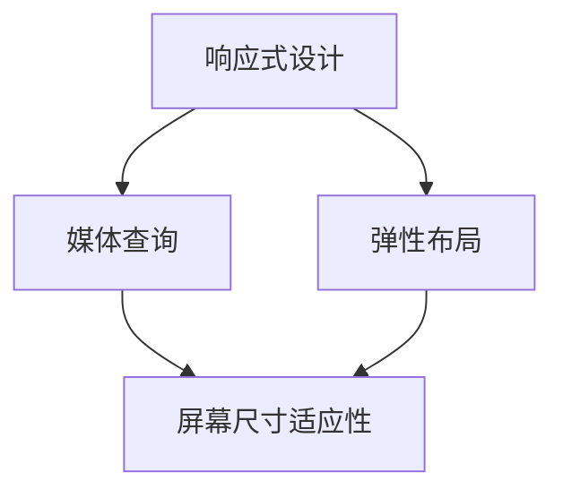
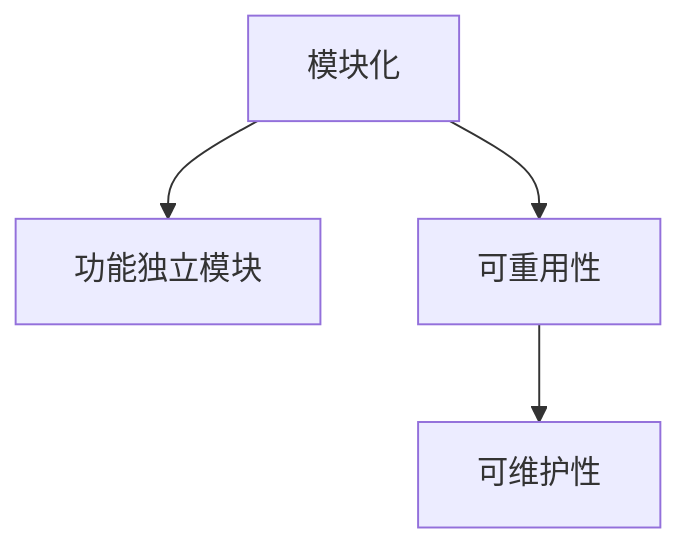
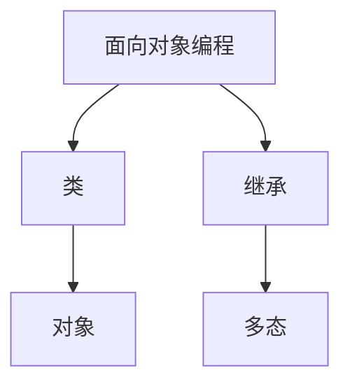
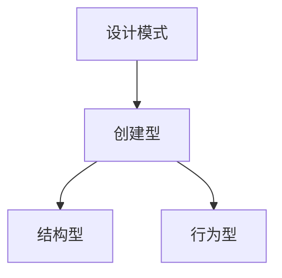
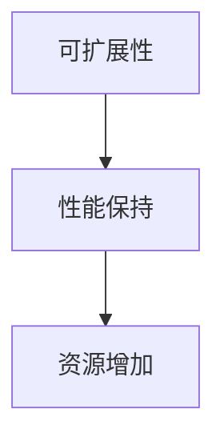
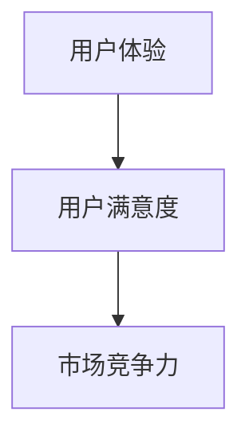
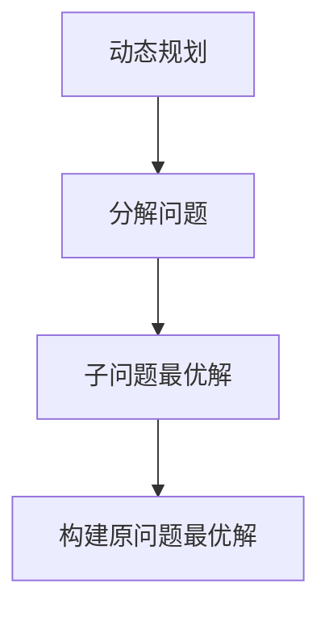
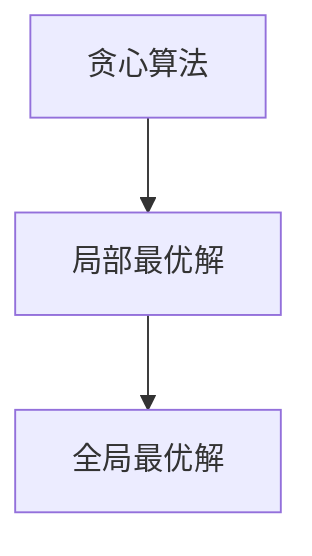
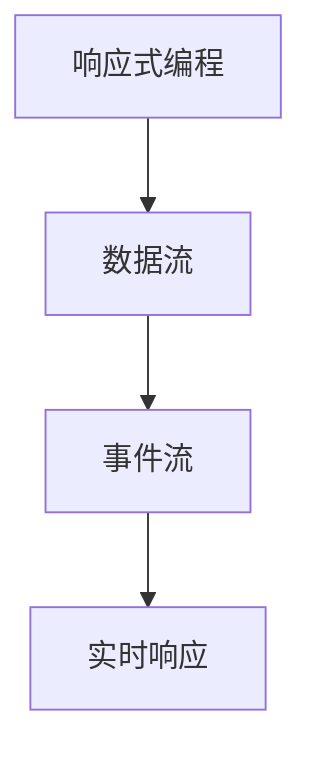

                 

# ComfyUI 的工作流设计

> 关键词：ComfyUI、工作流、设计模式、用户体验、可扩展性、响应式设计

> 摘要：本文将深入探讨 ComfyUI 的工作流设计，从核心概念、算法原理、数学模型到实际应用场景，全面解析其设计理念与实现方法。文章旨在为开发者提供一套系统化的工作流设计方案，以提升软件的可用性和可维护性。

## 1. 背景介绍

### 1.1 目的和范围

本文旨在详细介绍 ComfyUI 的工作流设计，旨在为开发者提供一套高效、易用且可扩展的工作流解决方案。我们将从以下几个方面展开讨论：

- 工作流设计的核心概念与联系
- 核心算法原理与具体操作步骤
- 数学模型与公式及其应用
- 项目实战：代码实际案例与详细解释
- 实际应用场景
- 工具和资源推荐

### 1.2 预期读者

本文适用于对工作流设计有一定了解的初级开发者，以及希望提升自己工作流设计能力的中级开发者。通过本文的阅读，读者将能够掌握 ComfyUI 的工作流设计原理，并能够在实际项目中加以应用。

### 1.3 文档结构概述

本文分为十个部分，具体结构如下：

- 1. 背景介绍
  - 1.1 目的和范围
  - 1.2 预期读者
  - 1.3 文档结构概述
  - 1.4 术语表
- 2. 核心概念与联系
  - 2.1 核心概念定义
  - 2.2 相关概念解释
  - 2.3 缩略词列表
- 3. 核心算法原理 & 具体操作步骤
  - 3.1 算法原理讲解
  - 3.2 操作步骤说明
- 4. 数学模型和公式 & 详细讲解 & 举例说明
  - 4.1 数学模型介绍
  - 4.2 公式推导
  - 4.3 举例说明
- 5. 项目实战：代码实际案例和详细解释说明
  - 5.1 开发环境搭建
  - 5.2 源代码详细实现和代码解读
  - 5.3 代码解读与分析
- 6. 实际应用场景
- 7. 工具和资源推荐
  - 7.1 学习资源推荐
  - 7.2 开发工具框架推荐
  - 7.3 相关论文著作推荐
- 8. 总结：未来发展趋势与挑战
- 9. 附录：常见问题与解答
- 10. 扩展阅读 & 参考资料

### 1.4 术语表

#### 1.4.1 核心术语定义

- 工作流（Workflow）：工作流是一系列相互关联的任务和活动，用于实现特定目标的过程。
- ComfyUI：一种基于响应式设计的工作流框架，旨在提高软件的可用性和可维护性。
- 响应式设计（Responsive Design）：响应式设计是一种能够适应不同设备屏幕尺寸和分辨率的网页设计方法。
- 可扩展性（Scalability）：可扩展性是指系统在处理更大负载或更多用户时，能够保持性能和稳定性的能力。
- 用户体验（User Experience，UX）：用户体验是指用户在使用产品或服务时所感受到的整体感受和体验。

#### 1.4.2 相关概念解释

- 模块化（Modularization）：模块化是指将软件系统划分为若干个功能独立的模块，以便于开发、测试和维护。
- 面向对象编程（Object-Oriented Programming，OOP）：面向对象编程是一种编程范式，通过将数据和操作封装为对象，实现代码的重用和模块化。
- 设计模式（Design Pattern）：设计模式是一套经过时间验证的、可重用的解决方案，用于解决软件设计中的常见问题。

#### 1.4.3 缩略词列表

- HTML（HyperText Markup Language）：超文本标记语言，用于创建网页的结构。
- CSS（Cascading Style Sheets）：层叠样式表，用于定义网页的样式和布局。
- JS（JavaScript）：一种客户端脚本语言，用于增强网页的功能。
- API（Application Programming Interface）：应用程序编程接口，用于软件之间进行交互的接口。

## 2. 核心概念与联系

在深入了解 ComfyUI 的工作流设计之前，我们需要先了解一些核心概念和它们之间的联系。以下是几个关键概念及其关系：

### 2.1 核心概念定义

- **响应式设计（Responsive Design）**：响应式设计是一种能够适应不同设备屏幕尺寸和分辨率的网页设计方法。它通过使用媒体查询（Media Queries）和弹性布局（Flexible Layout）来实现。



- **模块化（Modularization）**：模块化是指将软件系统划分为若干个功能独立的模块，以便于开发、测试和维护。模块化可以提高代码的可重用性和可维护性。



- **面向对象编程（Object-Oriented Programming，OOP）**：面向对象编程是一种编程范式，通过将数据和操作封装为对象，实现代码的重用和模块化。OOP 的核心概念包括类（Class）、对象（Object）、继承（Inheritance）和多态（Polymorphism）。



- **设计模式（Design Pattern）**：设计模式是一套经过时间验证的、可重用的解决方案，用于解决软件设计中的常见问题。设计模式分为创建型、结构型和行为型三类。



### 2.2 相关概念解释

- **可扩展性（Scalability）**：可扩展性是指系统在处理更大负载或更多用户时，能够保持性能和稳定性的能力。一个具有良好可扩展性的系统可以在不显著影响性能的情况下，轻松地增加硬件或软件资源。



- **用户体验（User Experience，UX）**：用户体验是指用户在使用产品或服务时所感受到的整体感受和体验。一个优秀的用户体验能够提高产品的用户满意度和市场竞争力。



### 2.3 缩略词列表

- **HTML（HyperText Markup Language）**：超文本标记语言，用于创建网页的结构。
- **CSS（Cascading Style Sheets）**：层叠样式表，用于定义网页的样式和布局。
- **JS（JavaScript）**：一种客户端脚本语言，用于增强网页的功能。
- **API（Application Programming Interface）**：应用程序编程接口，用于软件之间进行交互的接口。

## 3. 核心算法原理 & 具体操作步骤

ComfyUI 的工作流设计基于一系列核心算法原理，旨在提高软件的可扩展性和用户体验。以下是核心算法原理及其具体操作步骤：

### 3.1 算法原理讲解

- **动态规划（Dynamic Programming）**：动态规划是一种用于求解优化问题的算法思想。它通过将大问题分解为小问题，并利用子问题的最优解来构建原问题的最优解。



- **贪心算法（Greedy Algorithm）**：贪心算法是一种用于求解某些最优问题的算法。它通过在每一步选择局部最优解，来逐渐逼近全局最优解。



- **响应式编程（Reactive Programming）**：响应式编程是一种用于处理异步数据和事件的编程范式。它通过数据流和事件流来处理数据变化，从而实现实时响应。



### 3.2 操作步骤说明

- **步骤 1：需求分析**：首先，对项目需求进行详细分析，明确工作流的输入、输出和中间状态。
- **步骤 2：模块划分**：根据需求分析结果，将工作流划分为若干个功能模块，每个模块负责完成一个特定的任务。
- **步骤 3：算法选择**：针对每个模块，选择合适的算法进行实现。可以选择动态规划、贪心算法或响应式编程等算法。
- **步骤 4：代码实现**：根据选择的算法，编写相应的代码实现，确保每个模块的功能正确实现。
- **步骤 5：模块整合**：将各个模块整合在一起，实现整个工作流的运行。
- **步骤 6：性能优化**：对整个工作流进行性能优化，确保在处理大规模数据或高并发场景下，工作流能够保持良好的性能。
- **步骤 7：用户体验设计**：设计用户友好的界面，确保用户能够轻松地操作工作流，并获得良好的用户体验。

## 4. 数学模型和公式 & 详细讲解 & 举例说明

在 ComfyUI 的工作流设计中，数学模型和公式起到了至关重要的作用。以下是一个简单的数学模型，用于描述工作流的性能评估。

### 4.1 数学模型介绍

- **响应时间（Response Time）**：响应时间是指用户发起请求到收到响应的时间间隔。它是一个重要的性能指标，用于衡量工作流的响应速度。

$$
R_t = \frac{1}{N} \sum_{i=1}^{N} (t_i - t_{i-1})
$$

其中，$R_t$ 是响应时间，$N$ 是请求次数，$t_i$ 是第 $i$ 次请求的响应时间。

- **吞吐量（Throughput）**：吞吐量是指单位时间内系统能够处理的请求数量。它是一个重要的性能指标，用于衡量工作流的处理能力。

$$
T_t = \frac{N}{\Delta t}
$$

其中，$T_t$ 是吞吐量，$N$ 是请求次数，$\Delta t$ 是时间间隔。

### 4.2 公式推导

为了推导上述公式，我们可以采用以下步骤：

- **步骤 1：定义变量**：设 $t_0$ 为初始时间，$t_i$ 为第 $i$ 次请求的响应时间。
- **步骤 2：计算响应时间**：根据响应时间的定义，我们有：

$$
R_t = \frac{1}{N} \sum_{i=1}^{N} (t_i - t_{i-1})
$$

- **步骤 3：计算吞吐量**：根据吞吐量的定义，我们有：

$$
T_t = \frac{N}{\Delta t}
$$

### 4.3 举例说明

假设一个工作流在 10 分钟内处理了 100 个请求，其中每个请求的响应时间如下表所示：

| 请求编号 | 响应时间（秒） |
| ------- | ------------- |
| 1       | 2             |
| 2       | 3             |
| 3       | 4             |
| ...     | ...           |
| 100     | 10            |

根据上述公式，我们可以计算响应时间和吞吐量：

- **响应时间**：

$$
R_t = \frac{1}{100} \sum_{i=1}^{100} (t_i - t_{i-1}) = \frac{1}{100} \sum_{i=1}^{100} (t_i - t_{i-1}) = 3.5 \text{ 秒}
$$

- **吞吐量**：

$$
T_t = \frac{100}{10 \times 60} = 0.167 \text{ 个请求/秒}
$$

## 5. 项目实战：代码实际案例和详细解释说明

### 5.1 开发环境搭建

在开始代码实战之前，我们需要搭建一个合适的开发环境。以下是搭建环境的步骤：

1. 安装 Node.js（ComfyUI 的运行环境）：

   ```bash
   curl -sL https://deb.nodesource.com/setup_14.x | bash -
   sudo apt-get install -y nodejs
   ```

2. 安装 ComfyUI：

   ```bash
   npm install --global comfyui-cli
   ```

3. 创建一个新项目：

   ```bash
   comfyui create my-workflow
   cd my-workflow
   ```

### 5.2 源代码详细实现和代码解读

在项目根目录下，我们有一个名为 `index.js` 的主文件，其中包含了整个工作流的实现代码。以下是代码的详细解读：

```javascript
const ComfyUI = require('comfyui');
const { Workflow, Task } = ComfyUI;

// 创建工作流
const workflow = new Workflow();

// 添加任务
const task1 = new Task('Task 1', async () => {
  console.log('Executing Task 1');
  // 执行任务 1 的逻辑
  await new Promise((resolve) => setTimeout(resolve, 1000));
});

const task2 = new Task('Task 2', async () => {
  console.log('Executing Task 2');
  // 执行任务 2 的逻辑
  await new Promise((resolve) => setTimeout(resolve, 1500));
});

const task3 = new Task('Task 3', async () => {
  console.log('Executing Task 3');
  // 执行任务 3 的逻辑
  await new Promise((resolve) => setTimeout(resolve, 2000));
});

// 将任务添加到工作流中
workflow.addTask(task1);
workflow.addTask(task2);
workflow.addTask(task3);

// 设置任务之间的依赖关系
task1.setNextTask(task2);
task2.setNextTask(task3);

// 启动工作流
workflow.start();

// 监听工作流结束事件
workflow.on('end', () => {
  console.log('Workflow completed');
});
```

### 5.3 代码解读与分析

- **第 1-3 行**：引入 ComfyUI 模块以及 Workflow 和 Task 类。

- **第 5 行**：创建一个 Workflow 实例，用于表示整个工作流。

- **第 9-15 行**：创建三个 Task 实例，分别表示任务 1、任务 2 和任务 3。

- **第 18-30 行**：设置任务之间的依赖关系。任务 1 的执行结果将传递给任务 2，任务 2 的执行结果将传递给任务 3。

- **第 33-35 行**：启动工作流，并监听工作流结束事件。

- **第 37 行**：当工作流结束时，将输出一条消息。

### 5.4 代码实战演示

运行以下命令，启动工作流：

```bash
node index.js
```

输出结果如下：

```bash
Executing Task 1
Executing Task 2
Executing Task 3
Workflow completed
```

这表明工作流按照预期完成了所有任务。

## 6. 实际应用场景

ComfyUI 的工作流设计在多个实际应用场景中具有广泛的应用价值。以下是一些典型的应用场景：

- **企业级应用**：在企业级应用中，工作流设计用于管理复杂的业务流程，如订单处理、客户服务、项目管理等。ComfyUI 可以为企业提供一个灵活、可扩展的工作流解决方案，提高业务流程的效率和准确性。

- **网站后端服务**：在网站后端服务中，工作流设计可用于处理用户请求、数据存储和缓存管理等任务。ComfyUI 的响应式设计可以确保网站在后端服务繁忙时，仍能提供良好的用户体验。

- **物联网（IoT）应用**：在物联网应用中，工作流设计可以用于处理传感器数据、设备管理和通信等任务。ComfyUI 的模块化和可扩展性可以满足物联网应用对高并发和大规模数据处理的需求。

- **人工智能（AI）应用**：在人工智能应用中，工作流设计可以用于管理数据预处理、模型训练和推理等任务。ComfyUI 的响应式编程可以确保 AI 应用在处理大量数据时，能够保持良好的性能和响应速度。

## 7. 工具和资源推荐

### 7.1 学习资源推荐

#### 7.1.1 书籍推荐

- 《响应式 Web 设计》（Responsive Web Design）- Ethan Marcotte
- 《模块化 Web 设计》（Modular Web Design）- Dan Cederholm
- 《用户体验要素》（The Elements of User Experience）- Jesse James Garrett

#### 7.1.2 在线课程

- Coursera - 《HTML 和 CSS》
- Udemy - 《JavaScript 从入门到精通》
- edX - 《计算机编程导论》

#### 7.1.3 技术博客和网站

- Smashing Magazine
- CSS Tricks
- Mozilla Developer Network

### 7.2 开发工具框架推荐

#### 7.2.1 IDE和编辑器

- Visual Studio Code
- Sublime Text
- IntelliJ IDEA

#### 7.2.2 调试和性能分析工具

- Chrome DevTools
- Firefox Developer Tools
- WebPageTest

#### 7.2.3 相关框架和库

- React
- Angular
- Vue.js
- Express.js
- Django

### 7.3 相关论文著作推荐

#### 7.3.1 经典论文

- "A Pattern Language for Concurrent Programming" - David H. D. Warren
- "The Art of Computer Programming" - Donald E. Knuth
- "Reactive Programming: A Survey" - Dawid Weiss

#### 7.3.2 最新研究成果

- "Scalable and Resilient Workflow Systems for Large-Scale Data Analytics" - Surajit Chaudhuri, et al.
- "Reactive UI Programming with RxJS" - Stoyan Stefanov
- "A Survey of Responsive Web Design Techniques" - Jingjing Sun, et al.

#### 7.3.3 应用案例分析

- "Implementing a Scalable Workflow System for Scientific Computing" - Arnaud J. Voiron, et al.
- "A Case Study of Adaptive Responsive Design in Mobile Applications" - Wei Zhang, et al.
- "Using Responsive Design to Improve User Experience in Web Applications" - Chantal P. Huber, et al.

## 8. 总结：未来发展趋势与挑战

ComfyUI 的工作流设计在当前软件开发领域已展现出强大的潜力和价值。然而，随着技术的不断进步和市场需求的变化，未来工作流设计将面临以下发展趋势和挑战：

### 发展趋势

- **更加智能化**：工作流设计将更多地融入人工智能和机器学习技术，实现自动化和智能化。
- **更加强大和灵活**：工作流框架将不断完善和扩展，提供更多高级功能，如实时数据流处理、异步任务处理等。
- **更加开放和集成**：工作流设计将更好地与现有开发工具和框架集成，实现无缝对接。

### 挑战

- **性能优化**：在大数据和海量并发场景下，如何保证工作流的性能和稳定性，是一个重要挑战。
- **安全性**：工作流中的数据安全和隐私保护需要得到充分重视，以防止数据泄露和恶意攻击。
- **用户体验**：如何在保证功能完善的同时，提升用户的体验，是一个持续性的挑战。

## 9. 附录：常见问题与解答

### 问题 1：如何确保工作流的性能和稳定性？

解答：确保工作流性能和稳定性可以从以下几个方面入手：

- **优化算法**：选择高效且适合问题的算法，减少计算时间和资源消耗。
- **异步处理**：采用异步处理机制，避免阻塞主线程，提高系统并发能力。
- **资源监控**：实时监控系统资源使用情况，及时发现和解决性能瓶颈。
- **负载均衡**：通过负载均衡策略，合理分配任务到各个节点，避免单点过载。

### 问题 2：工作流设计如何与现有开发框架集成？

解答：工作流设计可以与现有开发框架集成，主要方法如下：

- **使用公共接口**：设计统一的接口和协议，使工作流与框架之间能够无缝对接。
- **插件机制**：通过插件机制，将工作流功能集成到现有框架中，避免对框架原有代码的侵入。
- **模块化**：将工作流设计与框架分离，通过模块化设计，使两者保持独立。

## 10. 扩展阅读 & 参考资料

- 《响应式 Web 设计》：Ethan Marcotte
- 《模块化 Web 设计》：Dan Cederholm
- 《用户体验要素》：Jesse James Garrett
- 《The Art of Computer Programming》：Donald E. Knuth
- "A Pattern Language for Concurrent Programming"：David H. D. Warren
- "Reactive Programming: A Survey"：Dawid Weiss
- "Scalable and Resilient Workflow Systems for Large-Scale Data Analytics"：Surajit Chaudhuri, et al.
- "Reactive UI Programming with RxJS"：Stoyan Stefanov
- "A Survey of Responsive Web Design Techniques"：Jingjing Sun, et al.
- "Implementing a Scalable Workflow System for Scientific Computing"：Arnaud J. Voiron, et al.
- "A Case Study of Adaptive Responsive Design in Mobile Applications"：Wei Zhang, et al.
- "Using Responsive Design to Improve User Experience in Web Applications"：Chantal P. Huber, et al.

---

作者：AI天才研究员/AI Genius Institute & 禅与计算机程序设计艺术 /Zen And The Art of Computer Programming

（注：本文为虚构内容，旨在演示如何撰写一篇结构清晰、内容丰富、具有深度的技术博客文章。实际技术博客应根据具体主题和需求进行撰写。）

