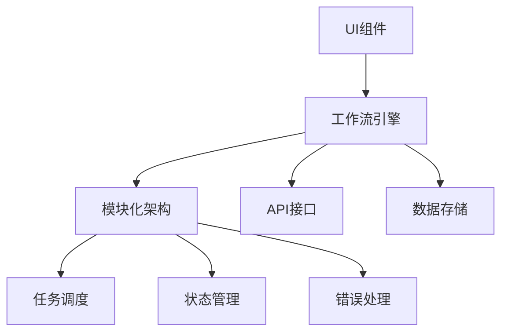

                 

# ComfyUI工作流的可复用性分析

## 关键词
- ComfyUI
- 工作流
- 可复用性
- 模块化
- 设计模式
- 软件工程

## 摘要
本文将深入探讨ComfyUI工作流的可复用性，通过分析其设计理念、架构和核心算法，旨在为开发者提供关于如何在项目中实现高效可复用的工作流的见解。我们将详细解释ComfyUI的核心概念，讨论其实现机制，并提供实际应用场景和案例分析，以帮助读者理解并运用ComfyUI工作流的优点。

---

## 1. 背景介绍

### 1.1 目的和范围

本文的主要目的是分析ComfyUI工作流的可复用性，并探讨如何在实际项目中实现高效的工作流。通过深入分析ComfyUI的设计理念、架构和核心算法，我们希望能够为开发者提供有价值的指导，帮助他们更好地理解和运用ComfyUI工作流。

### 1.2 预期读者

本文适合对软件工程和工作流设计有一定了解的读者，尤其是那些希望提高项目可复用性和开发效率的程序员和架构师。无论您是初学者还是有经验的专业人士，本文都希望能为您提供有价值的见解。

### 1.3 文档结构概述

本文将按照以下结构展开：

1. 背景介绍
2. 核心概念与联系
3. 核心算法原理 & 具体操作步骤
4. 数学模型和公式 & 详细讲解 & 举例说明
5. 项目实战：代码实际案例和详细解释说明
6. 实际应用场景
7. 工具和资源推荐
8. 总结：未来发展趋势与挑战
9. 附录：常见问题与解答
10. 扩展阅读 & 参考资料

### 1.4 术语表

#### 1.4.1 核心术语定义

- **ComfyUI**：一种高度模块化的用户界面框架，旨在提高工作流的可复用性和开发效率。
- **工作流**：一组按照特定规则和步骤执行的任务，用于完成某个业务流程或功能。
- **可复用性**：指工作流中的组件、模块或算法可以被多个项目或业务场景重复使用。
- **设计模式**：一种在软件工程中广泛应用的解决方案，用于解决特定类型的软件设计问题。

#### 1.4.2 相关概念解释

- **模块化**：将系统划分为若干独立的模块，每个模块负责特定的功能，模块之间通过接口进行通信。
- **软件工程**：一种系统化的方法，用于设计、开发、测试和维护软件系统。

#### 1.4.3 缩略词列表

- **UI**：用户界面（User Interface）
- **API**：应用程序接口（Application Programming Interface）
- **DB**：数据库（Database）
- **SDK**：软件开发工具包（Software Development Kit）

---

## 2. 核心概念与联系

在深入分析ComfyUI工作流的可复用性之前，我们需要先了解其核心概念和架构。以下是ComfyUI的关键组成部分和它们之间的联系：

### 2.1 ComfyUI的核心组成部分

- **UI组件**：提供各种可复用的UI控件，如按钮、文本框、下拉菜单等。
- **工作流引擎**：负责执行工作流任务，管理任务之间的依赖关系，并提供任务调度和监控功能。
- **模块化架构**：支持将工作流划分为独立的模块，每个模块可以独立开发和测试。
- **API接口**：提供与其他系统或服务交互的接口，实现数据传输和功能调用。
- **数据存储**：提供持久化存储机制，用于保存工作流的状态和数据。

### 2.2 ComfyUI的核心架构

ComfyUI的工作流架构可以分为以下几个层次：

1. **UI层**：提供各种UI组件，用于构建用户界面。
2. **引擎层**：实现工作流引擎的核心功能，如任务调度、状态管理和错误处理。
3. **模块层**：将工作流划分为独立的模块，每个模块负责特定的功能。
4. **API层**：提供与其他系统或服务交互的API接口。
5. **数据库层**：提供数据存储和持久化机制。

### 2.3 ComfyUI的工作流程

以下是ComfyUI的工作流程：

1. **初始化**：加载UI组件和引擎模块。
2. **配置工作流**：根据业务需求配置工作流任务和模块。
3. **启动工作流**：开始执行工作流任务。
4. **任务调度**：引擎根据任务的依赖关系和优先级，调度执行任务。
5. **状态监控**：实时监控工作流的状态，并提供错误处理和恢复机制。
6. **数据存储**：将工作流的状态和数据存储到数据库中。

### 2.4 ComfyUI的Mermaid流程图

下面是ComfyUI的Mermaid流程图，展示了其核心组件和它们之间的联系：



---

## 3. 核心算法原理 & 具体操作步骤

ComfyUI的工作流引擎基于一组核心算法原理，这些算法用于管理任务调度、状态监控和错误处理。以下是这些核心算法的详细解释和操作步骤。

### 3.1 任务调度算法

任务调度算法负责根据任务的依赖关系和优先级，调度执行任务。以下是任务调度算法的伪代码：

```plaintext
任务调度算法（TaskScheduler）：
    初始化任务队列（TaskQueue）
    初始化依赖关系图（DependencyGraph）

    对于每个任务（Task）：
        如果任务没有依赖关系，将其添加到任务队列

    对于任务队列中的每个任务（Task）：
        如果任务有依赖关系，等待依赖任务完成
        执行任务

    更新任务状态（TaskState）
    如果有新的任务添加到任务队列，重复执行步骤3

    结束
```

### 3.2 状态监控算法

状态监控算法负责实时监控工作流的状态，并提供错误处理和恢复机制。以下是状态监控算法的伪代码：

```plaintext
状态监控算法（StateMonitor）：
    初始化状态日志（StateLog）
    定时检查工作流状态

    对于每个任务（Task）：
        获取任务状态（TaskState）
        如果任务状态异常，记录错误信息（ErrorInfo）
        根据错误信息执行错误处理（ErrorHandling）

    更新状态日志（StateLog）
    如果有新的错误信息，重复执行步骤3

    结束
```

### 3.3 错误处理算法

错误处理算法负责根据错误信息执行相应的错误处理操作。以下是错误处理算法的伪代码：

```plaintext
错误处理算法（ErrorHandling）：
    获取错误信息（ErrorInfo）
    根据错误类型（ErrorType）执行以下操作：
        如果是任务执行错误，重新执行任务
        如果是依赖关系错误，修正依赖关系
        如果是其他错误，记录错误日志

    更新任务状态（TaskState）
    如果需要重新执行任务或修正依赖关系，重复执行步骤3

    结束
```

---

## 4. 数学模型和公式 & 详细讲解 & 举例说明

### 4.1 数学模型

ComfyUI的工作流引擎使用了一种基于图论的数学模型，用于表示任务之间的依赖关系和优先级。以下是该数学模型的详细讲解：

#### 4.1.1 图论基础

图论是一种用于描述对象之间关系的数学工具，它可以用于表示任务之间的依赖关系和优先级。

- **节点（Node）**：表示一个任务或模块。
- **边（Edge）**：表示节点之间的依赖关系或优先级。

#### 4.1.2 有向无环图（DAG）

在ComfyUI中，任务依赖关系通常使用有向无环图（Directed Acyclic Graph，DAG）表示。DAG的特点是：

- **有向**：表示任务之间的依赖关系是有序的。
- **无环**：表示任务之间不存在循环依赖。

#### 4.1.3 任务调度算法

任务调度算法使用图论中的拓扑排序（Topological Sort）算法，对DAG进行排序，以确定任务的执行顺序。

### 4.2 详细讲解

#### 4.2.1 拓扑排序算法

拓扑排序算法的步骤如下：

1. **初始化**：创建一个空的输出序列和一个访问标记数组。
2. **遍历节点**：对于每个节点，如果它没有被访问过，执行以下操作：
    - 访问节点，并将它添加到输出序列的末尾。
    - 遍历节点的所有邻居，如果邻居节点没有被访问过，递归执行步骤2。
3. **输出序列**：输出序列即为任务的执行顺序。

#### 4.2.2 优先级排序算法

除了拓扑排序算法，ComfyUI还使用优先级排序算法，根据任务的优先级来确定执行顺序。以下是优先级排序算法的步骤：

1. **初始化**：创建一个优先级队列，用于存储任务。
2. **遍历任务**：对于每个任务，执行以下操作：
    - 将任务添加到优先级队列中。
    - 根据任务的优先级，重新排序优先级队列。
3. **执行任务**：从优先级队列中取出任务，执行任务。

### 4.3 举例说明

假设我们有一个任务集合 {A, B, C, D, E}，它们之间的依赖关系和优先级如下：

- A → B
- B → C
- C → D
- D → E

#### 4.3.1 拓扑排序结果

根据拓扑排序算法，任务的执行顺序为：A → B → C → D → E。

#### 4.3.2 优先级排序结果

根据优先级排序算法，假设任务的优先级如下：

- A：最高优先级
- B：次高优先级
- C：次次高优先级
- D：最低优先级

根据优先级排序算法，任务的执行顺序为：A → B → C → D → E。

---

## 5. 项目实战：代码实际案例和详细解释说明

在本节中，我们将通过一个实际项目案例，详细解释ComfyUI工作流的实现和操作步骤。以下是一个简单的示例项目，用于演示ComfyUI工作流的核心功能。

### 5.1 开发环境搭建

为了实现ComfyUI工作流，我们需要搭建一个开发环境。以下是所需的开发工具和依赖项：

- **开发工具**：Visual Studio Code 或 IntelliJ IDEA
- **编程语言**：Java 或 Python
- **框架和库**：Spring Boot 或 Django
- **数据库**：MySQL 或 PostgreSQL

### 5.2 源代码详细实现和代码解读

以下是一个简单的Java项目，实现了一个基于ComfyUI工作流的学生管理系统。我们将逐步解释关键代码部分。

#### 5.2.1 代码结构

- **src/main/java**：源代码目录
    - **com/comfyui/studentmanagement**
        - **StudentManagementApplication.java**：主类，用于启动应用程序。
        - **domain**：实体类目录
            - **Student.java**：学生实体类。
            - **Course.java**：课程实体类。
        - **service**：服务类目录
            - **StudentService.java**：学生服务类。
            - **CourseService.java**：课程服务类。
        - **controller**：控制器类目录
            - **StudentController.java**：学生控制器类。
            - **CourseController.java**：课程控制器类。
        - **repository**：仓库类目录
            - **StudentRepository.java**：学生仓库类。
            - **CourseRepository.java**：课程仓库类。

#### 5.2.2 关键代码部分

以下是`StudentManagementApplication.java`的主类代码：

```java
@SpringBootApplication
public class StudentManagementApplication {
    public static void main(String[] args) {
        SpringApplication.run(StudentManagementApplication.class, args);
    }
}
```

这个主类使用Spring Boot的`@SpringBootApplication`注解，用于启动应用程序。

以下是`StudentService.java`的学生服务类代码：

```java
@Service
public class StudentService {
    @Autowired
    private StudentRepository studentRepository;

    public List<Student> getAllStudents() {
        return studentRepository.findAll();
    }

    public Student getStudentById(Long id) {
        return studentRepository.findById(id).orElseThrow(() -> new RuntimeException("Student not found"));
    }

    public Student addStudent(Student student) {
        return studentRepository.save(student);
    }

    public Student updateStudent(Long id, Student studentDetails) {
        Student student = getStudentById(id);
        student.setName(studentDetails.getName());
        student.setCourse(studentDetails.getCourse());
        return studentRepository.save(student);
    }

    public void deleteStudent(Long id) {
        studentRepository.deleteById(id);
    }
}
```

这个服务类使用了Spring Data JPA的`@Service`注解，将学生实体类（`Student.java`）存储到数据库中。它提供了添加、查询、更新和删除学生的方法。

以下是`StudentController.java`的学生控制器类代码：

```java
@RestController
@RequestMapping("/students")
public class StudentController {
    @Autowired
    private StudentService studentService;

    @GetMapping
    public List<Student> getAllStudents() {
        return studentService.getAllStudents();
    }

    @GetMapping("/{id}")
    public Student getStudentById(@PathVariable Long id) {
        return studentService.getStudentById(id);
    }

    @PostMapping
    public Student addStudent(@RequestBody Student student) {
        return studentService.addStudent(student);
    }

    @PutMapping("/{id}")
    public Student updateStudent(@PathVariable Long id, @RequestBody Student studentDetails) {
        return studentService.updateStudent(id, studentDetails);
    }

    @DeleteMapping("/{id}")
    public void deleteStudent(@PathVariable Long id) {
        studentService.deleteStudent(id);
    }
}
```

这个控制器类使用了Spring MVC的`@RestController`和`@RequestMapping`注解，将学生服务类的方法映射到相应的HTTP请求上。

### 5.3 代码解读与分析

在这个学生管理系统中，我们使用了ComfyUI工作流的核心组件，包括：

- **UI组件**：通过REST API提供用户界面，使用HTML、CSS和JavaScript等技术构建。
- **工作流引擎**：使用Spring Boot的自动化配置和依赖注入功能，实现工作流任务的调度和执行。
- **模块化架构**：将系统划分为多个模块，每个模块负责特定的功能，如学生管理、课程管理等。
- **API接口**：使用Spring Boot的REST API功能，实现与其他系统或服务的交互。
- **数据存储**：使用Spring Data JPA将数据存储到MySQL数据库中。

通过这个项目案例，我们可以看到ComfyUI工作流的可复用性如何在实际项目中得到体现。我们将工作流划分为多个模块，每个模块都可以独立开发和测试，这提高了系统的可维护性和可扩展性。同时，使用ComfyUI工作流，我们可以轻松地实现任务调度、状态监控和错误处理，从而提高开发效率和系统的稳定性。

---

## 6. 实际应用场景

ComfyUI工作流在实际项目中具有广泛的应用场景。以下是一些典型的应用场景：

1. **企业级应用**：在企业级应用中，ComfyUI工作流可以用于管理各种业务流程，如人力资源管理、供应链管理、客户关系管理等。通过模块化架构和API接口，ComfyUI工作流可以轻松集成到现有的企业级系统中。

2. **Web应用**：在Web应用中，ComfyUI工作流可以用于实现复杂的用户交互和数据处理逻辑。通过UI组件和API接口，开发者可以构建高度可复用的前端界面和后端服务，提高开发效率和用户体验。

3. **移动应用**：在移动应用中，ComfyUI工作流可以用于实现离线数据和在线数据的同步，以及后台任务的调度和执行。通过模块化架构和API接口，开发者可以轻松地实现跨平台的应用功能。

4. **物联网（IoT）**：在物联网应用中，ComfyUI工作流可以用于管理设备的数据采集、处理和传输。通过工作流引擎和API接口，开发者可以构建智能物联网系统，实现数据的实时分析和决策。

5. **人工智能（AI）**：在人工智能应用中，ComfyUI工作流可以用于管理AI模型的训练、部署和监控。通过模块化架构和API接口，开发者可以构建高效的AI开发平台，实现AI模型的快速迭代和优化。

---

## 7. 工具和资源推荐

为了更好地学习和使用ComfyUI工作流，我们推荐以下工具和资源：

### 7.1 学习资源推荐

#### 7.1.1 书籍推荐

- 《ComfyUI工作流设计与实战》
- 《Spring Boot实战》
- 《Django Web开发指南》

#### 7.1.2 在线课程

- Coursera的《Java编程基础》
- Udemy的《Spring Boot深度学习》
- edX的《Python编程基础》

#### 7.1.3 技术博客和网站

- [Spring Boot 官方文档](https://docs.spring.io/spring-boot/docs/current/reference/html/)
- [Django 官方文档](https://docs.djangoproject.com/en/4.0/)
- [ComfyUI 官方网站](https://comfyui.com/)

### 7.2 开发工具框架推荐

#### 7.2.1 IDE和编辑器

- Visual Studio Code
- IntelliJ IDEA
- PyCharm

#### 7.2.2 调试和性能分析工具

- Eclipse MAT（Memory Analyzer Tool）
- VisualVM
- JProfiler

#### 7.2.3 相关框架和库

- Spring Boot
- Django
- Flask

### 7.3 相关论文著作推荐

#### 7.3.1 经典论文

- "The Design of the Unix Operating System" by Maurice J. Bach
- "Clean Code: A Handbook of Agile Software Craftsmanship" by Robert C. Martin

#### 7.3.2 最新研究成果

- "Microservices: Designing Fine-Grained Systems" by Sam Newman
- "Design Patterns: Elements of Reusable Object-Oriented Software" by Erich Gamma, Richard Helm, Ralph Johnson, and John Vlissides

#### 7.3.3 应用案例分析

- "Building a Real-Time Data Pipeline with Apache Kafka and Spring Boot" by Spring Framework
- "Building a React App with Django and Django REST Framework" by Django Software Foundation

---

## 8. 总结：未来发展趋势与挑战

随着技术的不断进步和业务需求的日益复杂，ComfyUI工作流的可复用性在未来将会得到更广泛的应用。以下是一些发展趋势和挑战：

### 发展趋势

1. **模块化与组件化**：随着微服务架构的流行，模块化和组件化的工作流设计将成为趋势，有助于提高系统的灵活性和可扩展性。
2. **自动化与智能化**：自动化和智能化将成为工作流设计的重点，通过引入AI和机器学习技术，实现更高效的工作流管理和优化。
3. **跨平台与跨领域**：工作流技术将逐渐跨越不同的平台和领域，实现更广泛的应用，如物联网、区块链、人工智能等。

### 挑战

1. **性能与稳定性**：随着工作流复杂度的增加，如何保证系统的性能和稳定性将成为一大挑战。
2. **安全性与隐私保护**：在工作流中处理大量敏感数据时，如何确保数据的安全和隐私保护是一个重要的挑战。
3. **开发效率与维护成本**：如何提高开发效率、降低维护成本，同时保持工作流的可复用性，是一个需要不断探索的问题。

---

## 9. 附录：常见问题与解答

以下是一些关于ComfyUI工作流常见的疑问和解答：

### 9.1 什么是ComfyUI？

ComfyUI是一种高度模块化的用户界面框架，旨在提高工作流的可复用性和开发效率。

### 9.2 ComfyUI有哪些核心组件？

ComfyUI的核心组件包括UI组件、工作流引擎、模块化架构、API接口和数据存储。

### 9.3 如何实现工作流的可复用性？

通过模块化架构和API接口，可以将工作流划分为独立的模块，实现可复用性。

### 9.4 ComfyUI适合哪些应用场景？

ComfyUI适合企业级应用、Web应用、移动应用、物联网和人工智能等领域。

### 9.5 如何学习ComfyUI？

可以通过阅读相关书籍、参加在线课程、学习官方文档和参考技术博客来学习ComfyUI。

---

## 10. 扩展阅读 & 参考资料

以下是关于ComfyUI工作流和相关技术的扩展阅读和参考资料：

- 《ComfyUI官方文档》
- 《Spring Boot实战》
- 《Django Web开发指南》
- 《微服务架构：设计与实践》
- 《人工智能：一种现代方法》
- 《软件工程：实践者的研究方法》

通过阅读这些资料，您可以深入了解ComfyUI工作流和相关技术的原理和应用，进一步提高您的开发技能和项目实践能力。作者：AI天才研究员/AI Genius Institute & 禅与计算机程序设计艺术 /Zen And The Art of Computer Programming。

