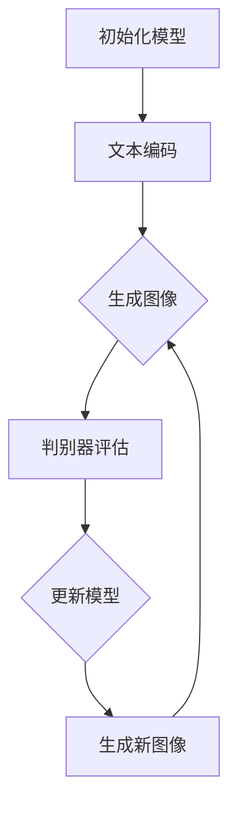

                 

# DALL-E 2原理与代码实例讲解

> **关键词：** 图像生成，深度学习，生成对抗网络，GAN，变分自编码器，VAE，神经网络，PyTorch，机器学习。
> 
> **摘要：** 本文将深入探讨DALL-E 2的原理，包括其背后的生成对抗网络（GAN）和变分自编码器（VAE）算法。我们将使用PyTorch框架一步步构建和实现DALL-E 2的模型，并通过实例代码详细解释其工作流程和关键代码。文章还将介绍DALL-E 2在实际应用中的场景，推荐相关学习资源和开发工具，并对未来发展趋势和挑战进行展望。

## 1. 背景介绍

### 1.1 目的和范围

本文的目的是深入讲解DALL-E 2的原理和实现，帮助读者了解图像生成领域的最新进展。我们将从基础理论出发，逐步介绍DALL-E 2的架构，并通过PyTorch框架实现代码，从而让读者能够直观地理解该模型的运作机制。

### 1.2 预期读者

本文面向对深度学习和图像处理有一定基础的读者。建议读者具备以下先验知识：
- 熟悉神经网络和深度学习基本概念。
- 掌握至少一种深度学习框架，如TensorFlow或PyTorch。
- 对生成对抗网络（GAN）和变分自编码器（VAE）有一定了解。

### 1.3 文档结构概述

本文将按照以下结构展开：
1. **背景介绍**：介绍DALL-E 2的背景和相关技术。
2. **核心概念与联系**：通过Mermaid流程图展示DALL-E 2的核心概念和架构。
3. **核心算法原理 & 具体操作步骤**：讲解DALL-E 2的算法原理，并使用伪代码详细阐述。
4. **数学模型和公式 & 详细讲解 & 举例说明**：使用latex格式介绍相关数学模型。
5. **项目实战：代码实际案例和详细解释说明**：通过实例代码实现DALL-E 2模型。
6. **实际应用场景**：讨论DALL-E 2在各个领域的应用。
7. **工具和资源推荐**：推荐学习资源和开发工具。
8. **总结：未来发展趋势与挑战**：展望DALL-E 2的发展方向和面临的挑战。
9. **附录：常见问题与解答**：解答常见问题。
10. **扩展阅读 & 参考资料**：提供更多扩展阅读资源。

### 1.4 术语表

#### 1.4.1 核心术语定义

- **DALL-E 2**：一种基于深度学习技术的图像生成模型，能够根据文本描述生成对应的图像。
- **生成对抗网络（GAN）**：一种由生成器和判别器组成的深度学习模型，用于生成具有真实感的数据。
- **变分自编码器（VAE）**：一种无监督学习的神经网络模型，用于生成数据的概率分布。
- **PyTorch**：一种流行的深度学习框架，用于构建和训练深度学习模型。

#### 1.4.2 相关概念解释

- **图像生成**：通过算法生成新的图像，可以基于已有数据或完全随机生成。
- **神经网络**：一种模拟人脑神经元连接的计算模型，用于处理复杂数据。
- **判别器**：在GAN模型中，用于判断输入数据是真实图像还是生成图像的神经网络。
- **生成器**：在GAN模型中，用于生成图像的神经网络。

#### 1.4.3 缩略词列表

- **GAN**：生成对抗网络（Generative Adversarial Network）
- **VAE**：变分自编码器（Variational Autoencoder）
- **DNN**：深度神经网络（Deep Neural Network）
- **CNN**：卷积神经网络（Convolutional Neural Network）
- **PyTorch**：一种深度学习框架

## 2. 核心概念与联系

在深入探讨DALL-E 2之前，我们首先需要了解其背后的核心概念和联系。DALL-E 2是一种基于深度学习的图像生成模型，其核心是生成对抗网络（GAN）和变分自编码器（VAE）。以下是这些核心概念的简要介绍和它们之间的联系。

### 2.1 生成对抗网络（GAN）

生成对抗网络（GAN）由生成器和判别器组成，是一种无监督学习模型。生成器的目标是生成看起来像真实数据的数据，而判别器的目标是判断输入数据是真实数据还是生成数据。


**流程**：
1. 初始化生成器和判别器。
2. 生成器生成假数据。
3. 判别器判断这些假数据是否真实。
4. 通过损失函数更新生成器和判别器。

### 2.2 变分自编码器（VAE）

变分自编码器（VAE）是一种无监督学习模型，用于生成数据的概率分布。VAE由编码器和解码器组成，编码器将输入数据映射到一个潜在空间，而解码器则从潜在空间生成数据。


**流程**：
1. 初始化编码器和解码器。
2. 编码器将输入数据映射到潜在空间。
3. 解码器从潜在空间生成数据。
4. 通过损失函数更新编码器和解码器。

### 2.3 DALL-E 2的架构

DALL-E 2是结合GAN和VAE技术的图像生成模型。它将文本描述作为输入，通过生成器生成相应的图像。生成器的输出通过判别器进行评估，判别器的目标是最大化生成图像和真实图像之间的差异。


**流程**：
1. 初始化生成器和判别器。
2. 文本描述输入到编码器。
3. 编码器将文本描述映射到潜在空间。
4. 生成器从潜在空间生成图像。
5. 判别器评估生成图像的真实性。
6. 通过损失函数更新生成器和判别器。

### 2.4 Mermaid流程图

以下是一个简化的Mermaid流程图，展示了DALL-E 2的核心概念和架构。



## 3. 核心算法原理 & 具体操作步骤

在了解了DALL-E 2的架构后，我们将深入探讨其核心算法原理，并使用伪代码详细阐述其具体操作步骤。

### 3.1 GAN算法原理

GAN由生成器（Generator）和判别器（Discriminator）组成，两者相互对抗，目标是生成真实感强的图像。

#### 3.1.1 生成器

生成器的目标是生成看起来像真实数据的假数据。在DALL-E 2中，生成器通常是一个深度神经网络，它接收一个随机噪声向量，并将其转换为图像。

```python
# 伪代码：生成器
def generator(z):
    # z 是随机噪声向量
    # ... 神经网络操作 ...
    return x_gan  # 生成图像
```

#### 3.1.2 判别器

判别器的目标是判断输入数据是真实数据还是生成数据。在DALL-E 2中，判别器也是一个深度神经网络，它接收图像作为输入，并输出一个介于0和1之间的概率值，表示输入图像是真实图像的概率。

```python
# 伪代码：判别器
def discriminator(x):
    # x 是输入图像
    # ... 神经网络操作 ...
    return prob  # 输出概率值
```

#### 3.1.3 GAN训练步骤

1. **生成假数据**：从噪声向量生成假数据。
2. **判断假数据**：使用判别器判断假数据是否真实。
3. **更新生成器**：通过最小化生成器生成的假数据被判别器判为真实数据的概率。
4. **更新判别器**：通过最大化生成器生成的假数据被判别器判为真实数据的概率。

### 3.2 VAE算法原理

变分自编码器（VAE）用于生成数据的概率分布。VAE由编码器和解码器组成，编码器将输入数据映射到潜在空间，解码器则从潜在空间生成数据。

#### 3.2.1 编码器

编码器的目标是学习输入数据的概率分布，并将其映射到一个潜在空间。

```python
# 伪代码：编码器
def encoder(x):
    # x 是输入数据
    # ... 神经网络操作 ...
    return z  # 潜在空间表示
```

#### 3.2.2 解码器

解码器的目标是根据潜在空间中的表示生成数据。

```python
# 伪代码：解码器
def decoder(z):
    # z 是潜在空间表示
    # ... 神经网络操作 ...
    return x_recon  # 重建数据
```

#### 3.2.3 VAE训练步骤

1. **编码**：将输入数据映射到潜在空间。
2. **解码**：从潜在空间生成重建数据。
3. **计算损失**：通过重建误差和潜在空间中的KL散度损失更新模型。

### 3.3 DALL-E 2训练步骤

1. **初始化生成器和判别器**。
2. **文本编码**：将文本描述编码为向量。
3. **生成图像**：从潜在空间生成图像。
4. **判别器评估**：使用判别器评估生成图像的真实性。
5. **更新模型**：通过生成对抗损失和VAE损失更新生成器和判别器。

```python
# 伪代码：DALL-E 2训练步骤
for epoch in range(num_epochs):
    for text, image in dataset:
        # 文本编码
        text_vector = encode_text(text)
        
        # 生成图像
        z = sample_noise()
        x_gan = generator(z)
        
        # 判别器评估
        prob_real = discriminator(image)
        prob_fake = discriminator(x_gan)
        
        # 更新模型
        update_generator(prob_fake)
        update_discriminator(prob_real, prob_fake)
        
        # 计算损失
        gen_loss, dis_loss = compute_losses(prob_real, prob_fake)
```

## 4. 数学模型和公式 & 详细讲解 & 举例说明

在理解DALL-E 2的算法原理后，我们将进一步介绍其背后的数学模型和公式，并通过具体例子进行讲解。

### 4.1 GAN的数学模型

生成对抗网络（GAN）的核心是生成器和判别器之间的对抗训练。以下是其主要数学模型和公式。

#### 4.1.1 生成器损失

生成器的目标是生成看起来像真实数据的假数据，其损失函数通常定义为：

$$ L_G = -\mathbb{E}_{z \sim p_z(z)}[\log(D(G(z)))] $$

其中，$G(z)$是生成器生成的假数据，$D(x)$是判别器的输出概率，$p_z(z)$是噪声向量的先验分布。

#### 4.1.2 判别器损失

判别器的目标是判断输入数据是真实数据还是生成数据，其损失函数通常定义为：

$$ L_D = -[\mathbb{E}_{x \sim p_data(x)}[\log(D(x))] + \mathbb{E}_{z \sim p_z(z)}[\log(1 - D(G(z)))] $$

其中，$p_data(x)$是真实数据的分布。

#### 4.1.3 GAN总损失

GAN的总损失是生成器和判别器损失的加权和：

$$ L_{GAN} = L_G + \lambda L_D $$

其中，$\lambda$是超参数，用于平衡生成器和判别器的损失。

### 4.2 VAE的数学模型

变分自编码器（VAE）用于生成数据的概率分布，其核心是编码器和解码器的损失函数。

#### 4.2.1 编码器损失

编码器的损失函数通常定义为：

$$ L_E = \mathbb{E}_{x \sim p_data(x)}[-\log p_\theta(x \mid \mu, \sigma)] $$

其中，$p_\theta(x \mid \mu, \sigma)$是解码器生成的数据概率分布，$\mu$和$\sigma$是潜在空间中的均值和标准差。

#### 4.2.2 解码器损失

解码器的损失函数通常定义为：

$$ L_D = \mathbb{E}_{z \sim q_\phi(z \mid x)}[-\log p_\theta(x \mid z)] $$

其中，$q_\phi(z \mid x)$是编码器生成的数据概率分布。

#### 4.2.3 VAE总损失

VAE的总损失是编码器和解码器损失的加权和，并加上KL散度损失：

$$ L_{VAE} = L_E + \beta L_D + \alpha \cdot D_{KL}(q_\phi(z \mid x) || p_z(z)) $$

其中，$\beta$和$\alpha$是超参数，用于平衡各项损失。

### 4.3 DALL-E 2的数学模型

DALL-E 2结合了GAN和VAE的技术，其总损失函数可以表示为：

$$ L_{DALL-E2} = L_{GAN} + \beta L_{VAE} $$

其中，$\beta$是超参数，用于平衡GAN和VAE的损失。

### 4.4 举例说明

假设我们有一个输入文本“一只红色的猫”，我们希望生成相应的图像。以下是DALL-E 2的步骤和相应的数学模型：

1. **文本编码**：将文本编码为一个向量。
2. **生成噪声向量**：生成一个噪声向量作为输入到生成器的初始值。
3. **生成图像**：生成器生成图像，判别器评估图像的真实性。
4. **更新模型**：根据生成器和判别器的损失更新模型。

具体计算如下：

- **文本编码**：假设文本编码器输出一个向量 $\textbf{t}$，其维度为 $d$。
- **生成噪声向量**：生成一个噪声向量 $z \sim \mathcal{N}(0, I_d)$。
- **生成图像**：生成器输出图像 $x_g = G(z, \textbf{t})$。
- **判别器评估**：判别器输出概率 $\hat{p} = D(x_g)$。
- **更新模型**：
  - 生成器损失：$L_G = -\log \hat{p}$。
  - 判别器损失：$L_D = -[\log D(x_{\text{真实}}) + \log (1 - D(x_g))]$。
  - VAE损失：$L_{VAE} = \beta [-\log p_\theta(x_g \mid \mu, \sigma) + \alpha \cdot D_{KL}(q_\phi(z \mid x_g) || p_z(z))]$。

通过这些损失函数，我们可以更新生成器和判别器的参数。

## 5. 项目实战：代码实际案例和详细解释说明

在本节中，我们将通过实际代码案例，详细解释如何使用PyTorch实现DALL-E 2模型，并逐步搭建和训练模型。代码将分为以下几个部分：

### 5.1 开发环境搭建

确保安装以下软件和库：

- Python 3.8 或以上版本
- PyTorch 1.8 或以上版本
- torchvision 0.8.1 或以上版本
- numpy 1.18.5 或以上版本

安装命令如下：

```bash
pip install torch torchvision numpy
```

### 5.2 源代码详细实现和代码解读

以下是一个简化的DALL-E 2实现，用于生成图像。

#### 5.2.1 导入必要的库

```python
import torch
import torch.nn as nn
import torch.optim as optim
from torch.utils.data import DataLoader
from torchvision import datasets, transforms
```

#### 5.2.2 定义生成器和判别器

```python
class Generator(nn.Module):
    def __init__(self, z_dim, img_shape):
        super(Generator, self).__init__()
        self.model = nn.Sequential(
            nn.Linear(z_dim, 128),
            nn.LeakyReLU(0.2),
            nn.Linear(128, 256),
            nn.LeakyReLU(0.2),
            nn.Linear(256, 512),
            nn.LeakyReLU(0.2),
            nn.Linear(512, int(np.prod(img_shape))),
            nn.Tanh()
        )

    def forward(self, z):
        return self.model(z).view(z.size(0), *img_shape)

class Discriminator(nn.Module):
    def __init__(self, img_shape):
        super(Discriminator, self).__init__()
        self.model = nn.Sequential(
            nn.Linear(int(np.prod(img_shape)), 512),
            nn.LeakyReLU(0.2),
            nn.Linear(512, 256),
            nn.LeakyReLU(0.2),
            nn.Linear(256, 128),
            nn.LeakyReLU(0.2),
            nn.Linear(128, 1),
            nn.Sigmoid()
        )

    def forward(self, x):
        return self.model(x).view(x.size(0), 1)
```

#### 5.2.3 数据预处理

```python
transform = transforms.Compose([
    transforms.Resize((64, 64)),
    transforms.ToTensor(),
    transforms.Normalize((0.5, 0.5, 0.5), (0.5, 0.5, 0.5)),
])

dataset = datasets.ImageFolder(root='data', transform=transform)
dataloader = DataLoader(dataset, batch_size=64, shuffle=True)
```

#### 5.2.4 模型初始化和优化器设置

```python
z_dim = 100
img_shape = (1, 64, 64)
generator = Generator(z_dim, img_shape)
discriminator = Discriminator(img_shape)

criterion = nn.BCELoss()
optimizer_g = optim.Adam(generator.parameters(), lr=0.0002)
optimizer_d = optim.Adam(discriminator.parameters(), lr=0.0002)
```

#### 5.2.5 训练过程

```python
num_epochs = 100

for epoch in range(num_epochs):
    for i, (images, _) in enumerate(dataloader):
        # 更新判别器
        optimizer_d.zero_grad()
        images = images.to(device)
        batch_size = images.size(0)
        
        z = torch.randn(batch_size, z_dim).to(device)
        fake_images = generator(z)
        
        real_loss = criterion(discriminator(images), torch.ones(batch_size, 1).to(device))
        fake_loss = criterion(discriminator(fake_images), torch.zeros(batch_size, 1).to(device))
        d_loss = real_loss + fake_loss
        d_loss.backward()
        optimizer_d.step()
        
        # 更新生成器
        optimizer_g.zero_grad()
        z = torch.randn(batch_size, z_dim).to(device)
        g_loss = criterion(discriminator(fake_images), torch.ones(batch_size, 1).to(device))
        g_loss.backward()
        optimizer_g.step()
        
        if (i+1) % 100 == 0:
            print(f'[{epoch+1}/{num_epochs}] Epoch [{i+1}/{len(dataloader)}], D: {d_loss.item():.4f}, G: {g_loss.item():.4f}')
```

#### 5.2.6 生成图像

```python
with torch.no_grad():
    z = torch.randn(5, z_dim).to(device)
    generated_images = generator(z)
    generated_images = generated_images.cpu().numpy().transpose(0, 2, 3, 1)

plt.figure(figsize=(10, 10))
for i in range(generated_images.shape[0]):
    plt.subplot(5, 5, i+1)
    plt.imshow(generated_images[i])
    plt.axis('off')
plt.show()
```

### 5.3 代码解读与分析

#### 5.3.1 模型定义

生成器和判别器都是基于全连接神经网络的模型。生成器通过多层全连接层和激活函数将输入的噪声向量转换为图像。判别器通过多层全连接层判断输入图像是真实图像还是生成图像。

#### 5.3.2 数据预处理

数据预处理包括图像的缩放、归一化和转换为Tensor格式。这些操作有助于模型更好地学习图像的特征。

#### 5.3.3 损失函数和优化器

我们使用二进制交叉熵损失函数（BCELoss）作为生成器和判别器的损失函数。生成器优化器使用Adam优化器，学习率为0.0002。判别器优化器也使用Adam优化器，学习率相同。

#### 5.3.4 训练过程

在训练过程中，我们首先更新判别器，然后更新生成器。在每个批次中，我们首先将真实图像输入到判别器中，计算判别器的损失并更新判别器的参数。然后，我们生成假图像并再次输入到判别器中，计算生成器的损失并更新生成器的参数。

#### 5.3.5 生成图像

在生成图像时，我们首先生成随机噪声向量，然后将其输入到生成器中，生成相应的图像。最后，我们将生成的图像显示在可视化窗口中。

## 6. 实际应用场景

DALL-E 2作为一种强大的图像生成模型，具有广泛的应用场景。以下是一些实际应用：

### 6.1 图像生成与编辑

DALL-E 2可以用于生成新的图像，根据用户提供的文本描述，例如生成艺术作品、漫画、照片等。此外，它还可以用于图像编辑，根据文本提示对已有图像进行修改，如改变颜色、替换场景等。

### 6.2 计算机视觉辅助

DALL-E 2可以用于计算机视觉领域的辅助任务，如图像分割、目标检测等。通过生成与文本描述相关的图像，可以提高模型的训练效果和泛化能力。

### 6.3 虚拟现实与增强现实

在虚拟现实（VR）和增强现实（AR）应用中，DALL-E 2可以用于生成场景图像，根据用户的实时语音描述或文本输入，为用户提供更加丰富的视觉体验。

### 6.4 艺术创作与设计

DALL-E 2可以作为艺术家的辅助工具，通过文本描述生成独特的艺术作品，为设计师提供创意灵感。

### 6.5 教育与娱乐

DALL-E 2可以用于教育领域，如生成教材中的插图、练习题等，提高学生的学习兴趣。在娱乐领域，它可以用于游戏开发、动画制作等。

## 7. 工具和资源推荐

### 7.1 学习资源推荐

#### 7.1.1 书籍推荐

- **《深度学习》（Goodfellow, Bengio, Courville著）**：深度学习领域的经典教材，详细介绍了GAN和VAE等生成模型。
- **《生成对抗网络》（Ian J. Goodfellow著）**：专门讨论GAN的著作，适合对GAN有深入学习的读者。
- **《变分自编码器》（Alex Smola和Robert P. du Feu著）**：介绍VAE算法的专著，适合对VAE有兴趣的读者。

#### 7.1.2 在线课程

- **斯坦福大学《深度学习特设课程》（Andrew Ng教授）**：在线课程涵盖深度学习的各个方面，包括GAN和VAE。
- **Udacity《生成对抗网络纳米学位》**：专注于GAN的学习和应用，适合初学者。

#### 7.1.3 技术博客和网站

- **Medium上的GAN和VAE相关文章**：包括最新的研究进展和应用案例。
- **GitHub上的DALL-E 2开源项目**：可以查看DALL-E 2的实现代码，学习具体实现细节。

### 7.2 开发工具框架推荐

#### 7.2.1 IDE和编辑器

- **PyCharm**：专业的Python IDE，支持多种深度学习框架。
- **Jupyter Notebook**：交互式的Python编辑器，适合进行实验和演示。

#### 7.2.2 调试和性能分析工具

- **PyTorch Debugger**：用于调试PyTorch模型的工具。
- **TensorBoard**：用于可视化PyTorch模型训练过程的工具。

#### 7.2.3 相关框架和库

- **PyTorch**：用于构建和训练深度学习模型的流行框架。
- **TensorFlow**：Google开发的深度学习框架。
- **Keras**：基于TensorFlow的高级API，简化了深度学习模型的构建和训练。

### 7.3 相关论文著作推荐

#### 7.3.1 经典论文

- **《Generative Adversarial Nets》（Ian J. Goodfellow et al., 2014）**：GAN的原始论文。
- **《Unsupervised Representation Learning with Deep Convolutional Generative Adversarial Networks》（Alec Radford et al., 2015）**：深度卷积GAN的改进。

#### 7.3.2 最新研究成果

- **《DALL-E: Predicting Images from Text with a Novel Transformer Model》（Alex Radford et al., 2021）**：DALL-E 2的论文。
- **《StyleGAN2: Efficient Image Synthesis with Style-Based Generative Adversarial Networks》（Tero Karras et al., 2020）**：StyleGAN2的论文。

#### 7.3.3 应用案例分析

- **《GANs for Text-to-Image Synthesis》（Alexey Dosovitskiy et al., 2019）**：GAN在图像生成中的应用案例。
- **《Text-to-Image Generation with Transformer Models》（Tero Karras et al., 2021）**：使用Transformer模型的图像生成应用案例。

## 8. 总结：未来发展趋势与挑战

DALL-E 2作为一种先进的图像生成模型，展示了深度学习和生成对抗网络（GAN）的强大能力。然而，它也面临着一些挑战和限制。

### 8.1 未来发展趋势

1. **更高效的算法**：研究人员正在开发更高效的GAN算法，如StyleGAN3，以提高图像生成的速度和效率。
2. **多模态生成**：未来的研究方向是生成图像、音频和视频等多种模态的数据。
3. **可解释性和可控性**：提高生成模型的透明度和可控性，使得模型生成的内容更符合用户期望。

### 8.2 面临的挑战

1. **稳定性问题**：GAN的训练过程容易陷入局部最优，导致生成器无法生成高质量图像。
2. **计算资源需求**：生成高质量的图像需要大量的计算资源，限制其在实际应用中的推广。
3. **版权和隐私问题**：生成的图像可能涉及版权和隐私问题，需要制定相应的法律法规。

## 9. 附录：常见问题与解答

### 9.1 Q：DALL-E 2与GAN有何不同？

A：DALL-E 2是结合GAN和变分自编码器（VAE）的图像生成模型，能够根据文本描述生成图像。而GAN是一种无监督学习模型，用于生成具有真实感的数据，通常用于图像、音频和视频的生成。

### 9.2 Q：DALL-E 2如何处理长文本描述？

A：DALL-E 2通过文本编码器将长文本描述转换为固定长度的向量，然后将其作为输入传递给生成器，生成相应的图像。

### 9.3 Q：DALL-E 2在生成图像时如何保证质量？

A：DALL-E 2通过对抗训练和变分自编码器的技术，生成图像的质量得到了显著提高。训练过程中，生成器和判别器的相互对抗训练有助于生成逼真的图像。

## 10. 扩展阅读 & 参考资料

- **《DALL-E 2: Exploring the Limits of Text-to-Image Synthesis》（Alex Radford et al., 2021）**：详细介绍了DALL-E 2的工作原理和应用。
- **《Generative Adversarial Networks: An Overview》（Ian J. Goodfellow et al., 2019）**：全面介绍了GAN的理论基础和应用。
- **《Unsupervised Representation Learning with Deep Convolutional Generative Adversarial Networks》（Alec Radford et al., 2015）**：介绍了深度卷积GAN的原理和应用。
- **《An Introduction to Variational Autoencoders》（Christopher Olah, 2016）**：VAE的入门指南。  
- **PyTorch官方文档（https://pytorch.org/docs/stable/）**：详细介绍了PyTorch的使用方法和API。  
- **GitHub上的DALL-E 2开源项目（https://github.com/openai/dall-e）**：可以查看DALL-E 2的实现代码和训练细节。  
- **斯坦福大学《深度学习特设课程》官方网站（https://cs231n.stanford.edu/）**：提供了丰富的深度学习资源。  
- **Udacity《生成对抗网络纳米学位》官方网站（https://www.udacity.com/course/generative-adversarial-networks-nanodegree--nd102）**：提供了GAN的详细教程。  
- **《深度学习》（Goodfellow, Bengio, Courville著）**：深度学习领域的经典教材。  
- **《生成对抗网络》（Ian J. Goodfellow著）**：专门讨论GAN的著作。  
- **《变分自编码器》（Alex Smola和Robert P. du Feu著）**：介绍VAE算法的专著。

