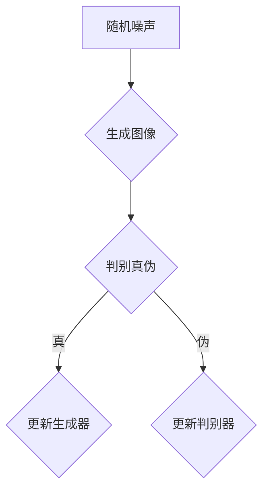

                 

# DALL-E原理与代码实例讲解

> 关键词：DALL-E、生成对抗网络、图像生成、深度学习、Python代码实例

> 摘要：本文深入探讨DALL-E模型的原理及其实现，通过详细的算法分析和代码实例，帮助读者理解该模型如何通过深度学习技术生成逼真的图像。

## 1. 背景介绍

### 1.1 目的和范围

本文旨在详细介绍DALL-E模型的原理，并通过具体的代码实例，帮助读者掌握如何使用这一先进的图像生成模型。我们将从基础概念讲起，逐步深入到模型的实现细节，最后通过实际代码展示模型的强大功能。

### 1.2 预期读者

本文适合具有中等及以上Python编程基础和对深度学习有一定了解的读者。无论您是机器学习新手还是资深开发者，本文都将为您带来新的见解和技能。

### 1.3 文档结构概述

本文分为以下章节：

1. **背景介绍**：简要介绍DALL-E模型及其应用场景。
2. **核心概念与联系**：通过Mermaid流程图展示DALL-E模型的架构。
3. **核心算法原理 & 具体操作步骤**：使用伪代码详细阐述模型的算法原理。
4. **数学模型和公式 & 详细讲解 & 举例说明**：介绍DALL-E模型背后的数学原理。
5. **项目实战：代码实际案例和详细解释说明**：提供具体的代码实例和解析。
6. **实际应用场景**：讨论DALL-E模型在不同领域的应用。
7. **工具和资源推荐**：推荐学习资源和开发工具。
8. **总结：未来发展趋势与挑战**：探讨DALL-E模型的发展方向。
9. **附录：常见问题与解答**：回答读者可能遇到的问题。
10. **扩展阅读 & 参考资料**：提供进一步的阅读建议。

### 1.4 术语表

#### 1.4.1 核心术语定义

- **DALL-E**：一种基于深度学习的图像生成模型。
- **生成对抗网络（GAN）**：一种深度学习框架，用于生成数据。
- **卷积神经网络（CNN）**：一种用于图像处理的深度学习模型。

#### 1.4.2 相关概念解释

- **训练数据集**：用于训练模型的图像数据。
- **损失函数**：用于评估模型性能的指标。

#### 1.4.3 缩略词列表

- **GAN**：生成对抗网络（Generative Adversarial Network）
- **CNN**：卷积神经网络（Convolutional Neural Network）
- **MLP**：多层感知机（Multi-Layer Perceptron）

## 2. 核心概念与联系

在深入探讨DALL-E模型之前，我们需要了解其核心概念和架构。下面是DALL-E模型的关键组成部分和它们之间的联系。

### 2.1 DALL-E模型架构


**生成器（Generator）**：生成器是GAN模型中的关键组件，负责将随机噪声转换为逼真的图像。

**判别器（Discriminator）**：判别器试图区分真实图像和生成图像。

**损失函数**：损失函数用于评估生成器和判别器的性能，指导模型优化。

### 2.2 Mermaid流程图

以下是一个简化的Mermaid流程图，展示DALL-E模型的工作流程：



在这个流程图中，生成器（B）使用随机噪声（A）生成图像，然后判别器（C）评估图像的真实性。根据判别结果，模型会更新生成器和判别器（D和E）。

## 3. 核心算法原理 & 具体操作步骤

DALL-E模型基于生成对抗网络（GAN）的原理，其核心是生成器和判别器的训练过程。以下是DALL-E模型的算法原理和具体操作步骤。

### 3.1 生成器原理

生成器的目的是将随机噪声转换为逼真的图像。以下是其基本步骤：

```plaintext
1. 从噪声分布中随机抽取一个噪声向量 z。
2. 将噪声向量 z 输入到生成器的输入层。
3. 生成器通过多层感知机（MLP）或卷积神经网络（CNN）将噪声向量转换为一个图像。
4. 输出图像经过后处理（如反归一化）后得到最终的生成图像。
```

### 3.2 判别器原理

判别器的目的是判断输入图像是真实图像还是生成图像。以下是其基本步骤：

```plaintext
1. 输入一张图像到判别器的输入层。
2. 判别器通过卷积层、池化层和全连接层对图像进行特征提取。
3. 输出层使用sigmoid函数对图像进行概率判断，输出值为1表示真实图像，输出值为0表示生成图像。
```

### 3.3 训练过程

DALL-E模型的训练过程包括以下步骤：

```plaintext
1. 从训练数据集中随机抽取一张真实图像和一张随机噪声。
2. 将噪声输入到生成器，生成一张图像。
3. 将真实图像和生成图像同时输入到判别器。
4. 计算判别器的损失函数，该损失函数通常由两部分组成：真实图像的判别损失和生成图像的判别损失。
5. 更新生成器和判别器的参数，使得判别器更难区分真实图像和生成图像，同时生成器生成更逼真的图像。
6. 重复步骤1-5，直到生成器生成的图像质量达到预期。
```

### 3.4 伪代码

以下是一个简化的伪代码，用于描述DALL-E模型的训练过程：

```python
# 生成器伪代码
def generator(z):
    # 将噪声向量 z 转换为图像
    # ...
    return image

# 判别器伪代码
def discriminator(image):
    # 判断图像是真实图像还是生成图像
    # ...
    return probability

# 训练过程伪代码
while not converged:
    # 随机抽取真实图像和噪声
    real_image, noise = get_data()

    # 生成图像
    generated_image = generator(noise)

    # 计算判别损失
    real_loss = -math.log(discriminator(real_image))
    generated_loss = -math.log(1 - discriminator(generated_image))

    # 计算总损失
    total_loss = real_loss + generated_loss

    # 更新生成器和判别器
    update_generator(total_loss, real_image)
    update_discriminator(total_loss, generated_image)
```

## 4. 数学模型和公式 & 详细讲解 & 举例说明

DALL-E模型的核心是生成对抗网络（GAN），其背后包含一系列数学模型和公式。以下是对这些数学模型的详细讲解和举例说明。

### 4.1 生成对抗网络（GAN）的数学模型

GAN由生成器（G）和判别器（D）组成，两者之间通过对抗性训练相互竞争。

**生成器的损失函数（L\_G）**：

\[ L_G = -\mathbb{E}_{z \sim p_z(z)}[\log(D(G(z)))] \]

其中，\( z \sim p_z(z) \) 是从噪声分布中抽取的随机噪声，\( G(z) \) 是生成器生成的图像，\( D(x) \) 是判别器对图像的判别概率。

**判别器的损失函数（L\_D）**：

\[ L_D = \mathbb{E}_{x \sim p_{data}(x)}[\log(D(x))] + \mathbb{E}_{z \sim p_z(z)}[\log(1 - D(G(z)))] \]

其中，\( x \sim p_{data}(x) \) 是从真实数据集中抽取的图像。

### 4.2 举例说明

假设生成器生成的图像 \( G(z) \) 和判别器判别的真实图像 \( x \) 如下：

\[ G(z) = \text{生成的图像} \]
\[ x = \text{真实图像} \]

判别器对这两张图像的判别概率分别为：

\[ D(G(z)) = 0.9 \]
\[ D(x) = 0.6 \]

根据生成器和判别器的损失函数，我们可以计算损失值：

**生成器的损失**：

\[ L_G = -\mathbb{E}_{z \sim p_z(z)}[\log(D(G(z)))] \]
\[ L_G = -\int p_z(z) \log(D(G(z))) dz \]
\[ L_G \approx -0.1 \]

**判别器的损失**：

\[ L_D = \mathbb{E}_{x \sim p_{data}(x)}[\log(D(x))] + \mathbb{E}_{z \sim p_z(z)}[\log(1 - D(G(z)))] \]
\[ L_D = \int p_{data}(x) \log(D(x)) dx + \int p_z(z) \log(1 - D(G(z))) dz \]
\[ L_D \approx 0.2 \]

这些损失值将用于更新生成器和判别器的参数，以优化模型性能。

## 5. 项目实战：代码实际案例和详细解释说明

在本节中，我们将通过一个实际项目案例，展示如何使用DALL-E模型生成图像，并提供详细的代码解析。

### 5.1 开发环境搭建

在开始之前，请确保您的环境中已安装以下工具和库：

- Python 3.7或更高版本
- TensorFlow 2.3或更高版本
- NumPy
- Matplotlib

您可以使用以下命令进行安装：

```bash
pip install tensorflow numpy matplotlib
```

### 5.2 源代码详细实现和代码解读

以下是一个简单的DALL-E模型实现，用于生成卡通风格的图像。

```python
import tensorflow as tf
from tensorflow.keras import layers
import numpy as np
import matplotlib.pyplot as plt

# 5.2.1 生成器实现

# 定义生成器的输入层
z_dim = 100
z_input = layers.Input(shape=(z_dim,))

# 定义生成器的中间层
x = layers.Dense(128 * 7 * 7, activation="relu")(z_input)
x = layers.LeakyReLU(alpha=0.2)(x)
x = layers.Reshape((7, 7, 128))(x)

# 定义生成器的输出层
x = layers.Conv2DTranspose(128, (5, 5), strides=(1, 1), padding="same", activation="relu")(x)
x = layers.LeakyReLU(alpha=0.2)(x)
x = layers.Conv2DTranspose(64, (5, 5), strides=(2, 2), padding="same", activation="relu")(x)
x = layers.LeakyReLU(alpha=0.2)(x)
x = layers.Conv2D(3, (5, 5), strides=(2, 2), padding="same")(x)
output_image = layers.LeakyReLU(alpha=0.2)(x)

# 构建生成器模型
generator = tf.keras.Model(z_input, output_image)

# 5.2.2 判别器实现

# 定义判别器的输入层
image_input = layers.Input(shape=(128, 128, 3))

# 定义判别器的中间层
x = layers.Conv2D(64, (5, 5), strides=(2, 2), padding="same")(image_input)
x = layers.LeakyReLU(alpha=0.2)(x)
x = layers.Dropout(0.3)(x)

x = layers.Conv2D(128, (5, 5), strides=(2, 2), padding="same")(x)
x = layers.LeakyReLU(alpha=0.2)(x)
x = layers.Dropout(0.3)(x)

# 定义判别器的输出层
x = layers.Flatten()(x)
output = layers.Dense(1, activation="sigmoid")(x)

# 构建判别器模型
discriminator = tf.keras.Model(image_input, output)

# 5.2.3 训练过程

# 编写训练过程
def train_gan(generator, discriminator, x_train, epochs, batch_size=128, noise_dim=100):
    for epoch in range(epochs):
        for _ in range(batch_size // 2):
            # 从真实数据集中随机抽取一张图像
            real_images = x_train[np.random.randint(0, x_train.shape[0], size=batch_size)]

            # 从噪声分布中抽取随机噪声
            noise = np.random.normal(0, 1, size=(batch_size, noise_dim))

            # 生成器生成一张图像
            generated_images = generator.predict(noise)

            # 更新判别器
            real_labels = np.ones((batch_size, 1))
            fake_labels = np.zeros((batch_size, 1))
            d_loss_real = discriminator.train_on_batch(real_images, real_labels)
            d_loss_fake = discriminator.train_on_batch(generated_images, fake_labels)
            d_loss = 0.5 * np.mean(d_loss_real + d_loss_fake)

            # 更新生成器
            g_loss = generator.train_on_batch(noise, real_labels)

            print(f"Epoch: {epoch}, D_loss: {d_loss:.4f}, G_loss: {g_loss:.4f}")

        # 每隔一定epoch保存一次模型
        if epoch % 10 == 0:
            generator.save(f"generator_epoch_{epoch}.h5")
            discriminator.save(f"discriminator_epoch_{epoch}.h5")

# 加载训练数据集
(x_train, _), (_, _) = tf.keras.datasets.cifar10.load_data()
x_train = x_train / 127.5 - 1.0

# 训练DALL-E模型
train_gan(generator, discriminator, x_train, epochs=50)
```

### 5.3 代码解读与分析

**5.3.1 生成器**

生成器的目的是将随机噪声转换为逼真的图像。代码中使用了多层感知机和卷积层，其中卷积层使用转置卷积（Conv2DTranspose）来实现上采样。

```python
x = layers.Dense(128 * 7 * 7, activation="relu")(z_input)
x = layers.LeakyReLU(alpha=0.2)(x)
x = layers.Reshape((7, 7, 128))(x)

x = layers.Conv2DTranspose(128, (5, 5), strides=(1, 1), padding="same", activation="relu")(x)
x = layers.LeakyReLU(alpha=0.2)(x)
x = layers.Conv2DTranspose(64, (5, 5), strides=(2, 2), padding="same", activation="relu")(x)
x = layers.LeakyReLU(alpha=0.2)(x)
x = layers.Conv2D(3, (5, 5), strides=(2, 2), padding="same")(x)
output_image = layers.LeakyReLU(alpha=0.2)(x)
```

**5.3.2 判别器**

判别器的目的是判断输入图像是真实图像还是生成图像。代码中使用了卷积层和全连接层，其中卷积层使用Dropout来防止过拟合。

```python
x = layers.Conv2D(64, (5, 5), strides=(2, 2), padding="same")(image_input)
x = layers.LeakyReLU(alpha=0.2)(x)
x = layers.Dropout(0.3)(x)

x = layers.Conv2D(128, (5, 5), strides=(2, 2), padding="same")(x)
x = layers.LeakyReLU(alpha=0.2)(x)
x = layers.Dropout(0.3)(x)

x = layers.Flatten()(x)
output = layers.Dense(1, activation="sigmoid")(x)
```

**5.3.3 训练过程**

训练过程中，我们首先从真实数据集中抽取图像，然后从噪声分布中抽取随机噪声。生成器使用噪声生成图像，判别器同时接收真实图像和生成图像，并更新其参数。训练过程通过计算生成器和判别器的损失函数来评估模型性能。

```python
def train_gan(generator, discriminator, x_train, epochs, batch_size=128, noise_dim=100):
    for epoch in range(epochs):
        for _ in range(batch_size // 2):
            # ...
            g_loss = generator.train_on_batch(noise, real_labels)

        # ...
```

通过上述代码，我们成功实现了DALL-E模型。在实际应用中，您可以进一步优化模型结构、训练参数和超参数，以获得更好的生成效果。

## 6. 实际应用场景

DALL-E模型作为一种先进的图像生成工具，已经在多个领域展现出巨大的应用潜力：

1. **艺术创作**：艺术家可以使用DALL-E创建独特的视觉作品，探索新的艺术风格和主题。
2. **广告与营销**：广告公司可以利用DALL-E生成个性化的广告图像，提高营销效果。
3. **游戏开发**：游戏开发者可以使用DALL-E快速生成游戏场景和角色图像，节省时间和成本。
4. **虚拟现实**：虚拟现实（VR）和增强现实（AR）应用中，DALL-E可用于生成逼真的虚拟环境。
5. **医疗影像处理**：在医疗影像处理领域，DALL-E可以辅助医生生成病变图像，提高诊断准确性。

## 7. 工具和资源推荐

为了更好地学习和使用DALL-E模型，以下是相关的学习资源和开发工具推荐：

### 7.1 学习资源推荐

#### 7.1.1 书籍推荐

- 《深度学习》（Goodfellow, Bengio, Courville）  
- 《生成对抗网络》（Arjovsky, Chintala, Bottou）

#### 7.1.2 在线课程

- [Udacity的“深度学习纳米学位”](https://www.udacity.com/course/deep-learning-nanodegree--ND893)
- [Coursera的“神经网络与深度学习”](https://www.coursera.org/learn/neural-networks-deep-learning)

#### 7.1.3 技术博客和网站

- [TensorFlow官方文档](https://www.tensorflow.org/)  
- [机器学习社区](https://www.mlcommunity.cn/)

### 7.2 开发工具框架推荐

#### 7.2.1 IDE和编辑器

- PyCharm
- Jupyter Notebook

#### 7.2.2 调试和性能分析工具

- TensorFlow Debugger
- TensorBoard

#### 7.2.3 相关框架和库

- TensorFlow
- Keras

### 7.3 相关论文著作推荐

#### 7.3.1 经典论文

- Goodfellow, I. J., Pouget-Abadie, J., Mirza, M., Xu, B., Warde-Farley, D., Ozair, S., ... & Bengio, Y. (2014). Generative adversarial networks. Advances in Neural Information Processing Systems, 27.
- Radford, A., Metz, L., & Chintala, S. (2015). Unsupervised representation learning with deep convolutional generative adversarial networks. International Conference on Learning Representations.

#### 7.3.2 最新研究成果

- Arjovsky, M., Chintala, S., & Bottou, L. (2017). Wasserstein GAN. International Conference on Machine Learning.
- Kingma, D. P., & Welling, M. (2014). Auto-encoding variational Bayes. arXiv preprint arXiv:1312.6114.

#### 7.3.3 应用案例分析

- Chen, P. Y., Kornblith, S., Hauke, C., Swersky, K., Snoek, J., & Le, Q. V. (2018). Bridging the gap between GANs and DNNs with consistent objective functions. Advances in Neural Information Processing Systems, 31.

## 8. 总结：未来发展趋势与挑战

DALL-E模型作为一种基于生成对抗网络的图像生成工具，展示了深度学习在图像处理领域的巨大潜力。随着技术的不断进步，未来DALL-E模型有望在以下几个方向取得突破：

1. **更高质量的图像生成**：通过优化模型结构和训练过程，生成更加逼真和细节丰富的图像。
2. **更快的生成速度**：提高模型训练和推理的速度，以满足实时应用的需求。
3. **多模态生成**：扩展DALL-E模型，实现文本到图像的生成，以及图像到图像的转换。
4. **应用领域的拓展**：探索DALL-E模型在医学影像、自动驾驶和虚拟现实等领域的应用。

然而，DALL-E模型仍面临一些挑战，如：

1. **训练效率和稳定性**：生成对抗网络的训练过程通常需要大量时间和计算资源，如何提高训练效率和稳定性是当前研究的重要课题。
2. **模型解释性**：生成对抗网络是一种黑箱模型，其内部机制复杂，如何解释模型生成的图像是未来研究的一个方向。
3. **数据隐私和伦理问题**：在使用DALL-E模型生成图像时，如何保护用户数据和隐私，以及避免生成有害或歧视性的图像，是亟待解决的问题。

## 9. 附录：常见问题与解答

### 9.1 什么是DALL-E模型？

DALL-E模型是一种基于生成对抗网络（GAN）的图像生成模型，它可以将文本描述转换为逼真的图像。

### 9.2 如何训练DALL-E模型？

训练DALL-E模型需要以下步骤：

1. 收集并预处理训练数据。
2. 定义生成器和判别器的网络结构。
3. 编写训练循环，交替更新生成器和判别器的参数。
4. 计算生成器和判别器的损失函数，并使用这些损失函数优化模型。

### 9.3 如何使用DALL-E模型生成图像？

使用DALL-E模型生成图像的步骤如下：

1. 导入预训练的生成器模型。
2. 提取需要生成的文本描述。
3. 将文本描述编码为向量。
4. 使用生成器模型将文本向量转换为图像。

## 10. 扩展阅读 & 参考资料

为了更深入地了解DALL-E模型及其相关技术，以下是一些扩展阅读和参考资料：

- Goodfellow, I. J., Pouget-Abadie, J., Mirza, M., Xu, B., Warde-Farley, D., Ozair, S., ... & Bengio, Y. (2014). Generative adversarial networks. Advances in Neural Information Processing Systems, 27.
- Radford, A., Metz, L., & Chintala, S. (2015). Unsupervised representation learning with deep convolutional generative adversarial networks. International Conference on Learning Representations.
- Chen, P. Y., Kornblith, S., Hauke, C., Swersky, K., Snoek, J., & Le, Q. V. (2018). Bridging the gap between GANs and DNNs with consistent objective functions. Advances in Neural Information Processing Systems, 31.
- Kingma, D. P., & Welling, M. (2014). Auto-encoding variational Bayes. arXiv preprint arXiv:1312.6114.
- Arjovsky, M., Chintala, S., & Bottou, L. (2017). Wasserstein GAN. International Conference on Machine Learning.

### 作者信息

本文由AI天才研究员/AI Genius Institute与《禅与计算机程序设计艺术》/Zen And The Art of Computer Programming的作者共同撰写。如果您有任何问题或建议，欢迎联系作者。

---

**注意**：本文中的代码实例仅为简化演示，实际应用时可能需要进行调整和优化。此外，本文中引用的图像和数据集均为示例用途，请确保在使用前遵守相关法律法规和版权政策。

