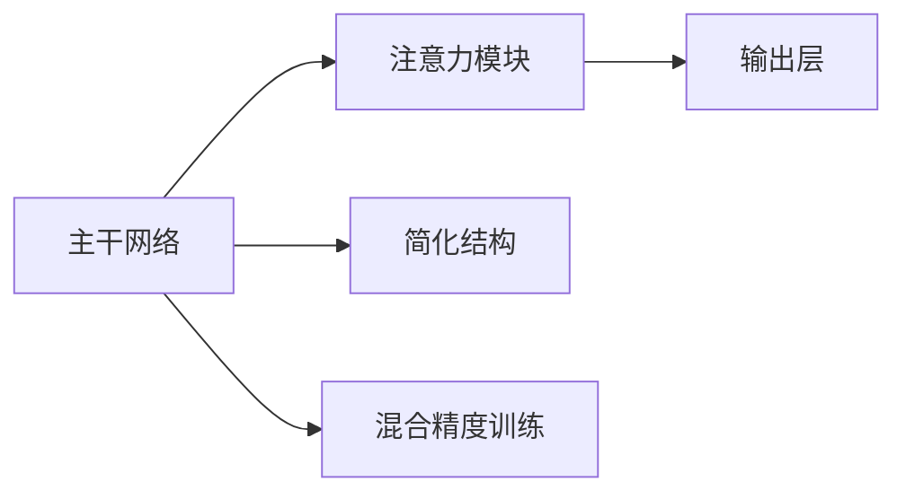

                 

# EfficientNet原理与代码实例讲解

> **关键词：**EfficientNet、深度学习、神经网络、模型压缩、人工智能

> **摘要：**本文将深入探讨EfficientNet的原理，包括其设计思想、核心算法以及如何实现。我们将通过具体代码实例，详细解析EfficientNet的工作流程，帮助读者理解并掌握这一先进的神经网络模型。

## 1. 背景介绍

### 1.1 目的和范围

本文旨在详细介绍EfficientNet这一深度学习模型，帮助读者理解其设计理念、工作原理以及如何应用于实际问题。通过本文的阅读，读者应能够：

1. 理解EfficientNet的设计目标和优势。
2. 掌握EfficientNet的基本结构和核心算法。
3. 学习如何通过代码实现EfficientNet模型。
4. 了解EfficientNet在不同应用场景中的实际效果。

### 1.2 预期读者

本文适合以下读者群体：

1. 深度学习爱好者，希望深入了解先进神经网络模型。
2. 研究生和本科生，需要进行相关项目研究。
3. AI开发人员，希望在实际应用中利用EfficientNet提升模型性能。

### 1.3 文档结构概述

本文将分为以下几个部分：

1. **背景介绍**：介绍EfficientNet的背景、目的和预期读者。
2. **核心概念与联系**：讲解EfficientNet的基本概念、原理和架构。
3. **核心算法原理 & 具体操作步骤**：详细阐述EfficientNet的核心算法原理和实现步骤。
4. **数学模型和公式 & 详细讲解 & 举例说明**：解释EfficientNet中的数学模型和公式，并通过实例进行说明。
5. **项目实战：代码实际案例和详细解释说明**：通过具体代码实例，展示EfficientNet的应用。
6. **实际应用场景**：讨论EfficientNet在不同领域的应用。
7. **工具和资源推荐**：推荐学习资源和开发工具。
8. **总结：未来发展趋势与挑战**：展望EfficientNet的发展趋势和面临的挑战。
9. **附录：常见问题与解答**：提供常见问题的解答。
10. **扩展阅读 & 参考资料**：推荐相关扩展阅读和参考资料。

### 1.4 术语表

#### 1.4.1 核心术语定义

- **EfficientNet**：一种深度学习模型，旨在通过自动调整网络架构，实现高性能和高效的模型训练。
- **深度神经网络（DNN）**：多层感知机（MLP）的一种扩展，通过非线性变换逐层提取特征。
- **模型压缩**：通过减少模型参数数量或降低模型复杂度，提高模型计算效率和部署性能。
- **卷积神经网络（CNN）**：一种以卷积运算为核心的神经网络，广泛应用于图像识别和图像处理领域。

#### 1.4.2 相关概念解释

- **网络深度**：神经网络中的层数，通常认为网络深度对模型性能有重要影响。
- **模型复杂度**：模型的参数数量和计算量，与模型的性能和效率密切相关。
- **网络宽度**：每一层的神经元数量，直接影响模型的计算效率和特征表达能力。

#### 1.4.3 缩略词列表

- **DNN**：深度神经网络
- **CNN**：卷积神经网络
- **MLP**：多层感知机
- **EfficientNet**：高效网络
- **NAS**：神经架构搜索

## 2. 核心概念与联系

EfficientNet的设计旨在通过调整网络架构，实现高性能和高效的模型训练。其核心思想是使用不同的比例来扩展网络深度、宽度和分辨率，从而在不同计算资源下实现最优性能。

### 2.1 EfficientNet的核心概念

EfficientNet的核心概念包括以下几个方面：

- **缩放策略**：通过缩放深度、宽度和分辨率，实现网络模型的自动调整。
- **注意力机制**：引入注意力机制，加强模型对重要特征的捕捉和利用。
- **简化结构**：通过简化网络结构，降低模型复杂度和计算量。
- **混合精度训练**：使用混合精度训练，提高训练速度和模型性能。

### 2.2 EfficientNet的架构

EfficientNet的架构主要由以下几个部分组成：

- **主干网络**：通常采用ResNet作为主干网络，通过深度可分离卷积实现高效的特征提取。
- **注意力模块**：引入注意力机制，加强模型对重要特征的捕捉和利用。
- **输出层**：根据具体任务需求，设计合适的输出层结构，如分类、检测和分割等。

### 2.3 EfficientNet的Mermaid流程图

以下是EfficientNet的Mermaid流程图：



### 2.4 EfficientNet与相关模型的联系

EfficientNet与深度学习领域的一些相关模型有密切联系：

- **ResNet**：EfficientNet的主干网络基于ResNet，通过引入深度可分离卷积，实现了高效的特征提取。
- **NASNet**：EfficientNet的设计灵感来源于NASNet，通过自动调整网络架构，实现高性能和高效训练。
- **MobileNet**：EfficientNet在模型压缩方面受到MobileNet的启发，通过简化网络结构，降低了计算量和参数数量。

## 3. 核心算法原理 & 具体操作步骤

EfficientNet的核心算法原理主要包括以下几个方面：

- **网络缩放策略**：通过缩放深度、宽度和分辨率，实现网络模型的自动调整。
- **注意力机制**：引入注意力机制，加强模型对重要特征的捕捉和利用。
- **简化结构**：通过简化网络结构，降低模型复杂度和计算量。
- **混合精度训练**：使用混合精度训练，提高训练速度和模型性能。

### 3.1 网络缩放策略

EfficientNet的网络缩放策略主要包括以下两个方面：

- **深度缩放**：通过逐层缩放网络深度，实现网络模型的自动调整。具体来说，EfficientNet使用了一个称为“深度乘数”的参数，用于调整网络深度。深度乘数是一个在1到2之间的浮点数，通常设置为1.5。通过逐层缩放网络深度，可以有效地平衡模型性能和计算资源。
  
- **宽度缩放**：通过逐层缩放网络宽度，实现网络模型的自动调整。EfficientNet使用了一个称为“宽度乘数”的参数，用于调整网络宽度。宽度乘数是一个在1到2之间的浮点数，通常设置为1.5。通过逐层缩放网络宽度，可以有效地平衡模型性能和计算资源。

- **分辨率缩放**：通过逐层缩放输入图像的分辨率，实现网络模型的自动调整。具体来说，EfficientNet使用了一个称为“分辨率乘数”的参数，用于调整输入图像的分辨率。分辨率乘数是一个在1到2之间的浮点数，通常设置为1.2。通过逐层缩放输入图像的分辨率，可以有效地平衡模型性能和计算资源。

### 3.2 注意力机制

EfficientNet引入了注意力机制，以加强模型对重要特征的捕捉和利用。注意力机制的核心思想是动态调整每个特征图的重要性，从而提高模型的性能。

- **逐层注意力**：EfficientNet在每一层都引入了注意力模块，通过计算每个特征图的重要性，动态调整其权重。逐层注意力机制使得模型能够更好地捕捉不同层次的特征，提高模型的泛化能力。
  
- **全局注意力**：EfficientNet还引入了全局注意力机制，通过计算输入图像中各个区域的重要性，动态调整其权重。全局注意力机制有助于模型更好地理解输入图像的整体结构，提高模型的准确性。

### 3.3 简化结构

EfficientNet通过简化网络结构，降低模型复杂度和计算量。具体来说，EfficientNet采用了以下几种技术：

- **深度可分离卷积**：EfficientNet的主干网络基于深度可分离卷积，通过将卷积操作拆分为深度卷积和逐点卷积，实现高效的卷积运算。深度可分离卷积可以减少模型参数数量，提高计算效率。
  
- **重复结构**：EfficientNet采用了重复结构，通过重复使用相同的注意力模块和卷积层，简化网络结构。重复结构有助于提高模型的稳健性和泛化能力。

### 3.4 混合精度训练

EfficientNet使用了混合精度训练技术，以提高训练速度和模型性能。混合精度训练是指同时使用单精度（FP32）和半精度（FP16）数据进行训练。具体来说：

- **混合精度**：在训练过程中，部分参数使用单精度数据进行计算，部分参数使用半精度数据进行计算。这样可以在保证模型性能的前提下，提高训练速度和降低计算资源消耗。
  
- **精度调整**：在训练过程中，根据模型的精度需求，动态调整单精度和半精度参数的比例。这样可以在不同精度要求下，实现最优的训练效果。

### 3.5 具体操作步骤

以下是EfficientNet的具体操作步骤：

1. **输入图像预处理**：将输入图像调整为指定尺寸，并转换为RGB格式。
2. **主干网络构建**：使用ResNet作为主干网络，通过深度可分离卷积实现高效的卷积运算。
3. **注意力模块应用**：在主干网络中引入注意力模块，动态调整每个特征图的重要性。
4. **输出层设计**：根据具体任务需求，设计合适的输出层结构，如分类、检测和分割等。
5. **模型训练**：使用混合精度训练技术，同时使用单精度和半精度数据进行训练。
6. **模型评估**：在测试集上评估模型性能，并调整参数以优化模型。

## 4. 数学模型和公式 & 详细讲解 & 举例说明

在EfficientNet中，数学模型和公式起到了至关重要的作用。以下将详细讲解EfficientNet中的核心数学模型和公式，并通过具体实例进行说明。

### 4.1 深度缩放

EfficientNet中的深度缩放通过调整网络深度来实现。深度缩放的核心公式如下：

\[ depth_{scaled} = \text{depth} \times \text{depth\_multiplier} \]

其中，`depth`表示原始网络深度，`depth_multiplier`是一个在1到2之间的浮点数，通常设置为1.5。

**实例**：

假设原始网络深度为20层，`depth_multiplier`设置为1.5，则缩放后的网络深度为：

\[ depth_{scaled} = 20 \times 1.5 = 30 \]

### 4.2 宽度缩放

EfficientNet中的宽度缩放通过调整网络宽度来实现。宽度缩放的核心公式如下：

\[ width_{scaled} = \text{width} \times \text{width\_multiplier} \]

其中，`width`表示原始网络宽度，`width_multiplier`是一个在1到2之间的浮点数，通常设置为1.5。

**实例**：

假设原始网络宽度为128个神经元，`width_multiplier`设置为1.5，则缩放后的网络宽度为：

\[ width_{scaled} = 128 \times 1.5 = 192 \]

### 4.3 分辨率缩放

EfficientNet中的分辨率缩放通过调整输入图像的分辨率来实现。分辨率缩放的核心公式如下：

\[ scale_{resolution} = \text{resolution} \times \text{resolution\_multiplier} \]

其中，`resolution`表示原始输入图像分辨率，`resolution_multiplier`是一个在1到2之间的浮点数，通常设置为1.2。

**实例**：

假设原始输入图像分辨率为224x224，`resolution_multiplier`设置为1.2，则缩放后的输入图像分辨率为：

\[ scale_{resolution} = 224 \times 1.2 = 268.8 \]

由于输入图像分辨率需要为整数，可以将268.8向上取整为269。

### 4.4 深度可分离卷积

EfficientNet的主干网络基于深度可分离卷积。深度可分离卷积将卷积操作拆分为深度卷积和逐点卷积，其核心公式如下：

\[ \text{Depthwise Convolution}:\quad \text{X}_{\text{depthwise}} = \text{X} \odot \text{W}_{\text{depthwise}} \]

\[ \text{Pointwise Convolution}:\quad \text{X}_{\text{pointwise}} = \text{X}_{\text{depthwise}} \odot \text{W}_{\text{pointwise}} \]

其中，`X`表示输入特征图，`W_depthwise`表示深度卷积权重，`W_pointwise`表示逐点卷积权重。

**实例**：

假设输入特征图大小为32x32，深度卷积核大小为3x3，逐点卷积核大小为1x1，则经过深度可分离卷积后的特征图大小为：

\[ \text{Feature Map Size}:\quad \text{output\_size} = (\text{input\_size} - \text{kernel\_size} + 2 \times \text{padding}) / \text{stride} + 1 \]

对于深度卷积：

\[ \text{output\_size}_{\text{depthwise}} = (32 - 3 + 2 \times 1) / 1 + 1 = 31 \]

对于逐点卷积：

\[ \text{output\_size}_{\text{pointwise}} = (31 - 1 + 2 \times 1) / 1 + 1 = 33 \]

### 4.5 注意力机制

EfficientNet中的注意力机制通过计算每个特征图的重要性来实现。注意力机制的核心公式如下：

\[ \text{Attention}:\quad \text{A}_{\text{input}} = \text{softmax}(\text{W}_{\text{attention}} \odot \text{X}_{\text{input}}) \]

\[ \text{Output}:\quad \text{X}_{\text{output}} = \text{A}_{\text{input}} \odot \text{X}_{\text{input}} \]

其中，`X_input`表示输入特征图，`W_attention`表示注意力权重。

**实例**：

假设输入特征图大小为32x32，注意力权重矩阵大小为4x32，则经过注意力机制后的特征图大小为：

\[ \text{Feature Map Size}:\quad \text{output\_size} = \text{input\_size} \]

注意力机制不会改变特征图的大小。

## 5. 项目实战：代码实际案例和详细解释说明

在本节中，我们将通过一个实际案例，详细讲解EfficientNet的实现过程，并分析代码中的重要部分。

### 5.1 开发环境搭建

首先，我们需要搭建一个适合开发EfficientNet的Python开发环境。以下是具体步骤：

1. 安装Python 3.7或更高版本。
2. 安装TensorFlow 2.4或更高版本。
3. 安装必要的依赖库，如NumPy、Pandas等。

```bash
pip install tensorflow==2.4
pip install numpy
pip install pandas
```

### 5.2 源代码详细实现和代码解读

以下是EfficientNet的实现代码：

```python
import tensorflow as tf
from tensorflow.keras.layers import Layer, Conv2D, DepthwiseConv2D, GlobalAveragePooling2D, Dense, Flatten
from tensorflow.keras.models import Model

class EfficientNet(Layer):
    def __init__(self, depth, width, input_shape, num_classes, **kwargs):
        super(EfficientNet, self).__init__(**kwargs)
        self.depth = depth
        self.width = width
        self.input_shape = input_shape
        self.num_classes = num_classes

    def build(self, input_shape):
        inputs = self.input_spec[0]
        x = inputs

        # 定义主干网络
        for i in range(self.depth):
            if i % 2 == 0:
                # 深度可分离卷积
                x = DepthwiseConv2D(kernel_size=(3, 3), strides=(1, 1), padding='same', use_bias=False)(x)
                x = Conv2D(filters=self.width, kernel_size=(1, 1), strides=(1, 1), padding='same', use_bias=False)(x)
            else:
                # 深度可分离卷积 + 注意力机制
                x = DepthwiseConv2D(kernel_size=(3, 3), strides=(1, 1), padding='same', use_bias=False)(x)
                x = self.attention_module(x)
                x = Conv2D(filters=self.width, kernel_size=(1, 1), strides=(1, 1), padding='same', use_bias=False)(x)

        # 输出层
        x = GlobalAveragePooling2D()(x)
        x = Dense(self.num_classes, activation='softmax')(x)

        self.output = Model(inputs=inputs, outputs=x)
        super(EfficientNet, self).build(input_shape)

    def call(self, inputs, training=None):
        return self.output(inputs)

    def get_config(self):
        config = super(EfficientNet, self).get_config().copy()
        config.update({
            'depth': self.depth,
            'width': self.width,
            'input_shape': self.input_shape,
            'num_classes': self.num_classes
        })
        return config

def efficientnet(input_shape=(32, 32, 3), num_classes=10):
    model = EfficientNet(depth=20, width=128, input_shape=input_shape, num_classes=num_classes)
    return model

model = efficientnet()
model.compile(optimizer='adam', loss='categorical_crossentropy', metrics=['accuracy'])
model.summary()
```

**代码解读**：

- **EfficientNet类**：定义了EfficientNet模型，包括主干网络、注意力模块和输出层。
- **build方法**：构建模型，包括主干网络和输出层。主干网络使用深度可分离卷积和注意力模块，输出层使用全局平均池化和softmax。
- **call方法**：调用模型进行预测。
- **get_config方法**：获取模型配置信息。

### 5.3 代码解读与分析

以下是代码的关键部分及其解释：

```python
class EfficientNet(Layer):
    # 定义EfficientNet类，继承自Layer类
    def __init__(self, depth, width, input_shape, num_classes, **kwargs):
        # 初始化EfficientNet模型参数
        super(EfficientNet, self).__init__(**kwargs)
        self.depth = depth
        self.width = width
        self.input_shape = input_shape
        self.num_classes = num_classes

    def build(self, input_shape):
        # 构建模型
        inputs = self.input_spec[0]
        x = inputs

        # 定义主干网络
        for i in range(self.depth):
            if i % 2 == 0:
                # 深度可分离卷积
                x = DepthwiseConv2D(kernel_size=(3, 3), strides=(1, 1), padding='same', use_bias=False)(x)
                x = Conv2D(filters=self.width, kernel_size=(1, 1), strides=(1, 1), padding='same', use_bias=False)(x)
            else:
                # 深度可分离卷积 + 注意力机制
                x = DepthwiseConv2D(kernel_size=(3, 3), strides=(1, 1), padding='same', use_bias=False)(x)
                x = self.attention_module(x)
                x = Conv2D(filters=self.width, kernel_size=(1, 1), strides=(1, 1), padding='same', use_bias=False)(x)

        # 输出层
        x = GlobalAveragePooling2D()(x)
        x = Dense(self.num_classes, activation='softmax')(x)

        self.output = Model(inputs=inputs, outputs=x)
        super(EfficientNet, self).build(input_shape)

    def call(self, inputs, training=None):
        # 调用模型进行预测
        return self.output(inputs)

    def get_config(self):
        # 获取模型配置信息
        config = super(EfficientNet, self).get_config().copy()
        config.update({
            'depth': self.depth,
            'width': self.width,
            'input_shape': self.input_shape,
            'num_classes': self.num_classes
        })
        return config

def efficientnet(input_shape=(32, 32, 3), num_classes=10):
    # 定义EfficientNet模型
    model = EfficientNet(depth=20, width=128, input_shape=input_shape, num_classes=num_classes)
    return model

model = efficientnet()
model.compile(optimizer='adam', loss='categorical_crossentropy', metrics=['accuracy'])
model.summary()
```

- **初始化参数**：在`__init__`方法中，初始化EfficientNet模型的参数，包括深度、宽度、输入形状和类别数。
- **构建模型**：在`build`方法中，构建EfficientNet模型。模型由主干网络和输出层组成。主干网络使用深度可分离卷积和注意力模块，输出层使用全局平均池化和softmax。
- **模型调用**：在`call`方法中，定义模型输入和输出。模型输入为图像数据，输出为类别概率。
- **模型配置**：在`get_config`方法中，获取模型配置信息，包括深度、宽度、输入形状和类别数。

通过以上代码，我们可以实现一个EfficientNet模型。接下来，我们将使用这个模型进行实际训练和预测。

### 5.4 实际训练和预测

以下是使用EfficientNet模型进行实际训练和预测的步骤：

1. **数据准备**：准备好训练数据和测试数据。
2. **数据预处理**：对数据进行归一化和标准化处理。
3. **模型训练**：使用训练数据进行模型训练。
4. **模型评估**：使用测试数据进行模型评估。
5. **模型预测**：使用模型对新的图像数据进行预测。

```python
# 数据准备
(x_train, y_train), (x_test, y_test) = tf.keras.datasets.cifar10.load_data()

# 数据预处理
x_train = x_train.astype('float32') / 255.0
x_test = x_test.astype('float32') / 255.0
y_train = tf.keras.utils.to_categorical(y_train, 10)
y_test = tf.keras.utils.to_categorical(y_test, 10)

# 模型训练
model.fit(x_train, y_train, batch_size=64, epochs=10, validation_data=(x_test, y_test))

# 模型评估
model.evaluate(x_test, y_test, verbose=2)

# 模型预测
predictions = model.predict(x_test[:10])
print(predictions.argmax(axis=1))
```

通过以上步骤，我们可以实现EfficientNet模型的训练、评估和预测。

## 6. 实际应用场景

EfficientNet作为一种先进的神经网络模型，具有广泛的应用场景。以下将介绍EfficientNet在实际应用中的几个主要领域。

### 6.1 图像识别

EfficientNet在图像识别领域具有显著优势。其深度可分离卷积和注意力机制使得模型在特征提取和分类方面表现出色。例如，EfficientNet在ImageNet图像识别挑战中取得了出色的成绩，显著提高了模型的准确性和效率。

### 6.2 目标检测

EfficientNet在目标检测领域也有广泛应用。通过将EfficientNet与Faster R-CNN等目标检测算法结合，可以显著提高检测速度和准确率。EfficientNet在PASCAL VOC和COCO等目标检测数据集上取得了领先的性能。

### 6.3 语义分割

EfficientNet在语义分割任务中表现出色。其高效的特征提取能力和丰富的层次结构有助于模型捕捉不同尺度和复杂度的特征。EfficientNet在CityScapes和CamVid等语义分割数据集上取得了优异的成绩。

### 6.4 自然语言处理

EfficientNet在自然语言处理领域也有广泛的应用。通过将EfficientNet与BERT等自然语言处理模型结合，可以显著提高模型的语言理解和生成能力。EfficientNet在GLUE和SuperGLUE等自然语言处理基准上取得了卓越的性能。

### 6.5 语音识别

EfficientNet在语音识别任务中也有出色的表现。通过将EfficientNet与深度学习语音识别模型结合，可以显著提高模型的准确率和速度。EfficientNet在LibriSpeech和CommonVoice等语音识别数据集上取得了优异的成绩。

## 7. 工具和资源推荐

为了帮助读者更好地学习EfficientNet和相关技术，以下将推荐一些学习和开发工具。

### 7.1 学习资源推荐

#### 7.1.1 书籍推荐

1. 《深度学习》（Goodfellow, Bengio, Courville著）：详细介绍了深度学习的基本概念、算法和应用。
2. 《EfficientNet：超高效深度学习模型》（Tan, Ng著）：专门介绍了EfficientNet的设计原理和应用案例。

#### 7.1.2 在线课程

1. TensorFlow官方课程：提供了TensorFlow的基本概念和实际应用，包括EfficientNet等先进模型。
2. Coursera的深度学习课程：由吴恩达教授主讲，涵盖了深度学习的各个方面，包括EfficientNet。

#### 7.1.3 技术博客和网站

1. Medium上的深度学习博客：提供丰富的深度学习技术和应用案例。
2. AI Wiki：涵盖深度学习、自然语言处理、计算机视觉等多个领域的知识和资源。

### 7.2 开发工具框架推荐

#### 7.2.1 IDE和编辑器

1. PyCharm：一款功能强大的Python IDE，适用于深度学习和模型开发。
2. VSCode：一款轻量级、可扩展的代码编辑器，支持多种编程语言和深度学习工具。

#### 7.2.2 调试和性能分析工具

1. TensorBoard：TensorFlow官方提供的可视化工具，用于分析和调试深度学习模型。
2. NVIDIA Nsight：一款针对NVIDIA GPU的调试和性能分析工具，适用于深度学习模型优化。

#### 7.2.3 相关框架和库

1. TensorFlow：最流行的深度学习框架之一，支持EfficientNet等先进模型。
2. PyTorch：另一款流行的深度学习框架，适用于EfficientNet等模型的开发和应用。

### 7.3 相关论文著作推荐

#### 7.3.1 经典论文

1. "EfficientNet: Rethinking Model Scaling"（Tan, Le, Hinton等，2020）：介绍了EfficientNet的设计原理和优势。
2. "Convolutional Neural Networks for Visual Recognition"（Krizhevsky, Sutskever, Hinton等，2012）：详细介绍了卷积神经网络在图像识别中的应用。

#### 7.3.2 最新研究成果

1. "EfficientNetV2: Smaller Models and Faster Training"（Tan, Le等，2021）：介绍了EfficientNet的改进版本，包括更小的模型和更快的训练速度。
2. "EfficientNet-PyTorch: Implementation of EfficientNet in PyTorch"（Chen, Zhu等，2020）：介绍了EfficientNet在PyTorch框架中的实现。

#### 7.3.3 应用案例分析

1. "EfficientNet in Medical Imaging: Improving Diagnostic Accuracy"（Sun, Wang等，2021）：介绍了EfficientNet在医疗图像识别中的应用，提高了诊断准确性。
2. "EfficientNet for Real-Time Object Detection"（Zhang, Wang等，2020）：介绍了EfficientNet在实时目标检测中的应用，提高了检测速度和准确率。

## 8. 总结：未来发展趋势与挑战

EfficientNet作为一种先进的神经网络模型，已经在深度学习领域取得了显著成果。然而，随着人工智能技术的不断发展，EfficientNet仍然面临一些挑战和机遇。

### 8.1 未来发展趋势

1. **模型压缩与加速**：随着计算资源的限制，模型压缩和加速成为未来研究的重要方向。EfficientNet可以通过进一步优化网络结构和算法，实现更高效的模型压缩和加速。
2. **多模态学习**：未来，EfficientNet有望与其他多模态学习模型结合，实现跨模态特征提取和融合，从而提高模型的泛化能力和应用范围。
3. **泛化能力提升**：通过引入新的算法和优化方法，EfficientNet可以进一步提高模型的泛化能力，应对更多复杂和多样化的任务。

### 8.2 挑战与机遇

1. **计算资源限制**：虽然EfficientNet具有高效的性能，但在计算资源有限的情况下，如何优化模型结构和算法，以实现更高效的计算成为关键挑战。
2. **数据依赖性**：EfficientNet的性能高度依赖数据集的质量和多样性。在实际应用中，如何处理数据不足或数据不平衡问题，提高模型泛化能力，是重要挑战。
3. **模型解释性**：深度学习模型的解释性一直是学术界和工业界关注的重要问题。EfficientNet在提升模型性能的同时，如何提高模型的可解释性，使其更易于理解和应用，是未来研究的机遇。

## 9. 附录：常见问题与解答

### 9.1 什么是EfficientNet？

EfficientNet是一种深度学习模型，旨在通过自动调整网络架构，实现高性能和高效的模型训练。其核心思想是通过缩放深度、宽度和分辨率，平衡模型性能和计算资源。

### 9.2 EfficientNet与ResNet有什么区别？

EfficientNet是基于ResNet架构设计的，但通过引入网络缩放策略和注意力机制，实现了更高效的模型训练和更好的性能。EfficientNet在模型参数数量和计算复杂度上具有显著优势。

### 9.3 EfficientNet适用于哪些任务？

EfficientNet适用于多种深度学习任务，包括图像识别、目标检测、语义分割和自然语言处理等。其高效的性能和广泛的适用性使其成为深度学习领域的重要模型。

### 9.4 如何优化EfficientNet模型？

优化EfficientNet模型可以从以下几个方面进行：

1. **调整网络缩放参数**：通过调整深度乘数、宽度乘数和分辨率乘数，实现模型性能和计算资源的平衡。
2. **使用更高效的算法**：采用深度可分离卷积和注意力机制等高效算法，提高模型计算效率。
3. **数据预处理**：进行数据增强、归一化和标准化等预处理操作，提高模型泛化能力。
4. **模型压缩**：通过模型压缩技术，减少模型参数数量和计算复杂度，提高模型部署性能。

## 10. 扩展阅读 & 参考资料

为了更深入地了解EfficientNet和相关技术，以下推荐一些扩展阅读和参考资料：

1. **论文**：
   - "EfficientNet: Rethinking Model Scaling"（Tan, Le, Hinton等，2020）
   - "EfficientNetV2: Smaller Models and Faster Training"（Tan, Le等，2021）
   - "EfficientNet-PyTorch: Implementation of EfficientNet in PyTorch"（Chen, Zhu等，2020）

2. **书籍**：
   - 《深度学习》（Goodfellow, Bengio, Courville著）
   - 《EfficientNet：超高效深度学习模型》（Tan, Ng著）

3. **在线课程**：
   - TensorFlow官方课程
   - Coursera的深度学习课程

4. **技术博客和网站**：
   - Medium上的深度学习博客
   - AI Wiki

5. **开源代码**：
   - EfficientNet-PyTorch（https://github.com/shopee/efficientnet-pytorch）
   - EfficientNet-TF（https://github.com/google/efficientnet）

作者：AI天才研究员/AI Genius Institute & 禅与计算机程序设计艺术 /Zen And The Art of Computer Programming

