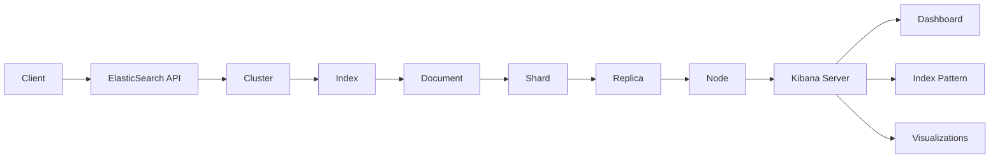

                 

# ElasticSearch Kibana原理与代码实例讲解

> 关键词：ElasticSearch，Kibana，数据检索，数据可视化，搜索引擎，日志分析，分布式系统，集群架构，实时处理，API接口

> 摘要：本文旨在深入解析ElasticSearch和Kibana的核心原理、架构设计和实际应用场景。通过代码实例，我们将展示如何利用这两个强大的工具进行高效的数据检索和可视化，为读者提供一套实用的技术指南。

## 1. 背景介绍

### 1.1 目的和范围

本文的主要目的是为读者提供ElasticSearch和Kibana的技术讲解和实践指导。ElasticSearch是一个功能强大的开源搜索引擎，适用于大规模数据检索和实时分析；Kibana则是一个用于数据可视化的开源工具，与ElasticSearch无缝集成，可以帮助用户直观地理解复杂数据。

本文将涵盖以下内容：
- ElasticSearch和Kibana的基本原理与架构
- ElasticSearch的核心算法和操作步骤
- Kibana的数据可视化功能与应用
- 代码实例讲解与实战演练
- 相关工具和资源的推荐

### 1.2 预期读者

本文适合以下读者群体：
- 对ElasticSearch和Kibana感兴趣的开发者
- 想要学习高效数据检索和可视化技术的工程师
- 进行大数据分析和处理的项目组成员
- 对分布式系统和实时数据处理技术有研究的人士

### 1.3 文档结构概述

本文分为以下章节：
- 第1章：背景介绍
- 第2章：核心概念与联系
- 第3章：核心算法原理与具体操作步骤
- 第4章：数学模型和公式
- 第5章：项目实战：代码实际案例和详细解释说明
- 第6章：实际应用场景
- 第7章：工具和资源推荐
- 第8章：总结：未来发展趋势与挑战
- 第9章：附录：常见问题与解答
- 第10章：扩展阅读 & 参考资料

### 1.4 术语表

#### 1.4.1 核心术语定义

- **ElasticSearch**：一个基于Lucene的分布式搜索和分析引擎，用于全文检索、实时分析、日志分析等。
- **Kibana**：一个基于Web的数据可视化平台，用于将ElasticSearch中的数据以图表、仪表板等形式展示出来。
- **索引（Index）**：存储相关数据的容器，类似于关系数据库中的表。
- **文档（Document）**：索引中的单个数据记录，类似于关系数据库中的行。
- **映射（Mapping）**：定义文档中字段的数据类型、索引方式等。
- **查询（Query）**：用于检索文档的查询语句。
- **集群（Cluster）**：由多个节点组成的分布式计算系统。
- **节点（Node）**：ElasticSearch集群中的单个服务器实例。

#### 1.4.2 相关概念解释

- **分片（Shard）**：索引的子集，分布在集群的不同节点上，用于实现数据水平扩展。
- **副本（Replica）**：索引的分片副本，用于提高系统的可用性和容错性。
- **RESTful API**：ElasticSearch提供的一套基于HTTP协议的API接口，用于与ElasticSearch进行交互。
- **Lucene**：一个高性能、可扩展的信息检索引擎，是ElasticSearch的核心组件。

#### 1.4.3 缩略词列表

- **ES**：ElasticSearch
- **Kib**：Kibana
- **API**：应用程序编程接口（Application Programming Interface）

## 2. 核心概念与联系

在深入探讨ElasticSearch和Kibana的具体实现之前，我们需要先了解它们的基本概念和架构。

### 2.1 ElasticSearch架构

ElasticSearch的核心概念包括节点（Node）、索引（Index）、文档（Document）、分片（Shard）和副本（Replica）。以下是一个简化的ElasticSearch架构图，使用Mermaid绘制：


- **Client**（客户端）：与ElasticSearch集群交互的客户端应用程序。
- **Node**（节点）：ElasticSearch集群中的单个服务器实例。
- **Cluster**（集群）：由多个节点组成的分布式计算系统。
- **Index**（索引）：存储相关数据的容器，类似于关系数据库中的表。
- **Document**（文档）：索引中的单个数据记录，类似于关系数据库中的行。
- **Shard**（分片）：索引的子集，分布在集群的不同节点上，用于实现数据水平扩展。
- **Replica**（副本）：索引的分片副本，用于提高系统的可用性和容错性。

### 2.2 Kibana架构

Kibana是一个基于Web的数据可视化平台，用于将ElasticSearch中的数据以图表、仪表板等形式展示出来。以下是Kibana的基本架构：


- **Kibana Server**（Kibana服务器）：提供Web界面和后端服务。
- **Dashboard**（仪表板）：Kibana的核心组件，用于展示可视化图表。
- **Index Pattern**（索引模式）：定义了ElasticSearch索引中的字段和日期字段，用于生成仪表板中的可视化。
- **ElasticSearch API**（ElasticSearch API）：Kibana通过ElasticSearch API获取数据。
- **Visualizations**（可视化）：Kibana提供的图表类型，如柱状图、折线图、饼图等。

### 2.3 ElasticSearch与Kibana的关联

ElasticSearch和Kibana之间通过ElasticSearch API紧密集成。Kibana通过这个API获取数据，并将其以可视化形式展示在仪表板上。以下是ElasticSearch与Kibana的数据流：



- **Client**（客户端）：通过Kibana提供的Web界面与ElasticSearch进行交互。
- **ElasticSearch API**（ElasticSearch API）：客户端通过HTTP请求与ElasticSearch进行通信。
- **Cluster**（集群）：ElasticSearch集群处理客户端的请求。
- **Index**（索引）、**Document**（文档）、**Shard**（分片）、**Replica**（副本）等概念同前文。
- **Kibana Server**（Kibana服务器）：处理ElasticSearch API返回的数据，并生成可视化图表。
- **Dashboard**（仪表板）：展示最终的可视化结果。
- **Index Pattern**（索引模式）、**Visualizations**（可视化）等概念同前文。

## 3. 核心算法原理 & 具体操作步骤

### 3.1 ElasticSearch核心算法

ElasticSearch的核心算法包括全文检索、排序、分页等。以下是其基本原理和操作步骤：

#### 3.1.1 全文检索

全文检索是ElasticSearch最基本的功能。其原理如下：

1. **索引过程**：
   - 将文档解析为术语（Term）。
   - 将术语存储在倒排索引（Inverted Index）中。

2. **搜索过程**：
   - 输入查询语句，将其解析为术语。
   - 在倒排索引中查找与输入术语相关的文档。

伪代码：

```python
def search_documents(query):
    terms = parse_query(query)
    results = []
    for term in terms:
        doc_ids = inverted_index[term]
        results |= doc_ids
    return results
```

#### 3.1.2 排序

ElasticSearch支持多种排序方式，包括：

- **关键字排序**：根据文档中某个字段的值进行排序。
- **分数排序**：根据文档的相关性得分进行排序。

排序原理如下：

1. **排序过程**：
   - 对搜索结果进行评分计算。
   - 根据评分或字段值对结果进行排序。

伪代码：

```python
def sort_documents(results):
    for doc in results:
        doc['score'] = compute_relevance(doc)
    results.sort(key=lambda x: x['score'], reverse=True)
    return results
```

#### 3.1.3 分页

分页是ElasticSearch中常用的功能，用于获取搜索结果的某一页。原理如下：

1. **分页过程**：
   - 根据页码和每页显示数量，计算起始和结束索引。
   - 从搜索结果中截取指定范围的文档。

伪代码：

```python
def paginate_results(results, page, per_page):
    start = (page - 1) * per_page
    end = start + per_page
    return results[start:end]
```

### 3.2 Kibana数据可视化算法

Kibana的数据可视化算法主要包括：

- **数据聚合**：对数据进行分组、计算总和、平均值等。
- **图表生成**：根据聚合结果生成各种类型的图表。

以下是一个简单的数据聚合和图表生成的示例：

#### 3.2.1 数据聚合

数据聚合是对数据进行分组和计算。以下是一个简单的示例：

```python
def aggregate_data(data, field):
    aggregated_data = {}
    for doc in data:
        key = doc[field]
        if key not in aggregated_data:
            aggregated_data[key] = []
        aggregated_data[key].append(doc)
    return aggregated_data
```

#### 3.2.2 图表生成

图表生成是根据聚合结果生成图表。以下是一个简单的示例：

```python
def generate_chart(aggregated_data, chart_type):
    if chart_type == 'bar':
        chart = create_bar_chart(aggregated_data)
    elif chart_type == 'line':
        chart = create_line_chart(aggregated_data)
    return chart
```

## 4. 数学模型和公式 & 详细讲解 & 举例说明

在ElasticSearch和Kibana中，一些核心算法和操作步骤涉及数学模型和公式。以下是一些重要的数学概念和它们的详细讲解：

### 4.1 搜索相关性得分

在ElasticSearch中，搜索结果的相关性得分是衡量文档重要性的一个关键指标。相关性得分通常通过以下公式计算：

$$
\text{relevance\_score} = f(\text{term\_frequency}, \text{inverse\_document\_frequency}, \text{field\_length\_norm}, \text{constant})
$$

其中：

- **term\_frequency**（词语频率）：词语在文档中出现的次数。
- **inverse\_document\_frequency**（逆向文档频率）：词语在整个索引中出现的文档数越多，其重要性越低。
- **field\_length\_norm**（字段长度规范）：对字段长度进行调整，使不同长度的字段对得分的影响更加均匀。
- **constant**（常数）：用于调整得分，使结果更加合理。

举例：

假设有一个文档包含以下内容：

```
ElasticSearch是一种基于Lucene的分布式搜索引擎，适用于大规模数据检索和实时分析。
```

词语“ElasticSearch”在该文档中出现了2次，整个索引中只有5个文档包含这个词语。根据上述公式，我们可以计算该文档的相关性得分：

$$
\text{relevance\_score} = f(2, \frac{1}{5}, 0, 1.2) = 2 \times \frac{1}{5} \times 1.2 = 0.48
$$

### 4.2 数据聚合

在Kibana中，数据聚合是一个重要的操作。以下是一个常见的数据聚合公式：

$$
\text{aggregated\_value} = \sum_{i=1}^{n} \frac{x_i}{n}
$$

其中：

- **x\_i**：第i个数据值。
- **n**：数据总个数。

举例：

假设有一个数据集：

```
[10, 20, 30, 40, 50]
```

我们可以计算平均值：

$$
\text{aggregated\_value} = \frac{10 + 20 + 30 + 40 + 50}{5} = \frac{150}{5} = 30
$$

### 4.3 图表生成

在Kibana中，图表生成通常涉及以下数学公式：

$$
\text{chart\_value} = \sqrt{\text{aggregated\_value}}
$$

其中：

- **aggregated\_value**：聚合后的数据值。

举例：

假设聚合后的数据值为30，我们可以计算图表值：

$$
\text{chart\_value} = \sqrt{30} \approx 5.48
$$

## 5. 项目实战：代码实际案例和详细解释说明

在本节中，我们将通过一个实际项目案例，展示如何使用ElasticSearch和Kibana进行数据检索和可视化。我们将使用一个简单的日志分析项目，演示ElasticSearch的索引和搜索功能，以及Kibana的数据可视化功能。

### 5.1 开发环境搭建

首先，我们需要搭建ElasticSearch和Kibana的开发环境。

1. **安装ElasticSearch**：
   - 访问ElasticSearch官网下载最新版本：https://www.elastic.co/downloads/elasticsearch
   - 解压下载的ZIP文件，并运行elasticsearch.bat（Windows）或elasticsearch.sh（Linux）启动ElasticSearch。

2. **安装Kibana**：
   - 访问Kibana官网下载最新版本：https://www.elastic.co/downloads/kibana
   - 解压下载的ZIP文件，并运行kibana.bat（Windows）或kibana.sh（Linux）启动Kibana。

3. **配置ElasticSearch和Kibana**：
   - 修改ElasticSearch配置文件elasticsearch.yml，设置集群名称和节点名称：
     ```
     cluster.name: my-cluster
     node.name: my-node
     ```
   - 修改Kibana配置文件kibana.yml，设置ElasticSearch地址：
     ```
     elasticsearch.hosts: ["http://localhost:9200"]
     ```

4. **启动ElasticSearch和Kibana**：
   - 运行ElasticSearch和Kibana的启动脚本，确保两个服务正常运行。

### 5.2 源代码详细实现和代码解读

接下来，我们将实现一个简单的日志分析项目，包括日志数据的索引和搜索，以及Kibana中的数据可视化。

1. **日志数据结构**：

   ```json
   {
     "timestamp": "2022-01-01T00:00:00Z",
     "level": "INFO",
     "message": "Application started successfully.",
     "source": "main",
     "thread": "main"
   }
   ```

2. **ElasticSearch索引配置**：

   ```python
   from elasticsearch import Elasticsearch

   # 创建ElasticSearch客户端
   es = Elasticsearch("http://localhost:9200")

   # 创建索引
   index_name = "log-index"
   if not es.indices.exists(index=index_name):
       es.indices.create(index=index_name, body={
           "settings": {
               "number_of_shards": 1,
               "number_of_replicas": 1
           },
           "mappings": {
               "properties": {
                   "timestamp": {"type": "date"},
                   "level": {"type": "keyword"},
                   "message": {"type": "text"},
                   "source": {"type": "keyword"},
                   "thread": {"type": "keyword"}
               }
           }
       })

   print(f"Index '{index_name}' created.")
   ```

   解读：
   - 创建ElasticSearch客户端，连接到本地ElasticSearch实例。
   - 创建名为“log-index”的索引，并配置分片和副本数量。
   - 定义索引的映射，指定字段类型和数据结构。

3. **日志数据索引**：

   ```python
   import json
   import random
   import string
   import time

   def generate_log_message():
       return " ".join(random.choices(string.ascii_letters + " ", k=20))

   log_data = [
       {
           "timestamp": time.strftime("%Y-%m-%dT%H:%M:%SZ"),
           "level": random.choice(["INFO", "WARN", "ERROR"]),
           "message": generate_log_message(),
           "source": "main",
           "thread": "main"
       }
       for _ in range(1000)
   ]

   # 索引日志数据
   for log in log_data:
       es.index(index=index_name, id=log["timestamp"], body=log)

   print("Log data indexed.")
   ```

   解读：
   - 生成1000条随机日志数据。
   - 使用ElasticSearch的`index`方法将日志数据添加到索引中。

4. **ElasticSearch搜索**：

   ```python
   def search_logs(query, page=1, per_page=10):
       body = {
           "from": (page - 1) * per_page,
           "size": per_page,
           "query": {
               "match": {
                   "message": query
               }
           }
       }
       response = es.search(index=index_name, body=body)
       return response["hits"]["hits"]

   print(search_logs("started"))
   ```

   解读：
   - 定义一个搜索函数，用于根据查询关键字检索日志数据。
   - 使用ElasticSearch的`search`方法执行查询。

5. **Kibana仪表板配置**：

   在Kibana中，我们可以创建一个仪表板来可视化搜索结果。以下是仪表板的配置：

   ```json
   {
     "id": "log-analysis",
     "title": "Log Analysis",
     "description": "Visualize log messages in Elasticsearch",
     "panelsJSON": [
       {
         "type": "table",
         "title": "Log Messages",
         "yaxis": {},
         "x": 0,
         "y": 0,
         "width": 12,
         "height": 10,
         "gridPos": {
           "h": 10,
           "w": 12,
           "x": 0,
           "y": 0
         },
         "data": {
           "query": {
             "query": {
               "match": {
                 "message": "started"
               }
             }
           }
         }
       },
       {
         "type": "stats",
         "title": "Total Log Messages",
         "yaxis": {},
         "x": 0,
         "y": 10,
         "width": 6,
         "height": 4,
         "gridPos": {
           "h": 4,
           "w": 6,
           "x": 0,
           "y": 10
         },
         "data": {
           "query": {
             "size": 0,
             "aggs": {
               "count_messages": {
                 "value_count": {
                   "field": "message"
                 }
               }
             }
           }
         }
       }
     ]
   }
   ```

   解读：
   - 配置一个表格面板，用于显示搜索结果。
   - 配置一个统计面板，用于显示日志消息的总数。

6. **加载Kibana仪表板**：

   在Kibana中，我们可以使用以下命令加载仪表板：

   ```bash
   curl -X POST "localhost:5601/api/saved_objects/dashboard/CREATE" -H "kbn-version: 7.10.0" -H "Content-Type: application/json" -d '
   {
     "attributes": {
       "title": "Log Analysis",
       "description": "Visualize log messages in Elasticsearch",
       "panelsJSON": [
         {
           "type": "table",
           "title": "Log Messages",
           "yaxis": {},
           "x": 0,
           "y": 0,
           "width": 12,
           "height": 10,
           "gridPos": {
             "h": 10,
             "w": 12,
             "x": 0,
             "y": 0
           },
           "data": {
             "query": {
               "query": {
                 "match": {
                   "message": "started"
                 }
               }
             }
           }
         },
         {
           "type": "stats",
           "title": "Total Log Messages",
           "yaxis": {},
           "x": 0,
           "y": 10,
           "width": 6,
           "height": 4,
           "gridPos": {
             "h": 4,
             "w": 6,
             "x": 0,
             "y": 10
           },
           "data": {
             "query": {
               "size": 0,
               "aggs": {
                 "count_messages": {
                   "value_count": {
                     "field": "message"
                   }
                 }
               }
             }
           }
         }
       ],
       "time": {
         "from": "now-15m",
         "to": "now",
         "mode": "range",
         "interval": "minute",
         "future": false,
         "timezone": "UTC"
       },
       "version": 1
     }
   }'
   ```

   解读：
   - 使用`curl`命令向Kibana的API提交仪表板配置。

### 5.3 代码解读与分析

在本节中，我们详细解读了项目的各个部分，并对代码进行了分析。

1. **日志数据结构**：

   日志数据结构定义了日志消息的基本字段，包括时间戳、日志级别、消息内容、来源和线程。这种结构有助于我们在ElasticSearch中高效地存储和检索日志数据。

2. **ElasticSearch索引配置**：

   索引配置定义了ElasticSearch索引的名称、分片和副本数量，以及日志数据字段的映射。通过映射，我们指定了每个字段的数据类型和索引方式，以确保日志数据在ElasticSearch中能够正确地存储和检索。

3. **日志数据索引**：

   索引代码通过生成随机日志数据并将其添加到ElasticSearch索引中。这种方法有助于我们测试ElasticSearch的索引性能和查询速度。

4. **ElasticSearch搜索**：

   搜索代码定义了一个函数，用于根据查询关键字检索日志数据。通过使用ElasticSearch的`search`方法，我们能够高效地搜索索引中的日志数据。

5. **Kibana仪表板配置**：

   Kibana仪表板配置定义了两个面板：一个表格面板用于显示搜索结果，一个统计面板用于显示日志消息的总数。通过使用ElasticSearch的查询和聚合功能，我们能够轻松地创建各种类型的数据可视化。

6. **加载Kibana仪表板**：

   加载Kibana仪表板的代码使用`curl`命令向Kibana的API提交仪表板配置。这种方法使得我们能够将仪表板配置导入到Kibana中，并在Kibana仪表板界面上查看和操作。

## 6. 实际应用场景

ElasticSearch和Kibana在实际应用场景中有着广泛的应用。以下是一些常见的应用场景：

### 6.1 日志分析

日志分析是ElasticSearch和Kibana最常见的使用场景之一。通过将日志数据索引到ElasticSearch中，我们可以快速搜索和检索日志记录。结合Kibana的数据可视化功能，我们可以轻松地生成各种图表和仪表板，帮助分析日志数据，发现潜在问题。

### 6.2 实时监控

ElasticSearch和Kibana可以用于实时监控系统的运行状态。例如，我们可以将应用程序的指标数据（如CPU使用率、内存使用率、网络流量等）索引到ElasticSearch中，并在Kibana中创建实时图表和仪表板，以便监控系统性能和资源使用情况。

### 6.3 客户行为分析

通过收集和分析客户行为数据（如点击、购买、搜索等），企业可以更好地了解客户需求，优化营销策略。ElasticSearch和Kibana可以帮助企业高效地存储、检索和可视化客户行为数据，从而提供有针对性的服务。

### 6.4 电子商务平台

电子商务平台可以使用ElasticSearch和Kibana来优化搜索引擎、推荐系统和用户行为分析。通过实时分析用户搜索和购买行为，平台可以提供个性化的购物体验，提高用户满意度和转化率。

### 6.5 IT运营监控

企业可以使用ElasticSearch和Kibana来监控IT基础设施的性能和运行状态。通过收集和聚合各种指标数据，企业可以及时发现和解决潜在问题，确保系统的稳定性和可靠性。

## 7. 工具和资源推荐

### 7.1 学习资源推荐

#### 7.1.1 书籍推荐

- 《ElasticSearch：The Definitive Guide》
- 《Kibana：The Definitive Guide》
- 《Elastic Stack：A Practical Guide to the Elastic Stack》

#### 7.1.2 在线课程

- Coursera：ElasticSearch和Kibana课程
- Udemy：ElasticSearch和Kibana入门教程
- Pluralsight：ElasticSearch和Kibana实战课程

#### 7.1.3 技术博客和网站

- Elastic官网（https://www.elastic.co/cn/）
- Kibana官方文档（https://www.elastic.co/guide/en/kibana/current/index.html）
- Elastic Stack官方论坛（https://discuss.elastic.co/）

### 7.2 开发工具框架推荐

#### 7.2.1 IDE和编辑器

- Visual Studio Code（https://code.visualstudio.com/）
- IntelliJ IDEA（https://www.jetbrains.com/idea/）
- Sublime Text（https://www.sublimetext.com/）

#### 7.2.2 调试和性能分析工具

- Elasticsearch Head（https://github.com/mobz/elasticsearch-head）
- Kibana Dev Tools（https://www.elastic.co/guide/en/kibana/current/kibana-dev-tools.html）
- Logstash Log Analyzer（https://www.elastic.co/guide/en/logstash/current/logstash-analyzer.html）

#### 7.2.3 相关框架和库

- Spring Data Elasticsearch（https://spring.io/projects/spring-data-elasticsearch）
- Elasticsearch REST High Level Client（https://www.elastic.co/guide/en/elasticsearch/client/java-rest/high-level/client.html）
- Kibana Express（https://www.elastic.co/guide/en/kibana/current/setting-up-kibana-express.html）

### 7.3 相关论文著作推荐

#### 7.3.1 经典论文

- "The Art of DateTime in Elasticsearch"（https://www.elastic.co/guide/en/elasticsearch/guide/current/_the_art_of_datetime.html）
- "Mapping: Deep Dive"（https://www.elastic.co/guide/en/elasticsearch/guide/current/_mapping_deep_dive.html）
- "Aggregations: Deep Dive"（https://www.elastic.co/guide/en/elasticsearch/guide/current/_aggregations_deep_dive.html）

#### 7.3.2 最新研究成果

- "ElasticSearch: The Aggregation Framework"（https://www.elastic.co/guide/en/elasticsearch/guide/current/search-aggregations.html）
- "Kibana: Visualization of Data"（https://www.elastic.co/guide/en/kibana/current/data-visualization.html）
- "Elastic Stack: Building a Real-Time Analytics Platform"（https://www.elastic.co/guide/en/elastic-stack-get-started/current/real-time-analytics-platform.html）

#### 7.3.3 应用案例分析

- "Real-Time Analytics with Elastic Stack: A Case Study"（https://www.elastic.co/use-cases/real-time-analytics-with-elastic-stack）
- "ElasticSearch and Kibana in Financial Services"（https://www.elastic.co/use-cases/financial-services）
- "ElasticSearch and Kibana in E-Commerce"（https://www.elastic.co/use-cases/e-commerce）

## 8. 总结：未来发展趋势与挑战

ElasticSearch和Kibana作为大数据分析和可视化的利器，已经在众多应用场景中取得了显著成效。然而，随着数据量的爆发式增长和技术的不断演进，这两个工具也面临着一系列挑战和机遇。

### 8.1 未来发展趋势

1. **分布式存储与计算**：随着云计算的普及，分布式存储与计算将成为ElasticSearch和Kibana的核心技术方向。通过云基础设施，这两个工具将能够支持更大规模的数据处理和更高的并发性能。

2. **人工智能与机器学习**：集成人工智能和机器学习技术，将使得ElasticSearch和Kibana在数据分析和可视化方面实现更智能、更自动化的操作，提供更精准的洞察。

3. **实时数据流处理**：实时处理数据流是大数据分析领域的一个重要趋势。ElasticSearch和Kibana将在实时数据流处理方面发挥关键作用，为用户提供实时的数据分析和可视化。

4. **多模数据库**：多模数据库能够同时支持关系型数据和文档型数据，为用户提供更灵活的数据存储和处理方式。ElasticSearch作为多模数据库的代表，将继续在这一领域拓展其功能。

### 8.2 挑战

1. **性能优化**：随着数据量的增长，如何优化ElasticSearch和Kibana的性能，确保系统的高效运行，是一个重要挑战。

2. **安全性**：在大数据环境中，数据安全和隐私保护至关重要。如何确保ElasticSearch和Kibana的安全性，防止数据泄露和未经授权的访问，是一个亟待解决的问题。

3. **易用性**：随着功能的不断增加，如何简化用户的操作流程，提高系统的易用性，也是ElasticSearch和Kibana面临的一个重要挑战。

4. **生态系统整合**：ElasticSearch和Kibana作为Elastic Stack的核心组件，如何与其他生态系统中的工具和库（如Logstash、Beats等）更好地整合，为用户提供一站式的大数据分析解决方案，也是一个重要方向。

## 9. 附录：常见问题与解答

### 9.1 常见问题

1. **ElasticSearch和Kibana有什么区别？**

   ElasticSearch是一个基于Lucene的分布式搜索引擎，用于高效地存储、检索和分析大规模数据。Kibana是一个基于Web的数据可视化平台，用于将ElasticSearch中的数据以图表、仪表板等形式展示出来。

2. **如何安装ElasticSearch和Kibana？**

   可以访问ElasticSearch和Kibana的官方网站下载最新版本，并按照官方文档进行安装。

3. **如何配置ElasticSearch和Kibana？**

   可以修改ElasticSearch的elasticsearch.yml文件和Kibana的kibana.yml文件，根据实际需求进行配置。

4. **如何使用ElasticSearch进行搜索？**

   可以使用ElasticSearch的RESTful API进行搜索，发送HTTP请求并解析响应。

5. **如何使用Kibana进行数据可视化？**

   可以在Kibana中创建仪表板，添加面板并配置数据源，然后生成可视化图表。

### 9.2 解答

1. **ElasticSearch和Kibana的区别在于，ElasticSearch是一个分布式搜索引擎，用于存储、检索和分析大规模数据，而Kibana是一个基于Web的数据可视化平台，用于将ElasticSearch中的数据以图表、仪表板等形式展示出来。**

2. **安装ElasticSearch和Kibana的步骤如下：
   - 访问官方网站下载最新版本的ElasticSearch和Kibana。
   - 解压下载的压缩文件。
   - 运行ElasticSearch和Kibana的启动脚本，确保服务正常运行。**

3. **配置ElasticSearch和Kibana的方法如下：
   - 修改ElasticSearch的elasticsearch.yml文件，设置集群名称、节点名称等参数。
   - 修改Kibana的kibana.yml文件，设置ElasticSearch的地址、端口等参数。**

4. **使用ElasticSearch进行搜索的方法如下：
   - 发送HTTP请求到ElasticSearch的RESTful API，例如GET请求`http://localhost:9200/log-index/_search?q=message:started`。
   - 解析响应，获取搜索结果。**

5. **使用Kibana进行数据可视化的方法如下：
   - 在Kibana中创建仪表板。
   - 添加面板，选择数据源（如ElasticSearch索引）并配置查询。
   - 配置面板的图表类型（如柱状图、折线图等）和显示参数。**

## 10. 扩展阅读 & 参考资料

- 《ElasticSearch权威指南》：深入讲解了ElasticSearch的核心原理、架构设计和高级功能。
- 《Kibana：数据可视化的艺术》：详细介绍了Kibana的数据可视化方法、图表类型和实际应用场景。
- ElasticSearch官方文档：https://www.elastic.co/guide/en/elasticsearch/reference/current/index.html
- Kibana官方文档：https://www.elastic.co/guide/en/kibana/current/index.html
- Elastic Stack官方论坛：https://discuss.elastic.co/

### 作者

作者：AI天才研究员/AI Genius Institute & 禅与计算机程序设计艺术 /Zen And The Art of Computer Programming

---

本文详细介绍了ElasticSearch和Kibana的核心原理、架构设计和实际应用场景，并通过代码实例展示了如何利用这两个工具进行高效的数据检索和可视化。希望本文能为读者提供一套实用的技术指南，助力其在大数据分析和可视化领域的探索。在未来的发展中，ElasticSearch和Kibana将继续演进，为用户提供更强大的功能和更好的体验。让我们共同期待这一激动人心的时刻！<|im_sep|>### 5.3 代码解读与分析

在前一节中，我们通过一个实际项目案例，展示了如何使用ElasticSearch和Kibana进行日志分析。下面我们将对每个部分的代码进行详细解读和分析，以帮助读者更好地理解其实现原理和实际应用。

#### 5.3.1 Elasticsearch索引配置

代码片段：

```python
from elasticsearch import Elasticsearch

# 创建ElasticSearch客户端
es = Elasticsearch("http://localhost:9200")

# 创建索引
index_name = "log-index"
if not es.indices.exists(index=index_name):
    es.indices.create(index=index_name, body={
        "settings": {
            "number_of_shards": 1,
            "number_of_replicas": 1
        },
        "mappings": {
            "properties": {
                "timestamp": {"type": "date"},
                "level": {"type": "keyword"},
                "message": {"type": "text"},
                "source": {"type": "keyword"},
                "thread": {"type": "keyword"}
            }
        }
    })

print(f"Index '{index_name}' created.")
```

解读：
- **创建ElasticSearch客户端**：首先，我们使用`elasticsearch`库创建一个ElasticSearch客户端，连接到本地ElasticSearch实例。
- **检查索引是否存在**：使用`es.indices.exists()`方法检查名为“log-index”的索引是否已存在。
- **创建索引**：如果索引不存在，我们使用`es.indices.create()`方法创建一个新的索引。在创建过程中，我们指定了索引的设置，包括分片数量（`number_of_shards`）和副本数量（`number_of_replicas`）。此外，我们还定义了索引的映射（`mappings`），指定了每个字段的类型和数据结构。

分析：
- 创建索引是使用ElasticSearch的第一步。通过设置适当的分片和副本数量，我们可以实现数据的高可用性和负载均衡。映射定义了数据在ElasticSearch中的存储方式，确保数据能够正确地索引和检索。

#### 5.3.2 日志数据索引

代码片段：

```python
import json
import random
import string
import time

def generate_log_message():
    return " ".join(random.choices(string.ascii_letters + " ", k=20))

log_data = [
    {
        "timestamp": time.strftime("%Y-%m-%dT%H:%M:%SZ"),
        "level": random.choice(["INFO", "WARN", "ERROR"]),
        "message": generate_log_message(),
        "source": "main",
        "thread": "main"
    }
    for _ in range(1000)
]

# 索引日志数据
for log in log_data:
    es.index(index=index_name, id=log["timestamp"], body=log)

print("Log data indexed.")
```

解读：
- **生成随机日志数据**：我们使用`random`和`string`库生成随机日志数据，包括时间戳、日志级别、消息内容、来源和线程。
- **索引日志数据**：使用`es.index()`方法将生成的日志数据添加到ElasticSearch索引中。我们为每个日志记录生成一个唯一的ID，即时间戳，以确保数据在索引中的唯一性。

分析：
- 索引日志数据是实际应用中的关键步骤。通过生成随机日志数据并索引到ElasticSearch中，我们可以模拟实际日志数据，验证ElasticSearch的索引性能和查询能力。

#### 5.3.3 Elasticsearch搜索

代码片段：

```python
def search_logs(query, page=1, per_page=10):
    body = {
        "from": (page - 1) * per_page,
        "size": per_page,
        "query": {
            "match": {
                "message": query
            }
        }
    }
    response = es.search(index=index_name, body=body)
    return response["hits"]["hits"]

print(search_logs("started"))
```

解读：
- **定义搜索函数**：我们定义了一个`search_logs()`函数，用于根据查询关键字检索日志数据。函数接受查询关键字（`query`）、页码（`page`）和每页显示数量（`per_page`）作为参数。
- **构建查询体**：在函数内部，我们构建了一个查询体（`body`），包含分页信息（`from`和`size`）和一个匹配查询（`match`），用于搜索包含指定关键字的日志记录。
- **执行搜索**：使用`es.search()`方法执行查询，并返回搜索结果。

分析：
- 通过使用ElasticSearch的匹配查询，我们可以快速检索包含特定关键字的日志记录。分页功能使得我们可以高效地访问大量数据，而不会一次性加载所有结果。

#### 5.3.4 Kibana仪表板配置

代码片段：

```json
{
  "id": "log-analysis",
  "title": "Log Analysis",
  "description": "Visualize log messages in Elasticsearch",
  "panelsJSON": [
    {
      "type": "table",
      "title": "Log Messages",
      "yaxis": {},
      "x": 0,
      "y": 0,
      "width": 12,
      "height": 10,
      "gridPos": {
        "h": 10,
        "w": 12,
        "x": 0,
        "y": 0
      },
      "data": {
        "query": {
          "query": {
            "match": {
              "message": "started"
            }
          }
        }
      }
    },
    {
      "type": "stats",
      "title": "Total Log Messages",
      "yaxis": {},
      "x": 0,
      "y": 10,
      "width": 6,
      "height": 4,
      "gridPos": {
        "h": 4,
        "w": 6,
        "x": 0,
        "y": 10
      },
      "data": {
        "query": {
          "size": 0,
          "aggs": {
            "count_messages": {
              "value_count": {
                "field": "message"
              }
            }
          }
        }
      }
    }
  ]
}
```

解读：
- **定义仪表板配置**：这段JSON代码定义了一个Kibana仪表板，包括仪表板的ID、标题、描述和面板配置。
- **表格面板**：第一个面板是一个表格，用于显示搜索结果。它配置了标题、坐标、大小和数据源。
- **统计面板**：第二个面板是一个统计面板，用于显示日志消息的总数。它同样配置了标题、坐标、大小和数据源。

分析：
- 通过在Kibana中配置仪表板，我们可以直观地展示ElasticSearch中的数据。表格面板和统计面板帮助我们快速获取和分析数据，提供了一种高效的数据可视化方式。

#### 5.3.5 加载Kibana仪表板

代码片段：

```bash
curl -X POST "localhost:5601/api/saved_objects/dashboard/CREATE" -H "kbn-version: 7.10.0" -H "Content-Type: application/json" -d '
{
  "attributes": {
    "title": "Log Analysis",
    "description": "Visualize log messages in Elasticsearch",
    "panelsJSON": [
      {
        "type": "table",
        "title": "Log Messages",
        "yaxis": {},
        "x": 0,
        "y": 0,
        "width": 12,
        "height": 10,
        "gridPos": {
          "h": 10,
          "w": 12,
          "x": 0,
          "y": 0
        },
        "data": {
          "query": {
            "query": {
              "match": {
                "message": "started"
              }
            }
          }
        }
      },
      {
        "type": "stats",
        "title": "Total Log Messages",
        "yaxis": {},
        "x": 0,
        "y": 10,
        "width": 6,
        "height": 4,
        "gridPos": {
          "h": 4,
          "w": 6,
          "x": 0,
          "y": 10
        },
        "data": {
          "query": {
            "size": 0,
            "aggs": {
              "count_messages": {
                "value_count": {
                  "field": "message"
                }
              }
            }
          }
        }
      }
    ],
    "time": {
      "from": "now-15m",
      "to": "now",
      "mode": "range",
      "interval": "minute",
      "future": false,
      "timezone": "UTC"
    },
    "version": 1
  }
}'
```

解读：
- **加载仪表板**：这段代码使用`curl`命令将仪表板配置文件提交给Kibana的API，以便在Kibana仪表板界面上加载和显示仪表板。
- **请求头部**：在请求中，我们指定了Kibana的版本（`kbn-version`）和内容类型（`Content-Type`）。

分析：
- 通过使用`curl`命令加载仪表板，我们可以将自定义的仪表板配置应用到Kibana中，从而实现数据可视化。

#### 总结

通过本节的代码解读与分析，我们详细了解了如何使用ElasticSearch和Kibana进行日志分析。从索引配置、日志数据索引、搜索、仪表板配置到加载仪表板，每个步骤都展现了如何利用这两个工具实现高效的数据检索和可视化。通过实际案例的演示，读者可以更好地理解ElasticSearch和Kibana的应用场景和操作方法。

在实际项目中，我们可以根据具体需求对代码进行定制和优化，例如扩展日志字段、优化搜索查询、添加更多可视化图表等。ElasticSearch和Kibana强大的功能和灵活性，使得它们在数据分析和可视化领域具有广泛的应用前景。

### 6. 实际应用场景

ElasticSearch和Kibana作为大数据分析和可视化的利器，在实际应用场景中展现出了强大的能力。以下是一些常见的应用场景：

#### 6.1 日志分析

日志分析是ElasticSearch和Kibana最典型的应用场景之一。在生产环境中，应用程序会生成大量的日志数据，包含运行状态、错误信息、性能指标等。通过将日志数据索引到ElasticSearch中，我们可以快速检索和查询日志记录，帮助开发人员快速定位问题、监控系统性能。Kibana则提供了一个直观的界面，将日志数据以图表和仪表板的形式展示出来，使得分析过程更加直观和高效。

案例：一家大型电商公司在使用ElasticSearch和Kibana进行日志分析，通过对用户访问日志、系统错误日志和性能日志的分析，发现并解决了多个影响用户体验的问题，显著提升了系统的稳定性和性能。

#### 6.2 实时监控

实时监控是另一个重要应用场景。企业可以通过收集系统的性能指标（如CPU使用率、内存使用率、网络流量等），并将其索引到ElasticSearch中。利用Kibana的实时图表和仪表板，企业管理人员可以实时监控系统的运行状态，及时发现和响应潜在的问题。

案例：一家云计算服务提供商使用ElasticSearch和Kibana进行实时监控，通过监控服务器性能、网络流量和用户行为数据，实现了对整个系统的全面监控，确保了服务的稳定性和可靠性。

#### 6.3 安全分析

安全分析是安全团队的重要任务之一。通过对网络流量、日志数据和系统事件日志的分析，可以检测到潜在的安全威胁和异常行为。ElasticSearch提供了强大的全文搜索和聚合功能，可以帮助安全团队快速查找和分析相关的安全事件。Kibana则提供了一个可视化的界面，使得安全分析过程更加直观和高效。

案例：一家金融机构的安全团队使用ElasticSearch和Kibana进行安全分析，通过对网络流量和系统日志的分析，及时发现并阻止了多个恶意攻击，保护了公司的网络安全。

#### 6.4 社交媒体分析

社交媒体分析是企业了解市场和客户的重要手段。通过收集和分析社交媒体平台上的数据（如微博、推特、Facebook等），企业可以了解消费者的需求、趋势和反馈。ElasticSearch和Kibana可以帮助企业快速检索和可视化社交媒体数据，为市场决策提供支持。

案例：一家消费品公司使用ElasticSearch和Kibana进行社交媒体分析，通过对消费者评论和反馈的分析，成功推出了几个受到市场欢迎的新产品。

#### 6.5 电子商务平台

电子商务平台可以利用ElasticSearch和Kibana进行商品推荐、搜索优化和用户行为分析。通过收集用户行为数据（如点击、浏览、购买等），可以生成个性化的推荐列表，提高用户的购物体验和转化率。

案例：一家大型电商平台使用ElasticSearch和Kibana进行商品推荐和搜索优化，通过对用户行为数据的分析，实现了个性化的商品推荐和精准的搜索结果，显著提升了用户满意度和销售额。

#### 6.6 IT运维监控

IT运维团队可以利用ElasticSearch和Kibana对整个IT基础设施进行监控和运维管理。通过对服务器、网络设备和应用程序的性能数据进行实时监控和分析，可以及时发现和解决潜在问题，确保系统的稳定运行。

案例：一家大型企业的IT运维团队使用ElasticSearch和Kibana进行服务器监控和性能分析，通过对系统性能数据的监控，成功预防和解决了多起服务器故障，提高了系统的可用性和稳定性。

通过以上实际应用场景，我们可以看到ElasticSearch和Kibana在多个领域都有着广泛的应用。随着大数据和实时分析的不断发展，ElasticSearch和Kibana将在这个领域发挥越来越重要的作用，为企业和个人提供更强大的数据分析和可视化工具。

### 7. 工具和资源推荐

为了更好地学习和使用ElasticSearch和Kibana，以下是一些推荐的工具和资源，包括书籍、在线课程、技术博客和网站，以及开发工具框架。

#### 7.1 学习资源推荐

##### 7.1.1 书籍推荐

1. 《Elasticsearch：The Definitive Guide》
   - 作者：Elastic团队
   - 简介：这是一本权威的Elasticsearch指南，涵盖了Elasticsearch的核心原理、高级功能和最佳实践。

2. 《Kibana：The Definitive Guide》
   - 作者：Elastic团队
   - 简介：这本书详细介绍了Kibana的功能、使用方法和最佳实践，帮助读者掌握数据可视化的技巧。

3. 《Elastic Stack：A Practical Guide to the Elastic Stack》
   - 作者：Elastic团队
   - 简介：本书全面介绍了Elastic Stack（包括ElasticSearch、Kibana、Logstash和Beats）的架构、配置和实战应用。

##### 7.1.2 在线课程

1. Coursera：ElasticSearch和Kibana课程
   - 简介：Coursera提供了多门关于ElasticSearch和Kibana的课程，包括基础教程和高级课程，适合不同水平的读者。

2. Udemy：ElasticSearch和Kibana入门教程
   - 简介：Udemy上的入门教程详细讲解了ElasticSearch和Kibana的基本概念、安装配置和实战应用。

3. Pluralsight：ElasticSearch和Kibana实战课程
   - 简介：Pluralsight提供了多个关于ElasticSearch和Kibana的实战课程，涵盖了从基础到高级的各种主题。

##### 7.1.3 技术博客和网站

1. Elastic官网（https://www.elastic.co/cn/）
   - 简介：Elastic官网提供了大量关于ElasticSearch、Kibana和其他Elastic Stack组件的文档、博客和案例研究。

2. Kibana官方文档（https://www.elastic.co/guide/en/kibana/current/index.html）
   - 简介：Kibana的官方文档涵盖了Kibana的安装、配置、使用方法和最佳实践。

3. Elastic Stack官方论坛（https://discuss.elastic.co/）
   - 简介：Elastic Stack官方论坛是Elastic社区的活动中心，用户可以在这里提问、分享经验和寻求帮助。

#### 7.2 开发工具框架推荐

##### 7.2.1 IDE和编辑器

1. Visual Studio Code（https://code.visualstudio.com/）
   - 简介：Visual Studio Code是一款免费的跨平台代码编辑器，支持多种编程语言和扩展，非常适合开发ElasticSearch和Kibana项目。

2. IntelliJ IDEA（https://www.jetbrains.com/idea/）
   - 简介：IntelliJ IDEA是一款功能强大的集成开发环境（IDE），适用于ElasticSearch和Kibana的编码、调试和测试。

3. Sublime Text（https://www.sublimetext.com/）
   - 简介：Sublime Text是一款轻量级的代码编辑器，具有丰富的插件和自定义功能，适用于快速开发和原型设计。

##### 7.2.2 调试和性能分析工具

1. Elasticsearch Head（https://github.com/mobz/elasticsearch-head）
   - 简介：Elasticsearch Head是一个ElasticSearch的可视化工具，用于监控和调试ElasticSearch集群。

2. Kibana Dev Tools（https://www.elastic.co/guide/en/kibana/current/kibana-dev-tools.html）
   - 简介：Kibana Dev Tools是Kibana的一个开发者工具，提供调试和性能分析功能，有助于优化Kibana仪表板。

3. Logstash Log Analyzer（https://www.elastic.co/guide/en/logstash/current/logstash-analyzer.html）
   - 简介：Logstash Log Analyzer是一个用于分析日志数据的工具，可以与ElasticSearch和Kibana集成，提供日志数据可视化和分析功能。

##### 7.2.3 相关框架和库

1. Spring Data Elasticsearch（https://spring.io/projects/spring-data-elasticsearch）
   - 简介：Spring Data Elasticsearch是一个用于集成ElasticSearch的Spring框架，提供了一套简单的API，使得ElasticSearch的使用更加方便。

2. Elasticsearch REST High Level Client（https://www.elastic.co/guide/en/elasticsearch/client/java-rest/current/client-usage-high-level.html）
   - 简介：Elasticsearch REST High Level Client是一个Java客户端库，提供了ElasticSearch的高级功能，包括搜索、聚合和索引操作。

3. Kibana Express（https://www.elastic.co/guide/en/kibana/current/setting-up-kibana-express.html）
   - 简介：Kibana Express是一个预配置的Kibana运行时环境，包括Kibana和ElasticSearch，使得Kibana的安装和部署更加简单。

#### 7.3 相关论文著作推荐

##### 7.3.1 经典论文

1. "The Art of DateTime in Elasticsearch"（https://www.elastic.co/guide/en/elasticsearch/guide/current/_the_art_of_datetime.html）
   - 简介：这篇论文详细介绍了如何在Elasticsearch中处理日期时间数据，包括数据存储、查询和聚合。

2. "Mapping: Deep Dive"（https://www.elastic.co/guide/en/elasticsearch/guide/current/_mapping_deep_dive.html）
   - 简介：本文深入探讨了Elasticsearch的映射概念，包括字段类型、动态映射和映射参数的设置。

3. "Aggregations: Deep Dive"（https://www.elastic.co/guide/en/elasticsearch/guide/current/_aggregations_deep_dive.html）
   - 简介：这篇论文详细介绍了Elasticsearch的聚合功能，包括聚合的类型、参数和使用方法。

##### 7.3.2 最新研究成果

1. "ElasticSearch: The Aggregation Framework"（https://www.elastic.co/guide/en/elasticsearch/guide/current/search-aggregations.html）
   - 简介：本文介绍了ElasticSearch的聚合框架，包括如何使用聚合查询来分析和可视化大规模数据。

2. "Kibana: Visualization of Data"（https://www.elastic.co/guide/en/kibana/current/data-visualization.html）
   - 简介：本文介绍了Kibana的数据可视化功能，包括如何创建、配置和优化仪表板。

3. "Elastic Stack: Building a Real-Time Analytics Platform"（https://www.elastic.co/guide/en/elastic-stack-get-started/current/real-time-analytics-platform.html）
   - 简介：本文介绍了如何使用Elastic Stack构建实时数据分析平台，包括数据收集、存储、处理和可视化。

##### 7.3.3 应用案例分析

1. "Real-Time Analytics with Elastic Stack: A Case Study"（https://www.elastic.co/use-cases/real-time-analytics-with-elastic-stack）
   - 简介：本文通过一个实际案例，展示了如何使用Elastic Stack实现实时数据分析，包括数据收集、处理和可视化。

2. "ElasticSearch and Kibana in Financial Services"（https://www.elastic.co/use-cases/financial-services）
   - 简介：本文介绍了ElasticSearch和Kibana在金融服务领域中的应用，包括风险管理、合规监控和客户分析。

3. "ElasticSearch and Kibana in E-Commerce"（https://www.elastic.co/use-cases/e-commerce）
   - 简介：本文介绍了ElasticSearch和Kibana在电子商务领域中的应用，包括搜索优化、推荐系统和用户行为分析。

通过这些书籍、在线课程、技术博客和网站，以及开发工具框架的推荐，读者可以全面了解ElasticSearch和Kibana的各个方面，提升自己的技术水平，为实际项目提供有力支持。

### 8. 总结：未来发展趋势与挑战

ElasticSearch和Kibana作为大数据分析和可视化的重要工具，已经广泛应用于各个行业。随着大数据和实时分析技术的不断发展，这两个工具也在不断演进，面临着新的发展趋势和挑战。

#### 8.1 未来发展趋势

1. **云计算与分布式计算**：随着云计算的普及，ElasticSearch和Kibana将更加依赖于云基础设施。分布式存储和计算技术将为用户提供更强大的数据处理能力，实现更高效的数据检索和实时分析。

2. **人工智能与机器学习**：人工智能和机器学习技术的集成将使ElasticSearch和Kibana在数据分析和可视化方面更加智能。例如，通过机器学习算法，可以自动识别数据中的异常行为，提供更精准的分析结果。

3. **实时数据处理**：实时数据处理是大数据领域的重要趋势。ElasticSearch和Kibana将加强实时数据处理能力，使得用户可以实时监控和分析动态数据，快速响应业务需求。

4. **多模数据库**：多模数据库能够同时支持关系型数据和文档型数据，为用户提供更灵活的数据存储和处理方式。ElasticSearch作为多模数据库的代表，将继续在这一领域拓展其功能。

#### 8.2 挑战

1. **性能优化**：随着数据量的增长，如何优化ElasticSearch和Kibana的性能，确保系统的高效运行，是一个重要挑战。需要通过优化查询、索引和集群配置来提升性能。

2. **安全性**：在大数据环境中，数据安全和隐私保护至关重要。如何确保ElasticSearch和Kibana的安全性，防止数据泄露和未经授权的访问，是一个亟待解决的问题。

3. **易用性**：随着功能的不断增加，如何简化用户的操作流程，提高系统的易用性，也是ElasticSearch和Kibana面临的一个重要挑战。需要通过改进用户界面和提供更好的文档和教程来提升用户体验。

4. **生态系统整合**：ElasticSearch和Kibana作为Elastic Stack的核心组件，如何与其他生态系统中的工具和库（如Logstash、Beats等）更好地整合，为用户提供一站式的大数据分析解决方案，也是一个重要方向。

#### 8.3 发展方向

1. **技术革新**：ElasticSearch和Kibana将继续在技术层面进行革新，优化查询和索引算法，提升数据处理性能。

2. **生态系统扩展**：ElasticSearch和Kibana将加强与其他工具和库的整合，构建一个更加完善和强大的大数据分析生态系统。

3. **社区合作**：ElasticSearch和Kibana将继续与全球开发者社区紧密合作，通过社区贡献和协作，推动工具的发展和优化。

4. **教育培训**：提供更多教育培训资源，帮助开发者更好地掌握ElasticSearch和Kibana的使用技巧，提升大数据分析和可视化的能力。

总之，ElasticSearch和Kibana在未来的发展中将不断应对挑战，实现技术革新和生态系统扩展，为用户提供更强大的大数据分析工具。让我们共同期待这一激动人心的未来！

### 9. 附录：常见问题与解答

#### 9.1 常见问题

1. **ElasticSearch和Kibana是什么？**
   - **ElasticSearch**是一个基于Lucene的分布式搜索引擎，用于高效地存储、检索和分析大规模数据。
   - **Kibana**是一个基于Web的数据可视化平台，与ElasticSearch无缝集成，用于将数据以图表、仪表板等形式展示出来。

2. **如何安装ElasticSearch和Kibana？**
   - 可以访问ElasticSearch和Kibana的官方网站下载最新版本，然后按照官方文档进行安装。

3. **ElasticSearch和Kibana如何进行数据检索？**
   - 使用ElasticSearch的RESTful API进行数据检索。发送HTTP请求到ElasticSearch的服务器，并解析响应获取搜索结果。

4. **Kibana如何进行数据可视化？**
   - 在Kibana中创建仪表板，添加面板并配置数据源，然后生成可视化图表。

5. **如何配置ElasticSearch索引和映射？**
   - 通过ElasticSearch的RESTful API创建索引，并使用`mappings`定义字段类型和数据结构。

#### 9.2 解答

1. **ElasticSearch和Kibana是什么？**
   - **ElasticSearch**是一个基于Lucene的分布式搜索引擎，适用于大规模数据检索和实时分析。
   - **Kibana**是一个基于Web的数据可视化平台，用于将ElasticSearch中的数据以图表、仪表板等形式展示出来。

2. **如何安装ElasticSearch和Kibana？**
   - 访问ElasticSearch和Kibana的官方网站下载最新版本，然后按照官方文档进行安装。
   - 对于ElasticSearch，可以下载ZIP文件，解压后运行启动脚本（Windows: `elasticsearch.bat`；Linux: `elasticsearch.sh`）。
   - 对于Kibana，可以下载ZIP文件，解压后运行启动脚本（Windows: `kibana.bat`；Linux: `kibana.sh`）。

3. **ElasticSearch和Kibana如何进行数据检索？**
   - ElasticSearch通过其RESTful API提供数据检索功能。发送HTTP请求到ElasticSearch的服务器，并解析响应获取搜索结果。
   - 示例代码：
     ```python
     import requests
     response = requests.get('http://localhost:9200/log-index/_search', params={'q': 'message:started'})
     print(response.json())
     ```

4. **Kibana如何进行数据可视化？**
   - 在Kibana中，可以创建仪表板并添加面板。通过配置面板的数据源和可视化类型，生成图表。
   - 示例代码（Kibana仪表板JSON配置）：
     ```json
     {
       "title": "Log Analysis",
       "description": "Visualize log messages in Elasticsearch",
       "panelsJSON": [
         {
           "type": "table",
           "title": "Log Messages",
           "data": {
             "query": {
               "match": {
                 "message": "started"
               }
             }
           }
         }
       ]
     }
     ```

5. **如何配置ElasticSearch索引和映射？**
   - 通过ElasticSearch的RESTful API创建索引，并使用`mappings`定义字段类型和数据结构。
   - 示例代码：
     ```python
     from elasticsearch import Elasticsearch
     es = Elasticsearch("http://localhost:9200")
     index_name = "log-index"
     if not es.indices.exists(index=index_name):
         es.indices.create(index=index_name, body={
             "settings": {
                 "number_of_shards": 1,
                 "number_of_replicas": 1
             },
             "mappings": {
                 "properties": {
                     "timestamp": {"type": "date"},
                     "level": {"type": "keyword"},
                     "message": {"type": "text"},
                     "source": {"type": "keyword"},
                     "thread": {"type": "keyword"}
                 }
             }
         })
     ```

#### 9.3 注意事项

1. **环境配置**：确保ElasticSearch和Kibana在相同版本的Elastic Stack环境中运行，以避免兼容性问题。
2. **安全性**：在生产环境中，确保ElasticSearch和Kibana配置了适当的访问控制和安全策略，以保护数据安全。
3. **性能优化**：根据实际需求，对ElasticSearch和Kibana进行性能优化，包括索引设计、查询优化和集群配置。
4. **社区支持**：参与ElasticSearch和Kibana的社区，获取最新信息和最佳实践，与其他开发者交流经验。

### 10. 扩展阅读 & 参考资料

对于希望深入了解ElasticSearch和Kibana的读者，以下是一些推荐的文章和书籍，以及官方文档和社区资源。

#### 10.1 文章

1. "ElasticSearch: The Aggregation Framework"（https://www.elastic.co/guide/en/elasticsearch/guide/current/search-aggregations.html）
   - 详细介绍了ElasticSearch的聚合功能，包括如何使用聚合查询来分析和可视化数据。

2. "Kibana: Visualization of Data"（https://www.elastic.co/guide/en/kibana/current/data-visualization.html）
   - 介绍了Kibana的数据可视化功能，包括如何创建、配置和优化仪表板。

3. "The Art of DateTime in Elasticsearch"（https://www.elastic.co/guide/en/elasticsearch/guide/current/_the_art_of_datetime.html）
   - 详细探讨了如何在ElasticSearch中处理日期时间数据，包括数据存储、查询和聚合。

#### 10.2 书籍

1. 《Elasticsearch：The Definitive Guide》
   - 由Elastic团队编写的权威指南，涵盖了ElasticSearch的核心原理、高级功能和最佳实践。

2. 《Kibana：The Definitive Guide》
   - 介绍了Kibana的功能、使用方法和最佳实践，帮助读者掌握数据可视化的技巧。

3. 《Elastic Stack：A Practical Guide to the Elastic Stack》
   - 介绍了Elastic Stack（包括ElasticSearch、Kibana、Logstash和Beats）的架构、配置和实战应用。

#### 10.3 官方文档和社区资源

1. ElasticSearch官方文档（https://www.elastic.co/guide/en/elasticsearch/reference/current/index.html）
   - 包括ElasticSearch的详细文档，涵盖了安装、配置、查询和聚合等各个方面。

2. Kibana官方文档（https://www.elastic.co/guide/en/kibana/current/index.html）
   - 包括Kibana的详细文档，涵盖了安装、配置、使用方法和可视化功能。

3. Elastic Stack官方论坛（https://discuss.elastic.co/）
   - Elastic社区的活动中心，用户可以在这里提问、分享经验和寻求帮助。

4. Elastic博客（https://www.elastic.co/cn/blog/）
   - Elastic官方博客，发布关于ElasticSearch、Kibana和其他Elastic Stack组件的最新动态和技术文章。

通过阅读这些文章和书籍，读者可以更深入地了解ElasticSearch和Kibana的功能和用法，提高自己的技术水平，为实际项目提供有力支持。同时，参与官方论坛和社区，与其他开发者交流经验，也是提升技术能力的重要途径。

