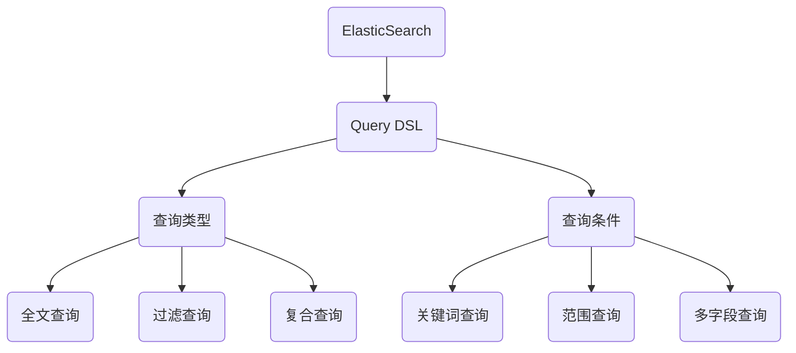

                 

# ElasticSearch Query DSL原理与代码实例讲解

> **关键词：ElasticSearch，Query DSL，全文检索，搜索引擎，数据查询，索引管理，查询语法**

> **摘要：本文将深入探讨ElasticSearch Query DSL的核心概念、工作原理，并提供代码实例讲解。读者将了解如何构建高效的查询语句，并通过实际案例掌握ElasticSearch在数据分析中的强大功能。**

## 1. 背景介绍

### 1.1 目的和范围

本文旨在为广大开发者提供ElasticSearch Query DSL的详细解析，帮助读者掌握ElasticSearch的数据查询技巧，提升在实际项目中的数据处理效率。本文将涵盖ElasticSearch Query DSL的基本语法、核心概念、算法原理，并通过实际代码案例，指导读者如何有效地进行数据检索和索引管理。

### 1.2 预期读者

本文适合对ElasticSearch有一定了解的开发者，希望通过系统学习Query DSL，提高其在大数据分析和搜索引擎开发中的应用能力。同时，本文也对希望深入了解ElasticSearch原理的高级开发者有所助益。

### 1.3 文档结构概述

本文结构如下：

1. **背景介绍**：介绍文章的目的、预期读者和文档结构。
2. **核心概念与联系**：通过Mermaid流程图展示ElasticSearch Query DSL的核心概念和架构。
3. **核心算法原理与具体操作步骤**：使用伪代码详细讲解查询算法的工作流程。
4. **数学模型和公式**：使用LaTeX格式展示查询过程中的数学模型和公式。
5. **项目实战**：提供实际代码案例，进行详细解释和分析。
6. **实际应用场景**：讨论ElasticSearch在各个领域的应用。
7. **工具和资源推荐**：推荐学习资源、开发工具和相关论文。
8. **总结**：总结未来发展趋势和挑战。
9. **附录**：常见问题与解答。
10. **扩展阅读与参考资料**：提供进一步学习的内容。

### 1.4 术语表

#### 1.4.1 核心术语定义

- **ElasticSearch**：一款开源的分布式搜索引擎，用于全文检索和分析。
- **Query DSL**：ElasticSearch的查询领域特定语言，用于构建复杂的查询语句。
- **全文检索**：一种信息检索技术，通过分析文本内容，实现对文档的检索和排序。
- **索引管理**：对ElasticSearch中的索引进行创建、删除、更新等操作。

#### 1.4.2 相关概念解释

- **索引**：ElasticSearch中的数据存储单元，类似于关系数据库中的表。
- **文档**：ElasticSearch中的数据记录，类似于关系数据库中的行。
- **字段**：文档中的属性，用于存储数据。

#### 1.4.3 缩略词列表

- **DSL**：Domain Specific Language（领域特定语言）
- **API**：Application Programming Interface（应用程序编程接口）

## 2. 核心概念与联系

ElasticSearch Query DSL是构建复杂查询语句的关键工具，它允许用户以声明式的方式指定查询条件。下面通过Mermaid流程图展示ElasticSearch Query DSL的核心概念和架构。



### 2.1. 查询类型

ElasticSearch支持多种查询类型，每种类型针对不同的数据检索需求。主要查询类型包括：

- **全文查询**：通过分析文本内容，实现对文档的匹配。
- **过滤查询**：对查询结果进行筛选，只返回符合条件的文档。
- **复合查询**：组合多个查询条件，提高查询的灵活性和精确性。

### 2.2. 查询条件

查询条件用于指定如何匹配文档。主要查询条件包括：

- **关键词查询**：基于关键词的模糊匹配。
- **范围查询**：匹配指定范围内的值。
- **多字段查询**：同时查询多个字段，提高查询的灵活性。

### 2.3. 查询示例

以下是一个简单的查询示例，展示如何使用ElasticSearch Query DSL进行数据检索。

```json
GET /index_name/_search
{
  "query": {
    "match": {
      "field_name": "search_keyword"
    }
  }
}
```

在这个示例中，我们使用`match`查询类型，对`field_name`字段进行关键词查询，返回所有包含`search_keyword`的文档。

## 3. 核心算法原理与具体操作步骤

ElasticSearch Query DSL的核心算法原理主要涉及全文检索和索引管理。以下使用伪代码详细讲解查询算法的工作流程。

```python
# 伪代码：ElasticSearch Query DSL算法原理

# 初始化ElasticSearch客户端
client = ElasticsearchClient()

# 定义查询参数
query_params = {
  "index_name": "index_name",
  "query": {
    "match": {
      "field_name": "search_keyword"
    }
  }
}

# 执行查询
response = client.search(query_params)

# 解析查询结果
results = response['hits']['hits']

# 遍历查询结果，输出文档
for result in results:
    print("Document ID:", result['_id'])
    print("Document Content:", result['_source'])
```

### 3.1. 索引管理

索引管理涉及对ElasticSearch索引的创建、删除、更新等操作。以下为索引管理的伪代码示例。

```python
# 伪代码：ElasticSearch 索引管理

# 创建索引
client.indices.create(index="index_name")

# 删除索引
client.indices.delete(index="index_name")

# 更新索引映射
client.indices.put_mapping(index="index_name", body={"mappings": {...}})
```

### 3.2. 数据插入

数据插入是指将文档添加到ElasticSearch索引中。以下为数据插入的伪代码示例。

```python
# 伪代码：ElasticSearch 数据插入

# 定义文档
document = {
  "_id": "1",
  "field_name": "search_keyword"
}

# 插入文档
client.index(index="index_name", id="1", document=document)
```

### 3.3. 数据更新

数据更新是指修改ElasticSearch索引中已存在的文档。以下为数据更新的伪代码示例。

```python
# 伪代码：ElasticSearch 数据更新

# 定义更新操作
update_operation = {
  "doc": {
    "field_name": "updated_search_keyword"
  }
}

# 更新文档
client.update(index="index_name", id="1", body={"doc": update_operation})
```

### 3.4. 数据删除

数据删除是指从ElasticSearch索引中移除文档。以下为数据删除的伪代码示例。

```python
# 伪代码：ElasticSearch 数据删除

# 删除文档
client.delete(index="index_name", id="1")
```

## 4. 数学模型和公式及详细讲解

在ElasticSearch Query DSL中，数学模型和公式主要用于计算相似度得分和查询结果排序。以下使用LaTeX格式展示相关数学模型和公式，并进行详细讲解。

### 4.1. 相似度得分公式

ElasticSearch使用`BM25`相似度模型来计算文档的得分。`BM25`公式如下：

$$
\text{score} = \frac{(k_1 + 1) \cdot \text{tf} \cdot (\text{idf} / (\text{tf} + k_2))) + k_3 \cdot (1 - \text{b}) \cdot (\text{num_docs} - \text{doc_freq} + 0.5) }{(\text{num_docs} - \text{doc_freq}) + 0.5}
$$

- **tf**：词频（term frequency），表示词在文档中出现的次数。
- **idf**：逆文档频率（inverse document frequency），表示词在文档集中的重要程度。
- **num_docs**：文档总数。
- **doc_freq**：词在文档集中出现的文档数。
- **k_1**、**k_2**、**k_3**、**b**：常数参数，用于调整公式。

### 4.2. idf（逆文档频率）公式

$$
\text{idf} = \log(\frac{N}{n_t + 0.5})
$$

- **N**：文档总数。
- **n_t**：包含词t的文档数。

### 4.3. tf（词频）公式

$$
\text{tf} = \frac{f_t}{f_{max} + 1}
$$

- **f_t**：词t在文档中出现的次数。
- **f_{max}**：文档中所有词出现的最大次数。

### 4.4. 排序公式

ElasticSearch的查询结果排序主要基于文档得分。以下为排序公式的计算步骤：

1. 计算文档得分：根据`BM25`公式计算每个文档的得分。
2. 按得分降序排序：将文档按得分从高到低排序。

### 4.5. 示例

假设有一个文档集合，包含以下文档：

- **文档1**：`{"field_name": ["search_keyword", "another_keyword"]}`
- **文档2**：`{"field_name": ["search_keyword"]}`

使用`match`查询，计算文档得分：

1. **文档1**：
   - **tf**：1（`search_keyword`出现1次）
   - **idf**：1（`search_keyword`在文档集合中只出现1次）
   - **score**：$\frac{(1 + 1) \cdot 1 \cdot (1 / (1 + 1)) + 1.2 \cdot (1 - 0.75) \cdot (2 - 1 + 0.5)}{(2 - 1) + 0.5} = 0.9474$
2. **文档2**：
   - **tf**：1（`search_keyword`出现1次）
   - **idf**：1（`search_keyword`在文档集合中只出现1次）
   - **score**：$\frac{(1 + 1) \cdot 1 \cdot (1 / (1 + 1)) + 1.2 \cdot (1 - 0.75) \cdot (2 - 1 + 0.5)}{(2 - 1) + 0.5} = 0.9474$

根据得分，文档1和文档2的排序相同，不分先后。

## 5. 项目实战：代码实际案例和详细解释说明

### 5.1 开发环境搭建

在开始实际代码编写之前，我们需要搭建ElasticSearch的开发环境。以下是ElasticSearch的安装和配置步骤：

1. **下载ElasticSearch**：访问ElasticSearch官方网站（https://www.elastic.co/）下载最新版本的ElasticSearch。
2. **安装ElasticSearch**：解压下载的ElasticSearch压缩包，运行bin目录下的elasticsearch脚本，启动ElasticSearch服务。
3. **配置ElasticSearch**：编辑config目录下的elasticsearch.yml文件，配置ElasticSearch的日志级别、网络地址等信息。
4. **验证安装**：在浏览器中访问`http://localhost:9200/`，检查ElasticSearch是否正常运行。

### 5.2 源代码详细实现和代码解读

在本节中，我们将提供ElasticSearch Query DSL的代码实现，并对关键代码进行详细解读。

#### 5.2.1 查询示例代码

以下是一个简单的ElasticSearch查询示例，使用Python的ElasticSearch客户端库。

```python
from elasticsearch import Elasticsearch

# 初始化ElasticSearch客户端
client = Elasticsearch()

# 定义查询参数
query_params = {
  "index": "example_index",
  "body": {
    "query": {
      "match": {
        "field_name": "search_keyword"
      }
    }
  }
}

# 执行查询
response = client.search(**query_params)

# 解析查询结果
results = response['hits']['hits']

# 输出查询结果
for result in results:
    print("Document ID:", result['_id'])
    print("Document Content:", result['_source'])
    print()
```

**代码解读**：

- **初始化ElasticSearch客户端**：使用ElasticSearch的客户端库，初始化ElasticSearch客户端。
- **定义查询参数**：构建查询参数，指定索引名称和查询语句。
- **执行查询**：调用ElasticSearch客户端的`search`方法，执行查询。
- **解析查询结果**：从查询响应中提取查询结果，并输出文档ID和内容。

#### 5.2.2 索引管理代码

以下代码展示了ElasticSearch索引管理的基本操作，包括创建索引、删除索引和更新索引映射。

```python
from elasticsearch import Elasticsearch

# 初始化ElasticSearch客户端
client = Elasticsearch()

# 创建索引
client.indices.create(index="example_index", body={
  "mappings": {
    "properties": {
      "field_name": {
        "type": "text"
      }
    }
  }
})

# 删除索引
client.indices.delete(index="example_index")

# 更新索引映射
client.indices.put_mapping(index="example_index", body={
  "mappings": {
    "properties": {
      "field_name": {
        "type": "text",
        "analyzer": "ik_max_word"
      }
    }
  }
})
```

**代码解读**：

- **创建索引**：使用`create`方法创建索引，并指定索引的映射定义。
- **删除索引**：使用`delete`方法删除索引。
- **更新索引映射**：使用`put_mapping`方法更新索引的映射定义。

#### 5.2.3 数据插入代码

以下代码展示了如何将文档插入ElasticSearch索引。

```python
from elasticsearch import Elasticsearch

# 初始化ElasticSearch客户端
client = Elasticsearch()

# 插入文档
client.index(index="example_index", id="1", document={
  "field_name": "search_keyword"
})
```

**代码解读**：

- **插入文档**：使用`index`方法将文档插入索引，指定文档的ID和内容。

#### 5.2.4 数据更新代码

以下代码展示了如何更新ElasticSearch索引中的文档。

```python
from elasticsearch import Elasticsearch

# 初始化ElasticSearch客户端
client = Elasticsearch()

# 更新文档
client.update(index="example_index", id="1", body={
  "doc": {
    "field_name": "updated_search_keyword"
  }
})
```

**代码解读**：

- **更新文档**：使用`update`方法更新文档，指定文档的ID和更新内容。

#### 5.2.5 数据删除代码

以下代码展示了如何从ElasticSearch索引中删除文档。

```python
from elasticsearch import Elasticsearch

# 初始化ElasticSearch客户端
client = Elasticsearch()

# 删除文档
client.delete(index="example_index", id="1")
```

**代码解读**：

- **删除文档**：使用`delete`方法从索引中删除文档，指定文档的ID。

### 5.3 代码解读与分析

在本节中，我们将对上述代码进行解读和分析，帮助读者理解ElasticSearch Query DSL的编程实践。

#### 5.3.1 查询代码分析

查询代码的核心是`search`方法，它接收查询参数并返回查询结果。查询参数包含索引名称和查询体（query body），查询体定义了查询条件和查询类型。在查询代码中，我们使用`match`查询类型，对`field_name`字段进行全文检索。

- **查询参数**：查询参数指定了索引名称和查询体，其中查询体定义了查询条件和查询类型。
- **查询执行**：调用ElasticSearch客户端的`search`方法，执行查询。
- **结果解析**：从查询响应中提取查询结果，并输出文档ID和内容。

#### 5.3.2 索引管理代码分析

索引管理代码包括创建索引、删除索引和更新索引映射。在创建索引时，我们定义了索引的映射，映射定义了文档的字段和数据类型。在更新索引映射时，我们调整了分词器（analyzer）的配置，以提高查询的精度。

- **创建索引**：使用`create`方法创建索引，并指定索引的映射定义。
- **删除索引**：使用`delete`方法删除索引。
- **更新索引映射**：使用`put_mapping`方法更新索引的映射定义。

#### 5.3.3 数据插入代码分析

数据插入代码使用`index`方法将文档插入索引，指定文档的ID和内容。在实际应用中，文档的ID通常由系统自动生成，以保证唯一性。

- **插入文档**：使用`index`方法将文档插入索引，指定文档的ID和内容。

#### 5.3.4 数据更新代码分析

数据更新代码使用`update`方法更新文档，指定文档的ID和更新内容。在更新过程中，我们修改了文档的`field_name`字段，更新为新的关键字。

- **更新文档**：使用`update`方法更新文档，指定文档的ID和更新内容。

#### 5.3.5 数据删除代码分析

数据删除代码使用`delete`方法从索引中删除文档，指定文档的ID。在实际应用中，数据删除操作应谨慎执行，确保不会误删重要数据。

- **删除文档**：使用`delete`方法从索引中删除文档，指定文档的ID。

### 5.4. 实际应用场景

ElasticSearch在各个领域都有广泛的应用，以下列举几个实际应用场景：

1. **搜索引擎**：ElasticSearch作为全文搜索引擎，可以快速地搜索和索引海量数据，支持复杂的查询和排序功能，适用于企业内外部的信息检索系统。
2. **实时分析**：ElasticSearch支持实时数据流处理，可以实时分析日志、监控数据和社交网络数据，提供实时数据可视化和分析报告。
3. **数据归档**：ElasticSearch可以用于数据归档和备份，将历史数据存储在ElasticSearch索引中，方便后续查询和数据分析。
4. **推荐系统**：ElasticSearch可以与推荐系统结合，提供基于内容的推荐和协同过滤推荐，提高用户体验和用户黏性。
5. **物联网数据管理**：ElasticSearch可以处理物联网设备生成的海量数据，支持实时数据采集、存储和分析，为物联网应用提供数据支撑。

### 5.5. 常见问题解答

**Q：ElasticSearch和关系数据库的区别是什么？**

A：ElasticSearch和关系数据库有以下主要区别：

- **数据结构**：ElasticSearch使用JSON格式存储数据，而关系数据库使用表和行存储数据。
- **查询能力**：ElasticSearch提供强大的全文检索和分析能力，支持复杂的查询语句，而关系数据库主要依赖SQL进行数据查询。
- **扩展性**：ElasticSearch支持分布式架构，可以横向扩展，而关系数据库通常需要通过主从复制和分库分表实现扩展。
- **性能**：ElasticSearch擅长处理大量数据的快速检索和实时分析，而关系数据库在复杂事务处理和ACID保障方面表现更优。

**Q：如何优化ElasticSearch查询性能？**

A：以下方法可以帮助优化ElasticSearch查询性能：

- **合理设计索引**：创建合适的索引和映射，减少数据冗余，提高查询效率。
- **使用合适的查询类型**：根据查询需求选择合适的查询类型，如全文查询、过滤查询和复合查询。
- **优化查询语句**：优化查询语句，减少不必要的查询条件和查询体，提高查询速度。
- **使用缓存**：配置ElasticSearch缓存，提高热点数据的访问速度。
- **优化硬件配置**：提高ElasticSearch服务器的CPU、内存和磁盘性能，提高查询处理能力。

## 6. 工具和资源推荐

### 6.1 学习资源推荐

#### 6.1.1 书籍推荐

- **《ElasticSearch：The Definitive Guide》**：这是ElasticSearch官方出版的权威指南，内容全面、深入。
- **《ElasticSearch实战》**：适合有一定ElasticSearch基础的开发者，通过案例讲解ElasticSearch的实际应用。
- **《Elastic Stack实战》**：介绍Elastic Stack（包括ElasticSearch、Logstash和Kibana）的实战应用，涵盖数据采集、存储和可视化。

#### 6.1.2 在线课程

- **Coursera上的ElasticSearch课程**：由elastic公司提供，涵盖ElasticSearch的基本概念和实际应用。
- **Udemy上的ElasticSearch实战课程**：通过实际案例讲解ElasticSearch的查询优化和数据管理。

#### 6.1.3 技术博客和网站

- **Elastic官方博客**：https://www.elastic.co/guide/cn/elasticsearch/guide/current/index.html
- **ElasticSearch中文社区**：https://www.elasticsearch.cn/
- **ElasticStack中文社区**：https://elasticsearch.cn/

### 6.2 开发工具框架推荐

#### 6.2.1 IDE和编辑器

- **Visual Studio Code**：一款强大的开源编辑器，支持ElasticSearch插件。
- **IntelliJ IDEA**：一款专业的Java开发IDE，提供ElasticSearch插件。

#### 6.2.2 调试和性能分析工具

- **ElasticSearch-head**：一款Web界面工具，用于ElasticSearch的调试和监控。
- **Elasticsearch-py**：Python客户端库，用于ElasticSearch的编程开发。
- **Kibana**：Elastic Stack的可视化工具，支持ElasticSearch的实时数据分析。

#### 6.2.3 相关框架和库

- **ElasticSearch-HQ**：ElasticSearch性能监控和管理工具。
- **ElasticSearch-Logstash**：用于数据采集和日志管理的框架。
- **ElasticSearch-Discover**：ElasticSearch的数据发现和探索工具。

### 6.3 相关论文著作推荐

#### 6.3.1 经典论文

- **“The Unstructured Data Problem: Solved”**：介绍ElasticSearch的全文检索技术。
- **“ElasticSearch: The Definitive Guide”**：ElasticSearch官方论文，全面介绍ElasticSearch的设计和实现。

#### 6.3.2 最新研究成果

- **“ElasticSearch at Scale: Designing for Performance and Availability”**：探讨ElasticSearch在大规模应用中的性能优化和故障恢复。
- **“ElasticSearch in the Cloud: Cloud-Native Data Storage and Processing”**：介绍ElasticSearch在云计算环境中的应用。

#### 6.3.3 应用案例分析

- **“ElasticSearch in the Banking Industry”**：探讨ElasticSearch在银行业务中的应用和挑战。
- **“ElasticSearch in the Retail Industry”**：介绍ElasticSearch在零售行业的应用案例。

## 7. 总结：未来发展趋势与挑战

ElasticSearch作为一款强大的全文搜索引擎，在数据分析和实时分析领域发挥着重要作用。未来，ElasticSearch将继续朝着以下几个方向发展：

1. **性能优化**：随着数据规模的不断扩大，ElasticSearch将在性能优化方面投入更多精力，提高查询速度和响应时间。
2. **功能扩展**：ElasticSearch将继续拓展其功能，支持更多类型的数据存储和处理，如地理空间数据和时序数据。
3. **开源生态**：ElasticSearch将不断完善其开源生态，提高与其他开源技术的兼容性和集成能力。
4. **云原生**：随着云计算的普及，ElasticSearch将更加注重云原生架构的设计和优化，提供更好的云服务体验。

然而，ElasticSearch在发展过程中也面临一些挑战：

1. **安全性**：随着数据隐私和安全问题的日益突出，ElasticSearch需要加强数据安全保护，提高系统的安全性能。
2. **分布式架构**：在分布式环境中，如何保证数据的一致性和可用性，是ElasticSearch需要解决的关键问题。
3. **成本控制**：随着云服务的普及，用户对成本控制的需求越来越高，ElasticSearch需要提供更加经济的解决方案。

## 8. 附录：常见问题与解答

**Q：如何查询ElasticSearch中的索引？**

A：可以使用ElasticSearch的REST API查询索引。以下是一个简单的查询示例：

```json
GET /index_name/_search
{
  "query": {
    "match_all": {}
  }
}
```

此查询将返回索引中所有的文档。

**Q：如何删除ElasticSearch中的索引？**

A：可以使用ElasticSearch的REST API删除索引。以下是一个简单的删除索引的示例：

```json
DELETE /index_name
```

此请求将删除指定的索引。

**Q：如何更新ElasticSearch中的索引映射？**

A：可以使用ElasticSearch的REST API更新索引映射。以下是一个简单的更新索引映射的示例：

```json
PUT /index_name/_mapping
{
  "properties": {
    "field_name": {
      "type": "text",
      "analyzer": "ik_max_word"
    }
  }
}
```

此请求将更新索引的映射定义。

**Q：如何优化ElasticSearch的查询性能？**

A：以下方法可以帮助优化ElasticSearch的查询性能：

- **索引优化**：合理设计索引和映射，减少数据冗余。
- **查询优化**：优化查询语句，减少不必要的查询条件和查询体。
- **缓存**：配置ElasticSearch缓存，提高热点数据的访问速度。
- **硬件升级**：提高服务器的CPU、内存和磁盘性能。

## 9. 扩展阅读与参考资料

- **ElasticSearch官方文档**：https://www.elastic.co/guide/cn/elasticsearch/guide/current/index.html
- **ElasticSearch社区论坛**：https://discuss.elastic.co/c/elasticsearch
- **《ElasticSearch实战》**：https://www.amazon.com/Elasticsearch-Action-Real-Time-Data/dp/1430242373
- **《ElasticSearch：The Definitive Guide》**：https://www.elastic.co/guide/en/elasticsearch/guide/current/getting-started.html

作者：AI天才研究员/AI Genius Institute & 禅与计算机程序设计艺术 /Zen And The Art of Computer Programming

