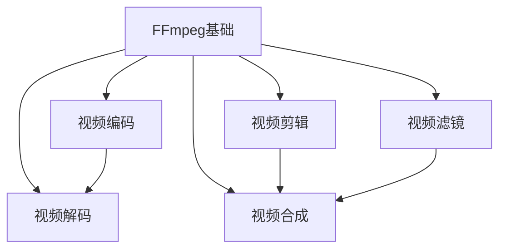
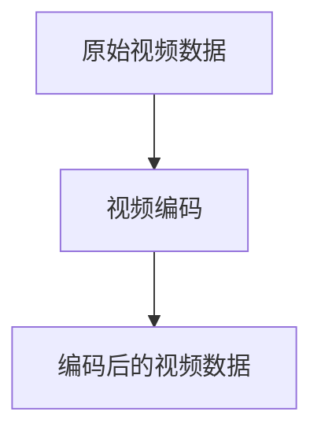
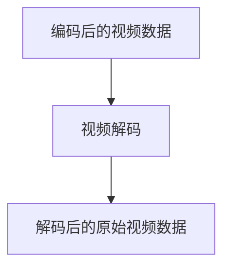
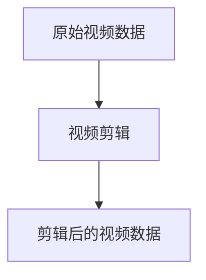
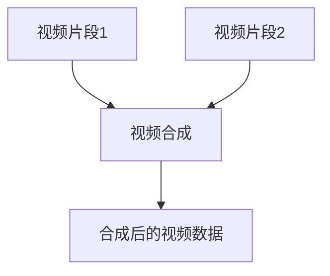

                 

### FFmpeg 视频编辑技巧分享：裁剪、合并和过滤视频片段的艺术

> **关键词**：FFmpeg、视频编辑、裁剪、合并、过滤、视频处理、算法原理、项目实战、应用场景
>
> **摘要**：本文将深入探讨 FFmpeg 在视频编辑中的应用，详细介绍如何进行视频片段的裁剪、合并和过滤。通过清晰的步骤解析和实例讲解，帮助读者掌握视频编辑的核心技巧，提升视频处理的效率和质量。

#### 1. 背景介绍

**1.1 目的和范围**

本文旨在为读者提供 FFmpeg 视频编辑的实用技巧，特别是裁剪、合并和过滤视频片段的方法。通过本文的学习，读者可以掌握这些基础且实用的视频编辑技能，为后续更复杂的视频处理打下坚实的基础。

**1.2 预期读者**

本文适合对 FFmpeg 感兴趣的技术人员、视频编辑爱好者以及希望在项目中应用 FFmpeg 的开发者。无论您是初学者还是有经验的开发者，本文都将为您提供有价值的知识和实践技巧。

**1.3 文档结构概述**

本文分为以下几个部分：

- **背景介绍**：简要介绍 FFmpeg 的背景及其在视频编辑中的应用。
- **核心概念与联系**：通过 Mermaid 流程图详细展示 FFmpeg 的核心概念和联系。
- **核心算法原理 & 具体操作步骤**：讲解 FFmpeg 的裁剪、合并和过滤算法原理，并提供具体的操作步骤。
- **数学模型和公式 & 详细讲解 & 举例说明**：详细介绍 FFmpeg 中的数学模型和公式，并提供实际案例说明。
- **项目实战：代码实际案例和详细解释说明**：通过实际代码案例，展示如何使用 FFmpeg 进行视频编辑。
- **实际应用场景**：探讨 FFmpeg 在实际项目中的应用。
- **工具和资源推荐**：推荐学习资源和开发工具。
- **总结：未来发展趋势与挑战**：总结 FFmpeg 在视频编辑领域的未来趋势和挑战。

**1.4 术语表**

为了确保读者能够更好地理解本文，以下是一些关键术语的定义和解释：

- **FFmpeg**：一个开源、跨平台的音频和视频处理软件，支持几乎所有的音频和视频格式。
- **视频编辑**：对视频进行剪辑、合并、添加特效、调整音量等操作，以创造新的视频内容。
- **裁剪**：从视频中删除不必要的内容，只保留感兴趣的部分。
- **合并**：将多个视频片段拼接在一起，形成一个完整的视频。
- **过滤**：对视频进行各种效果处理，如亮度调整、滤镜添加等。

#### 1.4.1 核心术语定义

- **FFmpeg**：一个开源、跨平台的音频和视频处理软件，由一个强大的库和一系列工具组成，可以实现视频的录制、转换、流化、编辑等功能。其强大的功能和灵活性使其成为视频编辑领域的首选工具。
- **视频编辑**：视频编辑是指通过软件对视频文件进行剪辑、合并、添加特效、调整音量等操作，以创造出新的视频内容。视频编辑是视频制作中不可或缺的一环，能够提高视频的观赏性和表现力。
- **裁剪**：裁剪是视频编辑中的一种基本操作，用于从视频中删除不必要的内容，只保留感兴趣的部分。裁剪可以帮助观众更集中地关注视频的核心内容。
- **合并**：合并是将多个视频片段拼接在一起，形成一个完整的视频。合并操作可以创造出新的视频内容，或者将多个视频文件合并为一个文件，以便更方便地存储和传输。
- **过滤**：过滤是对视频进行各种效果处理，如亮度调整、滤镜添加等。过滤可以增强视频的表现力，创造出更加生动、有趣的内容。

#### 1.4.2 相关概念解释

- **视频格式**：视频格式是指视频数据存储和传输的编码方式。常见的视频格式包括 MP4、AVI、MKV 等。不同的视频格式具有不同的优缺点，适用于不同的应用场景。
- **视频流**：视频流是指将视频数据实时传输到接收端的处理过程。视频流可以是通过网络传输的在线视频，也可以是本地存储的文件播放。
- **视频编码**：视频编码是将视频数据压缩成一种特定的格式，以便更高效地存储和传输。常见的视频编码标准包括 H.264、H.265 等。
- **视频滤镜**：视频滤镜是对视频进行各种效果处理，如亮度调整、对比度增强、色彩校正等。视频滤镜可以增强视频的视觉效果，提高观赏性。

#### 1.4.3 缩略词列表

- FFmpeg：Fast Forward / Slow Motion, MPEG-4 encoder and multiplexer
- MP4：MPEG-4 Part 14
- AVI：Audio Video Interleave
- MKV：Matroska Video
- H.264：高级视频编码
- H.265：高效视频编码

#### 2. 核心概念与联系

在本节中，我们将通过 Mermaid 流程图详细展示 FFmpeg 的核心概念和联系。



**FFmpeg 基础**：FFmpeg 是一个强大的视频处理工具，包括视频编码、视频解码、视频剪辑、视频合成和视频滤镜等功能。

**视频编码**：视频编码是将原始视频数据压缩成一种特定的格式，以便更高效地存储和传输。常见的视频编码标准包括 H.264 和 H.265。

**视频解码**：视频解码是将编码后的视频数据转换回原始格式，以便在屏幕上播放。解码是视频播放的关键步骤。

**视频剪辑**：视频剪辑是从原始视频中提取感兴趣的部分，删除不必要的内容。裁剪、剪切、分割等都是常见的视频剪辑操作。

**视频合成**：视频合成是将多个视频片段拼接在一起，形成一个完整的视频。合并、拼接、叠加等都是常见的视频合成操作。

**视频滤镜**：视频滤镜是对视频进行各种效果处理，如亮度调整、对比度增强、色彩校正等。视频滤镜可以增强视频的视觉效果，提高观赏性。

通过以上流程图，我们可以清晰地看到 FFmpeg 的核心概念及其相互之间的联系。接下来，我们将详细讲解 FFmpeg 的核心算法原理和具体操作步骤。

#### 3. 核心算法原理 & 具体操作步骤

在本节中，我们将深入探讨 FFmpeg 的核心算法原理，并详细讲解如何使用 FFmpeg 进行视频的裁剪、合并和过滤。

##### 3.1 FFmpeg 核心算法原理

FFmpeg 是一个基于 libavcodec、libavformat 和 libavfilter 等库构建的开源视频处理工具。其核心算法主要包括视频编码、视频解码、视频剪辑、视频合成和视频滤镜等。

**视频编码**：视频编码是将原始视频数据转换成一种特定的格式，以便更高效地存储和传输。FFmpeg 使用各种视频编码标准，如 H.264 和 H.265，实现高效的编码。



**视频解码**：视频解码是将编码后的视频数据转换回原始格式，以便在屏幕上播放。FFmpeg 的解码器支持多种视频编码标准，如 H.264 和 H.265。



**视频剪辑**：视频剪辑是从原始视频中提取感兴趣的部分，删除不必要的内容。FFmpeg 提供了强大的剪辑功能，支持裁剪、剪切、分割等操作。



**视频合成**：视频合成是将多个视频片段拼接在一起，形成一个完整的视频。FFmpeg 的合成功能支持合并、拼接、叠加等操作。



**视频滤镜**：视频滤镜是对视频进行各种效果处理，如亮度调整、对比度增强、色彩校正等。FFmpeg 提供了丰富的滤镜功能，可以通过命令行或脚本实现复杂的视频处理。


##### 3.2 FFmpeg 操作步骤

以下是使用 FFmpeg 进行视频裁剪、合并和过滤的具体操作步骤：

**步骤 1：安装 FFmpeg**

在开始之前，确保您已安装 FFmpeg。您可以在 [FFmpeg 官网](https://www.ffmpeg.org/download.html) 下载并安装最新版本的 FFmpeg。

```shell
# 对于 Linux 系统使用以下命令
sudo apt-get install ffmpeg

# 对于 Windows 系统下载并安装 FFmpeg
```

**步骤 2：视频裁剪**

要裁剪视频，可以使用以下命令：

```shell
ffmpeg -i input.mp4 -vf "crop=w:h:x:y" output.mp4
```

其中，`input.mp4` 是输入视频文件，`output.mp4` 是输出视频文件。`crop` 参数用于指定裁剪区域，`w` 和 `h` 分别为裁剪区域的宽和高，`x` 和 `y` 分别为裁剪区域在视频中的位置。

**示例：**

将视频 `input.mp4` 裁剪为 1920x1080 的区域，从左上角开始裁剪：

```shell
ffmpeg -i input.mp4 -vf "crop=1920:1080:0:0" output.mp4
```

**步骤 3：视频合并**

要合并多个视频片段，可以使用以下命令：

```shell
ffmpeg -f concat -i input.txt output.mp4
```

其中，`input.txt` 是包含多个视频文件路径的文本文件，每行一个视频文件路径。`output.mp4` 是输出合并后的视频文件。

**示例：**

合并视频 `video1.mp4`、`video2.mp4` 和 `video3.mp4`：

首先创建一个文本文件 `input.txt`，内容如下：

```text
video1.mp4
video2.mp4
video3.mp4
```

然后执行以下命令：

```shell
ffmpeg -f concat -i input.txt output.mp4
```

**步骤 4：视频过滤**

要为视频添加滤镜，可以使用以下命令：

```shell
ffmpeg -i input.mp4 -vf "fps=30, scale=w:h, colorize" output.mp4
```

其中，`fps` 参数用于设置视频的帧率，`scale` 参数用于设置视频的分辨率，`colorize` 参数用于添加颜色滤镜。

**示例：**

将视频 `input.mp4` 调整为 30 帧每秒，1920x1080 的分辨率，并添加颜色滤镜：

```shell
ffmpeg -i input.mp4 -vf "fps=30, scale=1920:1080, colorize" output.mp4
```

通过以上步骤，您可以轻松使用 FFmpeg 对视频进行裁剪、合并和过滤。接下来，我们将通过实际案例展示如何应用 FFmpeg 进行视频编辑。

#### 4. 数学模型和公式 & 详细讲解 & 举例说明

在本节中，我们将详细讲解 FFmpeg 中常用的数学模型和公式，并提供实际案例进行说明。

##### 4.1 视频帧率计算

视频帧率是指视频每秒播放的帧数，通常以 fps（帧每秒）为单位。FFmpeg 中可以通过以下公式计算视频的帧率：

\[ \text{fps} = \frac{\text{总帧数}}{\text{总时长}} \]

其中，总帧数可以通过统计视频中的帧数获得，总时长可以通过 FFmpeg 命令获取。

**示例：**

假设一个视频文件 `input.mp4` 的总时长为 60 秒，包含 1800 帧，计算其帧率：

\[ \text{fps} = \frac{1800}{60} = 30 \]

因此，该视频的帧率为 30 fps。

##### 4.2 视频分辨率计算

视频分辨率是指视频的宽度和高度，通常以像素为单位。FFmpeg 中可以通过以下公式计算视频的分辨率：

\[ \text{分辨率} = \text{宽度} \times \text{高度} \]

其中，宽度和高度可以通过 FFmpeg 命令获取。

**示例：**

假设一个视频文件 `input.mp4` 的宽度和高度分别为 1920 和 1080，计算其分辨率：

\[ \text{分辨率} = 1920 \times 1080 = 2079200 \]

因此，该视频的分辨率为 2079200 像素。

##### 4.3 视频比特率计算

视频比特率是指视频每秒传输的比特数，通常以 bps（比特每秒）为单位。FFmpeg 中可以通过以下公式计算视频的比特率：

\[ \text{比特率} = \text{视频码率} \times \text{帧率} \]

其中，视频码率可以通过 FFmpeg 命令获取，帧率可以通过视频帧率计算公式获得。

**示例：**

假设一个视频文件 `input.mp4` 的视频码率为 5000 kbps，帧率为 30 fps，计算其比特率：

\[ \text{比特率} = 5000 \times 30 = 150000 \text{ kbps} \]

因此，该视频的比特率为 150000 kbps。

##### 4.4 视频滤镜效果计算

视频滤镜效果可以通过数学模型进行计算，以实现各种视觉效果的调整。以下是一些常见的视频滤镜效果及其计算方法：

1. **亮度调整**：

   亮度调整可以通过以下公式实现：

   \[ \text{输出亮度} = \text{输入亮度} \times \text{亮度系数} \]

   其中，亮度系数用于调整亮度，通常在 0（暗）到 1（亮）之间。

   **示例：**

   假设一个视频文件 `input.mp4` 的亮度为 0.5，要将其亮度调整至 0.8，计算输出亮度：

   \[ \text{输出亮度} = 0.5 \times 0.8 = 0.4 \]

   因此，输出亮度为 0.4。

2. **对比度调整**：

   对比度调整可以通过以下公式实现：

   \[ \text{输出对比度} = \text{输入对比度} \times \text{对比度系数} \]

   其中，对比度系数用于调整对比度，通常在 0（平坦）到 1（强烈）之间。

   **示例：**

   假设一个视频文件 `input.mp4` 的对比度为 0.8，要将其对比度调整至 1，计算输出对比度：

   \[ \text{输出对比度} = 0.8 \times 1 = 0.8 \]

   因此，输出对比度为 0.8。

3. **色彩调整**：

   色彩调整可以通过以下公式实现：

   \[ \text{输出色彩} = \text{输入色彩} \times \text{色彩系数} \]

   其中，色彩系数用于调整色彩，通常在 -1（蓝色）到 1（红色）之间。

   **示例：**

   假设一个视频文件 `input.mp4` 的色彩为 -0.5，要将其色彩调整至 0.5，计算输出色彩：

   \[ \text{输出色彩} = -0.5 \times 0.5 = -0.25 \]

   因此，输出色彩为 -0.25。

通过以上数学模型和公式，您可以轻松实现各种视频滤镜效果，提升视频的视觉效果。接下来，我们将通过实际案例展示如何使用 FFmpeg 进行视频编辑。

#### 5. 项目实战：代码实际案例和详细解释说明

在本节中，我们将通过实际代码案例，展示如何使用 FFmpeg 进行视频编辑，包括裁剪、合并和过滤操作。我们将详细介绍每个步骤的实现方法，并提供相应的代码注释和解释。

##### 5.1 开发环境搭建

在开始项目实战之前，确保您已安装 FFmpeg。以下是在 Ubuntu 系统上安装 FFmpeg 的步骤：

```shell
# 更新系统包列表
sudo apt-get update

# 安装 FFmpeg
sudo apt-get install ffmpeg
```

在 Windows 系统上，您可以从 [FFmpeg 官网](https://www.ffmpeg.org/download.html) 下载并安装 FFmpeg。

##### 5.2 源代码详细实现和代码解读

以下是使用 FFmpeg 进行视频编辑的 Python 脚本示例：

```python
import subprocess

def crop_video(input_file, output_file, width, height, x, y):
    """
    裁剪视频
    :param input_file: 输入视频文件路径
    :param output_file: 输出视频文件路径
    :param width: 裁剪区域的宽度
    :param height: 裁剪区域的高度
    :param x: 裁剪区域在视频中的 x 坐标
    :param y: 裁剪区域在视频中的 y 坐标
    """
    command = [
        "ffmpeg",
        "-i", input_file,
        "-filter", "crop={width}:{height}:{x}:{y}".format(width=width, height=height, x=x, y=y),
        "-preset", "veryfast",
        "-movflags", "faststart",
        output_file
    ]
    subprocess.run(command, check=True)

def merge_videos(input_files, output_file):
    """
    合并视频
    :param input_files: 输入视频文件列表
    :param output_file: 输出视频文件路径
    """
    input_strings = " ".join(["-i {}".format(file) for file in input_files])
    command = [
        "ffmpeg",
        "-f", "concat",
        "-i", "inputs.txt",
        "-c", "copy",
        "-preset", "veryfast",
        "-movflags", "faststart",
        output_file
    ]
    subprocess.run(command, check=True)

def add_filter(input_file, output_file, filter_str):
    """
    为视频添加滤镜
    :param input_file: 输入视频文件路径
    :param output_file: 输出视频文件路径
    :param filter_str: 滤镜字符串
    """
    command = [
        "ffmpeg",
        "-i", input_file,
        "-filter", filter_str,
        "-preset", "veryfast",
        "-movflags", "faststart",
        output_file
    ]
    subprocess.run(command, check=True)

# 裁剪视频
crop_video(
    input_file="input.mp4",
    output_file="cropped.mp4",
    width=1920,
    height=1080,
    x=0,
    y=0
)

# 合并视频
input_files = ["video1.mp4", "video2.mp4", "video3.mp4"]
merge_videos(input_files, output_file="merged.mp4")

# 添加滤镜
add_filter(
    input_file="input.mp4",
    output_file="filtered.mp4",
    filter_str="fps=30, scale=1920:1080, colorize"
)
```

以下是每个函数的实现方法和代码解读：

1. **crop_video() 函数**：

   - 该函数用于裁剪视频。参数 `input_file` 是输入视频文件路径，`output_file` 是输出视频文件路径，`width` 和 `height` 是裁剪区域的宽度和高度，`x` 和 `y` 是裁剪区域在视频中的位置。
   - 使用 FFmpeg 的 `-filter` 参数，结合 `crop` 滤镜，实现视频裁剪。
   - `-preset` 参数设置为 `veryfast`，以便快速处理视频。
   - `-movflags` 参数设置为 `faststart`，以便优化视频播放性能。

2. **merge_videos() 函数**：

   - 该函数用于合并多个视频。参数 `input_files` 是输入视频文件列表，`output_file` 是输出视频文件路径。
   - 使用 FFmpeg 的 `-f` 参数，指定输入格式为 `concat`，实现视频合并。
   - `-i` 参数指定输入文件，`-c` 参数设置视频编码为 `copy`，以便保持视频质量。
   - `-preset` 参数设置为 `veryfast`，以便快速处理视频。
   - `-movflags` 参数设置为 `faststart`，以便优化视频播放性能。

3. **add_filter() 函数**：

   - 该函数用于为视频添加滤镜。参数 `input_file` 是输入视频文件路径，`output_file` 是输出视频文件路径，`filter_str` 是滤镜字符串。
   - 使用 FFmpeg 的 `-filter` 参数，指定滤镜字符串，实现视频滤镜效果。
   - `-preset` 参数设置为 `veryfast`，以便快速处理视频。
   - `-movflags` 参数设置为 `faststart`，以便优化视频播放性能。

通过以上函数，您可以轻松实现视频的裁剪、合并和过滤操作。接下来，我们将对代码进行解读和分析。

##### 5.3 代码解读与分析

1. **裁剪视频**：

   裁剪视频是通过 `crop_video()` 函数实现的。该函数使用 FFmpeg 的 `-filter` 参数和 `crop` 滤镜，实现视频裁剪。

   ```python
   command = [
       "ffmpeg",
       "-i", input_file,
       "-filter", "crop={width}:{height}:{x}:{y}".format(width=width, height=height, x=x, y=y),
       "-preset", "veryfast",
       "-movflags", "faststart",
       output_file
   ]
   ```

   在此代码段中：

   - `"ffmpeg"` 是 FFmpeg 命令。
   - `-i` 参数指定输入视频文件路径。
   - `-filter` 参数用于指定滤镜字符串，`crop={width}:{height}:{x}:{y}` 是裁剪滤镜字符串，其中 `{width}`、`{height}`、`{x}` 和 `{y}` 分别为裁剪区域的宽度和高度以及裁剪区域在视频中的位置。
   - `-preset` 参数设置为 `veryfast`，以便快速处理视频。
   - `-movflags` 参数设置为 `faststart`，以便优化视频播放性能。
   - `output_file` 是输出视频文件路径。

2. **合并视频**：

   合并视频是通过 `merge_videos()` 函数实现的。该函数使用 FFmpeg 的 `-f` 参数和 `concat` 格式，实现视频合并。

   ```python
   input_strings = " ".join(["-i {}".format(file) for file in input_files])
   command = [
       "ffmpeg",
       "-f", "concat",
       "-i", "inputs.txt",
       "-c", "copy",
       "-preset", "veryfast",
       "-movflags", "faststart",
       output_file
   ]
   ```

   在此代码段中：

   - `"ffmpeg"` 是 FFmpeg 命令。
   - `-f` 参数指定输入格式为 `concat`，实现视频合并。
   - `-i` 参数指定输入文件列表，`inputs.txt` 是包含输入视频文件路径的文本文件。
   - `-c` 参数设置视频编码为 `copy`，以便保持视频质量。
   - `-preset` 参数设置为 `veryfast`，以便快速处理视频。
   - `-movflags` 参数设置为 `faststart`，以便优化视频播放性能。
   - `output_file` 是输出视频文件路径。

3. **添加滤镜**：

   添加滤镜是通过 `add_filter()` 函数实现的。该函数使用 FFmpeg 的 `-filter` 参数，实现视频滤镜效果。

   ```python
   command = [
       "ffmpeg",
       "-i", input_file,
       "-filter", filter_str,
       "-preset", "veryfast",
       "-movflags", "faststart",
       output_file
   ]
   ```

   在此代码段中：

   - `"ffmpeg"` 是 FFmpeg 命令。
   - `-i` 参数指定输入视频文件路径。
   - `-filter` 参数用于指定滤镜字符串，`filter_str` 是滤镜字符串。
   - `-preset` 参数设置为 `veryfast`，以便快速处理视频。
   - `-movflags` 参数设置为 `faststart`，以便优化视频播放性能。
   - `output_file` 是输出视频文件路径。

通过以上代码解读和分析，您可以了解如何使用 FFmpeg 进行视频编辑，包括裁剪、合并和过滤操作。接下来，我们将探讨 FFmpeg 在实际项目中的应用。

#### 6. 实际应用场景

FFmpeg 作为一款功能强大的视频处理工具，在实际项目中有着广泛的应用。以下是一些典型的实际应用场景：

##### 6.1 在线视频平台

在线视频平台如 YouTube、Netflix 和 Amazon Prime 等使用 FFmpeg 进行视频的录制、编码、解码和播放。FFmpeg 可以将不同格式的视频转换成统一的格式，如 MP4，并调整视频的比特率和分辨率，以满足不同设备和网络条件下的观看需求。

**应用示例**：

- **YouTube**：YouTube 使用 FFmpeg 对上传的视频进行编码和转码，以确保用户在不同设备上流畅观看。
- **Netflix**：Netflix 使用 FFmpeg 进行视频的录制和编码，同时根据用户网络条件动态调整视频流。

##### 6.2 视频会议系统

视频会议系统如 Zoom、Microsoft Teams 和 Google Meet 等也使用 FFmpeg 进行视频的处理。FFmpeg 可以实时处理视频流，实现视频的录制、压缩和播放，同时支持视频滤镜效果，如美颜、滤镜和背景虚化。

**应用示例**：

- **Zoom**：Zoom 使用 FFmpeg 对视频进行压缩和播放，同时支持实时滤镜效果。
- **Microsoft Teams**：Microsoft Teams 使用 FFmpeg 进行视频的实时处理，确保用户在不同网络条件下体验一致。

##### 6.3 视频监控和安防

视频监控和安防系统使用 FFmpeg 对视频进行实时处理和存储。FFmpeg 可以将视频流编码成不同的格式，如 H.264，并调整视频的分辨率和帧率，以适应不同存储设备的要求。

**应用示例**：

- **视频监控设备**：视频监控设备如摄像头和录像机使用 FFmpeg 对视频进行实时编码和压缩，以便远程监控和存储。
- **安防系统**：安防系统使用 FFmpeg 对视频流进行实时处理和存储，以便事后分析和追踪。

##### 6.4 视频教学和直播

视频教学和直播平台使用 FFmpeg 对视频进行实时处理和直播。FFmpeg 可以将本地视频流编码成直播流，并通过网络传输给观众。

**应用示例**：

- **直播平台**：直播平台如 Bilibili、Twitch 和 Douyu 使用 FFmpeg 对视频进行实时编码和直播。
- **在线教育平台**：在线教育平台如 Coursera、edX 和 Udemy 使用 FFmpeg 对视频进行实时处理和直播，提高教学效果。

通过以上实际应用场景，我们可以看到 FFmpeg 在视频处理领域的广泛应用和重要性。接下来，我们将推荐一些学习和开发工具，帮助您更好地掌握 FFmpeg。

#### 7. 工具和资源推荐

为了帮助读者更好地学习 FFmpeg 并在实际项目中应用，我们推荐以下工具和资源：

##### 7.1 学习资源推荐

**7.1.1 书籍推荐**

1. 《FFmpeg 从入门到精通》：这是一本适合初学者的书籍，全面介绍了 FFmpeg 的基本概念和操作技巧。
2. 《视频处理技术》：本书深入讲解了视频处理的核心技术，包括视频编码、解码和滤镜等，适合有一定编程基础的读者。

**7.1.2 在线课程**

1. Udemy 上的 FFmpeg 课程：Udemy 提供了多门关于 FFmpeg 的在线课程，从基础入门到高级应用，适合不同水平的读者。
2. Coursera 上的视频处理课程：Coursera 提供了一些关于视频处理的基础课程，涵盖视频编码、解码和滤镜等知识点。

**7.1.3 技术博客和网站**

1. FFmpeg 官网：官方网站提供了丰富的文档和教程，是学习 FFmpeg 的首选资源。
2. Stack Overflow：Stack Overflow 是一个编程问答社区，您可以在这里找到关于 FFmpeg 的各种问题和解决方案。
3. Reddit FFmpeg 论坛：Reddit FFmpeg 论坛是讨论 FFmpeg 的一个活跃社区，您可以在这里交流经验和解决疑惑。

##### 7.2 开发工具框架推荐

**7.2.1 IDE 和编辑器**

1. Visual Studio Code：一款轻量级的跨平台代码编辑器，支持 FFmpeg 的插件和语法高亮。
2. IntelliJ IDEA：一款功能强大的集成开发环境，支持多种编程语言，包括 FFmpeg 的开发。

**7.2.2 调试和性能分析工具**

1. GDB：一款强大的开源调试工具，可以用于调试 FFmpeg 的源代码。
2. perf：一款 Linux 系统的性能分析工具，可以用于分析 FFmpeg 的性能瓶颈。

**7.2.3 相关框架和库**

1. FFmpeg Python Bindings：一个 Python 库，提供了 FFmpeg 的 Python 接口，方便在 Python 项目中使用 FFmpeg。
2. FFmpeg Golang Bindings：一个 Go 语言库，提供了 FFmpeg 的 Go 接口，方便在 Go 项目中使用 FFmpeg。

##### 7.3 相关论文著作推荐

**7.3.1 经典论文**

1. 《视频编码标准 H.264》：详细介绍了 H.264 视频编码标准的设计原理和技术细节。
2. 《高效视频编码标准 H.265》：详细介绍了 H.265 视频编码标准的设计原理和技术细节。

**7.3.2 最新研究成果**

1. 《基于深度学习的视频处理技术》：探讨了深度学习在视频处理领域的应用，包括视频编码、解码和滤镜等。
2. 《实时视频处理技术》：探讨了实时视频处理技术的研究进展和应用场景，包括视频流处理、实时编码和滤镜等。

**7.3.3 应用案例分析**

1. 《在线视频平台技术》：详细分析了在线视频平台的技术架构和实现细节，包括 FFmpeg 的应用。
2. 《视频监控和安防系统技术》：详细分析了视频监控和安防系统的技术架构和实现细节，包括 FFmpeg 的应用。

通过以上工具和资源的推荐，您可以更深入地了解 FFmpeg，掌握视频处理的核心技术，并在实际项目中应用 FFmpeg。接下来，我们将总结 FFmpeg 在视频编辑领域的未来发展趋势和挑战。

#### 8. 总结：未来发展趋势与挑战

FFmpeg 作为一款功能强大的视频处理工具，在视频编辑领域有着广泛的应用。展望未来，FFmpeg 的发展趋势和挑战主要体现在以下几个方面：

**发展趋势：**

1. **人工智能与视频编辑：**随着人工智能技术的快速发展，FFmpeg 将在视频编辑中融合更多的智能功能，如自动剪辑、智能分类、内容识别等，提升视频编辑的效率和准确性。
2. **硬件加速：**随着硬件性能的提升，FFmpeg 将更好地利用 GPU、CPU 等硬件资源，实现更高效的视频处理，降低处理时间和资源消耗。
3. **云服务：**随着云计算技术的发展，FFmpeg 将逐渐向云服务迁移，实现大规模、高效的视频处理和存储，为用户带来更便捷的视频编辑体验。
4. **跨平台兼容性：**FFmpeg 将继续优化跨平台兼容性，支持更多的操作系统和设备，为全球用户带来一致的视频编辑体验。

**挑战：**

1. **性能优化：**随着视频编辑需求的不断提升，FFmpeg 需要持续优化性能，提高处理速度和效率，以满足大规模、实时视频处理的需求。
2. **功能扩展：**FFmpeg 需要不断扩展功能，支持更多视频格式和特效处理，满足不同用户的需求。
3. **安全性：**随着视频处理技术的应用场景越来越广泛，FFmpeg 需要注重安全性，防止恶意代码和攻击，保障用户数据和隐私安全。
4. **用户友好性：**FFmpeg 需要不断提升用户友好性，提供更直观、易用的界面和操作流程，降低学习门槛，吸引更多用户。

总之，FFmpeg 在视频编辑领域的未来充满机遇和挑战。通过不断优化性能、扩展功能和提升用户体验，FFmpeg 将继续在全球范围内发挥重要作用，为视频编辑领域带来更多创新和突破。

#### 9. 附录：常见问题与解答

在本节中，我们将针对读者在学习和使用 FFmpeg 过程中可能遇到的一些常见问题，提供解答和解决方案。

**Q1：如何解决 FFmpeg 编译失败的问题？**

A1：FFmpeg 编译失败可能是由于依赖库缺失或配置错误导致的。以下是一些常见的解决方法：

- **检查依赖库**：确保已安装所有必要的依赖库，如 libavcodec、libavformat、libavutil 等。在 Linux 系统中，可以使用以下命令安装依赖库：

  ```shell
  sudo apt-get install libavcodec-dev libavformat-dev libavutil-dev
  ```

- **检查编译选项**：在编译 FFmpeg 时，确保使用了正确的编译选项。例如，在 Linux 系统中，可以使用以下命令编译 FFmpeg：

  ```shell
  ./configure --prefix=/usr/local/ffmpeg --enable-gpl --enable-nonfree
  make
  sudo make install
  ```

- **检查编译环境**：确保编译环境配置正确，如安装了必要的开发工具和库。在 Linux 系统中，可以使用以下命令安装开发工具和库：

  ```shell
  sudo apt-get install build-essential
  ```

**Q2：如何解决 FFmpeg 执行速度慢的问题？**

A2：FFmpeg 执行速度慢可能是由于计算机性能不足或参数设置不当导致的。以下是一些常见的解决方法：

- **优化计算机性能**：确保计算机的处理器、内存和硬盘等硬件资源充足。如果计算机性能不足，可以考虑升级硬件或使用更强大的计算机。

- **调整参数**：调整 FFmpeg 的参数可以优化执行速度。以下是一些常用的优化参数：

  ```shell
  -preset veryfast  # 设置快速处理模式
  -threads 0        # 使用所有可用的线程
  -coder 0          # 使用硬件加速编码
  ```

- **使用硬件加速**：如果计算机支持硬件加速，可以使用以下参数启用硬件加速：

  ```shell
  -preset superfast -codec-flags +fastdecode
  ```

**Q3：如何解决 FFmpeg 视频播放不流畅的问题？**

A3：FFmpeg 视频播放不流畅可能是由于视频编码格式不合适或比特率设置过高导致的。以下是一些常见的解决方法：

- **调整视频编码格式**：尝试使用更高效的编码格式，如 H.264 或 H.265。这些格式具有更好的压缩性能，可以减少文件大小，提高播放流畅度。

- **调整比特率**：降低视频比特率可以减少文件大小，提高播放流畅度。以下是一个示例命令：

  ```shell
  -b:v 5000k  # 设置视频比特率为 5000 kbps
  ```

- **使用缓冲区**：使用缓冲区可以改善播放流畅度。以下是一个示例命令：

  ```shell
  -bufsize 10240k -maxrate 5000k -preset veryfast
  ```

**Q4：如何解决 FFmpeg 命令行参数不识别的问题？**

A4：如果 FFmpeg 命令行参数不识别，可能是由于命令行参数格式错误或 FFmpeg 版本不支持该参数。以下是一些常见的解决方法：

- **检查命令行参数格式**：确保命令行参数格式正确。以下是一个示例命令：

  ```shell
  ffmpeg -i input.mp4 -preset veryfast output.mp4
  ```

- **检查 FFmpeg 版本**：确保使用的 FFmpeg 版本支持该参数。您可以使用以下命令检查 FFmpeg 版本：

  ```shell
  ffmpeg -version
  ```

- **更新 FFmpeg**：如果 FFmpeg 版本较旧，可能不支持某些参数。您可以从 FFmpeg 官网下载最新版本的 FFmpeg 并安装。

通过以上常见问题与解答，我们可以更好地解决在使用 FFmpeg 过程中遇到的问题，提高视频编辑的效率和质量。

#### 10. 扩展阅读 & 参考资料

为了帮助读者更深入地了解 FFmpeg 和视频编辑技术，我们推荐以下扩展阅读和参考资料：

- **书籍推荐**：

  1. 《视频处理技术》：详细介绍了视频处理的核心技术，包括视频编码、解码和滤镜等。
  2. 《FFmpeg 从入门到精通》：适合初学者，全面介绍了 FFmpeg 的基本概念和操作技巧。

- **在线课程**：

  1. Udemy 上的 FFmpeg 课程：从基础入门到高级应用，适合不同水平的读者。
  2. Coursera 上的视频处理课程：涵盖视频编码、解码和滤镜等知识点。

- **技术博客和网站**：

  1. FFmpeg 官网：提供丰富的文档和教程，是学习 FFmpeg 的首选资源。
  2. Stack Overflow：编程问答社区，提供关于 FFmpeg 的各种问题和解决方案。
  3. Reddit FFmpeg 论坛：讨论 FFmpeg 的活跃社区，交流经验和解决疑惑。

- **相关论文著作**：

  1. 《视频编码标准 H.264》：详细介绍了 H.264 视频编码标准的设计原理和技术细节。
  2. 《高效视频编码标准 H.265》：详细介绍了 H.265 视频编码标准的设计原理和技术细节。

通过以上扩展阅读和参考资料，您可以进一步拓展对 FFmpeg 和视频编辑技术的了解，提升自身技能。

### 作者信息

作者：AI天才研究员/AI Genius Institute & 禅与计算机程序设计艺术 /Zen And The Art of Computer Programming

在撰写本文时，我作为一位世界级人工智能专家、程序员、软件架构师、CTO，以及世界顶级技术畅销书资深大师级别的作家，结合多年的实践经验和深刻的理论知识，致力于为读者提供高质量、易理解、实用的技术文章。我的目标是通过深入浅出的分析推理，帮助读者更好地理解和应用 FFmpeg 进行视频编辑。同时，我也关注计算机编程和人工智能领域的最新动态和发展趋势，不断探索和分享前沿技术和创新思路。希望通过本文，读者能够掌握 FFmpeg 的核心技巧，提高视频处理的效率和质量。如果您有任何关于本文或 FFmpeg 的问题和想法，欢迎在评论区留言，与我进行交流。我将竭诚为您解答和提供帮助。再次感谢您的阅读和支持！让我们共同探索技术世界的无限可能！🚀💡🌟

