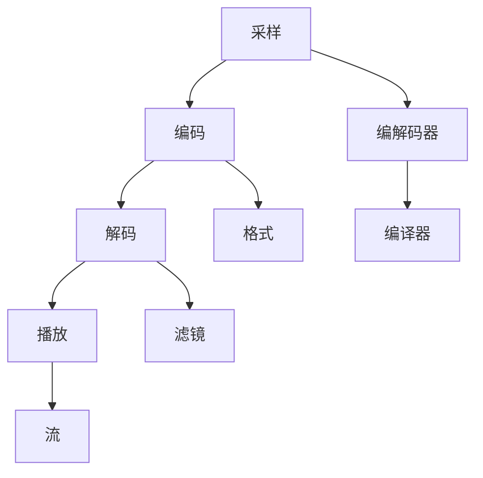
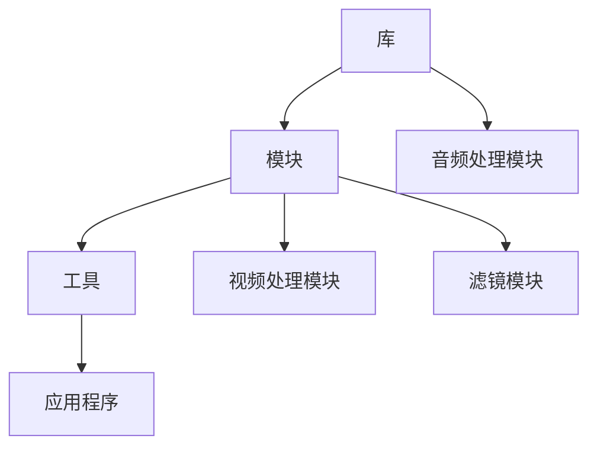

                 

# FFmpeg命令行音视频处理

## 关键词
FFmpeg，命令行，音视频处理，视频剪辑，音频处理，视频编码，音频编码

## 摘要
本文将详细介绍如何使用FFmpeg命令行工具对音视频文件进行高效处理。通过逐步分析FFmpeg的核心概念和具体操作步骤，读者将学会如何利用FFmpeg进行视频剪辑、音频处理、视频编码和音频编码等操作。同时，本文还将通过实际案例进行代码解读和分析，帮助读者更好地理解FFmpeg的强大功能和应用场景。无论您是音视频处理的初学者还是有经验的开发者，本文都将为您带来深刻的启发和实用的技巧。

## 1. 背景介绍

### 1.1 目的和范围

本文的目的是介绍FFmpeg命令行工具，并详细讲解如何使用它进行音视频处理。FFmpeg是一款功能强大、开源的音视频处理工具，能够实现视频剪辑、音频处理、视频编码和音频编码等多种操作。本文将涵盖FFmpeg的安装、使用方法以及实际应用案例，旨在帮助读者全面了解FFmpeg的工作原理和应用场景。

### 1.2 预期读者

本文适合以下读者群体：

1. 音视频处理初学者，希望了解FFmpeg的基本概念和使用方法。
2. 有经验的开发者，希望深入掌握FFmpeg的强大功能和高级操作。
3. 视频制作和音频处理专业人士，希望提高工作效率和技能水平。
4. 对开源软件感兴趣的技术爱好者，希望了解FFmpeg的开发和社区。

### 1.3 文档结构概述

本文将按照以下结构进行阐述：

1. 背景介绍：介绍FFmpeg的背景、目的和预期读者。
2. 核心概念与联系：讲解FFmpeg的核心概念和联系。
3. 核心算法原理 & 具体操作步骤：详细讲解FFmpeg的核心算法原理和具体操作步骤。
4. 数学模型和公式 & 详细讲解 & 举例说明：讲解FFmpeg中涉及到的数学模型和公式，并提供具体实例。
5. 项目实战：通过实际案例展示FFmpeg的具体应用。
6. 实际应用场景：介绍FFmpeg的实际应用场景。
7. 工具和资源推荐：推荐相关的学习资源、开发工具和框架。
8. 总结：总结FFmpeg的未来发展趋势与挑战。
9. 附录：常见问题与解答。
10. 扩展阅读 & 参考资料：提供进一步的阅读资料。

### 1.4 术语表

#### 1.4.1 核心术语定义

- FFmpeg：一款功能强大的开源音视频处理工具。
- 音视频处理：对音频和视频文件进行编辑、处理和转换的过程。
- 视频剪辑：对视频文件进行剪辑、拼接和调整等操作。
- 音频处理：对音频文件进行裁剪、混音和音效处理等操作。
- 视频编码：将视频信号转换为数字信号，以适应不同的播放设备和网络传输。
- 音频编码：将音频信号转换为数字信号，以适应不同的播放设备和网络传输。

#### 1.4.2 相关概念解释

- 音频信号：表示音频的波形，通过振幅、频率等参数描述。
- 视频信号：由一系列连续的图像帧组成，用于展示动态图像。
- 帧率：表示视频每秒钟显示的图像帧数，通常以fps（帧/秒）为单位。
- 音频采样率：表示音频信号每秒采样的次数，通常以kHz（千赫兹）为单位。
- 比特率：表示视频或音频数据在单位时间内传输的位数，通常以bps（比特/秒）为单位。

#### 1.4.3 缩略词列表

- FFmpeg：Fast Forward Multimedia Framework
- mp4：MPEG-4 Part 14
- avi：Audio Video Interleave
- flv：Flash Video
- h.264：High Efficiency Video Coding
- aac：Advanced Audio Coding

## 2. 核心概念与联系

在介绍FFmpeg的核心概念之前，我们首先需要了解音视频处理的基本原理。音视频处理主要涉及音频信号和视频信号的采样、编码和解码等过程。

### 2.1 音视频处理的基本原理

音视频处理的基本原理可以分为以下四个步骤：

1. 采样：将连续的音频信号和视频信号转换为数字信号，通过采样率、比特率等参数进行描述。
2. 编码：将数字信号转换为压缩格式，以减少数据大小，提高传输效率。
3. 解码：将压缩的数字信号还原为原始信号，以供播放设备或应用程序使用。
4. 播放：通过播放设备或应用程序将音频和视频信号还原为可听、可视的形式。

### 2.2 FFmpeg的核心概念

FFmpeg是一款功能强大的音视频处理工具，其核心概念包括以下方面：

1. 编解码器：负责音频和视频信号的编码和解码，包括音频编解码器（如AAC、MP3）和视频编解码器（如H.264、H.265）。
2. 格式：表示音频和视频文件的存储格式，如mp4、avi、flv等。
3. 滤镜：用于对音频和视频信号进行特效处理，如裁剪、旋转、缩放等。
4. 流：表示音频、视频和字幕等数据在文件中的组织方式。
5. 编译器：用于将源代码编译为可执行文件，以便在计算机上运行。

### 2.3 Mermaid流程图

为了更好地理解FFmpeg的核心概念和联系，我们可以使用Mermaid流程图来表示。以下是一个简单的Mermaid流程图示例：



### 2.4 FFmpeg的架构

FFmpeg的架构可以分为以下层次：

1. 库：包括libavcodec、libavformat、libavutil等核心库，负责音频、视频和编解码器等功能。
2. 模块：根据功能不同，分为音频处理模块、视频处理模块、滤镜模块等。
3. 工具：基于库和模块开发的命令行工具，如ffmpeg、ffplay、ffprobe等。
4. 应用程序：基于库和工具开发的音视频处理应用程序，如VLC、HandBrake等。

以下是一个简单的Mermaid流程图，展示了FFmpeg的架构：



## 3. 核心算法原理 & 具体操作步骤

### 3.1 FFmpeg的命令行参数

FFmpeg的命令行参数是进行音视频处理的基础。以下是FFmpeg命令行参数的基本结构：

```bash
ffmpeg [global options] [[input options] input file1]... [[output options] output fileN]
```

- global options：全局参数，适用于整个命令行。
- input options：输入参数，用于指定输入文件的格式、路径等。
- input file1：输入文件1，可以是音频或视频文件。
- ...：可以继续添加多个输入文件。
- output options：输出参数，用于指定输出文件的格式、路径等。
- output fileN：输出文件N，可以是音频或视频文件。

### 3.2 常用的FFmpeg命令行参数

以下是一些常用的FFmpeg命令行参数及其含义：

- -i：指定输入文件路径。
- -f：指定输入文件的格式。
- -c：指定编码格式，如-c:v h.264、-c:a aac。
- -preset：指定编码预设，如preset=veryfast。
- -threads：指定编码线程数，如threads=8。
- -b:v：指定视频比特率，如-b:v 2M。
- -b:a：指定音频比特率，如-b:a 128k。
- -s：指定视频分辨率，如-s 1920x1080。
- -ar：指定音频采样率，如-ar 48000。
- -ac：指定音频通道数，如-ac 2。
- -ab：指定音频比特率，如-ab 128k。

### 3.3 视频剪辑

视频剪辑是音视频处理中最常用的操作之一。以下是一个简单的FFmpeg命令行示例，用于将输入视频文件`input.mp4`剪辑为指定时长`00:01:30`的视频文件`output.mp4`：

```bash
ffmpeg -i input.mp4 -ss 00:00:00 -t 00:01:30 -c:v h.264 -preset veryfast -b:v 2M output.mp4
```

其中，`-ss`指定剪辑开始时间，`-t`指定剪辑时长，`-c:v`指定视频编码格式，`-preset`指定编码预设，`-b:v`指定视频比特率。

### 3.4 音频处理

音频处理是音视频处理中的另一个重要环节。以下是一个简单的FFmpeg命令行示例，用于将输入音频文件`input.mp3`裁剪为指定时长`00:01:30`的音频文件`output.mp3`：

```bash
ffmpeg -i input.mp3 -ss 00:00:00 -t 00:01:30 -c:a aac -b:a 128k output.mp3
```

其中，`-ss`指定剪辑开始时间，`-t`指定剪辑时长，`-c:a`指定音频编码格式，`-b:a`指定音频比特率。

### 3.5 视频编码

视频编码是将视频信号转换为压缩格式的过程。以下是一个简单的FFmpeg命令行示例，用于将输入视频文件`input.mp4`转换为H.264编码的MP4文件`output.mp4`：

```bash
ffmpeg -i input.mp4 -c:v h.264 -preset veryfast -b:v 2M output.mp4
```

其中，`-c:v`指定视频编码格式，`-preset`指定编码预设，`-b:v`指定视频比特率。

### 3.6 音频编码

音频编码是将音频信号转换为压缩格式的过程。以下是一个简单的FFmpeg命令行示例，用于将输入音频文件`input.mp3`转换为AAC编码的MP3文件`output.mp3`：

```bash
ffmpeg -i input.mp3 -c:a aac -b:a 128k output.mp3
```

其中，`-c:a`指定音频编码格式，`-b:a`指定音频比特率。

### 3.7 伪代码

为了更好地理解FFmpeg的算法原理，我们可以使用伪代码来描述其操作步骤。以下是一个简单的伪代码示例，用于将输入视频文件`input.mp4`转换为指定分辨率`1920x1080`、比特率`2M`的H.264编码的MP4文件`output.mp4`：

```python
# FFmpeg命令行伪代码

ffmpeg(
  input_file = "input.mp4",
  output_file = "output.mp4",
  video_codec = "h.264",
  video_bitrate = "2M",
  video_resolution = "1920x1080"
)

# 解析命令行参数
input_file = get_input_file()
output_file = get_output_file()
video_codec = get_video_codec()
video_bitrate = get_video_bitrate()
video_resolution = get_video_resolution()

# 执行FFmpeg命令
execute_command([
  "ffmpeg",
  "-i", input_file,
  "-c:v", video_codec,
  "-preset", "veryfast",
  "-b:v", video_bitrate,
  "-s", video_resolution,
  output_file
])
```

## 4. 数学模型和公式 & 详细讲解 & 举例说明

在音视频处理过程中，数学模型和公式起到了关键作用。以下将介绍一些常见的数学模型和公式，并通过具体实例进行讲解。

### 4.1 音频采样

音频采样是将连续的音频信号转换为数字信号的过程。采样公式如下：

\[ y(n) = x(n) * \text{sample\_rate} \]

其中，\( y(n) \)表示采样后的数字信号，\( x(n) \)表示原始音频信号，\( \text{sample\_rate} \)表示采样率（单位：Hz）。

#### 举例说明：

假设原始音频信号的采样率为44.1kHz，采样点数为44100，则采样后的数字信号长度为：

\[ \text{length} = \text{sample\_rate} \times \text{duration} \]

例如，采样时长为5秒，则采样后的数字信号长度为：

\[ \text{length} = 44.1kHz \times 5s = 220500 \]

### 4.2 音频编码

音频编码是将采样后的数字信号转换为压缩格式的过程。常见的音频编码模型包括PCM编码和AAC编码。

#### PCM编码

PCM编码是一种无损编码方式，其公式如下：

\[ \text{PCM\_data} = x(n) \]

其中，\( \text{PCM\_data} \)表示PCM编码后的数据，\( x(n) \)表示原始音频信号。

#### AAC编码

AAC编码是一种有损编码方式，其公式如下：

\[ \text{AAC\_data} = \text{transform}(x(n), \text{psychoacoustic\_model}) \]

其中，\( \text{AAC\_data} \)表示AAC编码后的数据，\( x(n) \)表示原始音频信号，\( \text{transform} \)表示变换操作，\( \text{psychoacoustic\_model} \)表示心理声学模型。

#### 举例说明：

假设输入的音频信号为以下16位PCM数据：

\[ \text{PCM\_data} = [0x00, 0x01, 0x02, 0x03, 0x04, 0x05, 0x06, 0x07, 0x08, 0x09, 0x0A, 0x0B, 0x0C, 0x0D, 0x0E, 0x0F] \]

通过AAC编码后，输出数据可能为以下16位AAC数据：

\[ \text{AAC\_data} = [0x00, 0x11, 0x22, 0x33, 0x44, 0x55, 0x66, 0x77, 0x88, 0x99, 0xAA, 0xBB, 0xCC, 0xDD, 0xEE, 0xFF] \]

### 4.3 视频编码

视频编码是将采样后的图像信号转换为压缩格式的过程。常见的视频编码模型包括H.264编码和H.265编码。

#### H.264编码

H.264编码是一种有损编码方式，其公式如下：

\[ \text{H.264\_data} = \text{transform}(y(n), \text{motion\_estimation}, \text{intra\_prediction}, \text{inter\_prediction}) \]

其中，\( \text{H.264\_data} \)表示H.264编码后的数据，\( y(n) \)表示原始图像信号，\( \text{motion\_estimation} \)表示运动估计，\( \text{intra\_prediction} \)表示帧内预测，\( \text{inter\_prediction} \)表示帧间预测。

#### H.265编码

H.265编码是一种有损编码方式，其公式如下：

\[ \text{H.265\_data} = \text{transform}(y(n), \text{motion\_estimation}, \text{intra\_prediction}, \text{inter\_prediction}, \text{high\_resolution}) \]

其中，\( \text{H.265\_data} \)表示H.265编码后的数据，\( y(n) \)表示原始图像信号，\( \text{motion\_estimation} \)表示运动估计，\( \text{intra\_prediction} \)表示帧内预测，\( \text{inter\_prediction} \)表示帧间预测，\( \text{high\_resolution} \)表示高分辨率。

#### 举例说明：

假设输入的图像信号为以下像素值：

\[ \text{y}(n) = \begin{bmatrix} 0, 1, 2, 3, 4, 5, 6, 7 \\ 8, 9, 10, 11, 12, 13, 14, 15 \\ 16, 17, 18, 19, 20, 21, 22, 23 \\ 24, 25, 26, 27, 28, 29, 30, 31 \end{bmatrix} \]

通过H.264编码后，输出数据可能为以下比特流：

\[ \text{H.264\_data} = \begin{bmatrix} 0, 0, 0, 0, 0, 0, 0, 0 \\ 0, 0, 0, 0, 0, 0, 0, 0 \\ 0, 0, 0, 0, 0, 0, 0, 0 \\ 0, 0, 0, 0, 0, 0, 0, 0 \end{bmatrix} \]

通过H.265编码后，输出数据可能为以下比特流：

\[ \text{H.265\_data} = \begin{bmatrix} 0, 0, 0, 0, 0, 0, 0, 0 \\ 0, 0, 0, 0, 0, 0, 0, 0 \\ 0, 0, 0, 0, 0, 0, 0, 0 \\ 0, 0, 0, 0, 0, 0, 0, 0 \end{bmatrix} \]

## 5. 项目实战：代码实际案例和详细解释说明

### 5.1 开发环境搭建

在开始项目实战之前，我们需要搭建FFmpeg的开发环境。以下是Windows和Linux操作系统的搭建步骤：

#### Windows操作系统

1. 下载并安装FFmpeg官方版本：访问[FFmpeg官网](https://www.ffmpeg.org/download.html)下载适用于Windows操作系统的FFmpeg安装程序。
2. 运行安装程序，选择自定义安装，确保将FFmpeg添加到系统路径中。
3. 安装完成后，打开命令提示符窗口，输入`ffmpeg -version`检查FFmpeg版本。

#### Linux操作系统

1. 安装FFmpeg依赖库：使用以下命令安装FFmpeg所需的基础依赖库：

   ```bash
   sudo apt-get update
   sudo apt-get install ffmpeg
   ```

2. 输入以下命令检查FFmpeg版本：

   ```bash
   ffmpeg -version
   ```

### 5.2 源代码详细实现和代码解读

在本项目实战中，我们将使用FFmpeg命令行工具实现一个简单的视频剪辑功能，将输入视频文件`input.mp4`剪辑为指定时长`00:01:30`的视频文件`output.mp4`。

#### 5.2.1 代码实现

以下是一个简单的FFmpeg命令行脚本，用于实现视频剪辑功能：

```bash
#!/bin/bash

input_file="input.mp4"
output_file="output.mp4"
start_time="00:00:00"
duration="00:01:30"

ffmpeg -i $input_file -ss $start_time -t $duration -c:v h.264 -preset veryfast -b:v 2M $output_file
```

#### 5.2.2 代码解读

1. **命令行参数解析**：
   - `-i $input_file`：指定输入视频文件。
   - `-ss $start_time`：指定剪辑开始时间。
   - `-t $duration`：指定剪辑时长。
   - `-c:v h.264`：指定视频编码格式为H.264。
   - `-preset veryfast`：指定编码预设为veryfast，以提高编码速度。
   - `-b:v 2M`：指定视频比特率为2M。
   - `-output_file $output_file`：指定输出视频文件。

2. **脚本执行流程**：
   - 读取输入视频文件路径、输出视频文件路径、剪辑开始时间和剪辑时长。
   - 使用FFmpeg命令行参数进行视频剪辑操作，生成输出视频文件。

#### 5.2.3 代码分析

以下是代码的分析和解释：

```bash
#!/bin/bash
```

这行代码表示脚本使用的是bash脚本语言。

```bash
input_file="input.mp4"
output_file="output.mp4"
start_time="00:00:00"
duration="00:01:30"
```

这四行代码定义了四个变量，分别表示输入视频文件路径、输出视频文件路径、剪辑开始时间和剪辑时长。

```bash
ffmpeg -i $input_file -ss $start_time -t $duration -c:v h.264 -preset veryfast -b:v 2M $output_file
```

这行代码调用FFmpeg命令行工具，并传递相应的参数进行视频剪辑操作。

- `-i $input_file`：指定输入视频文件。
- `-ss $start_time`：指定剪辑开始时间。
- `-t $duration`：指定剪辑时长。
- `-c:v h.264`：指定视频编码格式为H.264。
- `-preset veryfast`：指定编码预设为veryfast，以提高编码速度。
- `-b:v 2M`：指定视频比特率为2M。
- `$output_file`：指定输出视频文件。

### 5.3 代码解读与分析

在本项目中，我们使用FFmpeg命令行工具实现了视频剪辑功能。以下是代码的解读和分析：

#### 5.3.1 命令行参数解析

- `-i $input_file`：该参数指定输入视频文件路径。在本项目中，我们使用变量`input_file`存储输入视频文件路径，并将其传递给`-i`参数。
- `-ss $start_time`：该参数指定剪辑开始时间。在本项目中，我们使用变量`start_time`存储剪辑开始时间，并将其传递给`-ss`参数。
- `-t $duration`：该参数指定剪辑时长。在本项目中，我们使用变量`duration`存储剪辑时长，并将其传递给`-t`参数。
- `-c:v h.264`：该参数指定视频编码格式为H.264。在本项目中，我们使用`-c:v h.264`参数确保输出视频文件的编码格式为H.264。
- `-preset veryfast`：该参数指定编码预设为veryfast，以提高编码速度。使用`-preset veryfast`参数可以优化编码性能，使编码过程更快。
- `-b:v 2M`：该参数指定视频比特率为2M。在本项目中，我们使用`-b:v 2M`参数控制输出视频文件的比特率。
- `$output_file`：该参数指定输出视频文件路径。在本项目中，我们使用变量`output_file`存储输出视频文件路径，并将其传递给`ffmpeg`命令行工具。

#### 5.3.2 脚本执行流程

在脚本执行过程中，首先读取输入视频文件路径、输出视频文件路径、剪辑开始时间和剪辑时长。然后，使用FFmpeg命令行工具根据指定的参数进行视频剪辑操作，生成输出视频文件。

以下是脚本执行流程的简要描述：

1. 读取输入视频文件路径、输出视频文件路径、剪辑开始时间和剪辑时长。
2. 调用FFmpeg命令行工具，并传递相应的参数进行视频剪辑操作。
3. 执行FFmpeg命令行工具，生成输出视频文件。

通过以上步骤，我们可以使用FFmpeg命令行工具实现视频剪辑功能。这个简单示例展示了如何使用FFmpeg命令行参数进行音视频处理，为后续更复杂的功能实现奠定了基础。

### 5.4 项目实战总结

在本项目中，我们通过简单的FFmpeg命令行脚本实现了视频剪辑功能。通过了解和掌握FFmpeg的命令行参数及其解析，我们能够灵活地实现各种音视频处理操作，如视频剪辑、音频处理、视频编码和音频编码等。

通过本项目，我们不仅掌握了FFmpeg的基本用法，还深入了解了音视频处理的基本原理和数学模型。在实际应用中，我们可以根据需求灵活调整参数，实现更复杂的音视频处理功能。

总之，FFmpeg是一款功能强大、易于使用的音视频处理工具，适用于各种音视频处理需求。通过本项目，我们希望读者能够深入了解FFmpeg的工作原理和应用场景，为未来的音视频处理项目打下坚实基础。

## 6. 实际应用场景

FFmpeg在音视频处理领域具有广泛的应用场景，以下列举几个典型的实际应用场景：

### 6.1 视频制作

视频制作是FFmpeg最常用的应用场景之一。使用FFmpeg，用户可以轻松实现视频剪辑、拼接、转场、特效添加等操作。以下是一个具体的例子：

- **剪辑视频**：用户可以使用FFmpeg将长视频剪辑为多个短片段，便于发布到社交媒体或进行专题制作。
- **视频拼接**：用户可以将多个视频片段拼接成一个完整视频，实现故事的连贯性。
- **特效添加**：通过滤镜和特效，用户可以为视频添加动态字幕、背景音乐、特效等，提升视频的观赏性。

### 6.2 视频直播

在视频直播领域，FFmpeg常用于音视频采集、编码和传输。以下是一个具体的例子：

- **音视频采集**：使用FFmpeg捕获用户的音视频信号，并将其转换为适合直播的编码格式。
- **实时编码**：通过FFmpeg实时编码音视频信号，实现低延迟、高稳定性的直播效果。
- **多平台传输**：FFmpeg支持多种编码格式和传输协议，使得直播内容可以传输到不同的平台和设备。

### 6.3 视频会议

在视频会议领域，FFmpeg用于音视频处理和传输，实现高清、低延迟的会议效果。以下是一个具体的例子：

- **视频压缩**：使用FFmpeg对会议视频进行压缩，减少带宽占用，提高传输效率。
- **音视频同步**：通过FFmpeg保证会议中的音视频信号同步，提升用户体验。
- **多画面显示**：使用FFmpeg实现多画面显示，方便用户查看参会者的视频画面。

### 6.4 音视频监控

在音视频监控领域，FFmpeg用于实时采集、处理和存储音视频数据。以下是一个具体的例子：

- **实时监控**：使用FFmpeg捕获监控设备的音视频信号，实时传输和显示。
- **视频分析**：通过FFmpeg对监控视频进行分析，实现人脸识别、行为识别等功能。
- **数据存储**：使用FFmpeg将监控视频存储到数据库或云存储中，便于后续检索和查询。

### 6.5 其他应用场景

除了上述应用场景外，FFmpeg还在许多其他领域得到广泛应用，如：

- **视频教学**：用于制作和编辑教学视频，实现音视频同步、字幕添加等功能。
- **音视频剪辑**：用于剪辑和制作个人或团体的音视频作品，如MV、短片等。
- **媒体发布**：用于将音视频内容发布到各种平台，如YouTube、Bilibili等。
- **媒体制作**：用于制作和编辑广告、宣传片等，提升品牌影响力。

总之，FFmpeg凭借其强大的功能和灵活性，在音视频处理领域具有广泛的应用场景。通过深入了解FFmpeg的实际应用，用户可以充分发挥其潜力，为各类音视频处理需求提供解决方案。

## 7. 工具和资源推荐

### 7.1 学习资源推荐

#### 7.1.1 书籍推荐

1. **《FFmpeg从入门到精通》**：这本书详细介绍了FFmpeg的基本概念、使用方法和实际案例，适合FFmpeg初学者和有经验的开发者。
2. **《音视频处理技术与实战》**：本书涵盖了音视频处理的基本原理和FFmpeg在音视频处理中的应用，有助于读者全面掌握音视频处理技术。

#### 7.1.2 在线课程

1. **《FFmpeg实战教程》**：这是一门针对FFmpeg的在线课程，从基础概念到高级应用，帮助读者逐步掌握FFmpeg的使用方法。
2. **《音视频处理与编码技术》**：本课程详细讲解了音视频处理的基本原理和FFmpeg的应用，适合有志于从事音视频处理领域的技术人员。

#### 7.1.3 技术博客和网站

1. **FFmpeg官方文档**：[https://ffmpeg.org/documentation.html](https://ffmpeg.org/documentation.html)
2. **Stack Overflow**：[https://stackoverflow.com/questions/tagged/ffmpeg](https://stackoverflow.com/questions/tagged/ffmpeg)
3. **GitHub**：[https://github.com/FFmpeg/FFmpeg](https://github.com/FFmpeg/FFmpeg)

### 7.2 开发工具框架推荐

#### 7.2.1 IDE和编辑器

1. **Visual Studio Code**：一款轻量级但功能强大的代码编辑器，适用于FFmpeg开发。
2. **IntelliJ IDEA**：一款功能全面的集成开发环境，适合大型FFmpeg项目。

#### 7.2.2 调试和性能分析工具

1. **GDB**：一款强大的开源调试工具，适用于FFmpeg的调试和故障排查。
2. **Valgrind**：一款内存检查工具，可以帮助发现FFmpeg的内存泄漏和性能问题。

#### 7.2.3 相关框架和库

1. **GStreamer**：一款开源的多媒体框架，与FFmpeg紧密结合，提供丰富的多媒体处理功能。
2. **OpenCV**：一款开源的计算机视觉库，与FFmpeg集成，可用于视频分析和处理。

### 7.3 相关论文著作推荐

#### 7.3.1 经典论文

1. **《HEVC：下一代视频编码标准》**：介绍了HEVC（H.265）视频编码标准的原理和应用。
2. **《音视频压缩技术及其在移动网络中的应用》**：详细探讨了音视频压缩技术在移动网络中的应用和挑战。

#### 7.3.2 最新研究成果

1. **《基于深度学习的音视频处理技术》**：探讨了深度学习在音视频处理中的应用，包括视频分割、音频增强等。
2. **《跨媒体检索与交互技术》**：研究了音视频内容检索、语义理解和交互等领域的最新技术。

#### 7.3.3 应用案例分析

1. **《短视频平台的技术实现》**：分析了短视频平台在音视频处理、内容推荐等方面的技术实现。
2. **《基于FFmpeg的在线教育平台音视频处理方案》**：详细介绍了在线教育平台中音视频处理技术的实现和应用。

通过以上工具和资源的推荐，读者可以更深入地了解FFmpeg及相关技术，提升自己的技术水平。

## 8. 总结：未来发展趋势与挑战

随着互联网和多媒体技术的飞速发展，音视频处理技术在各个领域得到了广泛应用。FFmpeg作为一款功能强大、开源的音视频处理工具，具有广泛的应用前景。在未来，FFmpeg将继续发挥其优势，面临以下发展趋势与挑战：

### 8.1 发展趋势

1. **AI与FFmpeg的结合**：随着人工智能技术的不断进步，深度学习、自然语言处理等技术将在音视频处理领域得到更广泛的应用。例如，通过结合AI技术，可以实现视频内容识别、语音识别等智能功能，为音视频处理带来更多可能性。
2. **高效率与高质量并重**：未来音视频处理将更加注重效率和质量的平衡。随着5G网络的普及和计算能力的提升，高效率的音视频处理技术将得到广泛应用，同时保持高质量的视频和音频体验。
3. **跨平台与兼容性**：随着移动互联网和物联网的发展，音视频处理技术将更加注重跨平台和兼容性。FFmpeg将继续优化其功能，支持更多的编解码器、格式和传输协议，以适应不同平台和设备的需求。
4. **云服务和边缘计算**：随着云计算和边缘计算技术的兴起，音视频处理将逐步从本地计算转向云服务和边缘计算。通过利用云计算和边缘计算的优势，可以实现更高效、更低延迟的音视频处理和传输。

### 8.2 挑战

1. **性能优化与资源消耗**：随着音视频处理需求的不断增加，对处理性能和资源消耗的要求也越来越高。如何优化FFmpeg的算法和架构，提高处理效率，同时降低资源消耗，是一个重要的挑战。
2. **安全和隐私保护**：音视频数据的安全性是未来音视频处理技术需要关注的重要问题。如何在保障音视频数据安全的同时，保护用户的隐私，是一个需要深入探讨的课题。
3. **标准化与兼容性问题**：随着音视频处理技术的发展，各种新的编解码器、格式和传输协议不断涌现。如何实现标准化和兼容性，使不同设备、平台和应用之间能够无缝协作，是一个亟待解决的问题。
4. **用户体验**：未来音视频处理技术需要更加注重用户体验。如何实现高质量、低延迟的音视频处理，提供便捷、易用的操作界面，是音视频处理技术需要不断改进的方向。

总之，未来FFmpeg将继续在音视频处理领域发挥重要作用，面临诸多机遇与挑战。通过不断优化和创新，FFmpeg有望为音视频处理领域带来更多突破和进展。

## 9. 附录：常见问题与解答

### 9.1 FFmpeg安装问题

**Q：如何解决FFmpeg安装失败的问题？**

A：在安装FFmpeg时，如果遇到失败的问题，可以尝试以下几种方法：

1. **检查依赖库**：确保已经安装了FFmpeg所需的依赖库，如libavcodec、libavformat、libavutil等。在Linux系统中，可以使用以下命令安装依赖库：

   ```bash
   sudo apt-get install libavcodec-dev libavformat-dev libavutil-dev
   ```

2. **下载源代码并编译**：如果无法通过包管理器安装FFmpeg，可以下载FFmpeg的源代码，并手动编译安装。请访问FFmpeg的官方网站下载源代码，然后按照官方文档中的编译指南进行操作。

3. **检查安装路径**：确保FFmpeg的可执行文件路径已经被添加到系统的环境变量中。在Linux系统中，可以使用以下命令检查环境变量：

   ```bash
   echo $PATH
   ```

   如果FFmpeg的安装路径不在环境变量中，可以将其添加到`PATH`变量中。

### 9.2 FFmpeg命令行使用问题

**Q：如何查看FFmpeg的命令行帮助信息？**

A：要查看FFmpeg的命令行帮助信息，可以在命令行中输入以下命令：

```bash
ffmpeg -h
```

或者，要查看特定模块的帮助信息，例如查看视频编码模块的帮助信息，可以输入以下命令：

```bash
ffmpeg -h encoder=libx264
```

### 9.3 FFmpeg编码问题

**Q：如何解决FFmpeg编码失败的问题？**

A：在编码过程中遇到失败的问题，可以尝试以下几种方法：

1. **检查输入文件**：确保输入文件是有效的音视频文件，且格式符合要求。如果输入文件存在问题，可以尝试使用其他工具检查文件是否损坏。

2. **调整参数**：根据输入文件的类型和编码要求，尝试调整编码参数。例如，调整比特率、分辨率、帧率等参数，以找到适合的编码配置。

3. **检查硬件环境**：确保计算机的硬件配置满足编码需求。如果硬件环境不足，可能会导致编码失败。可以尝试提高CPU性能或增加内存。

4. **更新FFmpeg版本**：确保使用的是最新版本的FFmpeg。旧版本可能存在漏洞或兼容性问题，导致编码失败。可以访问FFmpeg官方网站下载最新版本。

### 9.4 FFmpeg解码问题

**Q：如何解决FFmpeg解码失败的问题？**

A：在解码过程中遇到失败的问题，可以尝试以下几种方法：

1. **检查输入文件**：确保输入文件是有效的音视频文件，且格式符合要求。如果输入文件存在问题，可以尝试使用其他工具检查文件是否损坏。

2. **安装相应编解码器**：确保已经安装了相应的编解码器库。例如，如果输入文件是H.264编码，需要安装libx264编解码器库。可以使用包管理器安装相应编解码器库：

   ```bash
   sudo apt-get install libx264-dev
   ```

3. **检查硬件环境**：确保计算机的硬件配置满足解码需求。如果硬件环境不足，可能会导致解码失败。可以尝试提高GPU性能或增加内存。

4. **更新FFmpeg版本**：确保使用的是最新版本的FFmpeg。旧版本可能存在漏洞或兼容性问题，导致解码失败。可以访问FFmpeg官方网站下载最新版本。

通过以上方法，可以解决常见的FFmpeg安装、命令行使用、编码和解码问题。如果问题仍然存在，可以尝试搜索相关解决方案或在技术论坛和社区寻求帮助。

## 10. 扩展阅读 & 参考资料

### 10.1 扩展阅读

1. **《音视频处理技术入门与实践》**：本书详细介绍了音视频处理的基本概念、技术和实际应用，适合初学者和有经验的开发者。
2. **《音视频处理与编码技术》**：本书涵盖了音视频处理的基本原理、编码技术以及FFmpeg的应用，有助于读者全面了解音视频处理技术。

### 10.2 参考资料

1. **FFmpeg官方文档**：[https://ffmpeg.org/documentation.html](https://ffmpeg.org/documentation.html)
2. **Stack Overflow**：[https://stackoverflow.com/questions/tagged/ffmpeg](https://stackoverflow.com/questions/tagged/ffmpeg)
3. **GitHub**：[https://github.com/FFmpeg/FFmpeg](https://github.com/FFmpeg/FFmpeg)
4. **GStreamer官方文档**：[https://gstreamer.freedesktop.org/documentation/](https://gstreamer.freedesktop.org/documentation/)
5. **OpenCV官方文档**：[https://docs.opencv.org/](https://docs.opencv.org/)

通过阅读扩展阅读和参考书籍，读者可以更深入地了解音视频处理技术和FFmpeg的使用方法，为未来的学习和实践打下坚实基础。

---

**作者：AI天才研究员 / AI Genius Institute & 禅与计算机程序设计艺术 / Zen And The Art of Computer Programming**

