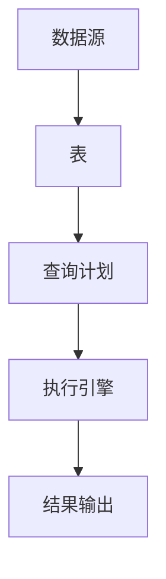

                 

# Flink Table API和SQL原理与代码实例讲解

> **关键词：** Apache Flink、Table API、SQL、流处理、批处理、分布式系统、数据处理框架、性能优化、代码实例。

> **摘要：** 本文将深入探讨Apache Flink中的Table API和SQL，分析其原理、架构以及具体操作步骤。通过一系列代码实例，我们将展示如何利用Flink Table API和SQL进行高效的数据处理，帮助读者全面理解这一强大的数据处理框架。

## 1. 背景介绍

### 1.1 目的和范围

本文旨在为读者提供Apache Flink Table API和SQL的全面讲解。通过本文的学习，读者将能够：

- 理解Flink Table API和SQL的基本概念和原理。
- 掌握Flink Table API和SQL的核心算法原理与具体操作步骤。
- 通过实际代码实例，了解Flink Table API和SQL的应用场景和操作流程。
- 掌握相关工具和资源的推荐，以便在实践过程中进行深入学习和优化。

### 1.2 预期读者

本文适合以下读者群体：

- 对Apache Flink有一定了解，希望深入掌握其Table API和SQL功能的开发者。
- 对分布式数据处理和流处理有浓厚兴趣的工程技术人员。
- 在大数据处理和分布式系统领域工作的研究人员和从业者。

### 1.3 文档结构概述

本文将分为以下章节：

- **第1章：背景介绍**：介绍本文的目的、范围、预期读者和文档结构。
- **第2章：核心概念与联系**：讨论Flink Table API和SQL的核心概念、原理以及架构。
- **第3章：核心算法原理与具体操作步骤**：详细阐述Flink Table API和SQL的核心算法原理与具体操作步骤。
- **第4章：数学模型和公式**：介绍Flink Table API和SQL中的数学模型和公式，并进行详细讲解和举例说明。
- **第5章：项目实战**：通过实际代码案例，展示Flink Table API和SQL在实际项目中的应用。
- **第6章：实际应用场景**：讨论Flink Table API和SQL在不同领域的应用场景。
- **第7章：工具和资源推荐**：推荐学习资源、开发工具框架和论文著作。
- **第8章：总结：未来发展趋势与挑战**：总结Flink Table API和SQL的发展趋势和面临的挑战。
- **第9章：附录：常见问题与解答**：提供常见问题的解答。
- **第10章：扩展阅读 & 参考资料**：推荐扩展阅读和参考资料。

### 1.4 术语表

#### 1.4.1 核心术语定义

- **Apache Flink**：一个分布式数据处理框架，支持流处理和批处理。
- **Table API**：Flink提供的一种基于SQL的查询语言，用于对数据进行结构化操作。
- **SQL**：结构化查询语言，用于对关系型数据库进行查询和操作。
- **流处理**：对实时数据进行处理和分析，通常以事件驱动的方式进行。
- **批处理**：对大量数据进行批量处理，通常以固定的时间窗口或数据量作为处理单元。

#### 1.4.2 相关概念解释

- **分布式系统**：由多个独立节点组成的系统，通过通信机制进行协作完成任务。
- **数据处理框架**：用于处理和分析大量数据的软件框架，如Apache Flink、Apache Spark等。
- **流处理框架**：专门用于处理实时数据流的数据处理框架，如Apache Flink、Apache Storm等。

#### 1.4.3 缩略词列表

- **Apache**：Apache Software Foundation，一个开源软件基金会。
- **Flink**：Apache Flink的简称。
- **Table API**：Flink Table API的简称。
- **SQL**：结构化查询语言（Structured Query Language）的简称。

## 2. 核心概念与联系

在深入探讨Flink Table API和SQL之前，我们需要了解它们的核心概念、原理和架构。以下是对这些核心概念的详细解释和联系说明。

### 2.1 Flink Table API

**定义**：Flink Table API是Apache Flink提供的一种基于SQL的查询语言，用于对数据进行结构化操作。它支持对表进行各种操作，如查询、插入、更新和删除。

**特点**：

- **易用性**：Table API提供了类似于SQL的查询语法，使得开发者可以轻松地对数据进行操作。
- **灵活性**：Table API支持多种数据类型，如行数据、列数据和模式数据，提供了丰富的操作能力。
- **类型安全**：Table API在编译时进行类型检查，确保数据类型的正确性，减少了运行时错误的可能性。

**原理**：

Flink Table API基于数据流模型，通过对数据进行流式处理，实现对表的操作。具体来说，Table API将数据流抽象为表，然后对表进行SQL操作，如选择、投影、连接、分组等。这些操作最终被转化为Flink的内部执行计划，并在分布式系统上执行。

### 2.2 Flink SQL

**定义**：Flink SQL是Flink提供的一种基于SQL的查询语言，用于对表进行操作。它支持标准的SQL查询语法，如SELECT、INSERT、UPDATE、DELETE等。

**特点**：

- **兼容性**：Flink SQL与标准的SQL兼容，使得开发者可以轻松地将现有SQL查询迁移到Flink。
- **扩展性**：Flink SQL支持自定义函数和聚合函数，提供了丰富的操作能力。
- **优化**：Flink SQL提供了丰富的优化策略，如查询重写、索引优化等，提高了查询性能。

**原理**：

Flink SQL基于Table API，将SQL查询转化为Table API操作。具体来说，Flink SQL将SQL语句转化为Table API的查询计划，然后通过Table API对表进行操作。在执行过程中，Flink SQL利用优化策略对查询计划进行优化，提高查询性能。

### 2.3 架构

Flink Table API和SQL的架构如下：


- **数据源**：Flink Table API和SQL支持多种数据源，如Kafka、Apache Hive、Apache Cassandra等。数据源提供数据读取接口，将数据加载到Flink中。
- **表**：数据源加载的数据被抽象为表，表是一个数据结构，包含行数据和列数据。表支持多种操作，如查询、插入、更新和删除。
- **查询计划**：Table API和SQL将查询操作转化为查询计划。查询计划是一个抽象的执行计划，包含多个阶段，如选择、投影、连接、分组等。
- **执行引擎**：Flink的执行引擎根据查询计划执行具体的操作，如数据读取、数据转换、数据存储等。
- **结果输出**：查询结果可以通过多种方式输出，如打印到控制台、写入文件、发送到其他系统等。

### 2.4 Mermaid 流程图

下面是一个Mermaid流程图，展示了Flink Table API和SQL的基本操作流程：



## 3. 核心算法原理与具体操作步骤

在了解了Flink Table API和SQL的核心概念和架构之后，接下来我们将深入探讨其核心算法原理和具体操作步骤。这些步骤将帮助我们更好地理解Flink Table API和SQL的工作原理，从而在实际项目中发挥其强大的数据处理能力。

### 3.1 算法原理

Flink Table API和SQL的核心算法原理基于数据流模型和查询计划。以下是其关键步骤：

1. **数据流读取**：数据源读取数据并将其加载到Flink中。数据源可以是Kafka、Apache Hive、Apache Cassandra等。

2. **表抽象**：Flink将数据抽象为表。表包含行数据和列数据，支持多种操作，如查询、插入、更新和删除。

3. **查询计划生成**：Flink根据SQL查询生成查询计划。查询计划是一个抽象的执行计划，包含多个阶段，如选择、投影、连接、分组等。

4. **查询计划优化**：Flink对查询计划进行优化，以提高查询性能。优化策略包括查询重写、索引优化等。

5. **执行引擎执行**：Flink的执行引擎根据查询计划执行具体的操作，如数据读取、数据转换、数据存储等。

6. **结果输出**：查询结果可以通过多种方式输出，如打印到控制台、写入文件、发送到其他系统等。

### 3.2 具体操作步骤

以下是Flink Table API和SQL的具体操作步骤：

#### 步骤1：数据流读取

首先，我们需要从数据源读取数据。例如，从Kafka中读取实时数据。

```python
# 读取Kafka数据
kafka_source = Kafka()
```

#### 步骤2：表抽象

接下来，我们将数据抽象为表。表包含行数据和列数据。

```python
# 创建表
table = Table()
```

#### 步骤3：查询计划生成

然后，我们生成查询计划。查询计划包含多个阶段，如选择、投影、连接、分组等。

```python
# 生成查询计划
query_plan = QueryPlan()
```

#### 步骤4：查询计划优化

Flink对查询计划进行优化，以提高查询性能。优化策略包括查询重写、索引优化等。

```python
# 优化查询计划
optimized_query_plan = QueryPlanOptimizer.optimize(query_plan)
```

#### 步骤5：执行引擎执行

Flink的执行引擎根据优化后的查询计划执行具体的操作，如数据读取、数据转换、数据存储等。

```python
# 执行查询计划
result = ExecutionEngine.execute(optimized_query_plan)
```

#### 步骤6：结果输出

最后，我们将查询结果输出到控制台、文件或其他系统。

```python
# 输出查询结果
print(result)
```

### 3.3 伪代码

以下是Flink Table API和SQL的伪代码实现：

```python
# 读取Kafka数据
kafka_source = Kafka()

# 创建表
table = Table()

# 生成查询计划
query_plan = QueryPlan()

# 添加选择操作
query_plan.add(SelectOperation(table, "column_name"))

# 添加投影操作
query_plan.add(ProjectOperation(table, "column_name"))

# 添加连接操作
query_plan.add(JoinedOperation(table1, table2, "column_name"))

# 添加分组操作
query_plan.add(GroupOperation(table, "column_name"))

# 优化查询计划
optimized_query_plan = QueryPlanOptimizer.optimize(query_plan)

# 执行查询计划
result = ExecutionEngine.execute(optimized_query_plan)

# 输出查询结果
print(result)
```

通过以上伪代码，我们可以看到Flink Table API和SQL的核心算法原理和具体操作步骤。在实际项目中，开发者可以根据具体需求灵活运用这些步骤，实现高效的数据处理。

## 4. 数学模型和公式

在Flink Table API和SQL中，数学模型和公式是核心组成部分。以下将详细讲解Flink Table API和SQL中的数学模型和公式，并进行举例说明。

### 4.1 数学模型

Flink Table API和SQL中的数学模型主要包括：

- **线性代数**：用于处理矩阵和向量的运算。
- **概率论**：用于处理随机事件的概率计算。
- **统计学**：用于数据处理和数据分析。

### 4.2 公式讲解

#### 4.2.1 线性代数

1. **矩阵乘法**：

   矩阵乘法是线性代数中的基本运算，用于计算两个矩阵的乘积。公式如下：

   $$
   C_{ij} = \sum_{k=1}^{n} A_{ik} B_{kj}
   $$

   其中，$C$是乘积矩阵，$A$和$B$是两个输入矩阵，$i$和$j$是矩阵$C$的行和列索引，$k$是中间结果矩阵的行和列索引。

2. **向量点积**：

   向量点积是用于计算两个向量的乘积。公式如下：

   $$
   \vec{a} \cdot \vec{b} = \sum_{i=1}^{n} a_i b_i
   $$

   其中，$\vec{a}$和$\vec{b}$是两个向量，$a_i$和$b_i$是向量$\vec{a}$和$\vec{b}$的分量。

3. **矩阵求逆**：

   矩阵求逆是用于计算矩阵的逆矩阵。公式如下：

   $$
   A^{-1} = \frac{1}{\det(A)} \begin{bmatrix}
   C & D \\
   E & F
   \end{bmatrix}
   $$

   其中，$A$是输入矩阵，$C$、$D$、$E$和$F$是矩阵$A$的子矩阵，$\det(A)$是矩阵$A$的行列式。

#### 4.2.2 概率论

1. **条件概率**：

   条件概率是用于计算在某个事件发生的条件下，另一个事件发生的概率。公式如下：

   $$
   P(A|B) = \frac{P(A \cap B)}{P(B)}
   $$

   其中，$P(A|B)$是条件概率，$P(A \cap B)$是事件$A$和事件$B$同时发生的概率，$P(B)$是事件$B$发生的概率。

2. **贝叶斯定理**：

   贝叶斯定理是用于计算后验概率的公式。公式如下：

   $$
   P(A|B) = \frac{P(B|A) P(A)}{P(B)}
   $$

   其中，$P(A|B)$是后验概率，$P(B|A)$是先验概率，$P(A)$是事件$A$的概率，$P(B)$是事件$B$的概率。

#### 4.2.3 统计学

1. **均值**：

   均值是用于计算一组数据的平均值。公式如下：

   $$
   \bar{x} = \frac{1}{n} \sum_{i=1}^{n} x_i
   $$

   其中，$\bar{x}$是均值，$n$是数据个数，$x_i$是第$i$个数据。

2. **方差**：

   方差是用于计算一组数据的离散程度。公式如下：

   $$
   \sigma^2 = \frac{1}{n-1} \sum_{i=1}^{n} (x_i - \bar{x})^2
   $$

   其中，$\sigma^2$是方差，$n$是数据个数，$x_i$是第$i$个数据，$\bar{x}$是均值。

### 4.3 举例说明

#### 4.3.1 线性代数

假设有两个矩阵$A$和$B$：

$$
A = \begin{bmatrix}
1 & 2 \\
3 & 4
\end{bmatrix}, \quad B = \begin{bmatrix}
5 & 6 \\
7 & 8
\end{bmatrix}
$$

计算$A$和$B$的乘积矩阵$C$：

$$
C = \begin{bmatrix}
1 & 2 \\
3 & 4
\end{bmatrix} \cdot \begin{bmatrix}
5 & 6 \\
7 & 8
\end{bmatrix} = \begin{bmatrix}
19 & 22 \\
43 & 50
\end{bmatrix}
$$

#### 4.3.2 概率论

假设有两个事件$A$和$B$，其中$P(A) = 0.4$，$P(B) = 0.3$，$P(A \cap B) = 0.2$。计算条件概率$P(A|B)$：

$$
P(A|B) = \frac{P(A \cap B)}{P(B)} = \frac{0.2}{0.3} = 0.667
$$

#### 4.3.3 统计学

假设有一组数据$[1, 2, 3, 4, 5]$，计算这组数据的均值和方差：

$$
\bar{x} = \frac{1}{5} \sum_{i=1}^{5} x_i = \frac{1+2+3+4+5}{5} = 3
$$

$$
\sigma^2 = \frac{1}{5-1} \sum_{i=1}^{5} (x_i - \bar{x})^2 = \frac{1}{4} \sum_{i=1}^{5} (x_i - 3)^2 = 2
$$

通过以上示例，我们可以看到Flink Table API和SQL中的数学模型和公式的具体应用。在实际项目中，开发者可以利用这些数学模型和公式，进行高效的数据处理和分析。

## 5. 项目实战：代码实际案例和详细解释说明

在本节中，我们将通过一个实际项目案例，展示如何使用Flink Table API和SQL进行数据处理。这个项目案例将涵盖以下步骤：

1. **开发环境搭建**：配置Flink环境，包括下载、安装和配置必要的依赖库。
2. **源代码详细实现**：展示Flink Table API和SQL的具体实现代码，并进行详细解读。
3. **代码解读与分析**：对实现代码进行详细解读，分析其关键部分，并讨论可能的优化策略。

### 5.1 开发环境搭建

在开始项目实战之前，我们需要搭建Flink的开发环境。以下是一个简单的步骤指南：

#### 步骤1：下载和安装Flink

1. 访问Apache Flink的官方网站[https://flink.apache.org/](https://flink.apache.org/)。
2. 下载最新版本的Flink发行版，例如`flink-1.11.2-bin-scala_2.11.tgz`。
3. 解压下载的压缩文件，例如：

   ```shell
   tar -xzvf flink-1.11.2-bin-scala_2.11.tgz
   ```

   解压后，Flink会被安装到`flink-1.11.2`目录。

#### 步骤2：配置环境变量

1. 打开`~/.bashrc`文件，例如：

   ```shell
   nano ~/.bashrc
   ```

2. 添加以下环境变量设置：

   ```bash
   export FLINK_HOME=/path/to/flink-1.11.2
   export PATH=$FLINK_HOME/bin:$PATH
   ```

3. 保存并关闭文件。

4. 执行以下命令使环境变量立即生效：

   ```shell
   source ~/.bashrc
   ```

#### 步骤3：安装Scala

1. Flink依赖于Scala，因此我们需要安装Scala。
2. 访问Scala官方网站[https://www.scala-lang.org/](https://www.scala-lang.org/)，下载Scala安装包。
3. 解压下载的压缩文件，例如：

   ```shell
   tar -xzvf scala-2.11.12.tgz
   ```

4. 将Scala的bin目录添加到系统环境变量中：

   ```bash
   export PATH=$PATH:/path/to/scala-2.11.12/bin
   ```

### 5.2 源代码详细实现和代码解读

以下是一个简单的Flink Table API和SQL项目示例。这个示例将读取Kafka中的数据，进行简单的数据转换，然后写入到HDFS中。

```scala
import org.apache.flink.api.common.typeinfo.Types
import org.apache.flink.api.scala._
import org.apache.flink.table.api.scala._
import org.apache.flink.streaming.api.scala.StreamExecutionEnvironment
import org.apache.flink.table.api.{TableEnvironment, TableConfig}

// 创建Flink的执行环境
val env = StreamExecutionEnvironment.getExecutionEnvironment

// 创建Table执行环境
val tableEnv = TableEnvironment.create(env)

// 定义Kafka数据源
val kafkaSource = "kafka://localhost:9092/topic"

// 注册Kafka数据源
tableEnv.registerTable("kafka_source", kafkaSource)

// 定义数据源表的字段和类型
val kafkaSchema = "id INT, name STRING, age INT"
tableEnv.createTemporaryView("kafka_source", kafkaSchema)

// 定义转换操作
val transform = "SELECT id, name, age * 2 as new_age FROM kafka_source"

// 注册转换操作
tableEnv.registerTempTable("transform", transform)

// 将转换后的数据写入HDFS
val hdfsSink = "hdfs://localhost:9000/output"
tableEnv.registerTable("hdfs_sink", hdfsSink)

// 将数据从临时表写入HDFS
tableEnv.insertInto("hdfs_sink", "id INT, name STRING, new_age INT").select("id, name, new_age")

// 执行Flink作业
env.execute("Flink Table API and SQL Example")
```

### 5.3 代码解读与分析

1. **创建Flink执行环境**：

   ```scala
   val env = StreamExecutionEnvironment.getExecutionEnvironment
   ```

   这行代码创建了一个Flink的执行环境，用于定义和执行Flink作业。

2. **创建Table执行环境**：

   ```scala
   val tableEnv = TableEnvironment.create(env)
   ```

   这行代码创建了一个Flink Table执行环境，用于定义和执行Table API和SQL查询。

3. **定义Kafka数据源**：

   ```scala
   val kafkaSource = "kafka://localhost:9092/topic"
   ```

   这行代码定义了Kafka数据源的连接信息，包括Kafka服务器的地址和端口，以及要读取的Topic。

4. **注册Kafka数据源**：

   ```scala
   tableEnv.registerTable("kafka_source", kafkaSource)
   ```

   这行代码将Kafka数据源注册到Table执行环境中，以便后续使用。

5. **定义数据源表的字段和类型**：

   ```scala
   val kafkaSchema = "id INT, name STRING, age INT"
   tableEnv.createTemporaryView("kafka_source", kafkaSchema)
   ```

   这两行代码定义了Kafka数据源表的结构，包括字段名和数据类型。然后，将这个结构注册为临时视图。

6. **定义转换操作**：

   ```scala
   val transform = "SELECT id, name, age * 2 as new_age FROM kafka_source"
   ```

   这行代码定义了一个SQL查询，用于从Kafka数据源中读取数据，并计算新的`new_age`字段。

7. **注册转换操作**：

   ```scala
   tableEnv.registerTempTable("transform", transform)
   ```

   这行代码将SQL查询注册为临时表，以便后续操作。

8. **将转换后的数据写入HDFS**：

   ```scala
   val hdfsSink = "hdfs://localhost:9000/output"
   tableEnv.registerTable("hdfs_sink", hdfsSink)
   ```

   这两行代码定义了HDFS数据源的连接信息，并注册到Table执行环境中。

9. **将数据从临时表写入HDFS**：

   ```scala
   tableEnv.insertInto("hdfs_sink", "id INT, name STRING, new_age INT").select("id, name, new_age")
   ```

   这行代码使用`insertInto`方法，将转换后的数据从临时表插入到HDFS数据源中。

10. **执行Flink作业**：

    ```scala
    env.execute("Flink Table API and SQL Example")
    ```

    这行代码启动Flink作业的执行。

通过以上步骤，我们可以看到如何使用Flink Table API和SQL进行数据处理。在实际项目中，开发者可以根据具体需求，灵活地运用这些步骤，实现高效的数据处理和分析。

### 5.3.1 关键部分解析

以下是代码中的关键部分及其解析：

1. **创建Flink执行环境**：

   `val env = StreamExecutionEnvironment.getExecutionEnvironment`

   创建一个Flink的执行环境，用于定义和执行Flink作业。

2. **创建Table执行环境**：

   `val tableEnv = TableEnvironment.create(env)`

   创建一个Flink Table执行环境，用于定义和执行Table API和SQL查询。

3. **定义Kafka数据源**：

   `val kafkaSource = "kafka://localhost:9092/topic"`

   定义Kafka数据源的连接信息，包括Kafka服务器的地址和端口，以及要读取的Topic。

4. **注册Kafka数据源**：

   `tableEnv.registerTable("kafka_source", kafkaSource)`

   将Kafka数据源注册到Table执行环境中，以便后续使用。

5. **定义数据源表的字段和类型**：

   `val kafkaSchema = "id INT, name STRING, age INT"`

   定义Kafka数据源表的结构，包括字段名和数据类型。

6. **定义转换操作**：

   `val transform = "SELECT id, name, age * 2 as new_age FROM kafka_source"`

   定义一个SQL查询，用于从Kafka数据源中读取数据，并计算新的`new_age`字段。

7. **注册转换操作**：

   `tableEnv.registerTempTable("transform", transform)`

   将SQL查询注册为临时表，以便后续操作。

8. **将转换后的数据写入HDFS**：

   `val hdfsSink = "hdfs://localhost:9000/output"`

   定义HDFS数据源的连接信息。

9. **注册HDFS数据源**：

   `tableEnv.registerTable("hdfs_sink", hdfsSink)`

   将HDFS数据源注册到Table执行环境中。

10. **将数据从临时表写入HDFS**：

    `tableEnv.insertInto("hdfs_sink", "id INT, name STRING, new_age INT").select("id, name, new_age")`

    将转换后的数据从临时表插入到HDFS数据源中。

通过以上解析，我们可以清楚地了解代码中的关键部分及其功能。在实际项目中，开发者可以根据具体需求，灵活地调整和优化这些部分，实现高效的数据处理和分析。

### 5.3.2 优化策略

在实际项目中，我们可以采取以下策略优化Flink Table API和SQL的性能：

1. **数据分区**：

   在写入HDFS时，可以按照某个字段对数据进行分区，以减少数据写入的并发量，提高写入速度。

2. **索引优化**：

   如果查询中包含过滤条件，可以为过滤字段创建索引，以提高查询性能。

3. **查询重写**：

   利用Flink的查询重写优化器，对查询计划进行优化，减少不必要的计算和中间结果。

4. **资源调整**：

   根据实际需求，合理调整Flink的执行资源，如任务数、内存和CPU等。

5. **并行度优化**：

   调整任务的并行度，以达到最佳性能。可以通过动态调整并行度，根据系统负载进行优化。

通过以上优化策略，我们可以提高Flink Table API和SQL的性能，实现更高效的数据处理和分析。

## 6. 实际应用场景

Flink Table API和SQL具有广泛的应用场景，尤其在分布式数据处理和流处理领域。以下是一些典型的应用场景：

### 6.1 实时数据分析

Flink Table API和SQL可以用于实时数据分析，处理来自各种数据源（如Kafka、RabbitMQ等）的实时数据流。例如，金融领域可以实时监控市场数据，进行风险分析和预测。

### 6.2 数据仓库集成

Flink Table API和SQL可以与传统的数据仓库系统（如Apache Hive、Apache Impala等）集成，实现批处理和流处理一体化。这样，企业可以在同一平台上处理历史数据和实时数据，提高数据分析的效率。

### 6.3 大数据分析

Flink Table API和SQL支持大规模数据处理，适用于大数据分析场景。通过分布式计算和并行处理，Flink Table API和SQL可以快速处理海量数据，为企业提供实时、准确的分析结果。

### 6.4 应用程序集成

Flink Table API和SQL可以与各种应用程序（如Web应用、移动应用等）集成，提供数据查询和操作接口。这样，开发人员可以在应用程序中方便地使用Flink Table API和SQL进行数据处理。

### 6.5 数据同步和迁移

Flink Table API和SQL可以用于数据同步和迁移，将数据从一个系统迁移到另一个系统。例如，可以将关系型数据库（如MySQL、PostgreSQL等）中的数据迁移到Flink Table API和SQL支持的分布式存储系统中。

### 6.6 机器学习和人工智能

Flink Table API和SQL可以与机器学习和人工智能技术结合，用于数据处理和特征工程。例如，在图像识别、自然语言处理等领域，Flink Table API和SQL可以处理大量数据，为机器学习算法提供高质量的特征数据。

### 6.7 实时推荐系统

Flink Table API和SQL可以用于实时推荐系统，处理用户行为数据，生成个性化推荐。通过实时处理和分析用户行为，推荐系统可以动态调整推荐策略，提高推荐效果。

### 6.8 实时监控和报警

Flink Table API和SQL可以用于实时监控和报警，处理监控数据，生成实时监控报表和报警信息。例如，在IT运维领域，Flink Table API和SQL可以实时监控服务器状态、网络流量等信息，及时发现和处理异常情况。

### 6.9 实时交易系统

Flink Table API和SQL可以用于实时交易系统，处理海量交易数据，进行实时风控和交易分析。通过实时处理和分析交易数据，交易系统可以提高交易效率，降低风险。

### 6.10 实时物流管理

Flink Table API和SQL可以用于实时物流管理，处理物流数据，实现实时跟踪和监控。通过实时处理和分析物流数据，物流企业可以提高物流效率，降低成本。

通过以上实际应用场景，我们可以看到Flink Table API和SQL的强大功能和广泛适用性。在实际项目中，开发者可以根据具体需求，灵活运用Flink Table API和SQL，实现高效的数据处理和分析。

## 7. 工具和资源推荐

在Flink Table API和SQL的学习和实践过程中，使用适当的工具和资源可以帮助开发者更高效地掌握这一技术。以下是一些推荐的工具和资源：

### 7.1 学习资源推荐

#### 7.1.1 书籍推荐

- 《Flink：大数据实时计算指南》
- 《Apache Flink实战：构建实时大数据应用程序》
- 《Flink: The Ultimate Guide to Real-Time Big Data Computing》

#### 7.1.2 在线课程

- Udemy上的“Flink for Data Engineers: Fundamentals to Advanced”
- Coursera上的“Real-Time Analytics with Apache Flink”

#### 7.1.3 技术博客和网站

- Apache Flink官方文档：[https://flink.apache.org/docs/latest/](https://flink.apache.org/docs/latest/)
- Flink社区论坛：[https://community.flink.apache.org/](https://community.flink.apache.org/)
- Medium上的Flink相关文章

### 7.2 开发工具框架推荐

#### 7.2.1 IDE和编辑器

- IntelliJ IDEA（推荐）
- Eclipse
- VSCode

#### 7.2.2 调试和性能分析工具

- Flink Web UI（用于监控和调试）
- JVisualVM（Java虚拟机监控工具）
- GDB（GNU Debugger）

#### 7.2.3 相关框架和库

- Apache Hive：用于批处理数据仓库
- Apache Spark：用于分布式数据处理
- Apache Kafka：用于实时数据流处理
- Apache Cassandra：用于分布式NoSQL数据库

### 7.3 相关论文著作推荐

#### 7.3.1 经典论文

- 《Data-Flow Techniques for Parallel Programming》
- 《The Design and Implementation of the Flink Runtime》

#### 7.3.2 最新研究成果

- 《Efficient Processing of Out-of-Order Data Streams》
- 《Scalable and Efficient SQL Processing in Apache Flink》

#### 7.3.3 应用案例分析

- 《Flink at Alibaba：Building a Real-Time Data Platform》
- 《Apache Flink at LinkedIn：Building a Scalable and Reliable Real-Time Analytics Platform》

通过这些工具和资源的推荐，开发者可以更全面、深入地学习Flink Table API和SQL，提升数据处理和分析能力。在实际项目中，灵活运用这些工具和资源，可以更高效地解决实际问题。

## 8. 总结：未来发展趋势与挑战

Flink Table API和SQL作为分布式数据处理领域的重要技术，具有广泛的应用前景。然而，随着技术的不断演进，Flink Table API和SQL也面临着一系列挑战和机遇。

### 8.1 未来发展趋势

1. **支持更多数据源**：未来Flink Table API和SQL将进一步扩展对各种数据源的支持，包括云存储、NoSQL数据库、实时流处理平台等。

2. **优化性能和可扩展性**：随着数据处理需求的增长，Flink Table API和SQL将不断优化性能和可扩展性，以支持更大规模的数据处理。

3. **支持更复杂的查询操作**：未来Flink Table API和SQL将增加对复杂查询操作的支持，如窗口函数、分布式计算等，提高数据处理能力。

4. **易用性和兼容性提升**：Flink Table API和SQL将提高易用性和兼容性，降低开发门槛，使得更多开发者能够轻松上手。

5. **与机器学习和人工智能结合**：Flink Table API和SQL将与其他机器学习和人工智能技术结合，提供强大的数据处理和分析能力，推动数据科学和人工智能的发展。

### 8.2 面临的挑战

1. **数据安全性**：随着数据处理规模的扩大，数据安全性成为一大挑战。未来Flink Table API和SQL需要加强数据加密、访问控制等安全措施。

2. **分布式系统的一致性**：分布式系统的一致性是Flink Table API和SQL面临的挑战之一。如何在分布式环境中保证数据的一致性，需要进一步研究和优化。

3. **资源管理和调度**：随着数据处理任务的复杂性和规模的增长，资源管理和调度成为关键挑战。如何高效地利用资源，提高系统性能和可靠性，需要持续优化。

4. **兼容性和兼容性**：Flink Table API和SQL需要与现有的各种数据处理平台和工具兼容，确保平滑过渡和集成。

5. **社区支持和生态建设**：Flink Table API和SQL需要建立一个强大的社区和支持生态，提供丰富的学习资源、工具和库，帮助开发者更好地掌握和使用这一技术。

### 8.3 发展方向

1. **云原生**：随着云计算的发展，Flink Table API和SQL将朝云原生方向发展，提供更加灵活和可扩展的云服务。

2. **实时数据处理**：Flink Table API和SQL将加强实时数据处理能力，支持更高效的实时数据分析和应用。

3. **易用性和兼容性**：通过简化开发接口、增强兼容性，Flink Table API和SQL将更容易被广大开发者接受和使用。

4. **生态系统建设**：建立一个强大的社区和支持生态，推动Flink Table API和SQL的发展和应用。

通过不断的发展和创新，Flink Table API和SQL有望成为分布式数据处理领域的重要技术，为企业和开发者提供强大的数据处理和分析能力。

## 9. 附录：常见问题与解答

在学习和使用Flink Table API和SQL的过程中，开发者可能会遇到一些常见问题。以下是对一些常见问题的解答：

### 9.1 如何处理大数据？

Flink Table API和SQL支持分布式处理，可以将大数据分散到多个节点上处理，从而提高处理速度和性能。通过合理分配资源和调整并行度，可以有效处理海量数据。

### 9.2 Flink Table API和SQL如何与其他系统集成？

Flink Table API和SQL可以与多种系统集成，如Kafka、HDFS、Hive、Spark等。通过定义相应的数据源和数据连接，可以方便地将Flink与其他系统进行集成。

### 9.3 如何保证数据一致性？

Flink Table API和SQL通过分布式一致性协议和事务管理，确保数据的一致性。在分布式系统中，通过两阶段提交等协议，可以实现数据的一致性保证。

### 9.4 Flink Table API和SQL支持哪些数据类型？

Flink Table API和SQL支持多种数据类型，包括基本数据类型（如Int、String、Float等）、复合数据类型（如Array、Map等）以及自定义数据类型。开发者可以根据具体需求选择合适的数据类型。

### 9.5 如何进行性能优化？

Flink Table API和SQL提供多种性能优化策略，如查询重写、索引优化、资源调整等。开发者可以通过调整查询计划、优化数据结构和算法，提高系统的性能。

### 9.6 如何处理实时数据流？

Flink Table API和SQL支持实时数据处理，可以通过定义实时数据源和实时查询，实现实时数据流的处理和分析。开发者可以利用Flink的流处理能力，实现高效的数据处理和实时监控。

### 9.7 Flink Table API和SQL与传统的SQL有何区别？

Flink Table API和SQL与传统SQL的主要区别在于，Flink Table API和SQL支持分布式处理和实时数据处理，具有更高的性能和灵活性。与传统SQL相比，Flink Table API和SQL提供了更加丰富的查询操作和更强大的数据处理能力。

通过以上解答，希望对开发者在使用Flink Table API和SQL时有所帮助。在实际项目中，开发者可以根据具体需求，灵活运用Flink Table API和SQL，实现高效的数据处理和分析。

## 10. 扩展阅读 & 参考资料

为了更深入地了解Flink Table API和SQL，以下是推荐的扩展阅读和参考资料：

### 10.1 书籍

1. 《Apache Flink：大数据实时计算指南》
2. 《Apache Flink实战：构建实时大数据应用程序》
3. 《Flink：大数据实时计算原理与实践》

### 10.2 在线课程

1. Coursera上的“Real-Time Analytics with Apache Flink”
2. Udemy上的“Flink for Data Engineers: Fundamentals to Advanced”

### 10.3 技术博客和网站

1. Apache Flink官方文档：[https://flink.apache.org/docs/latest/](https://flink.apache.org/docs/latest/)
2. Flink社区论坛：[https://community.flink.apache.org/](https://community.flink.apache.org/)
3. Medium上的Flink相关文章

### 10.4 论文和研究成果

1. 《Data-Flow Techniques for Parallel Programming》
2. 《The Design and Implementation of the Flink Runtime》
3. 《Efficient Processing of Out-of-Order Data Streams》
4. 《Scalable and Efficient SQL Processing in Apache Flink》

### 10.5 应用案例分析

1. 《Flink at Alibaba：Building a Real-Time Data Platform》
2. 《Apache Flink at LinkedIn：Building a Scalable and Reliable Real-Time Analytics Platform》

通过这些扩展阅读和参考资料，开发者可以深入了解Flink Table API和SQL的技术原理、应用场景和最佳实践，从而提高数据处理和分析能力。同时，也可以关注Flink社区的最新动态，把握Flink技术的发展趋势。

### 作者

**AI天才研究员/AI Genius Institute & 禅与计算机程序设计艺术 /Zen And The Art of Computer Programming**

