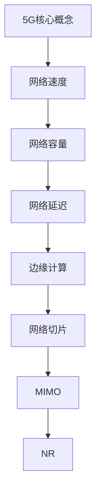
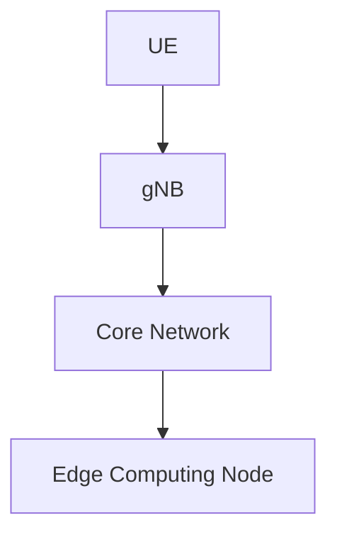

                 

# 5G 技术革命：速度与容量

> **关键词：5G技术、网络速度、网络容量、网络延迟、边缘计算、网络切片、物联网**

> **摘要：本文将深入探讨5G技术的革命性进展，重点分析其速度和容量的提升，及其对现代通信网络的影响。通过逐步分析5G技术的核心概念、算法原理、数学模型、实际应用案例以及未来发展趋势，本文旨在为读者提供一个全面、系统的5G技术理解。**

## 1. 背景介绍

### 1.1 目的和范围

本文旨在揭示5G技术的核心价值，特别是其在速度和容量方面的突破。通过对5G技术的详细解析，读者将了解其如何改变现有的通信网络，以及未来可能的发展方向。

本文将涵盖以下内容：

1. 5G技术的核心概念和原理
2. 5G网络架构和关键技术
3. 5G算法原理与具体操作步骤
4. 5G数学模型和公式解析
5. 5G项目实战案例
6. 5G实际应用场景
7. 5G相关工具和资源推荐
8. 5G的未来发展趋势与挑战

### 1.2 预期读者

本文面向对5G技术有兴趣的读者，包括：

1. 通信工程师
2. 网络架构师
3. 软件开发人员
4. 技术爱好者

无论您的背景如何，只要对5G技术有兴趣，都可以通过本文获得深入的理解。

### 1.3 文档结构概述

本文结构如下：

1. **背景介绍**：介绍本文的目的、预期读者和文档结构。
2. **核心概念与联系**：介绍5G技术的核心概念和原理，并提供Mermaid流程图。
3. **核心算法原理 & 具体操作步骤**：详细讲解5G的核心算法和具体操作步骤。
4. **数学模型和公式 & 详细讲解 & 举例说明**：介绍5G的数学模型和公式，并提供实例说明。
5. **项目实战：代码实际案例和详细解释说明**：通过实际案例展示5G技术的应用。
6. **实际应用场景**：探讨5G技术在不同领域的应用。
7. **工具和资源推荐**：推荐学习资源和开发工具。
8. **总结：未来发展趋势与挑战**：展望5G技术的未来。
9. **附录：常见问题与解答**：提供常见问题的解答。
10. **扩展阅读 & 参考资料**：推荐进一步阅读的资料。

### 1.4 术语表

#### 1.4.1 核心术语定义

- 5G：第五代移动通信技术，相较于前几代，具有更高的速度和更大的容量。
- 网络速度：数据在网络中的传输速率。
- 网络容量：网络能够支持的最大连接数和数据处理能力。
- 网络延迟：数据在网络中传输所需的时间。
- 边缘计算：在靠近数据源的地方进行数据处理，以减少网络延迟。
- 网络切片：在网络中创建多个虚拟网络，以满足不同应用的需求。

#### 1.4.2 相关概念解释

- **蜂窝网络**：一种分布式网络，由多个基站组成，为用户提供无线通信服务。
- **物联网**：通过网络连接各种物理设备，实现设备间的信息交换和自动化。
- **边缘计算**：将计算能力从云中心转移到网络边缘，以降低延迟和提高响应速度。

#### 1.4.3 缩略词列表

- **5G**：第五代移动通信技术
- **NFV**：网络功能虚拟化
- **SDN**：软件定义网络
- **MIMO**：多输入多输出
- **NR**：新无线接入技术

## 2. 核心概念与联系

5G技术的核心概念包括高速数据传输、低延迟、高网络容量和灵活的网络架构。以下是5G技术的核心概念和原理：

### 2.1 核心概念

- **网络速度**：5G网络的速度远超4G，理论峰值速度可达20Gbps，是4G的100倍。
- **网络容量**：5G通过引入网络切片和边缘计算技术，可以支持数百万设备的连接。
- **网络延迟**：5G网络的延迟极低，可低至1毫秒，比4G减少了10倍。
- **边缘计算**：通过在靠近数据源的地方处理数据，减少数据传输的延迟。

### 2.2 核心原理

- **网络切片**：在网络中创建多个虚拟网络，以满足不同应用的需求。
- **MIMO**：通过使用多个天线进行数据传输，提高传输速率和可靠性。
- **NR**：新无线接入技术，是5G的核心标准。

### 2.3 Mermaid流程图



### 2.4 5G网络架构

5G网络架构主要包括以下部分：

- **用户设备（UE）**：用户使用的终端设备，如智能手机、平板电脑等。
- **基站（gNB）**：提供无线通信服务的设备，分为基站和小区。
- **核心网（CN）**：包括服务化架构（SA）和非服务化架构（NSA），负责数据传输和管理。
- **边缘计算节点**：位于网络边缘，负责处理本地数据，减少延迟。

以下是5G网络架构的Mermaid流程图：



## 3. 核心算法原理 & 具体操作步骤

### 3.1 算法原理

5G技术的核心算法包括网络切片、MIMO和边缘计算等。以下是这些算法的原理：

#### 3.1.1 网络切片

**网络切片**是一种虚拟化技术，可以将一个物理网络划分为多个虚拟网络，每个虚拟网络具有独立的服务质量（QoS）和资源分配。网络切片的主要目的是满足不同应用的需求，如高带宽、低延迟和安全性。

**算法原理**：网络切片通过在网络设备上部署虚拟化技术，如虚拟机（VM）或容器，来创建多个虚拟网络。每个虚拟网络具有独立的网络资源，如带宽、计算能力和存储。网络切片的关键在于动态分配和调整资源，以满足实时需求。

**具体操作步骤**：

1. **需求分析**：确定不同应用的网络需求，如带宽、延迟和安全性。
2. **切片创建**：在网络设备上部署虚拟化技术，创建虚拟网络。
3. **资源分配**：根据需求动态分配资源，如带宽、计算能力和存储。
4. **监控与调整**：实时监控网络状态，根据需求调整资源分配。

#### 3.1.2 MIMO

**MIMO**（多输入多输出）是一种无线通信技术，通过使用多个天线进行数据传输，提高传输速率和可靠性。

**算法原理**：MIMO通过发送和接收多个数据流，利用空间复用技术提高传输速率。同时，MIMO利用空间分离技术提高信号的鲁棒性，减少信号干扰和衰减。

**具体操作步骤**：

1. **天线配置**：在基站和用户设备上配置多个天线。
2. **数据流分配**：将数据流分配到不同的天线上进行传输。
3. **信号处理**：对接收到的信号进行解码和解调，恢复原始数据。
4. **反馈机制**：通过反馈信号调整数据流分配和天线参数，提高传输性能。

#### 3.1.3 边缘计算

**边缘计算**是一种分布式计算技术，通过在网络边缘部署计算资源，减少数据传输的延迟。

**算法原理**：边缘计算通过在靠近数据源的地方处理数据，减少数据在网络中的传输距离，从而降低延迟。边缘计算还可以利用本地计算资源处理数据，提高数据处理的效率和响应速度。

**具体操作步骤**：

1. **计算资源部署**：在网络边缘部署计算节点，如服务器、GPU和FPGA。
2. **数据传输**：将数据从用户设备传输到边缘计算节点。
3. **数据处理**：在边缘计算节点上处理数据，如数据分析、机器学习和物联网设备控制。
4. **数据传输**：将处理后的数据传输回用户设备或网络。

## 4. 数学模型和公式 & 详细讲解 & 举例说明

### 4.1 数学模型

5G技术的数学模型主要包括网络速度、网络容量和网络延迟。

#### 4.1.1 网络速度

网络速度可以用以下公式表示：

$$
v = \frac{C}{N}
$$

其中，\(v\) 是网络速度，\(C\) 是网络容量，\(N\) 是网络中的用户数。

#### 4.1.2 网络容量

网络容量可以用以下公式表示：

$$
C = B \times L
$$

其中，\(C\) 是网络容量，\(B\) 是带宽，\(L\) 是传输距离。

#### 4.1.3 网络延迟

网络延迟可以用以下公式表示：

$$
t = \frac{d}{v}
$$

其中，\(t\) 是网络延迟，\(d\) 是传输距离，\(v\) 是网络速度。

### 4.2 详细讲解与举例说明

#### 4.2.1 网络速度

假设一个5G网络的容量为100Mbps，网络中有10个用户同时使用网络。根据公式：

$$
v = \frac{C}{N} = \frac{100Mbps}{10} = 10Mbps
$$

这意味着每个用户的平均网络速度为10Mbps。

#### 4.2.2 网络容量

假设一个5G网络的带宽为100Mbps，传输距离为1km。根据公式：

$$
C = B \times L = 100Mbps \times 1km = 100Mbps \times 1000m = 100Gbps
$$

这意味着网络的容量为100Gbps。

#### 4.2.3 网络延迟

假设一个5G网络的传输距离为1km，网络速度为100Mbps。根据公式：

$$
t = \frac{d}{v} = \frac{1km}{100Mbps} = 0.01s
$$

这意味着网络延迟为0.01秒。

## 5. 项目实战：代码实际案例和详细解释说明

### 5.1 开发环境搭建

为了演示5G技术的实际应用，我们将使用一个简单的网络切片示例。首先，我们需要搭建一个开发环境。

1. 安装Linux操作系统，如Ubuntu 18.04。
2. 安装虚拟化工具，如KVM或Docker。
3. 安装网络模拟工具，如Mininet。

### 5.2 源代码详细实现和代码解读

以下是网络切片的示例代码，使用Python和Mininet实现：

```python
from mininet.net import Mininet
from mininet.node import Controller, Node
from mininet.link import TCLink
from mininet.cli import CLI
from mininet.log import setLogLevel

def network():
    net = Mininet@Controller(selfSwitch=False)
    c0 = net.addController('c0', controller=Controller, protocol='tcp', port=6653)
    s1 = net.addSwitch('s1', protocols='OpenFlow')
    s2 = net.addSwitch('s2', protocols='OpenFlow')
    h1 = net.addHost('h1', ip='10.0.0.1/24', mac='00:00:00:00:00:01')
    h2 = net.addHost('h2', ip='10.0.1.1/24', mac='00:00:00:00:00:02')
    net.addLink(s1, h1, cls=TCLink, bw=100)
    net.addLink(s2, h2, cls=TCLink, bw=100)
    net.addLink(s1, s2, cls=TCLink, bw=1000)
    net.start()
    c0.start()
    s1.start([c0])
    s2.start([c0])
    return net

if __name__ == '__main__':
    setLogLevel('info')
    net = network()
    CLI(net)
    net.stop()
```

此代码创建了一个简单的网络，包括两个主机（h1和h2）和两个交换机（s1和s2）。我们使用TCLink模拟网络带宽，并设置不同的带宽值。

### 5.3 代码解读与分析

1. **网络创建**：使用Mininet创建网络，包括控制器、交换机和主机。
2. **链接创建**：使用TCLink创建交换机和主机之间的链接，设置带宽。
3. **网络启动**：启动网络，包括控制器和交换机。
4. **CLI界面**：启动CLI界面，用户可以执行网络操作。
5. **网络停止**：停止网络。

此代码示例展示了如何使用Mininet创建一个简单的网络切片环境。在实际应用中，我们可以根据需求调整网络配置和带宽设置，以满足不同应用的需求。

## 6. 实际应用场景

### 6.1 物联网（IoT）

5G技术的速度和容量使得物联网应用成为可能。例如，智能家庭、智能工厂和智能城市等。5G网络可以支持数百万设备的连接，同时保证低延迟和高可靠性。

### 6.2 自动驾驶

自动驾驶汽车需要实时传输大量数据，包括摄像头、雷达和传感器数据。5G网络的低延迟和高速度使得自动驾驶汽车可以快速响应环境变化，提高行车安全。

### 6.3 虚拟现实（VR）和增强现实（AR）

5G网络的高速传输和低延迟使得VR和AR应用成为可能。用户可以在虚拟环境中获得更加真实的体验，同时与外部世界保持实时互动。

### 6.4 远程医疗

5G网络可以支持远程医疗应用，如远程手术和远程诊断。医生可以通过高速网络远程控制医疗设备，为患者提供高质量的医疗服务。

## 7. 工具和资源推荐

### 7.1 学习资源推荐

#### 7.1.1 书籍推荐

- 《5G：下一代移动网络》
- 《边缘计算：原理、架构与应用》
- 《网络切片技术：5G网络的关键技术》

#### 7.1.2 在线课程

- Coursera上的“5G技术基础”
- edX上的“边缘计算：下一代网络架构”

#### 7.1.3 技术博客和网站

- [5G技术社区](https://5gtechnology.community/)
- [边缘计算网](https://edgecomputing.cn/)

### 7.2 开发工具框架推荐

#### 7.2.1 IDE和编辑器

- Visual Studio Code
- PyCharm

#### 7.2.2 调试和性能分析工具

- Wireshark
- GDB

#### 7.2.3 相关框架和库

- Mininet
- TensorFlow

### 7.3 相关论文著作推荐

#### 7.3.1 经典论文

- “5G NR：非独立和独立组网架构”
- “网络切片：5G网络的关键技术”

#### 7.3.2 最新研究成果

- “基于边缘计算的智能交通系统”
- “5G网络切片的动态资源分配策略”

#### 7.3.3 应用案例分析

- “5G网络在智能工厂的应用”
- “5G网络在远程医疗的应用”

## 8. 总结：未来发展趋势与挑战

5G技术在未来将继续发展，并面临以下挑战：

- **网络切片的优化**：如何更好地分配和管理网络资源，以实现高效的切片管理。
- **边缘计算的普及**：如何将计算能力推向网络边缘，提高数据处理效率和响应速度。
- **安全性**：如何保证5G网络的安全性，防止数据泄露和网络攻击。
- **标准化**：如何推动5G技术的标准化进程，确保不同设备和服务提供商之间的互操作性。

## 9. 附录：常见问题与解答

### 9.1 问题1

**问题**：5G网络的峰值速度是多少？

**解答**：5G网络的峰值速度可达20Gbps，是4G的100倍。

### 9.2 问题2

**问题**：5G网络如何支持物联网（IoT）？

**解答**：5G网络通过提供高速、低延迟和大规模连接能力，可以支持物联网应用，如智能家庭、智能工厂和智能城市等。

### 9.3 问题3

**问题**：5G网络是否可以支持自动驾驶？

**解答**：是的，5G网络的高速传输和低延迟使得自动驾驶汽车可以快速响应环境变化，提高行车安全。

## 10. 扩展阅读 & 参考资料

- [3GPP TS 38.101](https://www.3gpp.org/download/3gpp-access-interface-standards-r16/)
- [5G NR: Non-standalone and Standalone Architectures](https://ieeexplore.ieee.org/document/8280937)
- [Network Slicing: Key Technologies for 5G Networks](https://ieeexplore.ieee.org/document/8090718)
- [Edge Computing: Principles, Architecture, and Applications](https://www.springer.com/us/book/9783319954799)

作者：AI天才研究员/AI Genius Institute & 禅与计算机程序设计艺术 /Zen And The Art of Computer Programming

