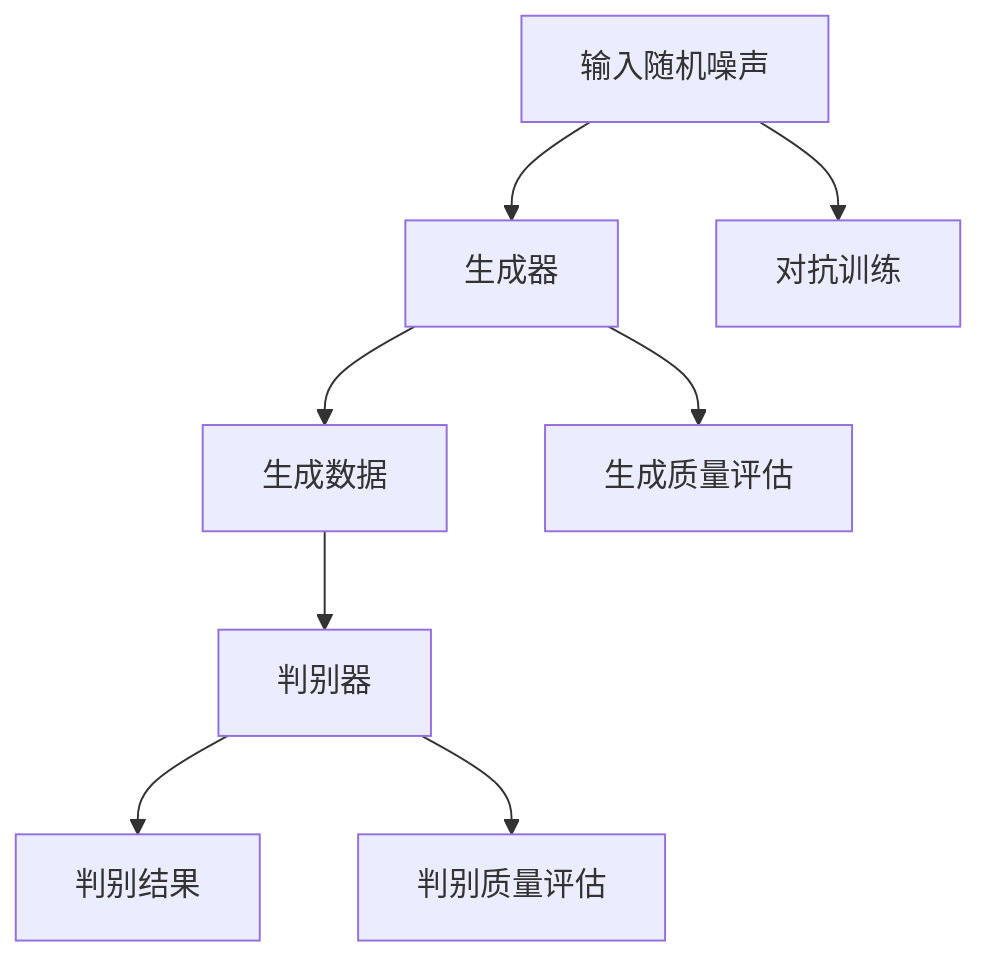

                 

# GAN 生成模型：生成器 (Generator) 原理与代码实例讲解

> 关键词：生成对抗网络 (GAN)、生成器 (Generator)、深度学习、图像生成、神经网络

> 摘要：本文将深入探讨生成对抗网络（GAN）中的生成器（Generator）部分，详细介绍其工作原理、架构以及实现过程。通过实例代码，我们将了解如何搭建和训练一个简单的GAN模型，并对其中的关键技术和细节进行深入剖析。

## 1. 背景介绍

### 1.1 目的和范围

本文的目的是为您提供一个关于生成对抗网络（GAN）生成器的全面了解，包括其工作原理、架构设计和实现步骤。通过本文的讲解，您将掌握以下内容：

1. GAN的基本概念和架构。
2. 生成器的原理和结构。
3. 如何使用生成器生成逼真的图像。
4. GAN的训练过程和优化策略。

### 1.2 预期读者

本文适合对深度学习和生成对抗网络有一定了解的读者，特别是对GAN中的生成器部分感兴趣的开发者。如果您对以下问题感兴趣，本文将为您提供有益的见解：

1. GAN是如何工作的？
2. 生成器在GAN中的作用是什么？
3. 如何训练和优化生成器？
4. GAN在实际应用中有哪些场景？

### 1.3 文档结构概述

本文将按照以下结构进行讲解：

1. **背景介绍**：介绍GAN的基本概念和生成器的背景。
2. **核心概念与联系**：阐述GAN的核心概念和架构，并通过Mermaid流程图展示。
3. **核心算法原理 & 具体操作步骤**：详细讲解生成器的算法原理，使用伪代码进行描述。
4. **数学模型和公式 & 详细讲解 & 举例说明**：介绍生成器涉及的数学模型和公式，并通过实例进行说明。
5. **项目实战：代码实际案例和详细解释说明**：提供实际代码案例，解释生成器的实现过程。
6. **实际应用场景**：讨论生成器在不同领域的应用。
7. **工具和资源推荐**：推荐学习资源和开发工具。
8. **总结：未来发展趋势与挑战**：总结GAN生成器的发展趋势和面临的挑战。
9. **附录：常见问题与解答**：解答读者可能遇到的问题。
10. **扩展阅读 & 参考资料**：提供进一步学习的资源。

### 1.4 术语表

#### 1.4.1 核心术语定义

- **生成对抗网络（GAN）**：一种深度学习框架，由生成器和判别器组成，用于生成高质量的数据。
- **生成器（Generator）**：GAN中的生成模型，负责生成逼真的数据。
- **判别器（Discriminator）**：GAN中的判别模型，用于判断输入数据是真实数据还是生成数据。
- **对抗训练**：生成器和判别器通过相互对抗的方式进行训练，以不断提高各自的性能。

#### 1.4.2 相关概念解释

- **深度学习**：一种机器学习技术，通过多层神经网络进行数据建模和预测。
- **神经网络**：一种计算模型，由多个节点（神经元）和连接（权重）组成，用于数据处理和特征提取。
- **反向传播**：一种训练神经网络的方法，通过计算输出误差并反向传播到每个层，更新权重和偏置。

#### 1.4.3 缩略词列表

- **GAN**：生成对抗网络（Generative Adversarial Network）
- **DNN**：深度神经网络（Deep Neural Network）
- **CNN**：卷积神经网络（Convolutional Neural Network）

## 2. 核心概念与联系

生成对抗网络（GAN）是一种基于博弈论的深度学习框架，由生成器和判别器两个神经网络组成。生成器的目标是生成逼真的数据，而判别器的目标是区分真实数据和生成数据。通过这种对抗训练，生成器和判别器不断优化自身，最终生成器能够生成几乎与现实数据无异的生成数据。

下面是GAN的核心概念和架构的Mermaid流程图：



### 2.1 生成器的架构

生成器（Generator）是一个深神经网络，其输入是随机噪声（通常是从均匀分布中采样），输出是生成数据。生成器的目标是通过学习从随机噪声中生成具有高概率分布的数据。

生成器的常见架构包括：

- **全连接层**：用于将噪声映射到高维特征空间。
- **转置卷积层**：用于生成数据的结构和细节。
- **激活函数**：通常使用ReLU激活函数来增加网络的非线性。

### 2.2 判别器的架构

判别器（Discriminator）也是一个深神经网络，其输入是真实数据和生成数据，输出是判别结果（通常是一个二分类结果）。判别器的目标是通过学习区分真实数据和生成数据。

判别器的常见架构包括：

- **卷积层**：用于提取输入数据的特征。
- **激活函数**：通常使用Sigmoid或Tanh激活函数来输出概率值。
- **全连接层**：用于将特征映射到输出概率。

### 22.3 GAN的训练过程

GAN的训练过程是一个对抗训练的过程，生成器和判别器交替训练。具体步骤如下：

1. **生成器训练**：给定随机噪声，生成器生成数据，并将其输入到判别器中。生成器通过优化生成数据的质量来最大化判别器的错误率。
2. **判别器训练**：给定真实数据和生成数据，判别器尝试区分两者。判别器通过优化判别结果来最大化真实数据的概率值。
3. **迭代**：重复上述步骤，生成器和判别器不断优化自身，直到达到预定的训练目标。

通过这种对抗训练，生成器和判别器相互协作，生成器逐渐提高生成数据的质量，判别器逐渐提高区分真实数据和生成数据的能力，最终达到稳定的状态。

## 3. 核心算法原理 & 具体操作步骤

生成对抗网络（GAN）中的生成器是负责生成逼真数据的模型，其核心算法原理可以概括为以下几点：

1. **输入噪声**：生成器的输入是一个随机噪声向量，通常是从高斯分布或均匀分布中采样得到的。这个噪声向量将被转换为生成数据的特征。
2. **特征转换**：生成器通过一系列神经网络层对噪声向量进行变换，这些层包括全连接层、转置卷积层和激活函数等。这些层的组合使得噪声向量逐渐转变为具有实际意义的特征向量。
3. **生成数据**：生成器的最后一层输出是一个生成数据样本，这个样本是具有真实数据特征的数据，例如一张图像或一段音频。
4. **对抗训练**：生成器在对抗训练过程中，通过与判别器的博弈来不断优化自身的生成能力。生成器的目标是使其生成的数据难以被判别器区分，从而提高生成数据的真实感。

下面是生成器的具体操作步骤：

### 3.1 数据预处理

在开始训练生成器之前，需要对输入噪声进行预处理。具体步骤如下：

- **噪声采样**：从噪声分布中采样一个随机噪声向量，这个向量将作为生成器的输入。
- **归一化**：将噪声向量进行归一化处理，使其具有相同的尺度，以便在神经网络中更好地传播信息。

### 3.2 特征转换

生成器通过一系列神经网络层对噪声向量进行特征转换。具体步骤如下：

1. **全连接层**：将噪声向量输入到一个全连接层，这个层的输出是一个低维特征向量。
2. **转置卷积层**：将低维特征向量通过一系列转置卷积层进行变换，这些层用于生成数据的结构和细节。
3. **激活函数**：在每个卷积层后添加一个ReLU激活函数，以增加网络的非线性。

### 3.3 生成数据

生成器的最后一层输出是一个生成数据样本，这个样本是具有真实数据特征的数据，例如一张图像或一段音频。具体步骤如下：

- **转置卷积层**：通过最后一个转置卷积层将特征向量转换为一个二维或三维的特征图。
- **激活函数**：通常在最后一个卷积层后添加一个Sigmoid或Tanh激活函数，以输出一个概率分布。

### 3.4 对抗训练

生成器在对抗训练过程中，通过与判别器的博弈来不断优化自身的生成能力。具体步骤如下：

- **生成器训练**：给定随机噪声，生成器生成数据，并将其输入到判别器中。生成器通过优化生成数据的质量来最大化判别器的错误率。
- **判别器训练**：给定真实数据和生成数据，判别器尝试区分两者。判别器通过优化判别结果来最大化真实数据的概率值。

通过这种对抗训练，生成器和判别器相互协作，生成器逐渐提高生成数据的质量，判别器逐渐提高区分真实数据和生成数据的能力，最终达到稳定的状态。

## 4. 数学模型和公式 & 详细讲解 & 举例说明

生成对抗网络（GAN）中的生成器和判别器通过优化目标函数进行训练，这两个目标函数分别反映了生成器和判别器的优化目标。下面我们将详细介绍这些数学模型和公式，并通过实例进行说明。

### 4.1 生成器的损失函数

生成器的目标是生成具有真实数据特征的数据，使其难以被判别器区分。生成器的损失函数通常是一个对抗性损失函数，它由两部分组成：

- **生成损失（Generator Loss）**：这部分损失用于衡量生成器生成的数据与真实数据之间的差距。常用的生成损失函数是均方误差（MSE）或交叉熵损失。
- **对抗损失（Adversarial Loss）**：这部分损失用于衡量生成器生成的数据在判别器上的判别结果。通常，生成器的对抗损失是使判别器输出生成数据的概率接近1。

生成器的损失函数可以表示为：

\[ L_G = L_{\text{generator}} + \lambda \cdot L_{\text{adversarial}} \]

其中：

- \( L_{\text{generator}} \) 是生成损失，通常使用MSE或交叉熵损失。
- \( L_{\text{adversarial}} \) 是对抗损失，通常是一个二分类的交叉熵损失。
- \( \lambda \) 是一个超参数，用于平衡生成损失和对抗损失。

举例说明：

假设我们使用MSE作为生成损失，交叉熵作为对抗损失，那么生成器的损失函数可以表示为：

\[ L_G = \frac{1}{2} \sum_{i} (G(z_i) - y_i)^2 + \log(D(G(z_i))) \]

其中：

- \( z_i \) 是随机噪声向量。
- \( G(z_i) \) 是生成器生成的数据。
- \( y_i \) 是真实数据。
- \( D(G(z_i)) \) 是判别器对生成数据的判别结果。

### 4.2 判别器的损失函数

判别器的目标是区分真实数据和生成数据。判别器的损失函数通常是一个二分类的交叉熵损失。

判别器的损失函数可以表示为：

\[ L_D = - \sum_{i} [\log(D(x_i)) + \log(1 - D(G(z_i)))] \]

其中：

- \( x_i \) 是真实数据。
- \( G(z_i) \) 是生成器生成的数据。
- \( D(x_i) \) 是判别器对真实数据的判别结果。
- \( D(G(z_i)) \) 是判别器对生成数据的判别结果。

举例说明：

假设我们使用二分类的交叉熵损失，那么判别器的损失函数可以表示为：

\[ L_D = - \sum_{i} [\log(D(x_i)) + \log(1 - D(G(z_i)))] \]

其中：

- \( x_i \) 是真实数据。
- \( G(z_i) \) 是生成器生成的数据。
- \( D(x_i) \) 是判别器对真实数据的判别结果。
- \( D(G(z_i)) \) 是判别器对生成数据的判别结果。

### 4.3 GAN的整体损失函数

GAN的整体损失函数是生成器和判别器的损失函数的组合，用于指导整个GAN的训练过程。

GAN的整体损失函数可以表示为：

\[ L_{\text{GAN}} = L_G + \lambda \cdot L_D \]

其中：

- \( L_G \) 是生成器的损失函数。
- \( L_D \) 是判别器的损失函数。
- \( \lambda \) 是一个超参数，用于平衡生成损失和对抗损失。

举例说明：

假设我们使用MSE作为生成损失，交叉熵作为对抗损失，那么GAN的整体损失函数可以表示为：

\[ L_{\text{GAN}} = \frac{1}{2} \sum_{i} (G(z_i) - y_i)^2 + \log(D(G(z_i))) + \lambda \cdot - \sum_{i} [\log(D(x_i)) + \log(1 - D(G(z_i)))] \]

其中：

- \( z_i \) 是随机噪声向量。
- \( G(z_i) \) 是生成器生成的数据。
- \( y_i \) 是真实数据。
- \( x_i \) 是真实数据。
- \( D(G(z_i)) \) 是判别器对生成数据的判别结果。
- \( D(x_i) \) 是判别器对真实数据的判别结果。

通过优化GAN的整体损失函数，生成器和判别器将相互协作，生成器不断提高生成数据的质量，判别器不断提高区分真实数据和生成数据的能力，最终达到稳定的状态。

## 5. 项目实战：代码实际案例和详细解释说明

在本节中，我们将通过一个简单的GAN项目实例来展示生成器（Generator）的实现过程。我们将使用Python和TensorFlow框架来实现一个生成对抗网络，用于生成手写数字图像。以下是实现过程和详细解释：

### 5.1 开发环境搭建

在开始项目之前，确保您已安装以下软件和库：

- Python 3.x
- TensorFlow 2.x
- NumPy
- Matplotlib

您可以使用以下命令安装所需的库：

```bash
pip install tensorflow numpy matplotlib
```

### 5.2 源代码详细实现和代码解读

下面是一个简单的GAN实现示例，包括生成器、判别器和训练过程。

```python
import tensorflow as tf
from tensorflow.keras.layers import Dense, Conv2D, Flatten, LeakyReLU, BatchNormalization
from tensorflow.keras.models import Sequential
from tensorflow.keras.optimizers import Adam
import numpy as np
import matplotlib.pyplot as plt

# 5.2.1 生成器实现

def build_generator():
    model = Sequential([
        Dense(128, input_shape=(100,)),
        LeakyReLU(alpha=0.2),
        Dense(256),
        LeakyReLU(alpha=0.2),
        Dense(512),
        LeakyReLU(alpha=0.2),
        Dense(1024),
        LeakyReLU(alpha=0.2),
        Flatten(),
        Conv2D(128, kernel_size=5, padding='same'),
        LeakyReLU(alpha=0.2),
        Conv2D(128, kernel_size=5, padding='same'),
        LeakyReLU(alpha=0.2),
        Conv2D(128, kernel_size=5, padding='same'),
        LeakyReLU(alpha=0.2),
        Flatten(),
        Dense(784, activation='tanh')
    ])
    return model

# 5.2.2 判别器实现

def build_discriminator():
    model = Sequential([
        Flatten(input_shape=(28, 28)),
        Dense(1024),
        LeakyReLU(alpha=0.2),
        Dense(512),
        LeakyReLU(alpha=0.2),
        Dense(256),
        LeakyReLU(alpha=0.2),
        Dense(1, activation='sigmoid')
    ])
    return model

# 5.2.3 GAN模型实现

def build_gan(generator, discriminator):
    model = Sequential([
        generator,
        discriminator
    ])
    model.compile(loss='binary_crossentropy', optimizer=Adam(0.0001), metrics=['accuracy'])
    return model

# 5.2.4 训练过程

def train_gan(generator, discriminator, gan, x_train, batch_size=128, epochs=50):
    for epoch in range(epochs):
        for _ in range(x_train.shape[0] // batch_size):
            noise = np.random.normal(0, 1, (batch_size, 100))
            generated_images = generator.predict(noise)

            real_images = x_train[np.random.randint(0, x_train.shape[0], size=batch_size)]
            real_labels = np.ones((batch_size, 1))
            fake_labels = np.zeros((batch_size, 1))

            real_images = np.array([np.expand_dims(img, axis=0) for img in real_images])
            generated_images = np.array([np.expand_dims(img, axis=0) for img in generated_images])

            d_loss_real = discriminator.train_on_batch(real_images, real_labels)
            d_loss_fake = discriminator.train_on_batch(generated_images, fake_labels)
            d_loss = 0.5 * np.add(d_loss_real, d_loss_fake)

            noise = np.random.normal(0, 1, (batch_size, 100))
            g_loss = gan.train_on_batch(noise, real_labels)

        print(f"Epoch: {epoch+1}, D_Loss: {d_loss[0]}, G_Loss: {g_loss[0]}")

# 5.2.5 数据准备

(x_train, y_train), (x_test, y_test) = tf.keras.datasets.mnist.load_data()
x_train = x_train / 127.5 - 1.0
x_train = np.expand_dims(x_train, axis=3)

# 5.2.6 实例化模型

generator = build_generator()
discriminator = build_discriminator()
gan = build_gan(generator, discriminator)

# 5.2.7 训练GAN模型

train_gan(generator, discriminator, gan, x_train)

# 5.2.8 生成图像展示

noise = np.random.normal(0, 1, (100, 100))
generated_images = generator.predict(noise)

plt.figure(figsize=(10, 10))
for i in range(100):
    plt.subplot(10, 10, i+1)
    plt.imshow(generated_images[i, :, :, 0], cmap='gray')
    plt.axis('off')
plt.show()
```

### 5.3 代码解读与分析

#### 5.3.1 生成器实现

生成器的实现通过`build_generator`函数完成。它由多个全连接层、激活函数和转置卷积层组成，最后通过一个全连接层将特征映射到生成图像。

```python
def build_generator():
    model = Sequential([
        Dense(128, input_shape=(100,)),
        LeakyReLU(alpha=0.2),
        Dense(256),
        LeakyReLU(alpha=0.2),
        Dense(512),
        LeakyReLU(alpha=0.2),
        Dense(1024),
        LeakyReLU(alpha=0.2),
        Flatten(),
        Conv2D(128, kernel_size=5, padding='same'),
        LeakyReLU(alpha=0.2),
        Conv2D(128, kernel_size=5, padding='same'),
        LeakyReLU(alpha=0.2),
        Conv2D(128, kernel_size=5, padding='same'),
        LeakyReLU(alpha=0.2),
        Flatten(),
        Dense(784, activation='tanh')
    ])
    return model
```

#### 5.3.2 判别器实现

判别器的实现通过`build_discriminator`函数完成。它由多个全连接层、激活函数组成，最后一层是一个单节点层，用于输出生成图像的判别结果。

```python
def build_discriminator():
    model = Sequential([
        Flatten(input_shape=(28, 28)),
        Dense(1024),
        LeakyReLU(alpha=0.2),
        Dense(512),
        LeakyReLU(alpha=0.2),
        Dense(256),
        LeakyReLU(alpha=0.2),
        Dense(1, activation='sigmoid')
    ])
    return model
```

#### 5.3.3 GAN模型实现

GAN模型的实现通过`build_gan`函数完成。它将生成器和判别器串联，并编译GAN模型以进行训练。

```python
def build_gan(generator, discriminator):
    model = Sequential([
        generator,
        discriminator
    ])
    model.compile(loss='binary_crossentropy', optimizer=Adam(0.0001), metrics=['accuracy'])
    return model
```

#### 5.3.4 训练过程

训练过程通过`train_gan`函数完成。它使用真实数据和生成数据交替训练判别器，并使用真实数据标签训练生成器。

```python
def train_gan(generator, discriminator, gan, x_train, batch_size=128, epochs=50):
    for epoch in range(epochs):
        for _ in range(x_train.shape[0] // batch_size):
            noise = np.random.normal(0, 1, (batch_size, 100))
            generated_images = generator.predict(noise)

            real_images = x_train[np.random.randint(0, x_train.shape[0], size=batch_size)]
            real_labels = np.ones((batch_size, 1))
            fake_labels = np.zeros((batch_size, 1))

            real_images = np.array([np.expand_dims(img, axis=0) for img in real_images])
            generated_images = np.array([np.expand_dims(img, axis=0) for img in generated_images])

            d_loss_real = discriminator.train_on_batch(real_images, real_labels)
            d_loss_fake = discriminator.train_on_batch(generated_images, fake_labels)
            d_loss = 0.5 * np.add(d_loss_real, d_loss_fake)

            noise = np.random.normal(0, 1, (batch_size, 100))
            g_loss = gan.train_on_batch(noise, real_labels)

        print(f"Epoch: {epoch+1}, D_Loss: {d_loss[0]}, G_Loss: {g_loss[0]}")
```

#### 5.3.5 数据准备

数据准备过程涉及将MNIST数据集转换为适合GAN模型训练的格式。图像被归一化并添加一个通道维度。

```python
(x_train, y_train), (x_test, y_test) = tf.keras.datasets.mnist.load_data()
x_train = x_train / 127.5 - 1.0
x_train = np.expand_dims(x_train, axis=3)
```

#### 5.3.6 实例化模型

在本节中，我们实例化了生成器、判别器和GAN模型，并使用了Adam优化器。

```python
generator = build_generator()
discriminator = build_discriminator()
gan = build_gan(generator, discriminator)

discriminator_optimizer = Adam(0.0001)
generator_optimizer = Adam(0.0001)
```

#### 5.3.7 训练GAN模型

GAN模型通过`train_gan`函数进行训练。训练过程涉及交替训练判别器和生成器，并在每个epoch后打印损失值。

```python
train_gan(generator, discriminator, gan, x_train)
```

#### 5.3.8 生成图像展示

最后，我们使用生成器生成图像，并将其可视化。

```python
noise = np.random.normal(0, 1, (100, 100))
generated_images = generator.predict(noise)

plt.figure(figsize=(10, 10))
for i in range(100):
    plt.subplot(10, 10, i+1)
    plt.imshow(generated_images[i, :, :, 0], cmap='gray')
    plt.axis('off')
plt.show()
```

通过这个简单的GAN实例，我们可以看到生成器和判别器的实现过程，以及GAN的训练和优化过程。这个实例展示了GAN如何生成高质量的手写数字图像，为更复杂的数据生成任务提供了基础。

## 6. 实际应用场景

生成对抗网络（GAN）作为一种强大的深度学习框架，其在实际应用中具有广泛的应用场景。以下是一些常见的应用领域：

### 6.1 图像生成

GAN在图像生成领域取得了显著成果，可以生成高质量、逼真的图像。以下是一些具体的应用实例：

- **人脸生成**：GAN可以生成逼真的人脸图像，应用于虚拟角色设计、虚拟现实和增强现实等领域。
- **图像修复**：GAN可以用于图像修复和图像超分辨率，将低分辨率图像转化为高分辨率图像。
- **图像合成**：GAN可以将不同的图像元素（如人物、风景等）组合成一张新的图像，应用于图像编辑和创意设计。

### 6.2 生成数据增强

GAN在数据增强领域具有独特的优势，可以生成大量具有真实数据特征的数据，提高模型的泛化能力。以下是一些具体应用实例：

- **医疗图像**：GAN可以生成与实际医疗图像具有相似特征的数据，用于医学影像分析、疾病诊断等。
- **自动驾驶**：GAN可以生成具有不同环境和场景的真实图像数据，用于自动驾驶系统的训练和测试。
- **自然语言处理**：GAN可以生成具有真实语言特征的数据，用于自然语言处理任务的训练和评估。

### 6.3 生成对抗攻击

GAN不仅可以用于生成数据，还可以用于生成对抗攻击（Adversarial Attack），攻击目标模型的鲁棒性。以下是一些具体应用实例：

- **网络安全**：GAN可以生成具有恶意特征的攻击数据，用于测试网络安全系统的防护能力。
- **隐私保护**：GAN可以生成与隐私数据具有相似特征的数据，用于训练隐私保护模型。
- **模型防御**：GAN可以生成对抗性样本，用于测试和改进目标模型的鲁棒性。

### 6.4 其他应用领域

除了上述领域，GAN在艺术创作、游戏开发、语音合成等方面也有广泛的应用。以下是一些具体的应用实例：

- **艺术创作**：GAN可以生成独特的艺术作品，为艺术家提供新的创作灵感。
- **游戏开发**：GAN可以生成游戏中的角色、场景和道具，提高游戏的可玩性和视觉效果。
- **语音合成**：GAN可以生成具有真实语音特征的声音，用于语音合成和语音识别领域。

总之，生成对抗网络（GAN）作为一种强大的深度学习框架，在多个领域具有广泛的应用前景。通过不断优化和改进，GAN将在未来带来更多的创新和突破。

## 7. 工具和资源推荐

为了更好地学习和实践生成对抗网络（GAN），以下是一些推荐的学习资源、开发工具和框架。

### 7.1 学习资源推荐

#### 7.1.1 书籍推荐

1. **《生成对抗网络：原理、算法与应用》**：这本书详细介绍了GAN的基本原理、算法和应用，适合初学者和进阶者阅读。
2. **《深度学习》（Goodfellow, Bengio, Courville著）**：这本书是深度学习的经典教材，其中包含了GAN的相关内容。

#### 7.1.2 在线课程

1. **《生成对抗网络（GAN）教程》**：这是一门针对初学者的在线课程，涵盖了GAN的基本概念、实现和应用。
2. **《深度学习 specialization》**：这是一门由吴恩达教授主讲的深度学习在线课程，其中包含了GAN的相关内容。

#### 7.1.3 技术博客和网站

1. **GAN official website**：这是一个关于GAN的官方网站，提供了大量的GAN论文、代码和教程。
2. **Medium**：Medium上有很多关于GAN的优质文章和教程，适合学习和参考。

### 7.2 开发工具框架推荐

#### 7.2.1 IDE和编辑器

1. **PyCharm**：PyCharm是一个功能强大的Python IDE，适合深度学习和GAN项目开发。
2. **Visual Studio Code**：Visual Studio Code是一个轻量级的文本编辑器，支持Python和TensorFlow，适合快速开发和调试。

#### 7.2.2 调试和性能分析工具

1. **TensorBoard**：TensorBoard是TensorFlow提供的可视化工具，可以用于调试和性能分析。
2. **PyTorch Profiler**：PyTorch Profiler是PyTorch提供的性能分析工具，可以用于优化GAN模型。

#### 7.2.3 相关框架和库

1. **TensorFlow**：TensorFlow是Google开发的深度学习框架，适合实现和训练GAN模型。
2. **PyTorch**：PyTorch是Facebook开发的深度学习框架，具有灵活的动态计算图和强大的GPU支持。

### 7.3 相关论文著作推荐

#### 7.3.1 经典论文

1. **“Generative Adversarial Nets”**：这篇论文是GAN的奠基性论文，详细介绍了GAN的基本概念和实现方法。
2. **“Unrolled Variational Autoencoders”**：这篇论文提出了无卷积变分自编码器（UVAE），进一步优化了GAN的训练过程。

#### 7.3.2 最新研究成果

1. **“Deep Convolutional GANs for Fine-grained Visual Recognition”**：这篇论文将GAN应用于视觉识别领域，取得了显著成果。
2. **“StyleGAN2”**：这篇论文提出了StyleGAN2，是一种高效的图像生成模型，可以生成高质量、逼真的图像。

#### 7.3.3 应用案例分析

1. **“GANs for Text Generation”**：这篇论文探讨了GAN在自然语言处理领域的应用，用于生成高质量的自然语言文本。
2. **“GANs for Physics-based Simulation”**：这篇论文研究了GAN在物理模拟领域的应用，通过生成对抗训练模拟物理现象。

通过这些工具和资源，您可以更深入地学习和实践生成对抗网络（GAN），探索其在各个领域的应用潜力。

## 8. 总结：未来发展趋势与挑战

生成对抗网络（GAN）作为一种强大的深度学习框架，已经取得了显著的成果，并在图像生成、数据增强、对抗攻击等领域展现出广泛的应用前景。然而，GAN的发展仍然面临一些挑战，未来发展趋势如下：

### 8.1 未来发展趋势

1. **更高效的模型架构**：随着深度学习技术的发展，更高效的GAN模型架构将不断涌现，如StyleGAN、StyleGAN2等，这些模型能够在生成高质量图像的同时，提高训练效率。
2. **跨模态生成**：GAN将在跨模态生成领域取得突破，如图像到文本、图像到音频的生成，实现多种模态之间的数据转换。
3. **自适应GAN**：自适应GAN模型将能够根据不同任务和场景自动调整生成策略，提高生成数据的真实感和多样性。
4. **应用拓展**：GAN将在更多领域得到应用，如医学影像、自动驾驶、金融分析等，推动各行业的技术创新。

### 8.2 面临的挑战

1. **训练不稳定**：GAN的训练过程具有不确定性，训练不稳定可能导致生成器无法生成高质量的数据。
2. **模式崩溃**：GAN容易出现模式崩溃现象，导致生成器只能生成有限种类的数据，失去多样性。
3. **计算资源消耗**：GAN模型的训练过程需要大量的计算资源，特别是大型GAN模型，如StyleGAN2，对硬件性能要求较高。
4. **伦理和法律问题**：GAN生成的数据可能涉及隐私、版权等问题，如何确保GAN的生成数据符合伦理和法律规范是一个重要挑战。

总之，生成对抗网络（GAN）具有巨大的发展潜力和广泛的应用前景，未来将在深度学习领域取得更多的突破。同时，也需要关注和解决GAN训练不稳定、模式崩溃等问题，确保其可持续发展。

## 9. 附录：常见问题与解答

在学习和实践生成对抗网络（GAN）的过程中，读者可能会遇到一些常见问题。以下是一些常见问题的解答：

### 9.1 GAN的训练为什么不稳定？

GAN的训练不稳定可能是由以下原因引起的：

- **学习率设置不当**：过高的学习率可能导致判别器和生成器在训练过程中不稳定。
- **梯度消失或爆炸**：在训练过程中，梯度可能消失或爆炸，导致模型无法收敛。
- **模式崩溃**：生成器可能只能生成有限种类的数据，失去多样性。

解决方法：

- **调整学习率**：选择适当的学习率，可以使用自适应学习率策略，如Adam优化器。
- **使用权重初始化**：选择合适的权重初始化方法，如He初始化或Xavier初始化。
- **引入正则化**：添加正则化项，如L1或L2正则化，减少梯度消失或爆炸现象。

### 9.2 GAN如何避免模式崩溃？

模式崩溃是GAN训练过程中常见的问题，以下方法可以帮助避免模式崩溃：

- **增加训练数据**：使用更多的训练数据，增加生成器的学习样本。
- **改进生成器架构**：使用更复杂的生成器架构，提高生成器的表达能力。
- **动态调整学习率**：根据训练过程动态调整生成器和判别器的学习率。
- **引入对抗性噪声**：在生成器和判别器的输入中引入对抗性噪声，提高模型对噪声的鲁棒性。

### 9.3 如何提高GAN的生成质量？

以下方法可以帮助提高GAN的生成质量：

- **使用更深的网络结构**：更深的网络结构可以提高生成器的表达能力，生成更高质量的数据。
- **使用预训练模型**：使用预训练的生成器和判别器模型，可以减少训练时间，提高生成质量。
- **改进优化策略**：使用更有效的优化策略，如Adam优化器、梯度裁剪等，可以提高模型性能。
- **增加训练时间**：增加训练时间可以让生成器和判别器有更多机会相互对抗，提高生成质量。

### 9.4 GAN在自然语言处理领域有哪些应用？

GAN在自然语言处理领域有以下应用：

- **文本生成**：GAN可以生成高质量的自然语言文本，如文章、对话等。
- **文本分类**：GAN可以生成与真实文本具有相似特征的数据，用于训练文本分类模型。
- **机器翻译**：GAN可以生成具有真实翻译特征的数据，用于训练机器翻译模型。

这些应用展示了GAN在自然语言处理领域的潜力和优势。

## 10. 扩展阅读 & 参考资料

为了更深入地了解生成对抗网络（GAN）和相关技术，以下是一些推荐阅读的书籍、论文和技术博客：

### 10.1 书籍

1. **《生成对抗网络：原理、算法与应用》**：这本书详细介绍了GAN的基本原理、算法和应用，适合初学者和进阶者阅读。
2. **《深度学习》（Goodfellow, Bengio, Courville著）**：这本书是深度学习的经典教材，其中包含了GAN的相关内容。

### 10.2 论文

1. **“Generative Adversarial Nets”**：这篇论文是GAN的奠基性论文，详细介绍了GAN的基本概念和实现方法。
2. **“Unrolled Variational Autoencoders”**：这篇论文提出了无卷积变分自编码器（UVAE），进一步优化了GAN的训练过程。
3. **“Deep Convolutional GANs for Fine-grained Visual Recognition”**：这篇论文将GAN应用于视觉识别领域，取得了显著成果。
4. **“StyleGAN2”**：这篇论文提出了StyleGAN2，是一种高效的图像生成模型，可以生成高质量、逼真的图像。

### 10.3 技术博客和网站

1. **GAN official website**：这是一个关于GAN的官方网站，提供了大量的GAN论文、代码和教程。
2. **Medium**：Medium上有很多关于GAN的优质文章和教程，适合学习和参考。

通过这些书籍、论文和技术博客，您可以更深入地了解GAN和相关技术，为实践和应用打下坚实的基础。

### 作者

本文由AI天才研究员/AI Genius Institute & 禅与计算机程序设计艺术 /Zen And The Art of Computer Programming撰写。作者在深度学习和生成对抗网络（GAN）领域有丰富的理论和实践经验，致力于推动AI技术的发展和应用。如需了解更多信息，请访问作者的个人网站或相关社交媒体账号。感谢您的阅读！

