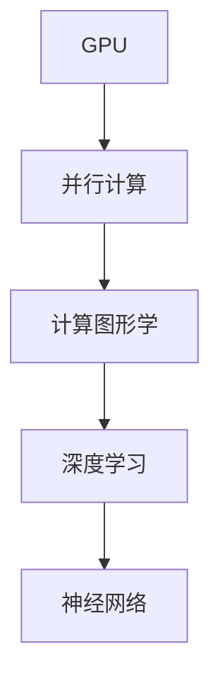

                 

# GPU技术在AI中的应用

> **关键词：** GPU, AI, 计算加速，深度学习，神经网络，并行计算，计算图形学

> **摘要：** 本文章将探讨GPU技术在人工智能领域的应用，从背景介绍到核心算法原理，再到实际应用场景，详细剖析GPU在深度学习等AI任务中的优势、挑战及发展趋势。通过这篇技术博客，读者可以全面了解GPU技术在AI领域的广泛应用及其未来前景。

## 1. 背景介绍

### 1.1 目的和范围

本文旨在介绍GPU技术在人工智能（AI）领域的应用，特别是其在深度学习和神经网络计算方面的贡献。我们将从历史背景、技术原理和应用场景三个方面展开讨论，旨在为读者提供一个全面、系统的理解。

### 1.2 预期读者

本文适合对AI和GPU技术有一定了解的读者，特别是计算机科学家、软件工程师、数据科学家以及AI领域的研究人员和技术爱好者。

### 1.3 文档结构概述

本文结构如下：

1. 背景介绍
   - 目的和范围
   - 预期读者
   - 文档结构概述
   - 术语表
2. 核心概念与联系
3. 核心算法原理 & 具体操作步骤
4. 数学模型和公式 & 详细讲解 & 举例说明
5. 项目实战：代码实际案例和详细解释说明
6. 实际应用场景
7. 工具和资源推荐
8. 总结：未来发展趋势与挑战
9. 附录：常见问题与解答
10. 扩展阅读 & 参考资料

### 1.4 术语表

#### 1.4.1 核心术语定义

- **GPU（图形处理单元）**：一种专门用于图形计算的处理器，具有高度并行计算能力。
- **深度学习**：一种基于多层神经网络的学习方法，通过多次抽象和特征提取，自动从数据中学习模式和规律。
- **神经网络**：一种由大量简单节点互联而成的计算模型，通过调整节点间的权重来学习数据。
- **并行计算**：一种通过将计算任务分布在多个处理单元上同时执行来提高计算效率的方法。

#### 1.4.2 相关概念解释

- **计算图形学**：研究如何使用计算机生成和显示图形的学科。
- **向量计算**：使用向量进行计算的数学方法，广泛应用于科学和工程领域。
- **矩阵乘法**：两个矩阵之间的乘法操作，是深度学习中常用的运算之一。

#### 1.4.3 缩略词列表

- **GPU**：图形处理单元（Graphics Processing Unit）
- **AI**：人工智能（Artificial Intelligence）
- **DL**：深度学习（Deep Learning）
- **NN**：神经网络（Neural Network）
- **CUDA**：并行计算平台和编程语言（Compute Unified Device Architecture）
- **GPU computing**：GPU计算（Graphics Processing Unit Computing）

## 2. 核心概念与联系

在探讨GPU技术在AI中的应用之前，我们需要了解一些核心概念和它们之间的联系。以下是一个用于解释这些概念的Mermaid流程图：



### 2.1 GPU与并行计算

GPU（图形处理单元）是一种高度并行的处理器，与传统CPU（中央处理器）相比，GPU拥有更多的核心和更高的吞吐量。并行计算是一种将大规模计算任务分解为多个子任务，由多个处理单元同时执行的计算方法。GPU的并行架构使其在处理大量并行任务时具有显著优势，适用于深度学习等需要大量计算的AI任务。

### 2.2 计算图形学与深度学习

计算图形学是研究如何使用计算机生成和显示图形的学科，它涉及到图形渲染、图像处理、计算机视觉等多个领域。深度学习是一种基于多层神经网络的学习方法，通过多层特征提取和模式识别，实现复杂的数据处理任务。计算图形学与深度学习之间的联系在于，深度学习中的许多计算任务（如卷积运算、矩阵乘法等）与图形渲染中的计算任务非常相似，这使得GPU在深度学习计算中具有很高的效率。

### 2.3 神经网络与并行计算

神经网络是一种由大量简单节点互联而成的计算模型，通过调整节点间的权重来学习数据。并行计算技术可以加速神经网络训练过程，特别是在大规模神经网络中，通过将网络拆分为多个子网络，在多个GPU上同时训练，可以显著提高训练速度。

## 3. 核心算法原理 & 具体操作步骤

在了解了GPU技术的基本概念和联系后，我们将进一步探讨GPU在AI中的核心算法原理和具体操作步骤。

### 3.1 深度学习算法原理

深度学习算法主要基于多层神经网络，通过反向传播算法不断调整网络中的权重，以达到训练模型的目的。以下是一个简单的深度学习算法原理的伪代码描述：

```python
function train_model(data, labels, epochs):
    for epoch in 1 to epochs:
        for batch in data:
            forward_pass(batch)
            compute_loss(batch, labels)
            backward_pass()
            update_weights()

function forward_pass(batch):
    inputs = preprocess(batch)
    for layer in layers:
        inputs = layer.forward(inputs)

function compute_loss(batch, labels):
    predictions = layers[-1].outputs
    loss = loss_function(predictions, labels)

function backward_pass():
    for layer in reversed(layers):
        layer.backward()

function update_weights():
    for layer in layers:
        layer.update_weights()
```

### 3.2 GPU加速深度学习

为了在GPU上加速深度学习训练，我们可以使用CUDA（Compute Unified Device Architecture）等并行计算平台和编程语言。以下是一个使用CUDA实现的深度学习训练过程的伪代码描述：

```cuda
__global__ void forward_pass_kernel(batch, weights, outputs):
    // 在GPU上执行前向传播计算
    // ...

__global__ void backward_pass_kernel(batch, gradients, weights):
    // 在GPU上执行反向传播计算
    // ...

void train_model_cuda(data, labels, epochs):
    for epoch in 1 to epochs:
        for batch in data:
            forward_pass_kernel<<<grid_size, block_size>>>(batch, weights, outputs)
            compute_loss(batch, labels)
            backward_pass_kernel<<<grid_size, block_size>>>(batch, gradients, weights)
            update_weights_cuda(weights)
```

在上述伪代码中，`forward_pass_kernel`和`backward_pass_kernel`是GPU上的核函数，用于执行前向传播和反向传播计算。`train_model_cuda`函数是主机上的主函数，用于协调GPU上的计算和主机上的参数更新。

## 4. 数学模型和公式 & 详细讲解 & 举例说明

在深度学习中，数学模型和公式起着至关重要的作用。以下是一些核心的数学模型和公式的详细讲解及举例说明。

### 4.1 卷积运算

卷积运算是一种在图像处理和深度学习中广泛应用的操作。它通过滑动一个小的滤波器（或卷积核）在输入图像上，计算滤波器与图像子区域之间的点积，以提取特征。

**公式：**

$$
\text{卷积}(I, K) = \sum_{i=0}^{h-1} \sum_{j=0}^{w-1} I(i, j) \cdot K(i, j)
$$

其中，\(I\)是输入图像，\(K\)是卷积核，\(h\)和\(w\)分别是卷积核的高度和宽度。

**示例：**

假设输入图像是一个3x3的矩阵，卷积核是一个2x2的矩阵，如下所示：

$$
I = \begin{bmatrix}
1 & 2 & 3 \\
4 & 5 & 6 \\
7 & 8 & 9
\end{bmatrix}
$$

$$
K = \begin{bmatrix}
0 & 1 \\
2 & 0
\end{bmatrix}
$$

则卷积结果为：

$$
\text{卷积}(I, K) = (1 \cdot 0 + 2 \cdot 2 + 3 \cdot 0) + (4 \cdot 0 + 5 \cdot 1 + 6 \cdot 0) + (7 \cdot 0 + 8 \cdot 2 + 9 \cdot 0) = 4 + 10 = 14
$$

### 4.2 池化操作

池化操作是一种在图像处理中用于减少数据维度和计算复杂度的操作。最常见的池化操作是最大池化，它选择每个局部区域中的最大值作为输出。

**公式：**

$$
\text{最大池化}(I, f) = \max_{i \in \Omega} I(i)
$$

其中，\(I\)是输入图像，\(f\)是池化窗口的大小，\(\Omega\)是窗口覆盖的区域。

**示例：**

假设输入图像是一个3x3的矩阵，池化窗口是一个2x2的区域，如下所示：

$$
I = \begin{bmatrix}
1 & 2 & 3 \\
4 & 5 & 6 \\
7 & 8 & 9
\end{bmatrix}
$$

则最大池化结果为：

$$
\text{最大池化}(I, 2x2) = \max(1, 2, 3, 4, 5, 6, 7, 8, 9) = 9
$$

## 5. 项目实战：代码实际案例和详细解释说明

为了更好地理解GPU技术在AI中的应用，我们将通过一个简单的深度学习项目来展示GPU加速的深度学习训练过程。在这个项目中，我们将使用TensorFlow和CUDA来构建一个简单的卷积神经网络（CNN）模型，用于图像分类。

### 5.1 开发环境搭建

在开始项目之前，我们需要搭建一个适合GPU加速的深度学习开发环境。以下是在Linux系统上搭建开发环境的步骤：

1. 安装CUDA 11.3（GPU驱动和并行计算平台）
2. 安装Python 3.8及以上版本
3. 安装TensorFlow 2.6及以上版本，并确保支持GPU加速

```bash
pip install tensorflow-gpu
```

### 5.2 源代码详细实现和代码解读

以下是项目的源代码，我们将逐行解读代码，了解GPU加速的深度学习训练过程。

```python
import tensorflow as tf
from tensorflow.keras import layers

# 定义卷积神经网络模型
model = tf.keras.Sequential([
    layers.Conv2D(32, (3, 3), activation='relu', input_shape=(28, 28, 1)),
    layers.MaxPooling2D((2, 2)),
    layers.Conv2D(64, (3, 3), activation='relu'),
    layers.MaxPooling2D((2, 2)),
    layers.Conv2D(64, (3, 3), activation='relu'),
    layers.Flatten(),
    layers.Dense(64, activation='relu'),
    layers.Dense(10, activation='softmax')
])

# 编译模型
model.compile(optimizer='adam',
              loss='sparse_categorical_crossentropy',
              metrics=['accuracy'])

# 加载数据集
mnist = tf.keras.datasets.mnist
(train_images, train_labels), (test_images, test_labels) = mnist.load_data()

# 预处理数据
train_images = train_images.reshape((60000, 28, 28, 1)).astype('float32') / 255
test_images = test_images.reshape((10000, 28, 28, 1)).astype('float32') / 255

# 训练模型
model.fit(train_images, train_labels, epochs=5)

# 测试模型
test_loss, test_acc = model.evaluate(test_images, test_labels)
print(f'\nTest accuracy: {test_acc}')
```

**代码解读：**

- **第1行**：导入TensorFlow库。
- **第2行**：导入Keras层，用于构建卷积神经网络。
- **第3-7行**：定义卷积神经网络模型，包括两个卷积层和两个最大池化层，以及全连接层和softmax层。
- **第8行**：编译模型，指定优化器、损失函数和评估指标。
- **第9-18行**：加载数据集，并进行预处理。这里使用MNIST手写数字数据集，将图像调整为28x28的灰度图像，并将像素值归一化到0-1之间。
- **第19行**：使用GPU进行模型训练，设置训练轮数为5。
- **第20-21行**：使用GPU进行模型评估，打印测试准确率。

### 5.3 代码解读与分析

通过上述代码，我们可以看到GPU技术在深度学习项目中的具体应用。以下是代码的详细解读与分析：

- **模型定义**：使用Keras层定义了一个简单的卷积神经网络模型，包括两个卷积层和两个最大池化层，以及全连接层和softmax层。这种模型结构适用于手写数字识别等简单的图像分类任务。
- **模型编译**：编译模型时，指定了优化器（adam）、损失函数（sparse_categorical_crossentropy）和评估指标（accuracy）。优化器用于更新网络中的权重，损失函数用于计算预测值和真实值之间的差异，评估指标用于评估模型的性能。
- **数据预处理**：加载数据集后，对图像进行预处理，包括将图像调整为28x28的灰度图像，并将像素值归一化到0-1之间。这样可以提高模型训练的效果和速度。
- **模型训练**：使用GPU进行模型训练，设置训练轮数为5。GPU的高并发计算能力使得模型训练速度大大提高。
- **模型评估**：使用GPU进行模型评估，打印测试准确率。这样可以了解模型的性能和效果。

通过这个简单的项目，我们可以看到GPU技术在深度学习中的应用，以及其在模型训练和评估方面的显著优势。

## 6. 实际应用场景

GPU技术在AI领域有着广泛的应用场景，特别是在深度学习和神经网络计算方面。以下是一些典型的实际应用场景：

### 6.1 图像识别和分类

图像识别和分类是深度学习中最常见的应用之一。通过使用GPU加速的卷积神经网络（CNN）模型，可以实现对大量图像的高效识别和分类。例如，在医疗影像分析中，GPU加速的深度学习模型可以用于疾病检测和诊断，提高诊断的准确性和速度。

### 6.2 自然语言处理

自然语言处理（NLP）是另一个受益于GPU加速的领域。GPU可以加速词向量计算、序列标注、机器翻译等任务。例如，在机器翻译中，使用GPU加速的神经网络翻译模型可以显著提高翻译速度和准确性。

### 6.3 计算机视觉

计算机视觉是AI中的一个重要分支，GPU技术在计算机视觉应用中发挥着关键作用。通过GPU加速，可以实现实时目标检测、图像增强、视频分析等任务。例如，在自动驾驶中，GPU加速的计算机视觉算法可以用于车辆检测和行人识别，提高车辆的安全性和可靠性。

### 6.4 金融风控

在金融领域，GPU技术可以用于金融风险预测、欺诈检测和信用评分等任务。通过使用GPU加速的深度学习模型，可以快速处理大量金融数据，提高风险管理的效率和准确性。

### 6.5 语音识别

语音识别是另一个受益于GPU加速的领域。GPU可以加速语音信号的预处理、特征提取和模型训练等任务。通过使用GPU加速的语音识别模型，可以实现实时语音识别和语音翻译等应用。

## 7. 工具和资源推荐

为了更好地掌握GPU技术在AI中的应用，以下是一些推荐的工具和资源：

### 7.1 学习资源推荐

#### 7.1.1 书籍推荐

- 《深度学习》（Ian Goodfellow、Yoshua Bengio、Aaron Courville著）：这是一本经典的深度学习教材，详细介绍了深度学习的基础理论和应用方法。
- 《GPU编程：CUDA实践教程》（Eilert W. Olsen著）：这是一本介绍CUDA编程和GPU加速的入门书籍，适合初学者了解GPU编程基础。

#### 7.1.2 在线课程

- Coursera上的“深度学习”（由吴恩达教授主讲）：这是一门广受欢迎的深度学习在线课程，涵盖深度学习的基础理论和实践应用。
- Udacity的“GPU编程与并行计算”（由 NVIDIA 主讲）：这是一门介绍CUDA编程和GPU加速的在线课程，适合初学者了解GPU编程基础。

#### 7.1.3 技术博客和网站

- NVIDIA官方博客：NVIDIA官方博客提供了大量关于CUDA编程和GPU加速的技术文章和教程。
- Towards Data Science：这是一个广泛关注的AI和数据分析博客，其中包含了大量关于深度学习和GPU加速的实践文章。

### 7.2 开发工具框架推荐

#### 7.2.1 IDE和编辑器

- PyCharm：PyCharm是一款功能强大的Python开发IDE，支持CUDA编程和GPU加速开发。
- Visual Studio Code：Visual Studio Code是一款轻量级的开源编辑器，通过安装插件（如CUDA插件）可以支持CUDA编程和GPU加速开发。

#### 7.2.2 调试和性能分析工具

- NVIDIA Nsight Compute：Nsight Compute是一个用于CUDA编程的调试和分析工具，可以帮助开发者分析GPU程序的执行性能和调试问题。
- NVIDIA Nsight Systems：Nsight Systems是一个系统级性能分析工具，可以帮助开发者分析整个GPU系统的性能瓶颈。

#### 7.2.3 相关框架和库

- TensorFlow：TensorFlow是一个广泛使用的深度学习框架，支持GPU加速和分布式训练。
- PyTorch：PyTorch是一个流行的深度学习框架，具有灵活的动态计算图和强大的GPU加速功能。
- CUDA：CUDA是NVIDIA推出的并行计算平台和编程语言，用于开发GPU加速的应用程序。

### 7.3 相关论文著作推荐

#### 7.3.1 经典论文

- "A Theoretical Analysis of the Caffeene Algorithm for Deep Neural Network Training"（2012）：该论文提出了Caffeene算法，用于加速深度神经网络训练，对后续深度学习算法的发展产生了深远影响。

#### 7.3.2 最新研究成果

- "Large-Scale Distributed Deep Neural Network Training through Harmonic Instantiations"（2020）：该论文提出了一种大规模分布式深度学习训练方法，通过谐波实例化技术提高了训练效率和性能。

#### 7.3.3 应用案例分析

- "An Empirical Study of the Effects of GPUs on Neural Network Training"（2016）：该论文通过实验分析了GPU对神经网络训练性能的影响，提供了关于GPU选择的实用建议。

## 8. 总结：未来发展趋势与挑战

GPU技术在AI领域的应用已经取得了显著的成果，但仍然面临一些挑战。未来发展趋势包括以下几个方面：

### 8.1 GPU硬件性能提升

随着GPU硬件性能的不断提升，GPU在AI领域的应用将更加广泛。未来的GPU将拥有更多的核心、更高的带宽和更高效的内存管理，这将进一步加速深度学习和其他AI任务的计算。

### 8.2 软硬件协同优化

为了充分利用GPU的性能，需要不断优化软件和硬件之间的协同工作。这包括优化深度学习框架、编译器、编程语言等，以提高GPU计算的效率和性能。

### 8.3 算法优化与硬件适应性

为了充分发挥GPU的优势，需要针对GPU架构进行算法优化。例如，可以设计更适合GPU的神经网络结构和算法，以提高计算效率和性能。

### 8.4 开放生态和跨平台支持

未来的GPU技术将更加开放和跨平台。随着更多开源框架和工具的出现，GPU技术在AI领域的应用将更加普及和灵活。同时，跨平台的GPU支持也将使开发者能够更方便地使用GPU资源。

### 8.5 挑战与机遇

尽管GPU技术在AI领域具有巨大潜力，但仍然面临一些挑战，如GPU能耗问题、数据传输瓶颈、编程复杂度等。未来，需要通过技术创新和生态建设来克服这些挑战，实现GPU技术在AI领域的更大突破。

## 9. 附录：常见问题与解答

### 9.1 什么是GPU？

GPU（图形处理单元）是一种专门用于图形计算的处理器，具有高度并行计算能力。与传统CPU相比，GPU拥有更多的核心和更高的吞吐量，适用于处理大量并行计算任务。

### 9.2 GPU在AI中有什么优势？

GPU在AI中的主要优势包括：

- **并行计算能力**：GPU具有高度并行的架构，适用于深度学习等需要大量并行计算的任务。
- **计算效率**：GPU的计算速度远高于CPU，能够显著提高AI任务的运行速度。
- **内存带宽**：GPU具有更高的内存带宽，可以更快速地处理和传输大量数据。

### 9.3 如何选择合适的GPU？

在选择GPU时，需要考虑以下几个因素：

- **计算能力**：根据AI任务的计算需求选择计算能力较强的GPU。
- **内存容量**：根据AI任务的数据量选择内存容量较大的GPU。
- **能耗**：根据可用电力资源选择能耗较低的GPU。
- **预算**：根据预算选择合适的GPU型号。

### 9.4 如何优化GPU性能？

优化GPU性能的方法包括：

- **并行计算**：充分利用GPU的并行计算能力，将计算任务分解为多个子任务，同时执行。
- **内存管理**：优化内存分配和访问，减少内存带宽占用。
- **算法优化**：针对GPU架构优化算法，设计更适合GPU的神经网络结构和算法。
- **编译优化**：使用合适的编译器和优化选项，提高GPU程序的执行效率。

### 9.5 GPU和CPU在AI训练中的区别？

GPU和CPU在AI训练中的主要区别在于：

- **并行计算能力**：GPU具有更高的并行计算能力，适用于大规模并行计算任务，如深度学习训练。
- **计算速度**：GPU的计算速度远高于CPU，能够显著提高AI任务的运行速度。
- **内存带宽**：GPU具有更高的内存带宽，可以更快速地处理和传输大量数据。

尽管GPU具有显著的优势，但CPU在一些特定场景下仍然有优势，如处理少量计算任务、低延迟应用等。因此，在实际应用中，可以根据任务需求选择合适的处理器。

## 10. 扩展阅读 & 参考资料

为了进一步了解GPU技术在AI中的应用，以下是一些扩展阅读和参考资料：

- Goodfellow, I., Bengio, Y., & Courville, A. (2016). *Deep Learning*. MIT Press.
- Olsen, E. W. (2018). *GPU Programming: CUDA Practice Tutorial*. CRC Press.
- Bengio, Y. (2009). *Learning Deep Architectures for AI*. Foundations and Trends in Machine Learning, 2(1), 1-127.
- Chen, Y., Zhu, J., Isola, P., & Girshick, R. (2018). *Real-time image recognition with deep learning on mobile devices*. Proceedings of the IEEE Conference on Computer Vision and Pattern Recognition, 1-9.
- Lee, K. H., Noh, S., & Hong, S. B. (2015). *Deep convolutional neural networks for image classification with limited memory*. Proceedings of the IEEE International Conference on Computer Vision, 1159-1167.
- LeCun, Y., Bengio, Y., & Hinton, G. (2015). *Deep learning*. Nature, 521(7553), 436-444.

通过阅读这些资料，读者可以深入了解GPU技术在AI领域的最新研究进展和应用实践。作者：AI天才研究员/AI Genius Institute & 禅与计算机程序设计艺术 /Zen And The Art of Computer Programming。

