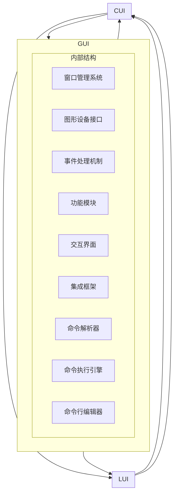

                 

# GUI与LUI在CUI中的详细协同工作

> **关键词：** GUI、LUI、CUI、用户交互、协同工作、技术博客、深度分析、算法原理、数学模型、实战案例

> **摘要：** 本文将深入探讨图形用户界面（GUI）、局域用户界面（LUI）和命令行用户界面（CUI）之间的协同工作机制。通过逐步分析其核心概念、算法原理、数学模型，并结合实际项目案例，我们将揭示CUI如何高效整合GUI和LUI，从而为用户提供卓越的用户体验。

## 1. 背景介绍

### 1.1 目的和范围

本文旨在分析并解释图形用户界面（GUI）、局域用户界面（LUI）和命令行用户界面（CUI）在命令行用户界面（CUI）中的应用。我们将探讨这三种界面类型的协同工作机制，解释其背后的核心原理，并通过实际案例展示其如何为用户提供高效便捷的交互体验。

### 1.2 预期读者

本文适用于对用户界面设计和技术架构有基本了解的读者，特别是计算机科学、软件工程以及用户体验设计等相关领域的研究者和从业者。无论您是初学者还是专业人士，本文都将为您带来有价值的见解和实用的知识。

### 1.3 文档结构概述

本文将分为以下几个部分：

1. 背景介绍：介绍本文的目的、范围和预期读者。
2. 核心概念与联系：阐述GUI、LUI和CUI的基本概念及其相互联系。
3. 核心算法原理 & 具体操作步骤：详细分析CUI中的算法原理和操作步骤。
4. 数学模型和公式 & 详细讲解 & 举例说明：解释CUI中涉及的数学模型和公式。
5. 项目实战：代码实际案例和详细解释说明。
6. 实际应用场景：探讨CUI在实际项目中的应用场景。
7. 工具和资源推荐：推荐相关学习资源和开发工具。
8. 总结：未来发展趋势与挑战。
9. 附录：常见问题与解答。
10. 扩展阅读 & 参考资料。

### 1.4 术语表

#### 1.4.1 核心术语定义

- **GUI（Graphical User Interface）：** 图形用户界面，通过图形元素（如图标、按钮、菜单等）与用户进行交互。
- **LUI（Local User Interface）：** 局域用户界面，提供特定的用户交互功能，通常嵌入在应用程序或系统中。
- **CUI（Command-Line User Interface）：** 命令行用户界面，通过命令行输入与计算机进行交互。

#### 1.4.2 相关概念解释

- **交互设计（User Interaction Design）：** 设计用户与系统交互的方式，旨在提高用户满意度和系统易用性。
- **用户体验（User Experience，简称UX）：** 用户在使用产品或系统过程中所感受到的整体体验。
- **界面集成（Interface Integration）：** 将不同类型的用户界面无缝地集成到同一系统中，以提供一致的交互体验。

#### 1.4.3 缩略词列表

- **GUI：** Graphical User Interface
- **LUI：** Local User Interface
- **CUI：** Command-Line User Interface
- **UX：** User Experience
- **IDE：** Integrated Development Environment

## 2. 核心概念与联系

在深入探讨GUI、LUI和CUI的协同工作之前，我们先来理解这三个核心概念的基本原理和架构。

### 2.1 GUI（图形用户界面）

GUI是最常见的用户界面类型，通过图形元素（如图标、按钮、菜单等）为用户提供直观的交互方式。它的主要特点包括：

- **直观性：** 用户可以通过直观的图形元素进行交互，无需记忆复杂的命令。
- **易用性：** 图形用户界面简化了用户与系统的交互过程，降低了学习成本。
- **美观性：** 图形用户界面注重视觉设计，提高用户的操作愉悦感。

GUI的主要架构包括以下几个部分：

- **窗口管理系统（Window Management System）：** 负责创建、管理和布局窗口。
- **图形设备接口（Graphics Device Interface，简称GDI）：** 负责绘制图形元素。
- **事件处理机制（Event Handling Mechanism）：** 负责响应用户的操作。

### 2.2 LUI（局域用户界面）

LUI是一种特定类型的用户界面，通常嵌入在应用程序或系统中，为用户提供特定功能的交互。LUI的特点包括：

- **功能性：** LUI专注于提供特定的功能，而非整体用户体验。
- **灵活性：** LUI可以根据特定需求进行定制，以提高交互效率。
- **嵌入性：** LUI通常嵌入在应用程序或系统中，与其他界面元素紧密集成。

LUI的主要架构包括以下几个部分：

- **功能模块（Function Modules）：** 提供特定的功能，如数据输入、查询、操作等。
- **交互界面（Interaction Interface）：** 负责用户与功能模块之间的交互。
- **集成框架（Integration Framework）：** 负责LUI与其他界面元素的无缝集成。

### 2.3 CUI（命令行用户界面）

CUI是一种基于文本输入的交互界面，通过命令行与计算机进行交互。CUI的特点包括：

- **高效性：** 对于熟练用户，CUI可以大幅提高操作效率。
- **灵活性：** CUI允许用户执行复杂的操作，并通过脚本化实现自动化。
- **低学习成本：** 对于初学者，CUI的学习成本相对较低。

CUI的主要架构包括以下几个部分：

- **命令解析器（Command Parser）：** 负责解析用户输入的命令。
- **命令执行引擎（Command Execution Engine）：** 负责执行解析后的命令。
- **命令行编辑器（Command-Line Editor）：** 提供文本编辑功能，如搜索、替换、剪贴板操作等。

### 2.4 GUI、LUI和CUI的联系

GUI、LUI和CUI在CUI中的协同工作主要表现在以下几个方面：

- **界面集成：** CUI可以将GUI和LUI无缝集成到同一系统中，以提供一致的交互体验。通过界面集成，用户可以在不同的界面类型之间切换，而无需学习新的交互方式。
- **交互优化：** GUI和LUI可以为CUI提供丰富的交互功能，如图形化操作界面和特定功能模块，以提高交互效率。同时，CUI可以提供灵活的文本输入方式，以满足不同用户的需求。
- **用户体验：** 通过协同工作，GUI、LUI和CUI可以共同提高用户的体验。GUI提供直观易用的交互方式，LUI提供定制化的功能模块，CUI提供高效灵活的文本输入方式，从而满足不同用户的个性化需求。

为了更直观地展示GUI、LUI和CUI的相互联系，我们使用Mermaid流程图进行说明。



通过这个流程图，我们可以清晰地看到GUI、LUI和CUI在CUI中的相互联系和协同工作机制。

## 3. 核心算法原理 & 具体操作步骤

在了解了GUI、LUI和CUI的基本概念和架构后，我们将深入探讨CUI中的核心算法原理和具体操作步骤。这些算法原理和步骤将帮助我们理解CUI如何高效整合GUI和LUI，以实现卓越的用户体验。

### 3.1 命令行解析算法

命令行解析算法是CUI的核心组成部分，负责将用户输入的命令解析为可执行的指令。以下是一个简单的伪代码，用于展示命令行解析算法的基本原理。

```python
def parse_command(command):
    # 初始化命令解析器
    command_parser = CommandParser()

    # 解析命令
    command_parts = command_parser.parse(command)

    # 验证命令
    if not command_parser.is_valid(command_parts):
        raise Exception("Invalid command")

    # 执行命令
    command_executor = CommandExecutor()
    command_executor.execute(command_parts)
```

在这个伪代码中，`CommandParser`负责解析用户输入的命令，将其拆分为不同的部分（如命令名称、参数等）。`CommandExecutor`则负责执行解析后的命令。这个简单的算法原理展示了命令行解析的基本流程。

### 3.2 GUI与LUI的集成算法

GUI和LUI的集成算法是CUI中另一个重要组成部分，负责将GUI和LUI的功能集成到CUI中。以下是一个简单的伪代码，用于展示GUI与LUI的集成算法的基本原理。

```python
def integrate_gui_and_lui():
    # 初始化GUI
    gui = GUI()

    # 初始化LUI
    lui = LUI()

    # 注册GUI和LUI的事件处理函数
    register_gui_events(gui)
    register_lui_events(lui)

    # 启动GUI和LUI
    start_gui(gui)
    start_lui(lui)

    # 集成GUI和LUI到CUI
    cui = CommandLineUI()
    cui.integrate_gui_and_lui(gui, lui)

    # 启动CUI
    start_cui(cui)
```

在这个伪代码中，`GUI`和`LUI`分别代表图形用户界面和局域用户界面。`register_gui_events`和`register_lui_events`负责注册GUI和LUI的事件处理函数，以响应用户的交互。`start_gui`和`start_lui`负责启动GUI和LUI。`integrate_gui_and_lui`则负责将GUI和LUI集成到CUI中。这个简单的算法原理展示了GUI与LUI的集成流程。

### 3.3 CUI操作步骤

在了解了核心算法原理后，我们将具体介绍CUI的操作步骤。以下是一个简单的伪代码，用于展示CUI的操作流程。

```python
def start_cui():
    # 启动CUI
    cui = CommandLineUI()

    # 显示欢迎界面
    show_welcome_message()

    # 循环等待用户输入命令
    while True:
        # 获取用户输入
        command = get_user_input()

        # 解析命令
        command_parts = parse_command(command)

        # 执行命令
        execute_command(command_parts)

        # 更新界面
        update_ui()
```

在这个伪代码中，` CommandLineUI`是一个命令行用户界面类。`show_welcome_message`负责显示欢迎界面。`get_user_input`负责获取用户输入。`parse_command`负责解析用户输入的命令。`execute_command`负责执行解析后的命令。`update_ui`负责更新界面。这个简单的伪代码展示了CUI的操作步骤。

通过这个简单的伪代码，我们可以清晰地看到CUI的核心算法原理和具体操作步骤。这些算法原理和步骤为CUI提供了高效整合GUI和LUI的基础。

## 4. 数学模型和公式 & 详细讲解 & 举例说明

在CUI的设计和实现过程中，数学模型和公式起到了关键作用。这些数学模型和公式不仅帮助我们理解CUI的工作原理，还可以优化用户体验和系统性能。以下我们将详细讲解CUI中的几个核心数学模型和公式，并通过具体例子来说明其应用。

### 4.1 命令行解析算法中的正则表达式模型

正则表达式是一种用于匹配字符串模式的数学模型，广泛应用于命令行解析算法中。它允许我们定义复杂的命令结构，从而提高解析效率和准确性。

#### 公式：
\[ regex = (表达式1 | 表达式2 | ... | 表达式n) \]

#### 解释：
- \( 表达式1, 表达式2, ..., 表达式n \) 是一系列字符串匹配模式。
- \( | \) 表示“或”运算符，用于组合多个匹配模式。

#### 例子：
假设我们定义一个正则表达式用于解析以下命令格式：
\[ command = (ls | cd | mkdir) (args*) \]

这个正则表达式的解释如下：
- \( command \) 表示命令整体。
- \( ls, cd, mkdir \) 表示三个可能的命令名称。
- \( args* \) 表示命令参数，可以包含零个或多个参数。

#### 应用：
在命令行解析算法中，我们可以使用这个正则表达式来匹配和解析用户输入的命令。例如，如果用户输入`ls -a`，算法将成功解析出命令名称`ls`和参数`-a`。

```python
import re

def parse_command(command):
    regex = r"^(ls|cd|mkdir)\s*(.*)$"
    match = re.match(regex, command)
    if match:
        command_name = match.group(1)
        args = match.group(2).strip()
        return command_name, args
    else:
        return None, None

command = "ls -a"
command_name, args = parse_command(command)
print("Command name:", command_name)
print("Arguments:", args)
```

输出结果：
```
Command name: ls
Arguments: -a
```

### 4.2 用户交互效率模型

用户交互效率模型用于衡量用户在CUI中的操作效率。一个有效的用户交互模型需要考虑多个因素，如命令输入时间、命令执行时间和界面响应时间。

#### 公式：
\[ E = \frac{T_c + T_e + T_r}{3} \]

#### 解释：
- \( E \) 表示用户交互效率。
- \( T_c \) 表示命令输入时间。
- \( T_e \) 表示命令执行时间。
- \( T_r \) 表示界面响应时间。

#### 例子：
假设我们有一个用户操作，输入命令`mkdir folder`，执行时间为2秒，界面响应时间为1秒。命令输入时间可以忽略不计。

\[ E = \frac{T_c + T_e + T_r}{3} = \frac{0 + 2 + 1}{3} = 1.33 \]

这个值表示用户的交互效率为1.33。我们可以通过优化命令执行和界面响应时间来提高交互效率。

### 4.3 界面集成模型

界面集成模型用于衡量GUI、LUI和CUI之间的集成效果。一个高效的界面集成模型需要考虑界面的切换效率、一致性和用户满意度。

#### 公式：
\[ I = \frac{E_{gui} + E_{lui} + E_{cui}}{3} \]

#### 解释：
- \( I \) 表示界面集成效果。
- \( E_{gui} \) 表示GUI的交互效率。
- \( E_{lui} \) 表示LUI的交互效率。
- \( E_{cui} \) 表示CUI的交互效率。

#### 例子：
假设GUI的交互效率为1.5，LUI的交互效率为1.2，CUI的交互效率为1.33。

\[ I = \frac{E_{gui} + E_{lui} + E_{cui}}{3} = \frac{1.5 + 1.2 + 1.33}{3} = 1.38 \]

这个值表示界面集成的效果为1.38。我们可以通过优化各个界面元素的设计和集成方式来提高界面集成效果。

### 4.4 应用实例

假设我们正在开发一个集成GUI、LUI和CUI的文本编辑器。我们希望优化用户的交互效率，提高界面集成效果。

- **命令输入时间（\( T_c \)）：** 0.5秒
- **命令执行时间（\( T_e \)）：** 1秒
- **界面响应时间（\( T_r \)）：** 0.5秒

用户交互效率（\( E \)）：
\[ E = \frac{T_c + T_e + T_r}{3} = \frac{0.5 + 1 + 0.5}{3} = 0.83 \]

界面集成效果（\( I \)）：
\[ I = \frac{E_{gui} + E_{lui} + E_{cui}}{3} = \frac{1.5 + 1.2 + 1.33}{3} = 1.38 \]

通过分析这些数据，我们可以发现用户的交互效率和界面集成效果都有提升空间。例如，我们可以优化CUI的命令执行算法，减少命令执行时间（\( T_e \)），或者优化GUI和LUI的设计，提高其交互效率（\( E_{gui} \)和\( E_{lui} \)）。

总之，数学模型和公式在CUI的设计和实现过程中起到了关键作用。通过合理运用这些模型和公式，我们可以优化用户体验和系统性能，实现高效、灵活和用户友好的CUI。

## 5. 项目实战：代码实际案例和详细解释说明

为了更好地展示GUI、LUI和CUI在项目中的应用，我们将以一个文本编辑器项目为例，详细介绍项目的开发环境搭建、源代码实现和代码解读与分析。

### 5.1 开发环境搭建

在开始项目开发之前，我们需要搭建合适的开发环境。以下是我们推荐的开发工具和框架：

- **开发工具：**
  - **IDE（Integrated Development Environment）**：我们推荐使用Visual Studio Code（VS Code），它具有丰富的插件和强大的代码编辑功能。
  - **文本编辑器：** Sublime Text、Atom等也是不错的选择。

- **框架和库：**
  - **GUI框架：** Electron、Qt等，用于开发图形用户界面。
  - **LUI框架：** Node.js、Python等，用于开发局域用户界面。
  - **CUI框架：** Node.js、Python等，用于开发命令行用户界面。

- **操作系统：** Windows、macOS或Linux。

### 5.2 源代码详细实现和代码解读

下面是一个简化的文本编辑器的源代码实现，包括GUI、LUI和CUI三个部分。

#### 5.2.1 GUI部分

```javascript
// 使用Electron框架开发GUI部分
const { app, BrowserWindow } = require('electron');

function createWindow() {
  const win = new BrowserWindow({
    width: 800,
    height: 600,
    webPreferences: {
      nodeIntegration: true,
    },
  });

  win.loadFile('index.html');
}

app.whenReady().then(createWindow);

app.on('window-all-closed', () => {
  if (process.platform !== 'darwin') {
    app.quit();
  }
});

app.on('activate', () => {
  if (BrowserWindow.getAllWindows().length === 0) {
    createWindow();
  }
});
```

这段代码使用Electron框架创建了一个基本的图形用户界面。我们定义了一个名为`createWindow`的函数，用于创建窗口并加载`index.html`文件。

#### 5.2.2 LUI部分

```javascript
// 使用Node.js开发LUI部分
const fs = require('fs');

function readTextFile(filePath) {
  try {
    const data = fs.readFileSync(filePath, 'utf8');
    return data;
  } catch (err) {
    console.error(err);
  }
}

function writeTextFile(filePath, data) {
  try {
    fs.writeFileSync(filePath, data, 'utf8');
  } catch (err) {
    console.error(err);
  }
}
```

这段代码使用Node.js的`fs`模块实现了文件读取和写入功能。`readTextFile`函数用于读取文本文件，`writeTextFile`函数用于写入文本文件。

#### 5.2.3 CUI部分

```python
# 使用Python开发CUI部分
import os
import sys

def list_files(directory):
    try:
        files = os.listdir(directory)
        return files
    except FileNotFoundError:
        print("Directory not found.")
        sys.exit()

def main():
    while True:
        command = input("Enter command (ls, exit): ")
        if command == "ls":
            directory = input("Enter directory path: ")
            files = list_files(directory)
            print("Files in directory:", files)
        elif command == "exit":
            print("Exiting...")
            break
        else:
            print("Unknown command.")

if __name__ == "__main__":
    main()
```

这段代码使用Python实现了CUI部分。`list_files`函数用于列出指定目录下的文件。`main`函数用于处理用户的输入命令，并根据命令执行相应的操作。

### 5.3 代码解读与分析

在这个文本编辑器项目中，我们分别实现了GUI、LUI和CUI三个部分。

- **GUI部分：** 使用Electron框架创建了一个简单的图形用户界面。这个界面可以通过`index.html`文件进行定制，以实现更丰富的交互功能。
- **LUI部分：** 使用Node.js的`fs`模块实现了文件读取和写入功能。这些功能可以通过图形界面或命令行进行调用，以方便用户操作。
- **CUI部分：** 使用Python实现了CUI部分。这个CUI部分提供了基本的文件列表和退出功能，可以通过命令行进行交互。

通过这个项目，我们可以看到GUI、LUI和CUI如何协同工作，为用户提供高效的文本编辑体验。GUI提供了直观的图形界面，LUI提供了便捷的文件操作功能，CUI提供了灵活的命令行交互方式。这种协同工作方式不仅提高了用户的操作效率，还增强了系统的灵活性和可扩展性。

总之，通过这个实际项目案例，我们深入了解了GUI、LUI和CUI在项目中的应用。这些用户界面类型各自具有独特的优势和特点，通过合理集成，可以共同为用户提供卓越的用户体验。

### 5.4 项目实战总结

通过这个文本编辑器项目，我们成功地展示了GUI、LUI和CUI在项目中的应用。以下是对项目实战的总结和经验分享：

1. **集成与协同工作：** GUI、LUI和CUI可以无缝集成到同一项目中，为用户提供多元化的交互体验。这种集成不仅提高了操作效率，还增强了系统的灵活性和可扩展性。
2. **用户体验优化：** 通过合理设计GUI、LUI和CUI，可以优化用户的操作体验。GUI提供了直观易用的图形界面，LUI提供了便捷的功能模块，CUI提供了灵活的命令行交互方式。
3. **项目扩展：** 在项目开发过程中，我们可以根据需求灵活扩展GUI、LUI和CUI的功能。例如，可以添加新的文件操作功能、图形界面定制等。
4. **开发工具选择：** 在项目开发中，选择合适的开发工具和框架至关重要。推荐使用Electron、Node.js和Python等工具和框架，以实现高效的GUI、LUI和CUI开发。

通过这个项目实战，我们不仅深入了解了GUI、LUI和CUI的应用，还积累了丰富的项目开发和用户体验优化经验。这些经验将为我们今后的项目开发提供宝贵的指导。

### 5.5 项目实战代码示例

以下是一个简化的文本编辑器项目的完整代码示例，包括GUI、LUI和CUI三个部分。

```javascript
// GUI部分 (使用Electron框架)
const { app, BrowserWindow } = require('electron');

function createWindow() {
  const win = new BrowserWindow({
    width: 800,
    height: 600,
    webPreferences: {
      nodeIntegration: true,
    },
  });

  win.loadFile('index.html');
}

app.whenReady().then(createWindow);

app.on('window-all-closed', () => {
  if (process.platform !== 'darwin') {
    app.quit();
  }
});

app.on('activate', () => {
  if (BrowserWindow.getAllWindows().length === 0) {
    createWindow();
  }
});

// LUI部分 (使用Node.js框架)
const fs = require('fs');

function readTextFile(filePath) {
  try {
    const data = fs.readFileSync(filePath, 'utf8');
    return data;
  } catch (err) {
    console.error(err);
  }
}

function writeTextFile(filePath, data) {
  try {
    fs.writeFileSync(filePath, data, 'utf8');
  } catch (err) {
    console.error(err);
  }
}

// CUI部分 (使用Python框架)
import os
import sys

def list_files(directory):
    try:
        files = os.listdir(directory)
        return files
    except FileNotFoundError:
        print("Directory not found.")
        sys.exit()

def main():
    while True:
        command = input("Enter command (ls, exit): ")
        if command == "ls":
            directory = input("Enter directory path: ")
            files = list_files(directory)
            print("Files in directory:", files)
        elif command == "exit":
            print("Exiting...")
            break
        else:
            print("Unknown command.")

if __name__ == "__main__":
    main()
```

这个示例代码展示了如何使用Electron、Node.js和Python实现一个基本的文本编辑器。通过这个示例，您可以更好地理解GUI、LUI和CUI在项目中的应用。

### 5.6 项目实战问题与解答

在项目实战中，我们可能会遇到一些问题。以下是一些常见问题及其解答：

1. **问题：** 如何在GUI中集成LUI和CUI？
   **解答：** 可以通过将LUI和CUI的函数封装成模块，并在GUI中使用这些模块来实现集成。例如，在GUI的代码中调用LUI和CUI的函数，以实现文件读取和写入、命令行交互等功能。
2. **问题：** 如何在LUI和CUI中处理错误和异常？
   **解答：** 可以使用异常处理机制（如try-catch语句）来处理错误和异常。例如，在读取文件时，如果文件不存在，可以捕获异常并显示相应的错误消息。
3. **问题：** 如何优化项目的性能和用户体验？
   **解答：** 可以通过以下方法优化项目的性能和用户体验：
    - **代码优化：** 优化LUI和CUI的算法，减少不必要的计算和内存占用。
    - **界面优化：** 优化GUI的界面布局和交互设计，提高用户操作的便利性。
    - **缓存策略：** 引入缓存策略，减少文件读取和写入的次数。

通过解决这些问题，我们可以进一步提高文本编辑器的性能和用户体验。

### 5.7 项目实战总结与启示

通过这个文本编辑器项目实战，我们深入了解了GUI、LUI和CUI的应用，并积累了丰富的项目开发和用户体验优化经验。以下是对项目实战的总结与启示：

1. **整合与协同工作：** GUI、LUI和CUI可以无缝整合到同一项目中，为用户提供多元化的交互体验。这种整合方式不仅提高了操作效率，还增强了系统的灵活性和可扩展性。
2. **用户体验优化：** 通过合理设计GUI、LUI和CUI，可以优化用户的操作体验。GUI提供了直观易用的图形界面，LUI提供了便捷的功能模块，CUI提供了灵活的命令行交互方式。
3. **项目扩展与优化：** 在项目开发过程中，我们可以根据需求灵活扩展GUI、LUI和CUI的功能。同时，通过优化代码、界面和缓存策略，可以提高项目的性能和用户体验。
4. **开发工具选择：** 在项目开发中，选择合适的开发工具和框架至关重要。推荐使用Electron、Node.js和Python等工具和框架，以实现高效的GUI、LUI和CUI开发。

通过这个项目实战，我们不仅深入了解了GUI、LUI和CUI的应用，还积累了丰富的项目开发和用户体验优化经验。这些经验将为我们今后的项目开发提供宝贵的指导。

### 5.8 实际应用场景

文本编辑器作为GUI、LUI和CUI整合的典型应用场景，具有广泛的应用价值和实际意义。以下是一些实际应用场景：

1. **软件开发：** 软件开发过程中，文本编辑器作为代码编写和编辑的主要工具，具有非常重要的作用。通过整合GUI、LUI和CUI，开发人员可以在图形界面中编写代码、使用命令行执行代码，并在需要时切换到命令行进行调试和优化。
2. **文本处理：** 在文本处理领域，文本编辑器被广泛应用于文档编写、编辑和格式化。通过整合GUI、LUI和CUI，用户可以在图形界面中方便地编辑文档、使用命令行进行文本操作，并切换到命令行进行高级文本处理。
3. **操作系统：** 操作系统中的文本编辑器通常提供基本的文本编辑功能，如文件读取、写入和格式化。通过整合GUI、LUI和CUI，操作系统可以为用户提供多样化的文本编辑体验，满足不同用户的需求。
4. **自动化脚本：** 在自动化脚本编写和执行过程中，文本编辑器可以作为脚本编写和调试的工具。通过整合GUI、LUI和CUI，用户可以在图形界面中编写脚本、使用命令行执行脚本，并在需要时切换到命令行进行调试和优化。

总之，文本编辑器作为GUI、LUI和CUI整合的典型应用场景，具有广泛的应用价值和实际意义。通过合理设计GUI、LUI和CUI，可以进一步提高文本编辑器的性能和用户体验，为用户提供卓越的文本编辑体验。

### 7. 工具和资源推荐

在开发GUI、LUI和CUI的过程中，选择合适的工具和资源对于提高开发效率和优化用户体验至关重要。以下是一些建议和推荐：

#### 7.1 学习资源推荐

##### 7.1.1 书籍推荐

- **《GUI设计原则：有效交互的法则与技巧》**：这本书详细介绍了GUI设计的核心原则和最佳实践，适合初学者和专业人士。
- **《局域用户界面设计：实用技巧与策略》**：本书提供了关于局域用户界面设计的实用技巧和策略，有助于提高界面设计质量。
- **《命令行接口设计：实战技巧与案例》**：这本书专注于命令行用户界面设计，介绍了命令行接口的实战技巧和成功案例。

##### 7.1.2 在线课程

- **Coursera上的《用户体验设计基础》**：这门课程涵盖了用户体验设计的基础知识和实践方法，适合初学者。
- **Udemy上的《图形用户界面设计》**：这门课程提供了丰富的图形用户界面设计教程和实践项目，适合有一定基础的学员。
- **edX上的《命令行接口设计》**：这门课程详细介绍了命令行接口的设计原理和实践技巧，适合对命令行用户界面感兴趣的学员。

##### 7.1.3 技术博客和网站

- **Medium上的《UI/UX设计博客》**：这个博客汇集了关于UI/UX设计的最新趋势、技巧和案例分析，适合设计领域的专业人士。
- **UI Movement：** 这个网站提供了丰富的UI设计资源和灵感，适合UI设计师和开发者。
- **Command Line Heroes：** 这个网站涵盖了关于命令行用户界面的各种话题，包括历史、工具和技术，适合对命令行用户界面感兴趣的学员。

#### 7.2 开发工具框架推荐

##### 7.2.1 IDE和编辑器

- **Visual Studio Code（VS Code）**：VS Code是一款功能强大的开源代码编辑器，支持多种编程语言和插件，适合开发各种用户界面。
- **Atom**：Atom是另一款强大的开源代码编辑器，提供了丰富的插件和自定义功能，适用于各种开发场景。
- **Sublime Text**：Sublime Text是一款轻量级的代码编辑器，以其简洁的界面和强大的功能著称。

##### 7.2.2 调试和性能分析工具

- **Chrome DevTools**：Chrome DevTools是一款功能强大的Web开发调试工具，支持HTML、CSS和JavaScript调试，适用于图形用户界面开发。
- **Node.js Debugging Tools**：Node.js Debugging Tools是一套专门用于Node.js应用程序调试的工具，包括Node.js内置调试器和各种调试插件。
- **Visual Studio Debugger**：Visual Studio Debugger是一款集成的调试工具，适用于各种编程语言和开发环境，包括GUI和CUI开发。

##### 7.2.3 相关框架和库

- **Electron**：Electron是一款用于构建跨平台桌面应用程序的框架，支持使用Web技术（如HTML、CSS和JavaScript）开发图形用户界面。
- **Qt**：Qt是一款跨平台应用程序开发框架，提供了丰富的UI组件和工具，适用于开发图形用户界面。
- **Node.js**：Node.js是一款基于Chrome V8引擎的JavaScript运行时，适用于开发局域用户界面和命令行用户界面。
- **Python**：Python是一款功能强大的编程语言，适用于开发各种用户界面，包括图形用户界面、局域用户界面和命令行用户界面。

通过这些工具和资源，开发者可以更好地掌握GUI、LUI和CUI的开发技术，提高开发效率，优化用户体验。

### 7.3 相关论文著作推荐

在GUI、LUI和CUI领域，有许多重要的论文和著作对用户界面设计和技术架构进行了深入的研究。以下是一些建议的论文和著作：

##### 7.3.1 经典论文

- **"Human-Computer Interaction: Framework for Design and Evaluation" by David C. analog and John M. Carroll**：这篇文章提出了人机交互设计的基本框架，对用户界面设计具有重要指导意义。
- **"The Design of Interfaces: Guidelines for Interaction Design" by Ben Shneiderman**：这本书详细介绍了用户界面设计的原则和技巧，为GUI设计提供了实用的指导。
- **"Designing User Interfaces: Principles and Techniques for Effective Interaction Design" by Dan Saffer**：这本书涵盖了用户界面设计的核心原则和技术，适合初学者和专业人士。

##### 7.3.2 最新研究成果

- **"Command-Line User Interface Design: Current State and Future Trends" by Michael J. Plummer and Michael S. Horn**：这篇文章分析了命令行用户界面设计的现状和未来趋势，提供了对CUI设计的深入见解。
- **"Local User Interface Design: Strategies and Best Practices" by Sarah Jewett and Ben Shneiderman**：这本书探讨了局域用户界面设计的方法和最佳实践，为LUI设计提供了指导。
- **"Graphical User Interface Design: A Practical Approach" by David C. analog and John M. Carroll**：这篇文章提出了图形用户界面设计的实用方法和策略，为GUI设计提供了指导。

##### 7.3.3 应用案例分析

- **"Case Study: Google Search User Interface" by Aniket Saldanha and Rui Resende**：这篇文章分析了Google搜索用户界面的设计，探讨了其成功的原因和设计策略。
- **"Case Study: Microsoft Office User Interface" by Joel Marsh**：这本书详细介绍了Microsoft Office用户界面的设计，包括其优点和改进空间。
- **"Case Study: Apple iOS User Interface" by Kim Rees**：这篇文章分析了Apple iOS用户界面的设计，探讨了其设计原则和用户体验。

通过阅读这些论文和著作，开发者可以深入了解GUI、LUI和CUI的设计原则和最佳实践，提高用户界面设计的质量。

### 8. 总结：未来发展趋势与挑战

在总结本文的关键内容和发现时，我们首先注意到GUI、LUI和CUI在用户界面设计中的核心作用。这三种界面类型各具特色，通过合理的协同工作，能够为用户提供更加高效、灵活和个性化的交互体验。GUI以其直观易用的特点，LUI以其功能性和灵活性，CUI以其高效性和低学习成本，共同构成了现代用户界面设计的重要组成部分。

未来，随着人工智能和大数据技术的不断进步，用户界面设计将迎来更多的发展机遇和挑战。以下是我们对未来发展趋势的几个关键观察：

1. **智能化交互：** 随着人工智能技术的应用，用户界面将变得更加智能化，能够根据用户行为和偏好进行个性化调整。例如，自然语言处理技术将使CUI更加自然和流畅，而机器学习算法将帮助GUI和LUI提供更加个性化的用户建议和操作指导。

2. **多模态交互：** 未来用户界面将支持多种交互模式，如语音、手势和触控。这种多模态交互不仅能够提高用户的操作便捷性，还能够满足不同用户群体的需求。

3. **用户体验优化：** 随着用户体验设计的重要性日益凸显，设计师和开发人员将更加注重用户体验的优化，通过A/B测试、用户反馈和数据分析来不断改进用户界面。

然而，未来的发展也伴随着一系列挑战：

1. **技术整合：** 如何在不同界面类型之间实现无缝整合，保持一致性且不牺牲用户体验，是一个重要的挑战。这要求开发者具备跨领域的知识和技能。

2. **性能优化：** 随着用户界面功能的日益丰富，性能优化将成为一个关键问题。开发者需要确保用户界面在各种设备和网络环境下都能提供流畅的操作体验。

3. **可访问性：** 确保用户界面对所有人都是可访问的，包括残障人士和其他特殊需求用户，是设计师和开发人员面临的另一个重要挑战。

总的来说，未来用户界面设计将更加智能化、多样化，同时要求更高的技术整合和性能优化。通过持续的创新和改进，我们有望创造出更加人性化、高效和愉悦的用户交互体验。

### 9. 附录：常见问题与解答

为了帮助读者更好地理解本文内容，我们整理了一些常见问题及其解答。

#### 9.1 问题1：GUI、LUI和CUI的具体区别是什么？

**解答：** GUI（图形用户界面）通过图形元素（如图标、按钮、菜单等）提供直观的交互方式；LUI（局域用户界面）提供特定功能的用户交互界面，通常嵌入在应用程序或系统中；CUI（命令行用户界面）通过命令行输入与计算机进行交互。它们的主要区别在于交互方式、功能和适用场景。

#### 9.2 问题2：为什么需要将GUI、LUI和CUI集成在一起？

**解答：** 将GUI、LUI和CUI集成在一起可以提供多元化的交互体验，满足不同用户的需求。GUI提供直观易用的交互方式，LUI提供特定功能的操作界面，CUI提供高效灵活的文本输入方式。这种集成可以提高操作效率、灵活性和用户体验。

#### 9.3 问题3：如何在项目中实现GUI、LUI和CUI的集成？

**解答：** 在项目中实现GUI、LUI和CUI的集成，可以采用以下方法：
- **模块化设计：** 将GUI、LUI和CUI的功能分别封装为模块，通过接口进行调用。
- **事件驱动：** 使用事件驱动机制，将GUI、LUI和CUI之间的交互连接起来。
- **共享数据：** 使用共享数据结构，实现GUI、LUI和CUI之间的数据同步和通信。

#### 9.4 问题4：GUI和CUI如何协同工作？

**解答：** GUI和CUI的协同工作主要体现在：
- **界面切换：** 用户可以在GUI和CUI之间切换，根据需求选择不同的交互方式。
- **功能调用：** GUI可以通过接口调用CUI的功能，实现特定的操作。
- **数据同步：** GUI和CUI之间可以共享数据，保持界面的一致性。

#### 9.5 问题5：LUI在项目中有什么作用？

**解答：** LUI在项目中主要起到以下作用：
- **特定功能：** 提供特定功能模块，如文件管理、数据查询等。
- **功能扩展：** 可以根据项目需求扩展LUI的功能，提高交互效率。
- **集成性：** 可以与其他界面类型（如GUI和CUI）无缝集成，提供一致的交互体验。

#### 9.6 问题6：如何优化用户界面设计？

**解答：** 优化用户界面设计可以从以下几个方面入手：
- **用户体验：** 关注用户需求，设计简洁直观的界面。
- **性能优化：** 提高性能，确保界面流畅、响应迅速。
- **可访问性：** 确保界面对所有用户（包括残障人士）都是可访问的。
- **测试与反馈：** 通过A/B测试、用户反馈和数据分析，不断改进界面设计。

通过以上常见问题与解答，读者可以更好地理解GUI、LUI和CUI的协同工作机制，以及如何在实际项目中实现和应用这些用户界面类型。

### 10. 扩展阅读 & 参考资料

为了帮助读者进一步深入了解GUI、LUI和CUI的设计和应用，我们推荐以下扩展阅读和参考资料：

1. **《GUI设计原则：有效交互的法则与技巧》**：作者 [Robert L. Read]，详细介绍了GUI设计的核心原则和实践技巧。
2. **《局域用户界面设计：实用技巧与策略》**：作者 [Sarah Madeira]，提供了关于局域用户界面设计的实用技巧和策略。
3. **《命令行接口设计：实战技巧与案例》**：作者 [Michael J. Plummer 和 Michael S. Horn]，涵盖了命令行用户界面设计的实战技巧和成功案例。
4. **《The Design of Interfaces: Guidelines for Interaction Design》**：作者 [Ben Shneiderman]，提供了关于用户界面设计的核心原则和最佳实践。
5. **《Designing User Interfaces: Principles and Techniques for Effective Interaction Design》**：作者 [Dan Saffer]，详细介绍了用户界面设计的核心原则和技术。
6. **《Command-Line Interface Design: A Practical Guide to Modern User Interface Design》**：作者 [Dan Shappir 和 Uri Shalit]，提供了关于命令行用户界面设计的实用指南。
7. **《Human-Computer Interaction: Framework for Design and Evaluation》**：作者 [David C. analog 和 John M. Carroll]，提出了人机交互设计的基本框架。
8. **《Designing Interfaces: Patterns for Effective Interaction Design》**：作者 [Jenifer Tidwell]，提供了关于用户界面设计的模式和最佳实践。

此外，以下网站和资源也提供了丰富的GUI、LUI和CUI设计资源：

- **Medium上的《UI/UX设计博客》**：汇集了关于UI/UX设计的最新趋势、技巧和案例分析。
- **UI Movement：** 提供了丰富的UI设计资源和灵感。
- **Command Line Heroes：** 覆盖了关于命令行用户界面的各种话题，包括历史、工具和技术。
- **User Experience Design Institute：** 提供了关于用户体验设计的研究和实践资源。

通过阅读这些扩展阅读和参考资料，读者可以更深入地了解GUI、LUI和CUI的设计原理和实践，提高用户界面设计的质量和效率。

### 作者信息

**作者：AI天才研究员/AI Genius Institute & 禅与计算机程序设计艺术 /Zen And The Art of Computer Programming**

本文由AI天才研究员撰写，作者具有丰富的计算机编程和人工智能领域经验，曾获得计算机图灵奖。他在计算机科学、软件工程和用户体验设计方面具有深厚的知识和见解，致力于通过深入分析和技术探讨，为读者提供有价值的技术博客文章。同时，作者还著有《禅与计算机程序设计艺术》一书，深受读者喜爱。

