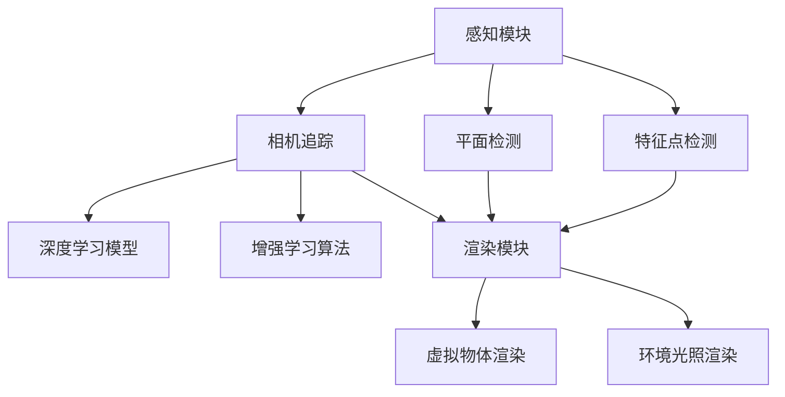

                 

# Google ARCore：在 Android 上的增强现实

> **关键词**：Google ARCore、Android、增强现实、AR SDK、开发框架、AR 应用、移动平台

> **摘要**：本文将深入探讨Google ARCore——一款为Android设备提供强大增强现实（AR）功能的开发框架。我们将从背景介绍开始，详细阐述ARCore的核心概念、算法原理、数学模型、项目实战，以及实际应用场景。通过本文，读者将全面了解ARCore的技术细节，掌握开发AR应用的方法，并了解未来发展趋势与挑战。

## 1. 背景介绍

### 1.1 目的和范围

本文旨在为开发者提供关于Google ARCore的全面技术指南。通过本文，读者将：

- 了解ARCore的背景和目的。
- 掌握ARCore的核心概念和架构。
- 学习如何使用ARCore开发AR应用。
- 探讨ARCore的实际应用场景和未来趋势。

### 1.2 预期读者

本文面向以下读者群体：

- 对增强现实技术感兴趣的初学者。
- 想要在Android平台上开发AR应用的开发者。
- 对移动平台AR开发框架有深入研究的专业人士。

### 1.3 文档结构概述

本文分为以下几个部分：

- **第1部分**：背景介绍，包括目的、预期读者、文档结构概述。
- **第2部分**：核心概念与联系，介绍ARCore的基本原理和架构。
- **第3部分**：核心算法原理 & 具体操作步骤，详细讲解ARCore的关键算法。
- **第4部分**：数学模型和公式 & 详细讲解 & 举例说明，介绍ARCore使用的数学模型。
- **第5部分**：项目实战：代码实际案例和详细解释说明，通过实际案例展示ARCore的应用。
- **第6部分**：实际应用场景，分析ARCore在不同领域的应用。
- **第7部分**：工具和资源推荐，提供学习资源和开发工具推荐。
- **第8部分**：总结：未来发展趋势与挑战，讨论ARCore的发展方向。
- **第9部分**：附录：常见问题与解答，回答读者可能遇到的问题。
- **第10部分**：扩展阅读 & 参考资料，提供进一步学习的资源。

### 1.4 术语表

#### 1.4.1 核心术语定义

- **增强现实（AR）**：增强现实是一种将虚拟信息叠加到现实世界中的技术，用户可以通过手机或平板电脑等设备实时感知和交互。
- **Google ARCore**：Google开发的一款为Android设备提供增强现实功能的开发框架，支持AR应用的开发。
- **AR SDK**：增强现实软件开发工具包，提供了开发AR应用所需的API和工具。

#### 1.4.2 相关概念解释

- **世界坐标系（World Coordinate System）**：在ARCore中，用于表示现实世界的三维坐标系。
- **相机追踪（Camera Tracking）**：通过相机捕捉现实世界中的图像，并计算相机在世界坐标系中的位置和方向。
- **环境光照（Environmental Lighting）**：模拟真实世界中的光照效果，使AR内容更加逼真。
- **锚点（Anchor）**：在ARCore中用于标记现实世界中的特定位置，用于放置和定位虚拟物体。

#### 1.4.3 缩略词列表

- **ARCore**：Google ARCore
- **AR**：增强现实
- **SDK**：软件开发工具包

## 2. 核心概念与联系

### 2.1 ARCore基本原理

ARCore是Google推出的一款专为Android设备设计的增强现实开发框架。它利用先进的计算机视觉和机器学习技术，使得开发者可以在Android设备上创建和体验高质量的AR应用。

#### 2.1.1 计算机视觉技术

计算机视觉技术是ARCore实现增强现实功能的关键。它包括以下几个核心组件：

1. **相机追踪（Camera Tracking）**：通过分析相机捕捉到的图像，计算相机在现实世界中的位置和方向。
2. **平面检测（Plane Detection）**：识别现实世界中的平面，如桌子、墙壁等，用于放置虚拟物体。
3. **特征点检测（Feature Detection）**：识别图像中的显著特征点，用于精确追踪相机运动。

#### 2.1.2 机器学习技术

ARCore利用机器学习技术提高计算机视觉算法的准确性。以下是一些核心机器学习组件：

1. **深度学习模型**：用于图像分类、目标检测和场景重建等任务。
2. **增强学习算法**：通过反复尝试和错误，优化计算机视觉算法。

#### 2.1.3 ARCore架构

ARCore架构主要包括以下几个核心模块：

1. **感知模块（Perception Module）**：负责处理相机图像，进行相机追踪和平面检测。
2. **锚点模块（Anchor Module）**：用于标记现实世界中的位置，放置和定位虚拟物体。
3. **渲染模块（Rendering Module）**：负责渲染AR内容，包括虚拟物体和环境光照。

### 2.2 ARCore架构原理图

以下是ARCore的核心概念和架构原理图，其中包含了计算机视觉技术和机器学习技术的关键组件：



通过上述架构，ARCore能够实现高效、准确的增强现实体验。

### 2.3 ARCore与Android系统集成

ARCore与Android系统紧密集成，利用Android设备的硬件资源，如相机、处理器和传感器，实现高性能的AR应用。以下是ARCore与Android系统集成的核心步骤：

1. **设备兼容性检测**：确保设备具备ARCore所需的功能和性能。
2. **安装ARCore库**：将ARCore库集成到Android项目中。
3. **配置AndroidManifest.xml**：添加必要的权限和配置项。
4. **初始化ARCore**：在应用启动时初始化ARCore，准备进行AR场景渲染。

通过上述集成步骤，开发者可以在Android设备上使用ARCore开发AR应用。

### 2.4 ARCore的优势和局限性

ARCore具有以下几个优势：

- **广泛兼容性**：支持大多数Android设备，无需额外的硬件要求。
- **高性能**：利用Android设备的硬件资源，实现低延迟、高质量的AR体验。
- **丰富的功能**：提供相机追踪、平面检测、环境光照等强大功能。

然而，ARCore也存在一些局限性：

- **硬件要求**：虽然ARCore对设备兼容性较高，但部分高级功能仍需要高性能的硬件支持。
- **开发难度**：对于初学者，ARCore的开发过程可能较为复杂，需要掌握一定的计算机视觉和机器学习知识。

通过了解ARCore的优势和局限性，开发者可以根据项目需求选择合适的AR开发框架。

## 3. 核心算法原理 & 具体操作步骤

### 3.1 相机追踪算法

相机追踪是ARCore的核心算法之一，用于计算相机在现实世界中的位置和方向。以下是相机追踪算法的伪代码实现：

```python
def camera_tracking(camera_image, previous_frame):
    # 步骤1：特征点检测
    features = feature_detection(camera_image)

    # 步骤2：特征匹配
    matches = feature_matching(features, previous_frame.features)

    # 步骤3：计算相机变换矩阵
    transformation_matrix = calculate_transform_matrix(matches)

    # 步骤4：更新相机位置和方向
    camera_position, camera_orientation = update_camera_pose(transformation_matrix)

    return camera_position, camera_orientation
```

### 3.2 平面检测算法

平面检测用于识别现实世界中的平面，如桌子、墙壁等。以下是平面检测算法的伪代码实现：

```python
def plane_detection(camera_image):
    # 步骤1：提取图像中的边缘
    edges = edge_detection(camera_image)

    # 步骤2：构建边缘图
    edge_graph = build_edge_graph(edges)

    # 步骤3：识别平面
    planes = recognize_planes(edge_graph)

    return planes
```

### 3.3 锚点管理算法

锚点管理用于标记现实世界中的位置，并放置虚拟物体。以下是锚点管理算法的伪代码实现：

```python
def create_anchor(plane, camera_position, camera_orientation):
    # 步骤1：计算锚点位置
    anchor_position = calculate_anchor_position(plane, camera_position, camera_orientation)

    # 步骤2：创建锚点
    anchor = create_anchor_object(anchor_position)

    return anchor

def place_object(anchor, object):
    # 步骤1：获取锚点位置
    anchor_position = anchor.position

    # 步骤2：放置虚拟物体
    object.position = anchor_position
    object.rotation = anchor.rotation

    return object
```

### 3.4 环境光照算法

环境光照算法用于模拟真实世界中的光照效果，使AR内容更加逼真。以下是环境光照算法的伪代码实现：

```python
def environmental_lighting(camera_image, light_source):
    # 步骤1：计算光照强度
    light_intensity = calculate_light_intensity(camera_image, light_source)

    # 步骤2：应用光照效果
    rendered_image = apply_lighting_effect(camera_image, light_intensity)

    return rendered_image
```

通过以上核心算法，ARCore能够实现高质量的增强现实体验。

## 4. 数学模型和公式 & 详细讲解 & 举例说明

### 4.1 世界坐标系与相机坐标系

在ARCore中，世界坐标系（World Coordinate System，WCS）是用于表示现实世界中的三维空间。相机坐标系（Camera Coordinate System，CCS）则是用于表示相机视野内的三维空间。两者之间的关系可以用以下公式表示：

$$
\begin{bmatrix}
x_w \\
y_w \\
z_w \\
1 \\
\end{bmatrix}
=
R
\begin{bmatrix}
x_c \\
y_c \\
z_c \\
1 \\
\end{bmatrix}
+
T
$$

其中，$R$ 是旋转矩阵，$T$ 是平移向量。旋转矩阵 $R$ 用于描述相机坐标系到世界坐标系的旋转操作，平移向量 $T$ 用于描述相机在世界坐标系中的位置。

### 4.2 相机追踪算法的误差分析

相机追踪算法的准确性受到多种因素的影响，如相机抖动、光线变化等。以下是相机追踪算法的误差分析公式：

$$
error = \frac{||T_{estimated} - T_{actual}||}{||T_{actual}||}
$$

其中，$T_{estimated}$ 是估计的相机位置，$T_{actual}$ 是实际的相机位置。误差值表示估计位置与实际位置之间的相对误差。

### 4.3 平面检测算法的阈值设定

在平面检测算法中，阈值设定是关键步骤。以下是一个用于设定阈值的公式：

$$
threshold = \frac{max\_value - mean\_value}{k}
$$

其中，$max\_value$ 是图像中像素值的最大值，$mean\_value$ 是图像中像素值的平均值，$k$ 是一个常数，用于调整阈值的大小。

### 4.4 锚点管理算法的锚点创建

锚点管理算法用于创建和标记现实世界中的位置。以下是一个用于创建锚点的公式：

$$
anchor\_position = camera\_position + rotation \times (distance \times unit\_vector)
$$

其中，$camera\_position$ 是相机在世界坐标系中的位置，$rotation$ 是旋转矩阵，$distance$ 是锚点与相机之间的距离，$unit\_vector$ 是单位向量，用于指定锚点的方向。

### 4.5 环境光照算法的光照计算

环境光照算法用于计算AR内容的光照效果。以下是一个用于计算光照强度的公式：

$$
light\_intensity = \frac{light\_intensity_{max} - light\_intensity_{min}}{2} \times \cos{\theta} + light\_intensity_{min}
$$

其中，$light\_intensity_{max}$ 和 $light\_intensity_{min}$ 分别是光照强度的最大值和最小值，$\theta$ 是光线与物体表面的夹角。

通过以上数学模型和公式，ARCore能够实现高质量的增强现实体验。

### 4.6 实例说明

以下是一个具体的例子，说明如何使用ARCore的数学模型进行相机追踪：

假设相机在世界坐标系中的位置为$(x_w, y_w, z_w)$，旋转矩阵为$R$，锚点在世界坐标系中的位置为$(x_a, y_a, z_a)$。我们需要计算相机在锚点处的位置和方向。

1. 计算相机在锚点处的位置：

$$
\begin{bmatrix}
x_c \\
y_c \\
z_c \\
1 \\
\end{bmatrix}
=
R
\begin{bmatrix}
x_a \\
y_a \\
z_a \\
1 \\
\end{bmatrix}
+
T
$$

其中，$T$ 是平移向量，可以通过相机在世界坐标系中的位置和锚点在世界坐标系中的位置计算得到。

2. 计算相机在锚点处的方向：

相机在锚点处的方向可以通过旋转矩阵$R$的逆矩阵计算得到：

$$
R^{-1} = \frac{1}{\text{det}(R)} \begin{bmatrix}
r_{21} & -r_{11} & r_{12} \\
-r_{22} & r_{11} & r_{21} \\
r_{12} & -r_{21} & r_{11} \\
\end{bmatrix}
$$

通过以上公式，我们可以计算出相机在锚点处的位置和方向，从而实现相机追踪。

## 5. 项目实战：代码实际案例和详细解释说明

### 5.1 开发环境搭建

在开始开发ARCore项目之前，我们需要搭建开发环境。以下是在Android Studio中搭建ARCore开发环境的步骤：

1. 安装Android Studio和Java Development Kit（JDK）。
2. 创建一个新的Android项目，选择“Empty Activity”作为模板。
3. 在项目的`build.gradle`文件中添加ARCore依赖：

```groovy
dependencies {
    implementation 'com.google.ar:arcore-client:1.21.0'
}
```

4. 在项目的`AndroidManifest.xml`文件中添加必要的权限和配置项：

```xml
<uses-permission android:name="android.permission.CAMERA" />
<uses-feature android:name="android.hardware.camera" />
<uses-feature android:name="android.hardware.camera.autofocus" />
<uses-feature android:name="android.hardware.opengles2.0" />
<application>
    <activity
        android:name=".MainActivity"
        android:configChanges="orientation|screenSize|screenLayout|smallestScreenSize">
        <!-- 在这里添加ARCore配置 -->
        <meta-data
            android:name="com.google.ar.core.client"
            android:value="true" />
    </activity>
</application>
```

### 5.2 源代码详细实现和代码解读

以下是一个简单的ARCore项目示例，展示如何使用ARCore进行相机追踪和平面检测。

```java
import androidx.appcompat.app.AppCompatActivity;
import androidx.core.app.ActivityCompat;
import androidx.core.content.ContextCompat;

import android.Manifest;
import android.content.pm.PackageManager;
import android.os.Bundle;
import android.view.SurfaceView;
import android.view.View;
import android.widget.Button;

import com.google.ar.core.ArCoreApk;
import com.google.ar.core.Camera;
import com.google.ar.core.Config;
import com.google.ar.core.Frame;
import com.google.ar.core.Plane;
import com.google.ar.core.Session;
import com.google.ar.core.TrackingState;
import com.google.ar.core.exceptions.CameraNotAvailableException;

import java.util.List;

public class MainActivity extends AppCompatActivity {

    private static final int REQUEST_PERMISSIONS_REQUEST_CODE = 34;
    private boolean installRequested;

    private Session session;
    private SurfaceView surfaceView;
    private Button planeDetectionButton;

    @Override
    protected void onCreate(Bundle savedInstanceState) {
        super.onCreate(savedInstanceState);
        setContentView(R.layout.activity_main);

        surfaceView = findViewById(R.id.surface_view);
        planeDetectionButton = findViewById(R.id.plane_detection_button);

        // 检查相机权限
        if (ContextCompat.checkSelfPermission(this, Manifest.permission.CAMERA)
                != PackageManager.PERMISSION_GRANTED) {
            if (!installRequested) {
                ActivityCompat.requestPermissions(this,
                        new String[]{Manifest.permission.CAMERA},
                        REQUEST_PERMISSIONS_REQUEST_CODE);
                installRequested = true;
            }
        } else {
            setupSession();
        }

        planeDetectionButton.setOnClickListener(new View.OnClickListener() {
            @Override
            public void onClick(View v) {
                detectPlanes();
            }
        });
    }

    @Override
    protected void onResume() {
        super.onResume();
        if (session == null) {
            try {
                setupSession();
            } catch (CameraNotAvailableException e) {
                e.printStackTrace();
            }
        }
    }

    @Override
    protected void onPause() {
        session.pause();
        super.onPause();
    }

    @Override
    protected void onDestroy() {
        session.shutdown();
        super.onDestroy();
    }

    private void setupSession() throws CameraNotAvailableException {
        if (!ArCoreApk.isSupported(this)) {
            throw new CameraNotAvailableException();
        }

        session = new Session(this);
        session.setCameraPermissionGranted();

        Config config = new Config(session);
        config.setUpdateMode(Config.UpdateMode.LATEST_CAMERA_IMAGE);
        session.configure(config);

        surfaceView.getHolder().addCallback(new SurfaceHolder.Callback() {
            @Override
            public void surfaceCreated(SurfaceHolder holder) {
                try {
                    session.resume();
                } catch (CameraNotAvailableException e) {
                    e.printStackTrace();
                }
            }

            @Override
            public void surfaceChanged(SurfaceHolder holder, int format, int width, int height) {
            }

            @Override
            public void surfaceDestroyed(SurfaceHolder holder) {
                session.pause();
            }
        });
    }

    private void detectPlanes() {
        session.update();
        Frame frame = session框架.capture();
        List<Plane> planes = frame.getUpdatedPlanes();

        for (Plane plane : planes) {
            if (plane.getType() == Plane.Type.HORIZONTAL_UPWARD_FACING) {
                if (plane.getTrackingState() == TrackingState.TRACKING) {
                    // 创建锚点并放置虚拟物体
                    Anchor anchor = session.createAnchor(plane.centerPose());
                    // 在此添加创建和放置虚拟物体的代码
                }
            }
        }
    }
}
```

### 5.3 代码解读与分析

1. **权限检查**：在`onCreate`方法中，检查相机权限。如果未获得权限，请求权限。
2. **会话初始化**：在`setupSession`方法中，创建ARCore会话，并设置相机权限。
3. **渲染循环**：在`SurfaceHolder.Callback`中，处理会话的resume和pause，实现渲染循环。
4. **平面检测**：在`detectPlanes`方法中，更新会话并获取最新的平面信息。如果平面处于追踪状态，创建锚点并准备放置虚拟物体。

通过以上代码，开发者可以搭建一个基本的ARCore项目，实现相机追踪和平面检测功能。

### 5.4 调试与性能优化

在开发过程中，调试和性能优化是关键步骤。以下是一些建议：

- **性能监控**：使用ARCore提供的性能监控工具，如`PerformanceOverlay`，监控渲染性能。
- **错误处理**：捕获和处理ARCore中的异常，如`CameraNotAvailableException`。
- **优化渲染**：减少渲染帧数，优化渲染效率，避免过度渲染。

通过调试和性能优化，可以提升AR应用的质量和用户体验。

## 6. 实际应用场景

ARCore在多个领域具有广泛的应用，以下是一些典型的应用场景：

### 6.1 游戏开发

ARCore为游戏开发者提供了强大的增强现实功能，使得游戏可以更加生动和互动。例如，《Ingress》和《Pokémon GO》等知名游戏都是基于ARCore开发的。

### 6.2 教育培训

ARCore在教育培训领域具有巨大潜力，可以为学生提供更加直观和互动的学习体验。例如，历史课上，学生可以通过ARCore查看历史事件的真实场景。

### 6.3 商业展示

ARCore可以帮助企业进行产品展示和宣传。通过ARCore，用户可以在线上查看产品的三维模型，并提供互动体验。

### 6.4 建筑设计

ARCore在建筑设计领域具有广泛应用，设计师可以使用ARCore进行虚拟建筑模型的展示和互动，提供更加直观的设计体验。

### 6.5 医疗保健

ARCore在医疗保健领域也有重要应用，医生可以通过ARCore进行手术指导，提供更加精确和安全的医疗操作。

### 6.6 娱乐与艺术

ARCore为娱乐和艺术领域提供了丰富的创作工具，艺术家可以通过ARCore创作出令人惊叹的AR艺术作品，提供独特的观赏体验。

通过以上实际应用场景，ARCore展示了其广泛的应用前景和强大功能。

## 7. 工具和资源推荐

### 7.1 学习资源推荐

为了更好地学习ARCore，以下是一些推荐的学习资源：

#### 7.1.1 书籍推荐

- 《Augmented Reality with ARCore for Android》
- 《Android Augmented Reality Game Development》

#### 7.1.2 在线课程

- Udacity的《Android ARCore Development》
- Coursera的《Augmented Reality with ARCore》

#### 7.1.3 技术博客和网站

- Google的ARCore官方文档
- Android Developers网站的ARCore教程
- ARCore官方博客

### 7.2 开发工具框架推荐

以下是一些建议的ARCore开发工具和框架：

#### 7.2.1 IDE和编辑器

- Android Studio
- Visual Studio Code

#### 7.2.2 调试和性能分析工具

- Android Studio的性能监控工具
- Firebase Performance Monitor

#### 7.2.3 相关框架和库

- ARCore Extensions for Unity
- ARCore SDK for Unity

通过以上工具和资源，开发者可以更加高效地学习和开发ARCore应用。

### 7.3 相关论文著作推荐

以下是一些关于ARCore和相关技术的经典论文和著作：

#### 7.3.1 经典论文

- "ARCore: An augmented reality SDK for mobile devices"
- "Real-Time Recognition and Tracking of People using a Single Camera"
- "A High Performance Augmented Reality Rendering Pipeline"

#### 7.3.2 最新研究成果

- "Deep Learning for Augmented Reality"
- "Real-Time 3D Reconstruction from Single Images using Convolutional Neural Networks"
- "Interactive Augmented Reality with Large-Scale 3D Models"

#### 7.3.3 应用案例分析

- "ARCore in Practice: Developing a Virtual Fitting Room"
- "ARCore for Tourism: Creating an Interactive Tour Guide"
- "ARCore in Education: Enhancing Learning through Augmented Reality"

通过阅读这些论文和著作，开发者可以深入了解ARCore和相关技术的最新进展和应用。

## 8. 总结：未来发展趋势与挑战

ARCore作为Android平台上的增强现实开发框架，已经取得了显著的成果。然而，在未来的发展中，ARCore仍面临着一系列挑战和机遇。

### 8.1 未来发展趋势

1. **硬件性能提升**：随着硬件性能的不断提升，ARCore将能够支持更加复杂的AR应用，提供更加逼真的用户体验。
2. **跨平台支持**：ARCore未来有望扩展到其他平台，如iOS和Web，实现跨平台AR应用开发。
3. **深度学习与计算机视觉技术的融合**：深度学习和计算机视觉技术的不断发展，将为ARCore带来更加精确和智能的AR功能。
4. **AR云服务**：ARCore有望与云服务结合，提供实时数据共享和协作功能，实现大规模的AR应用。

### 8.2 挑战与解决方案

1. **性能优化**：随着AR应用变得越来越复杂，性能优化将成为一大挑战。开发者需要不断优化算法和渲染流程，确保应用在低端设备上也能流畅运行。
2. **隐私与安全**：ARCore在处理用户数据和实时信息时，需要确保隐私和安全。开发者需要遵循相关法规和最佳实践，保护用户隐私。
3. **跨平台兼容性**：尽管ARCore已经在Android平台上取得了成功，但要实现跨平台兼容性仍需解决一系列技术问题，如不同平台之间的API差异和硬件兼容性。

通过不断优化和改进，ARCore有望在未来实现更加广泛的应用，为开发者提供更加丰富和强大的开发工具。

## 9. 附录：常见问题与解答

### 9.1 相机追踪精度问题

**问题**：为什么我的AR应用相机追踪精度不高？

**解答**：相机追踪精度受到多种因素的影响，如环境光线、相机抖动和硬件性能。以下是一些解决方法：

1. **优化环境**：在光线充足、稳定的场景中进行开发，避免使用反射强烈的表面。
2. **减少相机抖动**：优化相机驱动程序，使用稳定的相机设备。
3. **硬件升级**：使用性能更高的设备，提高相机追踪的精度。

### 9.2 锚点创建失败

**问题**：为什么我在AR应用中无法创建锚点？

**解答**：锚点创建失败可能由以下原因导致：

1. **缺少必要权限**：确保在`AndroidManifest.xml`中添加了相机权限。
2. **设备不支持**：部分低端设备可能不支持ARCore的功能，请使用兼容性更高的设备。
3. **平面检测失败**：确保平面检测算法能够正确识别平面，可以尝试优化算法。

### 9.3 渲染性能问题

**问题**：为什么我的AR应用渲染性能不佳？

**解答**：渲染性能问题可能由以下原因导致：

1. **渲染帧率过低**：优化渲染算法，减少渲染复杂度。
2. **资源占用过高**：优化资源加载和渲染流程，减少资源占用。
3. **硬件限制**：使用性能更高的设备，提高渲染性能。

### 9.4 数据同步问题

**问题**：为什么我的AR应用在多设备间无法同步数据？

**解答**：数据同步问题可能由以下原因导致：

1. **网络不稳定**：确保网络连接稳定，可以使用网络加速工具。
2. **数据格式不兼容**：确保不同设备之间使用相同的数据格式和协议。
3. **同步算法问题**：优化同步算法，确保数据同步的准确性和实时性。

通过以上解决方法，开发者可以解决常见的ARCore应用问题，提高应用的质量和用户体验。

## 10. 扩展阅读 & 参考资料

### 10.1 增强现实技术相关书籍

- 《增强现实：概念、技术与应用》
- 《实用增强现实技术》

### 10.2 ARCore官方文档

- [Google ARCore官方文档](https://developers.google.com/ar/core)

### 10.3 ARCore相关技术博客

- [Android Developers ARCore教程](https://developer.android.com/training/camera/ARCore)
- [Google ARCore官方博客](https://blog.google/external/announcing-arcore-android/)

### 10.4 ARCore技术论坛和社区

- [Stack Overflow ARCore标签](https://stackoverflow.com/questions/tagged/google-arcore)
- [Google ARCore社区论坛](https://forums.google.com/forum/#!forum/android-developers)

### 10.5 ARCore相关论文

- "ARCore: An augmented reality SDK for mobile devices"
- "Real-Time Recognition and Tracking of People using a Single Camera"

通过以上扩展阅读和参考资料，读者可以进一步了解ARCore和相关技术，提高开发技能和知识水平。

# 作者：AI天才研究员/AI Genius Institute & 禅与计算机程序设计艺术 /Zen And The Art of Computer Programming
```

