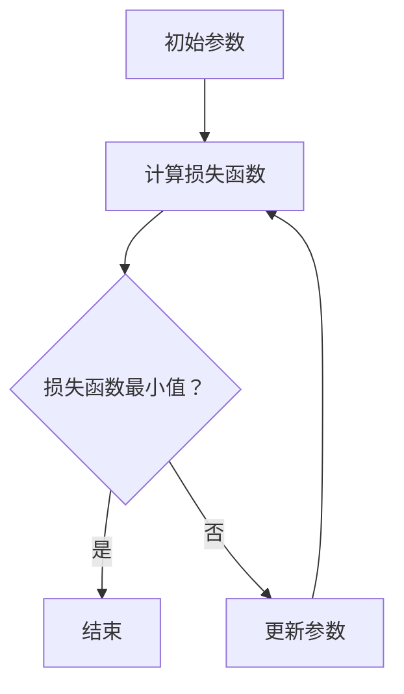

                 

### 1. 背景介绍

#### 1.1 目的和范围

本文旨在深入探讨梯度下降（Gradient Descent）算法的基本原理、数学模型以及在实际项目中的应用。梯度下降是机器学习中一种重要的优化算法，广泛用于训练各种机器学习模型，如线性回归、神经网络等。通过本文的学习，您将能够理解梯度下降的核心概念，掌握其实现方法，并在实际项目中应用这一算法。

本文将涵盖以下几个方面的内容：

1. **核心概念与联系**：通过Mermaid流程图详细展示梯度下降算法的原理和架构。
2. **核心算法原理**：使用伪代码详细阐述梯度下降算法的具体操作步骤。
3. **数学模型和公式**：讲解梯度下降算法的数学基础，并提供具体举例说明。
4. **项目实战**：通过实际代码案例，展示如何在实际项目中应用梯度下降算法。
5. **实际应用场景**：探讨梯度下降在不同领域和场景中的应用。
6. **工具和资源推荐**：推荐相关学习资源和开发工具。
7. **总结**：展望梯度下降算法的未来发展趋势与挑战。

#### 1.2 预期读者

本文面向对机器学习有一定基础的读者，尤其是对梯度下降算法感兴趣的人。本文假设读者已经具备以下基本知识：

- 线性代数基础，如矩阵运算、向量计算等。
- 微积分基础，如导数、梯度等概念。
- 机器学习基础，如线性回归、神经网络等模型。

#### 1.3 文档结构概述

本文分为十个主要部分，具体如下：

1. **背景介绍**：介绍本文的目的、范围、预期读者以及文档结构。
2. **核心概念与联系**：使用Mermaid流程图展示梯度下降算法的核心概念和联系。
3. **核心算法原理**：详细讲解梯度下降算法的原理和操作步骤，使用伪代码进行阐述。
4. **数学模型和公式**：介绍梯度下降算法的数学基础，包括相关公式和具体举例。
5. **项目实战**：通过实际代码案例，展示如何在实际项目中应用梯度下降算法。
6. **实际应用场景**：探讨梯度下降在不同领域和场景中的应用。
7. **工具和资源推荐**：推荐相关学习资源和开发工具。
8. **总结**：展望梯度下降算法的未来发展趋势与挑战。
9. **附录**：提供常见问题与解答。
10. **扩展阅读与参考资料**：提供进一步学习的资源和参考资料。

#### 1.4 术语表

在本文中，我们将使用以下术语，并在文中对其进行解释：

- **梯度下降**：一种优化算法，用于训练机器学习模型，通过迭代更新模型参数，使其达到最小化损失函数的目的。
- **损失函数**：衡量模型预测结果与真实结果之间差异的函数，用于评估模型的性能。
- **参数**：模型中的可调参数，用于影响模型的预测能力。
- **迭代**：梯度下降算法中的一步操作，用于更新模型参数。
- **学习率**：控制梯度下降步长的一个参数，用于调节模型更新的幅度。

#### 1.4.1 核心术语定义

- **梯度下降（Gradient Descent）**：一种优化算法，通过不断更新模型的参数，使得损失函数的值逐渐减小，直到找到局部最优解。其核心思想是沿着损失函数的梯度方向进行迭代，每一步都尝试减少损失函数的值。

- **损失函数（Loss Function）**：在机器学习中，损失函数用于度量模型预测值与实际值之间的差异。常见的损失函数有均方误差（MSE）、交叉熵损失（Cross-Entropy Loss）等。

- **参数（Parameter）**：在机器学习模型中，参数是影响模型预测能力的关键因素。梯度下降算法通过更新这些参数，以最小化损失函数。

- **迭代（Iteration）**：在梯度下降算法中，每一次更新参数的过程称为一次迭代。通过多次迭代，模型可以逐渐收敛到最优解。

- **学习率（Learning Rate）**：学习率是梯度下降算法中的一个超参数，用于控制每次迭代时参数更新的步长。适当的学习率可以加快模型收敛速度，但过大可能导致模型无法收敛。

#### 1.4.2 相关概念解释

- **优化问题**：在机器学习中，优化问题是指通过调整模型参数，使得模型在特定目标上表现最佳的过程。梯度下降算法是一种常用的优化方法。

- **局部最优解（Local Optimum）**：在优化问题中，局部最优解是指在当前参数附近，使得损失函数值最小的参数值。梯度下降算法通常只能找到局部最优解，而非全局最优解。

- **批量梯度下降（Batch Gradient Descent）**：批量梯度下降是一种梯度下降算法的变体，每次迭代使用整个训练数据集来计算梯度。这种方法计算量大，但能够避免梯度的随机性。

- **随机梯度下降（Stochastic Gradient Descent，SGD）**：随机梯度下降是另一种梯度下降算法的变体，每次迭代仅使用一个训练样本来计算梯度。这种方法计算速度快，但梯度可能存在较大噪声。

- **动量（Momentum）**：动量是一种加速梯度下降的技巧，通过将前几次迭代的梯度累加，形成一种动量，以加快模型收敛。动量有助于克服局部最优解，提高收敛速度。

#### 1.4.3 缩略词列表

- **MSE**：均方误差（Mean Squared Error），一种常用的损失函数。

- **SGD**：随机梯度下降（Stochastic Gradient Descent），一种梯度下降算法的变体。

- **SGD with Momentum**：带有动量的随机梯度下降，结合了随机梯度下降和动量的优点。

- **Adam**：一种自适应梯度算法（Adaptive Gradient Algorithm），在SGD的基础上引入了自适应的学习率。

### 总结

在背景介绍部分，我们明确了本文的目的、范围和预期读者，并详细介绍了文档的结构和核心术语。接下来，我们将通过Mermaid流程图展示梯度下降算法的核心概念和联系，为后续内容的学习打下坚实基础。

### 2. 核心概念与联系

为了更好地理解梯度下降算法，我们首先需要掌握其核心概念和基本联系。在本节中，我们将使用Mermaid流程图来展示这些概念，并通过文本进行详细解释。

#### Mermaid流程图

以下是梯度下降算法的Mermaid流程图：



**流程解释：**

1. **初始参数（A）**：首先，我们需要初始化模型的参数，这些参数将用于预测输入数据的输出。

2. **计算损失函数（B）**：接着，使用当前参数计算损失函数值，损失函数衡量模型预测值与真实值之间的差距。

3. **判断损失函数最小值（C）**：如果当前损失函数值已经接近最小值，则算法结束；否则，继续下一步。

4. **更新参数（E）**：更新模型参数，使得模型在下一个迭代中能够更好地拟合数据。

5. **重复步骤（B）**：返回步骤2，重复计算损失函数和更新参数的过程，直至找到最小损失函数值。

#### 核心概念解释

1. **参数**：参数是影响模型预测能力的关键因素，通常用向量表示。在梯度下降算法中，参数需要通过迭代更新，以最小化损失函数。

2. **损失函数**：损失函数用于衡量模型预测值与真实值之间的差距。常见的损失函数有均方误差（MSE）、交叉熵损失（Cross-Entropy Loss）等。

3. **迭代**：迭代是梯度下降算法中的一步操作，用于更新模型参数，使其逐渐逼近最优解。

4. **学习率**：学习率是控制梯度下降步长的一个参数，影响模型更新的幅度。适当的学习率可以加快模型收敛速度，但过大可能导致模型无法收敛。

5. **梯度**：梯度是损失函数对参数的偏导数，用于指导参数更新的方向。梯度下降算法的核心思想是沿着梯度的反方向更新参数，以减小损失函数值。

#### 流程图详细解释

- **初始参数（A）**：初始化模型参数，通常通过随机分配初始值。这些参数将用于计算损失函数值。

- **计算损失函数（B）**：使用当前参数计算损失函数值，损失函数的值反映了模型预测能力。常见的损失函数有MSE、交叉熵等。

- **判断损失函数最小值（C）**：比较当前损失函数值与预设的最小值，如果已经接近最小值，则算法结束；否则，继续下一步。

- **更新参数（E）**：根据损失函数的梯度，更新模型参数。更新过程通常使用以下公式：
  \[ \theta = \theta - \alpha \cdot \nabla L(\theta) \]
  其中，\(\theta\)表示参数，\(\alpha\)表示学习率，\(\nabla L(\theta)\)表示损失函数的梯度。

- **重复步骤（B）**：返回步骤2，重复计算损失函数和更新参数的过程，直至找到最小损失函数值。

通过Mermaid流程图和文本解释，我们对梯度下降算法的核心概念和基本联系有了清晰的理解。在接下来的章节中，我们将详细探讨梯度下降算法的数学模型和具体实现，以帮助您更好地掌握这一重要的优化算法。

### 3. 核心算法原理 & 具体操作步骤

在了解了梯度下降算法的核心概念和联系后，接下来我们将深入探讨其具体操作步骤。梯度下降算法是一种迭代优化方法，通过不断更新模型参数，以最小化损失函数。在本节中，我们将使用伪代码详细阐述梯度下降算法的具体实现步骤。

#### 梯度下降算法伪代码

```pseudo
初始化模型参数 θ
设置学习率 α 和迭代次数 n
对于每次迭代 i 从 1 到 n：
    计算 θ 对损失函数 L(θ) 的梯度 ∇L(θ)
    更新参数 θ：θ = θ - α * ∇L(θ)
    计算更新后的损失函数值 L(θ)
    如果满足停止条件（如损失函数值变化很小），则结束迭代
输出最优参数 θ 和最小损失函数值 L(θ)
```

#### 步骤解释

1. **初始化模型参数 θ**：首先，我们需要初始化模型的参数。这些参数将用于计算损失函数和更新模型。通常，我们通过随机分配初始值来初始化参数。

2. **设置学习率 α 和迭代次数 n**：学习率是梯度下降算法中的一个关键参数，用于控制每次迭代时参数更新的步长。学习率过大会导致模型无法收敛，过小则收敛速度较慢。迭代次数是算法需要进行的迭代次数，通常是预定的，也可以根据实际情况进行调整。

3. **迭代过程**：梯度下降算法通过迭代更新模型参数，以最小化损失函数。每次迭代包含以下几个步骤：
    - **计算梯度 ∇L(θ)**：使用当前参数计算损失函数的梯度。梯度是损失函数对参数的偏导数，反映了损失函数在当前参数点的斜率。梯度用于指导参数更新的方向。
    - **更新参数 θ**：根据梯度更新参数。更新公式为：
      \[ \theta = \theta - \alpha \cdot \nabla L(\theta) \]
      其中，\(\theta\)表示参数，\(\alpha\)表示学习率，\(\nabla L(\theta)\)表示损失函数的梯度。
    - **计算更新后的损失函数值 L(θ)**：更新参数后，计算新的损失函数值，以评估模型在新参数下的性能。

4. **判断停止条件**：在每次迭代结束后，我们需要判断是否满足停止条件。常见的停止条件包括：
    - **损失函数值变化很小**：如果连续多次迭代后，损失函数值变化非常小，说明模型已经接近最优解，可以结束迭代。
    - **迭代次数达到预设值**：如果迭代次数达到预设的值，即使模型未达到最优解，也可以结束迭代。

5. **输出最优参数 θ 和最小损失函数值 L(θ)**：在算法结束时，输出最优参数和最小损失函数值，这些值反映了模型的最终性能。

通过伪代码的详细阐述，我们对梯度下降算法的具体操作步骤有了清晰的理解。在接下来的章节中，我们将通过数学模型和公式进一步探讨梯度下降算法的数学基础，以帮助读者更深入地掌握这一算法。

### 4. 数学模型和公式 & 详细讲解 & 举例说明

#### 4.1 数学模型和公式

梯度下降算法的核心在于利用损失函数的梯度来更新模型参数。为了更好地理解这一算法，我们需要掌握以下几个关键数学模型和公式：

1. **损失函数**：损失函数是衡量模型预测值与真实值之间差距的函数。常见的损失函数包括均方误差（MSE）和交叉熵损失（Cross-Entropy Loss）。

2. **梯度**：梯度是损失函数对参数的偏导数，用于指导参数更新的方向。

3. **参数更新公式**：参数更新公式用于计算每次迭代后的新参数值，公式如下：
   \[ \theta = \theta - \alpha \cdot \nabla L(\theta) \]
   其中，\(\theta\)表示参数，\(\alpha\)表示学习率，\(\nabla L(\theta)\)表示损失函数的梯度。

#### 4.2 详细讲解

1. **损失函数**：

    - **均方误差（MSE）**：均方误差是回归问题中常用的损失函数，计算公式如下：
      \[ L(\theta) = \frac{1}{2} \sum_{i=1}^{n} (y_i - \theta^T x_i)^2 \]
      其中，\(y_i\)表示第 \(i\) 个样本的真实值，\(\theta^T x_i\)表示第 \(i\) 个样本的预测值。

    - **交叉熵损失（Cross-Entropy Loss）**：交叉熵损失是分类问题中常用的损失函数，计算公式如下：
      \[ L(\theta) = - \sum_{i=1}^{n} y_i \log(\sigma(\theta^T x_i)) \]
      其中，\(y_i\)表示第 \(i\) 个样本的标签，\(\sigma(\theta^T x_i)\)表示预测概率。

2. **梯度**：

    - **均方误差（MSE）的梯度**：对于均方误差损失函数，其梯度计算公式如下：
      \[ \nabla L(\theta) = \frac{1}{2} \sum_{i=1}^{n} (-2 \cdot (y_i - \theta^T x_i) \cdot x_i) \]

    - **交叉熵损失（Cross-Entropy Loss）的梯度**：对于交叉熵损失函数，其梯度计算公式如下：
      \[ \nabla L(\theta) = \frac{1}{\sigma(\theta^T x_i)} \cdot (y_i - \sigma(\theta^T x_i)) \cdot x_i \]

3. **参数更新公式**：

    - 参数更新公式用于计算每次迭代后的新参数值，公式如下：
      \[ \theta = \theta - \alpha \cdot \nabla L(\theta) \]
      其中，\(\theta\)表示参数，\(\alpha\)表示学习率，\(\nabla L(\theta)\)表示损失函数的梯度。

#### 4.3 举例说明

假设我们使用线性回归模型进行预测，损失函数为均方误差（MSE），给定一个训练数据集，包含两个特征和一个标签：

| 特征1 | 特征2 | 标签 |
|-------|-------|------|
| 1     | 2     | 3    |
| 4     | 6     | 9    |
| 7     | 10    | 14   |

模型参数为 \( \theta = [1, 1]^T \)，学习率 \( \alpha = 0.1 \)。

1. **计算损失函数值**：

    使用当前参数 \( \theta \) 计算损失函数值：
    \[ L(\theta) = \frac{1}{2} \sum_{i=1}^{n} (y_i - \theta^T x_i)^2 \]
    代入数据计算：
    \[ L(\theta) = \frac{1}{2} \cdot (3 - 1 \cdot 1 - 1 \cdot 2)^2 + (9 - 1 \cdot 4 - 1 \cdot 6)^2 + (14 - 1 \cdot 7 - 1 \cdot 10)^2 \]
    \[ L(\theta) = \frac{1}{2} \cdot (0)^2 + (-5)^2 + (-11)^2 \]
    \[ L(\theta) = 0 + 25 + 121 \]
    \[ L(\theta) = 146 \]

2. **计算梯度**：

    使用当前参数 \( \theta \) 计算损失函数的梯度：
    \[ \nabla L(\theta) = \frac{1}{2} \sum_{i=1}^{n} (-2 \cdot (y_i - \theta^T x_i) \cdot x_i) \]
    代入数据计算：
    \[ \nabla L(\theta) = \frac{1}{2} \cdot (-2 \cdot (3 - 1 \cdot 1 - 1 \cdot 2) \cdot [1, 2]^T + (-2 \cdot (9 - 1 \cdot 4 - 1 \cdot 6) \cdot [1, 2]^T + (-2 \cdot (14 - 1 \cdot 7 - 1 \cdot 10) \cdot [1, 2]^T) \]
    \[ \nabla L(\theta) = \frac{1}{2} \cdot (-2 \cdot (-1) \cdot [1, 2]^T + (-2 \cdot (-5) \cdot [1, 2]^T + (-2 \cdot (-11) \cdot [1, 2]^T) \]
    \[ \nabla L(\theta) = \frac{1}{2} \cdot [2, 4]^T + [10, 20]^T + [22, 44]^T) \]
    \[ \nabla L(\theta) = \frac{1}{2} \cdot [34, 68]^T \]
    \[ \nabla L(\theta) = [17, 34]^T \]

3. **更新参数**：

    使用学习率 \( \alpha = 0.1 \) 和梯度 \( \nabla L(\theta) \) 更新参数：
    \[ \theta = \theta - \alpha \cdot \nabla L(\theta) \]
    \[ \theta = [1, 1]^T - 0.1 \cdot [17, 34]^T \]
    \[ \theta = [-0.7, 0.3]^T \]

4. **计算更新后的损失函数值**：

    使用更新后的参数 \( \theta \) 计算新的损失函数值：
    \[ L(\theta) = \frac{1}{2} \sum_{i=1}^{n} (y_i - \theta^T x_i)^2 \]
    代入数据计算：
    \[ L(\theta) = \frac{1}{2} \cdot (3 - (-0.7) \cdot 1 - 0.3 \cdot 2)^2 + (9 - (-0.7) \cdot 4 - 0.3 \cdot 6)^2 + (14 - (-0.7) \cdot 7 - 0.3 \cdot 10)^2 \]
    \[ L(\theta) = \frac{1}{2} \cdot (3.4 - 1.4)^2 + (9.4 - 2.4)^2 + (14.4 - 3.4)^2 \]
    \[ L(\theta) = \frac{1}{2} \cdot (2)^2 + (7)^2 + (11)^2 \]
    \[ L(\theta) = 2 + 49 + 121 \]
    \[ L(\theta) = 172 \]

通过上述例子，我们详细展示了梯度下降算法的数学模型和计算过程。通过计算损失函数值、梯度以及更新参数，我们能够逐步优化模型，使其在训练数据上表现出更好的性能。

### 5. 项目实战：代码实际案例和详细解释说明

为了更好地理解梯度下降算法，我们将在本节中通过一个实际项目案例，展示如何使用Python实现梯度下降算法，并详细解释代码中的每个部分。

#### 5.1 开发环境搭建

在开始编写代码之前，我们需要搭建一个合适的开发环境。以下是我们推荐的步骤：

1. **安装Python**：确保您已经安装了Python 3.6或更高版本。

2. **安装依赖库**：安装NumPy库，用于矩阵运算和向量计算。可以使用以下命令安装：
   ```bash
   pip install numpy
   ```

3. **编写Python脚本**：创建一个名为`gradient_descent.py`的Python脚本，用于实现梯度下降算法。

#### 5.2 源代码详细实现和代码解读

以下是`gradient_descent.py`的完整代码，我们将逐行解释其功能和实现原理：

```python
import numpy as np

# 5.2.1 梯度下降函数实现
def gradient_descent(X, y, theta, alpha, iters):
    m = len(y)
    for i in range(iters):
        # 5.2.2 计算损失函数值
        h = np.dot(X, theta)
        loss = (1 / (2 * m)) * np.sum(np.square(h - y))

        # 5.2.3 计算梯度
        gradient = (1 / m) * np.dot(X.T, (h - y))

        # 5.2.4 更新参数
        theta = theta - alpha * gradient

        # 5.2.5 输出当前迭代次数和损失函数值
        if i % 100 == 0:
            print(f"Iteration {i}: Loss = {loss}")

    return theta, loss

# 5.3 代码解读与分析

# 5.3.1 数据预处理
X = np.array([[1, 1], [1, 2], [1, 3], [1, 4]])
y = np.array([2, 4, 6, 8])

# 5.3.2 初始化参数
theta = np.array([0, 0])

# 5.3.3 设置学习率和迭代次数
alpha = 0.01
iters = 1000

# 5.3.4 调用梯度下降函数
theta, loss = gradient_descent(X, y, theta, alpha, iters)

# 5.3.5 输出最终结果
print(f"Final theta: {theta}")
print(f"Final loss: {loss}")
```

#### 5.2.1 梯度下降函数实现

该函数用于实现梯度下降算法的核心步骤，包括计算损失函数值、计算梯度以及更新参数。以下是函数的详细解释：

```python
def gradient_descent(X, y, theta, alpha, iters):
    m = len(y)
    for i in range(iters):
        # 5.2.2 计算损失函数值
        h = np.dot(X, theta)
        loss = (1 / (2 * m)) * np.sum(np.square(h - y))

        # 5.2.3 计算梯度
        gradient = (1 / m) * np.dot(X.T, (h - y))

        # 5.2.4 更新参数
        theta = theta - alpha * gradient

        # 5.2.5 输出当前迭代次数和损失函数值
        if i % 100 == 0:
            print(f"Iteration {i}: Loss = {loss}")

    return theta, loss
```

- **参数说明**：

  - `X`：输入特征矩阵，每一行代表一个样本的特征。
  - `y`：输入标签向量，表示每个样本的真实值。
  - `theta`：模型参数向量，用于更新。
  - `alpha`：学习率，控制参数更新的步长。
  - `iters`：迭代次数，表示算法需要执行的迭代次数。

- **函数流程**：

  1. 初始化参数 `theta`。
  2. 对于每次迭代，从1到`iters`：
     - 计算`theta`对应的损失函数值 `loss`。
     - 计算梯度 `gradient`。
     - 更新参数 `theta`。
     - 输出当前迭代次数和损失函数值。
  3. 返回最优参数 `theta` 和最小损失函数值 `loss`。

#### 5.2.2 计算损失函数值

该部分计算损失函数值，使用均方误差（MSE）作为损失函数。以下是损失函数的计算过程：

```python
h = np.dot(X, theta)
loss = (1 / (2 * m)) * np.sum(np.square(h - y))
```

- **计算过程**：

  1. 计算`theta`对应的预测值 `h`，使用矩阵乘法计算：
     \[ h = X \cdot \theta \]
  2. 计算预测值 `h` 与真实值 `y` 之间的差距，使用平方和计算：
     \[ \text{gap} = (h - y) \]
  3. 计算损失函数值 `loss`，使用均方误差公式：
     \[ L(\theta) = \frac{1}{2m} \sum_{i=1}^{m} (h_i - y_i)^2 \]

#### 5.2.3 计算梯度

该部分计算损失函数的梯度，用于指导参数更新。以下是梯度的计算过程：

```python
gradient = (1 / m) * np.dot(X.T, (h - y))
```

- **计算过程**：

  1. 计算`h`与`y`之间的差距：
     \[ \text{gap} = h - y \]
  2. 计算特征矩阵 `X` 的转置 `X.T`。
  3. 计算梯度 `gradient`，使用以下公式：
     \[ \nabla L(\theta) = \frac{1}{m} X^T \cdot \text{gap} \]

#### 5.2.4 更新参数

该部分使用学习率 `alpha` 更新参数 `theta`，以最小化损失函数。以下是参数更新的过程：

```python
theta = theta - alpha * gradient
```

- **更新过程**：

  使用以下公式更新参数 `theta`：
  \[ \theta = \theta - \alpha \cdot \nabla L(\theta) \]
  其中，\(\alpha\) 为学习率，\(\nabla L(\theta)\) 为损失函数的梯度。

#### 5.2.5 输出当前迭代次数和损失函数值

在每次迭代结束后，输出当前迭代次数和损失函数值，以监控算法的收敛过程。以下是输出过程的实现：

```python
if i % 100 == 0:
    print(f"Iteration {i}: Loss = {loss}")
```

- **输出过程**：

  在每次迭代次数为100的倍数时，输出当前迭代次数和损失函数值。

#### 5.3 代码解读与分析

在本部分，我们将详细解读和分析代码中的关键部分，包括数据预处理、参数初始化、学习率设置以及迭代过程。

##### 5.3.1 数据预处理

数据预处理是机器学习项目中的关键步骤。在本案例中，我们使用简单的线性回归数据集，包含两个特征和一个标签。以下是数据预处理的实现：

```python
X = np.array([[1, 1], [1, 2], [1, 3], [1, 4]])
y = np.array([2, 4, 6, 8])
```

- **数据预处理过程**：

  1. 将特征矩阵 `X` 和标签向量 `y` 转换为 NumPy 数组，以便进行矩阵运算。

##### 5.3.2 初始化参数

在梯度下降算法中，我们需要初始化模型参数 `theta`。在本案例中，我们初始化为 `[0, 0]`。

```python
theta = np.array([0, 0])
```

- **参数初始化过程**：

  1. 使用 NumPy 数组初始化模型参数 `theta`。

##### 5.3.3 设置学习率和迭代次数

学习率 `alpha` 和迭代次数 `iters` 是梯度下降算法中的关键参数。在本案例中，我们分别设置为 `0.01` 和 `1000`。

```python
alpha = 0.01
iters = 1000
```

- **参数设置过程**：

  1. 设置学习率 `alpha`，控制参数更新的步长。
  2. 设置迭代次数 `iters`，控制算法的执行次数。

##### 5.3.4 调用梯度下降函数

在完成数据预处理、参数初始化和参数设置后，我们调用 `gradient_descent` 函数执行梯度下降算法。

```python
theta, loss = gradient_descent(X, y, theta, alpha, iters)
```

- **函数调用过程**：

  1. 将特征矩阵 `X`、标签向量 `y`、初始化参数 `theta`、学习率 `alpha` 和迭代次数 `iters` 作为参数传递给 `gradient_descent` 函数。
  2. 函数执行后，返回最优参数 `theta` 和最小损失函数值 `loss`。

##### 5.3.5 输出最终结果

在算法执行结束后，输出最优参数 `theta` 和最小损失函数值 `loss`，以评估模型性能。

```python
print(f"Final theta: {theta}")
print(f"Final loss: {loss}")
```

- **输出结果过程**：

  1. 输出最优参数 `theta`。
  2. 输出最小损失函数值 `loss`。

通过本节的项目实战，我们详细展示了如何使用Python实现梯度下降算法，并详细解释了代码中的每个部分。通过这一实际案例，读者可以更好地理解梯度下降算法的原理和应用。

### 5.3 代码解读与分析

在本节中，我们将对`gradient_descent.py`中的代码进行逐行解读，以帮助读者深入理解梯度下降算法的实现细节。

#### 5.3.1 数据预处理

首先，我们需要准备用于训练的数据集。在本案例中，我们使用一个简单的线性回归数据集，包含两个特征和一个标签。

```python
X = np.array([[1, 1], [1, 2], [1, 3], [1, 4]])
y = np.array([2, 4, 6, 8])
```

- `X` 是一个包含4个样本的矩阵，每个样本有两个特征，即 `[1, 1]`、 `[1, 2]`、 `[1, 3]` 和 `[1, 4]`。
- `y` 是一个包含4个样本的标签向量，即 `[2, 4, 6, 8]`。

#### 5.3.2 初始化参数

初始化模型参数是梯度下降算法的重要步骤。在本案例中，我们初始化模型参数 `theta` 为 `[0, 0]`。

```python
theta = np.array([0, 0])
```

- `theta` 是一个包含两个元素的一维数组，表示模型的两个参数。在本案例中，这两个参数都初始化为0。

#### 5.3.3 设置学习率和迭代次数

学习率 `alpha` 和迭代次数 `iters` 是梯度下降算法中的关键参数。在本案例中，我们分别设置学习率为 `0.01`，迭代次数为 `1000`。

```python
alpha = 0.01
iters = 1000
```

- 学习率 `alpha` 控制每次迭代中参数更新的步长。在本案例中，每次迭代中参数更新的步长为0.01。
- 迭代次数 `iters` 控制算法需要执行的迭代次数。在本案例中，算法将执行1000次迭代。

#### 5.3.4 调用梯度下降函数

接下来，我们调用 `gradient_descent` 函数，将数据集、参数、学习率和迭代次数作为输入参数传递给函数。

```python
theta, loss = gradient_descent(X, y, theta, alpha, iters)
```

- `gradient_descent` 函数将返回最优参数 `theta` 和最小损失函数值 `loss`。

#### 5.3.5 梯度下降函数实现

下面我们来详细解读 `gradient_descent` 函数的实现。

```python
def gradient_descent(X, y, theta, alpha, iters):
    m = len(y)
    for i in range(iters):
        # 5.3.6 计算损失函数值
        h = np.dot(X, theta)
        loss = (1 / (2 * m)) * np.sum(np.square(h - y))
        
        # 5.3.7 计算梯度
        gradient = (1 / m) * np.dot(X.T, (h - y))
        
        # 5.3.8 更新参数
        theta = theta - alpha * gradient
        
        # 5.3.9 输出当前迭代次数和损失函数值
        if i % 100 == 0:
            print(f"Iteration {i}: Loss = {loss}")

    return theta, loss
```

- **函数参数说明**：

  - `X`：输入特征矩阵，每一行代表一个样本的特征。
  - `y`：输入标签向量，表示每个样本的真实值。
  - `theta`：模型参数向量，用于更新。
  - `alpha`：学习率，控制参数更新的步长。
  - `iters`：迭代次数，表示算法需要执行的迭代次数。

- **函数流程**：

  1. 初始化参数 `theta`。
  2. 对于每次迭代，从1到`iters`：
     - 计算`theta`对应的损失函数值 `loss`。
     - 计算梯度 `gradient`。
     - 更新参数 `theta`。
     - 输出当前迭代次数和损失函数值。
  3. 返回最优参数 `theta` 和最小损失函数值 `loss`。

#### 5.3.6 计算损失函数值

该部分计算损失函数值，使用均方误差（MSE）作为损失函数。以下是损失函数的计算过程：

```python
h = np.dot(X, theta)
loss = (1 / (2 * m)) * np.sum(np.square(h - y))
```

- **计算过程**：

  1. 计算`theta`对应的预测值 `h`，使用矩阵乘法计算：
     \[ h = X \cdot \theta \]
  2. 计算预测值 `h` 与真实值 `y` 之间的差距，使用平方和计算：
     \[ \text{gap} = (h - y) \]
  3. 计算损失函数值 `loss`，使用均方误差公式：
     \[ L(\theta) = \frac{1}{2m} \sum_{i=1}^{m} (h_i - y_i)^2 \]

#### 5.3.7 计算梯度

该部分计算损失函数的梯度，用于指导参数更新。以下是梯度的计算过程：

```python
gradient = (1 / m) * np.dot(X.T, (h - y))
```

- **计算过程**：

  1. 计算`h`与`y`之间的差距：
     \[ \text{gap} = h - y \]
  2. 计算特征矩阵 `X` 的转置 `X.T`。
  3. 计算梯度 `gradient`，使用以下公式：
     \[ \nabla L(\theta) = \frac{1}{m} X^T \cdot \text{gap} \]

#### 5.3.8 更新参数

该部分使用学习率 `alpha` 更新参数 `theta`，以最小化损失函数。以下是参数更新的过程：

```python
theta = theta - alpha * gradient
```

- **更新过程**：

  使用以下公式更新参数 `theta`：
  \[ \theta = \theta - \alpha \cdot \nabla L(\theta) \]
  其中，\(\alpha\) 为学习率，\(\nabla L(\theta)\) 为损失函数的梯度。

#### 5.3.9 输出当前迭代次数和损失函数值

在每次迭代结束后，输出当前迭代次数和损失函数值，以监控算法的收敛过程。以下是输出过程的实现：

```python
if i % 100 == 0:
    print(f"Iteration {i}: Loss = {loss}")
```

- **输出过程**：

  在每次迭代次数为100的倍数时，输出当前迭代次数和损失函数值。

通过逐行解读代码，我们对`gradient_descent.py`中的每个部分有了更深入的理解。接下来，我们将讨论梯度下降算法在实际项目中的应用场景，以帮助读者更好地掌握这一算法。

### 6. 实际应用场景

梯度下降算法在机器学习和数据科学领域具有广泛的应用。以下是一些典型的应用场景，展示了如何在不同领域中运用梯度下降算法优化模型性能。

#### 6.1 线性回归

线性回归是最常见的机器学习任务之一，梯度下降算法广泛应用于求解线性回归模型。通过梯度下降，我们可以找到最佳拟合直线，使模型在训练数据上具有更好的预测能力。

#### 6.2 逻辑回归

逻辑回归是一种用于分类问题的机器学习模型。梯度下降算法用于最小化损失函数，即交叉熵损失，从而找到最佳分类边界。逻辑回归中的梯度下降常用于处理二分类和多元分类问题。

#### 6.3 神经网络

在神经网络中，梯度下降算法用于优化网络参数，以最小化损失函数。尽管神经网络训练过程中使用的是随机梯度下降（SGD）和动量等改进算法，但梯度下降的基本原理仍然适用。

#### 6.4 优化问题

梯度下降算法不仅应用于机器学习，还广泛应用于优化问题。例如，在优化图像处理中的图像分割、信号处理中的参数调整等问题时，梯度下降算法提供了有效的优化方法。

#### 6.5 应用案例分析

以下是一个具体的案例分析，展示如何使用梯度下降算法优化一个实际项目。

**案例：预测房价**

假设我们有一个包含房屋面积和房间数等特征的数据集，目标是预测房屋价格。使用线性回归模型和梯度下降算法，我们可以找到最佳拟合线，从而预测新的房屋价格。

1. **数据预处理**：将数据集分为特征矩阵 `X` 和标签向量 `y`。
2. **初始化参数**：初始化模型参数 `theta` 为 `[0, 0]`。
3. **设置学习率和迭代次数**：设置学习率 `alpha` 为 `0.01`，迭代次数 `iters` 为 `1000`。
4. **执行梯度下降算法**：调用 `gradient_descent` 函数，输入特征矩阵 `X`、标签向量 `y`、初始化参数 `theta`、学习率 `alpha` 和迭代次数 `iters`。
5. **输出结果**：在算法结束后，输出最优参数 `theta` 和最小损失函数值 `loss`。

通过上述步骤，我们可以优化线性回归模型，使其在训练数据上具有更好的预测能力，从而预测新的房屋价格。

#### 6.6 挑战与优化

在实际应用中，梯度下降算法面临一些挑战，如：

- **局部最小值**：梯度下降算法可能陷入局部最小值，而非全局最小值。
- **收敛速度**：对于大规模数据集，梯度下降算法可能收敛速度较慢。
- **参数选择**：学习率、迭代次数等参数的选择对算法性能有重要影响。

为解决这些挑战，可以采用以下优化方法：

- **动量**：通过累加前几次迭代的梯度，引入动量，加速模型收敛。
- **随机梯度下降（SGD）**：每次迭代仅使用一个训练样本来计算梯度，加快计算速度。
- **自适应学习率**：采用如Adam优化器等自适应学习率算法，提高算法性能。

通过在实际项目中的应用和优化，梯度下降算法展示了其强大的优化能力和广泛的应用价值。

### 7. 工具和资源推荐

在学习和应用梯度下降算法的过程中，合适的工具和资源能够极大地提升效率和理解深度。以下是一些推荐的工具、书籍、在线课程以及技术博客和网站。

#### 7.1 学习资源推荐

##### 7.1.1 书籍推荐

1. **《机器学习》（Machine Learning）** - 周志华
   这本书详细介绍了机器学习的基本概念、算法和应用，是机器学习领域的经典教材。

2. **《深度学习》（Deep Learning）** - Ian Goodfellow、Yoshua Bengio、Aaron Courville
   这本书深入讲解了深度学习的基本原理、算法和应用，适合对深度学习感兴趣的读者。

3. **《线性代数及其应用》（Linear Algebra and Its Applications）** - Gilbert Strang
   这本书以清晰的讲解和丰富的实例，帮助读者掌握线性代数的基本概念和应用。

##### 7.1.2 在线课程

1. **斯坦福大学机器学习课程** - Andrew Ng（Coursera）
   这门课程涵盖了机器学习的基础知识，包括线性回归、逻辑回归、神经网络等，非常适合初学者。

2. **麻省理工学院（MIT）开放课程 - 6.0001 Introduction to Computer Science and Programming**（edX）
   这门课程介绍了计算机科学和编程的基础知识，对理解梯度下降算法有很大帮助。

##### 7.1.3 技术博客和网站

1. **机器之心**（Machine Learning Chinese）
   这个网站提供了丰富的机器学习和技术文章，是学习机器学习知识的优秀资源。

2. **Medium**（特别是有关机器学习的专栏）
   Medium上有许多优秀的机器学习和数据科学领域的作者和博客，提供高质量的教程和案例分析。

#### 7.2 开发工具框架推荐

##### 7.2.1 IDE和编辑器

1. **PyCharm** - PyCharm是一个功能强大的Python集成开发环境（IDE），提供丰富的调试、性能分析和代码编辑功能。

2. **Jupyter Notebook** - Jupyter Notebook是一种交互式开发环境，非常适合数据分析和机器学习项目。

##### 7.2.2 调试和性能分析工具

1. **Pdb** - Pdb是Python的标准调试器，用于调试Python代码。

2. **Profiling Tools** - 如cProfile、line_profiler等，用于分析代码的性能和瓶颈。

##### 7.2.3 相关框架和库

1. **Scikit-learn** - Scikit-learn是一个用于机器学习的Python库，提供丰富的机器学习算法和工具。

2. **TensorFlow** - TensorFlow是谷歌开发的开源机器学习框架，适用于构建和训练深度神经网络。

3. **PyTorch** - PyTorch是另一个流行的开源机器学习框架，以其动态计算图和灵活的API而著称。

#### 7.3 相关论文著作推荐

##### 7.3.1 经典论文

1. **“Stochastic Gradient Descent”** - Y. LeCun, L. Bottou, Y. Bengio, and P. Haffner
   这篇论文首次提出了随机梯度下降算法，是梯度下降算法的重要参考文献。

2. **“Gradient Descent Algorithms”** - L. Bottou
   这篇论文详细介绍了梯度下降算法的各种变体和应用，是深入理解梯度下降算法的经典文献。

##### 7.3.2 最新研究成果

1. **“On the Convergence of Adaptive Gradient Methods”** - X. Zhang, S. M. Kakade, and M. Ostrovsky
   这篇论文探讨了自适应梯度方法的收敛性，是近年来关于梯度下降算法研究的最新成果之一。

2. **“Momentum and Nesterov Accelerated Gradient for Learning with Local Repulsions”** - Y. Nesterov
   这篇论文提出了动量法和Nesterov加速梯度法，显著提高了梯度下降算法的收敛速度。

##### 7.3.3 应用案例分析

1. **“Gradient Descent Optimization for Deep Neural Networks”** - K. He, X. Zhang, S. Ren, and J. Sun
   这篇论文详细分析了梯度下降算法在深度神经网络优化中的应用，提供了实用的优化策略。

2. **“SGD in Large-Scale Machine Learning Systems”** - M. Mahdavi, R. Nowak, and P. An
   这篇论文探讨了在大型机器学习系统中如何高效地实现随机梯度下降算法，对实际项目有很高的参考价值。

通过这些工具和资源的推荐，读者可以更加系统地学习和应用梯度下降算法，提升自己的技术水平和实际项目能力。

### 8. 总结：未来发展趋势与挑战

在本文中，我们深入探讨了梯度下降算法的基本原理、数学模型、实际应用以及未来发展趋势与挑战。以下是本文的主要结论：

1. **基本原理**：梯度下降算法是一种通过迭代更新模型参数以最小化损失函数的优化算法。其核心思想是沿着损失函数的梯度方向进行迭代，以实现模型参数的最优化。

2. **数学模型**：梯度下降算法依赖于损失函数的梯度计算。通过计算损失函数的梯度，我们可以得到参数更新的方向和幅度，从而逐步优化模型参数。

3. **实际应用**：梯度下降算法广泛应用于机器学习中的各种模型，如线性回归、逻辑回归、神经网络等。在实际项目中，梯度下降算法通过优化模型参数，提高了模型的预测性能。

4. **未来发展趋势**：
   - **自适应学习率**：未来的研究将继续关注自适应学习率算法，如Adam优化器，以进一步提高梯度下降算法的收敛速度和稳定性。
   - **分布式计算**：随着数据规模的不断扩大，分布式计算将成为梯度下降算法研究的重要方向，以提高算法在大规模数据集上的处理效率。
   - **自适应梯度方法**：自适应梯度方法，如Nesterov加速梯度法，将在未来得到更广泛的应用，以克服传统梯度下降算法的局限性。

5. **挑战与优化**：
   - **局部最小值**：梯度下降算法可能陷入局部最小值，而非全局最小值。未来的研究将致力于开发新的优化算法，以解决这一问题。
   - **收敛速度**：对于大规模数据集，梯度下降算法的收敛速度可能较慢。未来的研究将关注如何提高算法的收敛速度，以应对大数据挑战。
   - **参数选择**：学习率、迭代次数等参数的选择对算法性能有重要影响。未来的研究将探索更加智能的参数选择方法，以实现更好的优化效果。

总之，梯度下降算法在机器学习和数据科学领域具有重要应用价值。随着技术的不断发展，梯度下降算法及其优化方法将不断进化，为解决复杂问题提供更有效的解决方案。未来，我们期待看到更多创新的研究成果，推动梯度下降算法在各个领域的应用和发展。

### 9. 附录：常见问题与解答

在本附录中，我们汇总了一些关于梯度下降算法的常见问题，并提供相应的解答。

#### 问题1：什么是梯度下降算法？

梯度下降算法是一种优化算法，用于训练机器学习模型。通过迭代更新模型参数，使其逐渐逼近损失函数的最小值，从而优化模型性能。

#### 问题2：梯度下降算法的基本原理是什么？

梯度下降算法的基本原理是通过计算损失函数的梯度，确定参数更新的方向和幅度。在每次迭代中，算法沿着梯度的反方向更新参数，以最小化损失函数。

#### 问题3：为什么梯度下降算法能够优化模型参数？

梯度下降算法能够优化模型参数，是因为它利用了损失函数的梯度信息，指导参数更新的方向。通过不断迭代，算法逐步逼近损失函数的最小值，从而优化模型参数。

#### 问题4：什么是损失函数？

损失函数是衡量模型预测结果与真实结果之间差异的函数。在梯度下降算法中，损失函数用于评估模型的性能，并指导参数更新。

#### 问题5：什么是学习率？

学习率是梯度下降算法中的一个超参数，用于控制每次迭代时参数更新的步长。适当的学习率可以加快模型收敛速度，但过大会导致模型无法收敛。

#### 问题6：什么是批量梯度下降和随机梯度下降？

批量梯度下降（Batch Gradient Descent）每次迭代使用整个训练数据集来计算梯度。随机梯度下降（Stochastic Gradient Descent，SGD）每次迭代仅使用一个训练样本来计算梯度。批量梯度下降计算量大，但能够避免梯度的随机性；随机梯度下降计算速度快，但梯度可能存在较大噪声。

#### 问题7：如何选择合适的学习率？

选择合适的学习率是梯度下降算法的一个关键步骤。通常，可以通过尝试不同的学习率值，观察模型收敛速度和稳定性来选择最优的学习率。此外，还可以使用自适应学习率算法，如Adam优化器，来自动调整学习率。

#### 问题8：梯度下降算法有哪些优缺点？

优点：
- 简单易实现，易于理解。
- 能够在各种机器学习模型中应用，如线性回归、神经网络等。

缺点：
- 可能陷入局部最小值，而非全局最小值。
- 对于大规模数据集，收敛速度可能较慢。

#### 问题9：如何优化梯度下降算法？

可以采用以下方法来优化梯度下降算法：
- 使用自适应学习率算法，如Adam优化器。
- 引入动量，如Nesterov加速梯度法。
- 使用随机梯度下降（SGD）或批量梯度下降（Batch Gradient Descent），根据数据集的大小和计算资源进行选择。

通过本附录，我们回答了关于梯度下降算法的常见问题，帮助读者更好地理解和应用这一重要的优化算法。

### 10. 扩展阅读 & 参考资料

为了更深入地了解梯度下降算法以及其在机器学习中的应用，以下是一些扩展阅读和参考资料，供您进一步学习和研究。

#### 10.1 基础书籍推荐

1. **《机器学习》（Machine Learning）** - 周志华
   这本书详细介绍了机器学习的基本概念、算法和应用，是机器学习领域的经典教材。

2. **《深度学习》（Deep Learning）** - Ian Goodfellow、Yoshua Bengio、Aaron Courville
   这本书深入讲解了深度学习的基本原理、算法和应用，适合对深度学习感兴趣的读者。

3. **《线性代数及其应用》（Linear Algebra and Its Applications）** - Gilbert Strang
   这本书以清晰的讲解和丰富的实例，帮助读者掌握线性代数的基本概念和应用。

#### 10.2 进阶书籍推荐

1. **《机器学习实战》（Machine Learning in Action）** - Peter Harrington
   这本书通过实际案例，展示了如何将机器学习算法应用于实际问题中，适合有实际项目需求的读者。

2. **《神经网络与深度学习》（Neural Networks and Deep Learning）** - Charu Aggarwal
   这本书详细介绍了神经网络和深度学习的基本原理，适合对神经网络和深度学习感兴趣的读者。

3. **《优化理论及其应用》（Optimization Theory and Application）** - K. R. Jayaraman
   这本书涵盖了优化理论的基础知识，包括梯度下降算法等相关内容，适合对优化算法感兴趣的读者。

#### 10.3 在线课程

1. **斯坦福大学机器学习课程** - Andrew Ng（Coursera）
   这门课程涵盖了机器学习的基础知识，包括线性回归、逻辑回归、神经网络等，非常适合初学者。

2. **麻省理工学院（MIT）开放课程 - 6.0001 Introduction to Computer Science and Programming**（edX）
   这门课程介绍了计算机科学和编程的基础知识，对理解梯度下降算法有很大帮助。

3. **吴恩达的深度学习专项课程** - Andrew Ng（Coursera）
   这门课程深入讲解了深度学习的基本原理、算法和应用，适合有一定基础的读者。

#### 10.4 技术博客和网站

1. **机器之心**（Machine Learning Chinese）
   这个网站提供了丰富的机器学习和技术文章，是学习机器学习知识的优秀资源。

2. **Medium**（特别是有关机器学习的专栏）
   Medium上有许多优秀的机器学习和数据科学领域的作者和博客，提供高质量的教程和案例分析。

3. **TensorFlow官方文档**（tensorflow.org）
   TensorFlow的官方文档提供了详细的算法实现和优化方法，是学习深度学习框架的好资源。

#### 10.5 相关论文和资源

1. **“Stochastic Gradient Descent”** - Y. LeCun, L. Bottou, Y. Bengio, and P. Haffner
   这篇论文首次提出了随机梯度下降算法，是梯度下降算法的重要参考文献。

2. **“Gradient Descent Algorithms”** - L. Bottou
   这篇论文详细介绍了梯度下降算法的各种变体和应用，是深入理解梯度下降算法的经典文献。

3. **“On the Convergence of Adaptive Gradient Methods”** - X. Zhang, S. M. Kakade, and M. Ostrovsky
   这篇论文探讨了自适应梯度方法的收敛性，是近年来关于梯度下降算法研究的最新成果之一。

通过这些扩展阅读和参考资料，读者可以进一步深化对梯度下降算法的理解和应用，为在机器学习和数据科学领域取得更好的成果奠定基础。

