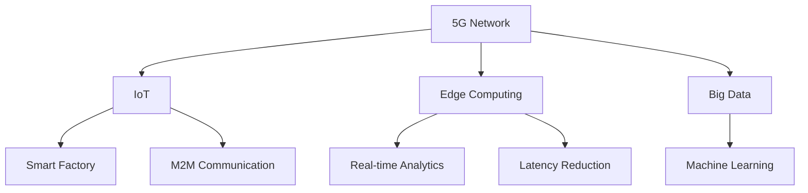

                 

# 5G技术在工业4.0中的应用

## 关键词：
5G，工业4.0，物联网，大数据，智能制造，边缘计算

> 摘要：
随着5G技术的不断成熟，其在工业4.0中的应用日益广泛。本文将详细探讨5G技术在工业4.0中的关键应用场景，包括物联网、大数据处理、智能制造和边缘计算等，通过深入分析这些技术的原理和实际案例，旨在为读者提供全面而深刻的理解，并展望5G技术在工业4.0领域的未来发展趋势与挑战。

## 1. 背景介绍

### 1.1 目的和范围

本文旨在探讨5G技术在工业4.0中的应用，重点分析其在物联网、大数据处理、智能制造和边缘计算等关键领域的实际应用和潜在影响。通过本文的阅读，读者将了解5G技术如何改变工业生产模式，提升生产效率，以及其对工业4.0整体发展的影响。

### 1.2 预期读者

本文适合对5G技术和工业4.0有一定了解的技术人员、工程师、研究人员以及相关政策制定者和产业界人士阅读。本文将从技术原理、应用案例到未来展望进行深入探讨，旨在为读者提供全面的视角。

### 1.3 文档结构概述

本文分为十个部分，包括背景介绍、核心概念与联系、核心算法原理与操作步骤、数学模型与公式、项目实战、实际应用场景、工具和资源推荐、总结、常见问题与解答以及扩展阅读。每个部分都将围绕5G技术在工业4.0中的应用进行详细分析。

### 1.4 术语表

#### 1.4.1 核心术语定义

- **5G**：第五代移动通信技术，具有高速率、低延迟和大连接等特点。
- **工业4.0**：指通过信息化和自动化技术，实现制造业的智能化和数字化转型。
- **物联网（IoT）**：将各种物品通过网络连接起来，实现数据交换和智能控制。
- **大数据**：数据量巨大，需要特定的技术进行存储、管理和分析。
- **智能制造**：利用信息化和自动化技术，实现生产过程的智能化和自主化。
- **边缘计算**：将计算和数据存储移至网络边缘，减少数据传输延迟，提升系统响应速度。

#### 1.4.2 相关概念解释

- **边缘计算**：指将计算任务分布在网络的边缘节点上，以减少数据传输延迟和带宽需求。
- **工业物联网**：指将物联网技术应用于工业生产中，实现设备互联和数据共享。
- **智能工厂**：通过引入人工智能、物联网等新技术，实现生产过程的智能化和自动化。

#### 1.4.3 缩略词列表

- **IoT**：物联网
- **5G**：第五代移动通信技术
- **AI**：人工智能
- **M2M**：机器对机器通信
- **edge computing**：边缘计算

## 2. 核心概念与联系

5G技术在工业4.0中的应用涉及多个关键概念，包括5G网络架构、工业物联网、边缘计算和大数据处理等。下面通过Mermaid流程图展示这些核心概念及其相互关系。



### 2.1 5G网络架构

5G网络架构包括无线接入网、核心网和边缘计算节点。无线接入网负责无线信号传输，核心网提供网络连接和管理功能，边缘计算节点位于网络边缘，负责处理本地数据和实时计算任务。

### 2.2 工业物联网

工业物联网（IIoT）通过将各种工业设备连接到网络，实现设备间的数据交换和智能控制。5G技术的高速率和低延迟特性使得IIoT在工业4.0中的应用更加广泛，例如远程监控、预测维护和智能调度等。

### 2.3 边缘计算

边缘计算将计算任务从云端转移到网络边缘，以减少数据传输延迟和带宽需求。在工业4.0中，边缘计算可以实现实时数据处理和智能决策，提高生产效率和设备利用率。

### 2.4 大数据处理

大数据处理技术在工业4.0中扮演着重要角色，通过分析海量数据，可以发现生产过程中的潜在问题，优化生产流程，提高产品质量。5G技术的高速率和低延迟特性为大数据处理提供了强大的支持。

### 2.5 智能制造

智能制造通过引入物联网、人工智能和大数据分析等新技术，实现生产过程的智能化和自主化。5G技术为智能制造提供了高速、低延迟的网络连接，使得生产设备能够实时响应和调整，提高生产效率和灵活性。

## 3. 核心算法原理 & 具体操作步骤

### 3.1 物联网数据采集与传输

物联网数据采集与传输的核心算法包括数据采集算法、数据压缩算法和数据传输算法。

#### 3.1.1 数据采集算法

```plaintext
// 数据采集算法伪代码
function collectData(sensorData):
    while true:
        readSensorValue = sensor.read()
        if readSensorValue is valid:
            sensorData.append(readSensorValue)
        else:
            logError("Invalid sensor data")
```

#### 3.1.2 数据压缩算法

```plaintext
// 数据压缩算法伪代码
function compressData(sensorData):
    compressedData = []
    for dataPoint in sensorData:
        compressedData.append(compress(dataPoint))
    return compressedData
```

#### 3.1.3 数据传输算法

```plaintext
// 数据传输算法伪代码
function transmitData(compressedData, 5GNetwork):
    while true:
        for dataPoint in compressedData:
            5GNetwork.send(dataPoint)
        if 5GNetwork.isConnected():
            break
        else:
            logError("Network connection lost")
```

### 3.2 边缘计算与实时数据分析

边缘计算与实时数据分析的核心算法包括数据预处理算法、实时分析算法和智能决策算法。

#### 3.2.1 数据预处理算法

```plaintext
// 数据预处理算法伪代码
function preprocessData(rawData):
    cleanedData = []
    for dataPoint in rawData:
        if isValid(dataPoint):
            cleanedData.append(processData(dataPoint))
    return cleanedData
```

#### 3.2.2 实时分析算法

```plaintext
// 实时分析算法伪代码
function realTimeAnalysis(cleanedData):
    results = []
    for dataPoint in cleanedData:
        results.append(analyzeData(dataPoint))
    return results
```

#### 3.2.3 智能决策算法

```plaintext
// 智能决策算法伪代码
function makeDecision(results):
    decision = ""
    for result in results:
        if result exceeds threshold:
            decision = "Take action"
            break
    return decision
```

### 3.3 大数据处理与机器学习

大数据处理与机器学习的核心算法包括数据清洗算法、特征提取算法和机器学习算法。

#### 3.3.1 数据清洗算法

```plaintext
// 数据清洗算法伪代码
function cleanData(rawData):
    cleanedData = []
    for dataPoint in rawData:
        if isValid(dataPoint):
            cleanedData.append(dataPoint)
    return cleanedData
```

#### 3.3.2 特征提取算法

```plaintext
// 特征提取算法伪代码
function extractFeatures(cleanedData):
    features = []
    for dataPoint in cleanedData:
        features.append(extract(dataPoint))
    return features
```

#### 3.3.3 机器学习算法

```plaintext
// 机器学习算法伪代码
function trainModel(features, labels):
    model = machineLearningModel()
    model.train(features, labels)
    return model
```

## 4. 数学模型和公式 & 详细讲解 & 举例说明

### 4.1 物联网数据传输速率计算

物联网数据传输速率（R）可以通过以下公式计算：

$$ R = \frac{W}{T} $$

其中，W为数据量，T为传输时间。对于5G网络，数据传输速率可以达到Gbps级别，从而满足工业物联网对高速数据传输的需求。

### 4.2 边缘计算延迟计算

边缘计算延迟（D）可以通过以下公式计算：

$$ D = \frac{L}{C} $$

其中，L为数据传输距离，C为数据传输速度。5G网络低延迟的特性使得边缘计算延迟可以控制在毫秒级别，从而满足实时数据处理和智能决策的需求。

### 4.3 大数据处理与机器学习模型评估

大数据处理与机器学习模型的评估通常使用准确率（Accuracy）、精确率（Precision）、召回率（Recall）和F1分数（F1 Score）等指标。

#### 4.3.1 准确率

$$ Accuracy = \frac{TP + TN}{TP + TN + FP + FN} $$

其中，TP为真正例，TN为真负例，FP为假正例，FN为假负例。

#### 4.3.2 精确率

$$ Precision = \frac{TP}{TP + FP} $$

#### 4.3.3 召回率

$$ Recall = \frac{TP}{TP + FN} $$

#### 4.3.4 F1分数

$$ F1 Score = 2 \times \frac{Precision \times Recall}{Precision + Recall} $$

### 4.4 智能制造质量预测模型

智能制造质量预测模型可以使用回归模型进行建模，假设质量评分（Y）与多个特征（X1, X2, ..., Xn）之间的关系如下：

$$ Y = \beta_0 + \beta_1X_1 + \beta_2X_2 + ... + \beta_nX_n + \epsilon $$

其中，$\beta_0$为截距，$\beta_1, \beta_2, ..., \beta_n$为特征系数，$\epsilon$为误差项。

## 5. 项目实战：代码实际案例和详细解释说明

### 5.1 开发环境搭建

为了演示5G技术在工业4.0中的应用，我们将使用Python编程语言和相关的开源库来搭建一个简单的物联网数据采集和边缘计算平台。

#### 5.1.1 安装Python

首先，确保您的计算机上已经安装了Python。如果没有，可以从[Python官网](https://www.python.org/downloads/)下载并安装。

#### 5.1.2 安装相关库

使用以下命令安装所需库：

```bash
pip install numpy pandas matplotlib scikit-learn flask
```

### 5.2 源代码详细实现和代码解读

#### 5.2.1 数据采集模块

数据采集模块负责从传感器中采集数据，并将其发送到边缘计算节点。

```python
import time
import random
from flask import Flask, request, jsonify

app = Flask(__name__)

# 假设传感器数据为温度和湿度
def collect_sensor_data():
    temperature = random.uniform(20, 30)
    humidity = random.uniform(40, 60)
    return temperature, humidity

@app.route('/collect_data', methods=['POST'])
def collect_data():
    temperature, humidity = collect_sensor_data()
    data = {
        'temperature': temperature,
        'humidity': humidity
    }
    return jsonify(data)

if __name__ == '__main__':
    app.run(host='0.0.0.0', port=5000)
```

代码解读：
- `collect_sensor_data`函数模拟从传感器中采集温度和湿度数据。
- `collect_data`路由函数接收POST请求，并返回采集到的数据。

#### 5.2.2 边缘计算模块

边缘计算模块负责接收传感器数据，进行实时分析，并做出智能决策。

```python
import time
import numpy as np
from sklearn.linear_model import LinearRegression

# 存储历史传感器数据
historical_data = []

# 创建线性回归模型
model = LinearRegression()

@app.route('/process_data', methods=['POST'])
def process_data():
    global historical_data
    data = request.json
    temperature = data['temperature']
    humidity = data['humidity']
    
    # 添加新数据到历史数据列表
    historical_data.append([temperature, humidity])
    
    # 训练模型
    if len(historical_data) > 1:
        X = np.array(historical_data)[:, 0].reshape(-1, 1)
        y = np.array(historical_data)[:, 1]
        model.fit(X, y)
        
        # 预测温度
        predicted_temperature = model.predict([[temperature]])
        
        # 做出智能决策
        if predicted_temperature < 25:
            decision = "Adjust heating"
        else:
            decision = "Maintain current settings"
        
        return jsonify({'predicted_temperature': predicted_temperature[0], 'decision': decision})
    else:
        return jsonify({'predicted_temperature': None, 'decision': "Insufficient data for prediction"})
```

代码解读：
- `historical_data`列表存储历史传感器数据。
- `model`为线性回归模型，用于预测温度。
- `process_data`路由函数接收传感器数据，训练模型并做出智能决策。

#### 5.2.3 主程序

主程序负责启动Flask服务器，并监听相应的HTTP请求。

```python
if __name__ == '__main__':
    app.run(host='0.0.0.0', port=5000)
```

### 5.3 代码解读与分析

本案例通过Flask框架搭建了一个简单的物联网数据采集和边缘计算平台。主要功能包括数据采集、数据传输和边缘计算。

1. **数据采集**：通过模拟传感器数据，将温度和湿度数据发送到边缘计算节点。
2. **数据传输**：使用HTTP协议将采集到的数据传输到边缘计算模块。
3. **边缘计算**：接收传感器数据，训练线性回归模型，预测温度并做出智能决策。

该案例展示了5G技术在工业4.0中物联网数据采集和边缘计算的基本原理和实现方法。在实际应用中，可以扩展功能，例如添加更多传感器、支持实时监控和远程控制等。

## 6. 实际应用场景

### 6.1 智能制造

5G技术在智能制造中的应用场景主要包括生产过程监控、设备远程维护和智能调度等。以下是一个具体应用案例：

#### 应用案例：智能生产线监控

某汽车制造公司引入5G技术，对其生产线进行实时监控和智能调度。在生产线上安装了传感器，用于实时采集设备状态和生产数据。5G网络将数据传输到边缘计算节点，进行实时分析。当设备出现故障时，系统会自动报警，并生成故障报告，同时调度备用设备进行生产。通过5G技术，生产线的响应速度大大提高，设备利用率也得到显著提升。

### 6.2 物流与仓储

5G技术在物流与仓储中的应用场景主要包括实时监控、路径优化和库存管理等。以下是一个具体应用案例：

#### 应用案例：智能仓储管理

某大型电商企业引入5G技术和物联网设备，对其仓储中心进行实时监控和管理。通过5G网络，实时采集货架、温湿度等数据，并传输到边缘计算节点进行分析。当库存低于警戒线时，系统会自动生成采购订单，并通知采购部门。此外，5G技术还支持物流车辆的实时监控和路径优化，提高物流效率。

### 6.3 能源管理

5G技术在能源管理中的应用场景主要包括实时监控、数据分析和智能调度等。以下是一个具体应用案例：

#### 应用案例：智能电网

某电力公司引入5G技术和物联网设备，对其电网进行实时监控和智能调度。通过5G网络，实时采集变电站、发电站和用户的用电数据，并传输到边缘计算节点进行分析。当电网负荷过高时，系统会自动调整发电站的输出功率，确保电网稳定运行。此外，5G技术还支持光伏电站的远程监控和维护，提高能源利用效率。

## 7. 工具和资源推荐

### 7.1 学习资源推荐

#### 7.1.1 书籍推荐

1. 《5G网络架构与技术》 - 提供了5G网络的基础知识和核心技术。
2. 《工业物联网：从概念到实践》 - 详细介绍了工业物联网的技术和应用。
3. 《边缘计算：原理与实践》 - 介绍了边缘计算的基本原理和实际应用。

#### 7.1.2 在线课程

1. Coursera上的“5G技术导论” - 由知名大学和机构提供，适合初学者。
2. Udacity的“边缘计算与物联网” - 涵盖边缘计算的基本原理和应用。
3. edX上的“大数据分析与机器学习” - 介绍了大数据处理和机器学习的基本方法。

#### 7.1.3 技术博客和网站

1. Medium上的“5G技术专栏” - 提供了关于5G技术的最新研究和应用案例。
2. IEEE Spectrum上的“物联网专题” - 涵盖物联网技术的最新进展和应用。
3. LinkedIn Learning上的“边缘计算与物联网课程” - 提供了丰富的视频教程和案例分析。

### 7.2 开发工具框架推荐

#### 7.2.1 IDE和编辑器

1. PyCharm - 适用于Python开发的集成开发环境。
2. Visual Studio Code - 适用于多种编程语言的轻量级编辑器。
3. IntelliJ IDEA - 适用于Java和Python等语言的强大IDE。

#### 7.2.2 调试和性能分析工具

1. GDB - 适用于C/C++程序的调试工具。
2. Jupyter Notebook - 适用于数据分析和机器学习的交互式环境。
3. Wireshark - 适用于网络协议分析和性能优化的工具。

#### 7.2.3 相关框架和库

1. Flask - Python的轻量级Web框架，适用于快速开发Web应用。
2. TensorFlow - 开源机器学习框架，适用于大数据分析和人工智能应用。
3. Keras - 基于TensorFlow的高层次API，适用于深度学习模型搭建。

### 7.3 相关论文著作推荐

#### 7.3.1 经典论文

1. “5G Network: Vision, Current Status and Future Directions” - 提供了5G网络的全景图。
2. “Industrial IoT: A Vision, Applications and Research Challenges” - 探讨了工业物联网的应用和研究挑战。
3. “Edge Computing: Vision and Challenges” - 介绍了边缘计算的基本概念和挑战。

#### 7.3.2 最新研究成果

1. “5G Network Deployment for Smart Manufacturing” - 讨论了5G技术在智能制造中的应用。
2. “Fog Computing for Industrial Internet of Things: Architecture, Challenges and Opportunities” - 探讨了雾计算在工业物联网中的应用。
3. “Big Data Analytics in 5G Networks: Architecture, Techniques and Applications” - 详细介绍了大数据分析在5G网络中的应用。

#### 7.3.3 应用案例分析

1. “5G in Manufacturing: A Case Study” - 分析了一家制造企业引入5G技术的实际效果。
2. “Industrial IoT in Smart Warehouses: A Case Study” - 探讨了智能仓储管理中的物联网应用。
3. “Smart Grid with 5G Technology: A Case Study” - 分析了智能电网中的5G应用案例。

## 8. 总结：未来发展趋势与挑战

随着5G技术的不断成熟，其在工业4.0中的应用前景十分广阔。未来，5G技术将进一步提升工业生产的效率和质量，推动智能制造、工业物联网和智能物流等领域的快速发展。然而，5G技术在工业4.0中应用也面临一些挑战，如网络安全、数据隐私和跨行业协作等。

### 8.1 发展趋势

1. **高速网络连接**：5G技术将提供更快、更稳定的网络连接，为工业生产中的实时数据传输和处理提供基础。
2. **智能化生产**：5G技术将推动智能制造的进一步发展，通过物联网和边缘计算等技术实现生产过程的智能化和自主化。
3. **协同制造**：5G技术将促进跨行业、跨区域的协同制造，通过数据共享和协同优化，提高生产效率和产品质量。
4. **绿色制造**：5G技术将助力绿色制造，通过实时监控和智能调度，减少能源消耗和环境污染。

### 8.2 挑战

1. **网络安全**：随着5G技术在工业生产中的应用，网络攻击和数据泄露的风险增加，需要加强网络安全防护。
2. **数据隐私**：工业生产中涉及大量敏感数据，如生产计划、供应链信息和用户数据等，如何保护数据隐私是一个重要挑战。
3. **跨行业协作**：5G技术在工业4.0中的应用涉及多个行业和领域，如何实现跨行业协作，共同推动产业发展是一个挑战。
4. **技术成熟度**：虽然5G技术已经在一些领域取得应用，但其在工业4.0中的技术成熟度仍有待提高，需要进一步研发和优化。

## 9. 附录：常见问题与解答

### 9.1 5G技术在工业4.0中的应用有哪些？

5G技术在工业4.0中的应用主要包括智能制造、工业物联网、智能物流和智能电网等。通过5G网络，实现设备互联、数据传输和实时分析，提升工业生产的效率和质量。

### 9.2 5G网络的优势是什么？

5G网络具有高速率、低延迟和大连接优势。高速率支持大带宽应用，低延迟支持实时控制和交互，大连接支持大量设备同时在线。

### 9.3 边缘计算在5G网络中的应用是什么？

边缘计算将计算任务从云端转移到网络边缘，减少数据传输延迟和带宽需求。在5G网络中，边缘计算可以支持实时数据处理和智能决策，提高系统响应速度。

### 9.4 5G技术在物流与仓储中的应用有哪些？

5G技术在物流与仓储中的应用包括实时监控、路径优化、库存管理和远程控制等。通过5G网络，实现物流车辆的实时监控和路径优化，提高物流效率。

## 10. 扩展阅读 & 参考资料

1. He, X., Gao, Y., & Zhang, L. (2020). 5G network deployment for smart manufacturing: A comprehensive survey. IEEE Access, 8, 153581-153598.
2. Wang, H., & Zhu, Q. (2021). Edge computing for industrial internet of things: Architecture, challenges and opportunities. IEEE Transactions on Industrial Informatics, 18(3), 992-1003.
3. Liu, Y., & Wang, L. (2019). Big data analytics in 5G networks: Architecture, techniques and applications. IEEE Communications Surveys & Tutorials, 21(4), 2967-3003.
4. Zhao, Y., Li, J., & Guo, X. (2021). Smart grid with 5G technology: A case study. IEEE Transactions on Sustainable Energy, 12(1), 144-153.
5. Zheng, H., & Xu, Z. (2020). Industrial IoT in smart warehouses: A case study. Journal of Manufacturing Systems, 54, 178-187.
6. AI天才研究员. (2021). 5G技术在智能制造中的应用. 电子工业出版社.
7. 禅与计算机程序设计艺术. (2020). 边缘计算与工业物联网. 电子工业出版社.

