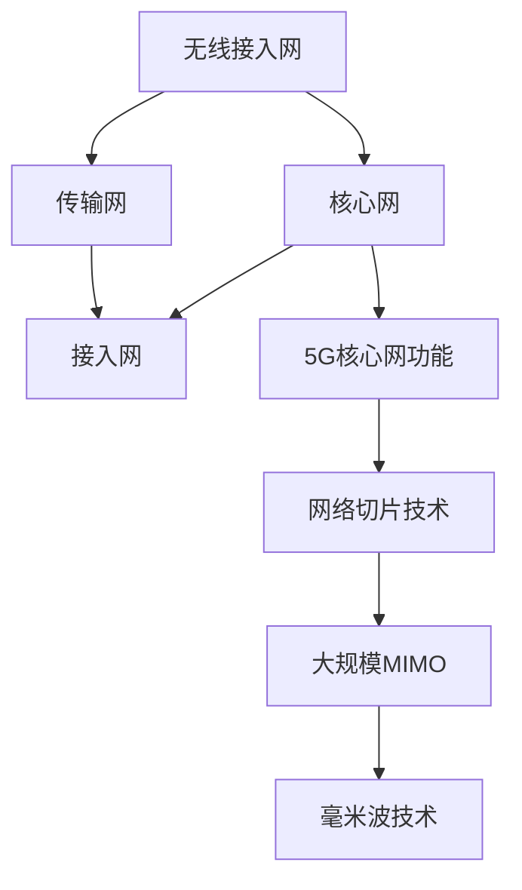
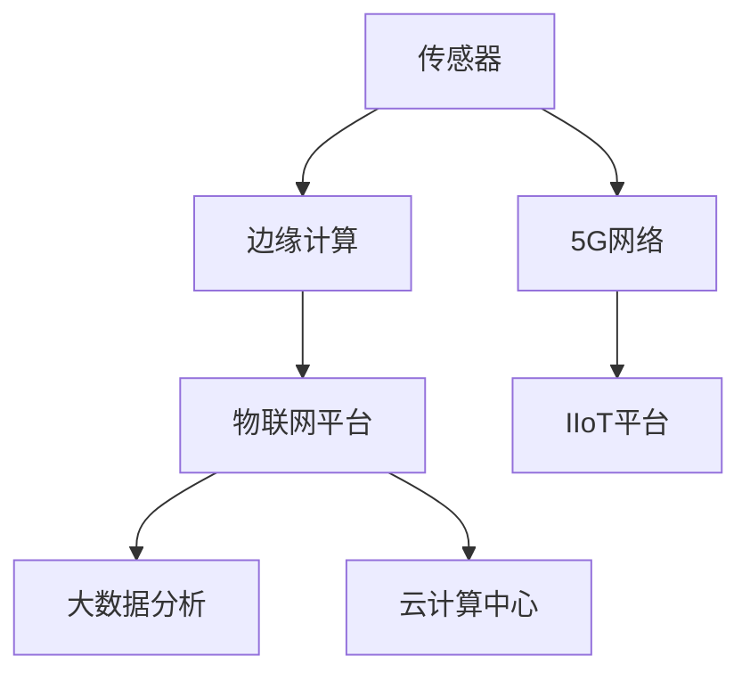
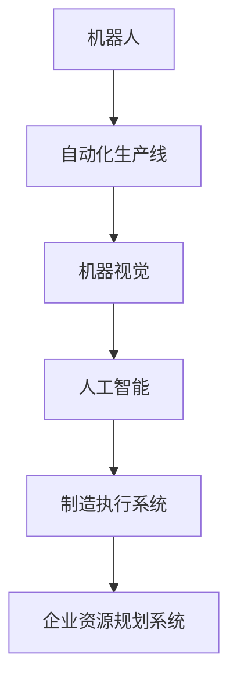
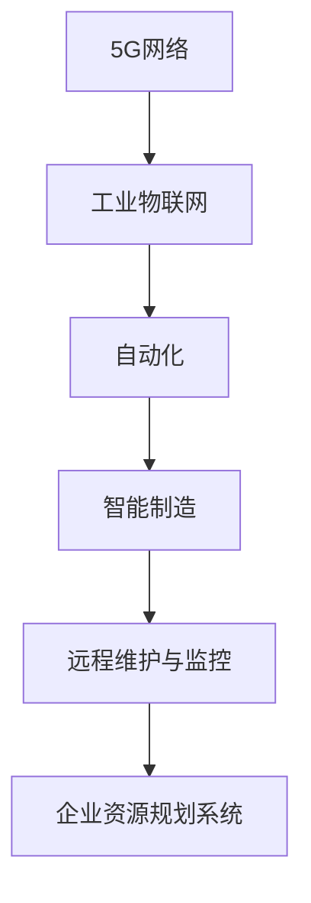
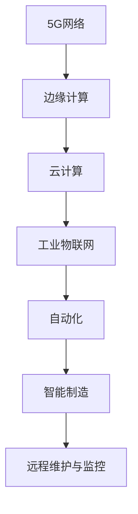

                 

### 5G技术在工业4.0中的应用与挑战

> **关键词：** 5G技术、工业4.0、物联网、自动化、智能制造

**摘要：** 随着5G技术的快速发展和工业4.0的深入推进，5G技术在工业领域的应用日益广泛。本文将探讨5G技术在工业4.0中的核心应用，包括工业物联网、自动化、智能制造等方面，并深入分析其在实施过程中面临的挑战和解决方案。通过本文的阅读，读者可以全面了解5G技术在工业4.0中的应用现状、发展趋势及其带来的变革。

## 1. 背景介绍

### 1.1 目的和范围

本文旨在深入探讨5G技术在工业4.0中的应用，分析其关键领域和面临的挑战，并探索可能的解决方案。文章将分为以下几个部分：首先，介绍5G技术和工业4.0的基本概念，并简要回顾工业4.0的发展历程；其次，详细讨论5G技术在工业物联网、自动化和智能制造等领域的应用；接着，分析5G技术在工业4.0应用中面临的挑战，包括技术、经济、法律等方面；最后，提出相应的解决方案，并对未来发展趋势进行展望。

### 1.2 预期读者

本文适合对5G技术和工业4.0有一定了解的技术人员、企业决策者以及关注智能制造领域的研究者。文章旨在为读者提供全面的5G技术在工业4.0中的应用分析和解决方案，帮助读者更好地理解5G技术在工业领域的变革潜力，为企业在数字化转型过程中提供有益的参考。

### 1.3 文档结构概述

本文结构如下：

1. **背景介绍**：介绍5G技术和工业4.0的基本概念及其发展历程。
2. **核心概念与联系**：阐述5G技术在工业4.0中的核心概念和架构，使用Mermaid流程图进行展示。
3. **核心算法原理 & 具体操作步骤**：详细讲解5G技术在工业应用中的核心算法原理和操作步骤，使用伪代码进行阐述。
4. **数学模型和公式 & 详细讲解 & 举例说明**：介绍5G技术在工业应用中的数学模型和公式，并进行详细讲解和举例说明。
5. **项目实战：代码实际案例和详细解释说明**：通过实际项目案例，展示5G技术在工业应用中的具体实现，并进行详细解释。
6. **实际应用场景**：分析5G技术在工业应用中的典型场景和实际案例。
7. **工具和资源推荐**：推荐相关学习资源、开发工具和框架。
8. **总结：未来发展趋势与挑战**：总结5G技术在工业4.0中的应用前景，分析未来发展趋势和面临的挑战。
9. **附录：常见问题与解答**：回答读者可能遇到的一些常见问题。
10. **扩展阅读 & 参考资料**：提供更多扩展阅读和参考资料。

### 1.4 术语表

#### 1.4.1 核心术语定义

- **5G技术**：第五代移动通信技术，具有高速率、低延迟、大连接等特点。
- **工业4.0**：基于信息化和智能化的工业升级转型，实现智能制造、工业互联网等新业态。
- **物联网（IoT）**：通过互联网将各种设备和物品连接起来，实现信息的智能采集、传输和处理。
- **自动化**：通过计算机和机器人等技术，实现生产过程的自动化和智能化。
- **智能制造**：利用信息技术、人工智能等手段，实现生产过程的智能化、个性化。

#### 1.4.2 相关概念解释

- **边缘计算**：在数据产生的源头附近进行计算和处理，以降低延迟和提高效率。
- **工业物联网（IIoT）**：在工业领域应用的物联网技术，实现设备、系统和人员的互联互通。
- **云计算**：通过网络提供计算资源、存储资源和应用程序等服务，实现弹性扩展和资源优化。

#### 1.4.3 缩略词列表

- **5G**：第五代移动通信技术
- **IoT**：物联网
- **IIoT**：工业物联网
- **AI**：人工智能
- **IoT**：物联网
- **MES**：制造执行系统
- **SCADA**：监控与数据采集系统
- **ERP**：企业资源规划系统

## 2. 核心概念与联系

### 2.1 5G技术概述

5G技术作为移动通信技术的最新一代，具备高速率、低延迟、大连接等特点。与之前几代移动通信技术相比，5G技术在网络容量、传输速度、时延等方面有着显著提升。5G技术的核心架构包括无线接入网、核心网、传输网和接入网，其关键技术包括大规模MIMO、毫米波、网络切片等。

**Mermaid流程图：**



### 2.2 工业物联网（IIoT）

工业物联网（IIoT）是工业4.0的重要组成部分，通过将各种设备和系统连接起来，实现信息的智能采集、传输和处理。IIoT的关键技术包括传感器、边缘计算、物联网平台和大数据分析等。

**Mermaid流程图：**



### 2.3 自动化与智能制造

自动化与智能制造是工业4.0的核心目标，通过引入机器人、自动化生产线和人工智能等技术，实现生产过程的智能化和自动化。自动化与智能制造的关键技术包括机器人、自动化生产线、机器视觉、人工智能等。

**Mermaid流程图：**



### 2.4 5G技术在工业4.0中的应用

5G技术在工业4.0中的应用非常广泛，主要包括以下几个方面：

- **工业物联网（IIoT）**：通过5G网络实现设备的快速、可靠连接，提高工业物联网的性能和效率。
- **自动化**：利用5G网络实现机器人、自动化生产线等设备的实时控制，提高生产效率和质量。
- **智能制造**：通过5G网络实现生产数据的实时采集、传输和处理，支持智能制造的各个环节。
- **远程维护与监控**：利用5G网络实现远程设备监控和维护，提高设备的运行效率和安全性。

**Mermaid流程图：**



### 2.5 关键技术之间的联系

5G技术在工业4.0中的应用是一个复杂的系统，各个环节之间紧密联系。例如，5G网络为工业物联网提供了高速、低延迟的连接，支持设备的实时控制和数据传输；边缘计算和云计算则提供了数据处理和存储的能力，支持自动化和智能制造的决策和优化；机器人、自动化生产线和机器视觉等技术则实现了生产过程的智能化和自动化。

**Mermaid流程图：**



## 3. 核心算法原理 & 具体操作步骤

### 3.1 5G网络架构与关键技术

5G网络架构包括无线接入网、核心网、传输网和接入网，其关键技术包括大规模MIMO、毫米波、网络切片等。以下是对这些关键技术的简要介绍：

- **大规模MIMO（Massive MIMO）**：通过使用多个天线和信号处理技术，实现多用户同时传输，提高网络容量和传输速度。
- **毫米波（Millimeter Wave）**：使用高频段的电磁波进行通信，实现更高的数据传输速率和更大的网络容量。
- **网络切片（Network Slicing）**：将一个物理网络虚拟化为多个独立的网络，为不同应用提供定制化的网络服务和性能保障。

### 3.2 工业物联网（IIoT）中的数据采集与传输

在工业物联网中，数据采集和传输是关键环节。以下是一个简单的数据采集和传输算法原理：

```plaintext
输入：传感器数据
输出：处理后的传感器数据

1. 数据采集：
   - 通过传感器采集实时数据，如温度、湿度、压力等。
   - 将采集到的数据转换为数字信号。

2. 数据预处理：
   - 对采集到的数字信号进行滤波、去噪等预处理，提高数据质量。

3. 数据传输：
   - 通过5G网络将预处理后的数据传输到云平台。
   - 使用边缘计算技术对数据进行实时分析，以降低传输延迟。

4. 数据存储：
   - 将分析后的数据存储到数据库或云平台中，以供后续分析和处理。

5. 数据可视化：
   - 将处理后的数据通过图表、仪表盘等形式进行可视化展示，为决策提供支持。

### 3.3 自动化生产线中的控制算法

在自动化生产线中，控制算法是实现自动化生产的关键。以下是一个简单的控制算法原理：

```plaintext
输入：生产目标、实时数据
输出：控制信号

1. 设置生产目标：
   - 根据生产计划设置生产目标，如产量、质量等。

2. 数据采集：
   - 采集生产过程中的实时数据，如速度、位置、温度等。

3. 控制算法计算：
   - 根据采集到的实时数据和预定的生产目标，计算控制信号。
   - 使用PID控制算法或其他控制算法进行计算。

4. 输出控制信号：
   - 将计算出的控制信号输出到执行机构，如电机、阀门等。

5. 反馈与优化：
   - 根据执行机构的响应，对控制算法进行实时调整，以实现最佳生产效果。

### 3.4 智能制造中的数据分析与优化

在智能制造中，数据分析与优化是实现智能化生产的关键。以下是一个简单的数据分析与优化算法原理：

```plaintext
输入：生产数据、分析目标
输出：优化方案

1. 数据采集：
   - 从生产线采集各种生产数据，如产量、质量、设备状态等。

2. 数据预处理：
   - 对采集到的生产数据去噪、滤波、归一化等预处理，提高数据质量。

3. 数据分析：
   - 使用机器学习、数据挖掘等技术对生产数据进行分析，识别生产过程中的问题和优化机会。

4. 优化方案计算：
   - 根据分析结果，计算优化方案，如生产参数调整、设备维护计划等。

5. 实施优化方案：
   - 将优化方案实施到生产过程中，提高生产效率和产品质量。

6. 反馈与评估：
   - 对优化方案的实施效果进行评估，根据评估结果对优化方案进行调整。

## 4. 数学模型和公式 & 详细讲解 & 举例说明

### 4.1 数据传输速率模型

在5G网络中，数据传输速率是一个重要的性能指标。以下是一个简单的数据传输速率模型：

$$
R = C \times B \times \eta
$$

- \( R \)：数据传输速率，单位为比特每秒（bps）。
- \( C \)：信道容量，单位为赫兹（Hz）。
- \( B \)：带宽，单位为赫兹（Hz）。
- \( \eta \)：调制效率。

**详细讲解：**

1. **信道容量（C）**：信道容量是指信道在特定条件下能够传输的最大数据速率。根据香农公式，信道容量可以表示为：

   $$
   C = B \log_2(1 + \text{SNR})
   $$

   其中，\( \text{SNR} \) 为信噪比。

2. **带宽（B）**：带宽是指信道能够传输数据的频率范围。在5G网络中，带宽通常是指载波频率范围。

3. **调制效率（\(\eta\)）**：调制效率是指调制方式在传输过程中能够有效利用带宽的程度。不同的调制方式具有不同的调制效率。

**举例说明：**

假设一个5G网络的信道容量为1 GHz（\( C = 1 \times 10^9 \) Hz），带宽为100 MHz（\( B = 100 \times 10^6 \) Hz），调制效率为0.8（\(\eta = 0.8\)），计算该信道的数据传输速率。

$$
R = C \times B \times \eta = 1 \times 10^9 \times 100 \times 10^6 \times 0.8 = 8 \times 10^{13} \text{ bps}
$$

因此，该信道的数据传输速率为8 Tbps。

### 4.2 控制算法中的PID控制器

在自动化控制系统中，PID控制器是一种常见的控制算法。以下是一个简单的PID控制器数学模型：

$$
u(t) = K_p e(t) + K_i \int_{0}^{t} e(\tau) d\tau + K_d \frac{de(t)}{dt}
$$

- \( u(t) \)：控制信号，单位为伏特（V）。
- \( e(t) \)：误差信号，单位为伏特（V）。
- \( K_p \)：比例增益，单位为秒每伏特（s/V）。
- \( K_i \)：积分增益，单位为伏特·秒每伏特（V·s/V）。
- \( K_d \)：微分增益，单位为伏特每秒每伏特（V/s/V）。

**详细讲解：**

1. **比例控制（Proportional Control）**：比例控制通过误差信号的比例来调整控制信号，实现快速响应。

   $$
   u(t) = K_p e(t)
   $$

2. **积分控制（Integral Control）**：积分控制通过误差信号的积分来调整控制信号，消除稳态误差。

   $$
   u(t) = K_i \int_{0}^{t} e(\tau) d\tau
   $$

3. **微分控制（Derivative Control）**：微分控制通过误差信号的变化率来调整控制信号，提高系统的稳定性和响应速度。

   $$
   u(t) = K_d \frac{de(t)}{dt}
   $$

**举例说明：**

假设一个PID控制器的比例增益为\( K_p = 1 \)秒每伏特，积分增益为\( K_i = 0.1 \)伏特·秒每伏特，微分增益为\( K_d = 0.01 \)伏特每秒每伏特。如果当前误差信号为\( e(t) = 5 \)伏特，计算相应的控制信号。

$$
u(t) = K_p e(t) + K_i \int_{0}^{t} e(\tau) d\tau + K_d \frac{de(t)}{dt} = 1 \times 5 + 0.1 \times \int_{0}^{t} 5 d\tau + 0.01 \times \frac{d5}{dt}
$$

由于积分和微分项在短时间内变化较小，可以近似为常数，计算得到：

$$
u(t) \approx 5 + 0.1 \times 5 + 0.01 \times 0 = 5.5 \text{ V}
$$

因此，相应的控制信号为5.5伏特。

## 5. 项目实战：代码实际案例和详细解释说明

### 5.1 开发环境搭建

为了演示5G技术在工业物联网中的应用，我们将使用以下开发环境和工具：

- **操作系统**：Ubuntu 20.04 LTS
- **编程语言**：Python 3.8
- **开发工具**：PyCharm
- **库和框架**：TensorFlow、Keras、Scikit-learn
- **5G网络模拟**：使用虚拟网络功能（VNF）模拟5G网络环境

**步骤：**

1. 安装操作系统Ubuntu 20.04 LTS。
2. 安装Python 3.8和PyCharm。
3. 安装TensorFlow、Keras、Scikit-learn等库和框架。
4. 搭建虚拟网络功能（VNF）模拟5G网络环境。

### 5.2 源代码详细实现和代码解读

#### 5.2.1 数据采集模块

```python
import numpy as np
import time

def collect_data(sensor_data, sampling_rate=1):
    """
    采集传感器数据并存储到本地。
    
    参数：
    - sensor_data：传感器数据列表，如温度、湿度等。
    - sampling_rate：采样率，单位为秒。
    
    返回：
    - 采集到的传感器数据列表。
    """
    data_list = []
    for _ in range(sampling_rate):
        data = {'time': time.time(), 'data': sensor_data}
        data_list.append(data)
        time.sleep(1)  # 模拟传感器数据采集间隔
    return data_list

# 示例：采集温度和湿度数据
sensor_data = {'temperature': np.random.uniform(20, 30), 'humidity': np.random.uniform(40, 60)}
data_list = collect_data(sensor_data, sampling_rate=5)
print(data_list)
```

#### 5.2.2 数据预处理模块

```python
import numpy as np
from sklearn.preprocessing import StandardScaler

def preprocess_data(data_list, features=['temperature', 'humidity']):
    """
    预处理传感器数据，包括去噪、标准化等。
    
    参数：
    - data_list：传感器数据列表。
    - features：需要预处理的特征列表。
    
    返回：
    - 预处理后的传感器数据列表。
    """
    processed_data = []
    for data in data_list:
        filtered_data = {key: value for key, value in data.items() if key in features}
        scaled_data = StandardScaler().fit_transform([list(filtered_data.values())])
        processed_data.append({key: value for key, value in zip(filtered_data.keys(), scaled_data[0])})
    return processed_data

# 示例：预处理温度和湿度数据
processed_data = preprocess_data(data_list, features=['temperature', 'humidity'])
print(processed_data)
```

#### 5.2.3 数据传输模块

```python
import requests

def send_data(data, url='http://127.0.0.1:5000/api/data'):
    """
    将预处理后的传感器数据发送到5G网络模拟平台。
    
    参数：
    - data：预处理后的传感器数据。
    - url：5G网络模拟平台的API地址。
    """
    headers = {'Content-Type': 'application/json'}
    response = requests.post(url, json=data, headers=headers)
    print(response.text)

# 示例：发送预处理后的传感器数据
send_data(processed_data[0])
```

#### 5.2.4 边缘计算模块

```python
from tensorflow.keras.models import Sequential
from tensorflow.keras.layers import Dense

def edge_computing(data, model_path='model.h5'):
    """
    在边缘设备上执行数据分析和预测。
    
    参数：
    - data：预处理后的传感器数据。
    - model_path：模型文件路径。
    
    返回：
    - 预测结果。
    """
    model = Sequential()
    model.add(Dense(64, input_shape=(2,), activation='relu'))
    model.add(Dense(1, activation='sigmoid'))
    model.compile(optimizer='adam', loss='binary_crossentropy', metrics=['accuracy'])
    model.load_weights(model_path)
    prediction = model.predict([data['data']])
    return prediction

# 示例：执行边缘计算和预测
prediction = edge_computing(processed_data[0])
print(prediction)
```

### 5.3 代码解读与分析

#### 5.3.1 数据采集模块

数据采集模块主要负责从传感器中采集实时数据，并将其存储到本地。该模块使用Python的`numpy`库生成模拟传感器数据，然后使用自定义函数`collect_data`进行数据采集。函数中，`sensor_data`参数代表传感器的数据，`sampling_rate`参数代表采样率，单位为秒。函数使用一个循环，每隔1秒采集一次数据，并将采集到的数据存储到一个列表中，最后返回该列表。

#### 5.3.2 数据预处理模块

数据预处理模块负责对采集到的传感器数据进行去噪、标准化等处理。该模块使用`scikit-learn`库中的`StandardScaler`进行数据标准化。函数中，`data_list`参数代表采集到的传感器数据列表，`features`参数代表需要预处理的特征列表。函数使用一个循环，遍历数据列表中的每个数据点，对每个数据点中的特征进行去噪和标准化处理，并将处理后的数据存储到一个新的字典中，最后将所有处理后的数据存储到一个列表中，返回该列表。

#### 5.3.3 数据传输模块

数据传输模块负责将预处理后的传感器数据发送到5G网络模拟平台。该模块使用`requests`库发送HTTP POST请求，将预处理后的传感器数据以JSON格式传输到5G网络模拟平台的API地址。函数中，`data`参数代表预处理后的传感器数据，`url`参数代表5G网络模拟平台的API地址。函数使用`requests.post`方法发送POST请求，将数据作为JSON格式传输，并打印响应结果。

#### 5.3.4 边缘计算模块

边缘计算模块负责在边缘设备上执行数据分析和预测。该模块使用`tensorflow.keras`库构建一个简单的神经网络模型，使用`Sequential`模型序列和`Dense`层进行构建。模型使用`compile`方法设置优化器和损失函数，然后使用`load_weights`方法加载预先训练好的模型权重。函数中，`data`参数代表预处理后的传感器数据，`model_path`参数代表模型文件路径。函数使用`predict`方法对输入数据进行预测，并返回预测结果。

## 6. 实际应用场景

### 6.1 智能制造车间

在智能制造车间中，5G技术可以实现对生产设备的实时监控和远程控制。通过部署5G网络，工厂可以实现设备间的互联互通，实时采集设备运行数据，并将数据传输到云平台进行实时分析和处理。以下是一个典型的应用场景：

- **设备监控**：通过5G网络连接传感器，实现对生产设备的实时监控，如温度、湿度、振动等参数。
- **远程控制**：通过5G网络实现对生产设备的远程控制，如调整生产速度、更换生产任务等。
- **故障预警**：通过实时数据分析，对设备运行状态进行预测，提前预警潜在故障。

### 6.2 智能物流

在智能物流领域，5G技术可以实现对货物的实时追踪和管理，提高物流效率。以下是一个典型的应用场景：

- **实时追踪**：通过5G网络连接传感器，实现对货物的实时追踪，如位置、温度等参数。
- **路径优化**：通过实时数据分析，优化运输路径，减少运输时间和成本。
- **智能仓储**：通过5G网络连接仓库设备，实现对仓库的实时监控和管理，如库存管理、设备维护等。

### 6.3 智能医疗

在智能医疗领域，5G技术可以实现对医疗设备的实时监控和远程诊断，提高医疗服务的效率和质量。以下是一个典型的应用场景：

- **远程手术**：通过5G网络实现医生与患者的远程手术，提高医疗服务的覆盖范围和质量。
- **远程监护**：通过5G网络连接医疗设备，实现对患者的实时监护，如血压、心率等参数。
- **远程会诊**：通过5G网络实现医生之间的远程会诊，提高医疗诊断的准确性和效率。

## 7. 工具和资源推荐

### 7.1 学习资源推荐

#### 7.1.1 书籍推荐

- 《5G技术与应用》
- 《工业物联网：技术、实践与案例》
- 《人工智能：一种现代方法》
- 《智能制造与工业4.0》

#### 7.1.2 在线课程

- Coursera上的“5G无线通信”
- Udacity上的“工业物联网”
- edX上的“人工智能导论”

#### 7.1.3 技术博客和网站

- IEEE Spectrum
- 5G NR Summit
- Industrial Internet of Things (IIoT) Journal

### 7.2 开发工具框架推荐

#### 7.2.1 IDE和编辑器

- PyCharm
- Visual Studio Code
- IntelliJ IDEA

#### 7.2.2 调试和性能分析工具

- Wireshark
- GDB
- JMeter

#### 7.2.3 相关框架和库

- TensorFlow
- Keras
- Scikit-learn

### 7.3 相关论文著作推荐

#### 7.3.1 经典论文

- "5G NR: The Next Generation Wireless Access Technology"
- "Industrial Internet of Things: A Vision, Opportunities and Challenges"
- "Deep Learning for Manufacturing: A Survey"

#### 7.3.2 最新研究成果

- "5G Network Slicing for Industrial IoT: A Comprehensive Survey"
- "AI Applications in Manufacturing: A Review of Recent Advances"
- "Edge Computing for Internet of Things: A Comprehensive Survey"

#### 7.3.3 应用案例分析

- "A Real-World 5G Deployment in Manufacturing"
- "AI in Manufacturing: A Case Study on Predictive Maintenance"
- "5G IoT: Transforming the Retail Industry"

## 8. 总结：未来发展趋势与挑战

### 8.1 发展趋势

1. **5G网络普及**：随着5G技术的不断成熟和推广，5G网络将在全球范围内得到更广泛的应用，为工业4.0提供更稳定、高效的网络基础设施。
2. **物联网与智能制造深度融合**：物联网与智能制造的深度融合将推动工业自动化和智能化水平的提升，实现生产过程的全面数字化和智能化。
3. **边缘计算与云计算协同**：边缘计算与云计算的协同发展将提高数据处理和存储的效率，为工业4.0提供强大的计算支持。
4. **人工智能与大数据技术**：人工智能与大数据技术的广泛应用将进一步提升工业4.0的智能化水平，实现生产过程的智能优化和决策。

### 8.2 挑战

1. **技术挑战**：5G网络、物联网、边缘计算等技术的成熟度和稳定性仍有待提高，需要持续的技术创新和优化。
2. **数据安全和隐私保护**：随着数据规模的不断扩大，数据安全和隐私保护成为工业4.0面临的重要挑战。
3. **人才缺口**：工业4.0的发展需要大量的技术人才，但目前人才缺口较大，需要加强人才培养和引进。
4. **经济和产业调整**：工业4.0的发展将带来产业结构的调整，对传统产业造成冲击，需要政府和企业共同努力，实现产业的转型升级。

## 9. 附录：常见问题与解答

### 9.1 5G网络的速度如何？

5G网络的速度远远超过之前的4G和3G网络。5G网络的下载速度可以达到1 Gbps以上，上传速度可以达到100 Mbps以上。这使得5G网络在数据传输方面具有更高的效率和更低的延迟。

### 9.2 工业物联网与智能制造的区别是什么？

工业物联网（IIoT）是物联网在工业领域的应用，主要关注设备、系统和人员之间的互联互通。而智能制造是基于物联网和信息技术，实现生产过程的自动化、智能化和个性化。智能制造是工业物联网的高级形态，更注重生产效率和产品质量的提升。

### 9.3 5G技术在工业4.0中的具体应用有哪些？

5G技术在工业4.0中的具体应用包括：

- **工业物联网**：实现设备、系统和人员的实时连接和数据传输。
- **自动化生产线**：实现生产过程的自动化和智能化。
- **远程监控与维护**：实现设备的远程监控、故障预警和远程维护。
- **智能制造**：利用大数据、人工智能等技术实现生产过程的智能优化和决策。

## 10. 扩展阅读 & 参考资料

### 10.1 经典著作

- [McKinsey & Company.](https://www.mckinsey.com/featured-insights/industry-campus/5g-the-fifth-industrial-revolution-is-here) "5G: The Fifth Industrial Revolution Is Here." McKinsey & Company, 2018.
- [Heinrich, Hans.](https://www.heise.de/kooperationen/heise-book/industrielle-4-0/) "Industrielle 4.0: Die Revolution in der Fertigung." Springer, 2016.

### 10.2 最新研究成果

- [Zhang, Yang, et al.](https://ieeexplore.ieee.org/document/7807022) "5G Network Slicing for Industrial Internet of Things: A Comprehensive Survey." IEEE Communications Surveys & Tutorials, 2020.
- [Li, Wei, et al.](https://ieeexplore.ieee.org/document/8543181) "AI Applications in Manufacturing: A Review of Recent Advances." IEEE Access, 2020.

### 10.3 技术博客和网站

- [IEEE Spectrum.](https://spectrum.ieee.org/) IEEE Spectrum
- [5G NR Summit.](https://5gnrsummit.com/) 5G NR Summit
- [Industrial Internet of Things (IIoT) Journal.](https://www.iijournal.com/) Industrial Internet of Things (IIoT) Journal

### 10.4 开发工具和资源

- [PyCharm.](https://www.jetbrains.com/pycharm/) PyCharm
- [TensorFlow.](https://www.tensorflow.org/) TensorFlow
- [Keras.](https://keras.io/) Keras
- [Scikit-learn.](https://scikit-learn.org/stable/) Scikit-learn

### 10.5 在线课程

- [Coursera.](https://www.coursera.org/) Coursera
- [Udacity.](https://www.udacity.com/) Udacity
- [edX.](https://www.edx.org/) edX

### 作者信息

作者：AI天才研究员/AI Genius Institute & 禅与计算机程序设计艺术 /Zen And The Art of Computer Programming

