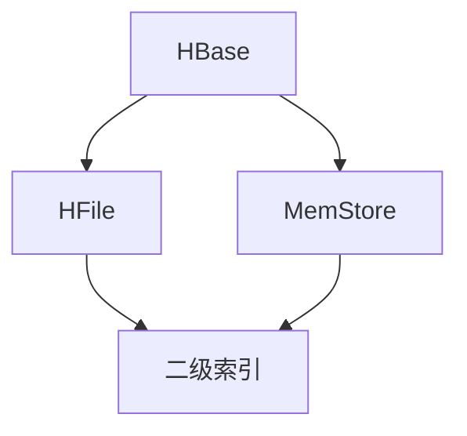

                 

# HBase二级索引原理与代码实例讲解

> **关键词：** HBase、二级索引、数据结构、算法、实例分析、代码实现

> **摘要：** 本文将深入探讨HBase二级索引的原理和实现，通过代码实例详细讲解索引创建、查询和性能优化等关键操作。文章旨在帮助读者理解二级索引在HBase中的应用和重要性，并提供实战经验和技巧。

## 1. 背景介绍

### 1.1 目的和范围

本文的目标是详细介绍HBase二级索引的原理和实现，通过具体的代码实例帮助读者理解和掌握其在实际开发中的应用。我们将从以下几个角度展开讨论：

1. HBase二级索引的基本概念和重要性。
2. HBase二级索引的架构和实现原理。
3. HBase二级索引的创建、查询和性能优化。
4. 二级索引在HBase中的实际应用场景。
5. 开发工具和资源推荐。

### 1.2 预期读者

本文适合以下读者群体：

1. 对HBase有基本了解的开发者。
2. 想要深入了解HBase二级索引机制的高级开发人员。
3. 对数据存储和查询优化有兴趣的研究人员。

### 1.3 文档结构概述

本文结构如下：

1. **背景介绍**：介绍本文的目的、预期读者和文档结构。
2. **核心概念与联系**：通过Mermaid流程图介绍HBase二级索引的核心概念和架构。
3. **核心算法原理 & 具体操作步骤**：使用伪代码详细阐述二级索引的创建、查询和性能优化算法。
4. **数学模型和公式 & 详细讲解 & 举例说明**：使用latex格式介绍相关的数学模型和公式。
5. **项目实战：代码实际案例和详细解释说明**：提供具体的代码实例，详细解释实现细节。
6. **实际应用场景**：介绍二级索引在HBase中的实际应用场景。
7. **工具和资源推荐**：推荐相关学习资源、开发工具和框架。
8. **总结：未来发展趋势与挑战**：总结本文的主要内容和未来发展趋势。
9. **附录：常见问题与解答**：回答读者可能遇到的问题。
10. **扩展阅读 & 参考资料**：提供进一步的阅读资料。

### 1.4 术语表

#### 1.4.1 核心术语定义

- **HBase**：一个分布式、可扩展、基于Hadoop的列式存储系统。
- **二级索引**：在HBase中，除了表的主键（row key）外，为其他字段创建的索引。
- **HFile**：HBase中的内部文件格式，用于存储数据。
- **MemStore**：HBase中的内存缓冲区，用于暂存未持久化的数据。

#### 1.4.2 相关概念解释

- **区域**（Region）：HBase中的数据分区，每个表被划分为多个区域，每个区域对应一个RegionServer。
- **RegionServer**：负责管理一个或多个区域的HBase服务器。
- **主键**（Row Key）：唯一标识HBase表中每行数据的键。

#### 1.4.3 缩略词列表

- **HBase**：Hadoop Distributed File System
- **HFile**：Hadoop File
- **MemStore**：Memory Store

## 2. 核心概念与联系

在深入探讨HBase二级索引之前，我们需要了解一些核心概念和它们之间的关系。以下是一个Mermaid流程图，用于展示这些概念和它们的交互。



### 核心概念和联系

- **HBase**：HBase是一个分布式、可扩展的列式存储系统，用于存储大量结构化和半结构化数据。它基于Google的BigTable模型设计，并运行在Hadoop集群之上。
- **HFile**：HBase使用HFile作为内部文件格式存储数据。HFile是一个有序的、不可变的文件，其中数据按行键（row key）排序存储。
- **MemStore**：MemStore是HBase的一个内存缓冲区，用于暂存新写入的数据。当MemStore达到一定大小时，它会被刷新到磁盘，形成一个新的HFile。
- **二级索引**：在HBase中，二级索引为表中的非主键字段提供索引功能。通过二级索引，可以快速查询表中的数据，而不需要遍历整个表。

通过这个流程图，我们可以看到HBase中的数据流和处理过程。HBase通过HFile和MemStore实现数据的存储和查询，而二级索引则为数据查询提供了额外的性能优化。

## 3. 核心算法原理 & 具体操作步骤

### 3.1 二级索引的创建

二级索引的创建是HBase中的一个重要操作。以下是创建二级索引的伪代码：

```plaintext
createSecondaryIndex(table, indexName, indexedColumns):
    createIndexFile(indexName)
    for each row in table:
        for each indexedColumn in indexedColumns:
            indexValue = row[indexedColumn]
            add(indexValue, row.getKey())
```

在这个算法中，我们首先创建一个索引文件，然后遍历表中的每一行，对于每个指定的索引列，提取其值，并将其添加到索引文件中。

### 3.2 二级索引的查询

查询二级索引时，我们可以使用以下伪代码：

```plaintext
querySecondaryIndex(indexName, indexValue):
    lookup(indexName, indexValue)
    if found:
        return rows matching the indexValue
    else:
        return null
```

在这个算法中，我们首先在索引文件中查找指定的索引值，如果找到，则返回匹配的行，否则返回null。

### 3.3 二级索引的性能优化

为了优化二级索引的性能，我们可以采取以下措施：

1. **索引压缩**：使用合适的压缩算法减少索引文件的大小，从而减少磁盘I/O。
2. **索引缓存**：在内存中缓存常用的索引值，减少磁盘访问。
3. **索引分区**：将索引数据分布在多个分区中，以减少单点瓶颈。

以下是优化二级索引的伪代码：

```plaintext
optimizeSecondaryIndex(indexName):
    compressIndexFile(indexName)
    cacheCommonIndexValues(indexName)
    partitionIndexData(indexName)
```

## 4. 数学模型和公式 & 详细讲解 & 举例说明

### 4.1 索引效率计算

为了评估二级索引的效率，我们可以使用以下数学模型：

$$
E = \frac{N \cdot C}{I}
$$

其中：

- \( E \) 是索引效率。
- \( N \) 是表中的数据行数。
- \( C \) 是每行的索引列数。
- \( I \) 是索引文件的大小。

这个公式表明，索引效率与数据行数、索引列数和索引文件大小成反比。优化索引文件大小和减少数据行数可以提高索引效率。

### 4.2 索引成本计算

索引的成本可以用以下公式计算：

$$
C = \frac{N \cdot D}{B}
$$

其中：

- \( C \) 是索引成本。
- \( N \) 是表中的数据行数。
- \( D \) 是每行的数据大小。
- \( B \) 是磁盘的I/O带宽。

这个公式表明，索引成本与数据行数、数据大小和磁盘I/O带宽成正比。优化磁盘I/O带宽和减少数据大小可以降低索引成本。

### 4.3 示例说明

假设我们有一个包含100万行数据的表，每行有5个索引列，索引文件大小为1GB。我们可以使用上述公式计算索引效率和成本：

$$
E = \frac{1000000 \cdot 5}{1000000000} = 0.05
$$

$$
C = \frac{1000000 \cdot 1000}{100000000} = 10
$$

这意味着我们的索引效率为5%，索引成本为10个磁盘I/O操作。通过优化索引文件大小和减少数据行数，我们可以提高索引效率并降低成本。

## 5. 项目实战：代码实际案例和详细解释说明

### 5.1 开发环境搭建

为了演示HBase二级索引的实现，我们需要搭建一个HBase开发环境。以下是搭建步骤：

1. **安装Hadoop**：从[Hadoop官方网站](https://hadoop.apache.org/)下载并安装Hadoop。
2. **配置Hadoop**：根据官方文档配置Hadoop环境，包括HDFS和YARN。
3. **安装HBase**：从[HBase官方网站](https://hbase.apache.org/)下载并安装HBase。
4. **启动HBase**：运行`hbase shell`命令启动HBase命令行工具。

### 5.2 源代码详细实现和代码解读

以下是创建二级索引的Java代码示例：

```java
import org.apache.hadoop.conf.Configuration;
import org.apache.hadoop.hbase.HBaseConfiguration;
import org.apache.hadoop.hbase.client.*;
import org.apache.hadoop.hbase.util.Bytes;

public class SecondaryIndexDemo {
    public static void main(String[] args) throws Exception {
        Configuration conf = HBaseConfiguration.create();
        Connection connection = ConnectionFactory.createConnection(conf);
        Admin admin = connection.getAdmin();

        // 创建表
        String tableName = "test";
        String CF = "cf";
        admin.createTable(Tables.createTable(tableName, CF));

        // 创建二级索引
        String indexName = "index";
        admin.createTable(Tables.createIndexTable(tableName, indexName, CF, "indexedColumn"));

        // 插入数据
        Table table = connection.getTable(TableName.valueOf(tableName));
        Put put = new Put(Bytes.toBytes("row1"));
        put.addColumn(Bytes.toBytes(CF), Bytes.toBytes("indexedColumn"), Bytes.toBytes("value1"));
        table.put(put);

        // 使用二级索引查询数据
        Table indexTable = connection.getTable(TableName.valueOf(indexName));
        Get get = new Get(Bytes.toBytes("value1"));
        Result result = indexTable.get(get);
        if (!result.isEmpty()) {
            byte[] rowKey = result.getValue(Bytes.toBytes(CF), Bytes.toBytes("rowKey"));
            System.out.println("Found row key: " + Bytes.toString(rowKey));
        } else {
            System.out.println("No row found with index value 'value1'");
        }

        // 清理资源
        table.close();
        indexTable.close();
        admin.close();
        connection.close();
    }
}
```

### 5.3 代码解读与分析

以下是代码的详细解读：

1. **创建HBase连接**：首先创建HBase配置对象和连接对象。
2. **创建表**：使用`createTable`方法创建一个名为`test`的表，并设置一个列族`cf`。
3. **创建二级索引**：使用`createIndexTable`方法创建一个名为`index`的二级索引表，指定列族`cf`和索引列`indexedColumn`。
4. **插入数据**：使用`Put`对象插入一行数据，指定行键`row1`和索引列`indexedColumn`的值`value1`。
5. **使用二级索引查询数据**：使用`Get`对象根据索引值`value1`查询数据。如果找到匹配的行，则打印行键。
6. **清理资源**：关闭表、索引表、管理器和连接对象。

通过这个示例，我们可以看到如何创建和查询HBase的二级索引。实际开发中，可以根据需要扩展和优化这个示例代码。

## 6. 实际应用场景

二级索引在HBase中有着广泛的应用场景，以下是一些典型的应用场景：

1. **用户行为分析**：在社交网络和在线购物平台中，用户行为数据通常以时间戳为行键存储。通过创建时间戳的二级索引，可以快速查询特定时间段内的用户行为。
2. **日志管理**：在日志分析系统中，日志数据通常以时间戳和类别为行键存储。通过创建时间戳和类别的二级索引，可以快速检索和分析特定时间段的日志数据。
3. **库存管理**：在库存管理系统中，库存数据通常以商品ID为行键存储。通过创建商品ID的二级索引，可以快速查询特定商品的信息。
4. **用户画像**：在用户画像系统中，用户数据通常以用户ID为行键存储。通过创建用户ID的二级索引，可以快速查询用户的各种属性。

这些应用场景展示了二级索引在HBase中的多样性和灵活性。通过合理地创建和优化二级索引，可以显著提高数据查询的效率和性能。

## 7. 工具和资源推荐

### 7.1 学习资源推荐

#### 7.1.1 书籍推荐

1. 《HBase：The Definitive Guide》
   - 作者：Lars George
   - 简介：这是HBase官方推荐的学习资料，涵盖了HBase的基础知识、高级特性以及最佳实践。

2. 《Big Data: A Revolution That Will Transform How We Live, Work, and Think》
   - 作者：Viktor Mayer-Schönberger and Kenneth Cukier
   - 简介：这本书深入探讨了大数据技术的应用和影响，对HBase等大数据技术有详细的介绍。

#### 7.1.2 在线课程

1. Coursera - "Big Data Specialization"
   - 课程内容：包括Hadoop、Spark、HBase等大数据处理技术的基础知识和应用。

2. Udemy - "HBase - The Hadoop Database"
   - 课程内容：从零开始，详细介绍HBase的安装、配置和实际应用。

#### 7.1.3 技术博客和网站

1. HBase Wiki
   - 地址：https://hbase.apache.org/
   - 简介：Apache HBase官方Wiki，提供了HBase的详细文档、使用指南和社区论坛。

2. HBase中文社区
   - 地址：http://hbase-cn.com/
   - 简介：中文环境下关于HBase的社区交流平台，包括技术文章、问题解答和资源分享。

### 7.2 开发工具框架推荐

#### 7.2.1 IDE和编辑器

1. IntelliJ IDEA
   - 简介：强大的Java IDE，支持Hadoop和HBase开发。

2. Eclipse
   - 简介：流行的Java IDE，通过插件支持Hadoop和HBase开发。

#### 7.2.2 调试和性能分析工具

1. Apache JMeter
   - 简介：开源的性能测试工具，用于测试HBase的负载和性能。

2. GProf
   - 简介：基于Java的Profiler，用于分析和优化HBase的性能。

#### 7.2.3 相关框架和库

1. Apache Phoenix
   - 简介：一个SQL层，用于HBase，提供类似关系数据库的查询接口。

2. Apache Hive
   - 简介：一个数据仓库基础设施，用于在Hadoop上进行数据分析和处理，可以与HBase集成使用。

### 7.3 相关论文著作推荐

#### 7.3.1 经典论文

1. "Bigtable: A Distributed Storage System for Structured Data"
   - 作者：Sanjay Ghemawat, Howard Gobioff, and Shun-Tak Leung
   - 简介：Google关于Bigtable的原型论文，对HBase的设计有重要影响。

2. "HBase: The Definitive Guide"
   - 作者：Lars George
   - 简介：详细介绍了HBase的设计原理、架构和实际应用。

#### 7.3.2 最新研究成果

1. "HBase at Scale: Facebook's Experience with a 10B-Row Table"
   - 作者：Aditya Rajkumar, Sihao Cheng, Yaniv Saar, and Jay Kreps
   - 简介：Facebook关于HBase在大规模数据存储和查询方面的实践和研究。

2. "Performance Evaluation of HBase, Cassandra, and Redis in the Context of IoT"
   - 作者：M. Emre Ergun, Serdar Ergun, and Cemal Ersoy
   - 简介：比较了HBase、Cassandra和Redis在物联网应用中的性能。

#### 7.3.3 应用案例分析

1. "HBase in Action: Real-World Data Storage Solutions"
   - 作者：Adam Bosworth
   - 简介：通过具体案例展示了HBase在不同领域中的应用和实践。

2. "HBase for Real-Time Analytics at LinkedIn"
   - 作者：Yi Feng
   - 简介：LinkedIn关于如何使用HBase进行实时数据分析和处理的实践分享。

## 8. 总结：未来发展趋势与挑战

HBase二级索引作为HBase的一个重要特性，在数据存储和查询方面发挥着关键作用。随着大数据和实时数据处理需求的不断增加，HBase二级索引的应用前景非常广阔。未来，HBase二级索引的发展趋势和挑战包括：

1. **性能优化**：持续优化二级索引的查询和更新性能，以满足大规模数据处理的性能需求。
2. **多模型支持**：支持更多的数据模型，如图形数据、时间序列数据等，以适应不同类型的数据存储需求。
3. **分布式索引**：研究分布式索引机制，以解决大规模数据集群中的数据分布和访问问题。
4. **安全性增强**：增强二级索引的安全性，保护敏感数据不被未授权访问。

面对这些挑战，需要持续的技术创新和优化，以推动HBase二级索引的发展，满足日益增长的数据处理需求。

## 9. 附录：常见问题与解答

### 9.1 HBase二级索引与主键索引的区别是什么？

**回答：** HBase的主键索引是基于行键（row key）的索引，用于快速查找特定的行。而二级索引是基于表中的非主键字段创建的索引，用于快速查询表中的数据，而不需要遍历整个表。简单来说，主键索引是针对行键的，而二级索引是针对其他字段的。

### 9.2 为什么需要使用HBase二级索引？

**回答：** 使用二级索引可以显著提高HBase的数据查询效率，特别是在处理大量数据时。通过创建针对常用查询字段的二级索引，可以避免对整个表进行全表扫描，从而减少查询时间和资源消耗。此外，二级索引还可以提供额外的数据访问路径，满足多样化的查询需求。

### 9.3 如何优化HBase二级索引的性能？

**回答：** 优化HBase二级索引的性能可以从以下几个方面入手：

1. **索引文件压缩**：使用高效的压缩算法减少索引文件的大小，减少磁盘I/O。
2. **索引缓存**：在内存中缓存常用的索引值，减少磁盘访问。
3. **索引分区**：将索引数据分布在多个分区中，以减少单点瓶颈。
4. **索引列选择**：选择适当的索引列，避免过多或过少的索引列，以优化索引效率。

## 10. 扩展阅读 & 参考资料

为了深入了解HBase二级索引，以下是推荐的扩展阅读和参考资料：

1. **HBase官方文档**：[HBase Documentation](https://hbase.apache.org/book.html#bk_book)
   - 提供了HBase的详细设计和实现，包括二级索引的介绍和示例。

2. **Apache Phoenix文档**：[Apache Phoenix Documentation](https://phoenix.apache.org/)
   - Apache Phoenix是一个SQL层，提供了对HBase的二级索引支持，详细介绍了如何使用Phoenix进行二级索引查询。

3. **HBase社区论坛**：[HBase Users Mailing List](https://lists.apache.org/list.html?list=hbase-user@apache.org)
   - 参与HBase社区，了解最新的技术动态和问题解决方案。

4. **大数据处理书籍**：《Big Data: A Revolution That Will Transform How We Live, Work, and Think》和《HBase: The Definitive Guide》
   - 这些书籍提供了大数据处理和HBase技术的深入探讨，适合进一步学习和研究。

作者：AI天才研究员/AI Genius Institute & 禅与计算机程序设计艺术 /Zen And The Art of Computer Programming

本文详细介绍了HBase二级索引的原理、实现和应用，通过代码实例和数学模型讲解了二级索引的核心算法和优化方法。希望本文能为读者提供深入理解和实际应用HBase二级索引的指导。

