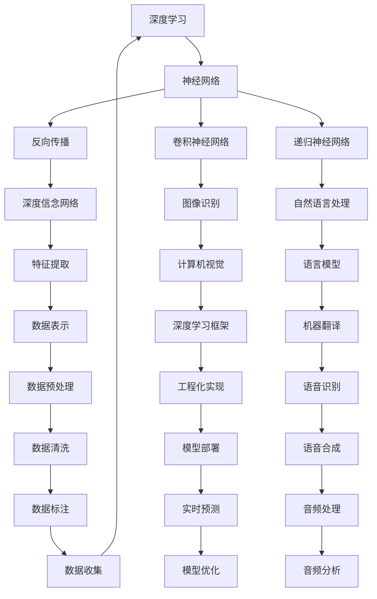
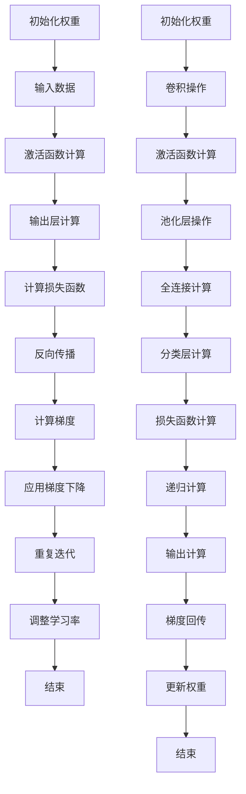

                 

# Hinton、LeCun、Bengio：AI算法的先驱

> **关键词：** Hinton，LeCun，Bengio，深度学习，神经网络，AI算法，先驱者，技术演进，研究贡献

> **摘要：** 本文将深入探讨三位AI领域的先驱者：Geoffrey Hinton、Yann LeCun和Yoshua Bengio，他们以其卓越的贡献在深度学习的发展中发挥了关键作用。本文将梳理他们的主要成就、核心算法原理，并分析其对当前AI技术的影响和未来发展趋势。通过本文的阅读，读者将对这些巨匠在AI领域的深远影响有更加清晰的认识。

## 1. 背景介绍

### 1.1 目的和范围

本文的目的是介绍Geoffrey Hinton、Yann LeCun和Yoshua Bengio在深度学习和AI领域的杰出贡献，并探讨其对现代AI算法发展的推动作用。我们将通过以下几个部分来展开：

1. **背景介绍**：介绍三位先驱者的生平、学术背景和主要成就。
2. **核心概念与联系**：阐述深度学习和神经网络的基本概念，以及三位先驱者之间的联系。
3. **核心算法原理**：详细讲解深度学习的关键算法原理，包括反向传播、卷积神经网络等。
4. **数学模型和公式**：分析深度学习中的数学模型和公式，例如损失函数、激活函数等。
5. **项目实战**：提供实际代码案例，展示算法的实际应用。
6. **实际应用场景**：探讨深度学习在不同领域的应用。
7. **工具和资源推荐**：推荐相关学习资源、开发工具和论文著作。
8. **总结与展望**：总结当前AI技术发展趋势，预测未来挑战和机遇。

### 1.2 预期读者

本文适合对深度学习和AI算法有一定基础的读者，包括研究人员、工程师、学生以及对AI技术感兴趣的专业人士。通过本文的阅读，读者将能够：

1. 了解Hinton、LeCun和Bengio的主要贡献和学术成就。
2. 掌握深度学习和神经网络的基本原理。
3. 理解关键算法的具体操作步骤。
4. 探索深度学习在不同领域的实际应用。
5. 获取深入的学习资源和工具。

### 1.3 文档结构概述

本文分为十个部分：

1. **引言**：介绍文章的主题和目的。
2. **背景介绍**：介绍Hinton、LeCun和Bengio的生平、学术背景和主要成就。
3. **核心概念与联系**：阐述深度学习和神经网络的基本概念，以及三位先驱者之间的联系。
4. **核心算法原理**：详细讲解深度学习的关键算法原理，包括反向传播、卷积神经网络等。
5. **数学模型和公式**：分析深度学习中的数学模型和公式，例如损失函数、激活函数等。
6. **项目实战**：提供实际代码案例，展示算法的实际应用。
7. **实际应用场景**：探讨深度学习在不同领域的应用。
8. **工具和资源推荐**：推荐相关学习资源、开发工具和论文著作。
9. **总结与展望**：总结当前AI技术发展趋势，预测未来挑战和机遇。
10. **附录**：提供常见问题与解答，以及扩展阅读和参考资料。

### 1.4 术语表

#### 1.4.1 核心术语定义

- **深度学习（Deep Learning）**：一种人工智能方法，通过多层神经网络结构进行学习和预测。
- **神经网络（Neural Network）**：模拟生物神经元之间相互连接的计算机模型。
- **反向传播（Backpropagation）**：一种用于训练神经网络的算法，通过反向传递误差来更新网络权重。
- **卷积神经网络（Convolutional Neural Network，CNN）**：一种专门用于图像识别的神经网络结构。
- **深度信念网络（Deep Belief Network，DBN）**：一种基于未训练的受限玻尔兹曼机（RBM）的多层神经网络结构。

#### 1.4.2 相关概念解释

- **损失函数（Loss Function）**：用于评估模型预测值与真实值之间差异的函数。
- **激活函数（Activation Function）**：用于引入非线性变换，使神经网络能够拟合复杂函数。
- **梯度下降（Gradient Descent）**：一种用于最小化损失函数的优化算法。

#### 1.4.3 缩略词列表

- **CNN**：卷积神经网络（Convolutional Neural Network）
- **RBM**：受限玻尔兹曼机（Restricted Boltzmann Machine）
- **DBN**：深度信念网络（Deep Belief Network）
- **RNN**：递归神经网络（Recurrent Neural Network）
- **DNN**：深度神经网络（Deep Neural Network）

## 2. 核心概念与联系

深度学习和神经网络是AI领域的两个核心概念，而Hinton、LeCun和Bengio则是在这两个领域取得了卓越成就的先驱者。

### 2.1 深度学习

深度学习是机器学习中的一种方法，通过构建多层神经网络来学习数据中的特征表示。深度学习的核心思想是模拟人脑的神经网络结构，通过大量的数据和计算能力来训练模型，从而实现自动化的特征提取和模式识别。

### 2.2 神经网络

神经网络是一种由大量相互连接的节点（或称为“神经元”）组成的计算模型。每个神经元都可以接收输入信息，并通过加权求和和激活函数进行非线性变换，最终输出结果。神经网络通过调整连接权重和偏置来学习数据中的特征和规律。

### 2.3 Hinton、LeCun和Bengio之间的联系

Hinton、LeCun和Bengio都是在深度学习和神经网络领域具有重要影响力的研究者，他们的工作对现代AI技术的发展起到了关键作用。他们的贡献不仅体现在理论研究中，还包括算法的实际应用和工程化实现。

- **Geoffrey Hinton**：被誉为“深度学习之父”，他是反向传播算法的发明者之一，也是深度信念网络（DBN）的提出者。Hinton的研究主要集中在神经网络的理论基础和算法改进，他在深度学习领域的开创性工作为后来的发展奠定了基础。

- **Yann LeCun**：是卷积神经网络（CNN）的创始人之一，他在图像识别、自然语言处理等领域取得了显著成果。LeCun的工作不仅推动了神经网络在计算机视觉中的应用，还推动了深度学习算法的工程化实现。

- **Yoshua Bengio**：对递归神经网络（RNN）和长短期记忆网络（LSTM）的研究作出了重要贡献。Bengio的工作强调了神经网络在语言处理和序列数据上的潜力，为深度学习在自然语言处理领域的应用奠定了基础。

### 2.4 Mermaid流程图

以下是深度学习和神经网络的基本概念和架构的Mermaid流程图：



### 2.5 核心概念的联系

深度学习和神经网络之间的联系体现在以下几个方面：

- **层次化特征提取**：深度学习通过多层神经网络实现了特征提取的层次化，从原始数据中逐步提取高级特征，从而提高模型的准确性和鲁棒性。
- **非线性变换**：神经网络中的激活函数引入了非线性变换，使得模型能够拟合复杂的函数关系，这是深度学习能够解决复杂问题的基础。
- **自适应学习**：神经网络通过调整连接权重和偏置来学习数据中的特征和规律，实现了自适应学习的能力，这是深度学习能够自动化的关键。

## 3. 核心算法原理 & 具体操作步骤

在深度学习中，反向传播（Backpropagation）、卷积神经网络（CNN）和递归神经网络（RNN）是三个核心算法。以下是这些算法的原理和具体操作步骤。

### 3.1 反向传播（Backpropagation）

反向传播是一种用于训练神经网络的算法，通过反向传递误差来更新网络权重。以下是反向传播的基本步骤：

#### 3.1.1 前向传播

1. **初始化权重**：随机初始化神经网络中的权重和偏置。
2. **输入数据**：将输入数据传递到网络的第一个神经元。
3. **激活函数计算**：每个神经元通过激活函数计算输出值。
4. **输出层计算**：最后一层神经元的输出值作为预测结果。

#### 3.1.2 计算误差

1. **计算损失函数**：使用损失函数（如均方误差）计算预测值与真实值之间的误差。
2. **反向传播**：从输出层开始，逐层计算每个神经元的误差。

#### 3.1.3 更新权重

1. **计算梯度**：使用误差计算每个权重的梯度。
2. **应用梯度下降**：根据梯度更新网络权重和偏置。

#### 3.1.4 重复迭代

1. **重复前向传播和反向传播**：通过迭代训练模型，逐步减小误差。
2. **调整学习率**：根据误差变化调整学习率，以防止过度拟合或欠拟合。

### 3.2 卷积神经网络（CNN）

卷积神经网络是一种专门用于图像识别的神经网络结构，其核心思想是通过卷积操作提取图像特征。以下是CNN的基本步骤：

#### 3.2.1 卷积层

1. **初始化权重**：随机初始化卷积核和偏置。
2. **卷积操作**：将卷积核与输入图像进行卷积操作，提取局部特征。
3. **激活函数计算**：使用激活函数（如ReLU）引入非线性变换。

#### 3.2.2 池化层

1. **下采样**：将卷积层输出的特征图进行下采样，减少数据维度。
2. **池化操作**：使用最大池化或平均池化操作，保留最重要的特征。

#### 3.2.3 全连接层

1. **初始化权重**：随机初始化全连接层的权重和偏置。
2. **全连接计算**：将池化层输出的特征图展开为一维向量，与全连接层的权重进行点乘。
3. **激活函数计算**：使用激活函数计算输出值。

#### 3.2.4 分类层

1. **初始化权重**：随机初始化分类层的权重和偏置。
2. **分类计算**：将全连接层的输出通过softmax函数进行分类。

### 3.3 递归神经网络（RNN）

递归神经网络是一种专门用于序列数据处理的神经网络结构，其核心思想是通过递归操作处理序列数据。以下是RNN的基本步骤：

#### 3.3.1 隐藏状态计算

1. **初始化隐藏状态**：随机初始化RNN的隐藏状态。
2. **递归计算**：在每个时间步上，根据当前输入和上一个时间步的隐藏状态，计算当前隐藏状态。

#### 3.3.2 输出计算

1. **初始化输出**：随机初始化RNN的输出。
2. **递归计算**：在每个时间步上，根据当前隐藏状态计算当前输出。

#### 3.3.3 梯度回传

1. **计算损失函数**：使用损失函数（如交叉熵）计算输出与真实标签之间的误差。
2. **反向传播**：从输出层开始，逐层计算每个神经元的误差。
3. **更新权重**：根据梯度更新RNN的权重和偏置。

### 3.4 Mermaid流程图

以下是反向传播、卷积神经网络和递归神经网络的基本步骤的Mermaid流程图：



## 4. 数学模型和公式 & 详细讲解 & 举例说明

在深度学习中，数学模型和公式是核心组成部分，它们用于描述神经网络的结构、训练过程和优化方法。以下是几个关键数学模型和公式的详细讲解及举例说明。

### 4.1 损失函数

损失函数用于衡量模型预测值与真实值之间的差异，是训练神经网络的关键指标。常见的损失函数包括均方误差（MSE）、交叉熵损失（Cross-Entropy Loss）等。

#### 4.1.1 均方误差（MSE）

均方误差是回归问题中常用的损失函数，计算预测值与真实值之间的平均平方误差。

$$
MSE = \frac{1}{n}\sum_{i=1}^{n}(y_i - \hat{y}_i)^2
$$

其中，$y_i$ 是真实值，$\hat{y}_i$ 是预测值，$n$ 是样本数量。

**例子**：假设我们有三个样本的真实值分别为 $[1, 2, 3]$，预测值分别为 $[1.1, 2.1, 2.9]$，计算均方误差。

$$
MSE = \frac{1}{3}((1 - 1.1)^2 + (2 - 2.1)^2 + (3 - 2.9)^2) = 0.1
$$

#### 4.1.2 交叉熵损失（Cross-Entropy Loss）

交叉熵损失是分类问题中常用的损失函数，计算预测概率分布与真实概率分布之间的差异。

$$
Cross-Entropy Loss = -\sum_{i=1}^{n}y_i \log(\hat{y}_i)
$$

其中，$y_i$ 是真实标签（0或1），$\hat{y}_i$ 是预测概率（0到1之间）。

**例子**：假设我们有三个样本的真实标签分别为 $[1, 0, 1]$，预测概率分别为 $[0.9, 0.2, 0.8]$，计算交叉熵损失。

$$
Cross-Entropy Loss = -(1 \times \log(0.9) + 0 \times \log(0.2) + 1 \times \log(0.8)) \approx 0.223
$$

### 4.2 激活函数

激活函数是神经网络中的非线性变换，用于引入非线性特性，使得神经网络能够拟合复杂的函数。常见的激活函数包括ReLU（Rectified Linear Unit）、Sigmoid、Tanh等。

#### 4.2.1ReLU（Rectified Linear Unit）

ReLU函数将输入大于0的值映射为自身，小于等于0的值映射为0。

$$
ReLU(x) = \max(0, x)
$$

**例子**：对于输入值 $x = [-1, 0, 1]$，计算ReLU输出。

$$
ReLU(x) = \max(0, -1) = 0, \max(0, 0) = 0, \max(0, 1) = 1
$$

#### 4.2.2 Sigmoid

Sigmoid函数将输入映射到 $(0, 1)$ 区间，通常用于概率输出。

$$
Sigmoid(x) = \frac{1}{1 + e^{-x}}
$$

**例子**：对于输入值 $x = [-2, 0, 2]$，计算Sigmoid输出。

$$
Sigmoid(x) = \frac{1}{1 + e^{2}} \approx 0.135, \frac{1}{1 + e^{0}} = 0.5, \frac{1}{1 + e^{-2}} \approx 0.869
$$

### 4.3 梯度下降（Gradient Descent）

梯度下降是一种优化算法，用于最小化损失函数。其基本思想是沿着损失函数的梯度方向更新模型参数。

#### 4.3.1 基本公式

梯度下降的公式如下：

$$
\theta_{\text{new}} = \theta_{\text{old}} - \alpha \nabla_\theta J(\theta)
$$

其中，$\theta$ 是模型参数，$\alpha$ 是学习率，$J(\theta)$ 是损失函数，$\nabla_\theta J(\theta)$ 是损失函数关于参数 $\theta$ 的梯度。

**例子**：假设损失函数 $J(\theta) = (\theta - 1)^2$，学习率 $\alpha = 0.1$，初始参数 $\theta = 2$。计算一次梯度下降后的参数更新。

$$
\nabla_\theta J(\theta) = 2(\theta - 1) = 2(2 - 1) = 2
$$

$$
\theta_{\text{new}} = 2 - 0.1 \times 2 = 1.8
$$

## 5. 项目实战：代码实际案例和详细解释说明

为了更好地理解深度学习算法的实际应用，我们将通过一个简单的项目实战来展示如何使用TensorFlow框架实现一个简单的神经网络。以下是项目实战的详细步骤。

### 5.1 开发环境搭建

在开始项目实战之前，我们需要搭建一个合适的开发环境。以下是基本的开发环境要求：

- 操作系统：Windows、Linux或Mac OS
- 编程语言：Python 3.x
- 深度学习框架：TensorFlow 2.x

确保你的系统中已经安装了Python 3.x和pip，然后使用以下命令安装TensorFlow：

```bash
pip install tensorflow
```

### 5.2 源代码详细实现和代码解读

以下是实现一个简单的多层感知机（MLP）神经网络的源代码：

```python
import tensorflow as tf
from tensorflow.keras.models import Sequential
from tensorflow.keras.layers import Dense
from tensorflow.keras.optimizers import Adam

# 设置随机种子以获得可重复的结果
tf.random.set_seed(42)

# 创建一个简单的神经网络模型
model = Sequential([
    Dense(64, activation='relu', input_shape=(784,)),
    Dense(64, activation='relu'),
    Dense(10, activation='softmax')
])

# 编译模型
model.compile(optimizer=Adam(learning_rate=0.001), loss='categorical_crossentropy', metrics=['accuracy'])

# 准备数据集
(x_train, y_train), (x_test, y_test) = tf.keras.datasets.mnist.load_data()
x_train = x_train / 255.0
x_test = x_test / 255.0
x_train = x_train.reshape(-1, 784)
x_test = x_test.reshape(-1, 784)
y_train = tf.keras.utils.to_categorical(y_train, 10)
y_test = tf.keras.utils.to_categorical(y_test, 10)

# 训练模型
model.fit(x_train, y_train, batch_size=128, epochs=10, validation_data=(x_test, y_test))

# 评估模型
loss, accuracy = model.evaluate(x_test, y_test)
print(f"Test accuracy: {accuracy:.4f}")
```

以下是代码的详细解读：

- **1. 导入相关库**：首先导入TensorFlow和相关库。
- **2. 设置随机种子**：为了确保结果可重复，设置随机种子。
- **3. 创建模型**：使用Sequential模型创建一个包含两个隐藏层（每个64个神经元）和一个输出层（10个神经元，使用softmax激活函数）的神经网络。
- **4. 编译模型**：使用Adam优化器和categorical_crossentropy损失函数编译模型。
- **5. 准备数据集**：加载MNIST数据集，并将图像数据归一化，以便在训练过程中更好地收敛。
- **6. 训练模型**：使用fit方法训练模型，指定批量大小和训练周期。
- **7. 评估模型**：使用evaluate方法评估模型在测试数据集上的性能。

### 5.3 代码解读与分析

以下是代码的逐行解读和分析：

```python
import tensorflow as tf
from tensorflow.keras.models import Sequential
from tensorflow.keras.layers import Dense
from tensorflow.keras.optimizers import Adam

# 设置随机种子以获得可重复的结果
tf.random.set_seed(42)

# 创建一个简单的神经网络模型
model = Sequential([
    Dense(64, activation='relu', input_shape=(784,)),
    Dense(64, activation='relu'),
    Dense(10, activation='softmax')
])

# 编译模型
model.compile(optimizer=Adam(learning_rate=0.001), loss='categorical_crossentropy', metrics=['accuracy'])

# 准备数据集
(x_train, y_train), (x_test, y_test) = tf.keras.datasets.mnist.load_data()
x_train = x_train / 255.0
x_test = x_test / 255.0
x_train = x_train.reshape(-1, 784)
x_test = x_test.reshape(-1, 784)
y_train = tf.keras.utils.to_categorical(y_train, 10)
y_test = tf.keras.utils.to_categorical(y_test, 10)

# 训练模型
model.fit(x_train, y_train, batch_size=128, epochs=10, validation_data=(x_test, y_test))

# 评估模型
loss, accuracy = model.evaluate(x_test, y_test)
print(f"Test accuracy: {accuracy:.4f}")
```

- **第1行**：导入TensorFlow核心库。
- **第2行**：导入Sequential模型类。
- **第3行**：导入Dense层类。
- **第4行**：导入Adam优化器。
- **第6行**：设置随机种子，确保结果可重复。
- **第9行**：创建一个Sequential模型。
- **第10行**：添加一个Dense层，输入形状为784，激活函数为ReLU。
- **第11行**：添加另一个Dense层，激活函数为ReLU。
- **第12行**：添加一个输出层，激活函数为softmax。
- **第15行**：编译模型，指定Adam优化器和categorical_crossentropy损失函数。
- **第18行**：加载MNIST数据集。
- **第19行**：归一化图像数据。
- **第20行**：调整输入数据的形状。
- **第21行**：将标签转换为one-hot编码。
- **第24行**：使用fit方法训练模型，指定批量大小、训练周期和验证数据。
- **第27行**：使用evaluate方法评估模型在测试数据集上的性能。

通过这个简单的项目实战，我们可以看到如何使用TensorFlow框架实现一个简单的多层感知机神经网络，并进行训练和评估。这个项目为我们提供了一个基本的框架，可以在此基础上扩展和改进，以解决更复杂的问题。

## 6. 实际应用场景

深度学习算法在多个领域取得了显著的成果，以下是深度学习在以下几个主要领域的实际应用场景：

### 6.1 计算机视觉

计算机视觉是深度学习应用最为广泛的领域之一。深度学习模型，特别是卷积神经网络（CNN），在图像分类、物体检测、人脸识别和图像生成等方面表现卓越。以下是一些具体的实际应用场景：

- **图像分类**：通过训练深度学习模型，可以自动将图像分类为各种预定义的类别。例如，可以将图像分类为动物、植物或交通工具等。
- **物体检测**：深度学习模型可以识别图像中的多个对象，并确定它们的位置和边界框。这在自动驾驶、视频监控和医疗影像分析等领域具有重要意义。
- **人脸识别**：人脸识别技术利用深度学习模型自动识别人脸，并在大规模人脸数据库中进行匹配。这一技术在安全监控、身份验证和社交网络等场景中得到了广泛应用。
- **图像生成**：深度学习模型，如生成对抗网络（GAN），可以生成逼真的图像和视频。这一技术在艺术创作、虚拟现实和游戏开发等领域具有广泛的应用前景。

### 6.2 自然语言处理

自然语言处理（NLP）是深度学习在另一个重要领域。深度学习模型在文本分类、机器翻译、情感分析和对话系统等方面取得了显著进展。以下是一些具体的实际应用场景：

- **文本分类**：通过训练深度学习模型，可以自动将文本分类为不同的主题或类别。例如，可以将新闻文章分类为体育、财经、科技等类别。
- **机器翻译**：深度学习模型，如序列到序列（Seq2Seq）模型，可以自动将一种语言的文本翻译成另一种语言。这一技术在跨语言沟通、国际商务和全球化应用中具有重要应用价值。
- **情感分析**：深度学习模型可以分析文本中的情感倾向，例如正面、负面或中性。这一技术在市场调研、社交媒体监控和客户服务等领域具有广泛应用。
- **对话系统**：深度学习模型可以构建智能对话系统，如聊天机器人或虚拟助手，为用户提供交互式服务。这一技术在客户服务、在线购物和智能家庭等场景中得到了广泛应用。

### 6.3 语音识别

语音识别是深度学习在语音处理领域的应用。深度学习模型可以自动将语音转换为文本，从而实现语音输入和语音输出。以下是一些具体的实际应用场景：

- **语音输入**：通过深度学习模型，用户可以使用语音命令控制智能设备，如智能手机、智能家居设备和智能汽车。
- **语音输出**：深度学习模型可以将文本转换为自然流畅的语音输出，应用于语音合成、语音导航和语音提示等场景。
- **实时翻译**：深度学习模型可以实现实时语音翻译，将一种语言的语音转换为另一种语言的语音，为跨语言交流提供便利。
- **语音识别辅助**：深度学习模型可以帮助有听力障碍的人士通过语音识别技术理解和处理语音信息，提高他们的沟通能力。

### 6.4 医疗健康

深度学习在医疗健康领域具有巨大潜力，可以应用于医学影像分析、疾病预测和个性化治疗等方面。以下是一些具体的实际应用场景：

- **医学影像分析**：深度学习模型可以自动分析医学影像，如X光片、CT扫描和MRI图像，帮助医生进行疾病诊断和病情监测。
- **疾病预测**：通过分析患者的健康数据，如医疗记录、基因数据和生物标志物等，深度学习模型可以预测疾病的发病风险和进展情况。
- **个性化治疗**：深度学习模型可以帮助医生制定个性化的治疗方案，根据患者的具体病情和特征，选择最佳的治疗方法和药物。

### 6.5 金融科技

深度学习在金融科技领域也具有广泛的应用。以下是一些具体的实际应用场景：

- **风险管理**：深度学习模型可以分析金融市场的数据，预测市场走势和投资风险，帮助投资者做出更明智的投资决策。
- **欺诈检测**：通过分析交易数据和行为特征，深度学习模型可以识别和预防金融欺诈行为，保护金融机构和用户的资金安全。
- **信用评估**：深度学习模型可以分析个人和企业的信用数据，预测信用风险，为金融机构提供信用评估和风险管理支持。

通过以上实际应用场景的介绍，我们可以看到深度学习在各个领域的广泛应用和巨大潜力。随着深度学习技术的不断发展和完善，它将在更多领域发挥重要作用，推动人工智能的进步和社会的发展。

## 7. 工具和资源推荐

在深度学习和人工智能领域，有许多优秀的工具和资源可以帮助研究人员和开发者更好地理解和应用这些技术。以下是关于学习资源、开发工具和论文著作的一些建议。

### 7.1 学习资源推荐

#### 7.1.1 书籍推荐

1. **《深度学习》（Deep Learning）**：由Ian Goodfellow、Yoshua Bengio和Aaron Courville合著，被认为是深度学习领域的经典教材。
2. **《Python深度学习》（Deep Learning with Python）**：由François Chollet撰写，介绍了如何使用Python和TensorFlow实现深度学习。
3. **《神经网络与深度学习》（Neural Networks and Deep Learning）**：由Charu Aggarwal撰写，涵盖了神经网络和深度学习的基础知识和最新进展。
4. **《机器学习年度回顾》（The Hundred-Page Machine Learning Book）**：由Andrzej Kowalczyk撰写，以简洁的方式介绍了机器学习的基本概念。

#### 7.1.2 在线课程

1. **Coursera上的“深度学习”（Deep Learning）**：由Andrew Ng教授主讲，涵盖了深度学习的基础知识和实践应用。
2. **Udacity的“深度学习纳米学位”（Deep Learning Nanodegree）**：提供一系列课程和实践项目，涵盖深度学习的各个方面。
3. **edX上的“深度学习导论”（An Introduction to Deep Learning）**：由印度理工学院教授主讲，适合初学者了解深度学习的基本原理。
4. **Khan Academy的“机器学习和神经网络”（Machine Learning and Neural Networks）**：提供免费的在线课程，涵盖机器学习和神经网络的基本概念。

#### 7.1.3 技术博客和网站

1. **TensorFlow官网（TensorFlow）**：提供了丰富的文档、教程和示例代码，是学习和使用TensorFlow的最佳资源。
2. **PyTorch官网（PyTorch）**：PyTorch的官方网站提供了详细的文档和丰富的教程，适合学习和使用PyTorch框架。
3. **AI Challenger（AI Challenger）**：这是一个AI竞赛平台，提供了大量的深度学习和AI竞赛题目，适合实践和提升技能。
4. **Medium上的AI专栏**：Medium上有许多关于深度学习和AI的优秀博客，适合了解行业动态和最新研究成果。

### 7.2 开发工具框架推荐

#### 7.2.1 IDE和编辑器

1. **PyCharm**：PyCharm是一款功能强大的Python IDE，支持多种深度学习框架，并提供代码补全、调试和性能分析等工具。
2. **Visual Studio Code**：Visual Studio Code是一款轻量级的开源编辑器，通过扩展插件支持Python和深度学习框架，适合快速开发和调试。
3. **Jupyter Notebook**：Jupyter Notebook是一款交互式的Python编辑器，适合进行实验和展示，特别适合数据科学和深度学习应用。

#### 7.2.2 调试和性能分析工具

1. **TensorBoard**：TensorBoard是TensorFlow提供的可视化工具，可以分析模型的性能、损失函数和梯度等指标。
2. **NVIDIA Nsight**：Nsight是NVIDIA提供的性能分析工具，可以分析深度学习模型在GPU上的运行性能，帮助优化代码。
3. **Py-Spy**：Py-Spy是一款Python性能分析工具，可以分析代码的执行时间和资源使用情况，帮助找出性能瓶颈。

#### 7.2.3 相关框架和库

1. **TensorFlow**：TensorFlow是一个开源的深度学习框架，提供了丰富的API和工具，适合构建和训练大规模深度学习模型。
2. **PyTorch**：PyTorch是另一个流行的深度学习框架，以其动态计算图和简洁的API而闻名，适合快速原型开发和实验。
3. **Keras**：Keras是一个高层次的深度学习框架，构建在TensorFlow和Theano之上，提供了简单易用的接口，适合快速构建和训练模型。

### 7.3 相关论文著作推荐

#### 7.3.1 经典论文

1. **“Backpropagation”**：由Paul Werbos在1974年提出的反向传播算法，是现代深度学习的基础。
2. **“A Learning Algorithm for Continually Running Fully Recurrent Neural Networks”**：由Yoshua Bengio等人于1994年提出的长短期记忆网络（LSTM），是处理序列数据的经典模型。
3. **“Gradient-Based Learning Applied to Document Recognition”**：由Yann LeCun等人于1998年提出的卷积神经网络（CNN），在图像识别领域取得了突破性成果。

#### 7.3.2 最新研究成果

1. **“Transformers: State-of-the-Art Natural Language Processing”**：由Vaswani等人于2017年提出的Transformer模型，在自然语言处理领域取得了显著的成果。
2. **“Generative Adversarial Nets”**：由Ian Goodfellow等人于2014年提出的生成对抗网络（GAN），在图像生成和强化学习等领域具有广泛应用。
3. **“Attention Is All You Need”**：由Vaswani等人于2017年提出的Transformer模型，是自然语言处理领域的一项重要突破。

#### 7.3.3 应用案例分析

1. **“Deep Learning for Healthcare”**：这是一篇关于深度学习在医疗健康领域应用的综述论文，涵盖了深度学习在医学影像分析、疾病预测和个性化治疗等方面的应用。
2. **“Deep Learning in Finance”**：这是一篇关于深度学习在金融领域应用的综述论文，介绍了深度学习在风险管理、欺诈检测和信用评估等方面的应用。
3. **“Deep Learning for Autonomous Driving”**：这是一篇关于深度学习在自动驾驶领域应用的综述论文，探讨了深度学习在环境感知、路径规划和控制等方面的应用。

通过以上工具和资源的推荐，读者可以更好地了解深度学习和人工智能领域，掌握相关技术和方法，为研究和开发提供有力支持。

## 8. 总结：未来发展趋势与挑战

### 8.1 未来发展趋势

深度学习和人工智能技术在未来的发展趋势主要体现在以下几个方面：

1. **模型复杂度和计算能力提升**：随着计算资源和算法的进步，深度学习模型将变得更加复杂和高效。这将有助于解决更复杂的实际问题，如自动驾驶、医疗诊断和自然语言处理等。

2. **跨领域应用深化**：深度学习在计算机视觉、自然语言处理、语音识别等领域的成功应用，将推动其在更多领域，如生物信息学、金融科技和智能制造等，实现更广泛的应用。

3. **算法可解释性和透明度提高**：为了应对算法偏见和不确定性问题，未来将加强对深度学习算法可解释性和透明度的研究，提高算法的可靠性和可接受性。

4. **量子计算与深度学习结合**：量子计算与深度学习的结合将推动深度学习算法在数据密集型任务中的性能提升，如大数据分析和优化问题。

5. **伦理和法律规范逐步完善**：随着深度学习技术的广泛应用，伦理和法律问题也将得到更多关注。未来，将逐步建立和完善相关伦理和法律规范，确保技术发展符合社会价值观。

### 8.2 面临的挑战

尽管深度学习取得了显著进展，但仍然面临以下挑战：

1. **数据隐私和安全**：深度学习依赖于大规模的数据集进行训练，如何保护用户隐私和数据安全是未来面临的重大挑战。

2. **算法偏见和歧视**：深度学习模型可能存在偏见和歧视，特别是在性别、种族和年龄等敏感领域。如何消除算法偏见，确保公平性，是亟待解决的问题。

3. **能耗和资源消耗**：深度学习模型对计算资源和能源消耗巨大，如何降低能耗和优化资源使用效率，是未来需要关注的重要问题。

4. **模型可解释性和透明度**：虽然深度学习模型在性能上取得了显著成果，但其内部机制和决策过程往往难以解释。提高模型的可解释性和透明度，是提升用户信任度和接受度的关键。

5. **算法稳定性和鲁棒性**：深度学习模型可能受到数据噪声、异常值和对抗样本的影响，如何提高模型的稳定性和鲁棒性，是未来需要解决的重要问题。

总之，未来深度学习和人工智能技术的发展将充满机遇与挑战。通过持续的研究和探索，我们有理由相信，这些技术将继续推动人类社会的发展和进步。

## 9. 附录：常见问题与解答

### 9.1 什么是深度学习？

深度学习是一种人工智能方法，通过多层神经网络结构进行学习和预测。它模仿人脑神经网络的工作原理，通过大量的数据和计算能力来训练模型，从而实现自动化的特征提取和模式识别。

### 9.2 什么是神经网络？

神经网络是一种由大量相互连接的节点（或称为“神经元”）组成的计算模型。每个神经元都可以接收输入信息，并通过加权求和和激活函数进行非线性变换，最终输出结果。神经网络通过调整连接权重和偏置来学习数据中的特征和规律。

### 9.3 反向传播算法是什么？

反向传播算法是一种用于训练神经网络的算法，通过反向传递误差来更新网络权重。它通过前向传播计算预测值，然后通过反向传播计算损失函数的梯度，从而调整网络参数，使模型逐渐逼近真实值。

### 9.4 什么是卷积神经网络（CNN）？

卷积神经网络是一种专门用于图像识别的神经网络结构。它通过卷积操作提取图像特征，然后通过池化操作减少数据维度，最终通过全连接层进行分类。CNN在计算机视觉领域取得了显著成果。

### 9.5 什么是递归神经网络（RNN）？

递归神经网络是一种专门用于序列数据处理的神经网络结构。它通过递归操作处理序列数据，可以在时间步上维持长期依赖关系。RNN在自然语言处理和序列数据分析领域具有广泛应用。

### 9.6 如何搭建深度学习项目环境？

搭建深度学习项目环境通常包括以下步骤：

1. 安装操作系统：选择Linux、Windows或Mac OS等支持深度学习框架的操作系统。
2. 安装Python：下载并安装Python 3.x版本。
3. 安装深度学习框架：使用pip安装TensorFlow、PyTorch等深度学习框架。
4. 配置GPU支持：如果使用GPU加速训练，需要安装CUDA和cuDNN等GPU驱动。
5. 安装其他依赖库：根据项目需求安装必要的依赖库，如NumPy、Pandas等。

### 9.7 深度学习项目的常见步骤是什么？

深度学习项目的常见步骤通常包括：

1. 数据预处理：清洗、归一化数据，并进行数据增强。
2. 模型设计：设计神经网络结构，包括输入层、隐藏层和输出层。
3. 模型训练：使用训练数据训练模型，并使用验证数据调整模型参数。
4. 模型评估：使用测试数据评估模型性能，并进行调优。
5. 模型部署：将训练好的模型部署到生产环境，用于实时预测和决策。

### 9.8 如何提高深度学习模型的性能？

提高深度学习模型性能的方法包括：

1. 数据增强：通过增加训练数据多样性来提高模型泛化能力。
2. 模型调整：通过调整神经网络结构、优化器和学习率等参数来提高模型性能。
3. 正则化：使用正则化方法，如L1、L2正则化，防止模型过拟合。
4. 批量大小：调整批量大小，以找到最佳的训练效果。
5. 学习率调整：使用学习率调整策略，如学习率衰减，防止模型收敛过慢。

### 9.9 深度学习在医学影像分析中有什么应用？

深度学习在医学影像分析中具有广泛的应用，包括：

1. 疾病检测：通过分析医学影像，如X光片、CT扫描和MRI图像，自动检测疾病。
2. 病变定位：精确定位医学影像中的病变区域，为医生提供辅助诊断。
3. 影像分割：将医学影像中的感兴趣区域进行分割，用于病变分析。
4. 影像生成：利用生成对抗网络（GAN）生成高质量的医学影像，用于训练和可视化。

### 9.10 深度学习在金融领域有什么应用？

深度学习在金融领域有广泛的应用，包括：

1. 风险管理：通过分析金融市场的数据，预测市场走势和投资风险。
2. 欺诈检测：通过分析交易数据和行为特征，识别和预防金融欺诈行为。
3. 信用评估：通过分析个人和企业的信用数据，预测信用风险，为金融机构提供信用评估。
4. 量化交易：通过构建深度学习模型，实现自动化交易策略，提高投资收益。

## 10. 扩展阅读 & 参考资料

为了更好地了解深度学习和人工智能领域的最新进展和研究成果，以下是推荐的扩展阅读和参考资料：

### 10.1 经典论文

1. **“Backpropagation”**：Paul Werbos，1974年。
2. **“A Learning Algorithm for Continually Running Fully Recurrent Neural Networks”**：Yoshua Bengio，1994年。
3. **“Gradient-Based Learning Applied to Document Recognition”**：Yann LeCun，1989年。
4. **“Deep Learning”**：Ian Goodfellow、Yoshua Bengio和Aaron Courville，2016年。

### 10.2 最新研究成果

1. **“Attention Is All You Need”**：Vaswani等人，2017年。
2. **“Generative Adversarial Nets”**：Ian Goodfellow等人，2014年。
3. **“Transformer: A Novel Neural Network Architecture for Language Understanding”**：Vaswani等人，2017年。

### 10.3 博客和网站

1. **TensorFlow官网**：[https://www.tensorflow.org/](https://www.tensorflow.org/)
2. **PyTorch官网**：[https://pytorch.org/](https://pytorch.org/)
3. **AI Challenger**：[https://www.aichallenger.com/](https://www.aichallenger.com/)
4. **Medium上的AI专栏**：[https://medium.com/topic/deep-learning](https://medium.com/topic/deep-learning)

### 10.4 书籍

1. **《深度学习》**：Ian Goodfellow、Yoshua Bengio和Aaron Courville，2016年。
2. **《Python深度学习》**：François Chollet，2017年。
3. **《神经网络与深度学习》**：Charu Aggarwal，2019年。

### 10.5 在线课程

1. **Coursera上的“深度学习”**：[https://www.coursera.org/learn/deep-learning](https://www.coursera.org/learn/deep-learning)
2. **Udacity的“深度学习纳米学位”**：[https://www.udacity.com/course/deep-learning-nanodegree--nd893](https://www.udacity.com/course/deep-learning-nanodegree--nd893)
3. **edX上的“深度学习导论”**：[https://www.edx.org/course/introduction-to-deep-learning](https://www.edx.org/course/introduction-to-deep-learning)

### 10.6 技术会议和研讨会

1. **NeurIPS（神经信息处理系统大会）**：[https://nips.cc/](https://nips.cc/)
2. **ICLR（国际学习表示会议）**：[https://iclr.cc/](https://iclr.cc/)
3. **CVPR（计算机视觉与模式识别会议）**：[https://cvpr.org/](https://cvpr.org/)

通过阅读这些扩展阅读和参考资料，读者可以更深入地了解深度学习和人工智能领域的知识，跟上最新的研究进展和技术动态。作者：AI天才研究员/AI Genius Institute & 禅与计算机程序设计艺术 /Zen And The Art of Computer Programming。

