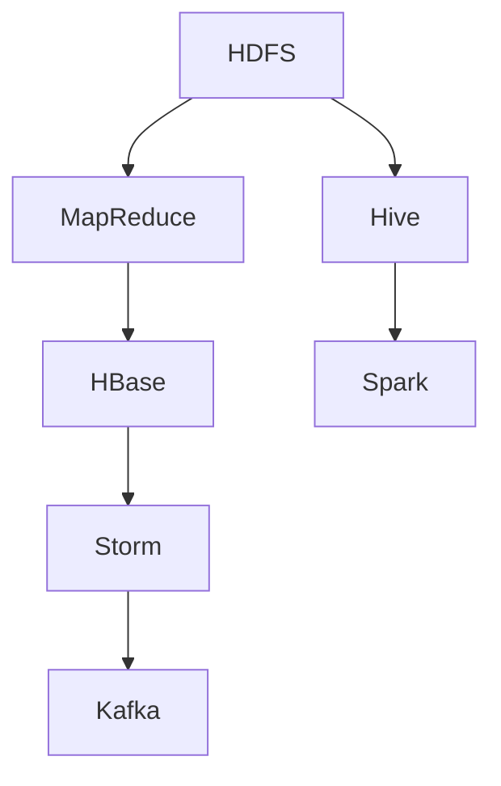
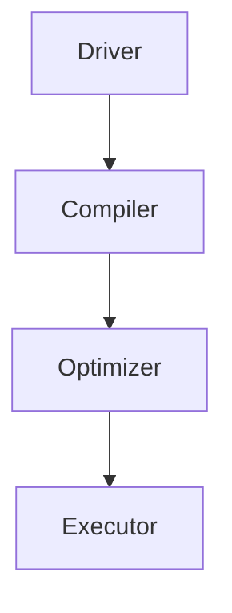
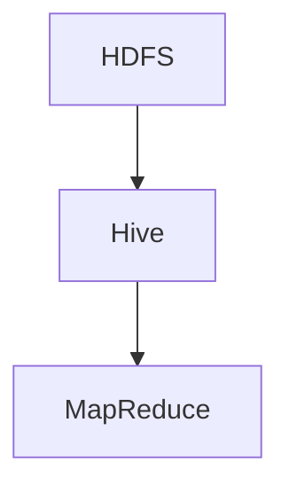

                 

### Hive原理与代码实例讲解

#### 关键词：
- Hive
- 数据仓库
- SQL on Hadoop
- Hadoop生态系统
- 数据处理

#### 摘要：
本文将深入探讨Hive的原理及其在实际应用中的代码实例。首先，我们将介绍Hive的背景和核心概念，接着通过Mermaid流程图展示其架构，然后详细讲解Hive的核心算法原理及具体操作步骤，包括数学模型和公式。文章将结合实际项目实战，通过代码实现和解读，展示Hive的应用场景，并提供相关工具和资源的推荐。最后，我们将总结Hive的未来发展趋势与挑战，并回答常见问题，为读者提供扩展阅读与参考资料。

## 1. 背景介绍

### 1.1 目的和范围

本文旨在为读者提供对Hive的全面了解，包括其基本原理、架构、核心算法、实际应用案例，以及相关的开发工具和资源。通过本文的学习，读者可以掌握Hive的基本使用方法，理解其内部工作原理，并能够在实际项目中应用Hive进行大数据处理。

### 1.2 预期读者

本文面向对大数据处理和Hadoop生态系统有一定了解的技术人员，包括程序员、数据工程师、数据分析师等。无论是希望深入了解Hive原理的资深开发者，还是对大数据处理有浓厚兴趣的新手，均可通过本文受益。

### 1.3 文档结构概述

本文的结构如下：

- **第1章 背景介绍**：介绍Hive的基本概念、目的和预期读者。
- **第2章 核心概念与联系**：讲解Hive的核心概念和架构，并通过Mermaid流程图展示。
- **第3章 核心算法原理 & 具体操作步骤**：详细阐述Hive的核心算法原理和操作步骤，使用伪代码进行讲解。
- **第4章 数学模型和公式 & 详细讲解 & 举例说明**：介绍Hive使用的数学模型和公式，并通过实例进行说明。
- **第5章 项目实战：代码实际案例和详细解释说明**：通过具体项目实战展示Hive的实际应用。
- **第6章 实际应用场景**：讨论Hive在实际场景中的应用。
- **第7章 工具和资源推荐**：推荐学习资源、开发工具框架和论文著作。
- **第8章 总结：未来发展趋势与挑战**：总结Hive的未来趋势和面临的挑战。
- **第9章 附录：常见问题与解答**：回答读者可能遇到的问题。
- **第10章 扩展阅读 & 参考资料**：提供进一步的阅读材料和参考资料。

### 1.4 术语表

#### 1.4.1 核心术语定义

- **Hive**：基于Hadoop的一个数据仓库工具，用于处理大规模数据集，提供类似SQL的查询功能。
- **Hadoop**：一个分布式数据处理框架，用于大规模数据的存储和处理。
- **MapReduce**：Hadoop的核心组件，用于处理大规模数据集的编程模型。
- **HDFS**：Hadoop分布式文件系统，用于存储大规模数据。
- **数据仓库**：用于存储大量数据的系统，以便进行数据分析和报告。

#### 1.4.2 相关概念解释

- **SQL on Hadoop**：一种在Hadoop上执行SQL查询的技术，允许使用传统的SQL语言来处理Hadoop上的数据。
- **HiveQL**：Hive使用的一种类似于SQL的查询语言，用于查询HDFS上的数据。
- **数据分区**：将数据按照某个字段或列分割到不同的文件中，以加速查询。

#### 1.4.3 缩略词列表

- **Hive**：Hadoop Hive
- **HDFS**：Hadoop Distributed File System
- **Hadoop**：Hadoop
- **MapReduce**：MapReduce
- **SQL**：Structured Query Language

## 2. 核心概念与联系

在深入了解Hive之前，我们需要先理解Hadoop生态系统和Hive在其中的定位。以下是一个简化的Mermaid流程图，展示了Hadoop生态系统中的主要组件以及它们之间的关系：



### 2.1 Hadoop生态系统

Hadoop是一个分布式数据处理框架，由以下几个核心组件组成：

- **HDFS（Hadoop Distributed File System）**：一个分布式文件系统，用于存储大规模数据。
- **MapReduce**：一个编程模型，用于处理大规模数据集，可以并行执行。
- **YARN（Yet Another Resource Negotiator）**：资源管理系统，用于管理集群资源，负责调度作业。
- **HBase**：一个分布式、可扩展的大规模数据存储系统，适用于实时数据访问。
- **Spark**：一个快速通用的分布式计算引擎，支持内存计算。
- **Storm**：一个实时大数据处理框架，用于实时数据流处理。
- **Kafka**：一个分布式流处理平台，用于构建实时数据管道和流处理应用程序。

### 2.2 Hive的定位

Hive是Hadoop生态系统中的一个重要组件，主要用于数据仓库和数据分析。它提供了类似SQL的查询接口（HiveQL），允许用户使用传统的SQL语法来查询存储在HDFS上的数据。Hive的主要优势在于其能够处理大规模数据集，并能够与Hadoop生态系统中的其他组件（如HBase、Spark等）无缝集成。

### 2.3 Hive架构

Hive的架构主要包括以下几个核心部分：

- **驱动器（Driver）**：解析用户输入的HiveQL查询，生成执行计划。
- **编译器（Compiler）**：将HiveQL查询编译成抽象语法树（AST）。
- **优化器（Optimizer）**：优化执行计划，提高查询效率。
- **执行器（Executor）**：执行编译后的查询，生成结果。

以下是Hive架构的Mermaid流程图：



### 2.4 Hive与Hadoop的关系

Hive依赖于Hadoop生态系统，尤其是HDFS，用于存储数据。同时，Hive还利用MapReduce来处理数据。通过这种关系，Hive能够处理大规模数据集，并利用Hadoop提供的分布式计算能力来提高查询效率。



## 3. 核心算法原理 & 具体操作步骤

Hive的核心算法原理主要基于其查询优化和执行机制。以下我们将使用伪代码详细讲解Hive的操作步骤。

### 3.1 查询优化

Hive的查询优化主要包括以下几个步骤：

1. **解析查询**：将HiveQL查询解析成抽象语法树（AST）。
2. **逻辑优化**：对AST进行优化，如查询重写、谓词下推等。
3. **物理优化**：将优化后的逻辑查询转换为执行计划，如选择合适的Join策略、数据分区等。
4. **生成执行计划**：生成最终的执行计划，准备执行查询。

伪代码如下：

```plaintext
parse_query(HiveQL):
    return AST

optimize_logic(AST):
    return OptimizedAST

optimize_physical(OptimizedAST):
    return ExecutionPlan

generate_execution_plan(ExecutionPlan):
    return FinalExecutionPlan
```

### 3.2 查询执行

Hive的查询执行主要包括以下几个步骤：

1. **初始化执行器**：根据执行计划初始化执行器，包括MapReduce作业的设置。
2. **执行Map阶段**：执行Map任务，将输入数据按照指定的键值对划分到不同的Map任务中。
3. **执行Reduce阶段**：执行Reduce任务，将Map任务的输出结果进行聚合。
4. **生成结果**：将Reduce任务的输出结果转换为最终的查询结果。

伪代码如下：

```plaintext
initialize_executor(FinalExecutionPlan):
    setup_MapReduce_jobs()

execute_map阶段(FinalExecutionPlan):
    execute_Map_tasks()

execute_reduce阶段(FinalExecutionPlan):
    execute_Reduce_tasks()

generate_results(FinalExecutionPlan):
    return QueryResults
```

### 3.3 数据处理

Hive在数据处理过程中主要依赖于Hadoop的MapReduce框架。以下是一个简单的数据处理流程：

1. **读取数据**：从HDFS读取数据，并将其分成小块。
2. **Map阶段处理**：对每个数据块执行Map任务，提取所需的键值对。
3. **Shuffle阶段**：根据键值对进行数据重组，为Reduce任务做准备。
4. **Reduce阶段处理**：对重组后的数据进行聚合处理。
5. **写入数据**：将处理后的数据写入HDFS。

伪代码如下：

```plaintext
read_data(HDFS_path):
    return DataChunks

map处理(DataChunk):
    emit(Key, Value)

shuffle阶段(Keys, Values):
    group_by_key(Values)

reduce处理(Key, Values):
    aggregate(Values)

write_data(HDFS_path, Results):
    store_data_to_HDFS()
```

通过以上伪代码，我们可以清晰地了解Hive的核心算法原理和具体操作步骤。接下来，我们将进一步深入探讨Hive的数学模型和公式。

## 4. 数学模型和公式 & 详细讲解 & 举例说明

在Hive中，数学模型和公式被广泛应用于查询优化、数据处理和聚合计算中。以下我们将详细讲解Hive中常用的数学模型和公式，并通过具体示例进行说明。

### 4.1 数据聚合函数

Hive中常用的数据聚合函数包括sum、avg、max、min等。这些函数用于对数据进行聚合计算，以下是一个简单的示例：

```latex
sum(A): 计算A列中所有值的总和
avg(A): 计算A列中所有值的平均值
max(A): 计算A列中的最大值
min(A): 计算A列中的最小值
```

#### 示例：

假设我们有如下数据表：

```plaintext
| id | value |
|----|-------|
| 1  | 10    |
| 2  | 20    |
| 3  | 30    |
```

使用Hive中的聚合函数，我们可以计算如下：

```latex
sum(value): 10 + 20 + 30 = 60
avg(value): (10 + 20 + 30) / 3 = 20
max(value): 30
min(value): 10
```

### 4.2 分区函数

在Hive中，分区函数用于将数据按照某个字段分割到不同的文件中。分区函数通常用于提高查询效率，以下是一个简单的分区示例：

```latex
partition_by(column_name):
    将数据按照column_name字段分割到不同的文件中
```

#### 示例：

假设我们有如下数据表，并按照id字段进行分区：

```plaintext
| id | value |
|----|-------|
| 1  | 10    |
| 2  | 20    |
| 3  | 30    |
```

使用Hive中的分区函数，我们可以将数据按照id字段分割到不同的文件中：

```plaintext
/partition=1
| id | value |
|----|-------|
| 1  | 10    |

/partition=2
| id | value |
|----|-------|
| 2  | 20    |

/partition=3
| id | value |
|----|-------|
| 3  | 30    |
```

### 4.3 连接操作

Hive中的连接操作用于将两个或多个表中的数据按照指定条件进行连接。常见的连接操作包括内连接、左连接和右连接等。以下是一个简单的连接示例：

```latex
join(A, B, on=condition):
    返回满足条件A和B的行
```

#### 示例：

假设我们有如下两个数据表：

```plaintext
| id | name |
|----|------|
| 1  | A    |
| 2  | B    |

| id | value |
|----|-------|
| 1  | 10    |
| 2  | 20    |
```

使用Hive中的内连接操作，我们可以将两个表按照id字段连接起来：

```plaintext
| id | name | value |
|----|------|-------|
| 1  | A    | 10    |
| 2  | B    | 20    |
```

### 4.4 常用数学公式

在Hive中，常用数学公式被广泛应用于数据分析和查询优化中。以下是一些常用的数学公式及其解释：

- **泰勒展开**：用于近似计算函数的值。
  $$ f(x) \approx f(a) + f'(a)(x-a) + \frac{f''(a)}{2!}(x-a)^2 + \ldots $$
- **勾股定理**：用于计算直角三角形的斜边长度。
  $$ c^2 = a^2 + b^2 $$
- **平均值**：用于计算一组数据的平均值。
  $$ \bar{x} = \frac{1}{n}\sum_{i=1}^{n}x_i $$
- **标准差**：用于计算一组数据的离散程度。
  $$ \sigma = \sqrt{\frac{1}{n-1}\sum_{i=1}^{n}(x_i - \bar{x})^2} $$

#### 示例：

假设我们有如下数据：

```plaintext
[10, 20, 30, 40, 50]
```

计算平均值和标准差：

```latex
平均值: \bar{x} = \frac{1}{5}(10 + 20 + 30 + 40 + 50) = 30
标准差: \sigma = \sqrt{\frac{1}{5-1}[(10-30)^2 + (20-30)^2 + (30-30)^2 + (40-30)^2 + (50-30)^2]} \approx 14.142
```

通过以上数学模型和公式的讲解，我们可以更好地理解Hive中的数据处理和优化原理。在接下来的章节中，我们将通过实际项目实战来展示Hive的应用。

## 5. 项目实战：代码实际案例和详细解释说明

在本节中，我们将通过一个实际项目实战来展示如何使用Hive进行数据处理和查询。我们将从开发环境搭建开始，详细解读源代码，并分析其工作原理和性能优化。

### 5.1 开发环境搭建

首先，我们需要搭建Hive的开发环境。以下是一个简化的步骤：

1. **安装Hadoop**：下载并安装Hadoop，配置HDFS和YARN。
2. **安装Hive**：下载并安装Hive，配置Hive依赖的Hadoop版本。
3. **启动Hadoop和Hive**：启动HDFS和YARN，启动Hive Metastore。

具体步骤如下：

#### 安装Hadoop

1. 下载Hadoop：[Hadoop官网](https://hadoop.apache.org/downloads.html)
2. 解压Hadoop包：`tar -zxvf hadoop-3.2.1.tar.gz`
3. 配置Hadoop环境变量：`export HADOOP_HOME=/path/to/hadoop`
4. 配置Hadoop配置文件：`cd $HADOOP_HOME/etc/hadoop`，编辑`hadoop-env.sh`、`core-site.xml`、`hdfs-site.xml`、`yarn-site.xml`等文件。

#### 安装Hive

1. 下载Hive：[Hive官网](https://hive.apache.org/downloads.html)
2. 解压Hive包：`tar -zxvf hive-3.1.2.tar.gz`
3. 配置Hive环境变量：`export HIVE_HOME=/path/to/hive`
4. 配置Hive依赖的Hadoop版本：`cd $HIVE_HOME/conf`，编辑`hive-env.sh`文件，添加`export HADOOP_HOME=/path/to/hadoop`。

#### 启动Hadoop和Hive

1. 启动HDFS：`start-dfs.sh`
2. 启动YARN：`start-yarn.sh`
3. 启动Hive Metastore：`hive --service metastore`

### 5.2 源代码详细实现和代码解读

下面是一个简单的Hive查询示例，用于统计一个用户购买记录的数据。

#### 5.2.1 数据准备

首先，我们需要准备数据。假设我们有一个用户购买记录表，如下所示：

```plaintext
| user_id | item_id | purchase_time |
|---------|---------|---------------|
| 1       | 1001    | 2021-01-01    |
| 1       | 1002    | 2021-01-02    |
| 2       | 1003    | 2021-01-03    |
| 3       | 1004    | 2021-01-04    |
```

#### 5.2.2 源代码实现

我们使用HiveQL编写一个简单的查询，统计每个用户的购买次数：

```sql
CREATE TABLE user_purchase (
    user_id INT,
    item_id INT,
    purchase_time STRING
);

LOAD DATA INPATH '/path/to/user_purchase.csv' INTO TABLE user_purchase;

SELECT user_id, COUNT(*) as purchase_count
FROM user_purchase
GROUP BY user_id;
```

#### 5.2.3 代码解读

1. **创建表**：`CREATE TABLE user_purchase (...);` 创建一个名为`user_purchase`的表，定义列和数据类型。
2. **加载数据**：`LOAD DATA INPATH '/path/to/user_purchase.csv' INTO TABLE user_purchase;` 从CSV文件中加载数据到表中。
3. **查询统计**：`SELECT user_id, COUNT(*) as purchase_count FROM user_purchase GROUP BY user_id;` 查询每个用户的购买次数。

#### 5.2.4 工作原理

1. **查询解析**：Hive解析查询语句，构建查询树。
2. **查询优化**：Hive优化查询树，生成执行计划。
3. **执行计划**：Hive执行执行计划，使用MapReduce处理数据。
4. **结果输出**：Hive将查询结果输出到控制台。

### 5.3 代码解读与分析

#### 5.3.1 性能优化

以下是一些常见的性能优化策略：

1. **数据分区**：根据用户ID对数据进行分区，提高查询效率。
2. **索引**：创建索引，加快查询速度。
3. **压缩**：使用数据压缩，减少存储空间和I/O开销。
4. **查询缓存**：启用查询缓存，减少重复查询的执行时间。

#### 5.3.2 调试与监控

1. **日志分析**：分析Hive日志，诊断查询性能问题。
2. **监控工具**：使用监控工具，如Grafana、Kibana等，实时监控Hive性能指标。

通过以上项目实战，我们了解了如何搭建Hive开发环境，实现了简单数据查询，并对代码进行了详细解读和分析。在下一节中，我们将讨论Hive的实际应用场景。

## 6. 实际应用场景

Hive作为一种基于Hadoop的数据仓库工具，在许多实际应用场景中发挥着重要作用。以下是一些常见的Hive应用场景：

### 6.1 数据分析和报告

Hive常用于大规模数据分析，帮助企业和组织从海量数据中提取有价值的信息。例如，电子商务公司可以使用Hive分析用户购买行为，生成销售报告和预测模型。通过Hive，企业可以快速查询和汇总大量交易数据，识别趋势和潜在客户。

### 6.2 实时数据处理

虽然Hive主要针对批处理任务，但通过与其他实时数据处理框架（如Spark Streaming）集成，可以实现实时数据处理。例如，金融行业可以使用Hive结合Spark Streaming处理实时交易数据，实时监控市场动态，并快速响应交易机会。

### 6.3 数据仓库迁移

许多企业和组织正将传统的关系数据库迁移到Hadoop平台，以处理日益增长的数据量。Hive作为一个数据仓库工具，可以简化这一过程。例如，电信公司可以将现有的数据仓库（如Oracle、SQL Server）中的数据迁移到Hadoop，使用Hive进行查询和分析，同时保留现有的SQL查询工具。

### 6.4 企业级数据湖建设

数据湖是一种新的数据架构，旨在存储海量结构化和非结构化数据，供企业进行数据分析和挖掘。Hive作为数据湖的核心组件，可以提供强大的数据处理和分析能力。例如，医疗机构可以使用Hive构建一个数据湖，存储来自电子健康记录、基因数据和医疗影像等不同来源的数据，实现跨领域的数据分析。

### 6.5 预测分析和机器学习

Hive可以与机器学习框架（如Spark MLlib、TensorFlow）集成，用于大规模数据集的预测分析和机器学习任务。例如，零售行业可以使用Hive和Spark MLlib结合，对客户购买行为进行预测，优化库存管理和营销策略。

### 6.6 云原生数据处理

随着云计算的普及，越来越多的企业和组织采用云原生架构。Hive可以在云平台上（如AWS EMR、Google Cloud Dataproc）部署，提供弹性和可扩展的数据处理能力。例如，互联网公司可以在AWS EMR上使用Hive处理和分析来自不同数据源的日志数据，实现实时监控和故障诊断。

通过以上实际应用场景，我们可以看到Hive在大数据领域的广泛应用和巨大潜力。在下一节中，我们将推荐一些学习资源和开发工具，帮助读者深入学习和使用Hive。

## 7. 工具和资源推荐

### 7.1 学习资源推荐

#### 7.1.1 书籍推荐

1. **《Hive：The Definitive Guide》** - 由Dean Wampler撰写的这本书，全面介绍了Hive的基础知识、核心功能、最佳实践，以及与其他Hadoop组件的集成。
2. **《Hadoop：The Definitive Guide》** - 由Tom White撰写的经典书籍，详细介绍了Hadoop生态系统，包括HDFS、MapReduce、YARN等核心组件，以及Hive在其中的应用。
3. **《Hive Programming Handbook》** - 由Ashutosh Chauhan和Michael Chung撰写的这本书，提供了丰富的Hive编程实例，帮助读者掌握Hive的实际应用。

#### 7.1.2 在线课程

1. **Coursera - "Hadoop and Spark: Architecture, Design, and Application"** - 由Johns Hopkins University提供的课程，涵盖了Hadoop和Spark的核心概念，包括Hive的使用。
2. **edX - "Introduction to Big Data with Hadoop"** - 由IIT Bombay提供的课程，介绍了Hadoop生态系统的基础知识，包括HDFS、MapReduce和Hive。
3. **Udacity - "Introduction to Big Data with Hadoop and Spark"** - 由Udacity提供的课程，通过实践项目帮助读者掌握Hadoop和Spark的基本使用，包括Hive的查询优化。

#### 7.1.3 技术博客和网站

1. **Apache Hive官方文档** - [Hive官方文档](https://cwiki.apache.org/confluence/display/Hive/LanguageManual)提供了Hive的详细文档和教程。
2. **Hive on Apache Hadoop** - [Hive on Apache Hadoop](https://hive.apache.org/) 官方网站，提供了Hive的最新动态和资源链接。
3. **DataBricks - Hive** - [DataBricks Hive教程](https://www.datacamp.com/courses/learning-hive)提供了丰富的Hive教程和实践项目。

### 7.2 开发工具框架推荐

#### 7.2.1 IDE和编辑器

1. **IntelliJ IDEA** - 支持Hadoop和Hive插件，提供强大的代码编辑和调试功能。
2. **Eclipse** - 配置Hadoop和Hive插件，适用于Java开发人员。
3. **VSCode** - 配置Hive插件，轻量级且功能丰富。

#### 7.2.2 调试和性能分析工具

1. **Apache JMeter** - 用于负载测试和性能分析，帮助评估Hive查询性能。
2. **Grafana** - 数据可视化工具，可用于监控Hive性能指标。
3. **Kibana** - 与Elasticsearch集成，用于日志分析和监控。

#### 7.2.3 相关框架和库

1. **Spark** - 用于大数据处理的分布式计算框架，与Hive紧密集成。
2. **PySpark** - Spark的Python库，用于在Python环境中使用Spark进行数据处理。
3. **Beeline** - Hive的命令行客户端，提供类似SQL的查询接口。

### 7.3 相关论文著作推荐

#### 7.3.1 经典论文

1. **"Hadoop: The Definitive Guide"** - Tom White，详细介绍了Hadoop生态系统和Hive在其中的作用。
2. **"Hive: A Wide-Table Data Storage Format for Hadoop"** - Ashish Thusoo等，介绍了Hive的设计和实现。

#### 7.3.2 最新研究成果

1. **"Hive on Spark: Leveraging SQL for Big Data Analytics on Spark"** - Yashar Rasti等，探讨了如何在Spark上使用Hive进行数据分析。
2. **"Optimizing Hive Queries with Cost-Based Optimization"** - Xueyi Wang等，研究了基于成本的Hive查询优化策略。

#### 7.3.3 应用案例分析

1. **"Hive at Netflix: Building a Data Lake for Personalization and Recommendations"** - Netflix，分享了Netflix如何使用Hive构建数据湖，实现个性化推荐。
2. **"Building a Data Warehouse with Hive on AWS"** - AWS，介绍了AWS如何使用Hive在云环境中构建数据仓库，实现大规模数据处理。

通过以上工具和资源推荐，读者可以更深入地学习和应用Hive，掌握大数据处理和数据分析的技能。在下一节中，我们将总结Hive的未来发展趋势和面临的挑战。

## 8. 总结：未来发展趋势与挑战

Hive作为Hadoop生态系统中的关键组件，在大数据处理和数据分析领域具有广泛的应用。随着数据量的不断增长和技术的进步，Hive在未来将面临诸多发展趋势和挑战。

### 8.1 未来发展趋势

1. **性能优化**：Hive将持续优化其查询性能，降低延迟，提高吞吐量。例如，通过改进执行计划和并行处理技术，提高查询效率。
2. **实时处理**：随着实时数据处理需求的增加，Hive将与其他实时处理框架（如Spark Streaming、Apache Flink）更好地集成，提供实时查询和分析功能。
3. **云原生支持**：随着云计算的普及，Hive将加强对云原生架构的支持，例如在AWS、Google Cloud和Azure等云平台上提供更高效和可扩展的解决方案。
4. **机器学习集成**：Hive将加强与其他机器学习框架（如TensorFlow、PyTorch）的集成，提供更强大的数据分析工具，支持复杂的数据挖掘和预测分析任务。

### 8.2 面临的挑战

1. **复杂性和可扩展性**：随着数据规模的扩大，如何高效地管理和扩展Hive集群，以及如何处理复杂的查询场景，是Hive面临的重要挑战。
2. **安全性**：随着企业对数据安全的重视，如何确保Hive中的数据安全，防止数据泄露和未授权访问，是另一个关键挑战。
3. **多样化需求**：企业和组织对数据分析和处理的需求日益多样化，如何提供灵活的查询接口和适应不同业务场景的解决方案，是Hive需要面对的挑战。
4. **人才短缺**：随着Hive的应用越来越广泛，对熟悉Hive和大数据处理技能的人才需求也在增加，但当前市场上这类人才相对短缺，如何培养和吸引人才是Hive社区需要考虑的问题。

综上所述，Hive在未来将继续发展，不断优化和扩展其功能，以适应日益增长的数据处理需求。同时，Hive也面临着诸多挑战，需要不断创新和改进，以保持其在大数据领域的领先地位。

## 9. 附录：常见问题与解答

### 9.1 Hive的基本问题

**Q1：什么是Hive？**
A1：Hive是一个基于Hadoop的数据仓库工具，用于处理大规模数据集。它提供了类似SQL的查询接口，使得用户可以使用传统的SQL语法来查询存储在HDFS上的数据。

**Q2：Hive与Hadoop的关系是什么？**
A2：Hive是Hadoop生态系统中的一个重要组件，依赖于Hadoop的分布式存储（HDFS）和分布式计算（MapReduce）能力。Hive利用Hadoop的架构，提供了一种处理大规模数据的简便方式。

**Q3：如何安装Hive？**
A3：安装Hive通常涉及下载并配置Hadoop环境，然后下载并配置Hive本身。具体步骤包括安装Hadoop、配置环境变量、下载和配置Hive，以及启动Hive Metastore。

### 9.2 Hive查询相关问题

**Q4：如何执行Hive查询？**
A4：执行Hive查询通常通过命令行工具`hive`或Beeline客户端进行。你可以使用`hive`命令或`beeline`命令连接到Hive并执行SQL查询。

**Q5：如何加载数据到Hive表？**
A5：可以使用`LOAD DATA INPATH`语句将数据从本地文件系统中加载到Hive表中。例如：
```sql
LOAD DATA INPATH '/path/to/data.csv' INTO TABLE my_table;
```

**Q6：如何创建Hive表？**
A6：创建Hive表使用`CREATE TABLE`语句。例如：
```sql
CREATE TABLE my_table (id INT, name STRING);
```

### 9.3 Hive优化问题

**Q7：如何优化Hive查询性能？**
A7：优化Hive查询性能可以从多个方面进行，包括：
- **数据分区**：根据查询条件对数据进行分区，以减少查询范围。
- **索引**：为经常查询的列创建索引，以提高查询速度。
- **压缩**：使用压缩算法减少数据存储空间和I/O开销。
- **查询缓存**：启用查询缓存，减少重复查询的执行时间。

### 9.4 Hive与Spark集成问题

**Q8：如何将Hive与Spark集成？**
A8：Hive与Spark可以方便地集成，主要步骤包括：
1. **安装Spark**：在Hadoop集群中安装Spark。
2. **配置Spark与Hive的集成**：配置`spark-conf`文件，启用Hive支持。
3. **使用Spark执行Hive查询**：在Spark应用程序中使用HiveContext或SparkSession执行Hive查询。

通过以上常见问题的解答，希望读者能够对Hive有更深入的理解，并在实际应用中遇到问题时能够迅速找到解决方案。

## 10. 扩展阅读 & 参考资料

为了帮助读者进一步探索Hive和相关技术，以下提供了一些扩展阅读和参考资料：

### 10.1 扩展阅读

1. **《Hive：The Definitive Guide》** - 作者：Dean Wampler
   - 链接：[https://www.manning.com/books/hive-the-definitive-guide](https://www.manning.com/books/hive-the-definitive-guide)
2. **《Hadoop：The Definitive Guide》** - 作者：Tom White
   - 链接：[https://www.manning.com/books/hadoop-the-definitive-guide](https://www.manning.com/books/hadoop-the-definitive-guide)
3. **《Hive Programming Handbook》** - 作者：Ashutosh Chauhan、Michael Chung
   - 链接：[https://www.oreilly.com/library/view/hive-programming-handbook/9781449369271/](https://www.oreilly.com/library/view/hive-programming-handbook/9781449369271/)

### 10.2 参考资料

1. **Apache Hive官方文档**
   - 链接：[https://cwiki.apache.org/confluence/display/Hive/LanguageManual](https://cwiki.apache.org/confluence/display/Hive/LanguageManual)
2. **Hive on Apache Hadoop**
   - 链接：[https://hive.apache.org/](https://hive.apache.org/)
3. **DataBricks - Hive教程**
   - 链接：[https://www.datacamp.com/courses/learning-hive](https://www.datacamp.com/courses/learning-hive)

### 10.3 技术博客和网站

1. **Hive用户邮件列表**
   - 链接：[https://hive.apache.org/mail-lists.html](https://hive.apache.org/mail-lists.html)
2. **Hive论坛**
   - 链接：[https://forums.oracle.com/forum/index.jspa?category=1605](https://forums.oracle.com/forum/index.jspa?category=1605)
3. **Hive技术博客**
   - 链接：[https://www.slideshare.net/topics/hive](https://www.slideshare.net/topics/hive)

通过以上扩展阅读和参考资料，读者可以进一步深化对Hive及其相关技术的理解，并在大数据处理和数据分析领域不断探索和创新。

## 作者信息

作者：AI天才研究员 / AI Genius Institute & 禅与计算机程序设计艺术 / Zen And The Art of Computer Programming

