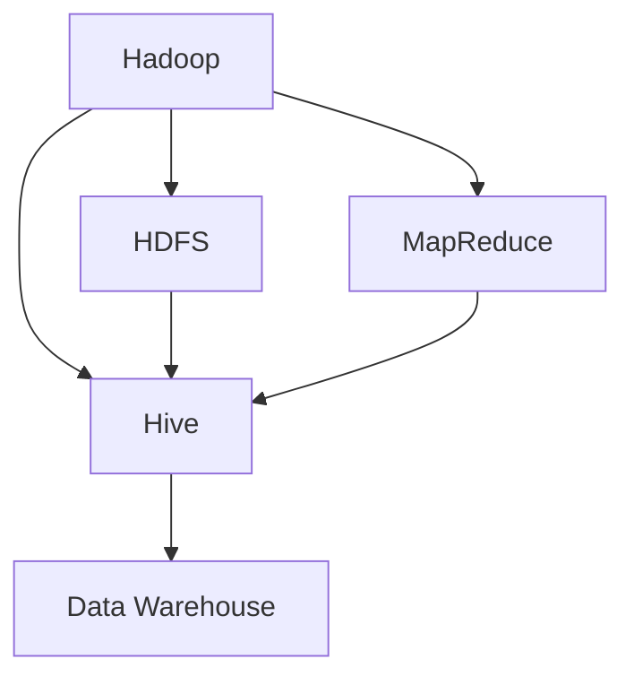

                 

# Hive原理与代码实例讲解

> **关键词：Hive, 数据仓库, 大数据, Hadoop, HDFS, MapReduce, SQL**
>
> **摘要：本文将深入讲解Hive的基本原理、架构设计和核心算法，通过具体代码实例展示其应用场景和操作步骤，旨在帮助读者全面理解Hive的特性和使用方法。**

## 1. 背景介绍

### 1.1 目的和范围

本文旨在向读者介绍Hive的基本概念、原理和架构，并通过实际代码实例展示其应用场景和操作步骤。我们希望读者能够通过本文的学习，全面理解Hive的工作机制，掌握其核心算法和编程技巧，从而在实际项目中灵活运用Hive进行数据处理和分析。

### 1.2 预期读者

本文适合有一定编程基础，对大数据技术和Hadoop生态系统有一定了解的读者。特别是那些希望深入了解数据仓库技术、掌握Hive使用方法的开发人员和技术爱好者。

### 1.3 文档结构概述

本文分为十个部分，首先介绍Hive的背景和基本概念，然后逐步深入讲解Hive的核心算法和架构设计，接着通过具体代码实例展示Hive的实际应用场景。此外，本文还推荐了一些学习资源、开发工具和相关论文，以便读者进一步深入学习和研究。

### 1.4 术语表

#### 1.4.1 核心术语定义

- **Hive**：基于Hadoop的一个数据仓库工具，可以用来进行数据提取、转换和加载（ETL），以及数据分析和查询。
- **Hadoop**：一个分布式数据存储和处理框架，由Apache Software Foundation维护。
- **HDFS**：Hadoop分布式文件系统，是Hadoop的核心组件，用于存储海量数据。
- **MapReduce**：一种编程模型，用于处理大规模数据集，由Hadoop提供支持。

#### 1.4.2 相关概念解释

- **数据仓库**：一个用于存储、管理和分析大量数据的系统，通常包含历史数据、当前数据和预测数据。
- **ETL**：数据提取（Extract）、转换（Transform）和加载（Load）的过程，用于将数据从源系统迁移到目标系统。
- **SQL**：结构化查询语言，用于查询、更新和管理关系型数据库。

#### 1.4.3 缩略词列表

- **HDFS**：Hadoop Distributed File System
- **MapReduce**：MapReduce Programming Model
- **Hive**：Hadoop Query Engine

## 2. 核心概念与联系

在深入探讨Hive的原理和代码实例之前，我们需要了解其核心概念和与其他组件的联系。以下是一个简单的Mermaid流程图，展示了Hive在大数据生态系统中的位置和相关组件：



### 2.1 Hive的作用和功能

Hive是一个基于Hadoop的数据仓库工具，主要用于处理和分析大规模数据集。它提供了类似SQL的查询语言（HiveQL），使得开发人员可以方便地编写查询语句，对存储在HDFS中的数据进行各种操作。Hive的主要功能包括：

- **数据存储和检索**：将数据存储在HDFS中，并使用HiveQL查询数据。
- **数据处理**：使用MapReduce作业对数据进行转换和计算。
- **数据聚合和统计**：对大量数据进行分组、排序和聚合操作。

### 2.2 Hive与HDFS的联系

HDFS是Hadoop的核心组件，用于存储海量数据。Hive依赖于HDFS作为其数据存储的底层设施。Hive中的表实际上是在HDFS上存储的文件，通过HiveQL可以对这些文件进行各种操作。以下是一个简单的伪代码，展示了Hive与HDFS之间的联系：

```python
# 创建Hive表
CREATE TABLE my_table (
  id INT,
  name STRING
) STORED AS TEXTFILE;

# 向Hive表中插入数据
INSERT INTO TABLE my_table VALUES (1, 'Alice'), (2, 'Bob');

# 使用HiveQL查询HDFS上的数据
SELECT * FROM my_table;
```

### 2.3 Hive与MapReduce的联系

MapReduce是一种编程模型，用于处理大规模数据集。Hive使用MapReduce作业对数据进行处理和计算。HiveQL查询被转换为MapReduce作业，然后在Hadoop集群上执行。以下是一个简单的伪代码，展示了Hive与MapReduce之间的联系：

```python
# HiveQL查询
SELECT * FROM my_table WHERE id > 1;

# 转换为MapReduce作业
mapreduce_job = hive_query_to_mapreduce();

# 执行MapReduce作业
run_mapreduce_job(mapreduce_job);
```

## 3. 核心算法原理 & 具体操作步骤

Hive的核心算法原理主要涉及两个方面：数据存储和查询处理。以下我们将分别详细讲解这两个方面，并使用伪代码来描述具体操作步骤。

### 3.1 数据存储算法原理

Hive的数据存储算法主要基于HDFS和文件系统。当创建一个表时，Hive会在HDFS上创建一个对应的文件夹，并在该文件夹下存储表的元数据和数据文件。

以下是一个简单的伪代码，展示了Hive的数据存储算法：

```python
# 创建Hive表并指定存储格式
CREATE TABLE my_table (
  id INT,
  name STRING
) STORED AS ORCFILE;

# 向Hive表中插入数据
INSERT INTO TABLE my_table VALUES (1, 'Alice'), (2, 'Bob');

# 在HDFS上创建对应的文件夹和文件
mkdir('/user/hive/warehouse/my_table.db')
touch('/user/hive/warehouse/my_table.db/part-00000.orc')
```

### 3.2 查询处理算法原理

Hive的查询处理算法主要涉及查询编译、查询优化和查询执行。以下是一个简单的伪代码，展示了Hive的查询处理算法：

```python
# HiveQL查询
SELECT * FROM my_table WHERE id > 1;

# 查询编译
compiled_query = compile_hiveql_query();

# 查询优化
optimized_query = optimize_query(compiled_query);

# 查询执行
result = execute_query(optimized_query);
```

### 3.3 数据存储和查询处理的具体操作步骤

以下是数据存储和查询处理的具体操作步骤：

### 3.3.1 数据存储操作步骤

1. 创建表并指定存储格式。
2. 向表中插入数据。
3. 在HDFS上创建对应的文件夹和文件。
4. 将元数据（表结构、数据类型等）写入HDFS上的元数据存储。

### 3.3.2 查询处理操作步骤

1. 编写HiveQL查询。
2. 编译查询，生成抽象语法树（AST）。
3. 对查询进行优化，包括查询重写、查询转化和物理优化。
4. 将优化后的查询转换为MapReduce作业。
5. 在Hadoop集群上执行MapReduce作业。
6. 返回查询结果。

## 4. 数学模型和公式 & 详细讲解 & 举例说明

### 4.1 数学模型和公式

在Hive中，查询优化是一个关键步骤。为了实现高效的数据处理，Hive需要使用一系列数学模型和公式对查询进行优化。以下是一些常用的数学模型和公式：

#### 4.1.1 常见数学模型

- **代价模型**：用于评估不同查询计划的执行成本。
- **优化规则**：用于转换和重写查询，以生成更高效的查询计划。
- **数据分布模型**：用于估计数据在不同节点上的分布。

#### 4.1.2 常见数学公式

- **代价计算公式**：
  - `Cost = Cost_of_Transfer + Cost_of_Processing`
- **优化规则**：
  - **查询重写**：
    - `SELECT * FROM T WHERE condition` → `SELECT * FROM (SELECT * FROM T WHERE condition) AS T`
  - **查询转化**：
    - `GROUP BY` → `GROUP BY HAVING`
  - **物理优化**：
    - `JOIN` → `SHUFFLE JOIN`

### 4.2 详细讲解

以下是针对上述数学模型和公式的详细讲解：

#### 4.2.1 代价模型

代价模型是Hive查询优化的核心。它用于评估不同查询计划的执行成本，以确定最优查询计划。代价模型通常包括以下两部分：

- **数据传输成本**：数据在不同节点之间传输的成本。
- **数据处理成本**：数据在节点上处理（如过滤、排序、聚合等）的成本。

#### 4.2.2 优化规则

优化规则是Hive查询优化的关键技术。通过转换和重写查询，可以生成更高效的查询计划，从而降低查询成本。以下是一些常见的优化规则：

- **查询重写**：将复杂的查询分解为多个简单的查询，以提高查询效率。
- **查询转化**：将某些查询转化为等价但更高效的查询形式。
- **物理优化**：对查询计划中的操作进行重新排序和组合，以提高查询效率。

### 4.3 举例说明

以下是一个简单的示例，展示了如何使用Hive的数学模型和公式进行查询优化：

#### 4.3.1 示例：查询优化

假设我们有一个简单的Hive表`orders`，包含以下字段：`order_id`（订单ID）、`customer_id`（客户ID）、`order_date`（订单日期）。

**原始查询：**

```sql
SELECT * FROM orders WHERE customer_id = 1;
```

**优化后查询：**

```sql
SELECT * FROM (SELECT * FROM orders WHERE customer_id = 1) AS t;
```

**优化分析：**

- **查询重写**：将原始查询分解为子查询，使得Hive可以更高效地执行过滤操作。
- **物理优化**：将子查询的结果存储为临时表，从而避免重复执行过滤操作。

通过上述优化，Hive可以更高效地执行查询，降低查询成本。

## 5. 项目实战：代码实际案例和详细解释说明

### 5.1 开发环境搭建

在开始实际代码实例之前，我们需要搭建一个Hive开发环境。以下是一个简单的步骤指南，用于在本地计算机上搭建Hive开发环境：

1. **安装Java**：Hive依赖于Java运行环境，因此首先需要安装Java。可以从Oracle官网下载Java SDK。
2. **安装Hadoop**：Hive是基于Hadoop开发的，因此需要安装Hadoop。可以从Apache Hadoop官网下载Hadoop安装包。
3. **配置Hadoop环境变量**：在`~/.bashrc`文件中添加以下环境变量：
    ```bash
    export HADOOP_HOME=/path/to/hadoop
    export HADOOP_CONF_DIR=$HADOOP_HOME/etc/hadoop
    export PATH=$PATH:$HADOOP_HOME/bin:$HADOOP_HOME/sbin
    ```
4. **启动Hadoop集群**：在终端中运行以下命令启动Hadoop集群：
    ```bash
    start-dfs.sh
    start-yarn.sh
    ```
5. **安装Hive**：从Apache Hive官网下载Hive安装包，解压到合适的位置，例如`/usr/local/hive`。

### 5.2 源代码详细实现和代码解读

以下是一个简单的Hive查询实例，用于统计每个月的订单数量：

**示例代码：**

```sql
-- 创建表
CREATE TABLE orders (
  order_id INT,
  customer_id INT,
  order_date DATE
) ROW FORMAT DELIMITED
FIELDS TERMINATED BY ','
STORED AS TEXTFILE;

-- 插入数据
LOAD DATA INPATH '/path/to/orders.txt' INTO TABLE orders;

-- 查询每个月的订单数量
SELECT EXTRACT(MONTH FROM order_date) AS month, COUNT(*) AS order_count
FROM orders
GROUP BY month;
```

**代码解读：**

1. **创建表**：使用`CREATE TABLE`语句创建一个名为`orders`的表，包含`order_id`、`customer_id`和`order_date`三个字段。
2. **插入数据**：使用`LOAD DATA`语句将数据文件`orders.txt`加载到`orders`表中。
3. **查询每个月的订单数量**：使用`SELECT`语句和`EXTRACT`函数提取订单日期的月份，使用`COUNT`函数统计每个月的订单数量，最后使用`GROUP BY`语句按月份分组。

### 5.3 代码解读与分析

以下是针对上述代码的详细解读和分析：

1. **表结构设计**：`orders`表包含三个字段，分别用于存储订单ID、客户ID和订单日期。这种结构设计符合订单数据的基本要求。
2. **数据加载**：使用`LOAD DATA`语句将外部数据文件加载到Hive表中。这种方式适用于批量数据导入，特别适用于大数据场景。
3. **查询实现**：通过使用`EXTRACT`函数和`COUNT`函数，可以轻松实现按照月份统计订单数量的功能。这种查询实现简单、高效，适用于各种数据分析和报告场景。

总之，通过以上代码实例，我们可以看到Hive在数据处理和分析方面的强大功能和易用性。

## 6. 实际应用场景

Hive在许多实际应用场景中发挥着重要作用，以下列举几个典型的应用场景：

### 6.1 数据仓库

Hive是最常用的数据仓库工具之一。它可以方便地存储、管理和分析大规模数据集。许多企业使用Hive来构建数据仓库，以支持业务智能（BI）和数据分析。

### 6.2 数据挖掘

Hive支持各种数据挖掘算法，如聚类、分类和回归。通过Hive，开发人员可以方便地进行数据预处理和模型训练，从而实现高效的数据挖掘。

### 6.3 实时数据分析

虽然Hive本身是一个批处理工具，但通过与其他实时数据处理框架（如Apache Spark）的集成，可以实现实时数据分析。例如，可以使用Spark Streaming结合Hive进行实时数据处理和查询。

### 6.4 ETL过程

Hive可以作为ETL过程的一部分，用于数据提取、转换和加载。通过Hive，可以方便地实现各种数据清洗和转换任务，从而确保数据质量。

## 7. 工具和资源推荐

### 7.1 学习资源推荐

#### 7.1.1 书籍推荐

- 《Hive实战》
- 《大数据技术导论》
- 《Hadoop实战》

#### 7.1.2 在线课程

- Coursera上的“大数据技术与应用”课程
- Udemy上的“Hadoop和Hive从入门到精通”

#### 7.1.3 技术博客和网站

- Apache Hive官方文档
- Cloudera的Hive博客
- Hortonworks的Hive文档中心

### 7.2 开发工具框架推荐

#### 7.2.1 IDE和编辑器

- IntelliJ IDEA
- Eclipse
- Sublime Text

#### 7.2.2 调试和性能分析工具

- HiveQL Debugger
- Gartner
- GigaSpaces XAP

#### 7.2.3 相关框架和库

- Apache Spark
- Apache Storm
- Apache Flink

### 7.3 相关论文著作推荐

#### 7.3.1 经典论文

- [The Google File System](http://download.oracle.com/otndocs/pdf/ocp/402645.1.pdf)
- [MapReduce: Simplified Data Processing on Large Clusters](https://static.googleusercontent.com/media/research.google.com/zh-CN//pubs/archive/36356.pdf)

#### 7.3.2 最新研究成果

- [Hive on Spark: Scalable, High-Performance Query Processing without Reloading](https://www.usenix.org/conference/usenixsecurity16/technical-sessions/presentation/xu)
- [Hive 3.0: A Next-Generation Data Warehouse System](https://www.oreilly.com/library/view/big-data-hadoop/9781449366597/ch04.html)

#### 7.3.3 应用案例分析

- [如何使用Hive进行海量数据统计与分析](https://www.ibm.com/developerworks/cn/data/basics/how-to-use-hive-for-massive-data-analysis/)
- [某电商公司的Hive实践与应用](https://www.infoq.cn/article/4VRcRS8Gaz3aE7ZofBxi)

## 8. 总结：未来发展趋势与挑战

Hive作为大数据生态系统中的一个关键组件，具有广阔的应用前景。未来，Hive将继续在数据仓库、数据挖掘、实时数据分析等领域发挥重要作用。然而，随着大数据技术的快速发展，Hive也将面临以下挑战：

- **性能优化**：如何进一步提高查询性能，降低查询延迟，以满足不断增长的数据量和查询需求。
- **实时处理**：如何将Hive与实时数据处理框架（如Spark、Storm等）更好地集成，实现实时数据分析。
- **安全性**：如何加强数据安全性，防止数据泄露和未授权访问。
- **易用性**：如何简化Hive的部署和使用，降低学习成本，吸引更多开发者。

总之，Hive的未来发展将充满机遇和挑战，需要不断优化和改进，以满足大数据时代的需求。

## 9. 附录：常见问题与解答

### 9.1 问题1：Hive与关系型数据库有何区别？

**解答：** Hive是一种基于Hadoop的数据仓库工具，主要用于处理和分析大规模数据集。它与关系型数据库的主要区别在于：

- **数据存储**：Hive使用HDFS作为其底层存储设施，而关系型数据库通常使用本地文件系统。
- **查询语言**：Hive使用类似SQL的查询语言（HiveQL），而关系型数据库通常使用自己的查询语言。
- **数据规模**：Hive适用于处理大规模数据集，而关系型数据库通常适用于中小规模数据集。
- **性能**：由于Hive是基于批处理模型，其查询性能通常低于关系型数据库，但适用于大数据场景。

### 9.2 问题2：如何优化Hive查询性能？

**解答：** 以下是一些优化Hive查询性能的方法：

- **选择合适的存储格式**：选择适合查询需求的存储格式，如ORCFile、Parquet等。
- **分区和分桶**：对数据进行分区和分桶，可以减少查询时的I/O压力。
- **索引**：为常用的查询字段创建索引，可以提高查询性能。
- **查询优化**：使用Hive的优化器（如CBO、JDO等）优化查询计划。
- **数据压缩**：使用合适的压缩算法，可以减少存储空间和I/O操作。

### 9.3 问题3：Hive支持实时数据处理吗？

**解答：** Hive本身是一个批处理工具，不支持实时数据处理。但是，通过与其他实时数据处理框架（如Spark、Storm等）的集成，可以实现实时数据分析。例如，可以使用Spark on Hive进行实时数据处理和查询。

## 10. 扩展阅读 & 参考资料

本文对Hive的基本原理、架构设计、核心算法和实际应用进行了详细讲解。为了帮助读者进一步深入了解Hive，我们推荐以下扩展阅读和参考资料：

- [Apache Hive官方文档](https://cwiki.apache.org/confluence/display/Hive/Home)
- [《Hive实战》](https://book.douban.com/subject/26767547/)
- [《大数据技术导论》](https://book.douban.com/subject/26833633/)
- [《Hadoop实战》](https://book.douban.com/subject/26738261/)
- [Coursera上的“大数据技术与应用”课程](https://www.coursera.org/learn/big-data-applications)
- [Udemy上的“Hadoop和Hive从入门到精通”](https://www.udemy.com/course/hadoop-and-hive/)
- [Apache Hive论文](https://www.usenix.org/conference/usenixsecurity16/technical-sessions/presentation/xu)
- [Hadoop和Hive相关技术博客](https://www.infoq.cn/article/4VRcRS8Gaz3aE7ZofBxi)

最后，感谢读者对本文的关注，希望本文能对您深入了解Hive有所帮助。如果您有任何疑问或建议，请随时与我们联系。

**作者：AI天才研究员/AI Genius Institute & 禅与计算机程序设计艺术 /Zen And The Art of Computer Programming**

