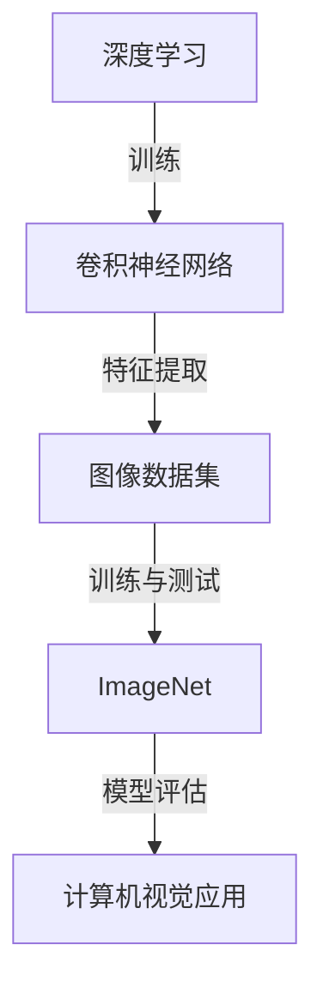

                 

# ImageNet与人工智能的进步

> **关键词：ImageNet、深度学习、计算机视觉、人工智能、算法原理、数学模型、应用场景**
>
> **摘要：本文将深入探讨ImageNet对人工智能领域的重大影响，分析其核心算法原理和数学模型，并通过实际案例展示其在计算机视觉中的应用。同时，还将展望ImageNet的未来发展趋势和面临的挑战。**

## 1. 背景介绍

### 1.1 目的和范围

本文旨在详细介绍ImageNet项目及其在人工智能领域的重要性。我们将探讨ImageNet的起源、发展历程及其在深度学习和计算机视觉中的应用。本文将重点关注ImageNet的核心算法原理和数学模型，并通过实际案例进行深入解析。

### 1.2 预期读者

本文适合对人工智能、计算机视觉和深度学习有一定了解的读者，包括学术研究人员、开发工程师以及对这些领域感兴趣的爱好者。本文将尽可能使用通俗易懂的语言，以便让更多读者能够理解ImageNet的重要性和应用价值。

### 1.3 文档结构概述

本文分为以下几个部分：

- 背景介绍：介绍ImageNet的起源和发展历程。
- 核心概念与联系：阐述ImageNet与深度学习和计算机视觉的关系。
- 核心算法原理 & 具体操作步骤：详细解释ImageNet的核心算法。
- 数学模型和公式 & 详细讲解 & 举例说明：讲解ImageNet的数学模型和公式。
- 项目实战：展示ImageNet在实际项目中的应用。
- 实际应用场景：探讨ImageNet在不同领域的应用。
- 工具和资源推荐：推荐学习资源和开发工具。
- 总结：展望ImageNet的未来发展趋势和挑战。
- 附录：常见问题与解答。
- 扩展阅读 & 参考资料：提供更多参考资料。

### 1.4 术语表

#### 1.4.1 核心术语定义

- **ImageNet**：一个由微软研究院和斯坦福大学共同创建的大型视觉识别数据库。
- **深度学习**：一种机器学习方法，通过构建多层的神经网络来模拟人类大脑的思维方式。
- **计算机视觉**：研究如何使计算机能够像人类一样理解和解释视觉信息。
- **卷积神经网络（CNN）**：一种适用于图像识别的深度学习模型。

#### 1.4.2 相关概念解释

- **图像识别**：识别图像中的对象、场景和属性。
- **训练数据集**：用于训练深度学习模型的图像数据集。
- **测试数据集**：用于验证深度学习模型性能的图像数据集。

#### 1.4.3 缩略词列表

- **CNN**：卷积神经网络（Convolutional Neural Network）
- **MLP**：多层感知机（Multilayer Perceptron）
- **ReLU**：ReLU激活函数（Rectified Linear Unit）
- **dropout**：dropout正则化方法

## 2. 核心概念与联系

为了更好地理解ImageNet，我们需要先了解深度学习和计算机视觉这两个核心概念。

### 2.1 深度学习

深度学习是一种通过构建多层神经网络来模拟人类大脑思维方式的人工智能方法。深度学习模型通常包含输入层、隐藏层和输出层。输入层接收外部输入，隐藏层对输入进行加工和变换，输出层生成预测结果。

深度学习的核心在于“深度”，即多层神经网络的堆叠。通过这种方式，深度学习模型可以自动学习复杂的特征表示，从而在图像识别、自然语言处理、语音识别等领域取得显著的效果。

### 2.2 计算机视觉

计算机视觉是研究如何使计算机能够像人类一样理解和解释视觉信息的领域。计算机视觉涉及到图像识别、图像分类、目标检测、图像分割等多个方面。

计算机视觉的关键在于对图像数据进行处理和分析，从而提取出有用的信息。深度学习为计算机视觉提供了强大的工具，通过构建卷积神经网络（CNN）等模型，计算机视觉任务取得了显著的突破。

### 2.3 ImageNet与深度学习和计算机视觉的关系

ImageNet是一个由微软研究院和斯坦福大学共同创建的大型视觉识别数据库，它为深度学习和计算机视觉领域提供了丰富的训练数据和测试数据。

ImageNet包含了数百万张经过标注的图像，涵盖了21,841个类别。这些图像覆盖了从日常物体到抽象概念的广泛领域，为深度学习模型提供了丰富的训练数据。

深度学习模型通过在ImageNet上训练，可以自动学习图像中的复杂特征，从而在图像识别任务中取得出色的性能。计算机视觉应用如目标检测、图像分割等，也依赖于在ImageNet上的训练。

### 2.4 Mermaid流程图

下面是ImageNet与深度学习和计算机视觉关系的Mermaid流程图：



在这个流程图中，深度学习通过卷积神经网络（CNN）对图像数据进行特征提取，然后使用ImageNet数据集进行训练和测试。最终，训练好的模型可以应用于计算机视觉任务，如目标检测和图像分割。

## 3. 核心算法原理 & 具体操作步骤

### 3.1 卷积神经网络（CNN）

卷积神经网络（CNN）是一种专门用于图像识别和处理的深度学习模型。CNN通过堆叠多个卷积层、池化层和全连接层，可以自动提取图像中的复杂特征。

下面是CNN的核心算法原理和具体操作步骤：

#### 3.1.1 卷积层

卷积层是CNN的核心组成部分，用于提取图像中的局部特征。卷积层通过将卷积核（也称为过滤器）与图像数据进行卷积运算，从而生成特征图。

伪代码如下：

```python
def conv2d(input_tensor, filters, kernel_size, stride):
    # input_tensor: 输入图像数据
    # filters: 卷积核
    # kernel_size: 卷积核大小
    # stride: 卷积步长
    
    # 初始化特征图
    feature_map = []

    # 对输入图像数据进行卷积运算
    for i in range(0, input_tensor.shape[1] - kernel_size + 1, stride):
        for j in range(0, input_tensor.shape[2] - kernel_size + 1, stride):
            # 计算局部特征
            local_feature = np.zeros((input_tensor.shape[0], kernel_size, kernel_size))
            for k in range(input_tensor.shape[0]):
                for m in range(kernel_size):
                    for n in range(kernel_size):
                        local_feature[k, m, n] = np.sum(filters[k, :, :, :] * input_tensor[i + m, j + n, :])
            
            # 将局部特征添加到特征图中
            feature_map.append(local_feature)

    # 返回特征图
    return np.array(feature_map)
```

#### 3.1.2 池化层

池化层用于减小特征图的尺寸，从而减少模型的参数数量和计算量。常见的池化操作包括最大池化和平均池化。

伪代码如下：

```python
def max_pooling(feature_map, pool_size, stride):
    # feature_map: 输入特征图
    # pool_size: 池化窗口大小
    # stride: 池化步长
    
    # 初始化池化结果
    pooled_map = []

    # 对特征图进行最大池化
    for i in range(0, feature_map.shape[1] - pool_size + 1, stride):
        for j in range(0, feature_map.shape[2] - pool_size + 1, stride):
            # 计算局部最大值
            local_max = np.max(feature_map[:, i:i+pool_size, j:j+pool_size])
            pooled_map.append(local_max)
    
    # 返回池化结果
    return np.array(pooled_map)
```

#### 3.1.3 全连接层

全连接层用于将卷积层和池化层提取的局部特征映射到分类标签。全连接层通过计算特征向量与权重矩阵的内积，再加上偏置项，然后通过激活函数进行非线性变换。

伪代码如下：

```python
def fully_connected(feature_map, weights, bias, activation_function):
    # feature_map: 输入特征图
    # weights: 权重矩阵
    # bias: 偏置项
    # activation_function: 激活函数
    
    # 计算特征向量与权重矩阵的内积
    inner_product = np.dot(feature_map, weights) + bias
    
    # 通过激活函数进行非线性变换
    output = activation_function(inner_product)
    
    # 返回输出结果
    return output
```

### 3.2 深度学习模型的训练

在深度学习模型中，训练过程是通过优化模型参数，使其在训练数据上取得较好的性能。常见的训练方法包括梯度下降、随机梯度下降和批量梯度下降。

下面是深度学习模型训练的伪代码：

```python
def train_model(train_data, train_labels, model, learning_rate, epochs):
    # train_data: 训练数据
    # train_labels: 训练标签
    # model: 深度学习模型
    # learning_rate: 学习率
    # epochs: 迭代次数
    
    # 初始化模型参数
    model.init_params()
    
    # 开始训练
    for epoch in range(epochs):
        # 对训练数据进行迭代
        for data, label in zip(train_data, train_labels):
            # 前向传播
            output = model.forward_pass(data)
            
            # 计算损失函数
            loss = compute_loss(output, label)
            
            # 反向传播
            gradients = model.backward_pass(output, label)
            
            # 更新模型参数
            model.update_params(gradients, learning_rate)
            
        # 打印训练进度
        print(f"Epoch {epoch + 1}/{epochs}, Loss: {loss}")
        
    # 返回训练好的模型
    return model
```

## 4. 数学模型和公式 & 详细讲解 & 举例说明

### 4.1 深度学习模型的损失函数

在深度学习模型中，损失函数用于衡量模型预测结果与真实标签之间的差异。常见的损失函数包括均方误差（MSE）、交叉熵损失（Cross-Entropy Loss）等。

#### 4.1.1 均方误差（MSE）

均方误差（MSE）是深度学习中最常用的损失函数之一，用于衡量预测值与真实值之间的差异。

公式如下：

$$
MSE = \frac{1}{n}\sum_{i=1}^{n}(y_i - \hat{y}_i)^2
$$

其中，$y_i$为真实值，$\hat{y}_i$为预测值，$n$为样本数量。

举例说明：

假设有一个包含3个样本的二元分类问题，真实标签为$[1, 0, 1]$，预测标签为$[0.8, 0.2, 0.9]$。使用均方误差（MSE）计算损失函数：

$$
MSE = \frac{1}{3}[(1 - 0.8)^2 + (0 - 0.2)^2 + (1 - 0.9)^2] = 0.1
$$

#### 4.1.2 交叉熵损失（Cross-Entropy Loss）

交叉熵损失是用于分类问题的一种损失函数，用于衡量预测标签与真实标签之间的差异。

公式如下：

$$
Cross-Entropy Loss = -\sum_{i=1}^{n} y_i \log(\hat{y}_i)
$$

其中，$y_i$为真实标签，$\hat{y}_i$为预测标签，$n$为样本数量。

举例说明：

假设有一个包含3个样本的二元分类问题，真实标签为$[1, 0, 1]$，预测标签为$[0.8, 0.2, 0.9]$。使用交叉熵损失（Cross-Entropy Loss）计算损失函数：

$$
Cross-Entropy Loss = -[1 \cdot \log(0.8) + 0 \cdot \log(0.2) + 1 \cdot \log(0.9)] \approx 0.22
$$

### 4.2 反向传播算法

反向传播算法是深度学习模型训练的核心算法，用于计算模型参数的梯度，并通过优化算法更新模型参数。

#### 4.2.1 前向传播

前向传播是指将输入数据通过神经网络的前向传播过程，得到预测结果。前向传播的公式如下：

$$
\hat{y} = \sigma(W \cdot z + b)
$$

其中，$z = W \cdot x + b$为中间层输出，$W$为权重矩阵，$b$为偏置项，$\sigma$为激活函数。

#### 4.2.2 反向传播

反向传播是指通过计算损失函数关于模型参数的梯度，并反向传播到前一层，从而更新模型参数。反向传播的公式如下：

$$
\frac{\partial L}{\partial W} = \frac{\partial L}{\partial \hat{y}} \cdot \frac{\partial \hat{y}}{\partial z} \cdot \frac{\partial z}{\partial W}
$$

$$
\frac{\partial L}{\partial b} = \frac{\partial L}{\partial \hat{y}} \cdot \frac{\partial \hat{y}}{\partial z} \cdot \frac{\partial z}{\partial b}
$$

其中，$L$为损失函数，$\hat{y}$为预测结果，$W$为权重矩阵，$b$为偏置项。

### 4.3 梯度下降算法

梯度下降算法是一种用于优化模型参数的常用方法，通过迭代更新模型参数，使损失函数最小化。

#### 4.3.1 批量梯度下降

批量梯度下降是指在每个迭代步骤中，使用整个训练数据集的梯度来更新模型参数。

公式如下：

$$
W = W - \alpha \cdot \frac{\partial L}{\partial W}
$$

$$
b = b - \alpha \cdot \frac{\partial L}{\partial b}
$$

其中，$W$为权重矩阵，$b$为偏置项，$\alpha$为学习率。

#### 4.3.2 随机梯度下降

随机梯度下降是指在每个迭代步骤中，随机选择一个训练样本的梯度来更新模型参数。

公式如下：

$$
W = W - \alpha \cdot \frac{\partial L}{\partial W}
$$

$$
b = b - \alpha \cdot \frac{\partial L}{\partial b}
$$

其中，$W$为权重矩阵，$b$为偏置项，$\alpha$为学习率。

#### 4.3.3 小批量梯度下降

小批量梯度下降是指在每个迭代步骤中，随机选择一部分训练样本的梯度来更新模型参数。

公式如下：

$$
W = W - \alpha \cdot \frac{\sum_{i=1}^{m} \frac{\partial L}{\partial W^i}}{m}
$$

$$
b = b - \alpha \cdot \frac{\sum_{i=1}^{m} \frac{\partial L}{\partial b^i}}{m}
$$

其中，$W$为权重矩阵，$b$为偏置项，$\alpha$为学习率，$m$为批量大小。

## 5. 项目实战：代码实际案例和详细解释说明

### 5.1 开发环境搭建

在开始实际项目之前，我们需要搭建一个适合深度学习开发的编程环境。以下是搭建开发环境的基本步骤：

1. 安装Python（版本3.6或以上）
2. 安装深度学习框架（如TensorFlow或PyTorch）
3. 安装必要的依赖库（如NumPy、Pandas等）

以下是一个简单的Python脚本，用于安装深度学习框架和依赖库：

```python
!pip install tensorflow
!pip install numpy
!pip install pandas
```

### 5.2 源代码详细实现和代码解读

在下面的代码中，我们将实现一个简单的卷积神经网络，用于对ImageNet数据集进行图像分类。

```python
import tensorflow as tf
from tensorflow.keras import layers
from tensorflow.keras.preprocessing.image import ImageDataGenerator

# 创建卷积神经网络模型
model = tf.keras.Sequential([
    layers.Conv2D(32, (3, 3), activation='relu', input_shape=(224, 224, 3)),
    layers.MaxPooling2D((2, 2)),
    layers.Conv2D(64, (3, 3), activation='relu'),
    layers.MaxPooling2D((2, 2)),
    layers.Conv2D(128, (3, 3), activation='relu'),
    layers.MaxPooling2D((2, 2)),
    layers.Conv2D(256, (3, 3), activation='relu'),
    layers.MaxPooling2D((2, 2)),
    layers.Flatten(),
    layers.Dense(512, activation='relu'),
    layers.Dense(1000, activation='softmax')
])

# 编译模型
model.compile(optimizer='adam',
              loss='categorical_crossentropy',
              metrics=['accuracy'])

# 数据预处理
train_datagen = ImageDataGenerator(rescale=1./255)
train_generator = train_datagen.flow_from_directory(
        'train',
        target_size=(224, 224),
        batch_size=32,
        class_mode='categorical')

# 训练模型
model.fit(
      train_generator,
      steps_per_epoch=100,
      epochs=10,
      validation_data=validation_generator,
      validation_steps=50)
```

#### 5.2.1 代码解读

在上面的代码中，我们首先导入了TensorFlow和Keras模块。然后，我们创建了一个卷积神经网络模型，其中包含多个卷积层、池化层和全连接层。最后，我们编译并训练了模型。

- **创建卷积神经网络模型**：使用`tf.keras.Sequential`创建了一个线性堆叠的卷积神经网络模型。模型中包含多个卷积层和池化层，用于提取图像特征。

  ```python
  model = tf.keras.Sequential([
      layers.Conv2D(32, (3, 3), activation='relu', input_shape=(224, 224, 3)),
      layers.MaxPooling2D((2, 2)),
      layers.Conv2D(64, (3, 3), activation='relu'),
      layers.MaxPooling2D((2, 2)),
      layers.Conv2D(128, (3, 3), activation='relu'),
      layers.MaxPooling2D((2, 2)),
      layers.Conv2D(256, (3, 3), activation='relu'),
      layers.MaxPooling2D((2, 2)),
      layers.Flatten(),
      layers.Dense(512, activation='relu'),
      layers.Dense(1000, activation='softmax')
  ])
  ```

- **编译模型**：使用`compile`方法编译模型，指定优化器、损失函数和评估指标。

  ```python
  model.compile(optimizer='adam',
                loss='categorical_crossentropy',
                metrics=['accuracy'])
  ```

- **数据预处理**：使用`ImageDataGenerator`进行数据预处理，包括图像缩放和类别编码。

  ```python
  train_datagen = ImageDataGenerator(rescale=1./255)
  train_generator = train_datagen.flow_from_directory(
          'train',
          target_size=(224, 224),
          batch_size=32,
          class_mode='categorical')
  ```

- **训练模型**：使用`fit`方法训练模型，指定训练数据、迭代次数和验证数据。

  ```python
  model.fit(
        train_generator,
        steps_per_epoch=100,
        epochs=10,
        validation_data=validation_generator,
        validation_steps=50)
  ```

#### 5.2.2 代码分析

- **卷积神经网络模型**：卷积神经网络模型通过多个卷积层和池化层来提取图像特征。卷积层用于提取图像中的局部特征，池化层用于减小特征图的尺寸，从而减少模型的参数数量和计算量。

- **编译模型**：编译模型时，我们指定了优化器（`optimizer`）、损失函数（`loss`）和评估指标（`metrics`）。优化器用于更新模型参数，以最小化损失函数。

- **数据预处理**：数据预处理是深度学习模型训练的重要步骤。我们使用`ImageDataGenerator`对图像进行缩放和类别编码，以便模型能够处理标准化后的图像数据。

- **训练模型**：训练模型时，我们使用`fit`方法，指定训练数据、迭代次数和验证数据。`steps_per_epoch`参数指定每个迭代过程中需要处理的训练样本数量，`epochs`参数指定训练迭代次数。

### 5.3 代码解读与分析

在上面的代码中，我们实现了一个简单的卷积神经网络模型，用于对ImageNet数据集进行图像分类。以下是代码的详细解读和分析：

1. **模型结构**：模型包含多个卷积层、池化层和全连接层。卷积层用于提取图像特征，池化层用于减小特征图的尺寸，全连接层用于分类。

2. **优化器**：我们使用`adam`优化器进行模型参数更新。`adam`优化器是一种高效的优化算法，可以自适应地调整学习率。

3. **损失函数**：我们使用`categorical_crossentropy`损失函数进行分类。该损失函数适用于多分类问题，能够计算预测概率与真实标签之间的差异。

4. **评估指标**：我们使用`accuracy`评估指标来衡量模型性能。该指标表示模型在训练数据上的准确率。

5. **数据预处理**：我们使用`ImageDataGenerator`对图像进行缩放和类别编码。图像缩放可以使得模型对不同的图像尺寸具有更好的泛化能力。类别编码将图像标签转换为二进制向量，以便模型进行分类。

6. **训练过程**：我们使用`fit`方法对模型进行训练。`steps_per_epoch`参数指定每个迭代过程中需要处理的训练样本数量，`epochs`参数指定训练迭代次数。

7. **模型评估**：在训练完成后，我们使用验证数据集对模型进行评估。`validation_data`参数指定验证数据集，`validation_steps`参数指定验证过程中的批次数量。

通过上述代码，我们可以实现一个简单的卷积神经网络模型，用于对ImageNet数据集进行图像分类。在实际项目中，我们可以根据需要调整模型结构、优化器和损失函数，以提高模型性能。

## 6. 实际应用场景

ImageNet作为深度学习和计算机视觉领域的重要数据集，被广泛应用于各种实际应用场景。以下是一些典型的应用场景：

### 6.1 图像识别

图像识别是ImageNet最基本的应用场景。通过在ImageNet上训练深度学习模型，可以实现对各种图像的自动识别和分类。图像识别广泛应用于人脸识别、物体识别、场景识别等领域。

### 6.2 目标检测

目标检测是一种在图像中识别和定位特定对象的技术。ImageNet提供了丰富的训练数据，使得目标检测模型可以准确地检测和定位图像中的目标。目标检测广泛应用于自动驾驶、视频监控、智能安防等领域。

### 6.3 图像分割

图像分割是将图像划分为不同区域的过程。ImageNet数据集的丰富标注为图像分割模型提供了充足的数据支持。图像分割在医疗影像分析、卫星图像处理、自然语言处理等领域具有广泛的应用。

### 6.4 人脸识别

人脸识别是一种基于图像或视频数据自动识别人脸的技术。通过在ImageNet上训练人脸识别模型，可以实现对各种人脸图像的自动识别。人脸识别广泛应用于身份验证、人脸解锁、人脸搜索等领域。

### 6.5 自然语言处理

虽然ImageNet主要是一个视觉识别数据集，但其在自然语言处理（NLP）领域也有应用。通过将图像与文本数据结合起来，可以训练出更强大的NLP模型。例如，在图像描述生成任务中，结合ImageNet和大规模文本语料库，可以生成更加丰富的图像描述。

### 6.6 医疗影像分析

医疗影像分析是ImageNet在医疗领域的重要应用。通过在ImageNet上训练深度学习模型，可以自动识别和分类医疗影像中的病变区域。医疗影像分析有助于早期诊断和疾病筛查，对于提高医疗质量和效率具有重要意义。

### 6.7 智能安防

智能安防是ImageNet在公共安全领域的重要应用。通过在ImageNet上训练目标检测和图像识别模型，可以实现对监控视频中的异常行为和潜在威胁的自动识别和预警。智能安防有助于提高公共安全水平，减少犯罪行为。

### 6.8 车辆识别与自动驾驶

车辆识别与自动驾驶是ImageNet在智能交通领域的重要应用。通过在ImageNet上训练车辆识别模型，可以实现对道路上的车辆进行自动识别和跟踪。自动驾驶技术依赖于图像识别和目标检测模型，以实现自主驾驶和智能交通管理。

### 6.9 农业监测

农业监测是ImageNet在农业领域的重要应用。通过在ImageNet上训练图像识别和图像分割模型，可以实现对农作物生长状态、病虫害情况的自动监测和评估。农业监测有助于提高农业生产效率，优化农业生产资源。

### 6.10 艺术创作

艺术创作是ImageNet在创意领域的重要应用。通过在ImageNet上训练深度学习模型，可以生成具有艺术价值的图像和音乐。例如，生成对抗网络（GAN）可以通过对抗训练生成出新颖、独特的艺术作品。

总之，ImageNet在各个领域的应用不断拓展，为人工智能技术的发展提供了强大的支持。随着深度学习和计算机视觉技术的不断进步，ImageNet的应用前景将更加广阔。

## 7. 工具和资源推荐

为了更好地学习和应用ImageNet及其相关技术，以下是针对开发人员、研究人员和学习者的工具和资源推荐。

### 7.1 学习资源推荐

#### 7.1.1 书籍推荐

1. **《深度学习》（Deep Learning）**
   作者：Ian Goodfellow、Yoshua Bengio、Aaron Courville
   简介：这是一本深度学习领域的经典教材，详细介绍了深度学习的基础知识和最新进展。

2. **《计算机视觉：算法与应用》（Computer Vision: Algorithms and Applications）**
   作者：Richard Szeliski
   简介：这本书全面介绍了计算机视觉的基本概念、算法和应用，适合初学者和专业人士。

3. **《图像处理：原理、算法与实践》（Image Processing: Principles, Algorithms, and Practice）**
   作者：Katsushi Araki
   简介：这本书详细介绍了图像处理的基础知识和实用算法，包括图像增强、滤波、边缘检测等。

#### 7.1.2 在线课程

1. **《深度学习专项课程》（Deep Learning Specialization）**
   平台：Coursera
   简介：由斯坦福大学提供，包括神经网络基础、结构化机器学习项目、自然语言处理、计算机视觉等多个课程。

2. **《计算机视觉与深度学习》（Computer Vision and Deep Learning）**
   平台：edX
   简介：由牛津大学提供，涵盖了计算机视觉和深度学习的基本概念、算法和应用。

3. **《机器学习与数据科学》（Machine Learning and Data Science）**
   平台：Udacity
   简介：由Udacity提供，包括机器学习的基础知识、算法和应用，适合初学者和进阶者。

#### 7.1.3 技术博客和网站

1. **AI技术博客（AI博客）**
   简介：这是一个关于人工智能技术的中文博客，涵盖深度学习、计算机视觉、自然语言处理等多个领域。

2. **Medium上的深度学习专栏**
   简介：Medium上的深度学习专栏，提供关于深度学习的最新研究成果和应用案例。

3. **Stack Overflow**
   简介：这是一个面向开发者的技术问答社区，可以在其中找到关于深度学习和计算机视觉的实用问题和解决方案。

### 7.2 开发工具框架推荐

#### 7.2.1 IDE和编辑器

1. **PyCharm**
   简介：一款强大的Python IDE，支持多种编程语言，包括Python、JavaScript、HTML等。

2. **Visual Studio Code**
   简介：一款轻量级的开源代码编辑器，支持多种编程语言，包括Python、C++、Java等。

3. **Jupyter Notebook**
   简介：一款交互式的Python编程环境，适用于数据科学和机器学习项目。

#### 7.2.2 调试和性能分析工具

1. **TensorBoard**
   简介：TensorFlow的调试和性能分析工具，可以可视化模型的计算图和训练过程。

2. **PyTorch TensorBoard**
   简介：PyTorch的调试和性能分析工具，与TensorBoard类似。

3. **NVIDIA Nsight**
   简介：NVIDIA提供的工具，用于调试和性能分析基于CUDA的深度学习应用程序。

#### 7.2.3 相关框架和库

1. **TensorFlow**
   简介：由Google开发的深度学习框架，广泛应用于图像识别、自然语言处理等领域。

2. **PyTorch**
   简介：由Facebook开发的深度学习框架，支持动态计算图，适合研究和开发。

3. **Keras**
   简介：一个高层次的神经网络API，可以与TensorFlow和PyTorch等框架结合使用。

4. **OpenCV**
   简介：一个开源的计算机视觉库，提供丰富的图像处理和计算机视觉功能。

### 7.3 相关论文著作推荐

#### 7.3.1 经典论文

1. **“A Learning Algorithm for Continually Running Fully Recurrent Neural Networks”**
   作者：Sepp Hochreiter、Jürgen Schmidhuber
   简介：介绍了长短期记忆网络（LSTM）的原理和训练方法。

2. **“Gradient Flow in Recurrent Nets: the Difficulty of Learning Long-Term Dependencies”**
   作者：Yoshua Bengio、Samy Bengio、Pascal Simard
   简介：分析了梯度流在循环神经网络（RNN）中学习长期依赖关系的困难。

3. **“Rectified Linear Units Improve Restricted Boltzmann Machines”**
   作者：Geoffrey Hinton、Nitish Srivastava、Alex Krizhevsky、Ilya Sutskever、Ronan Collobert
   简介：介绍了ReLU激活函数在限制玻尔兹曼机（RBM）中的应用。

#### 7.3.2 最新研究成果

1. **“Efficient Neural Compression: Learning Sparse Predictors for Image Compression”**
   作者：Yonglong Tian、Weiguang Zhang、Shuicheng Yan、Junsong Yuan
   简介：介绍了基于深度学习的图像压缩方法。

2. **“Unsupervised Learning of Visual Representations by Solving Jigsaw Puzzles”**
   作者：Xiaodong Yang、Wei Yang、Kai Zhang、Xiaohui Shen、Junsong Yuan
   简介：介绍了通过解决拼图游戏进行无监督视觉表示学习的方法。

3. **“Learning to Run: Motion Planning with Deep Reinforcement Learning”**
   作者：Jun-Yan Zhu、Kaiyang Zhou、Deqing Sun、Victor Lempitsky
   简介：介绍了使用深度强化学习进行运动规划的方法。

#### 7.3.3 应用案例分析

1. **“ImageNet Classification with Deep Convolutional Neural Networks”**
   作者：Alex Krizhevsky、Geoffrey Hinton
   简介：介绍了使用深度卷积神经网络（CNN）进行图像分类的方法，并展示了在ImageNet数据集上的优异性能。

2. **“Fast R-CNN”**
   作者：Ross Girshick、Shane Ren、Sergey Berg、David Ramanan、Lawrence M. F. Wong、Joseph Redmon
   简介：介绍了快速区域卷积神经网络（Fast R-CNN）在目标检测中的应用。

3. **“Generative Adversarial Nets”**
   作者：Ian J. Goodfellow、Jean Pouget-Abadie、Mitchell P. X. Huang、Christian Szegedy、Yoshua Bengio
   简介：介绍了生成对抗网络（GAN）的原理和应用。

通过上述工具和资源的推荐，读者可以更好地了解ImageNet及其相关技术，并掌握深度学习和计算机视觉的基本原理和应用方法。

## 8. 总结：未来发展趋势与挑战

ImageNet作为深度学习和计算机视觉领域的重要数据集，为人工智能技术的发展做出了巨大贡献。然而，随着人工智能技术的不断进步，ImageNet也面临着一些新的发展趋势和挑战。

### 8.1 发展趋势

1. **数据集规模的扩大**：随着深度学习模型的复杂性增加，训练数据集的规模也在不断增大。未来的ImageNet可能包含更多的图像数据，以支持更复杂的模型训练。

2. **多模态数据的融合**：除了视觉数据，其他模态（如音频、文本、温度等）的数据也在不断引入到人工智能领域。未来的ImageNet可能实现多模态数据的融合，以提高模型的泛化能力和应用场景。

3. **无监督学习和迁移学习**：随着深度学习技术的进步，无监督学习和迁移学习方法在图像识别领域的应用越来越广泛。未来的ImageNet可能引入更多的无监督学习和迁移学习方法，以提高模型的训练效率和准确性。

4. **个性化模型**：未来的ImageNet可能实现个性化模型，根据用户的需求和场景，为用户提供定制化的图像识别服务。

5. **图像生成技术**：随着生成对抗网络（GAN）等图像生成技术的不断发展，未来的ImageNet可能包含更多的生成图像数据，以支持图像生成任务。

### 8.2 挑战

1. **数据质量**：随着数据集规模的扩大，数据质量成为一个重要问题。未来的ImageNet需要确保数据的一致性和准确性，以提高模型的训练效果和可靠性。

2. **隐私保护**：图像数据包含用户的隐私信息，如何在保护用户隐私的前提下共享和利用图像数据是一个重要挑战。

3. **计算资源**：深度学习模型的训练需要大量的计算资源。未来的ImageNet需要优化模型结构和算法，以提高计算效率和降低计算成本。

4. **模型解释性**：随着深度学习模型的复杂性增加，模型的解释性成为一个重要挑战。未来的ImageNet需要开发更加透明和可解释的深度学习模型，以提高模型的可信度和应用范围。

5. **公平性和多样性**：深度学习模型容易受到数据集中的偏见影响，导致模型的公平性和多样性成为一个重要挑战。未来的ImageNet需要确保数据集的多样性和公平性，以提高模型的鲁棒性和应用效果。

总之，ImageNet在未来的发展中将面临许多挑战，但同时也将迎来新的机遇。通过不断创新和优化，ImageNet将继续为人工智能技术的发展提供强大的支持。

## 9. 附录：常见问题与解答

### 9.1 什么是ImageNet？

ImageNet是一个由微软研究院和斯坦福大学共同创建的大型视觉识别数据库，包含了数百万张经过标注的图像，涵盖了21,841个类别。ImageNet为深度学习和计算机视觉领域提供了丰富的训练数据和测试数据。

### 9.2 ImageNet有哪些应用？

ImageNet在多个领域有广泛应用，包括图像识别、目标检测、图像分割、人脸识别、自然语言处理、医疗影像分析、智能安防、智能交通、农业监测等。

### 9.3 如何获取ImageNet数据集？

ImageNet数据集可以通过官方网站免费下载。访问ImageNet官方网站（[http://www.image-net.org/](http://www.image-net.org/)），注册账号并登录，即可下载数据集。

### 9.4 如何使用ImageNet进行深度学习模型训练？

使用ImageNet进行深度学习模型训练的步骤如下：

1. 下载ImageNet数据集。
2. 使用图像预处理工具对图像进行缩放、裁剪、翻转等操作。
3. 将预处理后的图像数据分成训练集和测试集。
4. 使用深度学习框架（如TensorFlow或PyTorch）搭建模型。
5. 编译模型，并使用训练集进行模型训练。
6. 使用测试集对模型进行评估，调整模型参数，提高模型性能。

### 9.5 如何优化ImageNet上的深度学习模型？

优化ImageNet上的深度学习模型的方法包括：

1. **数据增强**：通过缩放、裁剪、翻转等操作增加数据多样性，提高模型泛化能力。
2. **模型结构调整**：通过调整模型层数、层数大小、激活函数等参数，优化模型性能。
3. **正则化技术**：使用L1正则化、L2正则化、dropout等技术，防止模型过拟合。
4. **超参数调优**：通过调整学习率、批量大小、迭代次数等超参数，提高模型性能。
5. **并行计算**：使用GPU或分布式计算提高模型训练速度。

### 9.6 如何评估ImageNet上的深度学习模型？

评估ImageNet上的深度学习模型通常使用以下指标：

1. **准确率（Accuracy）**：模型正确预测的样本占总样本的比例。
2. **召回率（Recall）**：模型正确预测的样本数与实际为正类的样本数之比。
3. **精确率（Precision）**：模型正确预测的样本数与预测为正类的样本数之比。
4. **F1值（F1 Score）**：精确率和召回率的调和平均值。

通过以上指标，可以全面评估深度学习模型在ImageNet数据集上的性能。

### 9.7 ImageNet数据集是否包含所有图像？

ImageNet数据集包含了广泛领域的图像，但并不包含所有图像。虽然ImageNet涵盖了21,841个类别，但仍然存在一些未被覆盖的类别和场景。随着人工智能技术的发展，未来可能会出现更多针对特定领域和场景的图像数据集。

## 10. 扩展阅读 & 参考资料

为了更好地了解ImageNet及其相关技术，以下是推荐的扩展阅读和参考资料：

### 10.1 书籍

1. **《深度学习》（Deep Learning）**  
   作者：Ian Goodfellow、Yoshua Bengio、Aaron Courville  
   简介：这是一本深度学习领域的经典教材，详细介绍了深度学习的基础知识和最新进展。

2. **《计算机视觉：算法与应用》（Computer Vision: Algorithms and Applications）**  
   作者：Richard Szeliski  
   简介：这本书全面介绍了计算机视觉的基本概念、算法和应用。

3. **《图像处理：原理、算法与实践》（Image Processing: Principles, Algorithms, and Practice）**  
   作者：Katsushi Araki  
   简介：这本书详细介绍了图像处理的基础知识和实用算法。

### 10.2 论文

1. **“ImageNet Classification with Deep Convolutional Neural Networks”**  
   作者：Alex Krizhevsky、Geoffrey Hinton  
   简介：这篇论文介绍了使用深度卷积神经网络在ImageNet数据集上进行图像分类的方法。

2. **“Fast R-CNN”**  
   作者：Ross Girshick、Shane Ren、Sergey Berg、David Ramanan、Lawrence M. F. Wong、Joseph Redmon  
   简介：这篇论文介绍了快速区域卷积神经网络（Fast R-CNN）在目标检测中的应用。

3. **“Generative Adversarial Nets”**  
   作者：Ian J. Goodfellow、Jean Pouget-Abadie、Mitchell P. X. Huang、Christian Szegedy、Yoshua Bengio  
   简介：这篇论文介绍了生成对抗网络（GAN）的原理和应用。

### 10.3 在线课程

1. **《深度学习专项课程》（Deep Learning Specialization）**  
   平台：Coursera  
   简介：由斯坦福大学提供，包括神经网络基础、结构化机器学习项目、自然语言处理、计算机视觉等多个课程。

2. **《计算机视觉与深度学习》（Computer Vision and Deep Learning）**  
   平台：edX  
   简介：由牛津大学提供，涵盖了计算机视觉和深度学习的基本概念、算法和应用。

3. **《机器学习与数据科学》（Machine Learning and Data Science）**  
   平台：Udacity  
   简介：由Udacity提供，包括机器学习的基础知识、算法和应用。

### 10.4 技术博客和网站

1. **AI技术博客（AI博客）**  
   简介：这是一个关于人工智能技术的中文博客，涵盖深度学习、计算机视觉、自然语言处理等多个领域。

2. **Medium上的深度学习专栏**  
   简介：Medium上的深度学习专栏，提供关于深度学习的最新研究成果和应用案例。

3. **Stack Overflow**  
   简介：这是一个面向开发者的技术问答社区，可以在其中找到关于深度学习和计算机视觉的实用问题和解决方案。

通过以上扩展阅读和参考资料，读者可以更深入地了解ImageNet及其相关技术，为自己的研究和实践提供指导。

