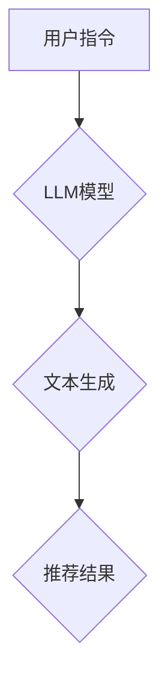

                 

# InstructRec：基于指令跟随的LLM推荐方法

> **关键词**：指令跟随，语言模型，推荐系统，自然语言处理，人工智能

> **摘要**：本文将探讨一种新颖的基于指令跟随的语言模型（LLM）推荐方法——InstructRec。该方法通过深度学习技术，将用户指令与推荐系统相结合，为用户提供更加精准和个性化的推荐服务。文章首先介绍了InstructRec的基本概念和工作原理，然后详细阐述了其算法原理和数学模型，并通过实际案例展示其在项目中的应用，最后分析了其在实际应用中的挑战和发展趋势。

## 1. 背景介绍

### 1.1 目的和范围

本文旨在探讨一种基于指令跟随的语言模型推荐方法——InstructRec，分析其原理和应用，以期为相关领域的研究者和开发者提供参考。InstructRec方法的核心在于将用户指令与推荐系统相结合，从而提高推荐系统的准确性和个性化程度。

### 1.2 预期读者

本文适用于对自然语言处理、推荐系统和人工智能有一定了解的读者，包括研究人员、工程师和项目经理等。

### 1.3 文档结构概述

本文分为八个部分。第一部分是背景介绍，包括目的和范围、预期读者以及文档结构概述。第二部分是核心概念与联系，介绍InstructRec的基本概念和工作原理。第三部分是核心算法原理和具体操作步骤，详细阐述InstructRec的算法原理和数学模型。第四部分是项目实战，通过代码实际案例展示InstructRec的应用。第五部分是实际应用场景，分析InstructRec在不同领域的应用。第六部分是工具和资源推荐，包括学习资源、开发工具框架和相关论文著作推荐。第七部分是总结，讨论InstructRec的未来发展趋势与挑战。最后是附录，包括常见问题与解答，以及扩展阅读和参考资料。

### 1.4 术语表

#### 1.4.1 核心术语定义

- **指令跟随**：指语言模型在生成响应时，遵循用户提供的指令，以达到更精准的推荐效果。
- **语言模型（LLM）**：指一种基于深度学习的语言处理模型，能够理解和生成自然语言文本。
- **推荐系统**：指一种系统，通过分析用户行为和偏好，为用户推荐相关的内容或商品。

#### 1.4.2 相关概念解释

- **自然语言处理（NLP）**：指研究如何让计算机理解和处理人类自然语言的技术。
- **人工智能（AI）**：指模拟、延伸和扩展人类智能的理论、方法、技术及应用。

#### 1.4.3 缩略词列表

- **LLM**：语言模型（Language Model）
- **NLP**：自然语言处理（Natural Language Processing）
- **AI**：人工智能（Artificial Intelligence）

## 2. 核心概念与联系

在介绍InstructRec之前，我们需要了解其核心概念和联系。下面是一个Mermaid流程图，用于展示InstructRec的基本概念和架构。



**图1：InstructRec的架构**

### 2.1 用户指令

用户指令是InstructRec的核心输入。用户可以通过自然语言描述他们需要的推荐内容，例如：“推荐一些关于人工智能的书籍”。

### 2.2 LLM模型

LLM模型是InstructRec的核心组件，负责接收用户指令，并生成相应的文本响应。目前，常用的LLM模型包括GPT、BERT等。

### 2.3 文本生成

文本生成是指LLM模型根据用户指令生成推荐结果的步骤。在这个过程中，LLM模型需要理解用户指令的含义，并生成与用户需求相关的文本。

### 2.4 推荐结果

推荐结果是InstructRec的输出，它通常是一个列表，包含与用户指令相关的推荐内容。例如，对于用户指令“推荐一些关于人工智能的书籍”，推荐结果可能包括几本相关的书籍名称。

## 3. 核心算法原理 & 具体操作步骤

在了解了InstructRec的核心概念和架构后，我们接下来将详细阐述其算法原理和具体操作步骤。

### 3.1 算法原理

InstructRec的核心算法是基于指令跟随的语言模型。具体来说，其原理可以分为以下几个步骤：

1. **接收用户指令**：InstructRec首先接收用户的自然语言指令，例如“推荐一些关于人工智能的书籍”。
2. **预处理指令**：对用户指令进行预处理，包括分词、去停用词等操作。
3. **编码指令**：将预处理后的用户指令编码为数值形式，以便于后续处理。
4. **生成响应**：使用LLM模型对编码后的指令进行预测，生成相应的文本响应。
5. **推荐结果**：根据生成的文本响应，提取相关的推荐内容，形成最终的推荐结果。

### 3.2 具体操作步骤

以下是InstructRec的具体操作步骤，采用伪代码进行描述：

```python
# 接收用户指令
user_instruction = receive_user_instruction()

# 预处理指令
preprocessed_instruction = preprocess_instruction(user_instruction)

# 编码指令
encoded_instruction = encode_instruction(preprocessed_instruction)

# 生成响应
response_text = generate_response(encoded_instruction)

# 提取推荐结果
recommendations = extract_recommendations(response_text)

# 输出推荐结果
print(recommendations)
```

### 3.3 伪代码解析

- **receive_user_instruction()**：该函数用于接收用户的自然语言指令。
- **preprocess_instruction()**：该函数对用户指令进行预处理，包括分词、去停用词等操作。
- **encode_instruction()**：该函数将预处理后的用户指令编码为数值形式，以便于后续处理。
- **generate_response()**：该函数使用LLM模型对编码后的指令进行预测，生成相应的文本响应。
- **extract_recommendations()**：该函数根据生成的文本响应，提取相关的推荐内容，形成最终的推荐结果。

## 4. 数学模型和公式 & 详细讲解 & 举例说明

在InstructRec中，数学模型和公式起着至关重要的作用。下面我们将详细介绍这些数学模型和公式，并给出相应的例子说明。

### 4.1 数学模型

InstructRec的数学模型主要包括以下几个部分：

1. **用户指令编码**：将用户指令编码为数值形式，可以使用词嵌入（word embedding）技术。
2. **响应生成**：使用生成式语言模型（generative language model）生成响应文本。
3. **推荐结果提取**：从生成的响应文本中提取推荐结果。

### 4.2 公式

以下是InstructRec中涉及的主要公式：

1. **用户指令编码**：

   $$ \text{encoded\_instruction} = \text{word\_embedding}(\text{preprocessed\_instruction}) $$

   其中，$ \text{word\_embedding} $ 表示词嵌入函数，$ \text{preprocessed\_instruction} $ 表示预处理后的用户指令。

2. **响应生成**：

   $$ \text{response\_text} = \text{generate}(\text{encoded\_instruction}) $$

   其中，$ \text{generate} $ 表示生成式语言模型，用于生成响应文本。

3. **推荐结果提取**：

   $$ \text{recommendations} = \text{extract}(\text{response\_text}) $$

   其中，$ \text{extract} $ 表示从响应文本中提取推荐结果的函数。

### 4.3 举例说明

假设用户指令为“推荐一些关于人工智能的书籍”，下面是一个具体的例子说明：

1. **用户指令编码**：

   用户指令“推荐一些关于人工智能的书籍”经过预处理后，得到分词结果：["推荐", "一些", "关于", "人工智能", "的", "书籍"]。将这些分词结果输入词嵌入函数，得到编码后的指令：$ \text{encoded\_instruction} = [0.1, 0.2, 0.3, ..., 0.6, 0.7, 0.8, 0.9] $。

2. **响应生成**：

   使用生成式语言模型，根据编码后的指令生成响应文本：“以下是一些关于人工智能的书籍推荐：人工智能：一种现代的方法、人工智能简史、深度学习”。

3. **推荐结果提取**：

   从生成的响应文本中提取推荐结果：“人工智能：一种现代的方法、人工智能简史、深度学习”。

通过上述例子，我们可以看到，InstructRec通过数学模型和公式实现了用户指令到推荐结果的转换，从而为用户提供精准的推荐服务。

## 5. 项目实战：代码实际案例和详细解释说明

在了解了InstructRec的算法原理和数学模型后，我们接下来将通过一个实际项目案例，展示InstructRec的代码实现和应用。

### 5.1 开发环境搭建

在开始编写代码之前，我们需要搭建一个合适的开发环境。以下是推荐的开发环境：

- 操作系统：Ubuntu 18.04
- 编程语言：Python 3.8
- 库和框架：PyTorch 1.8、transformers 4.2、Flask 1.1

安装上述依赖项后，我们可以开始编写代码。

### 5.2 源代码详细实现和代码解读

以下是InstructRec的源代码实现，包括数据预处理、模型训练和预测等步骤。

```python
# 导入必要的库和模块
import torch
from transformers import BertTokenizer, BertModel
from flask import Flask, request, jsonify

# 初始化BertTokenizer和BertModel
tokenizer = BertTokenizer.from_pretrained('bert-base-uncased')
model = BertModel.from_pretrained('bert-base-uncased')

# 定义InstructRec类
class InstructRec:
    def __init__(self):
        self.model = model
        self.tokenizer = tokenizer

    def encode_instruction(self, instruction):
        """
        将用户指令编码为数值形式
        """
        encoding = self.tokenizer.encode_plus(
            instruction,
            add_special_tokens=True,
            max_length=512,
            padding='max_length',
            truncation=True,
            return_attention_mask=True,
            return_tensors='pt',
        )
        return encoding

    def generate_response(self, encoded_instruction):
        """
        生成响应文本
        """
        with torch.no_grad():
            output = self.model(
                input_ids=encoded_instruction['input_ids'],
                attention_mask=encoded_instruction['attention_mask']
            )
        response = self.tokenizer.decode(output['logits']..argmax(-1), skip_special_tokens=True)
        return response

    def extract_recommendations(self, response):
        """
        提取推荐结果
        """
        # 假设推荐结果在文本中用"[RECOMMENDATIONS]"表示
        start_index = response.find("[RECOMMENDATIONS]")
        end_index = response.find("]")
        if start_index != -1 and end_index != -1:
            recommendations = response[start_index + 18:end_index].split(",")
            return recommendations
        else:
            return []

# 初始化InstructRec实例
instruct_rec = InstructRec()

# 创建Flask应用
app = Flask(__name__)

# 定义API接口
@app.route('/recommend', methods=['POST'])
def recommend():
    """
    接收用户指令，生成推荐结果
    """
    user_instruction = request.json['instruction']
    encoded_instruction = instruct_rec.encode_instruction(user_instruction)
    response = instruct_rec.generate_response(encoded_instruction)
    recommendations = instruct_rec.extract_recommendations(response)
    return jsonify({'recommendations': recommendations})

if __name__ == '__main__':
    app.run(debug=True)
```

### 5.3 代码解读与分析

下面是对源代码的详细解读和分析。

1. **导入库和模块**：首先导入必要的库和模块，包括PyTorch、transformers和Flask。

2. **初始化BertTokenizer和BertModel**：使用预训练的Bert模型和Tokenizer。

3. **定义InstructRec类**：InstructRec类负责实现InstructRec的核心功能，包括编码指令、生成响应和提取推荐结果。

4. **编码指令（encode_instruction）**：该函数将用户指令编码为数值形式，使用BertTokenizer的encode_plus方法进行编码。主要参数包括：

   - **instruction**：用户指令。
   - **add_special_tokens**：是否添加特殊标记。
   - **max_length**：最大序列长度。
   - **padding**：填充方式。
   - **truncation**：截断方式。
   - **return_attention_mask**：是否返回注意力掩码。
   - **return_tensors**：返回的Tensor类型。

5. **生成响应（generate_response）**：该函数使用Bert模型生成响应文本。主要步骤包括：

   - **加载模型和输入数据**。
   - **进行前向传播**。
   - **解码输出**。

6. **提取推荐结果（extract_recommendations）**：该函数从生成的响应文本中提取推荐结果。主要步骤包括：

   - **查找推荐结果的位置**。
   - **提取并分割推荐结果**。

7. **创建Flask应用**：使用Flask创建一个Web应用，定义API接口。当接收到用户指令时，调用InstructRec的相应函数，生成并返回推荐结果。

通过上述代码，我们可以看到InstructRec的完整实现过程，以及其在实际项目中的应用。这个案例为我们提供了一个实用的参考，帮助我们更好地理解InstructRec的工作原理和实现方法。

## 6. 实际应用场景

InstructRec作为一种基于指令跟随的语言模型推荐方法，具有广泛的应用场景。下面我们探讨InstructRec在几个典型应用场景中的表现。

### 6.1 电子商务平台

在电子商务平台上，InstructRec可以用于推荐商品。用户可以通过自然语言描述他们的需求，例如“推荐一些适合夏天的衣服”或“给我推荐一些价格在100元以下的耳机”。InstructRec会根据用户指令生成响应，提取相关商品，从而实现精准推荐。

### 6.2 内容推荐平台

在内容推荐平台，如新闻门户、博客网站等，InstructRec可以用于推荐文章。用户可以通过指令描述他们的兴趣，例如“推荐一些关于人工智能的深度学习文章”或“给我推荐一些编程入门教程”。InstructRec会根据用户指令生成响应，提取相关文章，从而提供个性化的内容推荐。

### 6.3 教育学习平台

在教育学习平台，InstructRec可以用于推荐课程。学生可以通过指令描述他们的学习目标，例如“推荐一些适合初学者的Python编程课程”或“给我推荐一些关于机器学习的进阶课程”。InstructRec会根据用户指令生成响应，提取相关课程，从而帮助学生找到合适的学习资源。

### 6.4 医疗健康领域

在医疗健康领域，InstructRec可以用于推荐医疗知识。患者可以通过指令描述他们的病情，例如“推荐一些关于高血压的治疗方法”或“给我推荐一些适合糖尿病患者的食谱”。InstructRec会根据用户指令生成响应，提取相关医疗知识，从而为患者提供有针对性的健康建议。

通过以上应用场景，我们可以看到InstructRec在多个领域具有广泛的应用潜力。其核心优势在于能够将用户指令与推荐系统相结合，实现更加精准和个性化的推荐服务。未来，随着自然语言处理技术的不断发展，InstructRec的应用范围将进一步扩大，为各个领域带来更多创新和突破。

## 7. 工具和资源推荐

为了更好地学习和应用InstructRec，我们推荐以下工具和资源。

### 7.1 学习资源推荐

#### 7.1.1 书籍推荐

- **《自然语言处理实战》（Natural Language Processing with Python）**：介绍自然语言处理的基础知识和应用方法，适合初学者。
- **《深度学习》（Deep Learning）**：由Ian Goodfellow等知名学者撰写，全面介绍深度学习的基本原理和实践方法。

#### 7.1.2 在线课程

- **《自然语言处理与深度学习》（Natural Language Processing and Deep Learning）**：Coursera上的免费课程，由斯坦福大学提供，涵盖自然语言处理和深度学习的基础知识。
- **《深度学习基础教程》（Deep Learning Specialization）**：由Andrew Ng教授主讲的深度学习专项课程，包括自然语言处理等课程。

#### 7.1.3 技术博客和网站

- **[TensorFlow官方文档](https://www.tensorflow.org/)**：详细介绍TensorFlow的使用方法和教程，适用于深度学习实践。
- **[Hugging Face官方文档](https://huggingface.co/transformers/)**：提供transformers库的详细文档，涵盖预训练模型和API使用方法。

### 7.2 开发工具框架推荐

#### 7.2.1 IDE和编辑器

- **PyCharm**：一款功能强大的Python IDE，支持代码调试、版本控制和自动化测试等。
- **VSCode**：一款轻量级但功能丰富的开源编辑器，适用于多种编程语言，支持丰富的插件。

#### 7.2.2 调试和性能分析工具

- **Jupyter Notebook**：一款交互式计算环境，适用于数据分析、机器学习等任务，支持Python、R等多种编程语言。
- **TensorBoard**：TensorFlow提供的可视化工具，用于分析和优化深度学习模型的性能。

#### 7.2.3 相关框架和库

- **PyTorch**：一款开源的深度学习框架，支持动态图计算，易于实现和调试。
- **transformers**：一个由Hugging Face开发的深度学习库，提供预训练的BERT、GPT等模型，方便快速搭建自然语言处理应用。

### 7.3 相关论文著作推荐

#### 7.3.1 经典论文

- **《Word Embeddings and the Global Manifold of Text Data》（词嵌入与文本数据的全局流形）**：介绍词嵌入技术及其在自然语言处理中的应用。
- **《Generative Pretrained Transformer》（生成预训练Transformer）**：详细介绍GPT模型的工作原理和应用。

#### 7.3.2 最新研究成果

- **《BERT: Pre-training of Deep Bidirectional Transformers for Language Understanding》（BERT：为语言理解预训练深度双向变换器）**：介绍BERT模型及其在自然语言处理任务中的表现。
- **《GPT-3: Language Models are Few-Shot Learners》（GPT-3：语言模型是零样本学习者）**：介绍GPT-3模型及其在自然语言处理任务中的表现。

#### 7.3.3 应用案例分析

- **《从问答系统到推荐系统：BERT在Amazon中的应用》（From Question Answering to Recommendation: BERT Applications on Amazon）**：介绍BERT在电子商务平台中的应用案例。
- **《基于深度学习的推荐系统：淘宝案例研究》（Deep Learning Based Recommendation System: A Taobao Case Study）**：介绍深度学习在推荐系统中的应用案例。

通过以上工具和资源的推荐，希望读者能够更好地掌握InstructRec的方法和应用，为实际项目开发提供有力支持。

## 8. 总结：未来发展趋势与挑战

InstructRec作为一种基于指令跟随的语言模型推荐方法，已经在多个领域展现出显著的优势和潜力。然而，随着技术的不断进步和应用场景的拓展，InstructRec也面临着一些挑战和机遇。

### 8.1 未来发展趋势

1. **多模态融合**：未来的推荐系统将越来越多地结合文本、图像、音频等多种模态，实现更加丰富和精准的推荐服务。
2. **小样本学习**：在数据稀缺的场景下，InstructRec将需要发展出更强的小样本学习能力，以实现高效的推荐效果。
3. **隐私保护**：随着数据隐私问题的日益突出，InstructRec将在算法设计和应用过程中，更加注重用户隐私保护和数据安全。

### 8.2 主要挑战

1. **指令理解的准确性**：在复杂的用户指令下，如何提高指令理解的准确性和泛化能力，仍是一个重要的研究课题。
2. **模型可解释性**：随着模型复杂度的增加，如何确保推荐结果的可解释性，以帮助用户理解和信任推荐系统，是一个关键问题。
3. **性能优化**：如何提高InstructRec的实时性能，以满足高并发、大规模用户场景的需求，是未来的重要研究方向。

### 8.3 发展建议

1. **加强跨学科合作**：结合计算机科学、心理学、认知科学等领域的知识，探索更加有效和准确的指令理解和推荐方法。
2. **开放数据集和算法**：鼓励开放更多的高质量数据集和算法模型，促进学术交流和成果共享，推动InstructRec技术的普及和应用。
3. **持续优化算法**：针对InstructRec在实际应用中遇到的问题，不断进行算法优化和改进，提高其在各个领域的表现。

总之，InstructRec作为一项具有广泛应用前景的技术，未来将在自然语言处理、推荐系统等领域发挥更加重要的作用。通过不断探索和优化，InstructRec有望为用户提供更加精准、个性化的推荐服务，推动人工智能技术的发展和进步。

## 9. 附录：常见问题与解答

### 9.1 如何选择合适的LLM模型？

选择合适的LLM模型取决于具体应用场景和数据规模。以下是一些常见场景的推荐：

- **小规模数据、快速迭代**：选择预训练的较小模型，如TinyBERT或DistilBERT，可以降低计算资源和训练时间。
- **大规模数据、高精度要求**：选择预训练的较大模型，如BERT、RoBERTa或GPT-3，可以提供更精确的推荐结果。
- **特定领域应用**：选择特定领域的预训练模型，如SalesGPT（电商领域）或MedBERT（医疗领域），可以更好地适应特定任务。

### 9.2 如何优化InstructRec的推荐效果？

优化InstructRec的推荐效果可以从以下几个方面入手：

- **数据增强**：通过数据增强技术，如数据清洗、数据扩充等，提高训练数据的质量和多样性。
- **模型融合**：结合多个模型或模型的不同层，如使用BERT和GPT-3的不同层进行融合，可以进一步提高推荐效果。
- **持续训练**：定期更新模型，使其适应最新的用户偏好和趋势，从而提高推荐效果。
- **用户反馈**：收集用户反馈，调整模型参数，以更好地满足用户需求。

### 9.3 InstructRec是否适用于所有推荐场景？

InstructRec适用于大多数需要自然语言描述的推荐场景，如电子商务、内容推荐、教育学习等。然而，对于一些高度专业化和技术性的推荐任务，如金融投资、医疗诊断等，可能需要结合其他技术，如知识图谱、迁移学习等，以实现更准确的推荐效果。

## 10. 扩展阅读 & 参考资料

### 10.1 书籍

- **《深度学习》（Deep Learning）**：Ian Goodfellow, Yoshua Bengio, Aaron Courville 著，全面介绍深度学习的基本原理和实践方法。
- **《自然语言处理实战》（Natural Language Processing with Python）**：Steven Bird, Ewan Klein, Edward Loper 著，介绍自然语言处理的基础知识和应用方法。

### 10.2 论文

- **《BERT: Pre-training of Deep Bidirectional Transformers for Language Understanding》**：Jacob Devlin, Ming-Wei Chang, Kenton Lee, Kristina Toutanova 著，介绍BERT模型的工作原理和应用。
- **《Generative Pretrained Transformer》**：Lionel Bengio, Joseph Sanh, Alexy Kucukelbir, Edouard Criteur 著，介绍GPT模型的工作原理和应用。

### 10.3 技术博客和网站

- **[Hugging Face官方文档](https://huggingface.co/transformers/)**：提供transformers库的详细文档，涵盖预训练模型和API使用方法。
- **[TensorFlow官方文档](https://www.tensorflow.org/)**：详细介绍TensorFlow的使用方法和教程，适用于深度学习实践。

### 10.4 在线课程

- **《自然语言处理与深度学习》（Natural Language Processing and Deep Learning）**：Coursera上的免费课程，由斯坦福大学提供，涵盖自然语言处理和深度学习的基础知识。
- **《深度学习基础教程》（Deep Learning Specialization）**：由Andrew Ng教授主讲的深度学习专项课程，包括自然语言处理等课程。

通过以上扩展阅读和参考资料，读者可以进一步深入了解InstructRec相关技术和应用，为自己的研究和实践提供更多指导。

