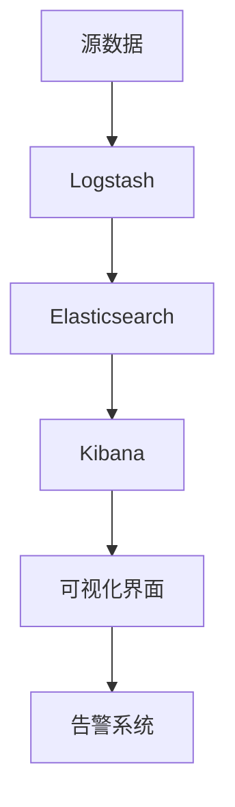

                 

# Kibana日志可视化与告警

> **关键词：**Kibana、日志可视化、日志告警、ELK栈、数据监控、实时分析、日志管理、Elasticsearch、Logstash、Kibana UI

> **摘要：**本文将深入探讨Kibana在日志可视化和告警功能中的应用，通过一步步的讲解，帮助读者理解其核心概念、实现步骤和实际应用，同时推荐相关的学习资源和工具，为数据监控和运维提供有效的解决方案。

## 1. 背景介绍

### 1.1 目的和范围

本文旨在介绍Kibana在日志可视化与告警方面的应用，帮助读者理解Kibana在ELK（Elasticsearch, Logstash, Kibana）栈中的重要性，以及如何通过Kibana实现日志的全面监控与分析。

### 1.2 预期读者

本文适合具有一定编程基础和运维经验的读者，特别是希望深入了解Kibana及其在日志管理中应用的IT专业人士。

### 1.3 文档结构概述

本文将分为以下几个部分：

- 1.4 术语表：介绍本文中使用的主要术语和概念。
- 2. 核心概念与联系：通过流程图展示Kibana与其他组件的联系。
- 3. 核心算法原理 & 具体操作步骤：讲解Kibana可视化与告警的原理和步骤。
- 4. 数学模型和公式 & 详细讲解 & 举例说明：介绍相关的数学模型和公式。
- 5. 项目实战：提供实际代码案例和解析。
- 6. 实际应用场景：探讨Kibana在不同场景下的应用。
- 7. 工具和资源推荐：推荐学习资源和开发工具。
- 8. 总结：对Kibana的发展趋势与挑战进行总结。
- 9. 附录：常见问题与解答。
- 10. 扩展阅读 & 参考资料：提供进一步的阅读资源。

### 1.4 术语表

#### 1.4.1 核心术语定义

- **Kibana：**一个开源的数据可视化工具，用于分析Elasticsearch中的数据。
- **日志可视化：**将日志数据转换为图形化的形式，便于分析和监控。
- **告警：**当日志数据达到特定条件时，自动发送通知。
- **ELK栈：**由Elasticsearch、Logstash和Kibana组成的日志处理和监控系统。

#### 1.4.2 相关概念解释

- **Elasticsearch：**一个分布式、RESTful搜索和分析引擎。
- **Logstash：**一个数据收集和传输工具，用于将数据从源发送到Elasticsearch。
- **数据监控：**实时跟踪系统性能、日志和事件，以便及时发现问题。

#### 1.4.3 缩略词列表

- **ELK：**Elasticsearch, Logstash, Kibana。
- **RESTful：**Representational State Transfer，一种网络架构风格。

## 2. 核心概念与联系

在深入探讨Kibana的功能之前，我们需要了解其与ELK栈中其他组件的关系。以下是一个简化的Mermaid流程图，展示了Kibana在ELK栈中的位置和作用。



### 2.1 Kibana在ELK栈中的作用

- **数据收集与处理（Logstash）：**Logstash负责从各种来源（如系统日志、Web服务器日志等）收集数据，并将其转换为适合存储在Elasticsearch中的格式。
- **数据存储（Elasticsearch）：**Elasticsearch负责存储和处理Logstash发送的日志数据，提供高效的全文搜索和实时分析功能。
- **数据可视化（Kibana）：**Kibana将Elasticsearch中的数据转换为直观的图表和仪表板，帮助用户轻松监控和分析日志数据。
- **告警系统：**Kibana允许用户设置告警规则，当日志数据满足特定条件时，自动发送通知。

## 3. 核心算法原理 & 具体操作步骤

Kibana的日志可视化和告警功能依赖于Elasticsearch的强大搜索和分析能力。以下是一步一步的操作步骤，以及背后的算法原理。

### 3.1 数据导入

- **步骤 1：**配置Logstash，使其能够从各种日志源收集数据。
- **算法原理：**Logstash使用正则表达式和其他模式匹配规则，将日志数据解析为结构化数据。

```python
input {
    file {
        path => "/var/log/xxx/*.log"
        type => "access_log"
    }
}
filter {
    if ["access_log"] == type {
        grok {
            match => { "message" => "%{TIMESTAMP_ISO8601:timestamp}\t%{IP:client_ip}\t%{INT:status_code}\t%{INT:request_size}\t%{WORD:method}\t%{URL:path}\t%{INT:response_size}\t%{INT:time_taken}" }
        }
    }
}
output {
    elasticsearch {
        hosts => ["localhost:9200"]
        index => "access_log-%{+YYYY.MM.dd}"
    }
}
```

### 3.2 数据存储

- **步骤 2：**确保Elasticsearch已正确配置，并能够处理Logstash发送的数据。
- **算法原理：**Elasticsearch使用分片和副本机制，确保数据的高可用性和可扩展性。

```bash
PUT /access_log
{
    "settings": {
        "number_of_shards": 2,
        "number_of_replicas": 1
    },
    "mappings": {
        "properties": {
            "timestamp": {
                "type": "date"
            },
            "client_ip": {
                "type": "ip"
            },
            "status_code": {
                "type": "integer"
            },
            "request_size": {
                "type": "integer"
            },
            "method": {
                "type": "keyword"
            },
            "path": {
                "type": "keyword"
            },
            "response_size": {
                "type": "integer"
            },
            "time_taken": {
                "type": "integer"
            }
        }
    }
}
```

### 3.3 数据可视化

- **步骤 3：**在Kibana中创建仪表板，将Elasticsearch中的数据可视化。
- **算法原理：**Kibana使用Elasticsearch的搜索API，获取符合特定条件的日志数据，并使用图表库（如D3.js和Highcharts）进行可视化。

```json
{
  "title": "访问日志统计",
  "description": "展示访问日志中的关键指标",
  " panels": [
    {
      "type": "timeseries",
      "title": "请求时间分布",
      "yAxis": [
        {
          "title": "请求次数",
          "type": "count"
        }
      ],
      "xAxis": {
        "title": "时间",
        "format": "YYYY-MM-DD HH:mm:ss"
      },
      "data": {
        "query": {
          "match_all": {}
        },
        "size": 10000
      }
    },
    {
      "type": "histogram",
      "title": "响应时间分布",
      "yAxis": {
        "title": "请求次数",
        "type": "count"
      },
      "xAxis": {
        "title": "响应时间（毫秒）"
      },
      "data": {
        "query": {
          "match_all": {}
        },
        "aggs": {
          "response_time": {
            "buckets": {
              "bucket_size": 100,
              "field": "time_taken",
              "min_doc_count": 1
            }
          }
        }
      }
    }
  ]
}
```

### 3.4 告警设置

- **步骤 4：**在Kibana中设置告警规则，当日志数据满足特定条件时，自动发送通知。
- **算法原理：**Kibana使用Elasticsearch的查询语言（Query DSL），定义告警规则，并通过Webhook或邮件等方式发送通知。

```json
{
  "title": "请求失败率告警",
  "description": "当请求失败率超过阈值时发送告警",
  "throttle": "5m",
  "conditions": [
    {
      "source": {
        "id": "logstash-access_log",
        "index": "access_log-*"
      },
      "query": {
        "bool": {
          "must_not": [
            {
              "term": {
                "status_code": 200
              }
            }
          ]
        }
      },
      "aggregations": {
        "total_errors": {
          "value_count": {
            "field": "status_code"
          }
        }
      },
      "threshold": {
        "value": 0.1
      }
    }
  ],
  "actions": [
    {
      "webhook": {
        "url": "https://example.com/alerts",
        "request_body": {
          "alert": "请求失败率超过阈值",
          "status_code": "{{aggregations.total_errors.value}}",
          "time": "{{timestamp}}",
          "data": "{{json_data}}"
        }
      }
    },
    {
      "email": {
        "to": "admin@example.com",
        "from": "alert@example.com",
        "subject": "请求失败率告警",
        "body": "请求失败率超过阈值：{{aggregations.total_errors.value}}，请查看详情。"
      }
    }
  ]
}
```

## 4. 数学模型和公式 & 详细讲解 & 举例说明

在日志分析中，一些常见的数学模型和公式可以帮助我们更好地理解和解释数据。以下是一些关键的概念和例子。

### 4.1 频率分布

频率分布是一种描述数据集中各个值出现次数的统计方法。它可以用来分析日志数据中的访问频率。

**公式：**

$$
f(x) = \frac{n(x)}{N}
$$

其中，\( f(x) \) 是值 \( x \) 的频率，\( n(x) \) 是 \( x \) 出现的次数，\( N \) 是总次数。

**例子：**

假设我们有一个日志文件，记录了1000个访问请求，其中请求路径为"/home"的次数为300次。那么路径为"/home"的频率分布为：

$$
f(\text{"/home"}) = \frac{300}{1000} = 0.3
$$

### 4.2 均值

均值是数据集中的平均值，用于描述数据的中心趋势。

**公式：**

$$
\bar{x} = \frac{1}{N} \sum_{i=1}^{N} x_i
$$

其中，\( \bar{x} \) 是均值，\( N \) 是数据点的个数，\( x_i \) 是第 \( i \) 个数据点。

**例子：**

假设我们有一个日志文件，记录了1000个访问请求，其中请求时间为1秒、2秒和3秒的次数分别为300次、200次和500次。那么请求时间的均值为：

$$
\bar{x} = \frac{1}{1000} (1 \times 300 + 2 \times 200 + 3 \times 500) = 2.2 \text{秒}
$$

### 4.3 方差

方差是数据集分散程度的度量，用于描述数据点相对于均值的离散程度。

**公式：**

$$
\sigma^2 = \frac{1}{N} \sum_{i=1}^{N} (x_i - \bar{x})^2
$$

其中，\( \sigma^2 \) 是方差，\( \bar{x} \) 是均值，\( N \) 是数据点的个数，\( x_i \) 是第 \( i \) 个数据点。

**例子：**

假设我们有一个日志文件，记录了1000个访问请求，其中请求时间为1秒、2秒和3秒的次数分别为300次、200次和500次。那么请求时间的方差为：

$$
\sigma^2 = \frac{1}{1000} [(1 - 2.2)^2 \times 300 + (2 - 2.2)^2 \times 200 + (3 - 2.2)^2 \times 500] \approx 0.74 \text{秒}^2
$$

### 4.4 标准差

标准差是方差的平方根，用于描述数据集的离散程度。

**公式：**

$$
\sigma = \sqrt{\sigma^2}
$$

**例子：**

假设我们有一个日志文件，记录了1000个访问请求，其中请求时间为1秒、2秒和3秒的次数分别为300次、200次和500次。那么请求时间的标准差为：

$$
\sigma = \sqrt{0.74} \approx 0.87 \text{秒}
$$

## 5. 项目实战：代码实际案例和详细解释说明

在本节中，我们将通过一个实际的项目案例，演示如何使用Kibana进行日志可视化和告警设置。假设我们有一个Web应用，需要监控访问日志并设置告警规则。

### 5.1 开发环境搭建

在开始之前，请确保已经安装了Elasticsearch、Logstash和Kibana。以下是简要的安装步骤：

- **Elasticsearch：**下载并解压Elasticsearch安装包，运行elasticsearch.bat（Windows）或elasticsearch.sh（Linux）启动Elasticsearch服务。
- **Logstash：**下载并解压Logstash安装包，配置Logstash输入和输出，运行logstash.bat（Windows）或logstash.sh（Linux）启动Logstash服务。
- **Kibana：**下载并解压Kibana安装包，运行kibana.bat（Windows）或kibana.sh（Linux）启动Kibana服务。

### 5.2 源代码详细实现和代码解读

#### 5.2.1 Logstash配置

创建一个名为`logstash.conf`的配置文件，配置Logstash输入和输出。

```conf
input {
    file {
        path => "/var/log/httpd/access_log"
        type => "access_log"
    }
}
filter {
    if ["access_log"] == type {
        grok {
            match => { "message" => "%{TIMESTAMP_ISO8601:timestamp}\t%{IP:client_ip}\t%{INT:status_code}\t%{INT:request_size}\t%{WORD:method}\t%{URL:path}\t%{INT:response_size}\t%{INT:time_taken}" }
        }
        date {
            match => ["timestamp", "ISO8601"]
        }
    }
}
output {
    elasticsearch {
        hosts => ["localhost:9200"]
        index => "access_log-%{+YYYY.MM.dd}"
    }
}
```

这个配置文件将从`/var/log/httpd/access_log`文件中读取日志数据，使用正则表达式进行解析，并将解析后的数据发送到Elasticsearch。

#### 5.2.2 Elasticsearch配置

创建一个名为`elasticsearch.yml`的配置文件，配置Elasticsearch。

```yaml
cluster.name: my-es-cluster
node.name: my-es-node
network.host: 0.0.0.0
http.port: 9200
discovery.type: single-node
```

这个配置文件设置了集群名称、节点名称、网络主机和HTTP端口号。

#### 5.2.3 Kibana配置

Kibana的配置文件位于`config/kibana.yml`。

```yaml
server.port: 5601
server.host: "0.0.0.0"
elasticsearch.url: "http://localhost:9200"
```

这个配置文件设置了Kibana的端口号、主机和Elasticsearch的URL。

### 5.3 代码解读与分析

#### 5.3.1 Logstash代码解读

- **输入部分：**`input { file { path => "/var/log/httpd/access_log" type => "access_log" } }`配置了Logstash从`/var/log/httpd/access_log`文件中读取日志数据，并将其类型标记为`access_log`。
- **过滤部分：**`filter { if ["access_log"] == type { grok { match => { "message" => "%{TIMESTAMP_ISO8601:timestamp}\t%{IP:client_ip}\t%{INT:status_code}\t%{INT:request_size}\t%{WORD:method}\t%{URL:path}\t%{INT:response_size}\t%{INT:time_taken}" } } date { match => ["timestamp", "ISO8601"] } } }`这部分代码使用Grok进行日志解析，并将解析后的字段添加到数据中。
- **输出部分：**`output { elasticsearch { hosts => ["localhost:9200"] index => "access_log-%{+YYYY.MM.dd}" } }`配置了Logstash将解析后的数据发送到Elasticsearch，并指定了索引名称。

#### 5.3.2 Elasticsearch代码解读

- **集群配置：**`cluster.name: my-es-cluster node.name: my-es-node`设置了集群名称和节点名称。
- **网络配置：**`network.host: 0.0.0.0 http.port: 9200`配置了Elasticsearch的网络主机和HTTP端口号。
- **单节点配置：**`discovery.type: single-node`设置了Elasticsearch以单节点模式运行。

#### 5.3.3 Kibana代码解读

- **Kibana配置：**`server.port: 5601 server.host: "0.0.0.0"`设置了Kibana的端口号和主机。
- **Elasticsearch连接：**`elasticsearch.url: "http://localhost:9200"`设置了Kibana与Elasticsearch的连接URL。

### 5.4 Kibana仪表板创建

在Kibana中，我们可以创建一个仪表板来监控访问日志。

1. **添加新面板：**
   - 选择`Create` -> `Visualize`，创建一个新的可视化面板。
   - 选择`Timeseries`图表类型，并配置查询。

2. **配置查询：**
   - `Index`: `access_log-*`
   - `Query`: `match_all`
   - `Time Field`: `timestamp`
   - `X-Axis Format`: `YYYY-MM-DD HH:mm:ss`
   - `Y-Axis`: `Count`

3. **保存面板：**
   - 为面板命名，并保存到仪表板中。

4. **添加更多面板：**
   - 创建`Histogram`面板，用于监控响应时间分布。
   - 配置查询，包括`Bucket Size`和`Field`。

5. **设置告警：**
   - 选择`Create` -> `Alert`，创建新的告警规则。
   - 配置告警条件，如请求失败率超过阈值。
   - 配置告警动作，如发送Webhook或邮件。

### 5.5 实际案例：监控Web应用访问日志

假设我们有一个Web应用，需要监控访问日志并设置告警规则。

1. **配置Logstash：**
   - 修改`logstash.conf`，将日志路径更改为Web应用的日志文件路径。
   - 重新启动Logstash。

2. **配置Elasticsearch：**
   - 确保Elasticsearch已正确连接到Kibana。

3. **创建Kibana仪表板：**
   - 创建新的仪表板，并添加`Timeseries`和`Histogram`面板。
   - 配置查询，以显示访问日志的关键指标。

4. **设置告警规则：**
   - 创建新的告警规则，如请求失败率超过阈值。
   - 配置告警动作，如发送Webhook或邮件。

通过这个实际案例，我们可以看到如何使用Kibana监控Web应用的访问日志，并通过日志可视化和告警功能实现实时监控和故障预警。

## 6. 实际应用场景

Kibana在日志可视化和告警功能方面具有广泛的应用场景，以下是一些典型的应用案例：

### 6.1 Web应用监控

- **访问日志分析：**通过Kibana监控Web应用的访问日志，可以了解用户行为、请求响应时间和错误率等关键指标。
- **性能优化：**通过分析访问日志，可以发现性能瓶颈，进行针对性的优化。

### 6.2 系统运维监控

- **日志聚合：**将来自不同系统和服务的日志数据进行聚合，便于统一监控和告警。
- **故障排查：**通过分析日志，快速定位故障原因，提高故障排查效率。

### 6.3 安全监控

- **异常检测：**通过分析日志数据，实时检测异常行为，如恶意访问、数据泄露等。
- **安全事件响应：**在发生安全事件时，快速查看相关日志，进行事件响应和调查。

### 6.4 业务监控

- **业务指标分析：**通过Kibana监控业务指标，如订单量、交易成功率等，帮助业务团队实时掌握业务状况。
- **数据驱动的决策：**基于日志数据进行分析和可视化，支持数据驱动的业务决策。

### 6.5 云服务和容器监控

- **Kubernetes日志监控：**通过Kibana监控Kubernetes集群中的日志数据，实现容器化应用的全面监控。
- **云服务日志聚合：**将来自不同云服务的日志数据进行聚合，实现跨云服务的统一监控。

## 7. 工具和资源推荐

### 7.1 学习资源推荐

#### 7.1.1 书籍推荐

- **《Elastic Stack权威指南》**：详细介绍了Elastic Stack（包括Elasticsearch、Logstash和Kibana）的架构、配置和优化。
- **《Kibana实战》**：通过实际案例，讲解了Kibana的安装、配置和使用，涵盖了日志可视化和告警功能。

#### 7.1.2 在线课程

- **Elastic官网提供的免费课程**：涵盖Elasticsearch、Logstash和Kibana的基础知识和高级特性。
- **Udemy、Coursera等在线平台上的相关课程**：提供了丰富的Elastic Stack学习资源。

#### 7.1.3 技术博客和网站

- **Elastic官方博客**：分享Elastic Stack的最新动态、最佳实践和案例研究。
- **Stack Overflow**：在Elastic Stack相关标签下，可以找到大量的技术问题和解决方案。
- **ELK社区**：一个专门针对ELK栈的中文社区，提供技术交流和学习资源。

### 7.2 开发工具框架推荐

#### 7.2.1 IDE和编辑器

- **Visual Studio Code**：一个轻量级的跨平台IDE，支持Elastic Stack开发。
- **IntelliJ IDEA**：一个功能强大的IDE，适用于复杂的Elastic Stack项目。

#### 7.2.2 调试和性能分析工具

- **Kibana Dev Tools**：内置的调试工具，用于调试和性能分析Kibana仪表板和可视化。
- **Elasticsearch-head**：一个基于Web的Elasticsearch调试工具，可用于查看Elasticsearch集群的状态和性能。

#### 7.2.3 相关框架和库

- **Logstash Filters**：提供各种Logstash过滤器，用于处理和转换日志数据。
- **Kibana插件**：扩展Kibana功能，如添加新的可视化图表和仪表板。
- **Elasticsearch API客户端库**：如Python的`elasticsearch-py`、Java的`elasticsearch-rest-high-level-client`等，方便与Elasticsearch进行交互。

### 7.3 相关论文著作推荐

#### 7.3.1 经典论文

- **《The Scalable Real-Time Analysis of Logs》**：介绍了如何使用Elastic Stack进行大规模日志分析。
- **《Elasticsearch: The Definitive Guide》**：详细讲解了Elasticsearch的架构、配置和优化。

#### 7.3.2 最新研究成果

- **《ELK Stack for Log Analytics》**：探讨了Elastic Stack在日志分析领域的最新应用。
- **《Using Kibana for Real-Time Monitoring》**：介绍了Kibana在实时监控领域的最新技术和实践。

#### 7.3.3 应用案例分析

- **《如何使用Elastic Stack监控大规模Web应用》**：分享了使用Elastic Stack监控大规模Web应用的实际案例。
- **《ELK Stack在金融行业的应用》**：介绍了ELK栈在金融行业中的成功应用案例。

## 8. 总结：未来发展趋势与挑战

随着云计算、大数据和人工智能的快速发展，日志可视化和告警功能在未来将面临以下发展趋势和挑战：

### 8.1 发展趋势

- **智能化分析：**利用人工智能技术，实现日志数据的自动分类、异常检测和预测分析。
- **实时性能优化：**通过实时性能监控，自动调整系统配置，提高系统稳定性和响应速度。
- **跨云服务整合：**整合不同云服务的日志数据，实现统一监控和告警。

### 8.2 挑战

- **数据隐私保护：**在日志分析过程中，如何保护用户隐私和数据安全，是一个重要的挑战。
- **海量日志处理：**随着日志数据的快速增长，如何高效处理海量日志数据，是一个技术难题。
- **复杂告警管理：**在复杂的日志环境中，如何有效地管理和配置告警规则，避免告警泛滥。

## 9. 附录：常见问题与解答

### 9.1 如何安装Elastic Stack？

- **步骤 1：**下载Elastic Stack安装包。
- **步骤 2：**解压安装包，并运行相应的主程序（如elasticsearch、logstash、kibana）。
- **步骤 3：**根据需要修改配置文件（如elasticsearch.yml、logstash.conf、kibana.yml）。
- **步骤 4：**启动Elastic Stack服务。

### 9.2 Kibana如何连接Elasticsearch？

- **步骤 1：**在Kibana配置文件中设置Elasticsearch URL，如`elasticsearch.url: "http://localhost:9200"`。
- **步骤 2：**确保Elasticsearch服务正在运行。
- **步骤 3：**在Kibana中访问`http://localhost:5601`，并检查连接状态。

### 9.3 如何在Kibana中创建仪表板？

- **步骤 1：**在Kibana中点击`Create` -> `Dashboard`。
- **步骤 2：**添加新面板，并选择图表类型。
- **步骤 3：**配置查询，如选择索引、查询语句等。
- **步骤 4：**保存仪表板，并调整布局。

### 9.4 如何在Kibana中设置告警？

- **步骤 1：**在Kibana中点击`Create` -> `Alert`。
- **步骤 2：**配置告警条件，如选择索引、查询语句等。
- **步骤 3：**配置告警动作，如发送Webhook或邮件。
- **步骤 4：**保存告警规则，并启用。

## 10. 扩展阅读 & 参考资料

- **《Elastic Stack官方文档》**：提供了Elastic Stack（包括Elasticsearch、Logstash和Kibana）的详细文档和教程。
- **《Kibana官方文档》**：提供了Kibana的详细文档和教程，涵盖仪表板创建、可视化配置和告警设置。
- **《Elastic Stack社区论坛》**：一个活跃的Elastic Stack社区论坛，提供技术支持、最佳实践和讨论。

---

**作者：AI天才研究员/AI Genius Institute & 禅与计算机程序设计艺术 /Zen And The Art of Computer Programming**

