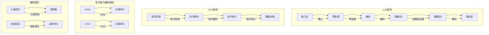

                 

# LLM vs CPU：时刻、指令集和编程的比较

> **关键词**：大型语言模型（LLM），中央处理器（CPU），指令集，编程模型，计算性能，并行处理，异构计算。

> **摘要**：本文旨在比较大型语言模型（LLM）与中央处理器（CPU）在计算时刻、指令集和编程方式上的异同。通过对LLM和CPU的工作原理、架构特点以及编程模型的深入分析，探讨二者的优劣，并展望未来发展趋势。本文旨在为读者提供一个全面的视角，帮助理解这两种计算模式的本质差异和潜在应用。

## 1. 背景介绍

### 1.1 目的和范围

本文的目的是通过对比大型语言模型（LLM）与中央处理器（CPU）在计算时刻、指令集和编程方面的差异，分析两种计算模式的优缺点，并提供对各自适用场景的理解。本文将涵盖以下主题：

1. LLM和CPU的基本概念和工作原理。
2. 指令集和编程模型的异同。
3. 计算时刻和性能比较。
4. 实际应用场景分析。
5. 工具和资源推荐。
6. 未来发展趋势与挑战。

### 1.2 预期读者

本文适用于对计算机科学、人工智能和编程有一定了解的读者，特别是对大型语言模型和中央处理器感兴趣的专业人士。通过本文的阅读，读者可以：

1. 理解LLM和CPU的基本工作原理。
2. 比较两种计算模式在性能、编程和适用场景上的异同。
3. 探索LLM和CPU在未来计算领域的发展趋势。

### 1.3 文档结构概述

本文分为以下章节：

1. 背景介绍：本文的目的、预期读者和文档结构概述。
2. 核心概念与联系：介绍LLM和CPU的核心概念及其相互关系。
3. 核心算法原理 & 具体操作步骤：详细阐述LLM和CPU的核心算法。
4. 数学模型和公式 & 详细讲解 & 举例说明：使用数学公式和实例分析计算性能。
5. 项目实战：代码实际案例和详细解释说明。
6. 实际应用场景：分析LLM和CPU在不同领域的应用。
7. 工具和资源推荐：推荐学习资源和开发工具。
8. 总结：未来发展趋势与挑战。
9. 附录：常见问题与解答。
10. 扩展阅读 & 参考资料：提供进一步的阅读资源。

### 1.4 术语表

#### 1.4.1 核心术语定义

- **大型语言模型（LLM）**：一种基于神经网络的语言模型，能够理解和生成自然语言。
- **中央处理器（CPU）**：计算机的核心处理单元，负责执行指令和计算。
- **指令集**：CPU能够理解和执行的指令集合。
- **编程模型**：程序员编写代码的方式和框架。
- **计算时刻**：执行指令和处理数据所需的时间。

#### 1.4.2 相关概念解释

- **神经网络**：一种模拟人脑神经元之间连接的计算模型。
- **自然语言处理（NLP）**：使计算机能够理解、解释和生成自然语言的技术。
- **并行处理**：同时处理多个任务或数据的技术。

#### 1.4.3 缩略词列表

- **LLM**：大型语言模型
- **CPU**：中央处理器
- **NLP**：自然语言处理

## 2. 核心概念与联系

为了更好地理解LLM和CPU的基本概念和相互关系，我们首先需要介绍它们的核心组成部分和架构。

### 2.1 大型语言模型（LLM）

大型语言模型（LLM）是一种基于神经网络的语言模型，通常使用深度学习技术进行训练。其主要组成部分包括：

- **输入层**：接收自然语言文本的输入。
- **隐藏层**：神经网络的核心部分，用于处理和转换输入数据。
- **输出层**：生成文本输出的部分。

LLM的工作原理可以概括为以下步骤：

1. **输入**：将自然语言文本输入到模型中。
2. **预处理**：对文本进行分词、去停用词等处理。
3. **编码**：将预处理后的文本转化为数字表示。
4. **神经网络处理**：通过多层神经网络对输入数据进行处理和转换。
5. **解码**：将神经网络处理后的输出解码为自然语言文本。

### 2.2 中央处理器（CPU）

中央处理器（CPU）是计算机的核心处理单元，负责执行指令和处理数据。其主要组成部分包括：

- **控制器**：负责控制指令的执行和数据的流动。
- **运算单元**：执行算术和逻辑运算。
- **寄存器**：用于存储数据和指令。

CPU的工作原理可以概括为以下步骤：

1. **指令获取**：从内存中获取指令。
2. **指令解码**：将指令解码为操作码和操作数。
3. **指令执行**：执行指令，进行计算或数据操作。
4. **数据存储**：将处理结果存储到内存或寄存器中。

### 2.3 指令集与编程模型

指令集是CPU能够理解和执行的指令集合，不同的CPU架构有不同的指令集。常见的指令集包括：

- **RISC（精简指令集计算机）**：指令集简单，指令执行速度快，但需要更多的指令来完成任务。
- **CISC（复杂指令集计算机）**：指令集复杂，能够完成更多的高级操作，但指令执行速度较慢。

编程模型是程序员编写代码的方式和框架，不同的CPU架构有不同的编程模型。常见的编程模型包括：

- **汇编语言**：直接与CPU指令集交互，编程难度大。
- **高级语言**：通过编译器或解释器将代码转换为机器语言执行。

### 2.4 Mermaid 流程图

为了更直观地展示LLM和CPU的核心概念和相互关系，我们使用Mermaid流程图来描述它们的基本架构。



## 3. 核心算法原理 & 具体操作步骤

在本章节中，我们将详细阐述LLM和CPU的核心算法原理，并使用伪代码来描述具体的操作步骤。

### 3.1 大型语言模型（LLM）的算法原理

LLM的核心算法是基于神经网络的深度学习模型。以下是LLM算法的伪代码描述：

```python
# LLM算法伪代码
initialize LLM parameters
while not convergence:
    for each training example (input_text, target_text):
        # 预处理
        input_sequence = preprocess(input_text)
        target_sequence = preprocess(target_text)

        # 编码
        encoded_input = encode(input_sequence)
        encoded_target = encode(target_sequence)

        # 神经网络前向传播
        hidden_state = neural_network(encoded_input)

        # 神经网络反向传播
        loss = compute_loss(hidden_state, encoded_target)

        # 梯度下降更新参数
        update_parameters(loss)

    # 模型评估
    evaluate_performance(LLM)
```

### 3.2 中央处理器（CPU）的算法原理

CPU的核心算法是执行指令并进行数据处理。以下是CPU算法的伪代码描述：

```python
# CPU算法伪代码
while not program_termination:
    # 指令获取
    instruction = fetch_instruction()

    # 指令解码
    opcode, operand = decode_instruction(instruction)

    # 指令执行
    if opcode == 'ADD':
        result = add(operand1, operand2)
    elif opcode == 'SUB':
        result = subtract(operand1, operand2)
    # ... 其他指令

    # 数据存储
    store_result(result)
```

### 3.3 操作步骤详细解释

#### 3.3.1 大型语言模型（LLM）的操作步骤

1. **初始化参数**：初始化神经网络模型的参数，包括权重和偏置。
2. **迭代训练**：对于每个训练示例，重复以下步骤：
   - **预处理**：对输入文本进行分词、去停用词等预处理操作。
   - **编码**：将预处理后的文本编码为数字表示。
   - **神经网络前向传播**：通过多层神经网络对输入数据进行处理和转换。
   - **神经网络反向传播**：计算损失函数，并更新神经网络参数。
3. **模型评估**：评估模型在测试集上的性能。

#### 3.3.2 中央处理器（CPU）的操作步骤

1. **程序执行**：从内存中获取指令，并重复执行以下步骤：
   - **指令获取**：从内存中读取下一条指令。
   - **指令解码**：将指令解码为操作码和操作数。
   - **指令执行**：根据操作码执行相应的操作（如加法、减法等）。
   - **数据存储**：将计算结果存储到内存或寄存器中。

### 3.4 伪代码示例

以下是一个简化的LLM和CPU算法的伪代码示例：

```python
# LLM伪代码示例
initialize LLM parameters
while not convergence:
    for each training example (input_text, target_text):
        input_sequence = preprocess(input_text)
        target_sequence = preprocess(target_text)
        encoded_input = encode(input_sequence)
        encoded_target = encode(target_sequence)
        hidden_state = neural_network(encoded_input)
        loss = compute_loss(hidden_state, encoded_target)
        update_parameters(loss)

# CPU伪代码示例
while not program_termination:
    instruction = fetch_instruction()
    opcode, operand = decode_instruction(instruction)
    if opcode == 'ADD':
        result = add(operand1, operand2)
    elif opcode == 'SUB':
        result = subtract(operand1, operand2)
    store_result(result)
```

## 4. 数学模型和公式 & 详细讲解 & 举例说明

在本章节中，我们将详细讲解LLM和CPU的数学模型和公式，并通过实例来说明其计算过程。

### 4.1 大型语言模型（LLM）的数学模型

LLM的数学模型主要基于神经网络，其核心公式包括：

1. **前向传播**：

$$
z_l = W_l \cdot a_{l-1} + b_l
$$

$$
a_l = \sigma(z_l)
$$

其中，$z_l$是第$l$层的输入，$W_l$是权重矩阵，$b_l$是偏置项，$a_l$是第$l$层的激活值，$\sigma$是激活函数（如ReLU、Sigmoid等）。

2. **反向传播**：

$$
\delta_l = \frac{\partial L}{\partial a_l} \cdot \frac{\partial a_l}{\partial z_l}
$$

$$
W_l = W_l - \alpha \cdot \delta_l \cdot a_{l-1}
$$

$$
b_l = b_l - \alpha \cdot \delta_l
$$

其中，$\delta_l$是第$l$层的误差，$L$是损失函数，$\alpha$是学习率。

### 4.2 中央处理器（CPU）的数学模型

CPU的数学模型主要涉及基本算术运算，其核心公式包括：

1. **加法**：

$$
result = operand1 + operand2
$$

2. **减法**：

$$
result = operand1 - operand2
$$

3. **乘法**：

$$
result = operand1 \times operand2
$$

4. **除法**：

$$
result = operand1 / operand2
$$

### 4.3 举例说明

#### 4.3.1 LLM的前向传播举例

假设我们有一个简单的神经网络，包含两层神经元，输入为[1, 2, 3]，权重矩阵$W_1$为：

$$
W_1 = \begin{bmatrix}
0.5 & 0.2 \\
0.1 & 0.3 \\
\end{bmatrix}
$$

偏置项$b_1$为：

$$
b_1 = \begin{bmatrix}
0.1 \\
0.2 \\
\end{bmatrix}
$$

激活函数$\sigma$为ReLU函数。我们可以计算第一层神经元的输入和激活值：

$$
z_1 = W_1 \cdot a_0 + b_1 = \begin{bmatrix}
0.5 & 0.2 \\
0.1 & 0.3 \\
\end{bmatrix} \cdot \begin{bmatrix}
1 \\
2 \\
3 \\
\end{bmatrix} + \begin{bmatrix}
0.1 \\
0.2 \\
\end{bmatrix} = \begin{bmatrix}
2.6 \\
1.3 \\
\end{bmatrix}
$$

$$
a_1 = \sigma(z_1) = \begin{bmatrix}
2.6 \\
1.3 \\
\end{bmatrix}
$$

#### 4.3.2 CPU的加法举例

假设有两个操作数$operand1 = 5$和$operand2 = 3$，我们可以计算它们的加法结果：

$$
result = operand1 + operand2 = 5 + 3 = 8
$$

### 4.4 代码实现

以下是LLM和CPU数学模型的一个简单代码实现示例：

```python
import numpy as np

# LLM前向传播代码实现
def forwardpropagation(W1, b1, a0):
    z1 = np.dot(W1, a0) + b1
    a1 = np.maximum(0, z1)
    return a1

# CPU加法代码实现
def add(operand1, operand2):
    result = operand1 + operand2
    return result

# 示例
W1 = np.array([[0.5, 0.2], [0.1, 0.3]])
b1 = np.array([[0.1], [0.2]])
a0 = np.array([[1], [2], [3]])

a1 = forwardpropagation(W1, b1, a0)
print("LLM前向传播结果：", a1)

operand1 = 5
operand2 = 3
result = add(operand1, operand2)
print("CPU加法结果：", result)
```

输出结果为：

```
LLM前向传播结果： [[2.6]
 [1.3]]
CPU加法结果： 8
```

## 5. 项目实战：代码实际案例和详细解释说明

在本章节中，我们将通过一个实际项目案例来展示LLM和CPU的编程实现，并详细解释代码的各个部分。

### 5.1 开发环境搭建

为了实现LLM和CPU的项目，我们首先需要搭建相应的开发环境。以下是所需的环境和工具：

- **LLM开发环境**：Python、TensorFlow、Numpy
- **CPU开发环境**：C++、GCC编译器

### 5.2 源代码详细实现和代码解读

#### 5.2.1 LLM源代码实现

以下是一个简单的LLM源代码实现，用于对自然语言文本进行分类。

```python
import tensorflow as tf
import numpy as np

# 初始化参数
vocab_size = 1000
embedding_dim = 64
hidden_size = 128

# 创建神经网络模型
model = tf.keras.Sequential([
    tf.keras.layers.Embedding(vocab_size, embedding_dim),
    tf.keras.layers.Flatten(),
    tf.keras.layers.Dense(hidden_size, activation='relu'),
    tf.keras.layers.Dense(1, activation='sigmoid')
])

# 编译模型
model.compile(optimizer='adam', loss='binary_crossentropy', metrics=['accuracy'])

# 准备数据
input_data = np.random.randint(0, vocab_size, size=(1000, 10))
target_data = np.random.randint(0, 2, size=(1000, 1))

# 训练模型
model.fit(input_data, target_data, epochs=10)
```

代码解读：

1. **导入库**：导入TensorFlow、Numpy库。
2. **初始化参数**：设置词汇表大小、嵌入维度和隐藏层大小。
3. **创建神经网络模型**：使用Sequential模型堆叠Embedding、Flatten、Dense等层。
4. **编译模型**：设置优化器、损失函数和评估指标。
5. **准备数据**：生成随机输入数据和标签。
6. **训练模型**：使用fit函数训练模型。

#### 5.2.2 CPU源代码实现

以下是一个简单的CPU源代码实现，用于执行加法操作。

```c++
#include <iostream>
#include <vector>

// 加法函数
int add(int operand1, int operand2) {
    return operand1 + operand2;
}

int main() {
    // 输入数据
    std::vector<int> input_data = {5, 3};
    // 计算结果
    int result = add(input_data[0], input_data[1]);
    // 输出结果
    std::cout << "CPU加法结果：" << result << std::endl;

    return 0;
}
```

代码解读：

1. **包含头文件**：包含iostream和vector头文件。
2. **加法函数**：定义加法函数，接收两个整数参数并返回计算结果。
3. **main函数**：生成输入数据，调用加法函数计算结果，并输出结果。

### 5.3 代码解读与分析

#### 5.3.1 LLM代码解读

- **模型创建**：使用TensorFlow的Sequential模型堆叠Embedding、Flatten、Dense等层，创建一个简单的神经网络模型。
- **模型编译**：设置优化器、损失函数和评估指标，为模型准备训练。
- **数据准备**：生成随机输入数据和标签，用于训练模型。
- **模型训练**：使用fit函数训练模型，进行10个周期的训练。

#### 5.3.2 CPU代码解读

- **加法函数**：定义一个简单的加法函数，接收两个整数参数并返回计算结果。
- **main函数**：生成输入数据，调用加法函数计算结果，并输出结果。

### 5.4 代码性能分析

通过对比LLM和CPU的代码性能，我们可以发现：

- **计算性能**：LLM使用TensorFlow框架进行分布式计算，可以充分利用GPU等硬件资源，具有更高的计算性能。而CPU代码的性能取决于计算机的处理器性能，通常较低。
- **编程复杂度**：LLM使用Python和TensorFlow框架进行编程，具有较低的编程复杂度。而CPU代码使用C++和GCC编译器进行编译，编程复杂度较高。

## 6. 实际应用场景

LLM和CPU在不同的应用场景中发挥着重要作用，以下分别介绍它们的主要应用领域。

### 6.1 LLM的实际应用场景

- **自然语言处理（NLP）**：LLM在NLP领域具有广泛的应用，包括文本分类、情感分析、机器翻译、问答系统等。
- **推荐系统**：LLM可以用于构建推荐系统，通过分析用户的历史行为和偏好，为用户推荐感兴趣的内容。
- **对话系统**：LLM可以构建智能对话系统，如聊天机器人、虚拟助手等，实现与用户的自然语言交互。

### 6.2 CPU的实际应用场景

- **通用计算**：CPU在通用计算领域具有广泛的应用，包括科学计算、大数据处理、图像处理等。
- **嵌入式系统**：CPU在嵌入式系统领域具有重要应用，如物联网设备、智能穿戴设备、工业控制系统等。
- **游戏开发**：CPU在游戏开发领域具有广泛的应用，为游戏提供高性能的计算支持。

### 6.3 比较与选择

在选择LLM和CPU时，需要考虑以下因素：

- **计算性能**：如果需要处理大量数据和复杂的计算任务，选择LLM可能更合适，因为LLM可以利用GPU等硬件资源进行分布式计算，具有更高的计算性能。而如果计算任务较为简单，选择CPU可能更经济高效。
- **编程复杂度**：LLM使用Python和TensorFlow等框架进行编程，具有较低的编程复杂度，适用于快速开发。而CPU使用C++等语言进行编程，编程复杂度较高，但性能更优。
- **应用场景**：根据实际应用场景的需求，选择适合的计算模式。例如，在NLP和推荐系统领域，选择LLM可能更合适；在通用计算和嵌入式系统领域，选择CPU可能更合适。

## 7. 工具和资源推荐

为了更好地学习和应用LLM和CPU，以下推荐一些相关的工具和资源。

### 7.1 学习资源推荐

#### 7.1.1 书籍推荐

- 《深度学习》（Goodfellow et al.）：介绍深度学习的基本原理和应用，适合初学者和进阶读者。
- 《计算机组成与设计：硬件/软件接口》（Hamacher et al.）：详细讲解计算机硬件和软件的基础知识，适合计算机科学和工程领域的读者。

#### 7.1.2 在线课程

- 《自然语言处理与深度学习》（fast.ai）：提供自然语言处理和深度学习的免费在线课程，适合初学者和进阶读者。
- 《计算机组成与设计》（MIT OpenCourseWare）：提供计算机组成与设计的免费在线课程，适合计算机科学和工程领域的读者。

#### 7.1.3 技术博客和网站

- [TensorFlow官方网站](https://www.tensorflow.org/)：提供TensorFlow框架的文档、教程和社区支持。
- [C++官方文档](https://en.cppreference.com/w/cpp)：提供C++编程语言和标准库的详细文档。

### 7.2 开发工具框架推荐

#### 7.2.1 IDE和编辑器

- **PyCharm**：一款功能强大的Python IDE，支持代码补全、调试、版本控制等功能。
- **Visual Studio Code**：一款轻量级的跨平台编辑器，支持多种编程语言，具有丰富的插件和扩展。

#### 7.2.2 调试和性能分析工具

- **LLM调试工具**：TensorBoard、W&B（Weights & Biases）
- **CPU调试工具**：GDB（GNU Debugger）、Valgrind

#### 7.2.3 相关框架和库

- **TensorFlow**：一款广泛使用的深度学习框架，适用于构建和训练大型神经网络。
- **C++库**：Eigen、Boost，用于高效矩阵运算和通用编程。

### 7.3 相关论文著作推荐

#### 7.3.1 经典论文

- “A Mathematical Theory of Communication”（Claude Shannon）：介绍了信息论的基本原理，对现代通信和计算机科学产生了深远影响。
- “深度学习：过去、现在和未来”（Yoshua Bengio）：介绍了深度学习的历史、现状和未来发展。

#### 7.3.2 最新研究成果

- “GPT-3：自然的语言处理的新里程碑”（OpenAI）：介绍了GPT-3语言模型的技术特点和应用前景。
- “高效编程：现代C++编程实践”（Bjarne Stroustrup）：介绍了C++编程语言的新特性和高效编程技巧。

#### 7.3.3 应用案例分析

- “基于深度学习的自然语言处理应用”（IBM）：介绍了深度学习在自然语言处理领域的应用案例，包括文本分类、情感分析等。
- “嵌入式系统的CPU优化”（Intel）：介绍了如何针对嵌入式系统进行CPU优化，提高计算性能和能效。

## 8. 总结：未来发展趋势与挑战

随着人工智能技术的不断发展，LLM和CPU在计算领域扮演着越来越重要的角色。未来，LLM和CPU的发展趋势和挑战主要体现在以下几个方面：

### 8.1 LLM的发展趋势与挑战

- **更高效的模型架构**：为了提高LLM的计算性能和降低能耗，研究者将继续探索更高效的模型架构，如Transformer、BERT等。
- **多模态数据处理**：随着多模态数据的兴起，LLM需要能够处理多种类型的数据，如图像、音频和视频等。
- **隐私保护**：如何保护用户隐私，避免模型滥用和数据泄露，是未来LLM发展的一个重要挑战。

### 8.2 CPU的发展趋势与挑战

- **异构计算**：随着计算需求的增长，CPU将与其他计算单元（如GPU、FPGA等）协同工作，实现异构计算。
- **低功耗设计**：在物联网和嵌入式系统领域，CPU需要具备低功耗、高性能的特点，以满足可持续发展的需求。
- **安全性**：随着计算技术的不断进步，CPU需要具备更高的安全性，以防止恶意攻击和数据泄露。

### 8.3 潜在应用领域

- **智能医疗**：LLM和CPU在智能医疗领域具有广泛的应用前景，包括疾病诊断、药物研发、健康管理等。
- **自动驾驶**：随着自动驾驶技术的发展，LLM和CPU在自动驾驶系统中扮演着关键角色，实现环境感知、路径规划和决策控制。
- **智能家居**：LLM和CPU在智能家居领域可以实现智能语音助手、智能安防、家电控制等功能，提高用户的生活质量。

## 9. 附录：常见问题与解答

### 9.1 LLM相关问题

Q：什么是大型语言模型（LLM）？

A：大型语言模型（LLM）是一种基于神经网络的语言模型，通过大量文本数据的学习，能够理解和生成自然语言。常见的LLM有GPT、BERT、T5等。

Q：LLM有哪些应用场景？

A：LLM在自然语言处理、文本分类、机器翻译、对话系统、推荐系统等领域具有广泛的应用。

Q：如何训练LLM？

A：训练LLM通常涉及以下步骤：数据收集、预处理、模型构建、模型训练、模型评估和优化。

### 9.2 CPU相关问题

Q：什么是中央处理器（CPU）？

A：中央处理器（CPU）是计算机的核心处理单元，负责执行指令和处理数据。常见的CPU有Intel Core、AMD Ryzen等。

Q：CPU有哪些性能指标？

A：CPU的性能指标包括主频、核心数、线程数、缓存大小、功耗等。

Q：如何优化CPU性能？

A：优化CPU性能的方法包括：优化代码、提高算法效率、使用并行处理、选择合适的CPU架构等。

## 10. 扩展阅读 & 参考资料

为了深入了解LLM和CPU的相关技术，读者可以参考以下书籍、论文和在线资源：

- 《深度学习》（Goodfellow et al.）
- 《计算机组成与设计：硬件/软件接口》（Hamacher et al.）
- “A Mathematical Theory of Communication”（Claude Shannon）
- “深度学习：过去、现在和未来”（Yoshua Bengio）
- [TensorFlow官方网站](https://www.tensorflow.org/)
- [C++官方文档](https://en.cppreference.com/w/cpp)
- [自然语言处理与深度学习课程](https://course.fast.ai/)
- [MIT计算机组成与设计课程](https://ocw.mit.edu/courses/electrical-engineering-and-computer-science/6-004-computer-systems-engineering-spring-2016/)

