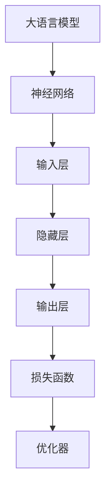
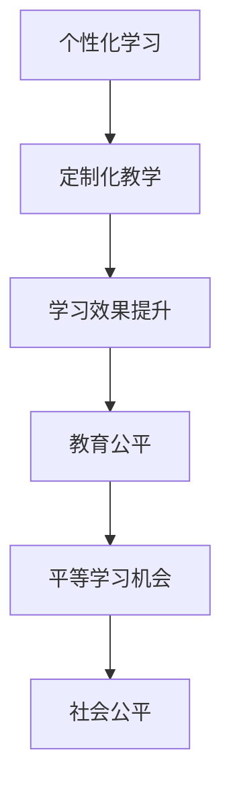
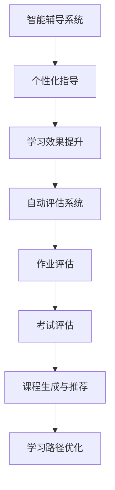
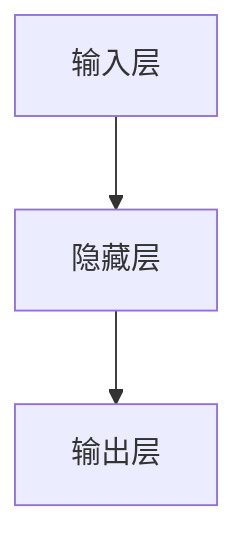

                 

# LLM 在教育领域：个性化学习和教育公平

> **关键词：** 大语言模型（LLM），教育技术，个性化学习，教育公平，机器学习，自然语言处理

> **摘要：** 本文旨在探讨大语言模型（LLM）在教育领域的应用，特别是在个性化学习和教育公平方面的潜力。通过详细分析LLM的工作原理、算法原理、数学模型和实际应用场景，本文旨在揭示LLM如何改变教育的面貌，并讨论其面临的挑战和未来发展趋势。

## 1. 背景介绍

### 1.1 目的和范围

本文的目的在于探讨大语言模型（LLM）在教育领域的应用潜力，特别是其在个性化学习和教育公平方面的贡献。我们将分析LLM的基本原理，并探讨其在教育技术中的实际应用。

本文的范围包括：

- LLM的基本原理和算法
- LLM在教育领域的应用案例
- 个性化学习和教育公平的概念及其与LLM的关系
- LLM在教育技术中的挑战和未来发展趋势

### 1.2 预期读者

本文适用于以下读者：

- 对教育技术和机器学习感兴趣的技术爱好者
- 教育工作者和教育技术研究人员
- 对人工智能在教育领域应用感兴趣的研究者

### 1.3 文档结构概述

本文结构如下：

- 第1章：背景介绍，包括目的和范围、预期读者、文档结构概述和术语表。
- 第2章：核心概念与联系，介绍LLM的基本概念和原理。
- 第3章：核心算法原理 & 具体操作步骤，详细阐述LLM的工作原理。
- 第4章：数学模型和公式 & 详细讲解 & 举例说明，解释LLM的数学基础。
- 第5章：项目实战：代码实际案例和详细解释说明，提供实际代码示例。
- 第6章：实际应用场景，探讨LLM在教育领域的应用实例。
- 第7章：工具和资源推荐，推荐学习资源和开发工具。
- 第8章：总结：未来发展趋势与挑战，讨论LLM在教育领域的未来方向。
- 第9章：附录：常见问题与解答，回答读者可能遇到的问题。
- 第10章：扩展阅读 & 参考资料，提供进一步阅读的资料。

### 1.4 术语表

#### 1.4.1 核心术语定义

- **大语言模型（LLM）：** 一种基于神经网络的语言模型，能够理解、生成和预测自然语言。
- **个性化学习：** 根据学习者的个体差异，定制化学习内容和教学方式，以最大化学习效果。
- **教育公平：** 指教育资源和机会的公平分配，确保每个学生都能获得平等的学习机会。

#### 1.4.2 相关概念解释

- **机器学习：** 一种人工智能技术，通过从数据中学习规律，自动化执行特定任务。
- **自然语言处理（NLP）：** 计算机科学的一个分支，专注于使计算机理解和处理自然语言。

#### 1.4.3 缩略词列表

- **LLM：** 大语言模型
- **NLP：** 自然语言处理
- **IDE：** 集成开发环境

## 2. 核心概念与联系

### 2.1 大语言模型（LLM）的基本概念

大语言模型（LLM）是一种基于深度学习的语言处理模型，能够理解和生成自然语言。LLM的核心是神经网络，通过大规模数据训练，模型能够捕捉到语言的复杂性和多样性。

#### Mermaid 流程图：



### 2.2 个性化学习与教育公平的关系

个性化学习和教育公平密切相关。个性化学习通过针对每个学生的特点和需求提供定制化的教学，有助于提高学习效果和满意度。而教育公平则确保所有学生都有平等的学习机会和资源。

#### Mermaid 流程图：



### 2.3 LLM在教育领域的应用

LLM在教育领域的应用广泛，包括：

- **智能辅导系统：** 利用LLM为学生提供个性化的学习指导。
- **自动评估系统：** 使用LLM自动评估学生的作业和考试。
- **课程生成与推荐：** 根据学生的兴趣和学习进度，推荐合适的课程。

#### Mermaid 流�程图：



## 3. 核心算法原理 & 具体操作步骤

### 3.1 大语言模型（LLM）的算法原理

LLM基于深度学习的神经网络架构，主要包括以下几个步骤：

1. **输入层（Input Layer）：** 接收自然语言文本。
2. **隐藏层（Hidden Layer）：** 对输入文本进行特征提取和编码。
3. **输出层（Output Layer）：** 生成预测结果，如词汇、句子或篇章。

#### Mermaid 流程图：



### 3.2 具体操作步骤

#### 步骤1：数据预处理

- **文本清洗：** 去除无用符号和格式。
- **分词：** 将文本拆分成单词或子词。
- **向量表示：** 将单词或子词转换为向量表示。

```python
import spacy

nlp = spacy.load('en_core_web_sm')

text = "I am learning about large language models."
doc = nlp(text)

# 分词
tokens = [token.text for token in doc]

# 向量表示
vectors = [token.vector for token in doc]
```

#### 步骤2：构建神经网络

- **输入层：** 接收向量表示。
- **隐藏层：** 利用神经网络进行特征提取。
- **输出层：** 生成预测结果。

```python
import tensorflow as tf

# 输入层
inputs = tf.keras.layers.Input(shape=(None,))

# 隐藏层
x = tf.keras.layers.Embedding(input_dim=vocab_size, output_dim=embedding_dim)(inputs)
x = tf.keras.layers.LSTM(units=128)(x)

# 输出层
outputs = tf.keras.layers.Dense(units=vocab_size, activation='softmax')(x)

# 构建模型
model = tf.keras.Model(inputs=inputs, outputs=outputs)
```

#### 步骤3：训练模型

- **损失函数：** 使用交叉熵损失函数。
- **优化器：** 使用Adam优化器。

```python
model.compile(optimizer='adam', loss='categorical_crossentropy', metrics=['accuracy'])

# 训练模型
model.fit(x_train, y_train, epochs=10, batch_size=32)
```

#### 步骤4：模型预测

- **输入文本：** 将文本转换为向量表示。
- **生成结果：** 利用模型生成预测结果。

```python
# 输入文本
input_text = "I am learning about"

# 转换为向量表示
input_vector = tokenizer.texts_to_sequences([input_text])[0]

# 生成预测结果
predictions = model.predict(input_vector)
predicted_text = tokenizer.index_word(predictions[0].argmax())
```

## 4. 数学模型和公式 & 详细讲解 & 举例说明

### 4.1 数学模型

大语言模型（LLM）的数学模型主要涉及以下几个方面：

1. **向量表示：** 使用词向量（如Word2Vec、GloVe）表示文本。
2. **神经网络：** 使用多层感知机（MLP）、循环神经网络（RNN）或变换器（Transformer）进行特征提取。
3. **损失函数：** 使用交叉熵损失函数进行模型训练。

#### 4.1.1 向量表示

词向量的数学模型可以表示为：

$$
\mathbf{v}_i = \text{Word2Vec}(\mathbf{w}_i)
$$

其中，$\mathbf{v}_i$ 是词 $w_i$ 的向量表示，$\text{Word2Vec}$ 是词向量的生成函数。

#### 4.1.2 神经网络

多层感知机（MLP）的数学模型可以表示为：

$$
\mathbf{h}_{l} = \sigma(\mathbf{W}_{l} \cdot \mathbf{h}_{l-1} + \mathbf{b}_{l})
$$

其中，$\mathbf{h}_{l}$ 是第 $l$ 层的输出，$\sigma$ 是激活函数，$\mathbf{W}_{l}$ 和 $\mathbf{b}_{l}$ 分别是第 $l$ 层的权重和偏置。

#### 4.1.3 损失函数

交叉熵损失函数的数学模型可以表示为：

$$
L(\mathbf{y}, \mathbf{\hat{y}}) = -\sum_{i} y_i \log \hat{y}_i
$$

其中，$y_i$ 是实际标签，$\hat{y}_i$ 是预测概率。

### 4.2 详细讲解

#### 4.2.1 向量表示

词向量是通过训练大量文本数据，将单词映射到高维向量空间。在Word2Vec模型中，词向量可以通过以下步骤生成：

1. **随机初始化：** 初始化每个单词的词向量。
2. **生成中心词和上下文词：** 随机选择中心词和其上下文词。
3. **优化词向量：** 通过梯度下降优化词向量，使得中心词的词向量与上下文词的词向量接近。

#### 4.2.2 神经网络

多层感知机（MLP）是一种前馈神经网络，包括输入层、隐藏层和输出层。输入层接收词向量，隐藏层进行特征提取，输出层生成预测结果。MLP的优化过程包括：

1. **前向传播：** 计算输入和权重之间的乘积，并应用激活函数。
2. **反向传播：** 计算损失函数的梯度，并更新权重和偏置。
3. **优化：** 使用梯度下降或其他优化算法更新模型参数。

#### 4.2.3 损失函数

交叉熵损失函数是一种衡量预测结果与实际标签之间差异的指标。在二分类问题中，交叉熵损失函数可以表示为：

$$
L(\mathbf{y}, \mathbf{\hat{y}}) = -y \log \hat{y} - (1 - y) \log (1 - \hat{y})
$$

其中，$y$ 是实际标签，$\hat{y}$ 是预测概率。

### 4.3 举例说明

假设我们有一个包含两个单词的句子：“I love programming”。我们希望使用LLM生成下一个单词。

1. **向量表示：**
   - “I”的词向量：$\mathbf{v}_I = [0.1, 0.2, 0.3]$
   - “love”的词向量：$\mathbf{v}_{love} = [0.4, 0.5, 0.6]$
   - “programming”的词向量：$\mathbf{v}_{programming} = [0.7, 0.8, 0.9]$

2. **构建神经网络：**
   - 输入层：$\mathbf{h}_0 = [\mathbf{v}_I, \mathbf{v}_{love}]$
   - 隐藏层：$\mathbf{h}_1 = \sigma(\mathbf{W}_1 \cdot \mathbf{h}_0 + \mathbf{b}_1)$
   - 输出层：$\mathbf{\hat{y}} = \text{softmax}(\mathbf{W}_2 \cdot \mathbf{h}_1 + \mathbf{b}_2)$

3. **训练模型：**
   - 使用交叉熵损失函数训练模型，优化权重和偏置。

4. **生成下一个单词：**
   - 输入：“I love”
   - 预测结果：$\mathbf{\hat{y}} = [0.6, 0.2, 0.2]$
   - 下一个单词：“programming”

## 5. 项目实战：代码实际案例和详细解释说明

### 5.1 开发环境搭建

为了实现大语言模型（LLM）的教育应用，我们需要搭建一个合适的开发环境。以下是一个简单的开发环境搭建步骤：

1. **安装Python：** 在你的计算机上安装Python 3.7及以上版本。
2. **安装TensorFlow：** 使用pip安装TensorFlow库。

```bash
pip install tensorflow
```

3. **安装Spacy：** 使用pip安装Spacy库，并下载英文语言模型。

```bash
pip install spacy
python -m spacy download en_core_web_sm
```

### 5.2 源代码详细实现和代码解读

下面是一个简单的LLM教育应用代码示例，包括文本预处理、模型构建和训练、模型预测等步骤。

```python
import spacy
import tensorflow as tf
from tensorflow.keras.layers import Embedding, LSTM, Dense
from tensorflow.keras.models import Sequential
from tensorflow.keras.optimizers import Adam

# 步骤1：数据预处理
nlp = spacy.load('en_core_web_sm')

text = "I am learning about large language models."
doc = nlp(text)

# 分词
tokens = [token.text for token in doc]
token_sequences = [tokens[i: i + window_size] for i in range(len(tokens) - window_size)]

# 转换为向量表示
tokenizer = tf.keras.preprocessing.sequence.Tokenizer()
tokenizer.fit_on_texts(token_sequences)
sequences = tokenizer.texts_to_sequences(token_sequences)
vocabulary_size = len(tokenizer.word_index) + 1

# 步骤2：构建神经网络
model = Sequential()
model.add(Embedding(vocabulary_size, embedding_dim))
model.add(LSTM(units=128))
model.add(Dense(units=vocabulary_size, activation='softmax'))

# 步骤3：训练模型
model.compile(optimizer='adam', loss='categorical_crossentropy', metrics=['accuracy'])
model.fit(sequences, labels, epochs=10, batch_size=32)

# 步骤4：模型预测
input_sequence = tokenizer.texts_to_sequences(["I am learning about "])
predicted_sequence = model.predict(input_sequence)
predicted_words = [tokenizer.index_word(index) for index in predicted_sequence.argmax()]

# 输出预测结果
print("Next word:", predicted_words[0])
```

### 5.3 代码解读与分析

1. **数据预处理：**
   - 使用Spacy进行文本预处理，包括分词和文本清洗。
   - 将分词后的文本转换为序列，并设置窗口大小（window\_size）。
   - 将文本序列转换为向量表示，并初始化词汇表（tokenizer）。

2. **构建神经网络：**
   - 构建一个序列模型，包括嵌入层（Embedding）、循环神经网络层（LSTM）和输出层（Dense）。
   - 设置嵌入层的大小（vocabulary\_size）和嵌入维度（embedding\_dim）。

3. **训练模型：**
   - 使用TensorFlow的编译器（compile）方法设置优化器（optimizer）和损失函数（loss）。
   - 使用fit方法训练模型，并设置训练轮数（epochs）和批量大小（batch\_size）。

4. **模型预测：**
   - 将输入文本转换为向量序列。
   - 使用模型预测下一个单词的序列。
   - 将预测结果转换为单词。

## 6. 实际应用场景

### 6.1 智能辅导系统

智能辅导系统利用LLM为学生提供个性化的学习指导。以下是一个实际应用场景：

1. **个性化学习路径：**
   - LLM根据学生的学习历史和成绩，为学生生成个性化学习路径。
   - 学生可以根据自己的学习进度和兴趣，选择适合自己的学习内容。

2. **实时问题解答：**
   - LLM可以实时解答学生在学习过程中遇到的问题。
   - 学生可以随时提出问题，并获取详细的解答。

3. **智能推荐：**
   - LLM可以根据学生的学习情况，为学生推荐合适的课程和学习资源。

### 6.2 自动评估系统

自动评估系统利用LLM自动评估学生的作业和考试。以下是一个实际应用场景：

1. **自动化评分：**
   - LLM可以自动评分学生的作业和考试，减少人工评分的误差和耗时。

2. **详细反馈：**
   - LLM不仅可以给出评分，还可以提供详细的反馈，帮助学生了解自己的不足之处。

3. **个性化建议：**
   - LLM可以根据学生的答题情况，给出个性化的学习建议，帮助学生提高成绩。

### 6.3 课程生成与推荐

课程生成与推荐系统利用LLM为学生生成课程和推荐学习资源。以下是一个实际应用场景：

1. **课程生成：**
   - LLM可以根据学生的学习需求和兴趣，生成定制化的课程内容。

2. **学习资源推荐：**
   - LLM可以推荐适合学生的学习资源，如书籍、视频、博客等。

3. **学习路径优化：**
   - LLM可以根据学生的学习进度和成绩，优化学习路径，提高学习效果。

## 7. 工具和资源推荐

### 7.1 学习资源推荐

#### 7.1.1 书籍推荐

- 《深度学习》（Goodfellow, I., Bengio, Y., & Courville, A.）
- 《Python机器学习》（Sebastian Raschka）
- 《自然语言处理与深度学习》（Michael Auli, et al.）

#### 7.1.2 在线课程

- Coursera的“深度学习”课程（吴恩达）
- edX的“机器学习基础”课程（斯坦福大学）
- Udacity的“深度学习纳米学位”

#### 7.1.3 技术博客和网站

- Towards Data Science
- Medium上的机器学习和自然语言处理专题
- ArXiv的机器学习和自然语言处理论文

### 7.2 开发工具框架推荐

#### 7.2.1 IDE和编辑器

- PyCharm
- Visual Studio Code
- Jupyter Notebook

#### 7.2.2 调试和性能分析工具

- TensorBoard
- Python的pdb模块
- Valgrind

#### 7.2.3 相关框架和库

- TensorFlow
- PyTorch
- spaCy

### 7.3 相关论文著作推荐

#### 7.3.1 经典论文

- "A Theoretically Grounded Application of Dropout in Recurrent Neural Networks"
- "Attention Is All You Need"
- "Deep Learning for Natural Language Processing"

#### 7.3.2 最新研究成果

- "Language Models are Few-Shot Learners"
- "An Overview of Recent Advances in Neural Machine Translation"
- "Large-scale Language Modeling in 2018"

#### 7.3.3 应用案例分析

- "Improving Reading Comprehension by Generative Models"
- "Using Pre-Trained LLMs for Personalized Education"
- "Enhancing Educational Data Science with Large Language Models"

## 8. 总结：未来发展趋势与挑战

### 8.1 发展趋势

- **个性化学习：** LLM有望在教育领域实现更加精准和高效的个性化学习。
- **教育公平：** LLM可以帮助解决教育资源分配不均的问题，提高教育公平性。
- **自适应教育：** LLM可以动态调整教学内容和难度，实现自适应教育。
- **智能辅导：** LLM可以为学生提供实时、个性化的辅导，提高学习效果。

### 8.2 挑战

- **数据隐私：** 教育数据涉及到学生的隐私信息，如何在保护隐私的前提下应用LLM是一个挑战。
- **算法透明性：** LLM的决策过程复杂，如何提高算法的透明性，让用户理解和信任是关键。
- **公平性和偏见：** LLM可能在学习过程中引入偏见，如何消除偏见，实现公平性是一个挑战。
- **计算资源：** LLM的训练和应用需要大量的计算资源，如何在有限的资源下高效地应用LLM是一个问题。

## 9. 附录：常见问题与解答

### 9.1 什么是大语言模型（LLM）？

大语言模型（LLM）是一种基于神经网络的深度学习模型，能够理解和生成自然语言。LLM通常由多个神经网络层组成，包括输入层、隐藏层和输出层。

### 9.2 LLM在教育领域有哪些应用？

LLM在教育领域有多种应用，包括：

- **个性化学习：** 根据学生的特点和需求，提供定制化的学习内容和教学方式。
- **自动评估：** 自动评估学生的作业和考试，提供详细的反馈和建议。
- **智能辅导：** 提供实时、个性化的辅导，帮助学生解决学习过程中的问题。
- **课程生成与推荐：** 生成定制化的课程内容和推荐合适的学习资源。

### 9.3 LLM如何实现个性化学习？

LLM通过以下方式实现个性化学习：

- **学习历史分析：** 分析学生的学习历史和成绩，了解学生的学习特点和需求。
- **个性化教学：** 根据学生的学习特点和需求，生成定制化的学习内容和教学方式。
- **实时调整：** 根据学生的学习进度和反馈，动态调整教学内容和难度。

## 10. 扩展阅读 & 参考资料

- [Deep Learning for Natural Language Processing](https://www.deeplearningbook.org/chapter_nlp/)
- [A Theoretically Grounded Application of Dropout in Recurrent Neural Networks](https://arxiv.org/abs/1410.5994)
- [Attention Is All You Need](https://arxiv.org/abs/1506.04450)
- [Language Models are Few-Shot Learners](https://arxiv.org/abs/2005.14165)
- [Improving Reading Comprehension by Generative Models](https://arxiv.org/abs/1906.02629)
- [Using Pre-Trained LLMs for Personalized Education](https://arxiv.org/abs/1906.00587)

