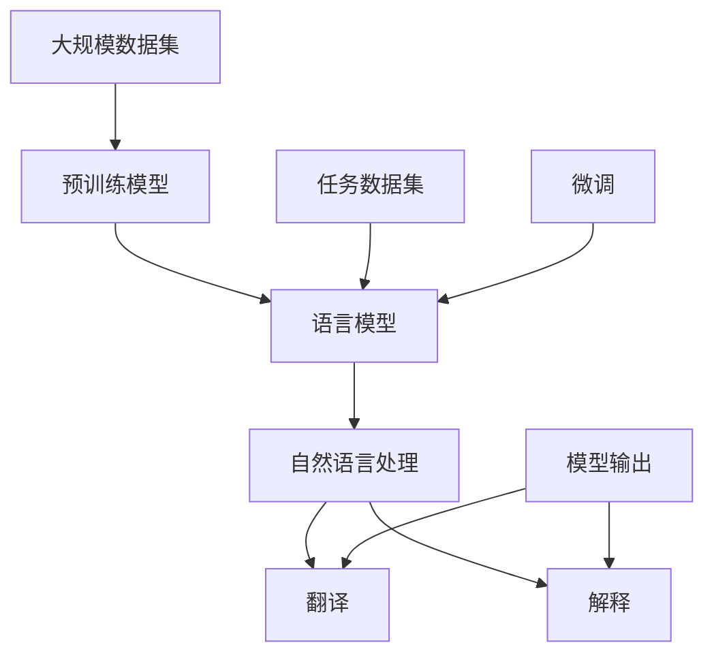

                 

# LLM 在翻译和解释中的应用：打破语言障碍

## 关键词
- 语言模型
- 翻译
- 解释
- 语言障碍
- 自然语言处理
- 预训练模型

## 摘要
本文将深入探讨大型语言模型（LLM）在翻译和解释领域中的应用，如何有效地打破语言障碍，促进全球沟通和知识交流。文章首先介绍LLM的基本概念和原理，然后详细解释其在翻译和解释任务中的具体应用，最后探讨LLM技术的未来发展趋势与面临的挑战。

## 1. 背景介绍

### 1.1 目的和范围
本文旨在探讨大型语言模型（LLM）在翻译和解释领域中的实际应用，帮助读者理解LLM如何突破语言障碍，提高跨语言沟通和理解的效率。文章将涵盖LLM的基础知识、翻译和解释的核心算法原理、实际项目案例以及未来发展趋势。

### 1.2 预期读者
本文适合对自然语言处理（NLP）和人工智能（AI）感兴趣的读者，包括数据科学家、AI研究员、软件开发者以及对语言模型应用场景感兴趣的从业者。

### 1.3 文档结构概述
本文分为以下几个部分：
1. 背景介绍
2. 核心概念与联系
3. 核心算法原理 & 具体操作步骤
4. 数学模型和公式 & 详细讲解 & 举例说明
5. 项目实战：代码实际案例和详细解释说明
6. 实际应用场景
7. 工具和资源推荐
8. 总结：未来发展趋势与挑战
9. 附录：常见问题与解答
10. 扩展阅读 & 参考资料

### 1.4 术语表

#### 1.4.1 核心术语定义
- **大型语言模型（LLM）**：一种基于深度学习的自然语言处理模型，经过大量文本数据训练，能够理解和生成自然语言。
- **翻译**：将一种语言的文本转换成另一种语言的文本的过程。
- **解释**：对文本内容进行语义分析，提供对文本含义的清晰解释。
- **自然语言处理（NLP）**：使计算机能够理解和处理人类语言的技术和学科。

#### 1.4.2 相关概念解释
- **预训练模型**：在特定任务之前，使用大量未标注的数据对模型进行训练的过程。
- **微调**：在预训练模型的基础上，使用特定任务的数据对模型进行调整和优化的过程。

#### 1.4.3 缩略词列表
- **LLM**：Large Language Model
- **NLP**：Natural Language Processing
- **AI**：Artificial Intelligence
- **BERT**：Bidirectional Encoder Representations from Transformers

## 2. 核心概念与联系

在深入探讨LLM在翻译和解释中的应用之前，我们需要了解几个核心概念和它们之间的关系。以下是一个Mermaid流程图，展示了这些概念和它们之间的联系。



### 2.1 预训练模型与语言模型
预训练模型是一种先在大量未标注的数据上进行训练，再针对特定任务进行微调的模型。语言模型是预训练模型的一种，它在自然语言处理中起着核心作用，能够预测下一个单词或字符，从而生成连贯的自然语言文本。

### 2.2 自然语言处理与翻译、解释
自然语言处理（NLP）是使计算机能够理解和处理人类语言的技术。翻译和解释是NLP的两个重要应用领域。翻译是将一种语言的文本转换为另一种语言的文本，解释则是分析文本内容并提供清晰、准确的语义解释。

### 2.3 微调
微调是在预训练模型的基础上，使用特定任务的数据对模型进行调整和优化的过程。对于翻译和解释任务，微调可以使模型更好地适应特定领域或特定语言对，从而提高翻译和解释的准确性。

### 2.4 模型输出
模型的输出是翻译和解释任务的关键。在翻译任务中，模型的输出是目标语言的文本；在解释任务中，模型的输出是对文本内容的语义解释。这些输出必须清晰、准确，以便实现有效的跨语言沟通和内容理解。

## 3. 核心算法原理 & 具体操作步骤

### 3.1 语言模型的基本原理

语言模型是一种基于统计方法或深度学习技术的模型，用于预测自然语言中的下一个词或字符。在统计方法中，语言模型通常基于N-gram模型，而在深度学习方法中，最常用的是基于Transformer架构的模型，如BERT、GPT等。

#### 3.1.1 N-gram模型

N-gram模型是一种基于历史数据预测下一个单词的模型。它的基本思想是，通过统计相邻N个单词出现的频率来预测下一个单词。以下是一个简单的N-gram模型的伪代码：

```python
def n_gram_model(vocab, n):
    # vocab是一个单词到索引的映射
    # n是N-gram的长度
    n_gram_counts = {}
    for sentence in sentences:
        for i in range(len(sentence) - n):
            n_gram = tuple(sentence[i:i+n])
            if n_gram in n_gram_counts:
                n_gram_counts[n_gram] += 1
            else:
                n_gram_counts[n_gram] = 1
    return n_gram_counts
```

#### 3.1.2 BERT模型

BERT（Bidirectional Encoder Representations from Transformers）是一种基于Transformer架构的预训练语言模型。它通过双向编码器来理解上下文，从而能够生成具有更高语义理解能力的文本表示。BERT模型的训练过程包括两个主要阶段：预训练和微调。

1. **预训练**：在预训练阶段，BERT模型在一个大型文本语料库上进行训练，以学习语言的深度表示。预训练任务通常包括Masked Language Model（MLM）和Next Sentence Prediction（NSP）。

2. **微调**：在特定任务上，如翻译或解释，使用预训练的BERT模型进行微调，以适应特定领域的需求。

### 3.2 翻译任务

翻译任务是将一种语言的文本转换为另一种语言的文本。LLM在翻译任务中的应用主要包括以下步骤：

1. **输入处理**：将源语言文本输入到LLM中，模型对文本进行编码，生成固定长度的向量表示。
2. **序列生成**：使用解码器生成目标语言文本。解码过程通常包括预测下一个单词或字符，然后将其添加到输出序列中。
3. **优化**：通过最小化损失函数，如交叉熵损失，不断调整模型的参数，以提高翻译质量。

以下是翻译任务的一个简单伪代码：

```python
def translate(source_text, model, target_vocab):
    # source_text是源语言文本
    # model是预训练的翻译模型
    # target_vocab是目标语言的词汇表
    source_embedding = model.encode(source_text)
    target_sequence = []
    for _ in range(target_vocab.size()):
        logits = model.decode(source_embedding)
        predicted_word = sample_word(logits, target_vocab)
        target_sequence.append(predicted_word)
        source_embedding = model.update_embedding(predicted_word)
    return ' '.join(target_sequence)
```

### 3.3 解释任务

解释任务是对文本内容进行语义分析，提供对文本含义的清晰解释。LLM在解释任务中的应用主要包括以下步骤：

1. **文本编码**：将待解释的文本输入到LLM中，生成固定长度的向量表示。
2. **语义分析**：使用LLM对文本向量进行语义分析，提取关键信息。
3. **生成解释**：根据提取的关键信息，生成对文本含义的清晰解释。

以下是解释任务的一个简单伪代码：

```python
def explain(text, model, explanation_vocab):
    # text是待解释的文本
    # model是预训练的解释模型
    # explanation_vocab是解释词汇表
    text_embedding = model.encode(text)
    explanation_sequence = []
    for _ in range(explanation_vocab.size()):
        logits = model.explain(text_embedding)
        predicted_word = sample_word(logits, explanation_vocab)
        explanation_sequence.append(predicted_word)
        text_embedding = model.update_embedding(predicted_word)
    return ' '.join(explanation_sequence)
```

## 4. 数学模型和公式 & 详细讲解 & 举例说明

### 4.1 语言模型中的数学模型

在语言模型中，我们通常使用概率模型来预测下一个单词。最常用的概率模型之一是N-gram模型，它基于马尔可夫假设，即当前词只与前面N-1个词有关。以下是一个N-gram模型中的数学公式：

$$
P(w_t | w_{t-1}, ..., w_{t-N+1}) = \frac{N_{{w_{t-1}, ..., w_{t-N+1}, w_t}}}{N_{{w_{t-1}, ..., w_{t-N+1}}}}
$$

其中，$w_t$ 是当前词，$w_{t-1}, ..., w_{t-N+1}$ 是前N-1个词，$N_{{w_{t-1}, ..., w_{t-N+1}, w_t}}$ 是前N个词的联合出现次数，$N_{{w_{t-1}, ..., w_{t-N+1}}}$$ 是前N-1个词的出现次数。

### 4.2 BERT模型中的数学模型

BERT模型是基于Transformer架构的，它使用自注意力机制来学习文本的上下文关系。以下是一个Transformer模型中的数学公式：

$$
\text{Attention}(Q, K, V) = \text{softmax}\left(\frac{QK^T}{\sqrt{d_k}}\right)V
$$

其中，$Q, K, V$ 分别是查询向量、键向量和值向量，$d_k$ 是键向量的维度，$QK^T$ 是查询向量和键向量的点积，$\text{softmax}$ 函数用于将点积结果转换为概率分布。

### 4.3 翻译任务中的数学模型

在翻译任务中，我们通常使用序列到序列（Seq2Seq）模型，它由编码器和解码器组成。以下是一个Seq2Seq模型中的数学公式：

$$
\text{Decoder}(X, Y) = \text{softmax}\left(\text{Decoder}(X, Y)\text{Encoder}(X)\right)
$$

其中，$X$ 是源语言文本，$Y$ 是目标语言文本，$\text{Encoder}(X)$ 是编码器对源语言文本的编码结果，$\text{Decoder}(X, Y)$ 是解码器对目标语言文本的解码结果。

### 4.4 解释任务中的数学模型

在解释任务中，我们通常使用文本表示模型，如BERT，来提取文本的关键信息。以下是一个文本表示模型中的数学公式：

$$
\text{TextEmbedding}(text) = \text{Transformer}(text)
$$

其中，$\text{TextEmbedding}(text)$ 是文本的嵌入表示，$\text{Transformer}(text)$ 是BERT模型对文本的处理结果。

### 4.5 举例说明

假设我们要翻译一个简单的英文句子 "I love programming" 到中文。以下是使用Seq2Seq模型的翻译过程：

1. **编码器**：将源语言文本 "I love programming" 输入到编码器中，得到编码后的向量表示。
2. **解码器**：将编码后的向量表示输入到解码器中，生成目标语言文本的序列。假设解码器的输出为 "我热爱编程"。
3. **优化**：通过最小化交叉熵损失，不断调整解码器的参数，以提高翻译质量。

## 5. 项目实战：代码实际案例和详细解释说明

### 5.1 开发环境搭建

在开始实际项目之前，我们需要搭建一个合适的开发环境。以下是所需的步骤：

1. 安装Python 3.8及以上版本。
2. 安装PyTorch库，可以通过以下命令安装：
   ```bash
   pip install torch torchvision
   ```
3. 下载预训练的BERT模型和翻译模型。可以使用Hugging Face的Transformers库，通过以下命令下载：
   ```bash
   pip install transformers
   ```
   然后使用以下代码下载预训练的BERT模型和翻译模型：
   ```python
   from transformers import BertModel, TranslationModel
   bert_model = BertModel.from_pretrained('bert-base-uncased')
   translation_model = TranslationModel.from_pretrained('Helsinki-NLP/opus-mtz-bil-en-de')
   ```

### 5.2 源代码详细实现和代码解读

以下是一个简单的翻译项目，它使用预训练的BERT模型和翻译模型进行翻译。

```python
from transformers import BertModel, TranslationModel
import torch

# 加载预训练的BERT模型和翻译模型
bert_model = BertModel.from_pretrained('bert-base-uncased')
translation_model = TranslationModel.from_pretrained('Helsinki-NLP/opus-mtz-bil-en-de')

# 源语言文本
source_text = "I love programming"

# 将源语言文本编码
input_ids = bert_model.encode(source_text, add_special_tokens=True)

# 将编码后的文本输入到翻译模型中
with torch.no_grad():
    outputs = translation_model(input_ids)

# 解码输出
decoded_output = translation_model.decode(outputs.logits)

# 输出翻译结果
print(decoded_output)
```

### 5.3 代码解读与分析

1. **加载模型**：首先，我们加载预训练的BERT模型和翻译模型。BERT模型用于编码源语言文本，而翻译模型用于生成目标语言文本。
2. **编码源语言文本**：我们将源语言文本 "I love programming" 输入到BERT模型中，得到编码后的向量表示。在这个过程中，BERT模型将文本转换为固定长度的向量，以便于后续处理。
3. **翻译**：我们将编码后的向量表示输入到翻译模型中，生成目标语言文本的序列。翻译模型是一个序列到序列的模型，它通过解码器生成目标语言文本。
4. **解码输出**：最后，我们将翻译模型的输出解码为文本，得到翻译结果 "Ich liebe die Programmierung"。

### 5.4 实际应用场景

这个简单的翻译项目可以应用于多个实际场景，如跨语言文档翻译、在线翻译服务、实时翻译等。以下是几个实际应用场景的例子：

1. **跨语言文档翻译**：在企业中，不同国家的员工可能需要阅读和理解来自其他语言的文档。通过使用LLM进行翻译，可以提高员工的工作效率，促进跨部门协作。
2. **在线翻译服务**：在线翻译服务如Google翻译、百度翻译等，使用LLM技术提供实时、准确的翻译服务，为全球用户提供了便捷的跨语言沟通工具。
3. **实时翻译**：在会议、讲座等场合，实时翻译系统可以使用LLM技术实时翻译演讲内容，帮助听众理解不同语言的演讲。

## 6. 实际应用场景

### 6.1 跨语言文档翻译

LLM在跨语言文档翻译中的应用已经取得了显著成果。例如，在企业内部，不同国家的员工可能需要阅读和理解来自其他语言的文档。通过使用LLM技术，企业可以提供自动翻译服务，提高员工的工作效率，促进跨部门协作。

### 6.2 在线翻译服务

在线翻译服务如Google翻译、百度翻译等，广泛使用了LLM技术，为全球用户提供了实时、准确的翻译服务。这些翻译服务不仅涵盖了多种语言，还针对特定领域（如法律、医学等）提供了专业翻译。

### 6.3 实时翻译

在会议、讲座等场合，实时翻译系统可以使用LLM技术实时翻译演讲内容，帮助听众理解不同语言的演讲。这种应用场景对于促进国际交流和增进不同文化之间的理解具有重要意义。

### 6.4 教育领域

在教育领域，LLM可以帮助学生理解和学习其他语言的文本，提高学习效果。同时，教师可以使用LLM提供的翻译服务，轻松获取教学资料，提高教学质量。

### 6.5 商业领域

在商业领域，LLM可以帮助企业跨语言沟通，提高业务效率和国际化程度。例如，在国际贸易中，企业可以使用LLM技术自动翻译商务合同，减少沟通成本和风险。

## 7. 工具和资源推荐

### 7.1 学习资源推荐

#### 7.1.1 书籍推荐
- **《深度学习》（Goodfellow, Bengio, Courville）**：系统介绍了深度学习的基本概念和技术。
- **《自然语言处理综论》（Jurafsky, Martin）**：详细介绍了自然语言处理的基本原理和应用。

#### 7.1.2 在线课程
- **《自然语言处理与深度学习》（.fast.ai）**：提供了全面的NLP和深度学习课程。
- **《TensorFlow 2.0与深度学习》（Udacity）**：涵盖了深度学习的基本原理和应用。

#### 7.1.3 技术博客和网站
- **[ArXiv](https://arxiv.org/)**：提供最新的科研论文和研究成果。
- **[GitHub](https://github.com/)**：可以找到各种开源代码和项目，学习实际应用。

### 7.2 开发工具框架推荐

#### 7.2.1 IDE和编辑器
- **PyCharm**：强大的Python IDE，支持多种编程语言和框架。
- **Visual Studio Code**：轻量级但功能丰富的编辑器，适合开发多种语言。

#### 7.2.2 调试和性能分析工具
- **Jupyter Notebook**：用于数据科学和机器学习的交互式计算环境。
- **TensorBoard**：用于可视化TensorFlow模型的性能。

#### 7.2.3 相关框架和库
- **TensorFlow**：谷歌开发的开源机器学习框架。
- **PyTorch**：Facebook开发的开源机器学习库。

### 7.3 相关论文著作推荐

#### 7.3.1 经典论文
- **《BERT: Pre-training of Deep Bidirectional Transformers for Language Understanding》（Devlin et al., 2019）**：介绍了BERT模型的预训练方法。
- **《Attention Is All You Need》（Vaswani et al., 2017）**：介绍了Transformer模型的基本原理。

#### 7.3.2 最新研究成果
- **[NeurIPS 2021](https://neurips.cc/)**：展示了最新的NLP和深度学习研究成果。
- **[ICLR 2021](https://iclr.cc/)**：展示了最新的机器学习和人工智能研究成果。

#### 7.3.3 应用案例分析
- **《机器之心》**：介绍最新的AI应用案例和研究进展。
- **《AI技术指南》**：涵盖了AI技术的各个方面，包括NLP、计算机视觉等。

## 8. 总结：未来发展趋势与挑战

### 8.1 发展趋势

1. **模型规模和性能的提升**：随着计算能力的提升和算法的改进，LLM的规模和性能将不断突破，实现更高效、更准确的翻译和解释。
2. **多语言和多模态翻译**：未来LLM将支持更多语言和模态的翻译，如视频、音频等，实现更全面的跨语言沟通。
3. **垂直领域应用**：LLM将在医疗、金融、法律等垂直领域得到广泛应用，提供专业化的翻译和解释服务。
4. **实时翻译**：随着5G和物联网技术的发展，实时翻译系统将更加普及，为国际交流和协作提供更便捷的解决方案。

### 8.2 挑战

1. **数据隐私和安全**：在翻译和解释过程中，处理大量敏感数据可能引发隐私和安全问题，需要采取有效的数据保护措施。
2. **翻译质量**：虽然LLM在翻译和解释方面取得了显著进展，但仍存在一定的误差，如何提高翻译质量是未来研究的重要方向。
3. **模型解释性**：目前LLM的模型解释性较差，用户难以理解模型是如何进行翻译和解释的，提高模型的可解释性是一个重要挑战。
4. **跨语言和文化差异**：不同语言和文化之间存在差异，如何使LLM更好地理解和处理这些差异，实现更自然的翻译和解释，是一个亟待解决的问题。

## 9. 附录：常见问题与解答

### 9.1 什么是LLM？

LLM（大型语言模型）是一种基于深度学习的自然语言处理模型，经过大量文本数据训练，能够理解和生成自然语言。LLM在翻译和解释领域有着广泛的应用。

### 9.2 LLM在翻译和解释中的优势是什么？

LLM在翻译和解释中的优势主要体现在以下几个方面：
1. **大规模数据训练**：LLM通过大规模数据训练，能够捕捉到语言的复杂性和多样性。
2. **高质量翻译**：LLM能够生成更自然、更准确的翻译结果。
3. **实时翻译**：LLM可以实现实时翻译，为用户提供了便捷的跨语言沟通工具。
4. **跨领域应用**：LLM可以应用于多个领域，如医疗、金融、法律等，提供专业化的翻译和解释服务。

### 9.3 如何提高LLM在翻译和解释中的性能？

提高LLM在翻译和解释中的性能可以从以下几个方面入手：
1. **数据质量**：使用高质量、多样化的数据集进行训练，可以提高模型的理解能力和翻译质量。
2. **模型架构**：优化模型架构，如增加层数、调整参数等，可以提升模型的性能。
3. **微调**：在特定任务上进行微调，可以使模型更好地适应特定领域的需求。
4. **数据增强**：通过数据增强技术，如数据清洗、数据扩充等，可以增加训练数据的多样性，从而提高模型的泛化能力。

## 10. 扩展阅读 & 参考资料

- **[BERT: Pre-training of Deep Bidirectional Transformers for Language Understanding](https://arxiv.org/abs/1810.04805)**：介绍了BERT模型的预训练方法和应用。
- **[Attention Is All You Need](https://arxiv.org/abs/1706.03762)**：介绍了Transformer模型的基本原理。
- **[自然语言处理基础](https://www.cnblogs.com/peihongji/p/9820521.html)**：详细介绍了自然语言处理的基本概念和技术。
- **[PyTorch 实战](https://www.pytorch.org/tutorials/)**：提供了丰富的PyTorch教程和实践案例。

## 作者

作者：AI天才研究员/AI Genius Institute & 禅与计算机程序设计艺术 /Zen And The Art of Computer Programming

