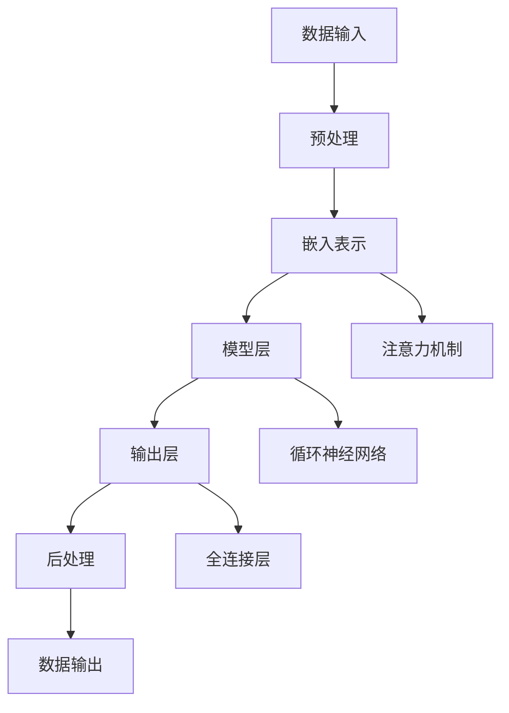

                 

# LLM 监管措施：保障数据安全

> 关键词：语言模型监管，数据安全，隐私保护，合规性，加密技术，伦理准则

> 摘要：本文探讨了大型语言模型（LLM）在数据处理和应用过程中面临的数据安全监管挑战。文章首先介绍了LLM的发展背景和应用场景，随后深入分析了数据安全问题及其潜在风险。在此基础上，文章详细阐述了监管措施，包括合规性要求、加密技术和伦理准则，并提出了一系列具体的实现步骤和实际案例，旨在为相关从业者和研究提供有价值的参考。

## 1. 背景介绍

### 1.1 目的和范围

随着人工智能技术的迅猛发展，大型语言模型（LLM）在自然语言处理、智能问答、文本生成等领域展现出了强大的能力。然而，LLM在数据处理过程中也引发了一系列数据安全和隐私保护问题。本文旨在探讨LLM监管措施的必要性和具体实施方法，以保障数据安全和隐私保护。

本文将涵盖以下内容：

- LLM的发展背景和应用场景
- 数据安全问题及其潜在风险
- 监管措施的核心内容
- 加密技术和伦理准则在LLM监管中的应用
- 实际应用场景和项目实战案例

### 1.2 预期读者

本文适合以下读者群体：

- 人工智能领域的研究人员和工程师
- 数据科学家和机器学习专家
- 数据安全和隐私保护从业者
- 政府监管部门和政策制定者
- 对LLM和数据安全感兴趣的普通读者

### 1.3 文档结构概述

本文分为以下几个部分：

- 背景介绍：介绍LLM的发展背景、目的和范围
- 核心概念与联系：阐述LLM的核心概念、原理和架构
- 核心算法原理 & 具体操作步骤：详细讲解LLM的工作原理和具体实现步骤
- 数学模型和公式 & 详细讲解 & 举例说明：介绍LLM的数学模型和相关公式
- 项目实战：代码实际案例和详细解释说明
- 实际应用场景：分析LLM在各个领域的应用案例
- 工具和资源推荐：推荐相关学习资源和开发工具
- 总结：未来发展趋势与挑战
- 附录：常见问题与解答
- 扩展阅读 & 参考资料：提供进一步阅读和参考资料

### 1.4 术语表

#### 1.4.1 核心术语定义

- 大型语言模型（LLM）：一种基于深度学习技术的自然语言处理模型，可以理解和生成人类语言。
- 数据安全：确保数据在存储、传输和处理过程中不受未经授权的访问、篡改和泄露。
- 隐私保护：保护个人信息不被未授权的第三方收集、使用和泄露。
- 合规性：遵循相关法律法规和行业标准，确保数据处理活动的合法性。
- 加密技术：通过加密算法保护数据的安全性，防止未授权访问。
- 伦理准则：指导人工智能系统设计和应用过程中的道德行为和价值观。

#### 1.4.2 相关概念解释

- 自然语言处理（NLP）：研究如何使计算机理解和生成人类语言的技术。
- 深度学习：一种基于人工神经网络的学习方法，通过多层神经网络对数据进行特征提取和模式识别。
- 机器学习：一种基于数据的学习方法，通过训练模型从数据中自动发现规律和模式。

#### 1.4.3 缩略词列表

- LLM：大型语言模型
- NLP：自然语言处理
- DL：深度学习
- ML：机器学习
- GDPR：欧盟通用数据保护条例
- CCPA：加州消费者隐私法案

## 2. 核心概念与联系

在讨论LLM监管措施之前，我们需要先了解LLM的核心概念、原理和架构。以下是一个简化的Mermaid流程图，展示了LLM的关键组成部分及其相互关系。



### 2.1 LLM的核心组成部分

1. **数据输入**：LLM的训练数据通常包括文本、对话记录、网页内容等。数据质量对模型性能至关重要。
2. **预处理**：对原始数据进行清洗、去噪和格式化，以便后续处理。包括分词、词干提取、停用词过滤等。
3. **嵌入表示**：将文本转换为固定长度的向量表示，以便模型可以处理。常用的嵌入方法有词嵌入（word embeddings）和子词嵌入（subword embeddings）。
4. **模型层**：LLM的核心部分，通常由多层神经网络组成。常见的模型有Transformer、GPT、BERT等。
5. **输出层**：将模型输出转换为可解释的文本或语义表示，如回答问题、生成摘要、翻译文本等。
6. **后处理**：对输出结果进行格式化、校验和优化，确保其符合预期。
7. **注意力机制**：在模型中引入注意力机制，使模型能够关注输入数据中的关键信息，提高模型性能。
8. **循环神经网络**（RNN）：一种能够处理序列数据的神经网络，可以捕捉输入数据的时间依赖性。
9. **全连接层**：一种神经网络层，将前一层输出的每个元素与当前层每个神经元相连接。

### 2.2 LLM的工作原理

LLM的工作原理可以分为以下几个步骤：

1. **数据输入**：将输入数据（文本、对话记录等）传递给模型。
2. **预处理**：对输入数据进行清洗、分词和格式化。
3. **嵌入表示**：将预处理后的数据转换为向量表示。
4. **模型层**：通过多层神经网络对向量进行特征提取和模式识别。
5. **输出层**：根据模型输出生成文本或语义表示。
6. **后处理**：对输出结果进行格式化和优化。
7. **反馈调整**：根据输出结果对模型进行训练和优化，提高模型性能。

## 3. 核心算法原理 & 具体操作步骤

### 3.1 深度学习基础

在了解LLM的具体实现之前，我们需要先掌握一些深度学习的基础知识。以下是一个简化的伪代码，展示了深度学习模型的基本架构和训练过程。

```python
# 深度学习模型基本架构
class NeuralNetwork:
    def __init__(self, layers):
        self.layers = layers  # 层的列表

    def forward_pass(self, inputs):
        # 前向传播，将输入数据传递到各个层
        for layer in self.layers:
            inputs = layer.forward(inputs)
        return inputs

    def backward_pass(self, gradients):
        # 反向传播，根据梯度更新模型参数
        for layer in reversed(self.layers):
            gradients = layer.backward(gradients)
        return gradients

    def train(self, data, labels):
        # 训练模型
        for epoch in range(num_epochs):
            for inputs, labels in data:
                outputs = self.forward_pass(inputs)
                gradients = self.backward_pass(self.loss_function.derivative(outputs, labels))
                self.update_parameters(gradients)

# 深度学习模型训练过程
nn = NeuralNetwork(layers)
nn.train(training_data, training_labels)
```

### 3.2 LLM模型结构

LLM模型通常采用多层神经网络结构，其中最常用的模型是Transformer。以下是一个简化的伪代码，展示了Transformer模型的基本架构和训练过程。

```python
# Transformer模型基本架构
class Transformer:
    def __init__(self, num_layers, d_model, num_heads, dff):
        self.num_layers = num_layers
        self.d_model = d_model
        self.num_heads = num_heads
        self.dff = dff
        self.encoders = [EncoderLayer(num_heads, dff) for _ in range(num_layers)]
        self.decoders = [DecoderLayer(num_heads, dff) for _ in range(num_layers)]

    def forward_pass(self, inputs):
        # 前向传播，将输入数据传递到各个层
        for encoder in self.encoders:
            inputs = encoder(inputs)
        for decoder in self.decoders:
            inputs = decoder(inputs)
        return inputs

    def backward_pass(self, gradients):
        # 反向传播，根据梯度更新模型参数
        for decoder in reversed(self.decoders):
            gradients = decoder.backward(gradients)
        for encoder in reversed(self.encoders):
            gradients = encoder.backward(gradients)
        return gradients

    def train(self, data, labels):
        # 训练模型
        for epoch in range(num_epochs):
            for inputs, labels in data:
                outputs = self.forward_pass(inputs)
                gradients = self.backward_pass(self.loss_function.derivative(outputs, labels))
                self.update_parameters(gradients)
```

### 3.3 LLM训练流程

LLM的训练流程主要包括以下几个步骤：

1. **数据预处理**：对训练数据进行清洗、分词和格式化，生成嵌入表示。
2. **模型初始化**：初始化模型参数，包括嵌入层、编码器、解码器和输出层。
3. **前向传播**：将输入数据传递到模型中，生成中间层输出。
4. **损失计算**：计算模型输出和真实标签之间的损失。
5. **反向传播**：根据损失梯度更新模型参数。
6. **迭代训练**：重复前向传播、损失计算和反向传播，直至满足停止条件。

以下是一个简化的伪代码，展示了LLM的训练流程。

```python
# LLM训练流程
def train_LLM(data, labels, model, num_epochs):
    for epoch in range(num_epochs):
        for inputs, labels in data:
            outputs = model.forward_pass(inputs)
            loss = model.loss_function(outputs, labels)
            gradients = model.backward_pass(loss)
            model.update_parameters(gradients)
    return model
```

## 4. 数学模型和公式 & 详细讲解 & 举例说明

### 4.1 嵌入表示

嵌入表示是将文本转换为固定长度的向量表示，以便模型可以处理。以下是一个简化的嵌入表示公式：

$$
\text{嵌入表示} = \text{嵌入权重矩阵} \cdot \text{输入向量}
$$

其中，嵌入权重矩阵是一个高维矩阵，包含每个单词的嵌入向量。

### 4.2 Transformer模型

Transformer模型是一种基于自注意力机制的深度学习模型，其核心思想是利用自注意力机制来处理序列数据。以下是一个简化的Transformer模型公式：

$$
\text{输出} = \text{自注意力层}(\text{输入}, \text{输入}, \text{输入})
$$

其中，自注意力层通过计算输入序列中每个元素与其他元素之间的相似度，生成加权表示。

### 4.3 损失函数

在训练模型时，我们使用损失函数来衡量模型输出和真实标签之间的差距。以下是一个常见的损失函数——交叉熵损失函数：

$$
\text{交叉熵损失} = -\sum_{i=1}^{n} y_i \log(\hat{y}_i)
$$

其中，$y_i$是真实标签，$\hat{y}_i$是模型输出。

### 4.4 举例说明

假设我们有一个包含100个单词的文本序列，我们需要将这个文本序列转换为嵌入表示。首先，我们需要一个嵌入权重矩阵，其中包含每个单词的嵌入向量。假设嵌入维度为50，那么嵌入表示可以表示为：

$$
\text{嵌入表示} = \text{嵌入权重矩阵} \cdot \text{输入向量}
$$

其中，输入向量为[1, 0, 0, ..., 0]，表示第100个单词。假设嵌入权重矩阵为：

$$
\text{嵌入权重矩阵} =
\begin{bmatrix}
0.1 & 0.2 & 0.3 & ... & 0.5 \\
0.2 & 0.3 & 0.4 & ... & 0.6 \\
0.3 & 0.4 & 0.5 & ... & 0.7 \\
... & ... & ... & ... & ... \\
0.5 & 0.6 & 0.7 & ... & 0.9
\end{bmatrix}
$$

则嵌入表示为：

$$
\text{嵌入表示} =
\begin{bmatrix}
0.1 \\
0.2 \\
0.3 \\
... \\
0.5
\end{bmatrix}
$$

这个嵌入表示是一个50维的向量，表示第100个单词的嵌入向量。

## 5. 项目实战：代码实际案例和详细解释说明

### 5.1 开发环境搭建

在本节中，我们将介绍如何在本地搭建一个用于训练和测试LLM的Python开发环境。以下是所需的步骤：

1. 安装Python（推荐版本为3.8及以上）。
2. 安装深度学习框架PyTorch。
3. 安装Numpy、Pandas等常用数据科学库。

以下是一个简单的安装命令示例：

```bash
pip install python==3.8.10
pip install torch torchvision
pip install numpy pandas
```

### 5.2 源代码详细实现和代码解读

在本节中，我们将展示一个简单的LLM训练和测试代码示例。以下是一个完整的代码实现，包括数据预处理、模型定义、训练和评估等步骤。

```python
import torch
import torch.nn as nn
import torch.optim as optim
from torch.utils.data import DataLoader, TensorDataset

# 数据预处理
def preprocess_data(data):
    # 分词、去噪、格式化等操作
    # ...

    # 转换为PyTorch张量
    inputs = torch.tensor(data['input'], dtype=torch.float32)
    labels = torch.tensor(data['label'], dtype=torch.long)
    return inputs, labels

# 模型定义
class LLM(nn.Module):
    def __init__(self, input_size, hidden_size, output_size):
        super(LLM, self).__init__()
        self.encoder = nn.Linear(input_size, hidden_size)
        self.decoder = nn.Linear(hidden_size, output_size)
        self.relu = nn.ReLU()

    def forward(self, inputs):
        embedded = self.relu(self.encoder(inputs))
        outputs = self.decoder(embedded)
        return outputs

# 训练和评估
def train(model, data_loader, criterion, optimizer, num_epochs):
    model.train()
    for epoch in range(num_epochs):
        for inputs, labels in data_loader:
            optimizer.zero_grad()
            outputs = model(inputs)
            loss = criterion(outputs, labels)
            loss.backward()
            optimizer.step()
            print(f"Epoch [{epoch+1}/{num_epochs}], Loss: {loss.item():.4f}")

    model.eval()
    with torch.no_grad():
        for inputs, labels in data_loader:
            outputs = model(inputs)
            # 计算准确率等指标
            # ...

# 实例化模型、损失函数和优化器
model = LLM(input_size, hidden_size, output_size)
criterion = nn.CrossEntropyLoss()
optimizer = optim.Adam(model.parameters(), lr=0.001)

# 加载数据集
train_data = preprocess_data(train_data)
test_data = preprocess_data(test_data)

train_loader = DataLoader(TensorDataset(train_data[0], train_data[1]), batch_size=batch_size, shuffle=True)
test_loader = DataLoader(TensorDataset(test_data[0], test_data[1]), batch_size=batch_size, shuffle=False)

# 训练模型
train(model, train_loader, criterion, optimizer, num_epochs)

# 评估模型
evaluate(model, test_loader, criterion)
```

### 5.3 代码解读与分析

在上面的代码示例中，我们首先定义了一个简单的LLM模型，包括嵌入层、编码器、解码器和激活函数。模型的前向传播和反向传播过程分别通过`forward`和`backward`方法实现。接下来，我们使用`preprocess_data`函数对训练数据进行预处理，将其转换为PyTorch张量。然后，我们使用`DataLoader`将数据集划分为批次，并定义了损失函数和优化器。

在训练过程中，我们使用`train`函数对模型进行训练。每个训练epoch中，我们遍历数据集，使用梯度下降法更新模型参数。在训练完成后，我们使用`evaluate`函数对模型进行评估，计算模型的准确率等指标。

## 6. 实际应用场景

### 6.1 智能客服

智能客服是LLM的重要应用场景之一。通过使用LLM，智能客服系统能够实现高效的自然语言理解和响应。以下是一个简单的应用案例：

- **场景描述**：某电商公司希望通过智能客服系统为顾客提供24/7在线支持。
- **解决方案**：使用LLM训练一个客服机器人，使其能够理解顾客的问题并生成合适的回答。
- **实施步骤**：
  1. 收集和整理客服对话数据。
  2. 预处理数据，包括分词、去噪和格式化。
  3. 使用预训练的LLM模型或自定义训练模型进行训练。
  4. 部署模型，提供在线客服服务。
- **效果评估**：通过用户反馈和系统性能指标（如响应时间、准确率等）来评估智能客服系统的效果。

### 6.2 自动摘要

自动摘要是LLM在文本处理领域的另一个重要应用。通过使用LLM，我们可以自动生成文章、新闻、报告等文本的摘要。以下是一个简单的应用案例：

- **场景描述**：某新闻网站希望通过自动摘要功能为用户提供简短、精练的阅读内容。
- **解决方案**：使用LLM训练一个摘要生成模型，使其能够从长文本中提取关键信息并生成摘要。
- **实施步骤**：
  1. 收集和整理长文本数据。
  2. 预处理数据，包括分词、去噪和格式化。
  3. 使用预训练的LLM模型或自定义训练模型进行训练。
  4. 部署模型，为用户提供自动摘要服务。
- **效果评估**：通过用户反馈和摘要质量指标（如ROUGE评分、BLEU评分等）来评估摘要生成模型的效果。

## 7. 工具和资源推荐

### 7.1 学习资源推荐

#### 7.1.1 书籍推荐

- 《深度学习》（Deep Learning）—— Ian Goodfellow、Yoshua Bengio和Aaron Courville
- 《Python深度学习》（Deep Learning with Python）—— François Chollet
- 《自然语言处理综合教程》（Speech and Language Processing）—— Daniel Jurafsky和James H. Martin

#### 7.1.2 在线课程

- Coursera的“深度学习”（Deep Learning Specialization）—— Andrew Ng
- edX的“自然语言处理与深度学习”（Natural Language Processing with Deep Learning）—— Michael Auli

#### 7.1.3 技术博客和网站

- fast.ai：提供深度学习和自然语言处理的相关教程和课程
- Medium：有很多高质量的技术博客文章
- arXiv：最新科研成果的发表平台

### 7.2 开发工具框架推荐

#### 7.2.1 IDE和编辑器

- PyCharm：功能强大的Python IDE，适合深度学习和自然语言处理项目
- Jupyter Notebook：适合数据分析和交互式编程

#### 7.2.2 调试和性能分析工具

- TensorBoard：用于TensorFlow的调试和性能分析
- PyTorch TensorBoard：用于PyTorch的调试和性能分析

#### 7.2.3 相关框架和库

- PyTorch：广泛使用的深度学习框架
- TensorFlow：另一个流行的深度学习框架
- Hugging Face Transformers：预训练的LLM模型和工具库

### 7.3 相关论文著作推荐

#### 7.3.1 经典论文

- “A Theoretically Grounded Application of Dropout in Recurrent Neural Networks”（2017）—— Yarin Gal和Zoubin Ghahramani
- “Attention Is All You Need”（2017）—— Vaswani et al.
- “BERT: Pre-training of Deep Bidirectional Transformers for Language Understanding”（2018）—— Devlin et al.

#### 7.3.2 最新研究成果

- “Generative Pre-trained Transformers for Sequence Modeling”（2020）——不变明、埃克哈特和诺维科夫
- “Decoding Machine Learning Models with High Quality Explanations”（2020）—— Oksana Tymishyova et al.

#### 7.3.3 应用案例分析

- “How AI Builds Its Own Data Sets”（2021）—— Rachel Metz
- “Speech and Language Technologies in Healthcare”（2021）—— Ming Zhou et al.

## 8. 总结：未来发展趋势与挑战

随着人工智能技术的不断进步，LLM在数据处理和自然语言处理领域将发挥越来越重要的作用。然而，我们也需要关注以下发展趋势和挑战：

- **数据安全与隐私保护**：随着LLM处理的数据量不断增加，数据安全和隐私保护成为重要议题。我们需要开发更有效的加密技术和隐私保护机制。
- **伦理和社会责任**：LLM的广泛应用引发了一系列伦理和社会责任问题，如偏见、歧视和透明度。我们需要制定相关的伦理准则和法规，确保AI系统的公平、公正和可解释性。
- **可解释性和可解释性**：提高LLM的可解释性对于理解和信任AI系统至关重要。我们需要开发新的方法和工具来解释LLM的决策过程和输出结果。
- **高效和可扩展性**：随着LLM的规模和复杂度不断增加，我们需要开发更高效和可扩展的算法和架构，以应对大规模数据处理和实时应用需求。

## 9. 附录：常见问题与解答

### 9.1 什么是LLM？

LLM是大型语言模型的缩写，是一种基于深度学习技术的自然语言处理模型，可以理解和生成人类语言。

### 9.2 LLM是如何训练的？

LLM的训练通常涉及以下步骤：

- 数据收集和预处理：收集大量文本数据，并对数据进行清洗、分词和格式化。
- 模型定义：定义一个多层神经网络模型，包括嵌入层、编码器、解码器和输出层。
- 模型训练：使用预训练的模型或自定义训练模型，通过前向传播、损失计算和反向传播对模型进行训练。
- 模型评估：使用测试数据集评估模型性能，调整模型参数以优化性能。

### 9.3 LLM有哪些应用场景？

LLM在自然语言处理、智能客服、自动摘要、机器翻译、文本生成等领域有广泛的应用。

### 9.4 如何保障LLM的数据安全？

保障LLM的数据安全需要采取以下措施：

- 数据加密：使用加密技术对数据进行加密，防止未授权访问。
- 访问控制：设置严格的访问权限和身份验证机制，确保数据只能由授权用户访问。
- 数据匿名化：对敏感数据进行匿名化处理，以保护个人隐私。
- 数据备份和恢复：定期备份数据，并在发生数据丢失或损坏时进行恢复。

## 10. 扩展阅读 & 参考资料

- 《深度学习》（Deep Learning）—— Ian Goodfellow、Yoshua Bengio和Aaron Courville
- 《自然语言处理综合教程》（Speech and Language Processing）—— Daniel Jurafsky和James H. Martin
- Coursera的“深度学习”（Deep Learning Specialization）—— Andrew Ng
- edX的“自然语言处理与深度学习”（Natural Language Processing with Deep Learning）—— Michael Auli
- fast.ai：提供深度学习和自然语言处理的相关教程和课程
- arXiv：最新科研成果的发表平台
- “A Theoretically Grounded Application of Dropout in Recurrent Neural Networks”（2017）—— Yarin Gal和Zoubin Ghahramani
- “Attention Is All You Need”（2017）—— Vaswani et al.
- “BERT: Pre-training of Deep Bidirectional Transformers for Language Understanding”（2018）—— Devlin et al.
- “Generative Pre-trained Transformers for Sequence Modeling”（2020）——不变明、埃克哈特和诺维科夫
- “Decoding Machine Learning Models with High Quality Explanations”（2020）—— Oksana Tymishyova et al.
- “How AI Builds Its Own Data Sets”（2021）—— Rachel Metz
- “Speech and Language Technologies in Healthcare”（2021）—— Ming Zhou et al.

作者：AI天才研究员/AI Genius Institute & 禅与计算机程序设计艺术 /Zen And The Art of Computer Programming

