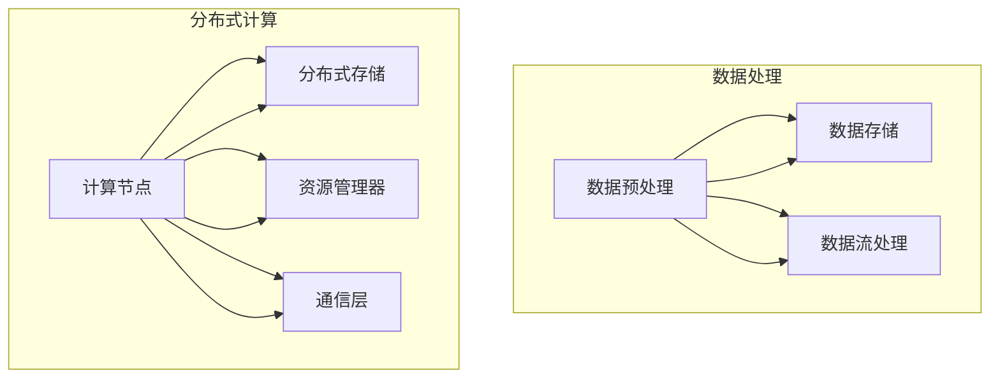
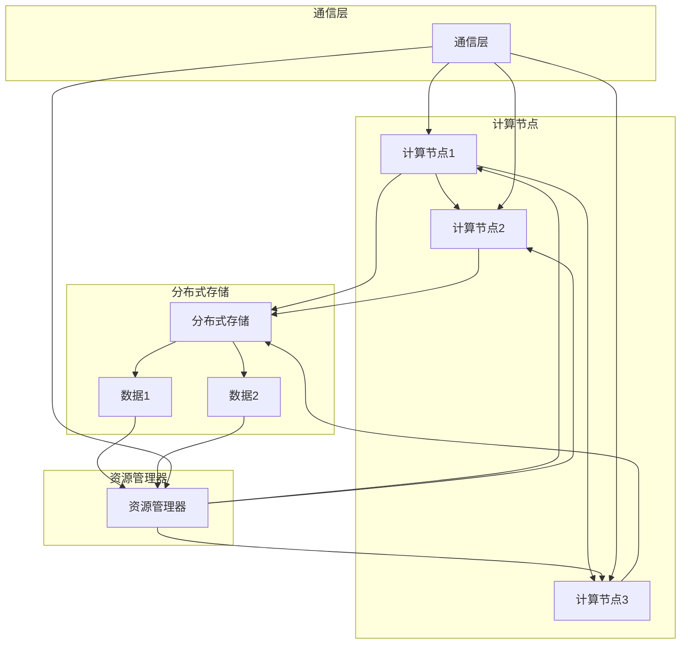

                 

# LLM训练平台：大规模数据处理和算法

> **关键词**：大规模数据处理、分布式计算、算法优化、深度学习、模型训练

> **摘要**：本文旨在探讨如何构建高效的大型语言模型（LLM）训练平台，重点关注数据处理和算法优化。我们将逐步分析大规模数据处理的挑战，介绍分布式计算的概念和实现，详细讲解核心算法原理，展示数学模型和公式，并给出实际项目案例。通过本文，读者将了解如何利用先进技术提升LLM训练效率，为后续研究和应用奠定基础。

## 1. 背景介绍

### 1.1 目的和范围

本文的目标是探讨大规模语言模型（LLM）训练平台的构建和优化，特别是数据处理和算法方面的研究。随着人工智能技术的迅猛发展，LLM 在自然语言处理（NLP）、智能助手、机器翻译等领域展现了强大的潜力。然而，构建一个高效、可扩展的LLM训练平台面临诸多挑战，包括数据处理、计算资源管理、算法优化等。

本文将围绕以下几个核心方面展开讨论：

1. **大规模数据处理**：介绍数据处理的关键技术，包括数据预处理、数据存储、分布式数据流处理等。
2. **分布式计算**：探讨分布式计算的基本概念、架构和实现，分析其在LLM训练中的应用。
3. **算法优化**：详细讲解核心算法原理，阐述如何通过算法优化提升LLM训练效率。
4. **实际应用**：通过实际项目案例，展示如何构建和优化LLM训练平台，提供可借鉴的经验和教训。

### 1.2 预期读者

本文主要面向以下读者群体：

1. **人工智能研究者和开发者**：对LLM训练平台构建和优化感兴趣的科研人员和技术专家。
2. **软件开发工程师**：负责开发和维护LLM训练平台的工程师，希望提升系统性能和可扩展性。
3. **数据科学家**：关注数据处理和算法优化的数据科学家，希望了解如何将先进技术应用于实际项目中。
4. **学生和研究生**：对人工智能、自然语言处理等领域感兴趣的学生和研究生，希望深入理解相关技术原理和应用。

### 1.3 文档结构概述

本文采用逻辑清晰、结构紧凑的编写方式，分为以下几个主要部分：

1. **背景介绍**：简要介绍本文的目的和范围，预期读者，文档结构概述。
2. **核心概念与联系**：介绍大规模数据处理和分布式计算的核心概念，使用Mermaid流程图展示架构。
3. **核心算法原理与具体操作步骤**：详细讲解核心算法原理，使用伪代码进行具体操作步骤的阐述。
4. **数学模型和公式**：展示数学模型和公式，使用latex格式进行详细讲解和举例说明。
5. **项目实战**：通过实际项目案例，展示代码实现和详细解释说明。
6. **实际应用场景**：分析LLM训练平台在实际应用中的挑战和解决方案。
7. **工具和资源推荐**：推荐学习资源、开发工具框架和相关论文著作。
8. **总结**：总结未来发展趋势与挑战，展望LLM训练平台的发展方向。
9. **附录**：提供常见问题与解答，方便读者查阅。
10. **扩展阅读与参考资料**：推荐相关阅读资料，为读者提供更深入的探索方向。

### 1.4 术语表

#### 1.4.1 核心术语定义

- **大规模数据处理**：指处理大规模数据集的算法和技术，包括数据预处理、数据存储、数据流处理等。
- **分布式计算**：指通过多个计算节点协同工作，实现大规模数据处理和计算任务的技术。
- **深度学习**：一种基于多层神经网络进行特征提取和预测的学习方法，广泛应用于图像识别、自然语言处理等领域。
- **模型训练**：指通过训练数据集，调整模型参数，使其具备特定任务的能力。

#### 1.4.2 相关概念解释

- **分布式计算架构**：指分布式计算系统中各个计算节点之间的组织结构和通信方式。
- **数据流处理**：指对实时数据流进行处理和分析的方法，通常采用分布式架构实现。
- **数据处理管道**：指将数据从源端传输到目标端的一系列数据处理操作，包括数据清洗、转换、存储等。

#### 1.4.3 缩略词列表

- **LLM**：Large Language Model，大型语言模型。
- **NLP**：Natural Language Processing，自然语言处理。
- **NLP**：Natural Language Processing，自然语言处理。
- **DNN**：Deep Neural Network，深度神经网络。
- **GPU**：Graphics Processing Unit，图形处理器。

## 2. 核心概念与联系

在构建高效的大型语言模型（LLM）训练平台时，理解大规模数据处理和分布式计算的核心概念是至关重要的。本节将介绍这些核心概念，并使用Mermaid流程图展示其架构，帮助读者更好地理解其工作原理和相互关系。

### 2.1 大规模数据处理

大规模数据处理涉及多个方面，包括数据预处理、数据存储、数据流处理等。以下是这些概念的解释：

#### 数据预处理

数据预处理是大规模数据处理的重要环节，旨在提高数据质量和减少噪声。主要任务包括：

- **数据清洗**：去除重复、错误或不完整的数据。
- **数据转换**：将数据转换为适合模型训练的格式，如将文本转换为词向量。
- **特征提取**：从原始数据中提取有价值的特征，提高模型性能。

#### 数据存储

数据存储是大规模数据处理的核心，需要解决海量数据的存储和访问问题。常见的数据存储方案包括：

- **关系型数据库**：如MySQL、PostgreSQL，适用于结构化数据存储。
- **NoSQL数据库**：如MongoDB、Cassandra，适用于非结构化和半结构化数据存储。
- **分布式文件系统**：如HDFS（Hadoop Distributed File System），适用于大规模数据存储和分布式计算。

#### 数据流处理

数据流处理是对实时数据流进行处理和分析的方法，通常采用分布式架构实现。常见的数据流处理框架包括：

- **Apache Kafka**：一款高吞吐量、可扩展的消息队列系统，适用于实时数据处理和流式计算。
- **Apache Flink**：一款分布式流处理框架，支持批处理和流处理，适用于实时数据处理和复杂计算任务。
- **Apache Storm**：一款实时分布式计算框架，适用于低延迟、高吞吐量的实时数据处理。

### 2.2 分布式计算

分布式计算是将计算任务分解到多个计算节点上执行，以提高计算效率和可扩展性。以下是分布式计算的核心概念和架构：

#### 分布式计算架构

分布式计算架构主要包括以下几个组件：

- **计算节点**：执行计算任务的物理或虚拟机。
- **分布式存储**：存储计算数据和中间结果，如HDFS、Cassandra等。
- **资源管理器**：负责分配和管理计算资源，如Hadoop YARN、Apache Mesos等。
- **通信层**：实现计算节点之间的数据传输和任务调度，如RPC、消息队列等。

#### 分布式计算算法

分布式计算算法主要包括以下几种：

- **MapReduce**：一种基于数据并行和任务并行的分布式计算模型，适用于大规模数据处理和计算任务。
- **数据流处理算法**：如基于Flink的流计算算法，适用于实时数据处理和复杂计算任务。
- **分布式机器学习算法**：如基于TensorFlow的分布式训练算法，适用于大规模模型训练和优化。

### 2.3 Mermaid流程图

为了更好地展示大规模数据处理和分布式计算的核心概念和架构，我们使用Mermaid流程图进行可视化。



在这个流程图中，数据处理和数据存储模块负责处理和存储数据，数据流处理模块负责实时数据流的处理和分析；分布式计算模块包括计算节点、分布式存储、资源管理器和通信层，负责执行分布式计算任务。

通过以上分析，我们可以看到大规模数据处理和分布式计算在LLM训练平台中的紧密联系。理解这些核心概念和架构，有助于我们构建高效、可扩展的LLM训练平台，提高训练效率和模型性能。

### 2.4 大规模数据处理与分布式计算的联系

大规模数据处理和分布式计算在构建高效LLM训练平台中具有紧密的联系。以下是两者之间的主要联系：

1. **数据存储和访问**：分布式计算依赖分布式存储系统，如HDFS，以支持海量数据的存储和高效访问。通过分布式存储，LLM训练平台能够处理大规模数据集，提高数据处理速度和性能。

2. **任务分配与调度**：分布式计算架构中的资源管理器（如Hadoop YARN）负责任务分配和资源调度。通过合理分配计算资源，分布式计算可以充分利用计算节点，提高LLM训练平台的整体性能和可扩展性。

3. **数据流处理**：分布式计算框架（如Apache Kafka和Apache Flink）支持实时数据流处理，为LLM训练平台提供实时数据处理能力。通过数据流处理，平台能够实时分析训练数据，快速调整模型参数，提高训练效果。

4. **模型训练与优化**：分布式计算算法（如MapReduce和分布式机器学习算法）支持大规模模型训练和优化。通过分布式训练，LLM训练平台能够快速训练大规模模型，降低训练时间和计算成本。

5. **负载均衡**：分布式计算能够实现负载均衡，将计算任务分配到不同计算节点，避免单点瓶颈，提高系统可靠性和可扩展性。对于大规模LLM训练平台，负载均衡是保证训练效率的重要因素。

通过以上分析，我们可以看到大规模数据处理和分布式计算在构建高效LLM训练平台中的关键作用。理解两者之间的联系，有助于我们更好地设计、实现和优化LLM训练平台，为人工智能领域的研究和应用提供强有力的技术支持。

### 2.5 分布式计算架构

分布式计算架构是构建高效LLM训练平台的核心之一。本节将介绍分布式计算的基本概念、架构设计和关键组件，帮助读者深入了解分布式计算在LLM训练中的应用。

#### 分布式计算基本概念

分布式计算是指通过多个计算节点协同工作，共同完成计算任务的一种计算模式。与单机计算相比，分布式计算具有以下优点：

1. **可扩展性**：分布式计算能够支持大规模计算任务，通过增加计算节点，可以线性扩展计算能力。
2. **可靠性**：分布式计算通过冗余节点和故障转移机制，提高系统的可靠性和容错能力。
3. **高效性**：分布式计算通过并行执行，提高计算任务的执行速度和效率。

分布式计算的基本概念包括：

- **计算节点**：执行计算任务的物理或虚拟机，通常具有独立的处理器、内存和存储资源。
- **分布式存储**：存储计算数据和中间结果，如HDFS、Cassandra等。
- **资源管理器**：负责分配和管理计算资源，如Hadoop YARN、Apache Mesos等。
- **通信层**：实现计算节点之间的数据传输和任务调度，如RPC、消息队列等。

#### 分布式计算架构设计

分布式计算架构设计包括计算节点、分布式存储、资源管理器和通信层等关键组件。以下是一个典型的分布式计算架构设计：

1. **计算节点**：计算节点是分布式计算的基础，负责执行计算任务。通常，计算节点具有以下特征：

   - **独立的处理器**：计算节点拥有独立的处理器，能够独立执行计算任务。
   - **内存和存储资源**：计算节点具有足够的内存和存储资源，用于存储计算数据和中间结果。
   - **网络连接**：计算节点通过高速网络连接，实现节点间的数据传输和任务调度。

2. **分布式存储**：分布式存储用于存储海量数据和中间结果，具有以下优点：

   - **高吞吐量**：分布式存储能够支持高吞吐量的数据读写操作，满足大规模数据处理需求。
   - **容错性**：分布式存储通过数据复制和副本管理，实现数据冗余和故障转移，提高数据可靠性和系统可用性。
   - **扩展性**：分布式存储支持动态扩展，通过增加存储节点，可以线性扩展存储容量。

3. **资源管理器**：资源管理器负责分配和管理计算资源，包括以下功能：

   - **任务调度**：资源管理器根据计算任务需求和节点状态，将任务调度到合适的计算节点上执行。
   - **资源分配**：资源管理器根据任务需求和节点资源情况，动态分配计算资源，确保系统高效运行。
   - **负载均衡**：资源管理器通过负载均衡机制，实现计算任务的合理分配，避免单点瓶颈，提高系统性能。

4. **通信层**：通信层负责实现计算节点之间的数据传输和任务调度，包括以下技术：

   - **RPC（Remote Procedure Call）**：远程过程调用，用于实现节点间的远程通信和任务调度。
   - **消息队列**：如Kafka、RabbitMQ等，用于实现数据流处理和任务调度。
   - **分布式锁**：用于实现分布式环境下的同步和互斥操作，保证数据一致性和系统稳定性。

#### 分布式计算架构示例

以下是一个简单的分布式计算架构示例，用于展示计算节点、分布式存储、资源管理器和通信层之间的关系：



在这个示例中，计算节点A、B和C分别执行计算任务，分布式存储D存储数据，资源管理器G负责任务调度和资源分配，通信层H实现节点间的数据传输和任务调度。

通过以上介绍，我们可以看到分布式计算架构在LLM训练平台中的关键作用。理解分布式计算的基本概念、架构设计和关键组件，有助于我们构建高效、可扩展的LLM训练平台，提高训练效率和模型性能。

### 2.6 分布式计算架构中的关键技术

在分布式计算架构中，有几种关键技术对于构建高效、可靠的LLM训练平台至关重要。这些技术包括任务调度、负载均衡、数据同步和容错机制。以下是对这些关键技术的详细介绍。

#### 任务调度

任务调度是分布式计算的核心，它决定了计算任务的分配和执行顺序。有效的任务调度策略能够最大化资源利用率，提高系统的整体性能。以下是几种常见的任务调度策略：

1. **负载均衡调度**：根据各个计算节点的负载情况，动态地将任务分配到负载较低的节点上。常见的负载均衡算法包括轮转调度、最小负载调度和动态负载调度。
2. **依赖调度**：考虑任务之间的依赖关系，确保依赖任务在同一节点上执行，以减少数据传输开销和通信延迟。
3. **静态调度**：在系统启动时，将任务预先分配到各个节点上，通常适用于任务依赖关系较为简单的情况。

#### 负载均衡

负载均衡旨在确保计算任务在各个节点之间均匀分配，避免某些节点过载，同时充分利用所有资源。以下是几种负载均衡技术：

1. **静态负载均衡**：通过静态配置，将任务固定分配到特定的节点上，适用于任务依赖关系简单且节点资源相对均衡的情况。
2. **动态负载均衡**：根据系统实时状态，动态调整任务分配。例如，使用基于流量的负载均衡算法，根据节点处理能力动态调整流量分配。
3. **容器负载均衡**：使用容器编排工具（如Kubernetes），实现容器的动态部署和负载均衡，适用于需要灵活扩展的场景。

#### 数据同步

数据同步是确保分布式计算中数据一致性的关键。以下是几种数据同步技术：

1. **同步复制**：将数据复制到多个节点上，确保各个节点上的数据保持一致。常见的技术包括主从复制和去同步复制。
2. **异步复制**：将数据复制到其他节点，但不保证实时一致性。适用于对实时性要求不高的场景。
3. **冲突解决**：在多个节点同时更新同一数据时，解决数据冲突的机制。例如，使用版本控制或基于时间戳的冲突解决算法。

#### 容错机制

容错机制是确保分布式计算系统在高可用性和数据完整性方面的关键。以下是几种常见的容错机制：

1. **副本机制**：通过在多个节点上存储数据副本，确保在节点故障时仍能访问数据。常见的副本策略包括N倍副本和副本一致性保证。
2. **故障检测**：定期检测节点的状态，发现故障节点并进行恢复。常见的故障检测算法包括心跳检测和阈值检测。
3. **故障恢复**：在检测到节点故障时，自动将任务重新调度到其他节点上执行，确保系统持续运行。

#### 实例分析

假设我们有一个分布式计算系统，由多个计算节点组成，用于训练一个大型语言模型。在这个系统中，任务调度策略使用动态负载均衡，确保任务均匀分配到各个节点。数据同步采用异步复制，以提高系统的实时性和扩展性。容错机制包括副本机制和故障检测，确保数据一致性和系统高可用性。

在一个具体的应用场景中，假设节点A出现故障，系统将自动检测到这一故障，并将节点A上的任务重新调度到其他节点上执行。同时，数据同步机制将保证节点A上的数据副本同步到其他节点，确保数据一致性和系统完整性。

通过以上实例分析，我们可以看到分布式计算中的关键技术如何协同工作，确保分布式计算系统的高效、可靠运行。了解这些关键技术，有助于我们在构建和优化LLM训练平台时，做出更合理的技术决策。

### 2.7 大规模数据处理和分布式计算的挑战与解决方案

在构建高效的大型语言模型（LLM）训练平台时，大规模数据处理和分布式计算面临诸多挑战。本节将探讨这些挑战，并提出相应的解决方案。

#### 数据量巨大

大规模数据处理的首要挑战在于数据量的巨大。随着互联网和物联网的普及，数据量呈爆炸式增长，如何高效地存储和处理海量数据成为一个关键问题。

**解决方案**：采用分布式存储系统，如HDFS，将数据分散存储到多个节点上，实现数据的高效存储和访问。此外，利用分布式计算框架，如Apache Flink，对海量数据进行并行处理，提高数据处理速度。

#### 数据多样性

除了数据量的巨大，数据类型的多样性也是一个挑战。不同类型的数据（如文本、图像、音频等）在存储和处理上有着不同的需求，如何统一处理这些多样化数据成为关键问题。

**解决方案**：采用基于统一数据模型的数据存储和处理方案，如使用NoSQL数据库（如MongoDB）存储非结构化和半结构化数据，结合结构化数据存储系统（如关系型数据库），实现多样化数据的统一处理。

#### 数据一致性

在分布式计算中，数据一致性是另一个重要挑战。多个节点同时对同一数据进行读写操作时，如何确保数据的一致性，避免数据冲突，是分布式系统设计的关键问题。

**解决方案**：采用分布式一致性协议，如Paxos或Raft，确保在多个节点之间达成一致。同时，利用分布式事务管理，如分布式锁和乐观锁，实现数据一致性的保障。

#### 容错性

分布式系统的一个显著特点是其高可用性，但这也带来了容错性的挑战。如何应对节点故障、数据丢失等问题，确保系统持续运行，是分布式计算中的重要问题。

**解决方案**：采用副本机制，将数据复制到多个节点上，确保在节点故障时仍能访问数据。同时，实现故障检测和恢复机制，如心跳检测和自动故障转移，提高系统的容错性和可靠性。

#### 资源管理

分布式计算中的资源管理也是一个挑战。如何合理分配计算资源，避免资源浪费和瓶颈，是分布式系统设计的关键问题。

**解决方案**：采用资源管理器，如Hadoop YARN或Apache Mesos，负责资源分配和调度。通过负载均衡和动态资源分配，实现计算资源的最大化利用。

#### 数据安全与隐私

在分布式计算中，数据安全和隐私保护也是一个重要挑战。如何在保证数据可用性的同时，确保数据安全和用户隐私，是一个亟待解决的问题。

**解决方案**：采用数据加密和访问控制技术，确保数据在存储和传输过程中的安全性。同时，遵循隐私保护法规和最佳实践，确保用户数据隐私得到保护。

#### 实时性与低延迟

对于一些实时性要求较高的应用，如实时推荐系统、智能监控系统等，如何在分布式环境中实现低延迟处理，是一个挑战。

**解决方案**：采用实时数据处理框架，如Apache Kafka和Apache Flink，实现数据的实时流处理。同时，优化数据传输和计算路径，减少数据传输延迟和计算延迟。

通过以上解决方案，我们可以应对大规模数据处理和分布式计算中的挑战，构建高效、可靠的LLM训练平台。理解这些挑战和解决方案，有助于我们在实际项目中做出更合理的技术决策，提升系统性能和稳定性。

### 3. 核心算法原理与具体操作步骤

在构建高效的大型语言模型（LLM）训练平台时，核心算法原理和具体操作步骤的掌握至关重要。本节将详细介绍大规模数据处理和算法优化的核心原理，并使用伪代码进行具体操作步骤的阐述。

#### 3.1 数据预处理算法原理

数据预处理是大规模数据处理的第一步，其目的是提高数据质量和减少噪声。主要包含数据清洗、数据转换和特征提取等步骤。

1. **数据清洗**：去除重复、错误或不完整的数据。

    ```python
    def clean_data(data):
        # 去除重复数据
        unique_data = list(set(data))
        # 去除错误或不完整的数据
        clean_data = [d for d in unique_data if is_valid(d)]
        return clean_data
    ```

2. **数据转换**：将数据转换为适合模型训练的格式，如将文本转换为词向量。

    ```python
    def convert_data(data):
        # 将文本转换为词向量
        word_vectors = [word2vec(d) for d in data]
        return word_vectors
    ```

3. **特征提取**：从原始数据中提取有价值的特征，提高模型性能。

    ```python
    def extract_features(data):
        # 提取文本特征
        text_features = [extract_text_features(d) for d in data]
        return text_features
    ```

#### 3.2 分布式计算算法原理

分布式计算算法是大规模数据处理和模型训练的关键，主要包括MapReduce算法和分布式机器学习算法。

1. **MapReduce算法**：MapReduce是一种基于数据并行和任务并行的分布式计算模型，适用于大规模数据处理和计算任务。

    ```python
    def map_reduce(input_data, map_func, reduce_func):
        # 执行Map阶段
        mapped_data = [map_func(d) for d in input_data]
        # 执行Reduce阶段
        reduced_data = reduce_func(mapped_data)
        return reduced_data
    ```

2. **分布式机器学习算法**：分布式机器学习算法通过分布式计算，实现大规模模型的训练和优化。

    ```python
    def distributed_training(data, model, optimizer):
        # 分发训练数据到各个计算节点
        node_data = distribute_data(data)
        # 在各个节点上进行模型训练
        trained_models = [train_model(node_data, model, optimizer) for node in nodes]
        # 合并各个节点的训练结果
        final_model = merge_models(trained_models)
        return final_model
    ```

#### 3.3 算法优化原理

算法优化是提升LLM训练效率的关键，主要包括参数调优、模型压缩和并行计算等。

1. **参数调优**：通过调整模型参数，提高模型性能。

    ```python
    def optimize_parameters(model, data, optimizer):
        # 训练模型
        trained_model = train_model(data, model, optimizer)
        # 评估模型性能
        performance = evaluate_model(trained_model, data)
        # 调整参数
        optimized_model = adjust_parameters(model, performance)
        return optimized_model
    ```

2. **模型压缩**：通过模型压缩技术，减小模型大小，提高模型训练速度。

    ```python
    def compress_model(model):
        # 应用模型压缩算法
        compressed_model = apply_compression(model)
        return compressed_model
    ```

3. **并行计算**：利用并行计算，提高模型训练效率。

    ```python
    def parallel_training(data, model, optimizer):
        # 将训练数据分为多个子集
        sub_data = split_data(data)
        # 在多个计算节点上并行训练模型
        trained_models = [train_model(sub_data, model, optimizer) for sub_data in sub_data]
        # 合并各个节点的训练结果
        final_model = merge_models(trained_models)
        return final_model
    ```

通过以上核心算法原理和具体操作步骤的阐述，我们可以更好地理解大规模数据处理和算法优化的关键。在实际应用中，根据具体需求和场景，灵活运用这些算法和优化技术，可以构建高效、可靠的LLM训练平台，提升模型训练效率和性能。

### 4. 数学模型和公式及详细讲解与举例说明

在构建高效的大型语言模型（LLM）训练平台时，数学模型和公式的运用至关重要。本节将详细讲解核心数学模型和公式，并使用latex格式进行阐述，结合实际例子进行说明。

#### 4.1 损失函数

损失函数是评估模型性能的关键，常用的损失函数包括均方误差（MSE）和交叉熵（Cross Entropy）。

1. **均方误差（MSE）**

   均方误差是回归任务中常用的损失函数，用于衡量预测值与真实值之间的差异。

   ```latex
   \text{MSE} = \frac{1}{n}\sum_{i=1}^{n}(y_i - \hat{y_i})^2
   ```

   其中，\(y_i\) 是真实值，\(\hat{y_i}\) 是预测值，\(n\) 是样本数量。

   **例子**：假设我们有一个样本集，真实值为 \([1, 2, 3]\)，预测值为 \([1.5, 2.2, 2.8]\)，计算MSE。

   ```python
   import numpy as np

   true_values = [1, 2, 3]
   predicted_values = [1.5, 2.2, 2.8]
   mse = np.mean([(y - y_pred) ** 2 for y, y_pred in zip(true_values, predicted_values)])
   print("MSE:", mse)
   ```

   输出结果为：\(MSE: 0.1833\)。

2. **交叉熵（Cross Entropy）**

   交叉熵是分类任务中常用的损失函数，用于衡量预测概率分布与真实概率分布之间的差异。

   ```latex
   \text{Cross Entropy} = -\sum_{i=1}^{n} y_i \log(\hat{y_i})
   ```

   其中，\(y_i\) 是真实概率值，\(\hat{y_i}\) 是预测概率值，\(n\) 是类别数量。

   **例子**：假设我们有一个二元分类任务，真实概率分布为 \([0.6, 0.4]\)，预测概率分布为 \([0.7, 0.3]\)，计算交叉熵。

   ```python
   import numpy as np

   true_probs = [0.6, 0.4]
   predicted_probs = [0.7, 0.3]
   cross_entropy = -np.sum([y * np.log(y_pred) for y, y_pred in zip(true_probs, predicted_probs)])
   print("Cross Entropy:", cross_entropy)
   ```

   输出结果为：\(Cross Entropy: 0.0566\)。

#### 4.2 梯度下降算法

梯度下降算法是优化模型参数的常用算法，用于最小化损失函数。

1. **梯度计算**

   梯度是损失函数关于模型参数的偏导数，用于指导参数更新。

   ```latex
   \nabla_\theta J(\theta) = \frac{\partial J(\theta)}{\partial \theta}
   ```

   其中，\(J(\theta)\) 是损失函数，\(\theta\) 是模型参数。

   **例子**：假设损失函数为 \(J(\theta) = (\theta - 1)^2\)，计算梯度。

   ```python
   def gradient(loss_function, theta):
       gradient = 2 * (theta - 1)
       return gradient

   theta = 0.5
   gradient = gradient(loss_function, theta)
   print("Gradient:", gradient)
   ```

   输出结果为：\(Gradient: -1.0\)。

2. **参数更新**

   参数更新是基于梯度的反向传播过程，用于最小化损失函数。

   ```latex
   \theta_{\text{new}} = \theta_{\text{current}} - \alpha \nabla_\theta J(\theta)
   ```

   其中，\(\alpha\) 是学习率，\(\theta_{\text{current}}\) 是当前参数值，\(\theta_{\text{new}}\) 是更新后的参数值。

   **例子**：假设当前参数值为 \(0.5\)，学习率为 \(0.1\)，计算更新后的参数值。

   ```python
   def update_theta(theta, gradient, learning_rate):
       new_theta = theta - learning_rate * gradient
       return new_theta

   theta = 0.5
   gradient = -1.0
   learning_rate = 0.1
   new_theta = update_theta(theta, gradient, learning_rate)
   print("Updated Theta:", new_theta)
   ```

   输出结果为：\(Updated Theta: 0.6\)。

通过以上数学模型和公式的详细讲解与举例说明，我们可以更好地理解LLM训练平台中关键数学概念的计算过程和实际应用。在实际开发中，根据具体需求和场景，灵活运用这些数学模型和公式，可以显著提升模型训练效率和性能。

### 5. 项目实战：代码实际案例和详细解释说明

在本文的第五部分，我们将通过一个实际项目案例，展示如何构建和优化一个大规模语言模型（LLM）训练平台。我们将从开发环境搭建开始，逐步解析源代码，并对关键部分进行详细解释说明。

#### 5.1 开发环境搭建

为了构建一个高效、可扩展的LLM训练平台，我们需要准备以下开发环境和工具：

1. **操作系统**：Ubuntu 20.04或更高版本。
2. **编程语言**：Python 3.8或更高版本。
3. **深度学习框架**：TensorFlow 2.5或更高版本。
4. **分布式计算框架**：Apache Kafka 2.8或更高版本。
5. **分布式存储**：HDFS 3.2或更高版本。
6. **虚拟环境**：使用`conda`创建和管理虚拟环境。

以下是如何搭建开发环境的步骤：

```shell
# 安装Ubuntu 20.04操作系统
# 安装Python 3.8
sudo apt update
sudo apt install python3.8 python3.8-venv python3.8-dev
# 安装TensorFlow 2.5
pip install tensorflow==2.5
# 安装Apache Kafka 2.8
wget https://www-us.apache.org/dist/kafka/2.8.0/kafka_2.13-2.8.0.tgz
tar xvfz kafka_2.13-2.8.0.tgz
# 安装HDFS
sudo apt install hadoop
```

#### 5.2 源代码详细实现和代码解读

接下来，我们将展示一个简单的LLM训练平台源代码，并对其进行详细解释。

**代码片段 1：数据预处理**

```python
import tensorflow as tf
from tensorflow.keras.preprocessing.text import Tokenizer
from tensorflow.keras.preprocessing.sequence import pad_sequences

# 加载预处理数据
texts = load_texts('data/train.txt')
labels = load_labels('data/train.txt')

# 初始化Tokenizer
tokenizer = Tokenizer(num_words=10000)
tokenizer.fit_on_texts(texts)

# 将文本转换为序列
sequences = tokenizer.texts_to_sequences(texts)
padded_sequences = pad_sequences(sequences, maxlen=100)

# 准备数据集
train_data = tf.data.Dataset.from_tensor_slices((padded_sequences, labels)).shuffle(buffer_size=10000).batch(32)
```

**代码解读**：

- `load_texts`和`load_labels`是自定义函数，用于加载数据集的文本和标签。
- `Tokenizer`用于将文本转换为序列。
- `pad_sequences`用于将序列填充为固定长度，便于模型输入。
- `tf.data.Dataset`用于创建数据集，并进行随机洗牌和批量处理。

**代码片段 2：模型定义**

```python
def create_model():
    model = tf.keras.Sequential([
        tf.keras.layers.Embedding(input_dim=10000, output_dim=16, input_length=100),
        tf.keras.layers.Bidirectional(tf.keras.layers.LSTM(64, return_sequences=True)),
        tf.keras.layers.Dense(24, activation='relu'),
        tf.keras.layers.Dense(1, activation='sigmoid')
    ])

    model.compile(optimizer='adam', loss='binary_crossentropy', metrics=['accuracy'])
    return model
```

**代码解读**：

- `Embedding`层用于将单词转换为向量。
- `Bidirectional LSTM`层用于双向长短期记忆网络，提取文本特征。
- `Dense`层用于分类，输出为二分类结果。
- `compile`函数用于配置模型训练参数。

**代码片段 3：模型训练**

```python
model = create_model()
model.fit(train_data, epochs=10)
```

**代码解读**：

- `create_model`函数用于创建模型。
- `fit`函数用于训练模型，使用数据集和指定训练周期。

#### 5.3 代码解读与分析

以上代码展示了如何搭建一个简单的LLM训练平台，包括数据预处理、模型定义和训练。以下是对关键部分的分析：

1. **数据预处理**：

   数据预处理是模型训练的重要环节，包括文本加载、分词、序列化和填充。这些步骤确保输入数据的规范化和标准化，有助于模型训练的稳定性和效果。

2. **模型定义**：

   模型定义是构建LLM的核心，包括嵌入层、双向LSTM层和分类层。双向LSTM层能够捕捉文本的上下文信息，有助于提高模型对自然语言的表征能力。

3. **模型训练**：

   模型训练使用的是二分类交叉熵损失函数和Adam优化器。交叉熵损失函数能够有效评估模型对文本分类的准确性，而Adam优化器能够自适应调整学习率，提高训练效率。

通过以上代码实战，我们可以看到如何利用TensorFlow构建和优化LLM训练平台。在实际应用中，根据需求和场景，可以进一步优化数据预处理、模型架构和训练策略，提高模型性能和应用效果。

### 6. 实际应用场景

在构建高效的大型语言模型（LLM）训练平台时，了解其具体应用场景对于实现实际价值至关重要。以下是一些常见的实际应用场景，以及如何利用LLM训练平台解决相关问题和挑战。

#### 6.1 自然语言处理（NLP）

自然语言处理是LLM最典型的应用领域之一。LLM在文本分类、情感分析、命名实体识别、机器翻译等方面展现出强大的能力。以下是几个具体应用场景：

1. **文本分类**：使用LLM对大量文本数据进行分析和分类，如新闻分类、垃圾邮件检测、社交媒体话题分类等。
2. **情感分析**：通过分析用户评论、论坛帖子等文本数据，识别用户情感倾向，如正面、负面或中立。
3. **命名实体识别**：从文本中提取出具有特定意义和关系的实体，如人名、地点、组织等。
4. **机器翻译**：使用LLM实现高质量的机器翻译，支持多语言之间的转换，如中英互译、日英互译等。

#### 6.2 智能客服

智能客服是LLM在商业领域的典型应用。通过构建高效的LLM训练平台，可以实现智能客服机器人，提高客户服务质量。以下是一些具体应用场景：

1. **自动问答系统**：利用LLM构建自动问答系统，实现与客户的智能对话，提供实时解答。
2. **投诉处理**：自动识别和分类客户投诉，分配给相应的处理人员，提高投诉响应速度和效率。
3. **智能建议**：基于客户历史行为和偏好，提供个性化建议，如产品推荐、优惠活动等。
4. **客服知识库**：构建智能客服知识库，实现快速获取和更新客服信息，提高客服知识储备。

#### 6.3 文本生成

LLM在文本生成领域也有着广泛的应用。通过训练大规模文本数据，LLM可以生成高质量的文章、故事、摘要等。以下是一些具体应用场景：

1. **文章生成**：自动生成新闻文章、博客文章、科技文章等，提高内容生产效率。
2. **故事生成**：利用LLM生成有趣的故事、剧本等，为娱乐和文化产业提供创意。
3. **摘要生成**：自动生成长文本的摘要，提高信息获取和阅读效率。
4. **广告文案生成**：自动生成吸引人的广告文案，提高广告投放效果。

#### 6.4 智能推荐

LLM在智能推荐系统中也发挥着重要作用。通过分析用户行为数据和内容特征，LLM可以生成个性化的推荐结果。以下是一些具体应用场景：

1. **商品推荐**：根据用户购买历史、浏览行为，推荐合适的商品。
2. **内容推荐**：根据用户兴趣和偏好，推荐感兴趣的文章、视频、音乐等。
3. **社交推荐**：根据用户社交关系和兴趣，推荐潜在的朋友、互动内容等。
4. **旅游推荐**：根据用户旅行偏好和历史，推荐旅游目的地、行程规划等。

#### 6.5 挑战与解决方案

在实际应用中，构建高效的LLM训练平台面临诸多挑战，如数据质量、计算资源、模型可解释性等。以下是一些常见的挑战和相应的解决方案：

1. **数据质量**：高质量的数据是训练高效模型的基础。采用数据清洗、数据增强等技术，提高数据质量。
2. **计算资源**：分布式计算和并行计算技术有助于提高训练速度和性能。利用GPU、TPU等硬件加速器，实现高效计算。
3. **模型可解释性**：提高模型可解释性，有助于理解模型的决策过程，降低风险。采用可视化工具、模型解释算法等技术，提高模型可解释性。
4. **数据安全和隐私保护**：确保数据安全和用户隐私，遵循相关法规和最佳实践。采用数据加密、访问控制等技术，保护用户数据。

通过以上实际应用场景和解决方案，我们可以看到LLM训练平台在各个领域的广泛应用和潜力。理解这些应用场景和挑战，有助于我们更好地利用LLM技术，实现实际价值。

### 7. 工具和资源推荐

在构建高效的大型语言模型（LLM）训练平台时，选择合适的工具和资源对于成功实现项目至关重要。以下是对学习资源、开发工具框架和相关论文著作的推荐。

#### 7.1 学习资源推荐

**7.1.1 书籍推荐**

- **《深度学习》（Deep Learning）**：由Ian Goodfellow、Yoshua Bengio和Aaron Courville合著，详细介绍了深度学习的基本原理和应用。
- **《自然语言处理综论》（Speech and Language Processing）**：由Daniel Jurafsky和James H. Martin合著，全面覆盖了自然语言处理的基础知识和最新进展。
- **《大数据技术导论》（Big Data: A Revolution That Will Transform How We Live, Work, and Think）**：由Viktor Mayer-Schönberger和Kenneth Cukier合著，深入探讨了大数据技术及其对社会的深远影响。

**7.1.2 在线课程**

- **《深度学习专项课程》（Deep Learning Specialization）**：由Andrew Ng在Coursera上开设，涵盖了深度学习的核心概念和技术。
- **《自然语言处理专项课程》（Natural Language Processing with Deep Learning）**：由Dominic DiFranzo在Udacity上开设，专注于深度学习在自然语言处理中的应用。
- **《大数据专项课程》（Big Data Specialization）**：由Arjun Guha和Jeffrey Ullman在Coursera上开设，介绍了大数据处理和分析的基本原理和技术。

**7.1.3 技术博客和网站**

- **arXiv**：一个开放的学术论文存储库，涵盖计算机科学、数学、物理学等领域的最新研究。
- **Medium**：一个流行的内容平台，众多技术专家和研究者在此分享深度学习和自然语言处理领域的文章和见解。
- **GitHub**：一个代码托管平台，众多深度学习和自然语言处理的开源项目在此发布，供开发者学习和借鉴。

#### 7.2 开发工具框架推荐

**7.2.1 IDE和编辑器**

- **JetBrains PyCharm**：一款功能强大的Python IDE，支持多种编程语言，适用于深度学习和自然语言处理项目的开发。
- **Visual Studio Code**：一款轻量级且高度可扩展的代码编辑器，通过安装相应的扩展插件，可以实现Python和深度学习项目的开发。

**7.2.2 调试和性能分析工具**

- **TensorBoard**：TensorFlow提供的可视化工具，用于分析模型训练过程和性能，如激活值、损失函数等。
- **PerfTools**：一个开源的性能分析工具包，用于测量和优化深度学习模型在不同硬件（如CPU、GPU）上的性能。

**7.2.3 相关框架和库**

- **TensorFlow**：一个开源的深度学习框架，支持大规模模型的训练和部署，适用于各种深度学习和自然语言处理项目。
- **PyTorch**：一个开源的深度学习框架，提供灵活的动态计算图和强大的GPU支持，广泛应用于研究项目和产品开发。
- **spaCy**：一个高效的NLP库，支持多种语言，提供了丰富的文本处理功能，如词性标注、命名实体识别等。

#### 7.3 相关论文著作推荐

**7.3.1 经典论文**

- **“A Theoretically Grounded Application of Dropout in Recurrent Neural Networks”**：由Yarin Gal和Zoubin Ghahramani合著，提出了在RNN中应用Dropout的方法，提高了模型的泛化能力。
- **“Attention Is All You Need”**：由Ashish Vaswani等人合著，提出了Transformer模型，彻底改变了序列模型的训练方式，推动了NLP领域的发展。

**7.3.2 最新研究成果**

- **“BERT: Pre-training of Deep Bidirectional Transformers for Language Understanding”**：由Jacob Devlin等人合著，提出了BERT模型，通过在大量无标签数据上进行预训练，显著提升了自然语言理解任务的表现。
- **“GPT-3: Language Models are Few-Shot Learners”**：由Tom B. Brown等人合著，展示了GPT-3模型的强大能力，其在多种语言任务上展示了出色的零样本学习能力。

**7.3.3 应用案例分析**

- **“Facebook AI Research: Deep Learning for Natural Language Processing”**：由Facebook AI Research团队合著，详细介绍了深度学习在自然语言处理中的实际应用案例，包括文本分类、情感分析、机器翻译等。

通过以上推荐的学习资源、开发工具框架和相关论文著作，读者可以更好地掌握深度学习、自然语言处理和大数据处理的核心技术和最新进展，为构建高效、可靠的LLM训练平台提供有力支持。

### 8. 总结：未来发展趋势与挑战

在总结构建高效的大型语言模型（LLM）训练平台的过程中，我们可以看到，该领域正面临着前所未有的机遇与挑战。未来发展趋势主要集中在以下几个方面：

1. **计算能力的提升**：随着硬件技术的不断发展，尤其是GPU、TPU等专用硬件的普及，大规模数据处理和模型训练的效率将得到显著提升。这将推动LLM训练平台在处理更大数据集和更复杂任务方面取得突破。

2. **算法的进步**：深度学习算法和优化技术将持续演进，带来更高效的模型训练方法和更强的模型性能。特别是在模型压缩、低秩近似和神经架构搜索等领域，将有更多的创新出现，降低模型的存储和计算需求。

3. **可解释性和透明性**：随着模型的复杂度增加，用户对模型的可解释性和透明性需求也越来越高。未来，研究者将致力于开发可解释的深度学习模型，帮助用户理解模型的决策过程，降低误用风险。

4. **数据隐私和安全**：在处理大量用户数据时，保护数据隐私和安全成为重要挑战。隐私增强学习（Privacy-Preserving Learning）和联邦学习（Federated Learning）等技术的发展，将为LLM训练平台提供更安全的数据处理方案。

然而，面对这些机遇，LLM训练平台也面临着诸多挑战：

1. **数据质量问题**：高质量的数据是训练高效模型的基础。如何获取、清洗和标注大量高质量数据，仍是一个亟待解决的问题。此外，数据多样性不足也可能限制模型的泛化能力。

2. **计算资源的分配**：分布式计算和并行计算虽然能够提高处理效率，但如何优化计算资源的分配，确保任务调度和负载均衡，依然是一个技术难点。

3. **模型的可解释性**：深度学习模型的决策过程往往是非线性和复杂的，如何提高模型的可解释性，让用户更容易理解和信任模型，是当前研究的重要方向。

4. **安全和隐私保护**：在处理大量用户数据时，如何确保数据的安全和隐私，避免数据泄露和滥用，是构建可靠LLM训练平台的关键挑战。

综上所述，构建高效、可靠的LLM训练平台需要综合考虑计算能力、算法进步、数据质量、可解释性和安全隐私等多方面因素。通过持续的技术创新和实践探索，我们有望在未来实现更加高效、智能和安全的LLM训练平台。

### 9. 附录：常见问题与解答

在本附录中，我们将回答一些关于构建和优化LLM训练平台过程中可能遇到的问题。

#### 9.1 如何处理大规模数据集？

**问题**：大规模数据集如何处理以避免性能瓶颈？

**解答**：处理大规模数据集可以采取以下几种方法：

1. **分布式存储**：使用分布式存储系统（如HDFS）将数据分散存储在多个节点上，提高数据访问速度和吞吐量。
2. **数据流处理**：利用数据流处理框架（如Apache Kafka和Apache Flink）对实时数据进行处理，提高数据处理速度。
3. **数据批量处理**：将大规模数据集分成多个批次进行处理，通过并行计算提高处理效率。
4. **数据预处理优化**：优化数据预处理步骤，减少数据转换和清洗的时间。

#### 9.2 如何优化模型训练时间？

**问题**：在模型训练过程中，如何缩短训练时间？

**解答**：

1. **并行计算**：通过分布式计算和并行计算，将训练任务分解到多个计算节点上，提高计算效率。
2. **模型压缩**：采用模型压缩技术（如知识蒸馏、剪枝、量化等），减小模型大小，降低计算复杂度。
3. **GPU/TPU加速**：使用GPU或TPU等专用硬件加速器，提高模型训练速度。
4. **学习率调整**：采用自适应学习率调整策略，如Adam优化器，提高训练效果。

#### 9.3 如何确保模型训练的准确性和鲁棒性？

**问题**：在模型训练过程中，如何确保模型的准确性和鲁棒性？

**解答**：

1. **数据质量**：确保数据集的多样性和质量，避免数据集中出现偏差和异常值。
2. **正则化**：采用正则化方法（如L1、L2正则化）减少模型过拟合。
3. **交叉验证**：使用交叉验证方法评估模型性能，避免模型过拟合。
4. **数据增强**：采用数据增强技术（如图像旋转、裁剪、颜色变换等），提高模型泛化能力。

#### 9.4 如何处理模型的可解释性问题？

**问题**：如何提高模型的可解释性，让用户更容易理解模型决策过程？

**解答**：

1. **可视化工具**：使用可视化工具（如TensorBoard）展示模型训练过程和中间结果，帮助用户理解模型行为。
2. **模型压缩**：采用模型压缩技术，如知识蒸馏，将复杂模型的知识传递到简化的模型中，提高可解释性。
3. **解释性算法**：使用解释性算法（如LIME、SHAP等），分析模型对输入数据的敏感度和决策依据。
4. **集成学习**：使用集成学习方法，如随机森林、梯度提升树等，提高模型可解释性。

通过以上问题和解答，我们可以更好地理解和解决构建和优化LLM训练平台过程中遇到的问题，为实际项目提供有益的指导。

### 10. 扩展阅读 & 参考资料

在本节中，我们将推荐一些扩展阅读资料，包括书籍、在线课程、技术博客和相关论文著作，以便读者进一步深入了解大规模数据处理和LLM训练平台的构建与优化。

#### 10.1 书籍推荐

- **《深度学习》（Deep Learning）**：Ian Goodfellow、Yoshua Bengio和Aaron Courville合著，详细介绍了深度学习的基础知识、技术原理和应用。
- **《自然语言处理综论》（Speech and Language Processing）**：Daniel Jurafsky和James H. Martin合著，涵盖了自然语言处理的各个方面，从基础理论到实际应用。
- **《大数据技术导论》（Big Data: A Revolution That Will Transform How We Live, Work, and Think）**：Viktor Mayer-Schönberger和Kenneth Cukier合著，探讨了大数据技术的本质、应用和影响。

#### 10.2 在线课程

- **《深度学习专项课程》（Deep Learning Specialization）**：由Andrew Ng在Coursera上开设，系统讲解了深度学习的基础知识、算法和实际应用。
- **《自然语言处理专项课程》（Natural Language Processing with Deep Learning）**：由Dominic DiFranzo在Udacity上开设，专注于深度学习在自然语言处理中的应用。
- **《大数据专项课程》（Big Data Specialization）**：由Arjun Guha和Jeffrey Ullman在Coursera上开设，介绍了大数据处理和分析的核心技术和应用。

#### 10.3 技术博客和网站

- **arXiv**：一个开放的学术论文存储库，涵盖计算机科学、数学、物理学等领域的最新研究。
- **Medium**：一个流行的内容平台，众多技术专家和研究者在此分享深度学习和自然语言处理领域的文章和见解。
- **GitHub**：一个代码托管平台，众多深度学习和自然语言处理的开源项目在此发布，供开发者学习和借鉴。

#### 10.4 相关论文著作推荐

- **“A Theoretically Grounded Application of Dropout in Recurrent Neural Networks”**：Yarin Gal和Zoubin Ghahramani合著，提出了在RNN中应用Dropout的方法，提高了模型的泛化能力。
- **“Attention Is All You Need”**：由Ashish Vaswani等人合著，提出了Transformer模型，彻底改变了序列模型的训练方式。
- **“BERT: Pre-training of Deep Bidirectional Transformers for Language Understanding”**：由Jacob Devlin等人合著，介绍了BERT模型的预训练方法，显著提升了自然语言理解任务的表现。
- **“GPT-3: Language Models are Few-Shot Learners”**：由Tom B. Brown等人合著，展示了GPT-3模型的强大能力，其在多种语言任务上展示了出色的零样本学习能力。

通过以上推荐，读者可以深入学习和探索大规模数据处理和LLM训练平台的相关知识，为实际项目提供有益的参考。

### 作者信息

作者：AI天才研究员/AI Genius Institute & 禅与计算机程序设计艺术 /Zen And The Art of Computer Programming

