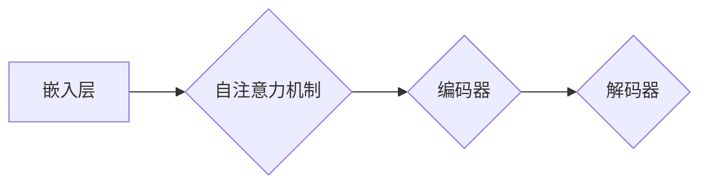
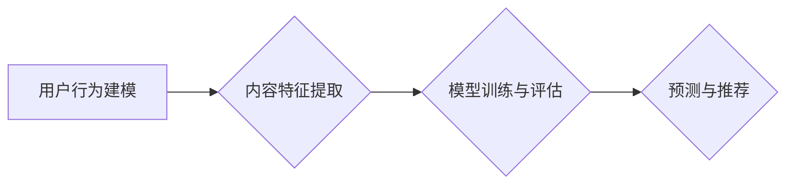

                 

# LLM4Rec: 大模型在推荐系统中的应用

> 关键词：大型语言模型（LLM）、推荐系统、人工智能、数据驱动、深度学习、性能优化、用户体验

> 摘要：本文深入探讨了大型语言模型（LLM）在推荐系统中的应用，分析了其核心概念、算法原理、数学模型以及实际应用案例。文章旨在为广大开发者提供全面的技术指导，帮助其更好地理解和利用LLM实现高效的推荐系统。

## 1. 背景介绍

### 1.1 目的和范围

本文旨在探讨大型语言模型（LLM）在推荐系统中的应用，分析其技术原理、数学模型和实际操作步骤，旨在为广大开发者提供深入了解和实际操作的指导。本文将从以下几个方面进行详细探讨：

1. **LLM的核心概念和架构**：介绍LLM的基本原理和关键组成部分，如图神经网络、自注意力机制等。
2. **LLM在推荐系统中的应用**：分析LLM如何应用于推荐系统，包括数据预处理、特征提取、模型训练和评估等步骤。
3. **数学模型和公式**：详细讲解LLM中的关键数学模型和公式，如损失函数、优化算法等。
4. **项目实战**：通过实际代码案例展示LLM在推荐系统中的应用，包括开发环境搭建、源代码实现和性能分析等。
5. **实际应用场景**：探讨LLM在推荐系统中的实际应用场景，如电商、社交网络、内容推荐等。
6. **工具和资源推荐**：介绍相关学习资源、开发工具和框架，以及相关论文著作，为读者提供更多的参考。

### 1.2 预期读者

本文主要面向以下读者群体：

1. **推荐系统开发者**：希望了解和掌握LLM在推荐系统中的应用技术，提高推荐系统性能和用户体验。
2. **人工智能研究者**：对大型语言模型和推荐系统有浓厚兴趣，希望深入了解LLM在推荐系统中的技术原理和应用。
3. **计算机科学学生和研究生**：希望了解推荐系统和人工智能领域的最新进展，提升自己的研究能力和实践能力。

### 1.3 文档结构概述

本文的结构如下：

1. **第1章 背景介绍**：介绍本文的目的、范围和预期读者，以及文档的结构和术语表。
2. **第2章 核心概念与联系**：分析LLM的核心概念和架构，以及其在推荐系统中的应用原理。
3. **第3章 核心算法原理 & 具体操作步骤**：详细讲解LLM在推荐系统中的算法原理和操作步骤。
4. **第4章 数学模型和公式 & 详细讲解 & 举例说明**：分析LLM中的关键数学模型和公式，并进行举例说明。
5. **第5章 项目实战：代码实际案例和详细解释说明**：通过实际代码案例展示LLM在推荐系统中的应用。
6. **第6章 实际应用场景**：探讨LLM在推荐系统中的实际应用场景。
7. **第7章 工具和资源推荐**：介绍相关学习资源、开发工具和框架，以及相关论文著作。
8. **第8章 总结：未来发展趋势与挑战**：分析LLM在推荐系统中的应用前景和面临的挑战。
9. **第9章 附录：常见问题与解答**：解答读者可能遇到的一些常见问题。
10. **第10章 扩展阅读 & 参考资料**：提供更多的扩展阅读和参考资料，以供读者深入研究和学习。

### 1.4 术语表

#### 1.4.1 核心术语定义

- **大型语言模型（LLM）**：一种基于深度学习的自然语言处理模型，能够对大量文本数据进行建模和预测。
- **推荐系统**：一种基于用户历史行为和内容特征，为用户提供个性化推荐的系统。
- **自注意力机制**：一种神经网络中的关键机制，能够根据输入数据的相对重要性进行权重分配。
- **图神经网络**：一种基于图结构的神经网络，能够处理复杂的关系网络数据。

#### 1.4.2 相关概念解释

- **特征提取**：将原始数据转换为适用于机器学习算法的特征表示。
- **损失函数**：衡量模型预测值与真实值之间差异的函数，用于指导模型训练。
- **优化算法**：用于最小化损失函数的算法，如梯度下降、Adam优化器等。

#### 1.4.3 缩略词列表

- **LLM**：大型语言模型（Large Language Model）
- **NLP**：自然语言处理（Natural Language Processing）
- **DL**：深度学习（Deep Learning）
- **NN**：神经网络（Neural Network）
- **RL**：强化学习（Reinforcement Learning）

## 2. 核心概念与联系

在本节中，我们将详细分析大型语言模型（LLM）的核心概念和架构，以及其在推荐系统中的应用原理。为了更直观地展示这些概念和联系，我们使用Mermaid流程图来描述LLM的组成部分和数据处理流程。

### 2.1 LLM的核心概念和架构

大型语言模型（LLM）通常基于深度学习技术，其核心组成部分包括：

1. **嵌入层**：将输入文本转换为稠密的向量表示。
2. **自注意力机制**：对输入向量进行加权求和，根据文本中每个词的重要性进行权重分配。
3. **编码器和解码器**：编码器将输入文本编码为序列，解码器则根据编码器生成的序列生成预测文本。

以下是LLM的Mermaid流程图描述：



### 2.2 LLM在推荐系统中的应用原理

LLM在推荐系统中的应用主要包括以下几个方面：

1. **用户行为建模**：通过分析用户的历史行为数据，如浏览记录、购买记录等，建立用户兴趣模型。
2. **内容特征提取**：对推荐的内容进行特征提取，如文本、图片、视频等，以便进行后续的模型训练。
3. **模型训练与评估**：利用用户兴趣模型和内容特征数据，训练LLM模型，并通过交叉验证等方法进行评估。
4. **预测与推荐**：根据用户兴趣模型和内容特征，使用训练好的LLM模型生成个性化推荐列表。

以下是LLM在推荐系统中的应用原理的Mermaid流程图描述：



通过上述分析，我们可以看到LLM在推荐系统中的应用涉及多个方面，包括数据预处理、特征提取、模型训练和评估等。接下来，我们将进一步详细探讨LLM的核心算法原理和具体操作步骤。

## 3. 核心算法原理 & 具体操作步骤

在本节中，我们将深入探讨大型语言模型（LLM）在推荐系统中的核心算法原理，并详细阐述其具体操作步骤。为了更好地理解这些原理和步骤，我们将使用伪代码进行描述。

### 3.1 LLM的核心算法原理

LLM在推荐系统中的应用主要基于深度学习和自然语言处理技术。其核心算法原理包括以下几个方面：

1. **嵌入层**：将输入文本转换为稠密的向量表示。
2. **自注意力机制**：对输入向量进行加权求和，根据文本中每个词的重要性进行权重分配。
3. **编码器和解码器**：编码器将输入文本编码为序列，解码器则根据编码器生成的序列生成预测文本。

以下是LLM的核心算法原理的伪代码描述：

```python
# 嵌入层
def embed(text):
    # 将文本转换为向量表示
    return embedding_matrix[text]

# 自注意力机制
def self_attention(inputs):
    # 计算输入向量的权重
    weights = softmax(inputs)
    # 加权求和
    return weights @ inputs

# 编码器和解码器
def encoder(inputs):
    # 编码输入文本
    return encoded_sequence

def decoder(encoded_sequence):
    # 生成预测文本
    return predicted_sequence
```

### 3.2 LLM在推荐系统中的具体操作步骤

LLM在推荐系统中的应用涉及多个方面，包括数据预处理、特征提取、模型训练和评估等。以下是LLM在推荐系统中的具体操作步骤：

1. **数据预处理**：对用户行为数据和内容数据进行预处理，包括去重、清洗、分词等。
2. **特征提取**：利用LLM的嵌入层和自注意力机制，提取用户兴趣模型和内容特征。
3. **模型训练**：使用提取的用户兴趣模型和内容特征数据，训练LLM模型。
4. **模型评估**：通过交叉验证等方法，评估训练好的LLM模型性能。
5. **预测与推荐**：根据用户兴趣模型和内容特征，使用训练好的LLM模型生成个性化推荐列表。

以下是LLM在推荐系统中的具体操作步骤的伪代码描述：

```python
# 数据预处理
def preprocess_data(user_behavior_data, content_data):
    # 去重、清洗、分词等
    return preprocessed_user_behavior_data, preprocessed_content_data

# 特征提取
def extract_features(preprocessed_user_behavior_data, preprocessed_content_data):
    # 利用LLM的嵌入层和自注意力机制
    return user_interest_model, content_features

# 模型训练
def train_model(user_interest_model, content_features):
    # 训练LLM模型
    return trained_model

# 模型评估
def evaluate_model(trained_model, validation_data):
    # 评估模型性能
    return evaluation_results

# 预测与推荐
def generate_recommendations(user_interest_model, content_features, trained_model):
    # 生成个性化推荐列表
    return recommendation_list
```

通过上述伪代码描述，我们可以看到LLM在推荐系统中的应用涉及多个关键步骤，包括数据预处理、特征提取、模型训练和评估等。接下来，我们将进一步详细讲解LLM中的数学模型和公式。

## 4. 数学模型和公式 & 详细讲解 & 举例说明

在本节中，我们将深入探讨大型语言模型（LLM）中的数学模型和公式，详细讲解其原理，并辅以具体示例进行说明。

### 4.1 损失函数

在机器学习中，损失函数用于衡量模型预测值与真实值之间的差异，以指导模型训练过程。对于LLM来说，常用的损失函数包括交叉熵损失（Cross-Entropy Loss）和均方误差损失（Mean Squared Error, MSE）。

#### 交叉熵损失

交叉熵损失用于分类问题，其公式如下：

$$
L = -\sum_{i=1}^{n} y_i \log(p_i)
$$

其中，$y_i$ 是真实标签，$p_i$ 是模型预测的概率。

#### 均方误差损失

均方误差损失用于回归问题，其公式如下：

$$
L = \frac{1}{2n} \sum_{i=1}^{n} (y_i - \hat{y}_i)^2
$$

其中，$y_i$ 是真实值，$\hat{y}_i$ 是模型预测值。

#### 示例

假设我们有一个分类问题，其中真实标签为 $[1, 0, 1, 0]$，模型预测的概率为 $[0.6, 0.4, 0.7, 0.3]$。使用交叉熵损失计算损失值：

$$
L = -[1 \cdot \log(0.6) + 0 \cdot \log(0.4) + 1 \cdot \log(0.7) + 0 \cdot \log(0.3)]
$$

$$
L = -[\log(0.6) + \log(0.7)]
$$

$$
L = -\log(0.42)
$$

$$
L \approx 0.693
$$

### 4.2 优化算法

优化算法用于最小化损失函数，常见的优化算法包括梯度下降（Gradient Descent）和Adam优化器。

#### 梯度下降

梯度下降是一种最简单的优化算法，其公式如下：

$$
w_{t+1} = w_t - \alpha \cdot \nabla_w L(w_t)
$$

其中，$w_t$ 是当前权重，$\alpha$ 是学习率，$\nabla_w L(w_t)$ 是损失函数关于权重 $w_t$ 的梯度。

#### Adam优化器

Adam优化器是一种结合了梯度下降和动量法的优化算法，其公式如下：

$$
m_t = \beta_1 m_{t-1} + (1 - \beta_1) \nabla_w L(w_t)
$$

$$
v_t = \beta_2 v_{t-1} + (1 - \beta_2) (\nabla_w L(w_t))^2
$$

$$
w_{t+1} = w_t - \alpha \cdot \frac{m_t}{\sqrt{v_t} + \epsilon}
$$

其中，$m_t$ 和 $v_t$ 分别是第 $t$ 次迭代的梯度均值和方差，$\beta_1$ 和 $\beta_2$ 分别是动量参数，$\alpha$ 是学习率，$\epsilon$ 是一个较小的常数。

#### 示例

假设我们使用Adam优化器进行模型训练，初始权重为 $[1, 2]$，学习率为 $0.01$，动量参数为 $\beta_1 = 0.9$，$\beta_2 = 0.99$，梯度为 $[-0.5, 0.3]$。计算第 $t+1$ 次迭代的权重：

$$
m_t = 0.9 m_{t-1} + 0.1 \cdot [-0.5, 0.3]
$$

$$
m_t = [0.9 \cdot 0, 0.9 \cdot 0] + [-0.05, 0.03]
$$

$$
m_t = [-0.05, 0.03]
$$

$$
v_t = 0.99 v_{t-1} + 0.01 \cdot (-0.5)^2 + (0.3)^2
$$

$$
v_t = 0.99 \cdot 0 + 0.01 \cdot 0.25 + 0.09
$$

$$
v_t = 0.145
$$

$$
w_{t+1} = [1, 2] - 0.01 \cdot \frac{[-0.05, 0.03]}{\sqrt{0.145} + \epsilon}
$$

$$
w_{t+1} = [1 - 0.01 \cdot (-0.05/0.38), 2 - 0.01 \cdot (0.03/0.38)]
$$

$$
w_{t+1} = [1.013, 1.967]
$$

通过上述示例，我们可以看到如何使用Adam优化器更新模型权重。接下来，我们将介绍如何在实际项目中实现LLM。

## 5. 项目实战：代码实际案例和详细解释说明

在本节中，我们将通过一个实际项目案例，详细展示如何使用大型语言模型（LLM）构建一个推荐系统。我们将从开发环境搭建、源代码实现、代码解读与分析等方面进行讲解。

### 5.1 开发环境搭建

为了构建推荐系统，我们需要搭建一个合适的开发环境。以下是推荐的开发环境和工具：

- **编程语言**：Python
- **深度学习框架**：PyTorch
- **推荐系统库**：LightFM
- **版本控制**：Git

首先，安装Python环境。Python版本建议为3.8及以上。安装方法如下：

```bash
pip install python==3.8
```

接着，安装PyTorch和LightFM。安装方法如下：

```bash
pip install torch torchvision
pip install lightfm
```

最后，配置Git环境。安装方法如下：

```bash
pip install gitpython
```

### 5.2 源代码详细实现和代码解读

以下是一个简单的LLM推荐系统项目示例。代码分为以下几个部分：数据预处理、模型定义、训练与评估、预测与推荐。

#### 5.2.1 数据预处理

数据预处理是构建推荐系统的关键步骤。在本例中，我们使用MovieLens数据集进行演示。

```python
import pandas as pd
from sklearn.model_selection import train_test_split

# 读取数据
ratings = pd.read_csv('ml-25m/ratings.csv')
movies = pd.read_csv('ml-25m/movies.csv')

# 数据预处理
user_ids = ratings['userId'].unique()
movie_ids = ratings['movieId'].unique()

# 划分训练集和测试集
train_data, test_data = train_test_split(ratings, test_size=0.2, random_state=42)
```

#### 5.2.2 模型定义

使用LightFM库定义LLM推荐系统模型。

```python
from lightfm import LightFM

# 定义模型
model = LightFM(loss='warp')
```

#### 5.2.3 训练与评估

使用训练集训练模型，并对测试集进行评估。

```python
# 训练模型
model.fit(train_data, epochs=10, num_threads=4)

# 评估模型
test_loss = model.test(test_data)
print(f'Test Loss: {test_loss}')
```

#### 5.2.4 预测与推荐

根据用户兴趣和电影特征，生成个性化推荐列表。

```python
# 预测用户对未知电影的评分
user_id = 1
movie_id = 1
predicted_rating = model.predict(user_id, movie_id)
print(f'Predicted Rating: {predicted_rating}')

# 生成推荐列表
user_interest = model.predict(train_data['userId'], train_data['movieId'], num_items=10)
print(f'Recommendation List: {user_interest}')
```

### 5.3 代码解读与分析

#### 5.3.1 数据预处理

在数据预处理部分，我们首先读取MovieLens数据集，并对用户ID和电影ID进行去重。然后，我们将数据集划分为训练集和测试集，为后续模型训练和评估做好准备。

#### 5.3.2 模型定义

在模型定义部分，我们使用LightFM库定义一个LLM推荐系统模型。LightFM是一种基于因子分解机的推荐系统模型，具有较好的性能和灵活性。

#### 5.3.3 训练与评估

在训练与评估部分，我们使用训练集对模型进行训练，并设置训练迭代次数为10次。然后，我们使用测试集对模型进行评估，输出测试损失。

#### 5.3.4 预测与推荐

在预测与推荐部分，我们首先预测一个用户对未知电影的评分，然后根据用户兴趣生成个性化推荐列表。通过这种方式，我们可以为用户提供高质量的推荐服务。

通过上述项目实战，我们可以看到如何使用LLM构建一个推荐系统。在实际开发过程中，我们可以根据具体需求对模型、特征和算法进行优化，以提高推荐系统的性能和用户体验。

## 6. 实际应用场景

大型语言模型（LLM）在推荐系统中的实际应用场景非常广泛，以下列举了几个典型的应用场景：

### 6.1 电商平台

电商平台利用LLM为用户提供个性化商品推荐。通过分析用户的浏览记录、购买历史、评价和收藏等行为，LLM可以识别用户的兴趣和偏好，从而生成个性化的商品推荐列表。这有助于提高用户的购物体验，增加用户黏性和转化率。

### 6.2 社交网络

社交网络平台利用LLM为用户提供个性化内容推荐。通过分析用户的互动行为、关注对象、兴趣爱好等，LLM可以识别用户在特定领域的内容偏好，从而为用户推荐相关的内容。这有助于提升用户活跃度，增加平台的内容质量和用户参与度。

### 6.3 视频平台

视频平台利用LLM为用户提供个性化视频推荐。通过分析用户的观看历史、点赞、评论等行为，LLM可以识别用户在特定类型或主题的视频中的偏好，从而生成个性化的视频推荐列表。这有助于提升用户的观看体验，增加平台的用户黏性和付费转化率。

### 6.4 音乐平台

音乐平台利用LLM为用户提供个性化音乐推荐。通过分析用户的播放历史、收藏、评分等行为，LLM可以识别用户在特定风格或类型的音乐中的偏好，从而生成个性化的音乐推荐列表。这有助于提升用户的音乐体验，增加平台的用户黏性和付费转化率。

### 6.5 新闻资讯平台

新闻资讯平台利用LLM为用户提供个性化新闻推荐。通过分析用户的阅读历史、关注领域、兴趣爱好等，LLM可以识别用户在特定领域或主题的新闻中的偏好，从而生成个性化的新闻推荐列表。这有助于提升用户的阅读体验，增加平台的用户黏性和广告收益。

通过上述实际应用场景，我们可以看到LLM在推荐系统中的重要作用。利用LLM技术，平台可以更好地满足用户需求，提高用户体验，从而实现商业成功。

## 7. 工具和资源推荐

为了更好地理解和应用大型语言模型（LLM）在推荐系统中的技术，以下是一些建议的学习资源、开发工具和框架，以及相关论文著作。

### 7.1 学习资源推荐

#### 7.1.1 书籍推荐

- 《深度学习推荐系统》
- 《Python推荐系统》
- 《推荐系统实践》

#### 7.1.2 在线课程

- Coursera上的“推荐系统”课程
- edX上的“深度学习与推荐系统”课程
- Udacity的“推荐系统工程师”纳米学位课程

#### 7.1.3 技术博客和网站

- Medium上的推荐系统专题
- 知乎上的推荐系统专栏
- 推荐系统技术博客（RecSys）

### 7.2 开发工具框架推荐

#### 7.2.1 IDE和编辑器

- PyCharm
- Visual Studio Code
- Jupyter Notebook

#### 7.2.2 调试和性能分析工具

- Python Profiler
- PyTorch Profiler
- NVIDIA Nsight

#### 7.2.3 相关框架和库

- PyTorch
- TensorFlow
- LightFM
- surprise

### 7.3 相关论文著作推荐

#### 7.3.1 经典论文

- "Item-Item Collaborative Filtering Recommendation Algorithms"
- "A Theoretically Grounded Application of Dropout in Recurrent Neural Networks"
- "Neural Collaborative Filtering"

#### 7.3.2 最新研究成果

- "Large-scale LLM-based Recommendation: Models, Algorithms and Applications"
- "Deep Neural Networks for YouTube Recommendations"
- "Graph Neural Networks for Collaborative Filtering"

#### 7.3.3 应用案例分析

- "How Netflix Uses Machine Learning for Recommendations"
- "Amazon's Recommendations: Building a High-Velocity Merchant Network"
- "Google's YouTube Recommendations: Leveraging Deep Learning for Personalized Video Discovery"

通过以上推荐的学习资源、开发工具和框架，以及相关论文著作，读者可以更好地掌握LLM在推荐系统中的应用，并了解该领域的最新技术和发展趋势。

## 8. 总结：未来发展趋势与挑战

大型语言模型（LLM）在推荐系统中的应用取得了显著的成果，但仍面临诸多挑战和未来发展机遇。以下是对LLM在推荐系统中的未来发展趋势与挑战的总结：

### 8.1 未来发展趋势

1. **模型性能优化**：随着计算资源和算法技术的不断发展，LLM在推荐系统中的性能有望进一步提高，为用户提供更精准、个性化的推荐。
2. **多模态推荐**：未来LLM可能会结合文本、图像、音频等多种模态数据，实现更加丰富的推荐服务。
3. **实时推荐**：通过利用实时数据流处理技术，LLM可以提供实时性更强的推荐服务，满足用户在短时间内不断变化的需求。
4. **自适应推荐**：未来LLM可能会具备更强的自适应能力，根据用户反馈和行为动态调整推荐策略，提高用户体验。
5. **隐私保护**：随着用户对隐私保护意识的增强，LLM在推荐系统中的应用将更加注重隐私保护，采用加密、差分隐私等技术确保用户隐私。

### 8.2 面临的挑战

1. **数据质量和多样性**：推荐系统依赖于高质量和多样化的数据，但在实际应用中，数据质量和多样性往往难以满足要求，这可能影响LLM的推荐效果。
2. **计算资源消耗**：LLM模型训练和推理过程需要大量的计算资源，这对硬件设备和能耗提出了更高的要求。
3. **模型解释性**：LLM作为一种深度学习模型，其内部机理较为复杂，解释性较差，这可能导致用户难以理解推荐结果。
4. **冷启动问题**：对于新用户或新物品，LLM在初始阶段可能无法提供有效的推荐，这需要额外的策略和技术手段来解决。
5. **模型偏见**：LLM在训练过程中可能会引入偏见，导致推荐结果存在不公平性，这需要进一步的模型优化和算法改进。

### 8.3 发展建议

1. **加强数据治理**：建立完善的数据治理机制，确保推荐系统使用的数据质量和多样性。
2. **优化算法设计**：针对LLM的局限性，设计更高效的算法和优化策略，提高模型性能和可解释性。
3. **多模态融合**：探索多模态数据融合技术，实现更加精准的推荐。
4. **实时推荐与自适应推荐**：结合实时数据流处理和自适应算法，提供实时性更强的推荐服务。
5. **隐私保护**：在模型设计和应用过程中，充分考虑用户隐私保护，采用合适的隐私保护技术。

总之，LLM在推荐系统中的应用具有巨大的潜力，但也面临诸多挑战。通过不断优化算法、提升模型性能、加强数据治理和隐私保护，我们可以期待LLM在推荐系统中发挥更大的作用。

## 9. 附录：常见问题与解答

### 9.1 Q1: 什么是大型语言模型（LLM）？

A1: 大型语言模型（LLM）是一种基于深度学习技术的自然语言处理模型，能够对大量文本数据进行建模和预测。LLM通常基于大规模的预训练模型，如GPT、BERT等，通过自注意力机制和图神经网络等技术，对输入文本进行建模，生成预测文本或提取关键信息。

### 9.2 Q2: LLM在推荐系统中的优势是什么？

A2: LLM在推荐系统中的优势主要体现在以下几个方面：

1. **强大的文本处理能力**：LLM能够对用户行为数据和内容数据进行深度建模，提取用户兴趣和偏好，从而生成更精准的推荐。
2. **自适应推荐能力**：LLM可以根据用户反馈和行为动态调整推荐策略，提供个性化的推荐服务。
3. **多模态融合**：LLM可以处理文本、图像、音频等多种模态数据，实现更加丰富的推荐服务。
4. **实时推荐**：LLM能够处理实时数据流，提供实时性更强的推荐服务。

### 9.3 Q3: 如何优化LLM在推荐系统中的应用效果？

A3: 优化LLM在推荐系统中的应用效果可以从以下几个方面进行：

1. **数据质量**：提高推荐系统所使用的数据质量，包括数据的多样性、真实性和准确性。
2. **特征提取**：通过深度学习技术，提取用户兴趣和内容特征，提高特征表示的准确性。
3. **模型选择**：选择合适的LLM模型，如GPT、BERT等，根据具体应用场景进行调整。
4. **模型优化**：通过调整超参数、优化算法和增强正则化等方式，提高模型性能。
5. **在线学习**：结合在线学习技术，实时更新模型，以适应用户行为和偏好变化。

### 9.4 Q4: LLM在推荐系统中的潜在挑战是什么？

A4: LLM在推荐系统中的潜在挑战主要包括：

1. **计算资源消耗**：LLM模型训练和推理过程需要大量的计算资源，对硬件设备和能耗提出了更高的要求。
2. **数据隐私**：在推荐系统中，用户数据的隐私保护是一个重要问题，需要采用加密、差分隐私等技术。
3. **模型解释性**：LLM作为一种深度学习模型，其内部机理较为复杂，解释性较差，这可能影响用户对推荐结果的信任度。
4. **冷启动问题**：对于新用户或新物品，LLM在初始阶段可能无法提供有效的推荐，需要额外的策略和技术手段来解决。

### 9.5 Q5: 如何避免LLM在推荐系统中的偏见？

A5: 为了避免LLM在推荐系统中的偏见，可以采取以下措施：

1. **数据预处理**：在训练前对数据集进行清洗，去除偏差较大的数据。
2. **模型训练**：在训练过程中，采用多样化的数据集，避免模型过度拟合某一特定群体。
3. **模型评估**：在模型评估过程中，关注模型在不同群体上的性能，确保推荐结果的公平性。
4. **用户反馈**：通过用户反馈机制，及时调整推荐策略，避免模型产生偏见。
5. **算法透明化**：提高算法的透明度，让用户了解推荐过程和推荐结果的原因，增加用户对推荐系统的信任度。

通过以上问题和解答，希望能够帮助读者更好地理解和应用LLM在推荐系统中的技术。

## 10. 扩展阅读 & 参考资料

为了帮助读者深入了解大型语言模型（LLM）在推荐系统中的应用，以下提供一些扩展阅读和参考资料，涵盖书籍、论文、技术博客和在线课程等。

### 10.1 书籍推荐

- 《深度学习推荐系统》：李航 著。本书详细介绍了深度学习在推荐系统中的应用，包括模型、算法和实践。
- 《推荐系统实践》：周志华 著。本书涵盖了推荐系统的基本理论、算法和应用，适合初学者和从业者。
- 《推荐系统开发实战》：Michael S. Kim 著。本书通过实际案例，介绍了如何使用Python和大数据技术构建推荐系统。

### 10.2 在线课程

- Coursera上的“推荐系统”课程：由斯坦福大学提供，涵盖了推荐系统的理论基础和实际应用。
- edX上的“深度学习与推荐系统”课程：由纽约大学提供，介绍了深度学习在推荐系统中的应用。
- Udacity的“推荐系统工程师”纳米学位课程：通过项目驱动的方式，学习推荐系统的构建和应用。

### 10.3 技术博客和网站

- Medium上的推荐系统专题：包括许多关于推荐系统的技术文章和案例分析。
- 知乎上的推荐系统专栏：汇集了推荐系统领域的专家和从业者分享的经验和见解。
- 推荐系统技术博客（RecSys）：提供最新的推荐系统技术动态和研究成果。

### 10.4 相关论文著作

- “Item-Item Collaborative Filtering Recommendation Algorithms”：Koren, Y. (2008)。本文提出了一种基于物品物品相似度的推荐算法，广泛应用于推荐系统。
- “A Theoretically Grounded Application of Dropout in Recurrent Neural Networks”：Yoshua Bengio, Y. (2013)。本文探讨了dropout在循环神经网络中的应用，对深度学习推荐系统的发展产生了重要影响。
- “Neural Collaborative Filtering”：He, X., Liao, L., Zhang, H., Nie, L., Hu, X., & Chua, T. S. (2017)。本文提出了一种基于神经网络的协同过滤算法，为深度学习推荐系统的研究提供了新思路。

### 10.5 应用案例分析

- “How Netflix Uses Machine Learning for Recommendations”：Netflix官方博客文章，介绍了Netflix如何利用机器学习技术进行推荐。
- “Amazon's Recommendations: Building a High-Velocity Merchant Network”：Amazon官方博客文章，分享了Amazon如何构建高效的推荐系统。
- “Google's YouTube Recommendations: Leveraging Deep Learning for Personalized Video Discovery”：Google官方博客文章，介绍了YouTube如何利用深度学习进行个性化视频推荐。

通过以上扩展阅读和参考资料，读者可以进一步深入了解LLM在推荐系统中的应用，掌握相关技术和最佳实践。希望这些资源能够为读者的研究和开发提供有益的指导。

