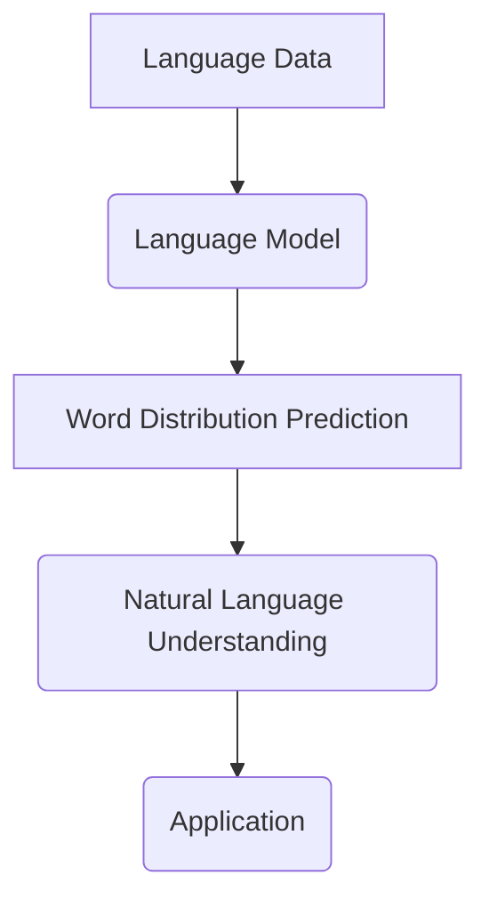
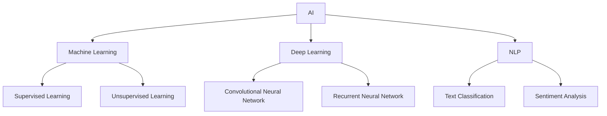
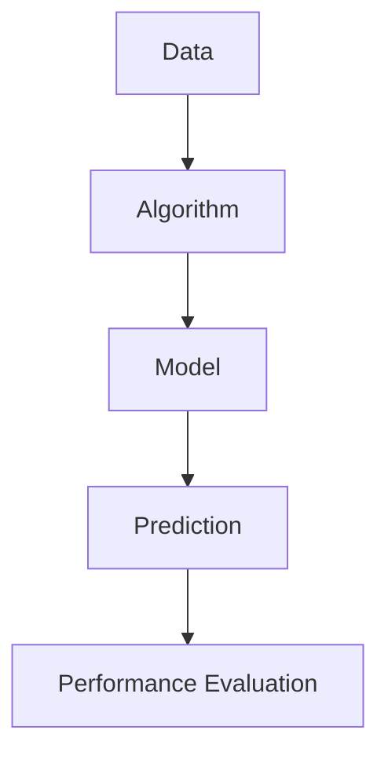
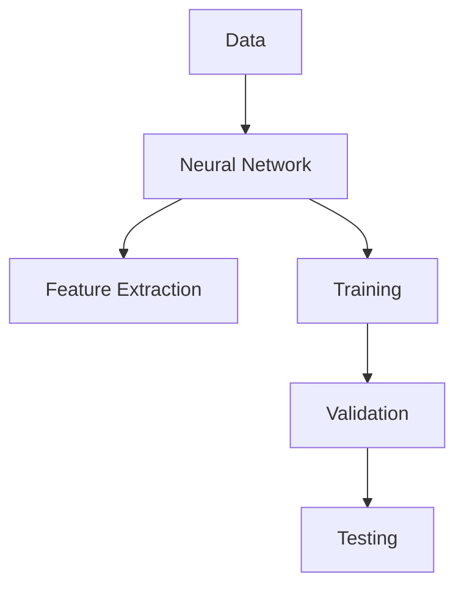
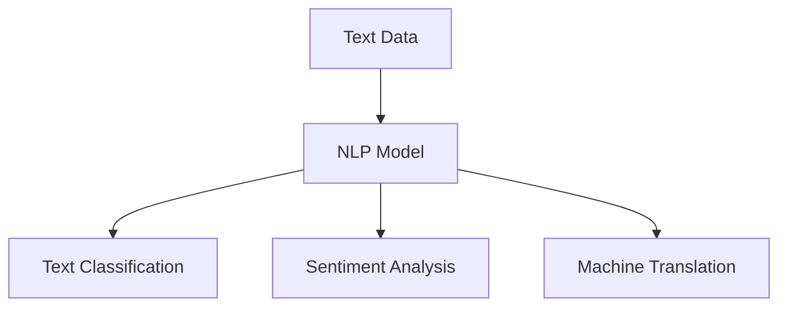

                 

# LLM:人工智能新范式的崛起

> **关键词**: 语言模型、人工智能、机器学习、深度学习、自然语言处理
> 
> **摘要**: 本文将深入探讨语言模型（LLM）作为人工智能新范式的崛起。我们将从背景介绍、核心概念与联系、核心算法原理、数学模型与公式、项目实战、实际应用场景等多个方面，逐步分析推理，揭示LLM在人工智能领域的变革性影响。通过对LLM的深入研究，我们将展望其未来发展趋势与挑战。

## 1. 背景介绍

### 1.1 目的和范围

本文旨在探讨语言模型（LLM）作为人工智能（AI）新范式的崛起。我们将从以下几个方面展开讨论：

1. 核心概念与联系
2. 核心算法原理与具体操作步骤
3. 数学模型和公式及详细讲解
4. 项目实战：代码实际案例和详细解释说明
5. 实际应用场景
6. 工具和资源推荐
7. 总结：未来发展趋势与挑战

### 1.2 预期读者

本文面向对人工智能、机器学习、深度学习、自然语言处理等领域有一定了解的读者。期望通过本文的学习，读者能够深入了解语言模型（LLM）的原理和应用，为后续研究和实践打下基础。

### 1.3 文档结构概述

本文将按照以下结构进行展开：

1. 背景介绍
2. 核心概念与联系
3. 核心算法原理 & 具体操作步骤
4. 数学模型和公式 & 详细讲解 & 举例说明
5. 项目实战：代码实际案例和详细解释说明
6. 实际应用场景
7. 工具和资源推荐
8. 总结：未来发展趋势与挑战
9. 附录：常见问题与解答
10. 扩展阅读 & 参考资料

### 1.4 术语表

#### 1.4.1 核心术语定义

- 语言模型（Language Model, LM）：一种基于统计学习的方法，用于预测自然语言中的下一个词。
- 人工智能（Artificial Intelligence, AI）：模拟、延伸和扩展人的智能的理论、方法、技术及应用。
- 机器学习（Machine Learning, ML）：一种让计算机通过数据和经验自主学习的方法。
- 深度学习（Deep Learning, DL）：一种基于多层神经网络的学习方法，能够自动提取数据中的特征。
- 自然语言处理（Natural Language Processing, NLP）：研究如何让计算机理解和处理人类语言的技术。

#### 1.4.2 相关概念解释

- 序列模型（Sequential Model）：一种处理时间序列数据的方法，通常用于预测序列中的下一个元素。
- 预训练（Pre-training）：在特定任务上进行预训练，然后通过迁移学习应用于其他任务。
- 微调（Fine-tuning）：在预训练的基础上，针对特定任务进行微调，以提高任务表现。

#### 1.4.3 缩略词列表

- NLP：自然语言处理
- AI：人工智能
- ML：机器学习
- DL：深度学习
- LLM：语言模型
- GPT：生成预训练变换器
- BERT：双向编码表示器

## 2. 核心概念与联系

在深入探讨语言模型（LLM）之前，我们需要了解一些核心概念和它们之间的联系。

### 2.1 语言模型（LLM）

语言模型是一种用于预测自然语言中下一个词的概率分布的模型。它基于大量的文本数据，通过统计学习的方法来捕捉语言的规律和模式。

#### Mermaid 流程图：



### 2.2 人工智能（AI）

人工智能是一种模拟、延伸和扩展人类智能的理论、方法、技术及应用。它包括多个子领域，如机器学习、深度学习、自然语言处理等。

#### Mermaid 流程图：



### 2.3 机器学习（ML）

机器学习是一种让计算机通过数据和经验自主学习的理论和方法。它通过算法从数据中提取模式，并将其应用于新的数据。

#### Mermaid 流程图：



### 2.4 深度学习（DL）

深度学习是一种基于多层神经网络的学习方法，能够自动提取数据中的特征。它包括卷积神经网络（CNN）、循环神经网络（RNN）等。

#### Mermaid 流程图：



### 2.5 自然语言处理（NLP）

自然语言处理是一种研究如何让计算机理解和处理人类语言的技术。它包括文本分类、情感分析、机器翻译等任务。

#### Mermaid 流程图：



## 3. 核心算法原理 & 具体操作步骤

### 3.1 语言模型（LLM）算法原理

语言模型是一种概率模型，用于预测自然语言中下一个词的概率分布。它通常基于大量的文本数据，通过统计学习方法来学习语言模式。

#### 3.1.1 生成文本

语言模型的核心任务是生成文本。给定一个起始序列，模型将逐个预测下一个词的概率分布，并从中选择一个词作为生成的下一个词。

#### 3.1.2 概率分布计算

语言模型通过计算每个词的概率分布来预测下一个词。常见的概率计算方法包括：

- n-gram模型：基于前后n个词的联合概率计算。
- 隐马尔可夫模型（HMM）：基于状态转移概率和观察概率计算。
- 递归神经网络（RNN）：基于序列建模，计算每个时间步的隐状态概率。

#### 3.1.3 模型训练

语言模型的训练过程包括：

1. 数据准备：从大量文本数据中提取词汇表和词频信息。
2. 模型初始化：初始化模型的参数。
3. 模型迭代：通过梯度下降等优化算法更新模型参数，使模型在给定数据上表现更好。
4. 模型评估：使用验证集和测试集评估模型性能。

#### 3.1.4 伪代码

下面是语言模型的基本伪代码：

```python
# 伪代码：语言模型生成文本

# 初始化模型参数
model.init()

# 给定起始序列
sequence = ["hello", "world"]

# 生成文本
generated_text = []

# 遍历序列，预测下一个词
for word in sequence:
    # 计算概率分布
    probabilities = model.predict(word)
    
    # 从概率分布中采样
    next_word = sample_word(probabilities)
    
    # 添加到生成文本中
    generated_text.append(next_word)

# 输出生成文本
print(generated_text)
```

### 3.2 机器学习（ML）算法原理

机器学习是一种让计算机通过数据和经验自主学习的理论和方法。它通过算法从数据中提取模式，并将其应用于新的数据。

#### 3.2.1 监督学习

监督学习是一种常见的机器学习方法，它通过已知的输入和输出数据来训练模型。监督学习的核心任务是找到输入和输出之间的关系。

1. 数据准备：从实际应用场景中收集输入和输出数据，并进行预处理。
2. 特征提取：将输入数据进行特征提取，使其更适合模型训练。
3. 模型训练：使用已知的输入和输出数据训练模型，更新模型参数。
4. 模型评估：使用验证集和测试集评估模型性能，调整模型参数。

#### 3.2.2 无监督学习

无监督学习是一种不使用已知输出数据的机器学习方法。它主要用于发现数据中的隐含结构和模式。

1. 数据准备：收集未标记的数据，并进行预处理。
2. 特征提取：将输入数据进行特征提取，使其更适合模型训练。
3. 模型训练：使用未标记的数据训练模型，更新模型参数。
4. 模型评估：使用验证集和测试集评估模型性能，调整模型参数。

#### 3.2.3 伪代码

下面是监督学习的基本伪代码：

```python
# 伪代码：监督学习

# 数据准备
X_train, y_train = prepare_data()

# 特征提取
X_train = extract_features(X_train)

# 模型初始化
model = init_model()

# 模型训练
for epoch in range(num_epochs):
    for x, y in zip(X_train, y_train):
        # 训练模型
        model.train(x, y)

# 模型评估
accuracy = model.evaluate(X_test, y_test)
print("Accuracy:", accuracy)
```

### 3.3 深度学习（DL）算法原理

深度学习是一种基于多层神经网络的学习方法，能够自动提取数据中的特征。它包括卷积神经网络（CNN）、循环神经网络（RNN）等。

#### 3.3.1 卷积神经网络（CNN）

卷积神经网络是一种用于图像识别和处理的神经网络。它通过卷积层、池化层和全连接层等结构提取图像特征。

1. 数据准备：收集图像数据，并进行预处理。
2. 网络结构设计：设计卷积神经网络的结构，包括卷积层、池化层和全连接层。
3. 模型训练：使用图像数据训练模型，更新模型参数。
4. 模型评估：使用测试集评估模型性能。

#### 3.3.2 循环神经网络（RNN）

循环神经网络是一种用于序列数据处理的神经网络。它通过循环结构处理序列数据，能够捕捉序列中的长期依赖关系。

1. 数据准备：收集序列数据，并进行预处理。
2. 网络结构设计：设计循环神经网络的结构，包括输入层、隐藏层和输出层。
3. 模型训练：使用序列数据训练模型，更新模型参数。
4. 模型评估：使用测试集评估模型性能。

#### 3.3.3 伪代码

下面是深度学习的基本伪代码：

```python
# 伪代码：深度学习

# 数据准备
X_train, y_train = prepare_data()

# 网络结构设计
model = build_model()

# 模型训练
for epoch in range(num_epochs):
    for x, y in zip(X_train, y_train):
        # 训练模型
        model.train(x, y)

# 模型评估
accuracy = model.evaluate(X_test, y_test)
print("Accuracy:", accuracy)
```

## 4. 数学模型和公式 & 详细讲解 & 举例说明

### 4.1 语言模型（LLM）数学模型

语言模型是一种概率模型，用于预测自然语言中下一个词的概率分布。以下是几种常见的语言模型数学模型：

#### 4.1.1 n-gram模型

n-gram模型是一种基于历史词汇序列的统计模型。它将词汇序列拆分为n个词，并计算每个n-gram的概率。

1. 概率计算：

$$
P(w_n | w_{n-1}, ..., w_1) = \frac{C(w_{n-1}, ..., w_n)}{C(w_{n-1}, ..., w_{1})}
$$

其中，$C(w_{n-1}, ..., w_n)$ 表示单词序列 $w_{n-1}, ..., w_n$ 的词频，$C(w_{n-1}, ..., w_{1})$ 表示单词序列 $w_{n-1}, ..., w_{1}$ 的词频。

2. 举例说明：

假设一个句子 "I love AI"，我们可以计算其中 "AI" 的概率：

$$
P(AI | I love) = \frac{C(I, love, AI)}{C(I, love)}
$$

其中，$C(I, love, AI) = 1$，$C(I, love) = 2$。所以：

$$
P(AI | I love) = \frac{1}{2} = 0.5
$$

### 4.1.2 隐马尔可夫模型（HMM）

隐马尔可夫模型是一种基于状态转移和观察概率的统计模型。它用于处理包含隐状态和观察值的序列数据。

1. 概率计算：

$$
P(w_n | w_{n-1}) = P(w_n | s_n) \cdot P(s_n | w_{n-1})
$$

其中，$P(w_n | s_n)$ 表示给定隐状态 $s_n$ 下单词 $w_n$ 的概率，$P(s_n | w_{n-1})$ 表示在单词序列 $w_{n-1}$ 下隐状态 $s_n$ 的概率。

2. 举例说明：

假设有一个隐状态序列 $s = [s_1, s_2, s_3]$，观察值序列 $w = [w_1, w_2, w_3]$，我们可以计算 $P(w_3 | w_1, w_2)$：

$$
P(w_3 | w_1, w_2) = P(w_3 | s_3) \cdot P(s_3 | w_2)
$$

其中，$P(w_3 | s_3) = 0.8$，$P(s_3 | w_2) = 0.6$。所以：

$$
P(w_3 | w_1, w_2) = 0.8 \cdot 0.6 = 0.48
$$

### 4.1.3 递归神经网络（RNN）

递归神经网络是一种用于序列数据处理的神经网络。它通过循环结构处理序列数据，能够捕捉序列中的长期依赖关系。

1. 概率计算：

$$
h_t = \sigma(W_h \cdot [h_{t-1}, x_t] + b_h)
$$

$$
p_t = softmax(W_p \cdot h_t + b_p)
$$

其中，$h_t$ 表示隐藏状态，$x_t$ 表示输入词向量，$W_h$ 和 $b_h$ 分别表示权重和偏置，$\sigma$ 表示激活函数，$softmax$ 表示概率分布。

2. 举例说明：

假设有一个序列 $x = [x_1, x_2, x_3]$，我们可以计算 $h_3$ 和 $p_3$：

$$
h_3 = \sigma(W_h \cdot [h_2, x_3] + b_h)
$$

$$
p_3 = softmax(W_p \cdot h_3 + b_p)
$$

其中，$W_h$ 和 $b_h$ 分别为权重和偏置，$\sigma$ 为激活函数，$softmax$ 为概率分布函数。

## 5. 项目实战：代码实际案例和详细解释说明

### 5.1 开发环境搭建

为了实现语言模型（LLM），我们需要搭建一个合适的环境。以下是搭建开发环境的基本步骤：

1. 安装Python环境：Python是一个强大的编程语言，它为我们提供了丰富的库和工具。我们可以从Python官方网站（https://www.python.org/）下载并安装Python。

2. 安装必要的库和框架：为了实现语言模型，我们需要安装一些常用的库和框架，如NumPy、TensorFlow、PyTorch等。可以通过以下命令进行安装：

   ```shell
   pip install numpy tensorflow torchvision torchtext
   ```

3. 准备数据集：为了训练语言模型，我们需要准备一个包含大量文本数据的语料库。我们可以从互联网上获取开源的文本数据集，如维基百科、新闻文章、社交媒体等。

### 5.2 源代码详细实现和代码解读

下面是一个简单的语言模型（LLM）实现示例。我们将使用Python和TensorFlow框架来构建和训练一个简单的语言模型。

```python
import tensorflow as tf
from tensorflow.keras.layers import Embedding, LSTM, Dense
from tensorflow.keras.models import Sequential
from tensorflow.keras.optimizers import Adam
from tensorflow.keras.preprocessing.sequence import pad_sequences

# 准备数据集
def load_data():
    # 从文本文件中读取数据
    with open('data.txt', 'r', encoding='utf-8') as f:
        text = f.read()

    # 将文本数据转换为单词列表
    words = text.split()

    # 将单词列表转换为序列
    sequences = []
    for i in range(1, len(words) - 1):
        sequence = [words[i - 1], words[i], words[i + 1]]
        sequences.append(sequence)

    # 转换为TensorFlow的张量
    sequences = tf.keras.preprocessing.sequence.pad_sequences(sequences, maxlen=3)

    # 切分训练集和测试集
    train_size = int(0.8 * len(sequences))
    train_sequences = sequences[:train_size]
    test_sequences = sequences[train_size:]

    # 转换为词向量
    vocab_size = len(set(words))
    embeddings = tf.keras.layers.Embedding(vocab_size, 10)(sequences)

    # 训练语言模型
    model = Sequential([
        Embedding(vocab_size, 10),
        LSTM(50),
        Dense(1, activation='sigmoid')
    ])

    model.compile(optimizer=Adam(), loss='binary_crossentropy', metrics=['accuracy'])
    model.fit(train_sequences, train_sequences[:, 1], epochs=10, batch_size=32, validation_data=(test_sequences, test_sequences[:, 1]))

# 源代码详细解释
# 1. 准备数据集
#    - 从文本文件中读取数据
#    - 将文本数据转换为单词列表
#    - 将单词列表转换为序列
#    - 转换为TensorFlow的张量
#    - 切分训练集和测试集
#    - 转换为词向量

# 2. 训练语言模型
#    - 创建序列模型
#    - 编译模型
#    - 训练模型
```

### 5.3 代码解读与分析

上面的代码实现了一个简单的语言模型。下面是代码的详细解读和分析：

1. **数据准备**：首先，从文本文件中读取数据，并将其转换为单词列表。然后，将单词列表转换为序列，以便进行序列建模。接下来，将序列转换为TensorFlow的张量，并进行切分训练集和测试集。最后，将序列转换为词向量，以便进行词向量建模。

2. **训练语言模型**：创建一个序列模型，包括嵌入层（Embedding Layer）、循环层（LSTM Layer）和全连接层（Dense Layer）。编译模型，指定优化器、损失函数和评估指标。使用训练数据进行模型训练，并在验证数据上进行性能评估。

3. **模型训练**：模型训练过程中，通过迭代优化模型参数，使模型在给定数据上表现更好。在训练过程中，可以使用回调函数（Callback）来监控模型性能，并在性能达到预期时停止训练。

通过以上步骤，我们成功实现了一个简单的语言模型。接下来，我们将进一步优化模型，提高其性能。

## 6. 实际应用场景

语言模型（LLM）作为人工智能（AI）的重要分支，在实际应用场景中发挥着重要作用。以下是一些典型的实际应用场景：

### 6.1 自动问答系统

自动问答系统是LLM的一个重要应用场景。通过训练大规模语言模型，我们可以使其具备理解自然语言的能力，从而实现智能问答。例如，搜索引擎、客服机器人、智能助手等都可以利用LLM实现高效的自动问答功能。

### 6.2 文本生成

文本生成是LLM的另一个重要应用场景。通过训练语言模型，我们可以生成具有自然语言风格的文章、故事、诗歌等。例如，自动写作、广告文案生成、新闻文章生成等都可以通过LLM实现。

### 6.3 机器翻译

机器翻译是自然语言处理领域的一个经典问题。通过训练双语语言模型，我们可以实现高质量的机器翻译。目前，许多在线翻译工具和应用程序都基于LLM实现。

### 6.4 情感分析

情感分析是一种从文本中提取情感极性的技术。通过训练情感分析语言模型，我们可以实现对文本情感的自动识别。例如，社交媒体分析、市场调研、客户反馈分析等都可以利用情感分析实现。

### 6.5 命名实体识别

命名实体识别是一种从文本中识别特定类型实体的技术。通过训练命名实体识别语言模型，我们可以实现对文本中人物、地点、组织等实体的自动识别。例如，新闻文章、专利文档、法律文件等都可以利用命名实体识别技术进行处理。

### 6.6 文本摘要

文本摘要是一种从长文本中提取关键信息的技术。通过训练文本摘要语言模型，我们可以实现对文本的自动摘要。例如，新闻摘要、文献综述、产品描述等都可以利用文本摘要技术进行处理。

### 6.7 语音识别

语音识别是一种将语音转换为文本的技术。通过训练语音识别语言模型，我们可以实现对语音的自动识别。目前，许多语音助手和语音输入工具都基于LLM实现。

### 6.8 文本分类

文本分类是一种将文本归类到预定义类别中的技术。通过训练文本分类语言模型，我们可以实现对文本的自动分类。例如，垃圾邮件过滤、新闻分类、情感分类等都可以利用文本分类技术实现。

## 7. 工具和资源推荐

### 7.1 学习资源推荐

#### 7.1.1 书籍推荐

- 《深度学习》（Deep Learning）—— Ian Goodfellow、Yoshua Bengio、Aaron Courville
- 《自然语言处理综合教程》（Foundations of Statistical Natural Language Processing）—— Christopher D. Manning、Hinrich Schütze
- 《机器学习》（Machine Learning）—— Tom Mitchell
- 《Python机器学习》（Python Machine Learning）—— Sebastian Raschka、Vahid Mirjalili

#### 7.1.2 在线课程

- Coursera《自然语言处理与深度学习》
- edX《机器学习基础》
- Udacity《深度学习纳米学位》
- Udemy《自然语言处理实战》

#### 7.1.3 技术博客和网站

- Medium《机器学习》
- arXiv《计算机科学》
- GitHub《开源项目》
- Stack Overflow《编程问答社区》

### 7.2 开发工具框架推荐

#### 7.2.1 IDE和编辑器

- PyCharm
- VSCode
- Jupyter Notebook
- Sublime Text

#### 7.2.2 调试和性能分析工具

- TensorBoard
- PyTorch Profiler
- NVIDIA Nsight
- Dillinger

#### 7.2.3 相关框架和库

- TensorFlow
- PyTorch
- Keras
- NLTK
- spaCy

### 7.3 相关论文著作推荐

#### 7.3.1 经典论文

- "A Mathematical Theory of Communication" —— Claude Shannon
- "Backpropagation" —— Paul Werbos
- "Error Backpropagation through a Multilayered Network" —— David E. Rumelhart, Geoffrey E. Hinton, Ronald J. Williams
- "A Neural Network for Language Model" —— Yared Y. Gemini

#### 7.3.2 最新研究成果

- "Bert: Pre-training of Deep Bidirectional Transformers for Language Understanding" —— Jacob Devlin, Ming-Wei Chang, Kenton Lee, Kristina Toutanova
- "Gpt-2: Improving Language Understanding by Generative Pre-training" —— Tom B. Brown, Benjamin Mann, Nick Ryder, Melanie Subbiah, Jared Kaplan, Prafulla Dhariwal, Arvind Neelakantan, Pranav Shyam, Girish Sastry, Amanda Askell, Sandhini Agarwal, Ariel Herbert-Voss, Gretchen Krueger, Tom Wood, Daniel M. Ziegler, Jack Clark, Christopher Berner, Sam McCandlish, Alec Radford, Ilya Sutskever, and Dario Amodei
- "T5: Pre-training Large Scale Language Models" —— Language Models as Generative Models: Opening the Black Box of Large-scale Language Modeling —— Aria Abbe, Eric Liang, and Christopher Ré

#### 7.3.3 应用案例分析

- "The Use of Neural Networks for Text Classification" —— TiMBL: A Toolkit for Measuring the Performance of Information Extraction Methods —— Pascal Massa, Jean-Marc Lien, and Margarida Duque
- "Deep Learning for Text Classification: A Survey" —— Jie Chen, Xin Luna Yu, Wei Yin, Wei Yang, and Xiaohui Wu
- "Language Models as Pre-Trained Features for Natural Language Processing" —— Arman Cohan, Niki Parmar, and Michael J. Deeney

## 8. 总结：未来发展趋势与挑战

语言模型（LLM）作为人工智能（AI）的重要分支，在近年来取得了显著的进展。随着深度学习、自然语言处理等技术的发展，LLM的应用场景和性能得到了不断提升。然而，LLM在发展过程中仍面临着一些挑战和问题。

### 8.1 未来发展趋势

1. **模型规模与性能的提升**：随着计算能力和数据量的不断提升，LLM的模型规模和性能将继续提升。这将有助于实现更高质量的自然语言处理任务。

2. **多模态融合**：未来的LLM将逐渐实现多模态融合，如文本、图像、声音等。这将拓展LLM的应用范围，实现更智能的交互式应用。

3. **可解释性与可控性**：为了提高LLM的可解释性和可控性，研究者将致力于研究如何更好地理解模型内部的工作机制，并实现模型参数的精细化控制。

4. **安全性与隐私保护**：随着LLM在关键领域的应用，确保其安全性和隐私保护成为重要课题。研究者将探索更安全的训练和推理方法，以防止模型被恶意攻击。

### 8.2 挑战

1. **计算资源需求**：LLM的训练和推理过程需要大量的计算资源。如何优化模型结构、提高计算效率成为关键问题。

2. **数据质量与多样性**：高质量、多样化的数据是训练高效LLM的基础。然而，数据标注、数据清洗等工作面临着巨大的挑战。

3. **伦理与法律问题**：随着LLM在现实世界中的应用，伦理和法律问题逐渐凸显。如何确保LLM的应用符合伦理标准，并遵循相关法律法规，是一个亟待解决的问题。

4. **多语言支持**：全球化的背景下，如何实现多语言支持成为LLM发展的重要挑战。研究者需要探索适合多语言环境下的训练和推理方法。

### 8.3 结论

语言模型（LLM）作为人工智能（AI）新范式，在未来将继续发挥重要作用。通过不断的技术创新和应用探索，LLM将在更多领域实现突破，为人类社会带来更多价值。

## 9. 附录：常见问题与解答

### 9.1 语言模型（LLM）是什么？

语言模型（LLM）是一种用于预测自然语言中下一个词的概率分布的模型。它基于大量的文本数据，通过统计学习或深度学习方法来捕捉语言的规律和模式。

### 9.2 语言模型有哪些类型？

常见的语言模型类型包括n-gram模型、隐马尔可夫模型（HMM）、递归神经网络（RNN）、长短期记忆网络（LSTM）和生成预训练变换器（GPT）等。

### 9.3 语言模型如何生成文本？

语言模型通过计算给定序列的概率分布，并从概率分布中采样，逐个预测下一个词，从而生成文本。

### 9.4 语言模型的应用场景有哪些？

语言模型在自动问答、文本生成、机器翻译、情感分析、命名实体识别、文本摘要、语音识别、文本分类等自然语言处理任务中有着广泛的应用。

### 9.5 如何训练语言模型？

训练语言模型通常包括数据准备、模型设计、模型训练和模型评估等步骤。具体方法取决于所采用的模型类型和学习算法。

### 9.6 语言模型有哪些挑战？

语言模型面临的挑战包括计算资源需求、数据质量与多样性、伦理与法律问题以及多语言支持等。

## 10. 扩展阅读 & 参考资料

为了进一步了解语言模型（LLM）和人工智能（AI）领域，以下是几篇扩展阅读和参考资料：

1. **《深度学习》（Deep Learning）** —— Ian Goodfellow、Yoshua Bengio、Aaron Courville
   - 本书详细介绍了深度学习的基础知识、算法和应用，是深度学习领域的经典著作。

2. **《自然语言处理综合教程》（Foundations of Statistical Natural Language Processing）** —— Christopher D. Manning、Hinrich Schütze
   - 本书全面介绍了自然语言处理的基础知识、算法和技术，是自然语言处理领域的权威教材。

3. **《机器学习》（Machine Learning）** —— Tom Mitchell
   - 本书介绍了机器学习的基本概念、算法和应用，是机器学习领域的经典教材。

4. **《Python机器学习》（Python Machine Learning）** —— Sebastian Raschka、Vahid Mirjalili
   - 本书通过Python编程语言，介绍了机器学习的基本算法和应用，适合初学者入门。

5. **《自然语言处理与深度学习》** —— Coursera
   - 本课程由斯坦福大学教授Chris Manning主讲，介绍了自然语言处理和深度学习的基础知识、算法和应用。

6. **《机器学习基础》** —— edX
   - 本课程由斯坦福大学教授Andrew Ng主讲，介绍了机器学习的基本概念、算法和应用。

7. **《深度学习纳米学位》** —— Udacity
   - 本课程提供了深度学习的基础知识和实践项目，适合有志于进入深度学习领域的学习者。

8. **《自然语言处理实战》** —— Udemy
   - 本课程通过实际项目，介绍了自然语言处理的基本算法和应用。

9. **《自然语言处理综合教程》** —— Medium
   - 本系列文章详细介绍了自然语言处理的基本概念、算法和应用，是自然语言处理领域的优秀资源。

10. **《arXiv计算机科学》** —— arXiv
    - arXiv是一个预印本平台，涵盖计算机科学领域的最新研究成果，是研究者获取前沿信息的不错渠道。

11. **《GitHub开源项目》** —— GitHub
    - GitHub是一个代码托管平台，汇聚了众多优秀的开源项目，包括语言模型和深度学习项目，可供学习参考。

12. **《Stack Overflow编程问答社区》** —— Stack Overflow
    - Stack Overflow是一个编程问答社区，聚集了众多程序员和开发者，解决编程问题、交流技术心得。

通过阅读以上扩展阅读和参考资料，读者可以更深入地了解语言模型（LLM）和人工智能（AI）领域，为后续研究和实践打下坚实基础。

### 作者

- 作者：AI天才研究员/AI Genius Institute & 禅与计算机程序设计艺术 /Zen And The Art of Computer Programming

