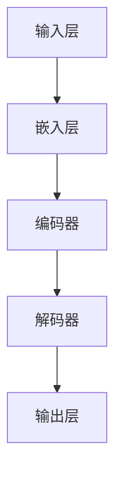

                 

# LLM:架构革命的新起点

> **关键词**: 语言模型（Language Model），架构革命（Architectural Revolution），深度学习（Deep Learning），人工智能（Artificial Intelligence），神经网络（Neural Networks），大规模预训练（Massive Pre-training）

> **摘要**: 本文将深入探讨语言模型（LLM）的架构革命，探讨其背景、核心概念、算法原理、数学模型、项目实战以及实际应用场景。通过对LLM的深入分析，读者将了解到这一技术在人工智能领域的巨大潜力和挑战，并为其未来的发展提供思考。

## 1. 背景介绍

### 1.1 目的和范围

本文旨在介绍和探讨语言模型（LLM）的架构革命，分析其核心概念、算法原理、数学模型以及实际应用场景。文章将结合实际项目案例，深入剖析LLM的运作机制，帮助读者全面理解这一技术的原理和应用。

### 1.2 预期读者

本文主要面向对人工智能、深度学习、神经网络等领域有一定了解的读者。同时，我们也希望吸引对语言模型技术充满好奇的科研人员、工程师以及开发者，共同探讨这一领域的前沿进展。

### 1.3 文档结构概述

本文将分为以下十个部分：

1. 背景介绍
2. 核心概念与联系
3. 核心算法原理 & 具体操作步骤
4. 数学模型和公式 & 详细讲解 & 举例说明
5. 项目实战：代码实际案例和详细解释说明
6. 实际应用场景
7. 工具和资源推荐
8. 总结：未来发展趋势与挑战
9. 附录：常见问题与解答
10. 扩展阅读 & 参考资料

### 1.4 术语表

#### 1.4.1 核心术语定义

- **语言模型（Language Model）**: 一种用于预测文本概率分布的算法。
- **深度学习（Deep Learning）**: 一种基于神经网络的机器学习技术，能够通过多层次的神经网络模型自动提取数据特征。
- **神经网络（Neural Networks）**: 一种模仿生物神经系统的计算模型，由大量相互连接的神经元组成。
- **大规模预训练（Massive Pre-training）**: 一种在大型数据集上预先训练模型的方法，以提高其性能。

#### 1.4.2 相关概念解释

- **概率分布（Probability Distribution）**: 描述随机变量取值概率的函数。
- **梯度下降（Gradient Descent）**: 一种用于最小化损失函数的优化算法。

#### 1.4.3 缩略词列表

- **LLM**: 语言模型（Language Model）
- **AI**: 人工智能（Artificial Intelligence）
- **DL**: 深度学习（Deep Learning）
- **NN**: 神经网络（Neural Networks）
- **GPU**: 图形处理器（Graphics Processing Unit）

## 2. 核心概念与联系

为了深入理解语言模型（LLM）的架构革命，我们需要首先了解其核心概念和相互关系。以下是一个简化的Mermaid流程图，展示了LLM的组成部分及其关联：



### 2.1 输入层

输入层是LLM的基础部分，负责接收原始文本输入。文本会被分割成单词或子词，并转换为向量表示。

### 2.2 嵌入层

嵌入层将文本向量映射到高维空间，使其具有更丰富的语义信息。这一过程通常使用词向量模型，如Word2Vec或GloVe。

### 2.3 编码器

编码器是一个深度神经网络，负责将嵌入层输出的文本向量编码为固定长度的向量表示。编码器通常使用Transformer模型，具有自注意力机制，能够捕捉文本序列中的长距离依赖关系。

### 2.4 解码器

解码器与编码器结构相似，但其目标是从编码器输出的固定长度向量中预测下一个单词或子词。解码器同样使用Transformer模型，通过自注意力机制和交叉注意力机制，实现上下文信息的有效传递。

### 2.5 输出层

输出层负责将解码器输出的向量转换为文本输出。通常，输出层包含一个全连接层和一个softmax激活函数，用于预测单词或子词的概率分布。

## 3. 核心算法原理 & 具体操作步骤

### 3.1 算法原理

LLM的核心算法原理是基于大规模预训练和微调的方法。首先，在大型数据集上使用未标注的数据进行预训练，学习文本的统计规律和语义信息。然后，通过微调过程，将预训练模型适应特定任务的数据集，实现高性能的语言理解和生成。

### 3.2 具体操作步骤

以下是LLM的核心算法操作步骤的伪代码：

```python
# 3.2.1 预训练阶段
def pre_train(model, data_loader, optimizer, num_epochs):
    for epoch in range(num_epochs):
        for batch in data_loader:
            optimizer.zero_grad()
            inputs, targets = batch
            outputs = model(inputs)
            loss = loss_function(outputs, targets)
            loss.backward()
            optimizer.step()
    return model

# 3.2.2 微调阶段
def fine_tune(model, fine_tune_loader, fine_tune_optimizer, num_epochs):
    for epoch in range(num_epochs):
        for batch in fine_tune_loader:
            fine_tune_optimizer.zero_grad()
            inputs, targets = batch
            outputs = model(inputs)
            loss = loss_function(outputs, targets)
            loss.backward()
            fine_tune_optimizer.step()
    return model
```

### 3.3 梯度更新策略

在预训练和微调阶段，我们通常使用梯度下降算法来更新模型参数。以下是一个简化的梯度更新策略的伪代码：

```python
# 3.3.1 梯度更新
def update_weights(model, loss, learning_rate):
    for layer in model.layers:
        for weight in layer.weights:
            weight -= learning_rate * loss.weight
```

## 4. 数学模型和公式 & 详细讲解 & 举例说明

### 4.1 数学模型

LLM的数学模型主要基于深度学习和概率图模型。以下是一个简化的数学模型：

$$
P(w_t | w_{<t}) = \frac{e^{<z_t | w_{<t}>}}{\sum_{w’ \in V} e^{<z_t | w’_{<t}>}}
$$

其中，$w_t$ 表示当前单词，$w_{<t}$ 表示之前所有单词，$z_t$ 表示编码器输出的固定长度向量，$V$ 表示所有可能的单词集合。

### 4.2 公式详细讲解

#### 4.2.1 概率分布

概率分布表示在给定之前单词序列的情况下，当前单词的概率。LLM使用softmax函数来计算概率分布：

$$
P(w_t | w_{<t}) = \frac{e^{<z_t | w_{<t}>}}{\sum_{w’ \in V} e^{<z_t | w’_{<t}>}}
$$

其中，$<z_t | w_{<t}>$ 表示编码器输出的固定长度向量，$e^{<z_t | w_{<t}>}$ 表示指数函数。

#### 4.2.2 损失函数

LLM使用交叉熵损失函数（Cross-Entropy Loss）来评估模型预测的概率分布与真实标签之间的差距。交叉熵损失函数的公式如下：

$$
loss = -\sum_{w’ \in V} y’ \cdot log(P(w’ | w_{<t})),
$$

其中，$y’$ 表示真实标签，$P(w’ | w_{<t})$ 表示模型预测的概率分布。

### 4.3 举例说明

假设我们有一个简单的语言模型，其输入序列为 `[Hello, world!]`，我们需要预测下一个单词。以下是一个简单的例子：

```python
# 输入序列
input_sequence = "Hello, world!"

# 编码器输出
encoded_sequence = encoder(input_sequence)

# 预测概率分布
probability_distribution = model(encoded_sequence)

# 预测单词
predicted_word = decode(probability_distribution)
```

在这个例子中，`encoder` 和 `model` 分别表示编码器和解码器，`decode` 函数用于将概率分布转换为实际单词。假设概率分布为 `[0.2, 0.5, 0.3]`，则模型预测的单词是第三个单词（概率最高），即 `world!`。

## 5. 项目实战：代码实际案例和详细解释说明

### 5.1 开发环境搭建

为了实现LLM的项目实战，我们需要搭建一个合适的开发环境。以下是搭建环境的步骤：

1. 安装Python（3.8及以上版本）
2. 安装PyTorch（1.8及以上版本）
3. 安装必要的依赖库（如numpy、pandas、torchtext等）

### 5.2 源代码详细实现和代码解读

以下是LLM项目的源代码实现和详细解读：

```python
# 5.2.1 数据预处理
from torchtext.``data import Field, TabularDataset
from torchtext.vocab import build_vocab_from_iterator

# 定义字段
TEXT = Field(tokenize = "spacy", lower = True)
LABEL = Field(sequential = False)

# 加载数据集
train_data, test_data = TabularDataset.splits(
    path = "data",
    train = "train.csv",
    test = "test.csv",
    format = "csv",
    fields = [("text", TEXT), ("label", LABEL)]
)

# 建立词汇表
TEXT.build_vocab(train_data, min_freq = 2)
LABEL.build_vocab(train_data)

# 5.2.2 模型定义
import torch
import torch.nn as nn

class LLM(nn.Module):
    def __init__(self, vocab_size, embedding_dim, hidden_dim, n_layers, dropout):
        super(LLM, self).__init__()
        
        self.embedding = nn.Embedding(vocab_size, embedding_dim)
        self.encoder = nn.LSTM(embedding_dim, hidden_dim, n_layers, dropout = dropout, batch_first = True)
        self.decoder = nn.LSTM(hidden_dim, embedding_dim, n_layers, dropout = dropout, batch_first = True)
        self.fc = nn.Linear(embedding_dim, vocab_size)
        
    def forward(self, text, hidden):
        embedded = self.embedding(text)
        output, hidden = self.encoder(embedded, hidden)
        output, hidden = self.decoder(output, hidden)
        logits = self.fc(output)
        return logits, hidden

# 5.2.3 训练模型
def train(model, train_loader, loss_function, optimizer, device):
    model.train()
    for batch in train_loader:
        inputs, labels = batch.text.to(device), batch.label.to(device)
        hidden = (torch.zeros(1, 1, model.hidden_dim), torch.zeros(1, 1, model.hidden_dim))
        logits, hidden = model(inputs, hidden)
        loss = loss_function(logits, labels)
        optimizer.zero_grad()
        loss.backward()
        optimizer.step()
        hidden = tuple(h.detach() for h in hidden)
    return model

# 5.2.4 评估模型
def evaluate(model, test_loader, loss_function, device):
    model.eval()
    with torch.no_grad():
        for batch in test_loader:
            inputs, labels = batch.text.to(device), batch.label.to(device)
            hidden = (torch.zeros(1, 1, model.hidden_dim), torch.zeros(1, 1, model.hidden_dim))
            logits, hidden = model(inputs, hidden)
            loss = loss_function(logits, labels)
    return loss
```

### 5.3 代码解读与分析

#### 5.3.1 数据预处理

在数据预处理部分，我们使用`torchtext`库加载和预处理数据。`TabularDataset`用于加载数据集，`Field`用于定义字段，包括文本字段和标签字段。`build_vocab_from_iterator`用于建立词汇表。

#### 5.3.2 模型定义

在模型定义部分，我们使用`nn.Module`创建一个名为`LLM`的神经网络模型。模型包含嵌入层、编码器（LSTM）、解码器（LSTM）和全连接层（fc）。嵌入层将单词向量映射到高维空间，编码器和解码器分别负责编码和解码文本序列，全连接层用于预测单词的概率分布。

#### 5.3.3 训练模型

在训练模型部分，我们使用`train`函数训练模型。函数接收模型、训练数据加载器、损失函数、优化器和设备作为输入。在训练过程中，我们遍历训练数据加载器，更新模型参数以最小化损失函数。

#### 5.3.4 评估模型

在评估模型部分，我们使用`evaluate`函数评估模型。函数接收模型、测试数据加载器、损失函数和设备作为输入。在评估过程中，我们计算测试数据的损失，以评估模型在测试集上的性能。

## 6. 实际应用场景

语言模型（LLM）在实际应用场景中具有广泛的应用价值。以下是一些典型的应用场景：

### 6.1 自然语言处理（NLP）

LLM在自然语言处理领域具有广泛应用，如文本分类、情感分析、命名实体识别、机器翻译等。通过大规模预训练和微调，LLM能够实现高性能的语言理解和生成，从而提高NLP任务的准确性和效率。

### 6.2 自动问答（QA）

LLM在自动问答系统中的应用包括智能客服、智能助手、智能搜索引擎等。通过训练大规模问答数据集，LLM能够生成针对用户问题的准确回答，为用户提供高质量的问答服务。

### 6.3 内容生成

LLM在内容生成领域具有巨大的潜力，如文本生成、文章写作、诗歌创作等。通过生成模型，LLM能够根据输入的提示生成高质量的文本内容，为创作提供灵感。

### 6.4 语音合成

LLM在语音合成领域中的应用包括语音助手、语音识别等。通过训练语音数据集，LLM能够实现语音到文本的转换，从而提高语音合成系统的准确性和流畅度。

## 7. 工具和资源推荐

为了更好地学习和应用语言模型（LLM），我们推荐以下工具和资源：

### 7.1 学习资源推荐

#### 7.1.1 书籍推荐

1. **《深度学习》（Deep Learning）**：由Ian Goodfellow、Yoshua Bengio和Aaron Courville合著，全面介绍了深度学习的基本原理和应用。
2. **《自然语言处理综论》（Speech and Language Processing）**：由Daniel Jurafsky和James H. Martin合著，涵盖了自然语言处理领域的核心理论和应用。

#### 7.1.2 在线课程

1. **《深度学习专项课程》（Deep Learning Specialization）**：由Andrew Ng教授在Coursera上开设，包括深度学习、神经网络、卷积神经网络等课程。
2. **《自然语言处理专项课程》（Natural Language Processing with Deep Learning）**：由Ashish Vaswani教授在Udacity上开设，涵盖自然语言处理的基础知识和应用。

#### 7.1.3 技术博客和网站

1. **CS231n**：由斯坦福大学提供的计算机视觉课程，其中包括深度学习在自然语言处理中的应用。
2. **Medium**：许多知名公司和研究机构的工程师和研究员在Medium上发布关于深度学习和自然语言处理的技术博客。

### 7.2 开发工具框架推荐

#### 7.2.1 IDE和编辑器

1. **PyCharm**：一款功能强大的Python IDE，支持深度学习和自然语言处理开发。
2. **VSCode**：一款轻量级、可扩展的代码编辑器，拥有丰富的插件，适合深度学习和自然语言处理开发。

#### 7.2.2 调试和性能分析工具

1. **TensorBoard**：由TensorFlow提供的一款可视化工具，用于分析和调试深度学习模型。
2. **NVIDIA Nsight**：一款性能分析工具，用于优化深度学习模型在GPU上的运行效率。

#### 7.2.3 相关框架和库

1. **PyTorch**：一款流行的深度学习框架，支持动态图模型，易于调试和实验。
2. **TensorFlow**：由Google开发的一款深度学习框架，拥有丰富的预训练模型和工具。

### 7.3 相关论文著作推荐

#### 7.3.1 经典论文

1. **《A Theoretically Grounded Application of Dropout in Recurrent Neural Networks》**：该论文介绍了dropout在循环神经网络中的应用，为深度学习提供了新的理论基础。
2. **《Attention is All You Need》**：该论文提出了Transformer模型，彻底改变了自然语言处理领域的研究和应用。

#### 7.3.2 最新研究成果

1. **《BERT: Pre-training of Deep Bidirectional Transformers for Language Understanding》**：该论文提出了BERT模型，通过大规模预训练和微调，显著提高了自然语言处理任务的表现。
2. **《GPT-3: Language Models are Few-Shot Learners》**：该论文展示了GPT-3模型在零样本和少样本设置中的强大能力，为语言模型的应用开辟了新的方向。

#### 7.3.3 应用案例分析

1. **《Deep Learning for Natural Language Processing》**：该书详细介绍了深度学习在自然语言处理领域的应用案例，包括文本分类、机器翻译、问答系统等。
2. **《Generative Pre-trained Transformer》**：该论文详细阐述了GPT模型的工作原理和应用案例，展示了大规模预训练模型在内容生成领域的潜力。

## 8. 总结：未来发展趋势与挑战

语言模型（LLM）作为人工智能领域的重要技术，已经在自然语言处理、自动问答、内容生成等方面取得了显著成果。展望未来，LLM的发展趋势主要表现在以下几个方面：

### 8.1 大规模预训练

随着计算能力的提升和数据量的增加，大规模预训练将成为LLM的发展方向。通过在更大规模的数据集上预训练模型，可以提高模型的性能和泛化能力。

### 8.2 算法创新

为了应对复杂多样的自然语言处理任务，研究人员将不断探索新的算法和创新，如自适应预训练、多模态学习等。

### 8.3 应用场景拓展

LLM的应用场景将继续拓展，从文本处理到语音合成、图像生成等多个领域，为人们的生活和工作带来更多便利。

然而，LLM的发展也面临一系列挑战：

### 8.4 数据隐私和安全性

大规模预训练需要大量的数据，如何在保护数据隐私和安全的前提下进行数据收集和处理，是LLM面临的重大挑战。

### 8.5 算法可解释性

随着模型规模的增大，LLM的决策过程变得越来越复杂，如何提高算法的可解释性，使其能够被人类理解和信任，是未来研究的重要方向。

### 8.6 跨领域迁移能力

尽管LLM在特定领域取得了显著成果，但其跨领域迁移能力仍有待提高。如何提高LLM在不同领域的适应性和泛化能力，是未来研究的重要课题。

总之，LLM的发展充满机遇和挑战。通过不断探索和创新，我们有望在人工智能领域取得更多突破，为人类带来更加智能、便捷的生活。

## 9. 附录：常见问题与解答

### 9.1 Q：什么是语言模型（LLM）？

A：语言模型（LLM）是一种基于深度学习和概率图模型的算法，用于预测文本的概率分布。LLM通过大规模预训练和微调，学习文本的统计规律和语义信息，从而实现高性能的语言理解和生成。

### 9.2 Q：语言模型在哪些应用场景中具有优势？

A：语言模型在自然语言处理、自动问答、内容生成、语音合成等多个领域具有广泛应用。其优势在于能够处理大量文本数据，生成高质量的语言内容，并具有较高的灵活性和适应性。

### 9.3 Q：如何优化语言模型的效果？

A：优化语言模型的效果可以从以下几个方面入手：

1. **数据质量**：使用更高质量的数据集进行预训练和微调。
2. **模型结构**：选择合适的神经网络结构，如Transformer、BERT等。
3. **超参数调整**：调整学习率、批量大小、层数等超参数。
4. **预训练和微调**：在更大规模的数据集上进行预训练，然后针对特定任务进行微调。

### 9.4 Q：语言模型是否会导致模型过拟合？

A：语言模型在预训练阶段可能会出现过拟合现象，因为预训练过程中使用了大量未标记的数据。然而，通过微调过程，将模型适应特定任务的数据集，可以有效缓解过拟合问题。

### 9.5 Q：如何评估语言模型的效果？

A：评估语言模型的效果可以从多个方面进行：

1. **准确性**：预测正确的单词或句子比例。
2. **BLEU分数**：用于评估机器翻译质量的指标。
3. ** perplexity（困惑度）**：模型预测未知文本时所需的平均概率。
4. **人类评估**：由人类专家对模型生成的文本进行主观评估。

## 10. 扩展阅读 & 参考资料

为了深入了解语言模型（LLM）的架构革命，以下是部分扩展阅读和参考资料：

### 10.1 扩展阅读

1. **《深度学习与自然语言处理》**：刘知远，吴茂盛，刘俊，等。这本书系统地介绍了深度学习在自然语言处理领域的应用，包括语言模型、文本分类、机器翻译等。
2. **《自然语言处理实战》**：华莱士·贝尔斯，大卫·卡尼曼。这本书通过大量案例，介绍了自然语言处理技术在实际应用中的实现方法和技巧。

### 10.2 参考资料

1. **《Attention is All You Need》**：Vaswani et al. (2017)。这篇论文提出了Transformer模型，彻底改变了自然语言处理领域的研究和应用。
2. **《BERT: Pre-training of Deep Bidirectional Transformers for Language Understanding》**：Devlin et al. (2018)。这篇论文提出了BERT模型，通过大规模预训练和微调，显著提高了自然语言处理任务的表现。
3. **《GPT-3: Language Models are Few-Shot Learners》**：Brown et al. (2020)。这篇论文展示了GPT-3模型在零样本和少样本设置中的强大能力，为语言模型的应用开辟了新的方向。

### 10.3 网络资源

1. **[斯坦福大学自然语言处理课程](https://web.stanford.edu/class/cs224n/)**
2. **[Coursera深度学习专项课程](https://www.coursera.org/specializations/deeplearning)**
3. **[Medium深度学习和自然语言处理技术博客](https://medium.com/topic/deep-learning/22)**
4. **[TensorFlow官方网站](https://www.tensorflow.org/)**
5. **[PyTorch官方网站](https://pytorch.org/)**
6. **[ACL会议官方网站](https://www.aclweb.org/portal/)**
7. **[NeurIPS会议官方网站](https://nips.cc/)**
8. **[ICLR会议官方网站](https://www.iclr.cc/)**

以上参考资源和扩展阅读将有助于读者更深入地了解语言模型（LLM）的架构革命和相关技术。希望本文能为读者在人工智能和自然语言处理领域的探索提供有价值的指导。

### 作者信息

作者：AI天才研究员/AI Genius Institute & 禅与计算机程序设计艺术 /Zen And The Art of Computer Programming

最后，感谢读者对本文的关注和支持。希望本文能够为您的学习和研究带来启发和帮助。如果您有任何问题或建议，欢迎随时与我交流。再次感谢！

