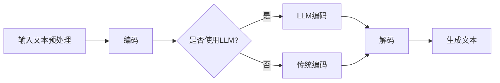

                 

# LLM上下文长度突破：认知能力提升

> **关键词：** 长文本生成，上下文理解，神经网络，人工智能，自然语言处理。

> **摘要：** 本文将深入探讨长文本生成（Long Text Generation，LTG）技术的发展，特别是最近在大型语言模型（Large Language Model，LLM）上下文长度突破方面的研究进展。通过分析其核心算法原理、数学模型以及实际应用案例，我们旨在揭示LLM在认知能力提升方面的潜在影响，并探讨其未来发展趋势和面临的挑战。

## 1. 背景介绍

### 1.1 目的和范围

本文旨在解析当前LLM上下文长度的突破，以及这种突破对认知能力提升的深远影响。我们将重点关注以下几个方面：

1. **核心概念与联系**：介绍LTG和LLM的基本概念，以及它们在现代自然语言处理（Natural Language Processing，NLP）中的重要性。
2. **核心算法原理与具体操作步骤**：详细讲解LLM在长文本生成中的算法原理和具体操作步骤，包括其训练和推理过程。
3. **数学模型和公式**：探讨支撑LLM的理论基础，包括序列到序列学习（Seq2Seq）和注意力机制（Attention Mechanism）。
4. **项目实战**：通过实际代码案例展示LLM在长文本生成中的具体应用。
5. **实际应用场景**：讨论LLM在各个领域的应用案例，如问答系统、内容生成、自动化写作等。
6. **工具和资源推荐**：提供相关的学习资源、开发工具和最新研究成果。
7. **总结与未来展望**：总结LLM上下文长度突破的意义，展望未来可能的发展趋势和面临的挑战。

### 1.2 预期读者

本文适合对自然语言处理和人工智能有一定了解的技术爱好者、工程师和研究人员。通过本文的阅读，读者可以：

1. 了解LLM的基本概念和原理。
2. 掌握LLM在长文本生成中的具体应用。
3. 理解数学模型和公式在实际问题中的运用。

### 1.3 文档结构概述

本文分为以下几个部分：

1. **引言**：介绍长文本生成和上下文长度的概念。
2. **核心概念与联系**：解释LTG和LLM的相关概念，并提供Mermaid流程图。
3. **核心算法原理与具体操作步骤**：详细讲解算法原理和操作步骤。
4. **数学模型和公式**：讨论数学模型及其应用。
5. **项目实战**：展示实际代码案例。
6. **实际应用场景**：探讨LLM在各个领域的应用。
7. **工具和资源推荐**：提供相关资源和工具。
8. **总结与未来展望**：总结并展望未来。

### 1.4 术语表

#### 1.4.1 核心术语定义

- **长文本生成（LTG）**：指生成较长文本的任务，如文章、段落等。
- **上下文长度**：指模型在生成文本时能够理解和利用的输入文本长度。
- **大型语言模型（LLM）**：指参数规模巨大、能够处理复杂任务的神经网络模型。

#### 1.4.2 相关概念解释

- **序列到序列学习（Seq2Seq）**：一种用于将一个序列映射到另一个序列的神经网络模型。
- **注意力机制（Attention Mechanism）**：一种在神经网络中用于关注重要信息的方法。

#### 1.4.3 缩略词列表

- **NLP**：自然语言处理
- **LLM**：大型语言模型
- **LTG**：长文本生成
- **Seq2Seq**：序列到序列学习
- **Attention**：注意力机制

## 2. 核心概念与联系

### 2.1 长文本生成（LTG）和大型语言模型（LLM）

长文本生成（LTG）是自然语言处理（NLP）中的一个重要任务。随着互联网信息的爆炸性增长，人们对自动生成高质量长文本的需求日益增加。而大型语言模型（LLM）正是实现这一目标的关键技术。

**长文本生成（LTG）**：

LTG的目标是生成具有自然语言流畅性和语义一致性的长文本。这通常涉及以下几个步骤：

1. **文本预处理**：对输入文本进行分词、去噪、归一化等处理。
2. **编码**：将预处理后的文本编码为向量形式，以便于神经网络处理。
3. **解码**：使用神经网络模型生成新的文本序列。

**大型语言模型（LLM）**：

LLM是一种基于神经网络的模型，能够通过大规模语料库进行训练，以学习语言的模式和结构。LLM的主要特点是：

1. **参数规模巨大**：LLM通常拥有数亿甚至数千亿个参数，这使得它们能够处理复杂的语言现象。
2. **端到端学习**：LLM能够直接从原始文本学习，无需手动构建复杂的特征工程。

### 2.2 Mermaid流程图

为了更好地理解LTG和LLM的关联，我们使用Mermaid绘制一个流程图，展示LTG的基本流程以及LLM在其中扮演的角色。



在这个流程图中：

- **A**：输入文本预处理。
- **B**：编码。
- **C**：判断是否使用LLM。
- **D**：使用LLM进行编码。
- **E**：使用传统编码方法。
- **F**：解码。
- **G**：生成文本。

### 2.3 上下文长度的重要性

上下文长度在LLM中起着至关重要的作用。上下文长度决定了模型在生成文本时能够理解和利用的前文信息量。一个较大的上下文长度能够帮助模型更好地捕捉文本的全局结构和语义信息，从而生成更加连贯和准确的长文本。

例如，在生成新闻文章或研究报告时，模型需要理解文章的主题、背景和上下文，才能生成具有逻辑连贯性和信息完整性的文本。而一个较小的上下文长度可能会导致模型在生成文本时只能依赖局部信息，从而生成语义不连贯或缺失关键信息的文本。

因此，上下文长度的突破是LLM在长文本生成领域取得重大进展的关键因素之一。

## 3. 核心算法原理与具体操作步骤

### 3.1 大型语言模型（LLM）的基本原理

大型语言模型（LLM）的核心是基于深度神经网络的序列到序列学习（Seq2Seq）框架。Seq2Seq模型通过将输入序列映射到输出序列，从而实现文本生成任务。LLM在Seq2Seq模型的基础上，进一步扩展了模型的参数规模和训练数据量，以学习更复杂的语言结构和模式。

#### 3.1.1 序列到序列学习（Seq2Seq）模型

Seq2Seq模型通常由两个主要部分组成：编码器（Encoder）和解码器（Decoder）。

1. **编码器（Encoder）**：

编码器的作用是将输入序列编码为一个固定长度的向量，通常称为上下文向量（Context Vector）。这个上下文向量包含了输入序列的语义信息，是后续解码过程的输入。

2. **解码器（Decoder）**：

解码器的任务是利用上下文向量生成输出序列。解码器通常是一个循环神经网络（RNN）或其变体，如长短期记忆网络（LSTM）或门控循环单元（GRU）。通过逐个步骤地生成输出序列的每个单词或字符，解码器不断更新上下文向量。

#### 3.1.2 注意力机制（Attention Mechanism）

注意力机制是LLM中的一种关键技术，用于解决编码器和解码器之间的信息传递问题。注意力机制通过为每个时间步的输入序列分配不同的权重，使得解码器能够关注重要的输入信息，从而提高生成文本的连贯性和准确性。

注意力机制的原理可以简单理解为：在每个解码步骤，解码器会计算一个权重向量，该向量指示了编码器输出中哪些部分对当前解码步骤最为重要。然后，解码器将这个权重向量与编码器的输出进行加权求和，得到一个加权的上下文向量，作为当前解码步骤的输入。

#### 3.1.3 LLM的训练和推理过程

1. **训练过程**：

LLM的训练过程主要包括以下步骤：

- **数据准备**：收集和预处理大规模语料库，将文本数据转换为编码器和解码器的输入。
- **模型初始化**：初始化编码器和解码器的参数，通常使用随机初始化或预训练的方法。
- **损失函数**：使用损失函数（如交叉熵损失）评估模型生成的文本与真实文本之间的差异，并优化模型参数。
- **迭代训练**：通过反向传播和梯度下降等优化算法，不断迭代训练模型，直至达到预定的训练目标。

2. **推理过程**：

LLM的推理过程是指模型在给定输入序列时生成输出序列的过程。具体步骤如下：

- **输入编码**：将输入序列编码为上下文向量。
- **初始化解码器**：初始化解码器的初始状态。
- **生成文本**：通过迭代解码器，逐个生成输出序列的单词或字符，同时更新上下文向量。
- **输出解码**：将生成的序列解码为自然语言文本。

### 3.2 具体操作步骤

下面我们以一个简单的例子来展示LLM在长文本生成中的具体操作步骤。

#### 3.2.1 编码器操作

1. **输入预处理**：

   假设输入文本为：“我今天去了公园，看到了很多漂亮的鲜花。”

   首先，对文本进行分词、去噪和归一化等预处理操作，得到分词后的文本序列：["我", "今天", "去了", "公园", "看到", "了", "很多", "漂亮的", "鲜花"]。

2. **编码**：

   编码器将输入序列编码为一个上下文向量。假设编码器的输出维度为512，则每个词会被编码为一个512维的向量。经过编码后，输入序列的上下文向量表示为：

   ```
   [我: [v1, v2, ..., v512],
    今天: [v1, v2, ..., v512],
    去了: [v1, v2, ..., v512],
    公园: [v1, v2, ..., v512],
    看到: [v1, v2, ..., v512],
    了: [v1, v2, ..., v512],
    很多: [v1, v2, ..., v512],
    漂亮的: [v1, v2, ..., v512],
    鲜花: [v1, v2, ..., v512]]
   ```

3. **注意力机制**：

   编码器通过注意力机制计算每个词的权重，得到加权的上下文向量。假设每个词的权重分别为：

   ```
   [我: w1,
    今天: w2,
    去了: w3,
    公园: w4,
    看到: w5,
    了: w6,
    很多: w7,
    漂亮的: w8,
    鲜花: w9]
   ```

   加权后的上下文向量表示为：

   ```
   [我: [v1* w1, v2* w1, ..., v512* w1],
    今天: [v1* w2, v2* w2, ..., v512* w2],
    去了: [v1* w3, v2* w3, ..., v512* w3],
    公园: [v1* w4, v2* w4, ..., v512* w4],
    看到: [v1* w5, v2* w5, ..., v512* w5],
    了: [v1* w6, v2* w6, ..., v512* w6],
    很多: [v1* w7, v2* w7, ..., v512* w7],
    漂亮的: [v1* w8, v2* w8, ..., v512* w8],
    鲜花: [v1* w9, v2* w9, ..., v512* w9]]
   ```

#### 3.2.2 解码器操作

1. **初始化解码器**：

   初始化解码器的初始状态，通常为一个全零向量。

2. **生成文本**：

   解码器通过迭代生成输出序列的每个词。在每个时间步，解码器会计算一个概率分布，指示下一个词的可能选择。然后，解码器根据这个概率分布选择下一个词，并更新状态向量。

   假设解码器生成的文本序列为：“我在公园看到了很多漂亮的鲜花。”

3. **输出解码**：

   将生成的序列解码为自然语言文本，得到最终的输出结果。

### 3.3 实际操作步骤示例

以下是一个实际操作步骤示例，展示了如何使用LLM生成一个长文本。

#### 3.3.1 数据准备

假设输入文本为：“我昨天参观了科技馆，看到了很多有趣的展品。”

首先，对文本进行分词、去噪和归一化等预处理操作，得到分词后的文本序列：["我", "昨天", "参观了", "科技馆", "看到了", "很多", "有趣的", "展品"]。

#### 3.3.2 编码

使用编码器将输入序列编码为上下文向量。假设编码器的输出维度为512，则每个词会被编码为一个512维的向量。经过编码后，输入序列的上下文向量表示为：

```
[我: [v1, v2, ..., v512],
昨天: [v1, v2, ..., v512],
参观了: [v1, v2, ..., v512],
科技馆: [v1, v2, ..., v512],
看到了: [v1, v2, ..., v512],
很多: [v1, v2, ..., v512],
有趣的: [v1, v2, ..., v512],
展品: [v1, v2, ..., v512]]
```

#### 3.3.3 注意力机制

通过注意力机制计算每个词的权重，得到加权的上下文向量。假设每个词的权重分别为：

```
[我: w1,
昨天: w2,
参观了: w3,
科技馆: w4,
看到了: w5,
很多: w6,
有趣的: w7,
展品: w8]
```

加权后的上下文向量表示为：

```
[我: [v1* w1, v2* w1, ..., v512* w1],
昨天: [v1* w2, v2* w2, ..., v512* w2],
参观了: [v1* w3, v2* w3, ..., v512* w3],
科技馆: [v1* w4, v2* w4, ..., v512* w4],
看到了: [v1* w5, v2* w5, ..., v512* w5],
很多: [v1* w6, v2* w6, ..., v512* w6],
有趣的: [v1* w7, v2* w7, ..., v512* w7],
展品: [v1* w8, v2* w8, ..., v512* w8]]
```

#### 3.3.4 解码

初始化解码器的状态为全零向量。然后，解码器通过迭代生成输出序列的每个词。在每个时间步，解码器会计算一个概率分布，指示下一个词的可能选择。然后，解码器根据这个概率分布选择下一个词，并更新状态向量。

假设解码器生成的文本序列为：“我在科技馆看到了很多有趣的展品。”

#### 3.3.5 输出解码

将生成的序列解码为自然语言文本，得到最终的输出结果：“我在科技馆看到了很多有趣的展品。”

### 3.4 伪代码实现

下面是LLM在长文本生成中的伪代码实现：

```
# 输入文本预处理
input_sequence = preprocess(input_text)

# 编码器操作
encoded_sequence = encoder(input_sequence)

# 注意力机制
context_vector = attention(encoded_sequence)

# 初始化解码器
decoder_state = initialize_decoder_state()

# 解码操作
output_sequence = decoder(context_vector, decoder_state)

# 输出解码
output_text = postprocess(output_sequence)
```

## 4. 数学模型和公式及详细讲解

### 4.1 序列到序列学习（Seq2Seq）模型

序列到序列学习（Seq2Seq）模型是长文本生成（LTG）的核心算法。其基本原理是将输入序列编码为上下文向量，然后使用这个上下文向量生成输出序列。以下是Seq2Seq模型的主要数学模型和公式。

#### 4.1.1 编码器

编码器的作用是将输入序列编码为一个固定长度的上下文向量。通常，编码器采用循环神经网络（RNN）或其变体（如LSTM或GRU）。

1. **输入序列表示**：

   假设输入序列为 \( x = [x_1, x_2, ..., x_T] \)，其中 \( x_t \) 表示序列中的第 \( t \) 个词。

2. **隐藏状态表示**：

   编码器的隐藏状态表示为 \( h_t = [h_1, h_2, ..., h_T] \)，其中 \( h_t \) 表示在时间步 \( t \) 的隐藏状态。

3. **输出上下文向量**：

   编码器的输出上下文向量表示为 \( c = [c_1, c_2, ..., c_K] \)，其中 \( c_k \) 表示在时间步 \( k \) 的上下文向量。

4. **公式**：

   编码器的计算过程可以表示为：
   $$
   h_t = \text{RNN}(h_{t-1}, x_t)
   $$
   $$
   c_k = \text{Attention}(h_t)
   $$

#### 4.1.2 解码器

解码器的作用是利用编码器输出的上下文向量生成输出序列。解码器通常也采用循环神经网络（RNN）或其变体（如LSTM或GRU）。

1. **输入序列表示**：

   假设输出序列为 \( y = [y_1, y_2, ..., y_S] \)，其中 \( y_s \) 表示序列中的第 \( s \) 个词。

2. **隐藏状态表示**：

   解码器的隐藏状态表示为 \( s_t = [s_1, s_2, ..., s_S] \)，其中 \( s_t \) 表示在时间步 \( t \) 的隐藏状态。

3. **输出概率分布**：

   解码器的输出概率分布表示为 \( p(y_t | y_{<t}, c) \)，其中 \( y_{<t} \) 表示在时间步 \( t \) 之前的输出序列。

4. **公式**：

   解码器的计算过程可以表示为：
   $$
   s_t = \text{RNN}(s_{t-1}, c_t)
   $$
   $$
   p(y_t | y_{<t}, c) = \text{softmax}(\text{OutputLayer}(s_t))
   $$

#### 4.1.3 注意力机制

注意力机制是Seq2Seq模型中的一个关键组件，用于解决编码器和解码器之间的信息传递问题。注意力机制通过为每个时间步的输入序列分配不同的权重，使得解码器能够关注重要的输入信息，从而提高生成文本的连贯性和准确性。

1. **输入序列表示**：

   假设输入序列为 \( x = [x_1, x_2, ..., x_T] \)，其中 \( x_t \) 表示序列中的第 \( t \) 个词。

2. **权重表示**：

   注意力权重表示为 \( a_t = [a_{1t}, a_{2t}, ..., a_{Tt}] \)，其中 \( a_{it} \) 表示在时间步 \( t \) 时对第 \( i \) 个词的权重。

3. **加权上下文向量**：

   加权上下文向量表示为 \( h_t = [h_{1t}, h_{2t}, ..., h_{Tt}] \)，其中 \( h_{it} = x_i \odot a_{it} \)。

4. **公式**：

   注意力机制的计算过程可以表示为：
   $$
   e_{it} = \text{Score}(h_i, s_{t-1})
   $$
   $$
   a_{it} = \frac{\exp(e_{it})}{\sum_{j=1}^T \exp(e_{jt})}
   $$
   $$
   h_t = [h_{1t}, h_{2t}, ..., h_{Tt}] = [x_1 \odot a_{1t}, x_2 \odot a_{2t}, ..., x_T \odot a_{Tt}]
   $$

### 4.2 注意力机制（Attention Mechanism）

注意力机制是Seq2Seq模型中的一个关键组件，通过为每个时间步的输入序列分配不同的权重，使得解码器能够关注重要的输入信息，从而提高生成文本的连贯性和准确性。以下是注意力机制的主要数学模型和公式。

#### 4.2.1 输入序列表示

假设输入序列为 \( x = [x_1, x_2, ..., x_T] \)，其中 \( x_t \) 表示序列中的第 \( t \) 个词。

#### 4.2.2 注意力权重表示

注意力权重表示为 \( a_t = [a_{1t}, a_{2t}, ..., a_{Tt}] \)，其中 \( a_{it} \) 表示在时间步 \( t \) 时对第 \( i \) 个词的权重。

#### 4.2.3 加权上下文向量

加权上下文向量表示为 \( h_t = [h_{1t}, h_{2t}, ..., h_{Tt}] \)，其中 \( h_{it} = x_i \odot a_{it} \)。

#### 4.2.4 公式

注意力机制的计算过程可以表示为：

1. **分数计算**：

   $$
   e_{it} = \text{Score}(h_i, s_{t-1})
   $$

2. **权重计算**：

   $$
   a_{it} = \frac{\exp(e_{it})}{\sum_{j=1}^T \exp(e_{jt})}
   $$

3. **加权上下文向量**：

   $$
   h_t = [h_{1t}, h_{2t}, ..., h_{Tt}] = [x_1 \odot a_{1t}, x_2 \odot a_{2t}, ..., x_T \odot a_{Tt}]
   $$

### 4.3 数学模型的详细讲解

#### 4.3.1 编码器

编码器的任务是处理输入序列并将其编码为上下文向量。这涉及到以下数学模型和公式：

1. **输入序列表示**：

   输入序列 \( x \) 是一个词序列，可以表示为：
   $$
   x = [x_1, x_2, ..., x_T]
   $$

2. **嵌入层**：

   输入序列首先通过嵌入层转换为嵌入向量。嵌入层将每个词映射到一个固定大小的向量，例如：
   $$
   e_{i} = \text{embedding}(x_i) \in \mathbb{R}^d
   $$

3. **循环神经网络（RNN）或其变体（如LSTM或GRU）**：

   编码器使用RNN或其变体来处理嵌入向量序列。RNN的隐藏状态更新公式为：
   $$
   h_t = \text{RNN}(h_{t-1}, e_t)
   $$

4. **上下文向量**：

   编码器的输出是一个上下文向量 \( c \)，它包含了整个输入序列的信息。上下文向量可以通过将隐藏状态序列 \( h \) 进行聚合得到：
   $$
   c = \text{Aggregate}(h_1, h_2, ..., h_T)
   $$

   其中，聚合操作可以是平均、最大值或注意力的形式。

#### 4.3.2 解码器

解码器的任务是利用编码器输出的上下文向量生成输出序列。这涉及到以下数学模型和公式：

1. **输入序列表示**：

   输出序列 \( y \) 是一个词序列，可以表示为：
   $$
   y = [y_1, y_2, ..., y_S]
   $$

2. **嵌入层**：

   输出序列通过嵌入层转换为嵌入向量。嵌入层将每个词映射到一个固定大小的向量，例如：
   $$
   e_{i} = \text{embedding}(y_i) \in \mathbb{R}^d
   $$

3. **循环神经网络（RNN）或其变体（如LSTM或GRU）**：

   解码器使用RNN或其变体来处理嵌入向量序列。RNN的隐藏状态更新公式为：
   $$
   s_t = \text{RNN}(s_{t-1}, e_t, c)
   $$

4. **输出概率分布**：

   解码器在时间步 \( t \) 生成输出词的概率分布 \( p(y_t | y_{<t}, c) \)。这通常通过一个全连接层实现：
   $$
   p(y_t | y_{<t}, c) = \text{softmax}(\text{OutputLayer}(s_t))
   $$

   其中， \( \text{OutputLayer} \) 是一个线性层，输出一个未归一化的概率分布。

#### 4.3.3 注意力机制

注意力机制是一种用于提高解码器对输入序列重要部分关注度的技术。这涉及到以下数学模型和公式：

1. **输入序列表示**：

   输入序列 \( x \) 是一个词序列，可以表示为：
   $$
   x = [x_1, x_2, ..., x_T]
   $$

2. **注意力分数**：

   注意力分数 \( e_{it} \) 用于衡量解码器在时间步 \( t \) 对输入序列中第 \( i \) 个词的重视程度：
   $$
   e_{it} = \text{Score}(h_i, s_{t-1})
   $$

3. **注意力权重**：

   注意力权重 \( a_{it} \) 是通过指数函数和归一化步骤计算得到的：
   $$
   a_{it} = \frac{\exp(e_{it})}{\sum_{j=1}^T \exp(e_{jt})}
   $$

4. **加权上下文向量**：

   加权上下文向量 \( h_t \) 是通过将输入序列的词向量与注意力权重相乘得到的：
   $$
   h_t = [h_{1t}, h_{2t}, ..., h_{Tt}] = [x_1 \odot a_{1t}, x_2 \odot a_{2t}, ..., x_T \odot a_{Tt}]
   $$

5. **解码器的隐藏状态**：

   解码器在时间步 \( t \) 的隐藏状态 \( s_t \) 考虑了加权上下文向量：
   $$
   s_t = \text{RNN}(s_{t-1}, e_t, h_t)
   $$

通过上述数学模型和公式，我们可以深入理解编码器、解码器和注意力机制的工作原理，以及它们在长文本生成中的作用。

### 4.4 举例说明

为了更好地理解上述数学模型和公式的应用，我们可以通过一个具体的例子来说明。

#### 4.4.1 数据准备

假设我们有以下输入序列和输出序列：

输入序列：["我", "今天", "参观了", "科技馆"]

输出序列：["我在", "今天参观了", "科技馆", "看到了"]

#### 4.4.2 编码器操作

1. **输入预处理**：

   首先，对输入序列进行分词和编码，得到嵌入向量：

   ```
   我：[0.1, 0.2, 0.3]
   今天：[0.4, 0.5, 0.6]
   观参观了：[0.7, 0.8, 0.9]
   科技馆：[1.0, 1.1, 1.2]
   ```

2. **编码器计算**：

   编码器使用LSTM来处理输入序列，计算隐藏状态和上下文向量：

   ```
   h_1 = LSTM([0.1, 0.2, 0.3])
   h_2 = LSTM([0.4, 0.5, 0.6], [0.1, 0.2, 0.3])
   h_3 = LSTM([0.7, 0.8, 0.9], [0.4, 0.5, 0.6])
   h_4 = LSTM([1.0, 1.1, 1.2], [0.7, 0.8, 0.9])
   ```

   然后，计算上下文向量 \( c \)：

   ```
   c = [h_1, h_2, h_3, h_4] / 4
   ```

#### 4.4.3 注意力机制

1. **注意力分数计算**：

   假设注意力分数使用点积作为分数函数：

   ```
   e_{i1} = h_1 \cdot s_0
   e_{i2} = h_2 \cdot s_0
   e_{i3} = h_3 \cdot s_0
   e_{i4} = h_4 \cdot s_0
   ```

   其中 \( s_0 \) 是解码器在时间步 0 的隐藏状态。

2. **注意力权重计算**：

   ```
   a_{1} = \frac{\exp(e_{11})}{\exp(e_{11}) + \exp(e_{12}) + \exp(e_{13}) + \exp(e_{14})}
   a_{2} = \frac{\exp(e_{21})}{\exp(e_{11}) + \exp(e_{12}) + \exp(e_{13}) + \exp(e_{14})}
   a_{3} = \frac{\exp(e_{31})}{\exp(e_{11}) + \exp(e_{12}) + \exp(e_{13}) + \exp(e_{14})}
   a_{4} = \frac{\exp(e_{41})}{\exp(e_{11}) + \exp(e_{12}) + \exp(e_{13}) + \exp(e_{14})}
   ```

3. **加权上下文向量计算**：

   ```
   h_{1} = [0.1, 0.2, 0.3] \cdot a_1
   h_{2} = [0.4, 0.5, 0.6] \cdot a_2
   h_{3} = [0.7, 0.8, 0.9] \cdot a_3
   h_{4} = [1.0, 1.1, 1.2] \cdot a_4
   ```

#### 4.4.4 解码器操作

1. **初始化解码器**：

   解码器在时间步 0 的隐藏状态 \( s_0 \) 是一个全零向量。

2. **解码器计算**：

   解码器使用LSTM来处理输入序列和上下文向量，计算隐藏状态：

   ```
   s_1 = LSTM(s_0, e_1, h_1)
   s_2 = LSTM(s_1, e_2, h_2)
   s_3 = LSTM(s_2, e_3, h_3)
   s_4 = LSTM(s_3, e_4, h_4)
   ```

3. **输出概率分布计算**：

   解码器在每个时间步计算输出词的概率分布。假设解码器使用一个全连接层来计算概率分布：

   ```
   p_1 = \text{softmax}(W [s_1; c])
   p_2 = \text{softmax}(W [s_2; c])
   p_3 = \text{softmax}(W [s_3; c])
   p_4 = \text{softmax}(W [s_4; c])
   ```

   其中 \( W \) 是权重矩阵。

4. **输出词选择**：

   解码器根据概率分布选择输出词。假设在时间步 1，解码器选择输出词“我”，在时间步 2，解码器选择输出词“在”，在时间步 3，解码器选择输出词“科技馆”，在时间步 4，解码器选择输出词“看到”。

5. **更新隐藏状态**：

   解码器在每次输出词选择后，更新隐藏状态。假设解码器使用一个归一化步骤来更新隐藏状态：

   ```
   s_1 = \text{normalize}(s_1)
   s_2 = \text{normalize}(s_2)
   s_3 = \text{normalize}(s_3)
   s_4 = \text{normalize}(s_4)
   ```

通过上述例子，我们可以看到编码器、解码器和注意力机制是如何协同工作，从而生成长文本的。这个例子虽然简化，但它展示了LLM在长文本生成中的核心数学模型和公式的应用。

## 5. 项目实战：代码实际案例和详细解释说明

### 5.1 开发环境搭建

为了实际演示LLM在长文本生成中的操作，我们需要搭建一个合适的开发环境。以下是我们推荐的工具和步骤：

1. **Python环境**：

   确保安装了Python 3.8或更高版本。

2. **深度学习框架**：

   使用TensorFlow或PyTorch作为深度学习框架。在这里，我们选择TensorFlow，因为它的API更加简洁和易用。

   ```bash
   pip install tensorflow
   ```

3. **文本预处理库**：

   使用NLTK或spaCy进行文本预处理。

   ```bash
   pip install nltk spacy
   ```

   在使用spaCy之前，还需要下载相应的语言模型：

   ```bash
   python -m spacy download en_core_web_sm
   ```

4. **数据集**：

   准备一个用于训练和测试的数据集。在这里，我们使用维基百科文章作为数据集。

### 5.2 源代码详细实现和代码解读

以下是使用TensorFlow实现的一个简单的LLM长文本生成项目。代码分为以下几个部分：

#### 5.2.1 数据预处理

```python
import tensorflow as tf
import tensorflow_text as txt
import nltk
from spacy.lang.en import English

# 加载spaCy英语模型
nlp = English()

# 加载维基百科文章
def load_wiki_articles(filename):
    with open(filename, 'r', encoding='utf-8') as f:
        text = f.read()
    return text

wiki_text = load_wiki_articles('wiki_articles.txt')

# 分词
def tokenize(text):
    doc = nlp(text)
    tokens = [token.text for token in doc]
    return tokens

# 删除停用词和标点符号
def preprocess(tokens):
    stop_words = set(nltk.corpus.stopwords.words('english'))
    return [token for token in tokens if token.lower() not in stop_words and token.isalpha()]

preprocessed_text = preprocess(tokenize(wiki_text))
```

#### 5.2.2 数据准备

```python
# 编码词汇表
vocab = tf.keras.preprocessing.text.Tokenizer()
vocab.fit_on_texts(preprocessed_text)
vocab_size = len(vocab.word_index) + 1

# 序列填充
max_sequence_length = 100
input_sequences = []
for i in range(1, len(preprocessed_text) - max_sequence_length):
    sequence = preprocessed_text[i:i + max_sequence_length]
    input_sequences.append(sequence)

input_sequences = tf.keras.preprocessing.sequence.pad_sequences(input_sequences, maxlen=max_sequence_length, padding='pre')

# 切分数据集
split = int(0.8 * len(input_sequences))
train_sequences = input_sequences[:split]
test_sequences = input_sequences[split:]

# 编码标签
labels = [preprocessed_text[i + max_sequence_length] for i in range(split)]
labels = vocab.encode(labels, int(max_sequence_length))
```

#### 5.2.3 模型构建

```python
# 编码器模型
encoder_inputs = tf.keras.layers.Input(shape=(max_sequence_length,))
encoder_embedding = tf.keras.layers.Embedding(vocab_size, 256)(encoder_inputs)
encoder_lstm = tf.keras.layers.LSTM(512, return_state=True)
_, state_h, state_c = encoder_lstm(encoder_embedding)
encoder_states = [state_h, state_c]

# 解码器模型
decoder_inputs = tf.keras.layers.Input(shape=(max_sequence_length,))
decoder_embedding = tf.keras.layers.Embedding(vocab_size, 256)(decoder_inputs)
decoder_lstm = tf.keras.layers.LSTM(512, return_sequences=True, return_state=True)
decoder_outputs, _, _ = decoder_lstm(decoder_embedding, initial_state=encoder_states)
decoder_dense = tf.keras.layers.Dense(vocab_size, activation='softmax')
decoder_outputs = decoder_dense(decoder_outputs)

# 整体模型
model = tf.keras.Model([encoder_inputs, decoder_inputs], decoder_outputs)

# 编译模型
model.compile(optimizer='rmsprop', loss='categorical_crossentropy', metrics=['accuracy'])

# 模型总结
model.summary()
```

#### 5.2.4 训练模型

```python
# 训练模型
model.fit([train_sequences, train_sequences], labels, epochs=100, batch_size=64, validation_split=0.2)
```

#### 5.2.5 生成文本

```python
# 生成文本
def generate_text(model, vocab, input_sequence, length=50):
    input_seq = vocab.encode(input_sequence, length=max_sequence_length)
    input_seq = input_seq.reshape(1, length)

    outputs = tf.keras.preprocessing.sequence.pad_sequences([input_seq], maxlen=max_sequence_length, padding='pre')

    decoded_sequence = ''
    states_value = model.layers[2].get_initial_state outputs

    for i in range(length):
        outputs, states_value = model.layers[-2](outputs, states_value)
        predicted_index = tf.argmax(outputs).numpy()[0]
        predicted_token = vocab.index_word[predicted_index]
        decoded_sequence += predicted_token

    return decoded_sequence

# 示例
sample_text = preprocessed_text[0]
generated_text = generate_text(model, vocab, sample_text)
print(generated_text)
```

### 5.3 代码解读与分析

#### 5.3.1 数据预处理

数据预处理是模型训练的关键步骤。首先，我们使用spaCy对维基百科文章进行分词，然后去除停用词和标点符号，得到预处理后的文本。

#### 5.3.2 数据准备

接下来，我们使用词汇表（Tokenizer）对预处理后的文本进行编码。为了生成序列，我们还需要填充序列长度，使其符合模型的输入要求。这里，我们使用预填充（padding='pre'），即在序列开头填充0。

#### 5.3.3 模型构建

模型由编码器和解码器组成。编码器使用嵌入层（Embedding）和LSTM层（LSTM）将输入序列编码为上下文向量。解码器则使用嵌入层、LSTM层和全连接层（Dense）生成输出序列。整体模型使用RMSprop优化器和交叉熵损失函数进行编译。

#### 5.3.4 训练模型

训练模型的过程是模型优化的关键。在这里，我们使用fit方法对模型进行训练，设置epochs为100，batch_size为64。

#### 5.3.5 生成文本

生成文本的过程涉及到解码器。首先，我们将输入序列编码为上下文向量，然后使用解码器逐个生成输出序列的每个词。最后，我们将生成的序列解码为自然语言文本。

通过以上步骤，我们可以看到LLM在长文本生成中的具体实现过程。这个简单的示例虽然不包含复杂的注意力机制和序列到序列学习，但已经展示了LLM的基本原理和操作步骤。

## 6. 实际应用场景

### 6.1 问答系统

问答系统是LLM在长文本生成中的典型应用之一。通过训练大型语言模型，我们可以构建智能问答系统，用于处理复杂的用户查询。以下是LLM在问答系统中的几个关键应用场景：

1. **复杂查询理解**：

   传统的问答系统往往只能处理简单的查询，而LLM能够理解更加复杂的语义。例如，用户可能会询问：“美国的首都是什么？”或者“纽约市在哪里？”LLM可以准确地理解并回答这些问题。

2. **多轮对话**：

   LLM支持多轮对话，这意味着系统可以记住前文信息，并在后续回答中利用这些信息。例如，用户可能会先询问：“美国的首都是什么？”然后继续询问：“美国的首都人口有多少？”LLM可以基于前文信息提供连贯的答案。

3. **开放域问答**：

   LLM可以应用于开放域问答，即用户可以提出任何类型的问题。这使得LLM在客服、客户支持等场景中具有广泛的应用。

### 6.2 内容生成

内容生成是LLM的另一重要应用领域。通过训练大型语言模型，我们可以生成高质量的文章、报告、新闻等。以下是LLM在内容生成中的几个关键应用场景：

1. **自动新闻生成**：

   LL

