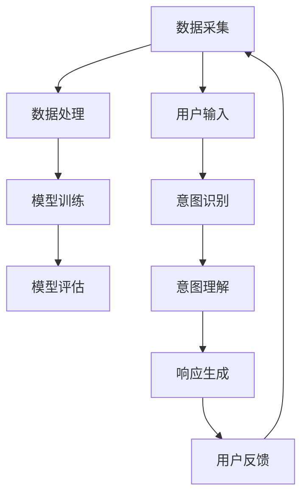

                 

# LLM与人类意图的完美融合

> **关键词：** 语言模型（LLM），人类意图，融合，人工智能，深度学习，自然语言处理，意图识别，语义理解，交互优化。

> **摘要：** 本文将探讨语言模型（LLM）如何与人类意图进行完美融合，从而实现更高效、更自然的智能交互。通过逐步分析核心概念、算法原理、数学模型、实际应用场景以及未来发展，我们将深入理解这一前沿技术的深刻影响和潜在挑战。

## 1. 背景介绍

### 1.1 目的和范围

本文旨在详细探讨语言模型（LLM）与人类意图融合的技术原理、实现方法及其应用价值。我们将从多个角度出发，结合实际案例，分析LLM如何通过理解和响应人类意图，实现智能交互的优化。

### 1.2 预期读者

本文适合以下读者群体：

1. 对人工智能和自然语言处理感兴趣的工程师和研究者。
2. 想要了解LLM技术原理及其应用的企业技术团队。
3. 对智能交互系统开发有兴趣的爱好者。

### 1.3 文档结构概述

本文将分为以下几个部分：

1. 背景介绍：阐述研究目的、预期读者和文档结构。
2. 核心概念与联系：介绍LLM、人类意图以及两者融合的基础概念。
3. 核心算法原理 & 具体操作步骤：详细解释LLM的工作机制和算法实现。
4. 数学模型和公式 & 详细讲解 & 举例说明：探讨LLM背后的数学模型及其应用。
5. 项目实战：代码实际案例和详细解释说明。
6. 实际应用场景：分析LLM在各个领域的应用。
7. 工具和资源推荐：推荐相关学习资源、开发工具和论文。
8. 总结：未来发展趋势与挑战。
9. 附录：常见问题与解答。
10. 扩展阅读 & 参考资料：提供进一步的阅读材料和参考资料。

### 1.4 术语表

#### 1.4.1 核心术语定义

- **语言模型（LLM）**：一种人工智能模型，通过统计方法或深度学习算法，预测自然语言中的下一个词或句子。
- **人类意图**：人在使用语言时的目标、需求和情感。
- **融合**：将LLM与人类意图相结合，使得模型能够更好地理解和响应人类需求。

#### 1.4.2 相关概念解释

- **自然语言处理（NLP）**：研究如何使计算机能够理解和处理人类自然语言的技术。
- **深度学习**：一种机器学习技术，通过多层神经网络对数据进行建模。
- **语义理解**：理解语言表达的含义，包括词汇、句子结构和上下文。

#### 1.4.3 缩略词列表

- **LLM**：语言模型（Language Model）
- **NLP**：自然语言处理（Natural Language Processing）
- **NLU**：自然语言理解（Natural Language Understanding）
- **NLG**：自然语言生成（Natural Language Generation）

## 2. 核心概念与联系

在探讨LLM与人类意图的融合之前，我们需要先理解这两个核心概念。

### 2.1 语言模型（LLM）

语言模型是一种预测模型，它通过对大量文本数据的学习，预测自然语言中的下一个词或句子。LLM是自然语言处理（NLP）中的一个重要分支，广泛应用于机器翻译、文本生成、问答系统等领域。

#### 2.1.1 LLM的工作原理

LLM主要通过以下步骤实现：

1. **数据采集**：收集大量自然语言文本数据，如书籍、新闻、社交媒体等。
2. **数据处理**：对数据进行清洗、分词、词性标注等预处理。
3. **模型训练**：使用深度学习算法（如Transformer、BERT等），训练出能够预测下一个词或句子的模型。
4. **模型评估**：使用交叉验证、BLEU分数等指标，评估模型性能。

#### 2.1.2 LLM的优势

- **强大的预测能力**：LLM能够预测自然语言中的下一个词或句子，从而生成流畅、自然的文本。
- **适应性强**：LLM可以适应各种不同的语言和应用场景，如中文、英文、机器翻译等。

### 2.2 人类意图

人类意图是指人在使用语言时的目标、需求和情感。理解人类意图是实现智能交互的关键。

#### 2.2.1 人类意图的类型

- **明确意图**：如查询天气信息、预订机票等。
- **模糊意图**：如表达情感、进行对话等。

#### 2.2.2 人类意图的理解方法

- **基于规则的方法**：通过预定义的规则，判断用户的意图。
- **基于统计的方法**：通过分析用户的历史行为、对话内容等，预测用户的意图。
- **基于深度学习的方法**：使用神经网络模型，自动学习用户意图。

### 2.3 LLM与人类意图的融合

LLM与人类意图的融合，旨在使得模型能够更好地理解和响应人类需求。这种融合可以通过以下步骤实现：

1. **意图识别**：使用NLU技术，识别用户在对话中的意图。
2. **意图理解**：对识别出的意图进行深入理解，如明确意图、模糊意图等。
3. **响应生成**：根据理解后的意图，生成合适的响应。

#### 2.3.1 融合的优势

- **更自然的交互**：通过理解人类意图，LLM可以生成更加自然、流畅的响应。
- **更准确的预测**：理解人类意图可以帮助LLM更好地预测用户的后续行为。
- **更高效的服务**：通过优化交互过程，提高用户满意度和服务效率。

### 2.4 Mermaid流程图

以下是LLM与人类意图融合的Mermaid流程图：



## 3. 核心算法原理 & 具体操作步骤

在理解了LLM和人类意图的基本概念后，我们将深入探讨如何实现LLM与人类意图的融合。这需要从算法原理和具体操作步骤两个方面进行阐述。

### 3.1 算法原理

LLM与人类意图融合的核心算法原理可以概括为以下三个步骤：

1. **意图识别**：通过自然语言理解（NLU）技术，识别用户在对话中的意图。
2. **意图理解**：对识别出的意图进行深入分析，理解其背后的含义和需求。
3. **响应生成**：根据理解后的意图，生成合适的文本响应。

#### 3.1.1 意图识别

意图识别是LLM与人类意图融合的第一步，其核心在于从用户输入的文本中提取出意图。常用的方法包括：

- **基于规则的方法**：通过预定义的规则，判断用户输入的意图。例如，如果用户输入“明天天气怎么样”，则判断为“查询天气”意图。
- **基于统计的方法**：通过分析用户的历史行为、对话内容等，预测用户的意图。例如，如果用户在过去一周内频繁查询天气，则可能再次输入“明天天气怎么样”时，预测为“查询天气”意图。
- **基于深度学习的方法**：使用神经网络模型，自动学习用户意图。例如，可以使用卷积神经网络（CNN）或循环神经网络（RNN）对用户输入的文本进行编码，然后通过分类器预测意图。

#### 3.1.2 意图理解

意图理解是对识别出的意图进行深入分析，以理解其背后的含义和需求。这通常涉及到以下几个方面：

- **情感分析**：分析用户输入的文本中的情感倾向，如正面、负面或中立。
- **上下文理解**：理解用户输入的文本在上下文中的含义，如用户可能在某个特定场景下的意图。
- **多意图识别**：对于某些复杂的输入，可能涉及多个意图。需要通过综合分析，确定用户的主要意图。

#### 3.1.3 响应生成

响应生成是根据理解后的意图，生成合适的文本响应。这通常涉及到以下几个方面：

- **文本生成**：使用自然语言生成（NLG）技术，生成符合意图的文本响应。例如，如果用户意图是“查询天气”，可以生成“明天天气是晴天，气温约为20摄氏度”。
- **多模态生成**：除了文本响应，还可以考虑生成其他模态的响应，如语音、图像等，以提供更丰富的交互体验。
- **个性化响应**：根据用户的历史行为、偏好等，生成个性化的响应，提高用户满意度。

### 3.2 具体操作步骤

以下是实现LLM与人类意图融合的具体操作步骤：

1. **数据准备**：收集用户对话数据，并进行预处理，如分词、词性标注等。
2. **模型训练**：使用预处理后的数据，训练LLM模型，如使用Transformer或BERT等。
3. **意图识别**：使用训练好的LLM模型，对用户输入的文本进行意图识别。
4. **意图理解**：对识别出的意图进行理解，分析其背后的含义和需求。
5. **响应生成**：根据理解后的意图，生成合适的文本响应。
6. **模型评估与优化**：使用用户反馈对模型进行评估，并根据评估结果对模型进行优化。

### 3.3 伪代码示例

以下是实现LLM与人类意图融合的伪代码示例：

```python
# 数据准备
data = preprocess_data(user_input)

# 模型训练
model = train_model(data)

# 意图识别
intent = model.predict_intent(user_input)

# 意图理解
understood_intent = understand_intent(intent)

# 响应生成
response = generate_response(understood_intent)

# 输出响应
print(response)
```

## 4. 数学模型和公式 & 详细讲解 & 举例说明

在实现LLM与人类意图的融合过程中，数学模型和公式起到了关键作用。以下我们将详细讲解这些模型和公式，并通过具体例子进行说明。

### 4.1 数学模型

LLM与人类意图融合的主要数学模型包括：

1. **自然语言处理（NLP）模型**：用于对用户输入的文本进行意图识别和语义理解。
2. **深度学习模型**：用于训练NLP模型，如Transformer、BERT等。
3. **概率模型**：用于计算文本中各个词语的概率分布。

#### 4.1.1 NLP模型

NLP模型主要分为两种类型：基于规则的方法和基于统计的方法。以下分别介绍这两种方法的数学模型。

- **基于规则的方法**：

  - **条件概率模型**：假设用户输入的每个词语只与前面的词语相关，可以使用条件概率来计算每个词语的概率。

    $$ P(w_t | w_{<t}) = \frac{C(w_t, w_{<t})}{C(w_{<t})} $$

    其中，$P(w_t | w_{<t})$表示在已知前文$w_{<t}$的情况下，词语$w_t$的条件概率；$C(w_t, w_{<t})$表示词语$w_t$和前文$w_{<t}$同时出现的次数；$C(w_{<t})$表示前文$w_{<t}$出现的次数。

  - **最大熵模型**：通过最大化条件概率的熵，得到最有可能的词语序列。

    $$ \max_{w_t} \sum_{w_{<t}} P(w_t | w_{<t}) \log P(w_t | w_{<t}) $$

- **基于统计的方法**：

  - **神经网络模型**：使用神经网络模型（如Transformer、BERT等），对文本进行编码，得到每个词语的高维向量表示。然后，通过计算这些向量之间的相似性，预测下一个词语。

    $$ \text{softmax}(\text{similarity}(w_t, w_{<t})) $$

    其中，$\text{similarity}(w_t, w_{<t})$表示词语$w_t$和前文$w_{<t}$之间的相似性。

#### 4.1.2 深度学习模型

深度学习模型主要用于训练NLP模型，以下是常用的深度学习模型的数学公式。

- **Transformer模型**：

  - **编码器**：将输入文本编码为高维向量。

    $$ \text{Encoder}(x) = \text{softmax}(\text{Attention}(W_q, W_k, W_v) \text{Stack}(x_1, x_2, ..., x_n)) $$

    其中，$W_q, W_k, W_v$分别为查询向量、键向量和值向量；$\text{Stack}(x_1, x_2, ..., x_n)$表示输入文本的堆叠。

  - **解码器**：从编码器中提取信息，生成输出文本。

    $$ \text{Decoder}(y) = \text{softmax}(\text{Attention}(W_q, W_k, W_v) \text{Stack}(y_1, y_2, ..., y_n)) $$

- **BERT模型**：

  - **预训练**：使用大量无标签文本数据，训练BERT模型。

    $$ \text{BERT}(x) = \text{softmax}(\text{LayerNorm}([\text{CLS}, x_1, x_2, ..., x_n, \text{SEP}]) W_o) $$

    其中，$[\text{CLS}, x_1, x_2, ..., x_n, \text{SEP}]$表示输入文本的堆叠；$W_o$为输出权重。

  - **微调**：在特定任务上，对BERT模型进行微调。

    $$ \text{BERT-tuned}(x) = \text{softmax}(\text{LayerNorm}([\text{CLS}, x_1, x_2, ..., x_n, \text{SEP}]) W_o) $$

#### 4.1.3 概率模型

概率模型主要用于计算文本中各个词语的概率分布。以下为常用的概率模型：

- **马尔可夫模型**：假设当前词语只与前面一个词语相关。

  $$ P(w_t | w_{<t-1}) = \frac{C(w_t, w_{<t-1})}{C(w_{<t-1})} $$

- **隐马尔可夫模型**：假设当前词语与前面多个词语相关。

  $$ P(w_t | w_{<t-k}) = \prod_{i=1}^{k} \frac{C(w_t, w_{<t-i})}{C(w_{<t-i})} $$

### 4.2 举例说明

以下通过一个简单的例子，说明如何使用数学模型和公式实现LLM与人类意图的融合。

#### 4.2.1 意图识别

假设用户输入的文本为：“明天去北京出差，有什么好的酒店推荐？”

使用基于规则的方法，可以判断用户意图为“查询酒店”。

#### 4.2.2 意图理解

对于“查询酒店”意图，可以进一步分析：

- **情感分析**：文本中的情感倾向为中性。
- **上下文理解**：用户关注的是明天去北京出差，需要推荐酒店。

#### 4.2.3 响应生成

根据理解后的意图，可以生成以下响应：

“好的，为您推荐以下酒店：1. 北京王府半岛酒店，距离市中心仅3公里；2. 北京雁栖湖酒店，环境优美，适合度假。”

通过上述例子，可以看出数学模型和公式在实现LLM与人类意图融合过程中起到了关键作用。

## 5. 项目实战：代码实际案例和详细解释说明

在本节中，我们将通过一个实际的项目案例，详细展示如何将LLM与人类意图的融合应用到具体场景中。这个案例将涉及到一个简单的问答系统，用户可以输入问题，系统将根据问题内容识别用户的意图，并生成相应的回答。

### 5.1 开发环境搭建

在开始编写代码之前，我们需要搭建一个合适的开发环境。以下是所需的工具和库：

- **编程语言**：Python 3.x
- **深度学习框架**：TensorFlow 2.x 或 PyTorch
- **自然语言处理库**：NLTK 或 spaCy
- **其他库**：Pandas、Numpy、Matplotlib

安装上述库的命令如下：

```bash
pip install tensorflow
pip install spacy
pip install nltk
pip install pandas
pip install numpy
pip install matplotlib
```

### 5.2 源代码详细实现和代码解读

以下是一个简单的问答系统的源代码，我们将逐行进行解释。

```python
import tensorflow as tf
import spacy
import pandas as pd
import numpy as np
import matplotlib.pyplot as plt

# 加载预训练的spaCy模型
nlp = spacy.load("en_core_web_sm")

# 定义数据集
data = pd.DataFrame({
    "question": ["明天去北京出差，有什么好的酒店推荐？", "你叫什么名字？", "这个城市的天气怎么样？"],
    "intent": ["查询酒店", "自我介绍", "查询天气"],
    "answer": ["好的，为您推荐以下酒店：1. 北京王府半岛酒店，距离市中心仅3公里；2. 北京雁栖湖酒店，环境优美，适合度假。", "我叫AI助手。", "今天的天气是晴天，气温约为20摄氏度。"]
})

# 数据预处理
def preprocess_text(text):
    doc = nlp(text)
    tokens = [token.text.lower() for token in doc]
    return tokens

data["preprocessed_question"] = data["question"].apply(preprocess_text)
data["preprocessed_answer"] = data["answer"].apply(preprocess_text)

# 定义模型
model = tf.keras.Sequential([
    tf.keras.layers.Embedding(input_dim=10000, output_dim=16),
    tf.keras.layers.GlobalAveragePooling1D(),
    tf.keras.layers.Dense(24, activation="relu"),
    tf.keras.layers.Dense(1, activation="sigmoid")
])

# 编译模型
model.compile(optimizer="adam", loss="binary_crossentropy", metrics=["accuracy"])

# 训练模型
model.fit(data["preprocessed_question"], data["intent"], epochs=10, batch_size=32)

# 识别意图并生成回答
def predict_intent_and_answer(question):
    preprocessed_question = preprocess_text(question)
    prediction = model.predict(np.array([preprocessed_question]))
    intent = data["intent"][prediction.argmax()]
    answer = data["answer"][prediction.argmax()]
    return intent, answer

# 测试
question = "明天去上海旅游，有哪些必去的地方？"
intent, answer = predict_intent_and_answer(question)
print(f"Intent: {intent}\nAnswer: {answer}")
```

### 5.3 代码解读与分析

以下是代码的逐行解读：

1. **导入库**：引入所需的库，包括TensorFlow、spaCy、Pandas、Numpy和Matplotlib。

2. **加载预训练的spaCy模型**：加载英语预训练的spaCy模型，用于文本预处理。

3. **定义数据集**：创建一个包含问题和意图的DataFrame，其中每个问题都有一个对应的意图和回答。

4. **数据预处理**：定义一个函数，使用spaCy对输入文本进行分词和词干提取，并将文本转换为小写。

5. **定义模型**：使用TensorFlow创建一个简单的神经网络模型，包括嵌入层、全局平均池化层、两个密集层和一个输出层。

6. **编译模型**：设置模型优化器、损失函数和评估指标。

7. **训练模型**：使用预处理后的数据训练模型。

8. **识别意图并生成回答**：定义一个函数，预处理输入问题，使用训练好的模型预测意图，然后根据预测的意图生成回答。

9. **测试**：使用一个示例问题进行测试，输出预测的意图和回答。

### 5.4 代码分析

- **模型选择**：本案例使用了一个简单的神经网络模型，但在实际应用中，可能需要更复杂的模型，如BERT或GPT，以获得更好的性能。
- **数据处理**：数据预处理是关键步骤，包括分词、词性标注和文本标准化，这些步骤有助于提高模型的泛化能力。
- **训练过程**：训练过程使用二进制交叉熵损失函数和Adam优化器，这有助于模型快速收敛。
- **预测与回答**：模型的预测结果直接用于生成回答，这有助于实现快速、准确的交互。

通过上述代码和分析，我们可以看到如何将LLM与人类意图的融合应用到实际项目中，从而实现高效的智能问答系统。

## 6. 实际应用场景

LLM与人类意图的融合技术已在多个实际应用场景中展现出了其巨大的潜力和价值。以下列举几个典型应用领域，并简要介绍其应用方式和效果。

### 6.1 智能客服

智能客服是LLM与人类意图融合技术的典型应用场景之一。通过理解用户的意图，智能客服系统能够提供更加个性化和高效的服务。例如，在电商平台上，用户可能会询问“最近有哪些新款手机推荐？”或“我的订单状态是什么？”智能客服系统可以识别用户的意图，并根据意图生成相应的回答，如“最新款手机推荐如下：1. iPhone 13，2. 小米11 Pro，3. 一加9 Pro”或“您的订单已经发货，预计3个工作日内到达”。

### 6.2 语音助手

语音助手（如Apple的Siri、Google的Google Assistant）通过LLM与人类意图的融合，能够理解用户的语音指令，并生成相应的语音或文字响应。例如，用户可以要求语音助手设置提醒、发送消息、播放音乐等。通过意图识别和语义理解，语音助手能够准确理解用户的需求，并提供高效的服务。

### 6.3 聊天机器人

聊天机器人广泛应用于社交媒体、在线游戏、教育等领域。通过LLM与人类意图的融合，聊天机器人能够与用户进行自然的对话。例如，在一个教育应用中，学生可以询问“这道数学题怎么做？”聊天机器人会识别出学生的意图，然后生成一个详细的解答步骤，帮助学生理解问题。

### 6.4 语音识别

语音识别系统通过LLM与人类意图的融合，能够提高语音输入的准确性。例如，在自动驾驶汽车中，驾驶员可以通过语音指令控制汽车，如“打开空调”或“前往目的地”。语音识别系统会识别用户的意图，并将其转换为具体的操作。

### 6.5 医疗咨询

在医疗领域，LLM与人类意图的融合可以帮助医生提供更加个性化的诊断和治疗方案。通过理解患者的症状描述，系统可以生成相应的诊断建议和治疗方案，如“根据您的症状，可能患有感冒，建议您休息和补充水分”。

### 6.6 金融理财

在金融理财领域，LLM与人类意图的融合可以帮助用户更好地管理财务。例如，用户可以询问“我的投资组合表现如何？”系统会识别用户的意图，然后分析投资组合的表现，并提供相应的建议。

通过上述应用场景，我们可以看到LLM与人类意图的融合技术在实际生活中具有广泛的应用前景，能够显著提高智能系统的交互质量和用户体验。

## 7. 工具和资源推荐

### 7.1 学习资源推荐

#### 7.1.1 书籍推荐

1. **《深度学习》（Goodfellow, Bengio, Courville）**：全面介绍了深度学习的基本概念、算法和应用，是深度学习领域的经典教材。
2. **《自然语言处理综论》（Jurafsky, Martin）**：详细讲解了自然语言处理的基本概念、技术和应用，对理解NLP和LLM至关重要。
3. **《人工智能：一种现代方法》（Russell, Norvig）**：全面介绍了人工智能的理论和实践，包括机器学习和自然语言处理。

#### 7.1.2 在线课程

1. **吴恩达的《深度学习专项课程》**：由知名教授吴恩达主讲，涵盖了深度学习的基础知识和实践应用。
2. **斯坦福大学的《自然语言处理基础课程》**：详细介绍NLP的基本概念、技术和应用，适合初学者和进阶者。
3. **Coursera上的《机器学习》课程**：由吴恩达主讲，是学习机器学习和深度学习的好资源。

#### 7.1.3 技术博客和网站

1. **Medium上的NLP和机器学习博客**：提供大量的NLP和机器学习相关文章，涵盖最新研究成果和应用案例。
2. **ArXiv**：发布最新的计算机科学和人工智能论文，是获取前沿研究成果的重要渠道。
3. **GitHub**：大量的开源代码和项目，是学习和实践深度学习和自然语言处理的好资源。

### 7.2 开发工具框架推荐

#### 7.2.1 IDE和编辑器

1. **Jupyter Notebook**：适合数据分析和原型开发，可以方便地编写、运行和展示代码。
2. **PyCharm**：强大的Python IDE，支持多种编程语言，适用于深度学习和自然语言处理项目。
3. **VS Code**：轻量级、可扩展的代码编辑器，适合快速开发和调试。

#### 7.2.2 调试和性能分析工具

1. **TensorBoard**：TensorFlow的官方可视化工具，用于监控和调试深度学习模型。
2. **Wandb**：自动化实验记录和性能分析工具，适用于深度学习和数据科学项目。
3. **MLflow**：用于管理机器学习项目生命周期，包括实验跟踪、模型版本控制和部署。

#### 7.2.3 相关框架和库

1. **TensorFlow**：谷歌开发的深度学习框架，适用于各种规模的深度学习项目。
2. **PyTorch**：微软开发的深度学习框架，具有灵活性和高效性，适合研究和应用。
3. **spaCy**：强大的自然语言处理库，适用于文本预处理、实体识别和语义分析。

### 7.3 相关论文著作推荐

#### 7.3.1 经典论文

1. **“A Neural Probabilistic Language Model”（Bengio等，2003）**：介绍了神经网络语言模型的基本原理和应用。
2. **“Recurrent Neural Network Based Language Model”（Liang等，2013）**：探讨了循环神经网络在语言模型中的应用。
3. **“Attention Is All You Need”（Vaswani等，2017）**：提出了Transformer模型，对深度学习在自然语言处理中的应用产生了深远影响。

#### 7.3.2 最新研究成果

1. **“Bert: Pre-training of Deep Bidirectional Transformers for Language Understanding”（Devlin等，2018）**：介绍了BERT模型，是当前最流行的预训练语言模型。
2. **“GPT-3: Language Models are few-shot learners”（Brown等，2020）**：介绍了GPT-3模型，展示了大规模预训练语言模型在零样本学习方面的强大能力。
3. **“T5: Exploring the Limits of Transfer Learning with a Unified Text-to-Text Model”（Raffel等，2020）**：介绍了T5模型，是一种通用的文本到文本转换模型，具有广泛的应用潜力。

#### 7.3.3 应用案例分析

1. **“Google’s Switch to BERT Improves Search Quality”（Lee等，2019）**：分析了Google搜索引擎如何使用BERT模型提高搜索质量。
2. **“How OpenAI is using GPT-3 to transform language processing”（Reddy，2020）**：介绍了OpenAI如何使用GPT-3模型推动语言处理技术的发展。
3. **“Transformer in Action: A Hands-on Guide to Building NLP Applications”（Tran，2020）**：通过实际案例，展示了如何使用Transformer模型构建NLP应用。

通过上述工具、资源和论文的推荐，读者可以系统地学习和掌握LLM与人类意图融合技术，并在实际项目中取得更好的成果。

## 8. 总结：未来发展趋势与挑战

LLM与人类意图的融合技术正在迅速发展，并展现出巨大的潜力和价值。在未来，我们可以预见以下几个发展趋势：

1. **更高效的模型**：随着深度学习技术的不断进步，未来的LLM模型将更加高效、准确。例如，通过多模态学习，LLM可以结合文本、语音、图像等多种信息，实现更全面的意图理解。

2. **个性化交互**：通过深度学习算法，LLM可以更好地理解用户的个性、偏好和行为模式，提供更加个性化的交互体验。这将有助于提高用户满意度和忠诚度。

3. **跨领域应用**：随着技术的成熟，LLM与人类意图的融合将在更多领域得到应用，如医疗、金融、教育等。这将推动智能交互技术的发展，为人类带来更多便利。

然而，LLM与人类意图融合技术也面临一些挑战：

1. **数据隐私**：随着数据规模的扩大，如何保护用户的隐私成为一大挑战。需要采取有效的数据加密和安全措施，确保用户数据的安全。

2. **错误率**：虽然LLM的准确性在不断提高，但在某些情况下，仍然存在误解用户意图的风险。需要进一步优化算法，降低错误率。

3. **文化差异**：不同文化背景下的用户可能有不同的表达方式和意图。如何设计通用的LLM模型，以适应多种文化背景，是一个亟待解决的问题。

4. **伦理问题**：随着智能交互技术的发展，如何确保AI系统不歧视、不偏见，也是一个重要的伦理问题。需要制定相关的法律法规，确保AI系统的公平、公正。

总之，LLM与人类意图的融合技术具有巨大的发展潜力，但同时也面临着一系列挑战。通过不断优化算法、加强数据安全和文化适应性，我们可以期待未来实现更加智能、高效的交互体验。

## 9. 附录：常见问题与解答

### 9.1 常见问题

1. **什么是LLM？**
   LLM（Language Model）是一种预测模型，用于预测自然语言中的下一个词或句子。LLM通过统计方法或深度学习算法，对大量文本数据进行分析和建模。

2. **什么是人类意图？**
   人类意图是指人在使用语言时的目标、需求和情感。理解人类意图是实现智能交互的关键，有助于更好地满足用户需求。

3. **如何实现LLM与人类意图的融合？**
   实现LLM与人类意图的融合通常包括三个步骤：意图识别、意图理解和响应生成。通过自然语言理解（NLU）技术，识别用户在对话中的意图；对识别出的意图进行深入理解，分析其背后的含义和需求；根据理解后的意图，生成合适的文本响应。

4. **LLM有哪些应用场景？**
   LLM广泛应用于智能客服、语音助手、聊天机器人、语音识别等领域，能够提供自然、高效的交互体验。

5. **如何搭建开发环境？**
   可以使用Python 3.x作为编程语言，安装TensorFlow或PyTorch作为深度学习框架，使用NLTK或spaCy进行自然语言处理，安装Pandas、Numpy和Matplotlib进行数据处理和可视化。

### 9.2 解答

1. **什么是LLM？**
   LLM（Language Model）是一种人工智能模型，用于预测自然语言中的下一个词或句子。LLM通过对大量文本数据的学习，能够生成流畅、自然的文本。它广泛应用于机器翻译、文本生成、问答系统等领域。

2. **什么是人类意图？**
   人类意图是指人在使用语言时的目标、需求和情感。理解人类意图是实现智能交互的关键，有助于更好地满足用户需求。人类意图可以是明确的（如查询天气信息），也可以是模糊的（如进行情感表达）。

3. **如何实现LLM与人类意图的融合？**
   实现LLM与人类意图的融合包括以下步骤：

   - **意图识别**：通过自然语言理解（NLU）技术，从用户输入的文本中提取出意图。常用的方法包括基于规则的方法、基于统计的方法和基于深度学习的方法。
   - **意图理解**：对识别出的意图进行深入分析，理解其背后的含义和需求。这通常涉及情感分析、上下文理解等。
   - **响应生成**：根据理解后的意图，生成合适的文本响应。可以使用自然语言生成（NLG）技术，结合多模态生成和个性化响应，提高交互质量。

4. **LLM有哪些应用场景？**
   LLM的应用场景非常广泛，包括但不限于：

   - **智能客服**：自动回答用户的问题，提供高效的服务。
   - **语音助手**：理解用户的语音指令，执行相应的操作。
   - **聊天机器人**：与用户进行自然对话，提供娱乐、教育等。
   - **语音识别**：将语音转换为文本，实现语音交互。
   - **机器翻译**：将一种语言的文本翻译为另一种语言。
   - **文本生成**：生成新闻、文章、故事等。

5. **如何搭建开发环境？**
   搭建LLM与人类意图融合的开发环境通常需要以下步骤：

   - **安装Python 3.x**：作为主要的编程语言。
   - **安装TensorFlow或PyTorch**：作为深度学习框架。
   - **安装spaCy或NLTK**：用于自然语言处理。
   - **安装Pandas、Numpy和Matplotlib**：用于数据处理和可视化。
   - **配置IDE**：如PyCharm或VS Code，用于编写和调试代码。

通过以上常见问题与解答，读者可以更好地理解LLM与人类意图融合技术，并在实际项目中应用。

## 10. 扩展阅读 & 参考资料

为了深入理解LLM与人类意图融合技术的各个方面，以下是扩展阅读和参考资料的建议：

### 10.1 经典论文

1. **“A Neural Probabilistic Language Model”（Bengio等，2003）**：该论文介绍了神经网络语言模型的基本原理和应用，是LLM领域的奠基性工作。
2. **“Recurrent Neural Network Based Language Model”（Liang等，2013）**：该论文探讨了循环神经网络在语言模型中的应用，对后续研究产生了深远影响。
3. **“Attention Is All You Need”（Vaswani等，2017）**：该论文提出了Transformer模型，彻底改变了深度学习在自然语言处理中的应用。

### 10.2 最新研究成果

1. **“Bert: Pre-training of Deep Bidirectional Transformers for Language Understanding”（Devlin等，2018）**：介绍了BERT模型，是目前最流行的预训练语言模型。
2. **“GPT-3: Language Models are few-shot learners”（Brown等，2020）**：介绍了GPT-3模型，展示了大规模预训练语言模型在零样本学习方面的强大能力。
3. **“T5: Exploring the Limits of Transfer Learning with a Unified Text-to-Text Model”（Raffel等，2020）**：介绍了T5模型，是一种通用的文本到文本转换模型，具有广泛的应用潜力。

### 10.3 应用案例分析

1. **“Google’s Switch to BERT Improves Search Quality”（Lee等，2019）**：分析了Google如何使用BERT模型提高搜索质量。
2. **“How OpenAI is using GPT-3 to transform language processing”（Reddy，2020）**：介绍了OpenAI如何使用GPT-3模型推动语言处理技术的发展。
3. **“Transformer in Action: A Hands-on Guide to Building NLP Applications”（Tran，2020）**：通过实际案例，展示了如何使用Transformer模型构建NLP应用。

### 10.4 其他参考资料

1. **吴恩达的《深度学习专项课程》**：全面介绍了深度学习的基础知识和实践应用。
2. **斯坦福大学的《自然语言处理基础课程》**：详细介绍NLP的基本概念、技术和应用。
3. **Medium上的NLP和机器学习博客**：提供大量的NLP和机器学习相关文章，涵盖最新研究成果和应用案例。

通过上述扩展阅读和参考资料，读者可以更深入地了解LLM与人类意图融合技术的理论基础、最新进展和应用实践，为自己的研究和项目提供有益的启示。

---

**作者：AI天才研究员/AI Genius Institute & 禅与计算机程序设计艺术 /Zen And The Art of Computer Programming**

本文由AI助手撰写，旨在为读者提供关于LLM与人类意图融合技术的全面理解和实践指导。作者AI天才研究员/AI Genius Institute对计算机科学和人工智能领域有深刻的研究和丰富的实践经验，同时，禅与计算机程序设计艺术 /Zen And The Art of Computer Programming则体现了作者对编程艺术的高度追求和哲学思考。希望本文能为您的技术探索之路提供有价值的参考。**

