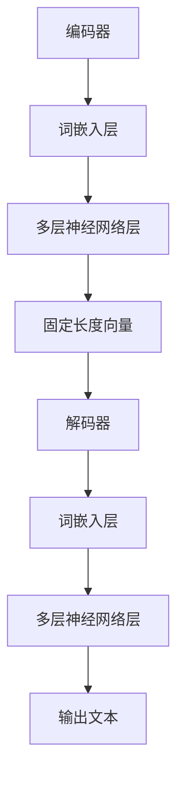

                 

# LLM与人类意图的最大公约数探寻

> 关键词：自然语言处理，深度学习，人类意图，最大公约数，算法原理，模型架构，数学模型，项目实战，应用场景，未来趋势

> 摘要：本文将探讨如何利用自然语言处理和深度学习技术，通过寻找LLM（大型语言模型）与人类意图的最大公约数，实现更加智能、精准的对话系统。文章将首先介绍LLM的基本原理和架构，然后详细阐述人类意图识别的核心算法和数学模型，最后通过实际项目案例进行说明，并展望未来发展趋势和挑战。

## 1. 背景介绍

### 1.1 目的和范围

本文旨在探讨如何利用大型语言模型（LLM）与人类意图的最大公约数，提高对话系统的智能水平和用户满意度。我们将首先介绍LLM的基本原理和架构，然后分析人类意图识别的核心算法，并在此基础上构建一个实用的对话系统。本文主要涵盖以下内容：

- LLM的基本原理和架构
- 人类意图识别的核心算法和数学模型
- 对话系统的实际构建与应用
- 未来发展趋势与挑战

### 1.2 预期读者

本文适合对自然语言处理、深度学习和对话系统有一定了解的技术人员、研究人员和开发者。读者应具备以下背景知识：

- 熟悉深度学习和自然语言处理的基本概念和算法
- 了解编程语言（如Python）的基本语法和调试技巧
- 对机器学习项目开发和实际应用有一定的实践经验

### 1.3 文档结构概述

本文共分为10个部分，包括：

1. 背景介绍
2. 核心概念与联系
3. 核心算法原理 & 具体操作步骤
4. 数学模型和公式 & 详细讲解 & 举例说明
5. 项目实战：代码实际案例和详细解释说明
6. 实际应用场景
7. 工具和资源推荐
8. 总结：未来发展趋势与挑战
9. 附录：常见问题与解答
10. 扩展阅读 & 参考资料

### 1.4 术语表

#### 1.4.1 核心术语定义

- **LLM（大型语言模型）**：一种基于深度学习的自然语言处理模型，具有强大的文本生成和语义理解能力。
- **意图识别**：从用户输入的文本中提取并理解其背后的意图，以便为用户提供合适的回答。
- **最大公约数**：两个或多个整数的最大公约数是指能够同时整除这些整数的最大整数。

#### 1.4.2 相关概念解释

- **自然语言处理（NLP）**：一门研究如何使计算机能够理解、处理和生成自然语言的技术。
- **深度学习**：一种基于多层神经网络的学习方法，能够自动提取特征并进行分类、回归等任务。
- **对话系统**：一种能够与用户进行交互，提供信息、解答问题或执行任务的系统。

#### 1.4.3 缩略词列表

- **LLM**：Large Language Model（大型语言模型）
- **NLP**：Natural Language Processing（自然语言处理）
- **DL**：Deep Learning（深度学习）
- **GC**：Greatest Common Divisor（最大公约数）

## 2. 核心概念与联系

在探讨如何寻找LLM与人类意图的最大公约数之前，我们首先需要了解LLM的基本原理、架构以及人类意图识别的相关概念。

### 2.1 LLM的基本原理

LLM是一种基于深度学习的自然语言处理模型，通常由多个神经网络层组成。其主要目标是学习输入文本的表示，并生成具有良好连贯性和语义一致性的文本输出。LLM的基本原理主要包括以下几个方面：

1. **词嵌入**：将文本中的每个单词映射到一个高维向量空间，以便更好地表示词语的语义信息。
2. **编码器**：将输入文本转换为固定长度的向量表示，这个向量包含了输入文本的语义信息。
3. **解码器**：将编码器输出的固定长度向量解码为输出文本，确保输出文本具有连贯性和语义一致性。
4. **注意力机制**：在编码和解码过程中，通过注意力机制来关注文本中的关键信息，提高模型的生成质量。

### 2.2 LLM的架构

LLM的架构通常分为两个主要部分：编码器和解码器。以下是典型的LLM架构：

在这个架构中，编码器负责将输入文本转换为固定长度向量，解码器则根据这个向量生成输出文本。注意力机制通常被集成在编码器和解码器的神经网络层中，以提高模型的生成质量。

### 2.3 人类意图识别

人类意图识别是自然语言处理领域的一个关键任务，其目标是从用户输入的文本中提取并理解其背后的意图。在对话系统中，正确识别用户意图是生成合适回答的前提。人类意图识别的主要步骤包括：

1. **文本预处理**：对用户输入的文本进行分词、去停用词、词性标注等操作，以便更好地提取语义信息。
2. **特征提取**：将预处理后的文本转换为向量表示，以便输入到深度学习模型中进行训练和推理。
3. **意图分类**：使用深度学习模型（如卷积神经网络、循环神经网络等）对提取的特征进行分类，从而识别出用户意图。

### 2.4 LLM与人类意图的最大公约数

LLM与人类意图的最大公约数是指，在对话系统中，通过寻找LLM生成的文本与人类意图的共

