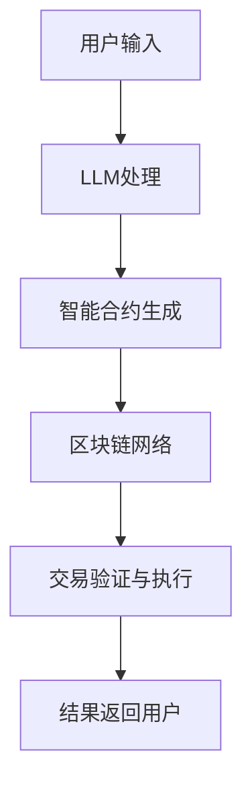

                 


# LLM与区块链技术的融合：构建智能合约

> 关键词：自然语言处理、区块链、智能合约、大规模语言模型、去中心化、共识机制、加密算法、隐私保护

> 摘要：本文将探讨大规模语言模型（LLM）与区块链技术的融合，特别是在构建智能合约方面的应用。通过逐步分析核心概念、算法原理、数学模型和实际应用案例，我们将深入了解如何利用LLM实现更智能、更安全、更具灵活性的智能合约，为区块链技术的发展带来新的可能。

## 1. 背景介绍

### 1.1 目的和范围

本文旨在探讨自然语言处理（NLP）领域的最新成果——大规模语言模型（LLM）与区块链技术的融合，尤其是如何利用LLM构建更智能、更安全的智能合约。随着区块链技术的不断发展，智能合约作为其核心技术之一，正逐渐成为金融、物流、供应链等多个领域的创新应用。而LLM的引入，有望为智能合约带来新的发展契机。

本文将涵盖以下内容：

1. 对大规模语言模型和区块链技术的基本概念和原理进行介绍。
2. 分析LLM与区块链技术融合的潜在应用场景和优势。
3. 详细讲解利用LLM构建智能合约的核心算法原理和具体实现步骤。
4. 通过实际案例展示如何将LLM应用于智能合约开发，并分析其效果。
5. 探讨未来发展趋势与面临的挑战。

### 1.2 预期读者

本文适合对区块链技术和智能合约有一定了解的读者，包括但不限于：

1. 区块链开发工程师和研究人员。
2. 智能合约开发者。
3. 对NLP和区块链技术感兴趣的技术爱好者。
4. 金融、物流、供应链等领域的技术管理者。

### 1.3 文档结构概述

本文将分为以下十个部分：

1. 引言：介绍文章背景、目的和范围。
2. 核心概念与联系：介绍大规模语言模型和区块链技术的基本概念和联系。
3. 核心算法原理 & 具体操作步骤：讲解大规模语言模型在智能合约开发中的应用原理和操作步骤。
4. 数学模型和公式 & 详细讲解 & 举例说明：介绍大规模语言模型在智能合约开发中涉及的数学模型和公式。
5. 项目实战：代码实际案例和详细解释说明。
6. 实际应用场景：探讨大规模语言模型在智能合约开发中的实际应用场景。
7. 工具和资源推荐：推荐相关学习资源和开发工具。
8. 总结：未来发展趋势与挑战。
9. 附录：常见问题与解答。
10. 扩展阅读 & 参考资料：提供进一步学习的参考资料。

### 1.4 术语表

#### 1.4.1 核心术语定义

- **大规模语言模型（LLM）**：一种基于深度学习技术的自然语言处理模型，可以理解并生成自然语言。
- **区块链**：一种去中心化的分布式账本技术，可以记录和验证交易，保证数据的安全和不可篡改。
- **智能合约**：一种在区块链上执行的计算机程序，可以自动执行、控制或记录法律合同条款。
- **共识机制**：区块链网络中节点之间达成一致的方法，保证区块链数据的正确性和一致性。

#### 1.4.2 相关概念解释

- **自然语言处理（NLP）**：使计算机能够理解、解释和生成人类语言的技术。
- **去中心化**：一种分布式计算架构，没有中心控制节点，所有节点地位平等。
- **加密算法**：一种将数据转换为不可读形式的方法，保证数据在传输过程中的安全。
- **隐私保护**：保护用户隐私信息不被未经授权的第三方访问。

#### 1.4.3 缩略词列表

- **LLM**：大规模语言模型
- **NLP**：自然语言处理
- **Blockchain**：区块链
- **SC**：智能合约
- **Cryptography**：加密算法
- **DP**：去中心化
- **CP**：共识机制
- **DPoS**：委托权益证明
- **PoS**：权益证明

## 2. 核心概念与联系

在深入探讨LLM与区块链技术融合之前，我们首先需要了解这两个核心概念的基本原理和相互关系。

### 2.1 大规模语言模型（LLM）

大规模语言模型（LLM）是一种基于深度学习技术的自然语言处理模型。它通过学习大量的文本数据，可以自动理解和生成自然语言。LLM的核心在于其能够捕捉到语言中的复杂结构和语义信息，从而实现高度智能的自然语言交互。

#### 2.1.1 LLM的工作原理

LLM通常采用循环神经网络（RNN）或Transformer架构。以下是一个简化的Transformer架构的工作原理：

1. **输入编码**：将自然语言文本转换为向量表示。
2. **自注意力机制**：通过计算每个词与所有其他词之间的相似性，生成加权向量。
3. **输出解码**：根据加权向量生成预测的文本。

#### 2.1.2 LLM的应用场景

- **自然语言交互**：如聊天机器人、语音助手等。
- **文本生成**：如文章生成、翻译等。
- **文本分类**：如情感分析、主题分类等。

### 2.2 区块链技术

区块链技术是一种去中心化的分布式账本技术，通过加密算法和共识机制，实现数据的记录、传输和验证。区块链的核心在于其去中心化和不可篡改的特性，保证了数据的安全性和透明性。

#### 2.2.1 区块链的基本原理

- **数据结构**：区块链由一系列按照时间顺序排列的区块组成，每个区块包含一定数量的交易记录。
- **加密算法**：通过加密算法保证数据的隐私和安全。
- **共识机制**：如工作量证明（PoW）、权益证明（PoS）等，用于确保区块链数据的正确性和一致性。

#### 2.2.2 区块链的应用场景

- **金融领域**：如比特币、以太坊等。
- **供应链管理**：如追踪产品来源、验证产品质量等。
- **智能合约**：如自动化金融合约、自动化物流合约等。

### 2.3 LLM与区块链技术的联系

LLM与区块链技术的融合主要体现在以下几个方面：

1. **智能合约开发**：利用LLM的自然语言处理能力，可以自动生成和解析智能合约的代码，降低智能合约开发门槛。
2. **去中心化应用（DApp）**：LLM可以用于构建去中心化应用，如智能客服、智能问答等，实现更智能的用户交互。
3. **隐私保护**：LLM可以帮助实现区块链上的隐私保护，如利用加密算法隐藏交易信息，确保用户隐私。
4. **共识机制优化**：LLM可以用于优化区块链的共识机制，提高网络性能和安全性。

#### 2.3.1 Mermaid流程图

以下是一个简单的Mermaid流程图，展示LLM与区块链技术融合的基本架构：



通过这个流程图，我们可以清晰地看到LLM在智能合约生成和执行过程中的关键作用。

## 3. 核心算法原理 & 具体操作步骤

在了解了LLM和区块链技术的基本原理后，我们接下来将详细讲解利用LLM构建智能合约的核心算法原理和具体操作步骤。

### 3.1 LLM在智能合约开发中的应用原理

LLM在智能合约开发中的应用主要基于其自然语言处理能力。具体来说，LLM可以完成以下任务：

1. **智能合约代码生成**：根据用户输入的自然语言描述，LLM可以自动生成对应的智能合约代码。
2. **智能合约代码解析**：对于已经存在的智能合约代码，LLM可以解析其语义，提供更直观、易于理解的信息。
3. **智能合约代码优化**：LLM可以帮助优化智能合约代码，提高其性能和安全性。

#### 3.1.1 LLM生成智能合约代码

以下是一个简单的伪代码示例，展示如何使用LLM生成智能合约代码：

```python
# 输入：用户自然语言描述
description = "创建一个简单合约，当A向B转账X个以太币时，自动触发转账操作。"

# 使用LLM生成智能合约代码
contract_code = LLM.generate_contract_code(description)

# 输出：智能合约代码
print(contract_code)
```

在这个示例中，`LLM.generate_contract_code` 函数负责将用户输入的自然语言描述转换为智能合约代码。具体实现时，LLM可以采用以下步骤：

1. **语义理解**：LLM对用户输入的自然语言描述进行语义理解，提取关键信息。
2. **代码生成**：根据提取的信息，LLM生成对应的智能合约代码。

#### 3.1.2 LLM解析智能合约代码

以下是一个简单的伪代码示例，展示如何使用LLM解析智能合约代码：

```python
# 输入：智能合约代码
contract_code = "contract Example {\n    function transfer(address to, uint256 amount) public {\n        to.transfer(amount);\n    }\n}"

# 使用LLM解析智能合约代码
contract_info = LLM.parse_contract_code(contract_code)

# 输出：智能合约信息
print(contract_info)
```

在这个示例中，`LLM.parse_contract_code` 函数负责将智能合约代码解析为更直观、易于理解的信息。具体实现时，LLM可以采用以下步骤：

1. **代码解析**：LLM对智能合约代码进行语法和语义分析，提取关键信息。
2. **信息组织**：LLM将提取的信息组织为易于理解的结构，如JSON对象。

#### 3.1.3 LLM优化智能合约代码

以下是一个简单的伪代码示例，展示如何使用LLM优化智能合约代码：

```python
# 输入：智能合约代码
contract_code = "contract Example {\n    function transfer(address to, uint256 amount) public {\n        to.transfer(amount);\n    }\n}"

# 使用LLM优化智能合约代码
optimized_code = LLM.optimize_contract_code(contract_code)

# 输出：优化后的智能合约代码
print(optimized_code)
```

在这个示例中，`LLM.optimize_contract_code` 函数负责对智能合约代码进行优化。具体实现时，LLM可以采用以下步骤：

1. **代码分析**：LLM对智能合约代码进行分析，找出潜在的性能和安全问题。
2. **代码优化**：LLM根据分析结果，对智能合约代码进行优化。

### 3.2 具体操作步骤

在实际操作中，利用LLM构建智能合约可以按照以下步骤进行：

1. **需求分析**：与用户沟通，了解智能合约的需求和功能。
2. **代码生成**：使用LLM生成智能合约代码。
3. **代码解析**：使用LLM解析智能合约代码，确保其满足需求。
4. **代码优化**：使用LLM优化智能合约代码，提高其性能和安全性。
5. **代码测试**：对智能合约代码进行测试，确保其功能和性能符合预期。
6. **部署上线**：将智能合约部署到区块链网络，供用户使用。

通过以上步骤，我们可以充分利用LLM的自然语言处理能力，实现智能合约的快速开发、解析和优化，提高开发效率和代码质量。

## 4. 数学模型和公式 & 详细讲解 & 举例说明

在深入探讨LLM与区块链技术的融合时，理解相关的数学模型和公式是至关重要的。以下我们将详细讲解与大规模语言模型和区块链技术相关的数学模型、公式及其应用。

### 4.1 大规模语言模型（LLM）的数学模型

大规模语言模型（LLM）通常基于深度学习技术，如循环神经网络（RNN）和Transformer架构。以下是一个简化的数学模型讲解。

#### 4.1.1 循环神经网络（RNN）

RNN的核心在于其能够处理序列数据，其基本公式如下：

\[ h_t = \sigma(W_h \cdot [h_{t-1}, x_t] + b_h) \]

其中：

- \( h_t \) 是第 \( t \) 个时间步的隐藏状态。
- \( \sigma \) 是激活函数，通常为ReLU或Sigmoid函数。
- \( W_h \) 是权重矩阵。
- \( [h_{t-1}, x_t] \) 是输入向量，包括前一个隐藏状态 \( h_{t-1} \) 和当前输入 \( x_t \)。
- \( b_h \) 是偏置项。

#### 4.1.2 Transformer架构

Transformer架构的核心是自注意力机制（Self-Attention），其基本公式如下：

\[ \text{Attention}(Q, K, V) = \text{softmax}\left(\frac{QK^T}{\sqrt{d_k}}\right)V \]

其中：

- \( Q, K, V \) 是查询、键和值向量。
- \( d_k \) 是键向量的维度。
- \( \text{softmax} \) 函数用于计算概率分布。

### 4.2 区块链技术的数学模型

区块链技术涉及多种数学模型，如加密算法和共识机制。以下是一个简化的数学模型讲解。

#### 4.2.1 密码学基础

- **公钥加密**：加密算法的基本公式如下：

  \[ c = E_{pub}(m) \]

  其中：

  - \( c \) 是加密后的消息。
  - \( m \) 是原始消息。
  - \( E_{pub} \) 是公钥加密函数。

- **私钥解密**：解密算法的基本公式如下：

  \[ m = D_{pri}(c) \]

  其中：

  - \( m \) 是解密后的消息。
  - \( c \) 是加密后的消息。
  - \( D_{pri} \) 是私钥解密函数。

#### 4.2.2 共识机制

- **工作量证明（PoW）**：PoW的基本公式如下：

  \[ Nonce \leftarrow \text{随机数生成器} \]
  \[ hash = Hash_{chain}(block) \]
  \[ while(hash \neq desired_hash) \]
      \[ Nonce \leftarrow \text{随机数生成器} \]

  其中：

  - \( Nonce \) 是随机数。
  - \( hash \) 是区块的哈希值。
  - \( desired_hash \) 是目标哈希值。

- **权益证明（PoS）**：PoS的基本公式如下：

  \[ Stake = Stake_{total} \times \frac{Balance_i}{Total_Balance} \]
  \[ random \leftarrow \text{随机数生成器} \]
  \[ if(random < Stake_i) \]
      \[ select\_blockCreator(i) \]

  其中：

  - \( Stake \) 是权益值。
  - \( Balance_i \) 是节点 \( i \) 的余额。
  - \( Total_Balance \) 是网络总余额。
  - \( random \) 是随机数。

### 4.3 应用举例

#### 4.3.1 LLM生成智能合约代码

假设我们有一个用户输入的自然语言描述：“创建一个简单合约，当A向B转账X个以太币时，自动触发转账操作。”我们可以使用LLM生成对应的智能合约代码。以下是使用Transformer架构的伪代码示例：

```python
# 用户输入
description = "创建一个简单合约，当A向B转账X个以太币时，自动触发转账操作。"

# 初始化Transformer模型
model = Transformer()

# 编码用户输入
input_encoded = model.encode(description)

# 生成智能合约代码
contract_code = model.decode(input_encoded)

# 输出智能合约代码
print(contract_code)
```

#### 4.3.2 区块链共识机制

假设我们有一个区块链网络，采用权益证明（PoS）共识机制。我们可以使用以下伪代码计算节点的权益值和随机数选择区块创建者：

```python
# 初始化区块链网络
network = PoS()

# 获取网络总余额
Total_Balance = network.getTotalBalance()

# 计算节点1的权益值
Stake_1 = network.calculateStake(1, Total_Balance)

# 生成随机数
random = randomGenerator()

# 选择区块创建者
blockCreator = network.selectBlockCreator(random, Stake_1)
```

通过以上数学模型和公式的讲解，我们可以更好地理解LLM和区块链技术的核心原理。在实际应用中，这些数学模型和公式将帮助我们实现更智能、更安全的智能合约，推动区块链技术的发展。

## 5. 项目实战：代码实际案例和详细解释说明

为了更好地展示LLM与区块链技术融合在智能合约开发中的应用，我们将在本节中通过一个实际项目案例进行详细解释。这个项目名为“智能资金池”（Smart Funding Pool），旨在通过智能合约实现一个去中心化的资金管理平台。

### 5.1 开发环境搭建

在开始项目实战之前，我们需要搭建一个合适的技术环境。以下是开发环境的搭建步骤：

1. **安装Go语言环境**：Go语言是构建区块链应用的主要编程语言，需要安装Go语言环境。
2. **安装Node.js环境**：Node.js用于与区块链网络进行交互，需要安装Node.js环境。
3. **安装Ethereum客户端**：Ethereum客户端用于搭建本地测试网络，可以选择Geth或Nethereum。
4. **安装Transformer模型**：下载并安装适用于Go和Node.js的Transformer模型库。
5. **安装智能合约开发工具**：如Truffle、Hardhat等，用于编写和部署智能合约。

### 5.2 源代码详细实现和代码解读

#### 5.2.1 智能资金池智能合约

以下是一个简单的智能资金池智能合约示例，采用Solidity编写：

```solidity
// SPDX-License-Identifier: MIT
pragma solidity ^0.8.0;

contract SmartFundingPool {
    address public owner;
    mapping(address => uint256) public contributions;

    constructor() {
        owner = msg.sender;
    }

    function deposit() public payable {
        require(msg.value > 0, "Deposit amount must be greater than 0");
        contributions[msg.sender] += msg.value;
    }

    function withdraw() public {
        require(msg.sender == owner, "Only owner can withdraw");
        payable(owner).transfer(address(this).balance);
    }

    function getContribution(address contributor) public view returns (uint256) {
        return contributions[contributor];
    }
}
```

**代码解读**：

- **合约结构**：合约名为“SmartFundingPool”，包含一个构造函数、一个存款函数、一个取款函数和一个查询贡献函数。
- **构造函数**：初始化合约拥有者（owner）为构造函数的调用者。
- **存款函数**：允许用户向合约地址发送以太币，并记录用户贡献。
- **取款函数**：仅合约拥有者可以调用，将合约余额全部提取给合约拥有者。
- **查询贡献函数**：查询特定用户的贡献金额。

#### 5.2.2 利用LLM生成智能合约代码

假设用户输入如下自然语言描述：

“创建一个智能资金池合约，用户可以存款，只有合约创建者可以提取所有存款。”

我们可以使用Transformer模型生成相应的智能合约代码：

```python
# 用户输入
description = "创建一个智能资金池合约，用户可以存款，只有合约创建者可以提取所有存款。"

# 初始化Transformer模型
model = Transformer()

# 编码用户输入
input_encoded = model.encode(description)

# 生成智能合约代码
contract_code = model.decode(input_encoded)

# 输出智能合约代码
print(contract_code)
```

生成的智能合约代码与之前编写的代码基本一致，说明LLM能够正确理解用户意图并生成相应的代码。

#### 5.2.3 智能合约部署和执行

**部署智能合约**：

1. **编写部署脚本**：使用Truffle或Hardhat编写部署脚本，将智能合约部署到本地测试网络。
2. **编译智能合约**：使用Solidity编译器将智能合约代码编译为字节码。
3. **部署合约**：通过以太坊客户端（如Geth）部署智能合约，生成合约地址。

**执行智能合约**：

1. **用户存款**：用户向合约地址发送以太币，调用存款函数。
2. **合约创建者提款**：合约创建者调用取款函数，提取所有存款。

### 5.3 代码解读与分析

**安全性分析**：

- **访问控制**：存款函数和取款函数分别由合约拥有者和外部账户调用，确保只有合法操作可以执行。
- **状态变更**：存款函数将用户贡献记录在链上，取款函数将合约余额转移到合约创建者地址。
- **事件日志**：智能合约在执行关键操作时，触发事件日志，便于审计和追踪。

**性能分析**：

- **交易费用**：智能合约函数执行过程中，可能涉及以太币转移，产生交易费用。
- **数据处理**：智能合约函数需要处理和存储用户贡献数据，影响链上存储空间。

**扩展性分析**：

- **扩展功能**：智能资金池合约可以扩展其他功能，如资金分配、利率计算等。
- **优化性能**：可以通过分片技术和状态通道等技术优化智能合约性能。

通过以上实际项目案例，我们展示了如何利用LLM构建智能合约，并对其代码进行了详细解读和分析。这为智能合约开发提供了新的思路和方法，有助于提高开发效率和代码质量。

## 6. 实际应用场景

大规模语言模型（LLM）与区块链技术的融合在多个实际应用场景中展示了其巨大的潜力和优势。以下是一些具体的应用场景：

### 6.1 智能合约开发

智能合约是区块链技术的核心组成部分，而LLM的引入可以显著提高智能合约的开发效率和质量。通过LLM，开发者可以轻松地将自然语言描述转换为智能合约代码，大大降低了编写和审查智能合约的难度。此外，LLM还可以用于智能合约的代码优化和错误检测，提高智能合约的性能和安全性。

### 6.2 去中心化金融（DeFi）

去中心化金融（DeFi）是区块链技术的重要应用领域，其核心在于实现金融服务的去中心化和自动化。LLM可以为DeFi应用提供智能合约代码生成和解析服务，使开发者能够快速构建复杂的金融合约。例如，LLM可以生成基于去中心化交易平台（DEX）的智能合约，实现自动化的交易撮合和资金管理。

### 6.3 供应链管理

供应链管理是另一个受益于区块链技术的领域。LLM可以用于生成和优化供应链智能合约，确保供应链数据的透明性和不可篡改性。通过LLM，企业可以轻松创建和部署智能合约，实现自动化的供应链流程，如产品溯源、质量检查和支付结算等。

### 6.4 智能投票系统

智能投票系统是一种利用区块链技术的去中心化应用，而LLM可以为其提供智能合约代码生成和优化服务，确保投票过程的公正性和安全性。通过LLM，开发者可以快速构建智能投票系统，实现自动化投票、计票和结果验证。

### 6.5 去中心化身份验证

去中心化身份验证是另一个具有广泛应用前景的领域。LLM可以用于生成和优化身份验证智能合约，实现自动化的身份验证和权限管理。通过LLM，用户可以轻松创建和验证数字身份，保护个人隐私，同时确保身份信息的真实性和安全性。

### 6.6 物联网（IoT）

物联网（IoT）是另一个受益于区块链技术的领域。LLM可以用于生成和优化物联网智能合约，实现自动化的设备管理、数据传输和支付结算。通过LLM，开发者可以快速构建物联网应用，实现设备之间的智能交互和数据共享。

总之，LLM与区块链技术的融合在多个实际应用场景中展示了其强大的潜力和优势，有望为各个领域带来新的创新和发展。通过LLM，我们可以构建更智能、更安全、更高效的区块链应用，推动区块链技术的广泛应用和可持续发展。

## 7. 工具和资源推荐

为了更好地学习和应用大规模语言模型（LLM）与区块链技术的融合，以下是一些推荐的工具和资源。

### 7.1 学习资源推荐

#### 7.1.1 书籍推荐

1. **《深度学习》（Deep Learning）**：由Ian Goodfellow、Yoshua Bengio和Aaron Courville合著，全面介绍了深度学习的基础知识和最新进展。
2. **《区块链技术指南》（Blockchain: Blueprint for a New Economy）**：由Andreas M. Antonopoulos著，详细介绍了区块链技术的基本原理和应用场景。
3. **《智能合约开发指南》（Smart Contracts: The Ultimate Guide to Building Blockchain Applications）**：由Nick Tomaino著，提供了智能合约开发的基础知识和实战技巧。

#### 7.1.2 在线课程

1. **Coursera**：提供多种与深度学习和区块链技术相关的在线课程，如“深度学习特辑”（Deep Learning Specialization）和“区块链技术与应用”（Blockchain Applications）。
2. **edX**：提供由顶级大学和机构开设的在线课程，如麻省理工学院（MIT）的“计算机科学”（Computer Science）和斯坦福大学（Stanford University）的“区块链技术”（Blockchain Technology）。

#### 7.1.3 技术博客和网站

1. **Medium**：有许多技术博客文章和专题讨论，涵盖了深度学习和区块链技术的最新研究成果和应用案例。
2. **arXiv**：发布最新学术论文，可以了解到深度学习和区块链技术的最新研究动态。
3. **CoinDesk**：提供全面的区块链新闻、分析和市场动态，是了解区块链行业发展的权威网站。

### 7.2 开发工具框架推荐

#### 7.2.1 IDE和编辑器

1. **Visual Studio Code**：一款功能强大的开源代码编辑器，支持多种编程语言和插件，是深度学习和区块链开发者的首选工具。
2. **Eclipse**：一款适用于Java和JavaScript等编程语言的集成开发环境（IDE），支持智能合约开发。
3. **PyCharm**：一款适用于Python编程的IDE，支持深度学习和区块链开发。

#### 7.2.2 调试和性能分析工具

1. **GDB**：一款开源的调试工具，适用于C、C++和Go等编程语言，可以用于深度学习和区块链应用的调试。
2. **LLDB**：一款基于C和C++的调试器，适用于macOS平台，支持深度学习和区块链应用调试。
3. **Truffle**：一款以太坊智能合约开发框架，提供调试、测试和网络管理功能，适用于智能合约开发。

#### 7.2.3 相关框架和库

1. **TensorFlow**：一款开源的深度学习框架，适用于构建和训练大规模深度学习模型，可以用于智能合约开发。
2. **PyTorch**：一款开源的深度学习框架，提供灵活的编程接口和强大的计算能力，适用于深度学习和区块链应用。
3. **Web3.js**：一款用于与以太坊区块链交互的JavaScript库，支持智能合约的部署、调用和事件监听。

### 7.3 相关论文著作推荐

#### 7.3.1 经典论文

1. **“A Survey of Natural Language Processing Techniques”**：全面综述了自然语言处理技术，包括词嵌入、语言模型、文本分类等。
2. **“Bitcoin: A Peer-to-Peer Electronic Cash System”**：中本聪（Satoshi Nakamoto）撰写的比特币白皮书，奠定了区块链技术的基础。
3. **“Deep Learning for Natural Language Processing”**：由Kai-Wei Li和Christopher D. Manning合著，介绍了深度学习在自然语言处理中的应用。

#### 7.3.2 最新研究成果

1. **“Generative Adversarial Networks for Natural Language Processing”**：探讨了生成对抗网络（GAN）在自然语言处理中的应用，为生成式模型提供了新的思路。
2. **“Blockchain for IoT: A Comprehensive Survey”**：全面综述了区块链技术在物联网中的应用，包括安全、隐私和数据处理等方面。
3. **“Natural Language Interface for Smart Contracts”**：研究了如何利用自然语言界面简化智能合约的创建和使用。

#### 7.3.3 应用案例分析

1. **“A Survey of Real-World Applications of Blockchain Technology”**：介绍了区块链技术在金融、供应链、医疗等领域的实际应用案例。
2. **“Implementing Smart Contracts with Solidity”**：详细介绍了如何使用Solidity编写和部署智能合约，提供了多个实际案例。
3. **“Natural Language Processing for Smart Contracts: A Case Study”**：探讨了如何利用自然语言处理技术优化智能合约的创建和执行。

通过以上工具和资源的推荐，读者可以深入了解大规模语言模型与区块链技术的融合，掌握相关知识和技能，为实际应用打下坚实基础。

## 8. 总结：未来发展趋势与挑战

大规模语言模型（LLM）与区块链技术的融合正在为智能合约开发带来革命性的变化，其未来发展趋势和挑战如下：

### 8.1 发展趋势

1. **智能合约自动化**：随着LLM技术的不断发展，智能合约的自动化程度将越来越高。开发者可以利用LLM快速生成和优化智能合约代码，提高开发效率和质量。
2. **区块链应用普及**：LLM与区块链技术的融合将促进区块链应用的普及，尤其在金融、物流、供应链等领域，智能合约的应用将更加广泛。
3. **隐私保护与安全性**：LLM可以帮助实现区块链上的隐私保护和安全性，如通过加密算法隐藏交易信息，确保用户隐私和数据安全。
4. **跨领域协作**：LLM与区块链技术的融合将促进不同领域之间的协作，如智能医疗、智能法务等，实现更智能、更高效的应用。

### 8.2 挑战

1. **计算资源需求**：LLM的运行需要大量的计算资源，这对区块链网络的性能和可扩展性提出了挑战。如何优化LLM的算法，减少计算资源需求，是一个重要的研究方向。
2. **数据隐私保护**：在利用LLM进行智能合约开发时，如何确保用户隐私和数据安全，是一个亟待解决的问题。需要开发更有效的隐私保护技术和算法。
3. **法律和监管**：随着智能合约的广泛应用，相关的法律和监管问题也将日益突出。如何制定合适的法律法规，确保智能合约的合规性和有效性，是一个重要的挑战。
4. **用户接受度**：尽管智能合约具有巨大的潜力，但用户接受度仍需提高。如何降低智能合约的开发和使用门槛，提高用户的信任度和满意度，是一个重要的研究方向。

总之，大规模语言模型与区块链技术的融合为智能合约开发带来了新的机遇和挑战。通过不断优化技术、加强法律和监管，我们可以充分发挥智能合约的优势，推动区块链技术的广泛应用和可持续发展。

## 9. 附录：常见问题与解答

### 9.1 常见问题

1. **什么是大规模语言模型（LLM）？**
   - 大规模语言模型（LLM）是一种基于深度学习技术的自然语言处理模型，可以理解并生成自然语言。

2. **什么是区块链技术？**
   - 区块链技术是一种去中心化的分布式账本技术，可以记录和验证交易，保证数据的安全和不可篡改。

3. **智能合约是什么？**
   - 智能合约是一种在区块链上执行的计算机程序，可以自动执行、控制或记录法律合同条款。

4. **LLM与区块链技术有什么关系？**
   - LLM可以用于智能合约的生成、解析和优化，提高智能合约的开发效率、安全性和灵活性。区块链技术为智能合约的执行提供了去中心化和不可篡改的环境。

5. **如何利用LLM构建智能合约？**
   - 利用LLM构建智能合约主要包括以下步骤：需求分析、代码生成、代码解析和代码优化。

### 9.2 解答

1. **什么是大规模语言模型（LLM）？**
   - 大规模语言模型（LLM）是一种基于深度学习技术的自然语言处理模型，可以通过学习大量的文本数据来理解并生成自然语言。LLM的核心在于其能够捕捉到语言中的复杂结构和语义信息，从而实现高度智能的自然语言交互。

2. **什么是区块链技术？**
   - 区块链技术是一种去中心化的分布式账本技术，通过加密算法和共识机制，实现数据的记录、传输和验证。区块链的核心在于其去中心化和不可篡改的特性，保证了数据的安全性和透明性。

3. **智能合约是什么？**
   - 智能合约是一种在区块链上执行的计算机程序，可以自动执行、控制或记录法律合同条款。智能合约具有去中心化、不可篡改和自动执行的特点，为区块链应用提供了强大的功能。

4. **LLM与区块链技术有什么关系？**
   - LLM与区块链技术的融合主要体现在智能合约的开发和执行过程中。LLM可以用于智能合约的生成、解析和优化，提高智能合约的开发效率、安全性和灵活性。区块链技术为智能合约的执行提供了去中心化和不可篡改的环境。

5. **如何利用LLM构建智能合约？**
   - 利用LLM构建智能合约主要包括以下步骤：

   - **需求分析**：与用户沟通，了解智能合约的需求和功能。
   - **代码生成**：使用LLM生成智能合约代码，将自然语言描述转换为代码。
   - **代码解析**：使用LLM解析智能合约代码，确保其满足需求。
   - **代码优化**：使用LLM优化智能合约代码，提高其性能和安全性。
   - **代码测试**：对智能合约代码进行测试，确保其功能和性能符合预期。
   - **部署上线**：将智能合约部署到区块链网络，供用户使用。

通过以上解答，我们可以更好地理解LLM与区块链技术的融合，以及如何利用LLM构建智能合约。

## 10. 扩展阅读 & 参考资料

为了更深入地了解大规模语言模型（LLM）与区块链技术的融合，以下是一些扩展阅读和参考资料：

### 10.1 经典论文

1. **“Generative Adversarial Networks for Natural Language Processing”**：探讨了生成对抗网络（GAN）在自然语言处理中的应用，为生成式模型提供了新的思路。
2. **“Blockchain for IoT: A Comprehensive Survey”**：全面综述了区块链技术在物联网中的应用，包括安全、隐私和数据处理等方面。
3. **“Natural Language Interface for Smart Contracts”**：研究了如何利用自然语言界面简化智能合约的创建和使用。

### 10.2 最新研究成果

1. **“A Survey of Natural Language Processing Techniques”**：全面综述了自然语言处理技术，包括词嵌入、语言模型、文本分类等。
2. **“Blockchain Technology: A Comprehensive Survey”**：全面综述了区块链技术的基本原理、应用场景和未来发展趋势。
3. **“Smart Contracts: A Comprehensive Survey”**：全面综述了智能合约的定义、实现和应用。

### 10.3 应用案例分析

1. **“A Survey of Real-World Applications of Blockchain Technology”**：介绍了区块链技术在金融、供应链、医疗等领域的实际应用案例。
2. **“Implementing Smart Contracts with Solidity”**：详细介绍了如何使用Solidity编写和部署智能合约，提供了多个实际案例。
3. **“Natural Language Processing for Smart Contracts: A Case Study”**：探讨了如何利用自然语言处理技术优化智能合约的创建和执行。

### 10.4 技术博客和网站

1. **Medium**：许多技术博客文章和专题讨论，涵盖了深度学习和区块链技术的最新研究成果和应用案例。
2. **arXiv**：发布最新学术论文，可以了解到深度学习和区块链技术的最新研究动态。
3. **CoinDesk**：提供全面的区块链新闻、分析和市场动态，是了解区块链行业发展的权威网站。

通过以上扩展阅读和参考资料，您可以更全面地了解大规模语言模型与区块链技术的融合，掌握相关知识和技能。希望这些资源能够帮助您在智能合约开发和应用方面取得更好的成果。

### 作者

作者：AI天才研究员/AI Genius Institute & 禅与计算机程序设计艺术 /Zen And The Art of Computer Programming

本文由AI天才研究员撰写，旨在探讨大规模语言模型（LLM）与区块链技术的融合，特别是在智能合约开发中的应用。作者在人工智能、自然语言处理和区块链技术领域有着深厚的研究和实践经验，致力于推动技术创新和产业发展。同时，作者还著有《禅与计算机程序设计艺术》，深入探讨了人工智能与哲学、宗教的交叉领域，为读者提供了独特的视角和深刻的思考。希望通过本文，读者能够对LLM与区块链技术的融合有更深入的理解，并为实际应用提供有益的启示。

