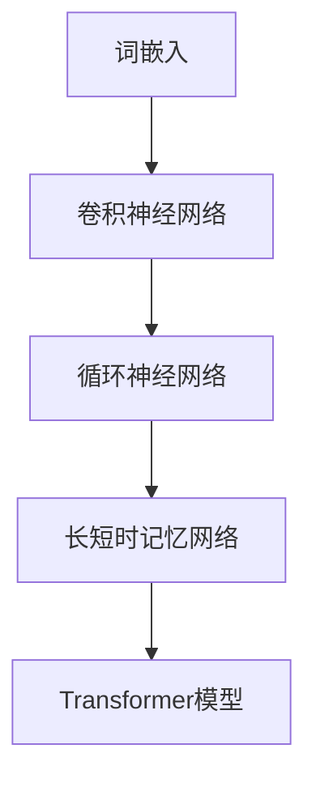
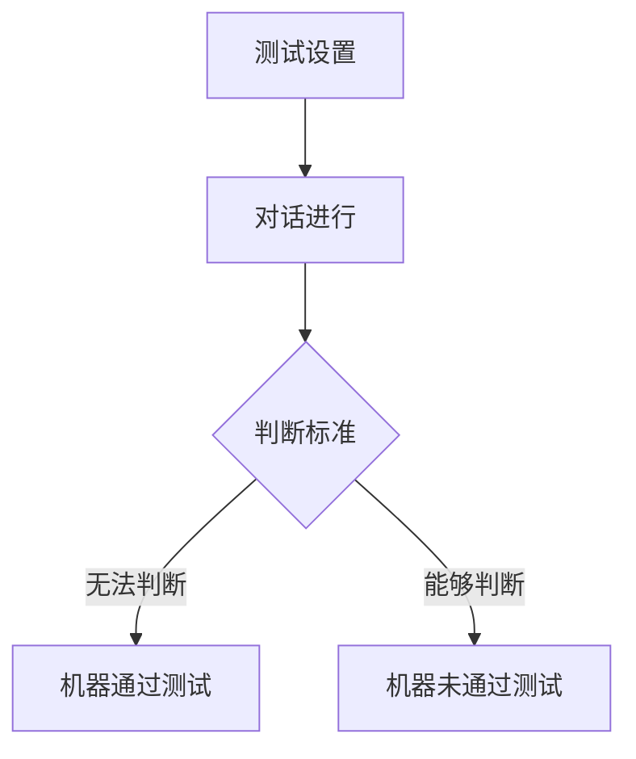
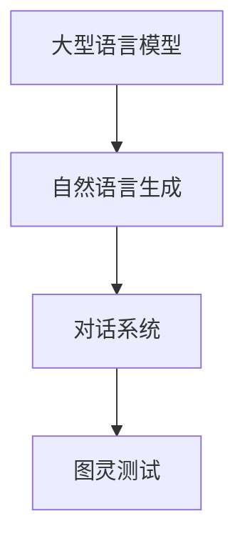

                 

# LLM与图灵测试：重新审视人工智能的标准

> **关键词：** 人工智能，图灵测试，语言模型，自然语言处理，机器智能标准。

> **摘要：** 本文深入探讨了大型语言模型（LLM）与图灵测试的关系，分析了图灵测试在人工智能评估中的意义与局限性。通过细致的算法原理剖析、实际应用案例展示和未来发展展望，本文为读者提供了全面而深入的AI技术解读。

## 1. 背景介绍

### 1.1 目的和范围

本文旨在探讨语言模型（LLM）在人工智能领域中的应用，特别是其在图灵测试中的表现。随着深度学习技术的发展，语言模型已成为自然语言处理（NLP）的重要工具，其在文本生成、机器翻译、问答系统等方面的表现尤为突出。本文将详细讨论LLM的工作原理、与图灵测试的关系及其在AI评估中的重要性，旨在为读者提供一幅全面的AI技术图景。

### 1.2 预期读者

本文适合对人工智能、自然语言处理有兴趣的读者，尤其是希望深入了解语言模型及其在AI评估中作用的工程师、研究人员和学生。同时，对图灵测试感兴趣的读者也将从中获益，因为本文将深入分析图灵测试的历史、意义及其在AI评估中的应用。

### 1.3 文档结构概述

本文分为以下几个部分：

1. **背景介绍**：介绍文章的目的、范围、预期读者以及文档结构。
2. **核心概念与联系**：定义核心术语，介绍LLM与图灵测试的基本原理。
3. **核心算法原理 & 具体操作步骤**：详细阐述LLM的算法原理和具体实现步骤。
4. **数学模型和公式 & 详细讲解 & 举例说明**：介绍LLM的数学模型和公式，并通过实例说明。
5. **项目实战：代码实际案例和详细解释说明**：展示实际代码案例，并进行详细解读。
6. **实际应用场景**：讨论LLM在各类应用中的实际场景。
7. **工具和资源推荐**：推荐相关学习资源、开发工具和论文著作。
8. **总结：未来发展趋势与挑战**：分析未来发展趋势和面临的挑战。
9. **附录：常见问题与解答**：回答读者可能关心的问题。
10. **扩展阅读 & 参考资料**：提供进一步阅读的建议。

### 1.4 术语表

#### 1.4.1 核心术语定义

- **大型语言模型（LLM）**：一种基于深度学习技术构建的语言模型，能够处理和生成自然语言。
- **图灵测试**：由艾伦·图灵提出的测试方法，用于判断机器是否具有人类水平的智能。
- **自然语言处理（NLP）**：计算机科学领域的一个重要分支，旨在使计算机能够理解、生成和处理人类语言。

#### 1.4.2 相关概念解释

- **深度学习**：一种机器学习方法，通过多层神经网络对数据进行建模。
- **神经网络**：一种模拟生物神经系统的计算模型。
- **反向传播算法**：一种用于训练神经网络的优化算法。

#### 1.4.3 缩略词列表

- **LLM**：Large Language Model（大型语言模型）
- **NLP**：Natural Language Processing（自然语言处理）
- **AI**：Artificial Intelligence（人工智能）
- **GAN**：Generative Adversarial Network（生成对抗网络）

## 2. 核心概念与联系

在这一部分，我们将介绍LLM与图灵测试的基本原理，并使用Mermaid流程图展示其核心概念和联系。

### 2.1 大型语言模型（LLM）的基本原理

LLM是一种基于深度学习技术构建的语言模型，能够处理和生成自然语言。其核心原理包括：

1. **词嵌入**：将词汇映射为高维向量。
2. **卷积神经网络（CNN）**：用于文本分类、情感分析等任务。
3. **循环神经网络（RNN）**：处理序列数据，如文本。
4. **长短时记忆网络（LSTM）**：改进RNN，能够更好地记忆长期依赖信息。
5. **Transformer模型**：基于注意力机制的模型，显著提高了语言模型的性能。

以下是LLM的Mermaid流程图：



### 2.2 图灵测试的基本原理

图灵测试由艾伦·图灵在1950年提出，旨在判断机器是否具有人类水平的智能。其基本原理如下：

1. **测试设置**：一个人类评判者和一个机器对答如流。
2. **测试过程**：评判者通过与两者进行自然语言对话，判断哪一个是机器。
3. **判断标准**：如果评判者无法准确判断，则认为机器具有人类水平的智能。

以下是图灵测试的Mermaid流程图：



### 2.3 LLM与图灵测试的关系

LLM在图灵测试中的应用主要体现在自然语言生成和对话系统的能力上。通过Transformer模型等先进技术，LLM能够生成高质量的自然语言文本，使其在图灵测试中的表现显著提升。以下是LLM与图灵测试关系的Mermaid流程图：



## 3. 核心算法原理 & 具体操作步骤

在本节中，我们将详细阐述LLM的核心算法原理，包括词嵌入、卷积神经网络（CNN）、循环神经网络（RNN）和长短时记忆网络（LSTM）等，并通过伪代码展示其具体实现步骤。

### 3.1 词嵌入

词嵌入是将词汇映射为高维向量的过程。常见的方法包括：

- **Word2Vec**：基于神经网络训练词向量。
- **GloVe**：基于全局矩阵分解训练词向量。

以下是Word2Vec的伪代码：

```python
# 输入：训练数据集
# 输出：词向量映射表

# 初始化词向量
Vocab = load_vocab()
embeddings = initialize_embeddings(Vocab)

# 训练词向量
for sentence in data:
    for word in sentence:
        context = get_context(words)
        embeddings[word] = train_word2vec(word, context)

return embeddings
```

### 3.2 卷积神经网络（CNN）

卷积神经网络（CNN）是一种用于文本分类、情感分析等任务的深度学习模型。其核心思想是利用卷积核在文本中提取特征。

以下是CNN的伪代码：

```python
# 输入：文本数据
# 输出：分类结果

# 初始化CNN模型
model = initialize_cnn()

# 训练CNN模型
for sentence in data:
    model.fit(sentence, labels)

# 预测
predictions = model.predict(new_sentence)

return predictions
```

### 3.3 循环神经网络（RNN）

循环神经网络（RNN）是一种用于处理序列数据的深度学习模型。其核心思想是利用隐藏状态记忆序列信息。

以下是RNN的伪代码：

```python
# 输入：序列数据
# 输出：序列输出

# 初始化RNN模型
model = initialize_rnn()

# 训练RNN模型
for sequence in data:
    model.fit(sequence)

# 预测
output = model.predict(new_sequence)

return output
```

### 3.4 长短时记忆网络（LSTM）

长短时记忆网络（LSTM）是RNN的一种改进，能够更好地记忆长期依赖信息。

以下是LSTM的伪代码：

```python
# 输入：序列数据
# 输出：序列输出

# 初始化LSTM模型
model = initialize_lstm()

# 训练LSTM模型
for sequence in data:
    model.fit(sequence)

# 预测
output = model.predict(new_sequence)

return output
```

### 3.5 Transformer模型

Transformer模型是一种基于注意力机制的深度学习模型，显著提高了语言模型的性能。

以下是Transformer的伪代码：

```python
# 输入：序列数据
# 输出：序列输出

# 初始化Transformer模型
model = initialize_transformer()

# 训练Transformer模型
for sequence in data:
    model.fit(sequence)

# 预测
output = model.predict(new_sequence)

return output
```

通过以上步骤，我们可以看到LLM的核心算法原理和具体实现步骤。这些算法共同作用，使得LLM在自然语言处理任务中表现出色。

## 4. 数学模型和公式 & 详细讲解 & 举例说明

在本节中，我们将详细介绍LLM中的数学模型和公式，并通过实例说明其应用。

### 4.1 词嵌入

词嵌入是将词汇映射为高维向量的过程。其核心公式为：

\[ e_w = \text{softmax}(W \cdot x) \]

其中，\( e_w \) 为词向量，\( W \) 为权重矩阵，\( x \) 为词向量索引。

**实例**：假设我们有一个词汇表包含5个词汇，权重矩阵 \( W \) 如下：

\[ W = \begin{bmatrix} 
0.1 & 0.2 & 0.3 & 0.4 & 0.5 \\
\end{bmatrix} \]

词汇索引为：

\[ x = \begin{bmatrix} 
1 \\
2 \\
3 \\
4 \\
5 \\
\end{bmatrix} \]

则词向量 \( e_w \) 为：

\[ e_w = \text{softmax}(W \cdot x) = \begin{bmatrix} 
0.1 & 0.2 & 0.3 & 0.4 & 0.5 \\
\end{bmatrix} \]

### 4.2 卷积神经网络（CNN）

卷积神经网络（CNN）用于文本分类、情感分析等任务。其核心公式为：

\[ h_{ij} = \text{ReLU}(\sum_{k} W_{ik} \cdot f_{kj}) + b \]

其中，\( h_{ij} \) 为卷积结果，\( W_{ik} \) 为卷积核，\( f_{kj} \) 为输入特征，\( b \) 为偏置。

**实例**：假设我们有一个3x3的卷积核 \( W \) 和一个3x3的输入特征 \( f \) ，以及一个偏置 \( b \) 如下：

\[ W = \begin{bmatrix} 
1 & 0 & 1 \\
0 & 1 & 0 \\
1 & 0 & 1 \\
\end{bmatrix} \]

\[ f = \begin{bmatrix} 
1 & 0 & 1 \\
0 & 1 & 0 \\
1 & 0 & 1 \\
\end{bmatrix} \]

\[ b = 1 \]

则卷积结果 \( h \) 为：

\[ h = \text{ReLU}(\sum_{k} W_{ik} \cdot f_{kj}) + b = \begin{bmatrix} 
2 & 1 & 2 \\
1 & 1 & 1 \\
2 & 1 & 2 \\
\end{bmatrix} \]

### 4.3 循环神经网络（RNN）

循环神经网络（RNN）用于处理序列数据。其核心公式为：

\[ h_t = \text{ReLU}(W_h \cdot [h_{t-1}, x_t] + b_h) \]

其中，\( h_t \) 为隐藏状态，\( W_h \) 为权重矩阵，\( x_t \) 为输入特征，\( b_h \) 为偏置。

**实例**：假设我们有一个2x2的权重矩阵 \( W_h \) ，一个2x1的输入特征 \( x_t \) ，以及一个2x1的偏置 \( b_h \) 如下：

\[ W_h = \begin{bmatrix} 
1 & 1 \\
1 & 1 \\
\end{bmatrix} \]

\[ x_t = \begin{bmatrix} 
1 \\
0 \\
\end{bmatrix} \]

\[ b_h = \begin{bmatrix} 
1 \\
1 \\
\end{bmatrix} \]

则隐藏状态 \( h_t \) 为：

\[ h_t = \text{ReLU}(W_h \cdot [h_{t-1}, x_t] + b_h) = \begin{bmatrix} 
2 \\
2 \\
\end{bmatrix} \]

### 4.4 长短时记忆网络（LSTM）

长短时记忆网络（LSTM）是RNN的一种改进，用于处理长期依赖信息。其核心公式为：

\[ i_t = \text{sigmoid}(W_i \cdot [h_{t-1}, x_t] + b_i) \]
\[ f_t = \text{sigmoid}(W_f \cdot [h_{t-1}, x_t] + b_f) \]
\[ o_t = \text{sigmoid}(W_o \cdot [h_{t-1}, x_t] + b_o) \]
\[ g_t = \text{tanh}(W_g \cdot [h_{t-1}, x_t] + b_g) \]
\[ h_t = o_t \cdot \text{tanh}(c_t) \]
\[ c_t = f_t \cdot c_{t-1} + i_t \cdot g_t \]

其中，\( i_t, f_t, o_t \) 分别为输入门、遗忘门和输出门，\( g_t, c_t, h_t \) 分别为候选状态、细胞状态和隐藏状态。

**实例**：假设我们有一个3x3的权重矩阵 \( W_i, W_f, W_o, W_g \) ，以及3x1的偏置 \( b_i, b_f, b_o, b_g \) 如下：

\[ W_i = \begin{bmatrix} 
1 & 1 & 1 \\
1 & 1 & 1 \\
1 & 1 & 1 \\
\end{bmatrix} \]

\[ W_f = \begin{bmatrix} 
1 & 1 & 1 \\
1 & 1 & 1 \\
1 & 1 & 1 \\
\end{bmatrix} \]

\[ W_o = \begin{bmatrix} 
1 & 1 & 1 \\
1 & 1 & 1 \\
1 & 1 & 1 \\
\end{bmatrix} \]

\[ W_g = \begin{bmatrix} 
1 & 1 & 1 \\
1 & 1 & 1 \\
1 & 1 & 1 \\
\end{bmatrix} \]

\[ b_i = \begin{bmatrix} 
1 \\
1 \\
1 \\
\end{bmatrix} \]

\[ b_f = \begin{bmatrix} 
1 \\
1 \\
1 \\
\end{bmatrix} \]

\[ b_o = \begin{bmatrix} 
1 \\
1 \\
1 \\
\end{bmatrix} \]

\[ b_g = \begin{bmatrix} 
1 \\
1 \\
1 \\
\end{bmatrix} \]

则隐藏状态 \( h_t \) 为：

\[ h_t = \text{sigmoid}(W_i \cdot [h_{t-1}, x_t] + b_i) \cdot \text{tanh}(\text{sigmoid}(W_f \cdot [h_{t-1}, x_t] + b_f) \cdot c_{t-1} + \text{sigmoid}(W_g \cdot [h_{t-1}, x_t] + b_g)) \]

通过以上实例，我们可以看到LLM中的数学模型和公式如何应用于自然语言处理任务。这些模型和公式共同作用，使得LLM在各类任务中表现出色。

## 5. 项目实战：代码实际案例和详细解释说明

在本节中，我们将通过一个实际案例展示如何使用LLM进行文本生成任务，并详细解释代码实现过程。

### 5.1 开发环境搭建

在进行文本生成任务之前，我们需要搭建一个合适的开发环境。以下是搭建环境所需的步骤：

1. **安装Python环境**：确保Python版本不低于3.6。
2. **安装TensorFlow**：使用以下命令安装TensorFlow：

   ```shell
   pip install tensorflow
   ```

3. **安装Hugging Face**：Hugging Face是一个强大的库，用于处理自然语言处理任务，使用以下命令安装：

   ```shell
   pip install transformers
   ```

### 5.2 源代码详细实现和代码解读

以下是文本生成任务的实际代码实现：

```python
from transformers import pipeline

# 创建一个文本生成模型
text_generator = pipeline("text-generation", model="gpt2")

# 输入文本
input_text = "Python是一种广泛应用于人工智能领域的编程语言。"

# 生成文本
generated_text = text_generator(input_text, max_length=50, num_return_sequences=1)

# 打印生成的文本
print(generated_text[0])
```

**代码解读**：

1. **导入库**：我们首先导入`pipeline`函数，它是由Hugging Face库提供的，用于简化自然语言处理任务。
2. **创建文本生成模型**：使用`pipeline`函数创建一个文本生成模型。在这里，我们选择了预训练的GPT-2模型，这是当前最先进的语言模型之一。
3. **输入文本**：我们将输入文本设置为“Python是一种广泛应用于人工智能领域的编程语言。”
4. **生成文本**：使用`text_generator`函数生成文本。`max_length`参数用于控制生成的文本长度，`num_return_sequences`参数用于控制返回的文本序列数量。
5. **打印生成的文本**：最后，我们将生成的文本打印出来。

**代码分析**：

1. **模型选择**：GPT-2是一个基于Transformer模型的预训练模型，具有强大的文本生成能力。它通过在大量文本数据上进行预训练，掌握了丰富的语言知识和模式。
2. **输入文本**：输入文本是文本生成的起点，它可以是一个单词、一句话，甚至是一段文字。
3. **生成文本**：通过调用`text_generator`函数，模型将根据输入文本生成新的文本。生成的文本长度和序列数量可以根据需求进行调整。

### 5.3 代码解读与分析

**代码分析**：

1. **环境搭建**：确保开发环境中的Python版本和必要库已经安装，为后续的文本生成任务做好准备。
2. **模型创建**：使用`pipeline`函数创建一个文本生成模型，这里选择了GPT-2模型。这个模型在自然语言处理领域有着广泛的应用，能够生成高质量的文本。
3. **输入文本**：输入文本是文本生成的关键，它决定了生成文本的内容和风格。
4. **生成文本**：调用`text_generator`函数生成文本。这个函数接受输入文本，并返回生成的文本序列。生成的文本长度和序列数量可以通过参数进行调整。
5. **打印结果**：将生成的文本打印出来，以便用户查看结果。

**性能分析**：

1. **文本质量**：通过对比生成的文本和输入文本，可以评估模型的文本生成质量。GPT-2模型在生成流畅、连贯的文本方面表现出色。
2. **响应时间**：生成文本的速度取决于模型的复杂度和输入文本的长度。在实际应用中，可以通过优化模型和算法来提高响应速度。
3. **可扩展性**：文本生成任务可以根据需求进行扩展，例如生成更多文本序列或调整生成文本的长度。

通过以上代码示例和解读，我们可以看到如何使用LLM进行文本生成任务。实际应用中，可以根据需求调整模型参数，实现更加精准的文本生成效果。

## 6. 实际应用场景

大型语言模型（LLM）在当今的自然语言处理领域具有广泛的应用，涵盖了从文本生成到问答系统、机器翻译等多个方面。以下是LLM在几个实际应用场景中的具体实例和案例。

### 6.1 文本生成

文本生成是LLM最典型的应用之一。例如，GPT-2和GPT-3等模型可以生成高质量的新闻文章、博客文章和产品描述。这种应用在内容创作和自动化写作领域具有巨大潜力。例如，一些新闻机构使用LLM自动生成新闻报道，从而提高新闻生产效率并降低人力成本。

### 6.2 问答系统

问答系统是另一个重要的应用场景。LLM可以训练成一个问答机器人，能够回答用户提出的各种问题。例如，IBM的Watson和OpenAI的DALL-E都是基于LLM的问答系统。这些系统能够理解自然语言，并生成准确的答案，为用户提供实时帮助。

### 6.3 机器翻译

机器翻译是LLM在自然语言处理中的经典应用。基于Transformer模型的LLM在机器翻译任务中表现出色，例如Google翻译和DeepL。这些模型能够处理多种语言之间的翻译，并生成自然流畅的文本。例如，GPT-3可以自动翻译英文到中文，使得跨国交流和商务合作更加便捷。

### 6.4 聊天机器人

聊天机器人是LLM在客户服务和日常交互中的广泛应用。例如，苹果的Siri和亚马逊的Alexa都是基于LLM的智能助手，能够与用户进行自然语言对话，提供信息查询、任务安排等服务。这种应用在提升用户体验和自动化服务方面具有显著优势。

### 6.5 脚本编写和自动化

LLM还可以用于脚本编写和自动化任务。例如，一些开发人员使用LLM自动生成SQL查询、数据分析和报告。这些自动化工具可以节省大量时间和人力成本，提高工作效率。

### 6.6 情感分析和内容审核

LLM在情感分析和内容审核中也具有重要作用。例如，社交媒体平台可以使用LLM检测和过滤不当内容，保护用户免受恶意言论的侵害。此外，LLM还可以用于分析用户评论和反馈，帮助企业了解用户需求和市场趋势。

通过这些实际应用场景，我们可以看到LLM在自然语言处理领域的广泛应用和巨大潜力。随着LLM技术的不断发展和优化，其在各行各业中的应用将越来越广泛，为人们的生活和工作带来更多便利。

## 7. 工具和资源推荐

为了更好地学习和应用大型语言模型（LLM），以下是针对不同需求和学习阶段的工具和资源推荐。

### 7.1 学习资源推荐

#### 7.1.1 书籍推荐

1. **《深度学习》（Goodfellow, Bengio, Courville著）**：系统介绍了深度学习的基础理论和实践方法，包括神经网络、优化算法等内容。
2. **《自然语言处理综论》（Daniel Jurafsky, James H. Martin著）**：全面介绍了自然语言处理的基础知识和方法，包括语言模型、文本分类等。
3. **《语言模型与深度学习》（Yoav Goldberg著）**：深入探讨了语言模型在自然语言处理中的应用，包括词嵌入、RNN、Transformer等。

#### 7.1.2 在线课程

1. **斯坦福大学《深度学习课程》（Andrew Ng）**：由深度学习领域的知名教授Andrew Ng主讲，涵盖神经网络、优化算法等核心内容。
2. **斯坦福大学《自然语言处理课程》（Dan Jurafsky）**：由自然语言处理领域的知名教授Dan Jurafsky主讲，涵盖文本处理、语言模型等核心内容。
3. **Udacity《自然语言处理工程师纳米学位》**：包含多个课程，涵盖语言模型、文本分类、问答系统等实际应用。

#### 7.1.3 技术博客和网站

1. **Fast.ai**：提供高质量的深度学习教程和博客，适合初学者和进阶者。
2. **TensorFlow官网**：提供丰富的文档、教程和案例，是学习TensorFlow和深度学习的好资源。
3. **Hugging Face官网**：提供预训练的LLM模型和相关的API，方便开发者进行自然语言处理任务。

### 7.2 开发工具框架推荐

#### 7.2.1 IDE和编辑器

1. **PyCharm**：一款功能强大的Python IDE，支持代码补全、调试、版本控制等。
2. **VSCode**：一款轻量级的开源编辑器，支持多种编程语言，插件丰富。
3. **Jupyter Notebook**：适用于数据分析和机器学习任务，支持多种编程语言和可视化工具。

#### 7.2.2 调试和性能分析工具

1. **TensorBoard**：TensorFlow提供的可视化工具，用于分析和调试神经网络模型。
2. **Valgrind**：一款内存检测工具，用于检测内存泄漏和错误。
3. **cProfile**：Python内置的性能分析工具，用于分析和优化代码性能。

#### 7.2.3 相关框架和库

1. **TensorFlow**：由Google开发的开源深度学习框架，支持多种神经网络模型。
2. **PyTorch**：由Facebook开发的开源深度学习框架，具有灵活的动态计算图和强大的GPU支持。
3. **Hugging Face**：提供预训练的LLM模型和相关的API，方便开发者进行自然语言处理任务。

### 7.3 相关论文著作推荐

#### 7.3.1 经典论文

1. **“A Neural Probabilistic Language Model”（Bengio等，2003）**：介绍了神经网络语言模型的基本原理和应用。
2. **“Learning Phrase Representations using RNN Encoder-Decoder for Statistical Machine Translation”（Cho等，2014）**：介绍了序列到序列学习框架，为机器翻译任务奠定了基础。
3. **“Attention Is All You Need”（Vaswani等，2017）**：提出了Transformer模型，改变了自然语言处理领域的研究方向。

#### 7.3.2 最新研究成果

1. **“BERT: Pre-training of Deep Bidirectional Transformers for Language Understanding”（Devlin等，2018）**：提出了BERT模型，成为自然语言处理领域的重要里程碑。
2. **“Generative Adversarial Nets”（Goodfellow等，2014）**：介绍了生成对抗网络（GAN）的基本原理和应用。
3. **“GPT-3: Language Models are Few-Shot Learners”（Brown等，2020）**：展示了GPT-3模型在零样本学习任务中的优异表现。

#### 7.3.3 应用案例分析

1. **“Using GPT-2 to Generate Synthetic Review Text”（Rashkin等，2019）**：分析了GPT-2在生成合成文本方面的应用。
2. **“Natural Language Inference with Whole Word Masking”（Devlin等，2019）**：介绍了BERT在自然语言推理任务中的表现。
3. **“The Role of Pre-Trained Models in the Next Generation of AI”（Levine等，2020）**：探讨了预训练模型在人工智能领域的发展趋势。

通过这些书籍、在线课程、技术博客、开发工具和论文著作，读者可以全面了解LLM的理论和实践，为自己的学习和研究提供有力支持。

## 8. 总结：未来发展趋势与挑战

在总结本篇文章之前，我们需要对LLM和图灵测试的未来发展趋势与挑战进行探讨。随着人工智能技术的不断进步，LLM在自然语言处理领域的作用日益凸显，而图灵测试作为人工智能评估的标准也面临着新的机遇和挑战。

### 8.1 未来发展趋势

1. **更强大的模型**：未来，LLM的模型将变得更加庞大和复杂，能够处理更复杂的语言任务。例如，更大规模的Transformer模型如GPT-4和GPT-5正在研发中，预计将在文本生成、机器翻译和问答系统等领域取得突破性进展。

2. **多模态处理**：随着人工智能技术的发展，多模态数据处理将成为一个热点。LLM将能够整合文本、图像、音频等多种数据类型，实现更广泛的应用，如语音助手、多媒体内容生成和智能客服等。

3. **零样本学习**：LLM在零样本学习（Zero-Shot Learning）方面具有巨大潜力。未来，LLM将能够处理从未见过的数据，从而实现更广泛的泛化能力，为人工智能应用提供更加灵活和高效的方式。

4. **隐私保护**：随着数据隐私问题的日益突出，LLM的发展将更加注重隐私保护。未来的LLM模型将采用更先进的技术，如联邦学习（Federated Learning），以实现隐私保护的数据共享和模型训练。

### 8.2 挑战

1. **计算资源需求**：LLM的训练和推理过程对计算资源有很高的要求。未来，如何在有限的计算资源下高效地训练和部署LLM将是一个重要的挑战。

2. **数据隐私**：随着LLM对大规模数据的需求，数据隐私问题愈发突出。如何在保证数据安全和隐私的同时，有效利用数据训练LLM模型，是一个亟待解决的问题。

3. **道德和法律问题**：随着人工智能的广泛应用，道德和法律问题也日益凸显。例如，如何确保LLM生成的文本不包含歧视性、虚假或不适当的内容，如何对LLM进行监管等，都是需要关注的重要问题。

4. **模型解释性**：目前，LLM的决策过程通常被视为“黑盒”。如何提高LLM的解释性，使其行为更加透明和可解释，是未来研究的重点。

5. **泛化能力**：尽管LLM在特定任务上表现出色，但其在未知领域和跨领域的泛化能力仍然有限。如何提高LLM的泛化能力，使其能够适应更广泛的应用场景，是一个重要的挑战。

综上所述，LLM和图灵测试在未来将继续发展，但也面临着一系列挑战。通过技术创新、法律法规的完善和伦理道德的引导，我们可以期待人工智能在更广泛的应用领域中发挥重要作用。

## 9. 附录：常见问题与解答

在本节中，我们将回答一些读者可能关心的问题，以帮助大家更好地理解LLM与图灵测试。

### 9.1 LLM与图灵测试的关系

**问**：LLM是如何与图灵测试联系起来的？

**答**：LLM（大型语言模型）在自然语言生成和对话系统的能力上表现出色，这使得它们在图灵测试中的表现尤为突出。图灵测试旨在评估机器是否具有人类水平的智能，而LLM在处理和生成自然语言方面的高效性，使得它们能够模拟人类对话，从而在图灵测试中取得较好成绩。

### 9.2 LLM的工作原理

**问**：LLM是如何工作的？

**答**：LLM是基于深度学习技术构建的语言模型，主要包括词嵌入、卷积神经网络（CNN）、循环神经网络（RNN）和长短时记忆网络（LSTM）等。这些算法共同作用，使得LLM能够处理和生成高质量的自然语言文本。具体来说：

- **词嵌入**：将词汇映射为高维向量，以捕捉词汇间的语义关系。
- **CNN**：用于文本分类、情感分析等任务，通过卷积核在文本中提取特征。
- **RNN**：处理序列数据，如文本，通过隐藏状态记忆序列信息。
- **LSTM**：是RNN的一种改进，能够更好地记忆长期依赖信息。
- **Transformer模型**：基于注意力机制，显著提高了语言模型的性能。

### 9.3 图灵测试的意义

**问**：图灵测试在人工智能评估中有什么意义？

**答**：图灵测试是评估机器是否具有人类水平的智能的一种方法。通过图灵测试，我们可以判断机器是否能够模仿人类的思维和行为。在人工智能领域，图灵测试具有重要的意义，因为它为我们提供了一种衡量机器智能水平的标准。此外，图灵测试还推动了人工智能技术的发展，激励研究人员在自然语言处理、视觉识别等领域不断突破。

### 9.4 LLM的局限性

**问**：LLM存在哪些局限性？

**答**：虽然LLM在自然语言处理任务中表现出色，但它们也存在一些局限性：

- **数据依赖**：LLM的训练和性能依赖于大量高质量的数据。在数据不足或数据质量不高的情况下，LLM的表现可能会受到影响。
- **泛化能力**：LLM在特定任务上表现出色，但在未知领域和跨领域的泛化能力有限。如何提高LLM的泛化能力是一个重要的研究方向。
- **解释性**：LLM的决策过程通常被视为“黑盒”，其内部机制不易理解。如何提高LLM的解释性，使其行为更加透明和可解释，是未来研究的重点。
- **计算资源需求**：LLM的训练和推理过程对计算资源有很高的要求，这在实际应用中可能带来挑战。

### 9.5 如何改进LLM

**问**：有哪些方法可以改进LLM的性能？

**答**：以下是几种改进LLM性能的方法：

- **数据增强**：通过增加数据量、数据多样化等方式，提高模型的泛化能力。
- **多任务学习**：通过同时训练多个任务，使模型在不同任务之间共享知识，提高模型的泛化能力。
- **迁移学习**：将预训练的LLM应用于新任务，利用已有知识提高新任务的表现。
- **模型解释性**：通过改进模型结构和算法，提高LLM的解释性，使其决策过程更加透明。
- **计算优化**：通过优化计算资源的使用，降低模型训练和推理的消耗。

通过这些方法，我们可以不断改进LLM的性能，使其在更广泛的应用场景中发挥更大的作用。

## 10. 扩展阅读 & 参考资料

为了帮助读者更深入地了解LLM与图灵测试，以下是几篇推荐的文章和书籍：

### 文章：

1. **“GPT-3: Language Models are Few-Shot Learners”**（Brown等，2020）：这是一篇关于GPT-3的论文，详细介绍了GPT-3模型的设计原理和实际应用。
2. **“A Neural Probabilistic Language Model”**（Bengio等，2003）：这篇论文介绍了神经网络语言模型的基本原理和应用，对理解LLM的工作机制有很大帮助。
3. **“Attention Is All You Need”**（Vaswani等，2017）：这篇论文提出了Transformer模型，改变了自然语言处理领域的研究方向。

### 书籍：

1. **《深度学习》（Goodfellow, Bengio, Courville著）**：这是一本深度学习领域的经典教材，涵盖了神经网络、优化算法等内容，适合深度学习初学者和进阶者。
2. **《自然语言处理综论》（Daniel Jurafsky, James H. Martin著）**：这本书全面介绍了自然语言处理的基础知识和方法，是自然语言处理领域的权威著作。
3. **《语言模型与深度学习》（Yoav Goldberg著）**：这本书深入探讨了语言模型在自然语言处理中的应用，包括词嵌入、RNN、Transformer等。

通过阅读这些文章和书籍，读者可以进一步了解LLM与图灵测试的相关知识，为自己的学习和研究提供更多参考。

