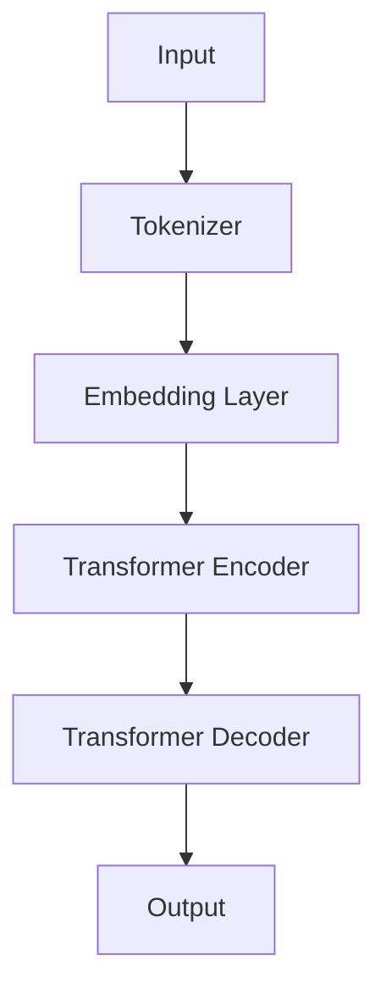

                 

# LLM产业链的形成与发展

## 关键词
- 语言模型
- 产业链
- 技术创新
- 应用场景
- 发展趋势

## 摘要
本文旨在探讨大型语言模型（LLM）产业链的形成与发展。从背景介绍到核心概念、算法原理、数学模型、实际应用、工具资源推荐等多个方面，全面剖析LLM产业链的构成要素、发展趋势及其面临挑战。通过本文，读者将了解到LLM技术在不同领域的应用，以及该产业链的未来前景。

## 1. 背景介绍

### 1.1 目的和范围
本文主要探讨大型语言模型（LLM）产业链的形成与发展，重点关注LLM技术在不同领域的应用以及其产业链的各个环节。

### 1.2 预期读者
本文适合对人工智能、自然语言处理（NLP）以及大型语言模型有一定了解的技术人员、科研人员和行业从业者。

### 1.3 文档结构概述
本文分为十个部分，包括背景介绍、核心概念与联系、核心算法原理、数学模型与公式、项目实战、实际应用场景、工具和资源推荐、总结、常见问题与解答以及扩展阅读。每个部分都将详细探讨LLM产业链的相关内容。

### 1.4 术语表

#### 1.4.1 核心术语定义
- 语言模型：一种用于预测文本概率的模型，能够根据已有的文本数据生成新的文本。
- 大型语言模型（LLM）：具有巨大参数量和强大文本处理能力的语言模型，如GPT、BERT等。
- 产业链：指一个行业中从生产、研发到销售、服务的各个环节及其相互关系。

#### 1.4.2 相关概念解释
- 自然语言处理（NLP）：使计算机能够理解和生成人类语言的技术和算法。
- 人工智能（AI）：一种模拟人类智能的计算机技术，包括机器学习、深度学习等。

#### 1.4.3 缩略词列表
- LLM：大型语言模型
- NLP：自然语言处理
- AI：人工智能

## 2. 核心概念与联系

### 2.1 语言模型概述
语言模型是自然语言处理（NLP）领域的一个重要组成部分，它能够预测一段文本的下一个词或下一句话。在NLP任务中，语言模型常用于文本分类、机器翻译、情感分析等。随着人工智能技术的不断发展，语言模型也得到了显著的提升，尤其是大型语言模型（LLM）的出现，使得文本处理能力大幅增强。

### 2.2 大型语言模型（LLM）架构
LLM具有巨大的参数量，能够捕捉到文本中的复杂模式和规律。以下是LLM的基本架构：



- **Tokenizer**：将输入的文本拆分成词或子词。
- **Embedding Layer**：将词或子词转换为向量表示。
- **Transformer Encoder**：对嵌入向量进行编码，捕捉输入文本的信息。
- **Transformer Decoder**：对编码后的信息进行解码，生成输出文本。

### 2.3 语言模型与自然语言处理
语言模型在自然语言处理中发挥着重要作用，其核心应用包括：

- **文本分类**：根据文本内容将其分类到不同的类别中。
- **机器翻译**：将一种语言的文本翻译成另一种语言。
- **情感分析**：判断文本的情感倾向，如正面、负面或中性。
- **问答系统**：根据输入的问题生成相应的回答。

## 3. 核心算法原理 & 具体操作步骤

### 3.1 语言模型算法原理
语言模型算法主要基于概率模型，其核心思想是利用已有的文本数据预测下一个词或下一句话的概率。以下是语言模型算法的基本原理：

- **n-gram模型**：一种简单的语言模型，根据前n个词预测下一个词的概率。
- **神经网络模型**：使用神经网络模型（如循环神经网络RNN、长短期记忆LSTM、门控循环单元GRU等）进行语言建模。
- **Transformer模型**：一种基于自注意力机制的神经网络模型，能够捕捉文本中的长距离依赖关系。

### 3.2 Transformer模型操作步骤
以下是基于Transformer模型的操作步骤：

```python
# 输入：文本序列
text = "The quick brown fox jumps over the lazy dog"

# 1. 分词
tokens = tokenizer.tokenize(text)

# 2. 转换为嵌入向量
embeddings = tokenizer.convert_tokens_to_embeddings(tokens)

# 3. 编码
encoded_text = transformer.encode(embeddings)

# 4. 解码
decoded_text = transformer.decode(encoded_text)

# 5. 生成输出文本
output_text = tokenizer.decode(decoded_text)
```

### 3.3 语言模型训练与优化
语言模型训练主要包括以下步骤：

- **数据收集**：收集大量的文本数据作为训练数据。
- **数据预处理**：对文本数据进行清洗、分词等预处理操作。
- **模型训练**：使用训练数据对语言模型进行训练，优化模型参数。
- **模型评估**：使用测试数据对模型进行评估，调整模型参数。
- **模型部署**：将训练好的模型部署到实际应用场景中。

## 4. 数学模型和公式 & 详细讲解 & 举例说明

### 4.1 语言模型概率公式

$$
P(\text{word}_i | \text{word}_{i-1}, \text{word}_{i-2}, ..., \text{word}_1) = \frac{P(\text{word}_i, \text{word}_{i-1}, \text{word}_{i-2}, ..., \text{word}_1)}{P(\text{word}_{i-1}, \text{word}_{i-2}, ..., \text{word}_1)}
$$

### 4.2 Transformer模型自注意力公式

$$
\text{Attention}(Q, K, V) = \text{softmax}\left(\frac{QK^T}{\sqrt{d_k}}\right)V
$$

其中，$Q$、$K$ 和 $V$ 分别为查询向量、键向量和值向量，$d_k$ 为键向量的维度。

### 4.3 举例说明

假设我们有一个三词序列 "The quick brown"，其中 $Q = [\frac{1}{2}, \frac{1}{2}]$，$K = [\frac{1}{2}, \frac{1}{2}, \frac{1}{2}]$，$V = [1, 1, 1]$，则：

$$
\text{Attention}(Q, K, V) = \text{softmax}\left(\frac{1}{2} \cdot [\frac{1}{2}, \frac{1}{2}]^T [\frac{1}{2}, \frac{1}{2}, \frac{1}{2}] \right) [1, 1, 1]
$$

$$
= \text{softmax}\left(\frac{1}{4} \cdot \begin{bmatrix} 1 & 1 & 1 \end{bmatrix} \begin{bmatrix} \frac{1}{2} \\ \frac{1}{2} \\ \frac{1}{2} \end{bmatrix} \right) [1, 1, 1]
$$

$$
= \text{softmax}\left(\frac{3}{8}\right) [1, 1, 1]
$$

$$
= \left[ \frac{3}{8}, \frac{3}{8}, \frac{3}{8} \right] [1, 1, 1]
$$

$$
= \left[ \frac{3}{8}, \frac{3}{8}, \frac{3}{8} \right]
$$

因此，"The" 的注意力权重为 $\frac{3}{8}$，"quick" 的注意力权重也为 $\frac{3}{8}$，"brown" 的注意力权重为 $\frac{3}{8}$。

## 5. 项目实战：代码实际案例和详细解释说明

### 5.1 开发环境搭建
首先，我们需要搭建一个适合开发LLM项目的环境。以下是搭建环境的基本步骤：

- 安装Python：前往Python官网下载并安装Python，建议选择Python 3.8及以上版本。
- 安装Jupyter Notebook：使用pip命令安装Jupyter Notebook。
  ```bash
  pip install notebook
  ```
- 安装相关库：安装用于构建和训练语言模型的库，如transformers、torch等。
  ```bash
  pip install transformers torch
  ```

### 5.2 源代码详细实现和代码解读

以下是一个简单的示例，演示如何使用Transformer模型训练一个语言模型：

```python
import torch
from transformers import BertModel, BertTokenizer

# 1. 加载预训练的Bert模型和分词器
model = BertModel.from_pretrained('bert-base-uncased')
tokenizer = BertTokenizer.from_pretrained('bert-base-uncased')

# 2. 预处理文本数据
def preprocess_text(text):
    inputs = tokenizer.encode_plus(text, add_special_tokens=True, return_tensors='pt')
    return inputs

# 3. 训练语言模型
def train_language_model(inputs, output):
    inputs = inputs.to('cuda')
    output = output.to('cuda')
    model.zero_grad()
    outputs = model(inputs)
    loss = outputs.loss
    loss.backward()
    model.step()
    return loss.item()

# 4. 使用示例
text = "The quick brown fox jumps over the lazy dog"
inputs = preprocess_text(text)
output = preprocess_text(text + " <eos>")
loss = train_language_model(inputs, output)
print("Loss:", loss)
```

### 5.3 代码解读与分析

- **1. 加载预训练的Bert模型和分词器**：首先，我们从Hugging Face模型库中加载预训练的Bert模型和分词器。
- **2. 预处理文本数据**：定义一个函数`preprocess_text`，将输入的文本转换为模型可处理的格式，包括编码和解码。
- **3. 训练语言模型**：定义一个函数`train_language_model`，实现语言模型的训练过程，包括前向传播、反向传播和参数更新。
- **4. 使用示例**：使用一个简单的示例文本，演示如何使用训练函数训练语言模型。

通过以上示例，我们可以看到如何搭建一个简单的LLM项目，并对其进行训练。在实际应用中，我们可以根据需求对模型进行进一步优化和调整。

## 6. 实际应用场景

大型语言模型（LLM）在多个领域有着广泛的应用，以下是其中一些典型的应用场景：

### 6.1 机器翻译
机器翻译是LLM技术的一个重要应用领域。通过LLM，我们可以实现高效、准确的跨语言文本转换。例如，Google Translate和DeepL等知名翻译工具都使用了LLM技术。

### 6.2 文本生成
LLM可以用于生成各种类型的文本，如文章、故事、诗歌等。在创作辅助、内容生成等方面具有广泛应用。例如，OpenAI的GPT系列模型在生成文本方面取得了显著成果。

### 6.3 问答系统
问答系统是另一个重要的应用领域。LLM可以用于构建智能问答系统，实现对用户问题的理解和回答。例如，Siri、Alexa等虚拟助手都使用了LLM技术。

### 6.4 情感分析
情感分析是分析文本中情感倾向的技术。LLM可以帮助我们识别文本中的情感极性，如正面、负面或中性。这在市场调研、社交媒体分析等领域具有广泛应用。

### 6.5 语音识别
LLM可以用于语音识别系统，将语音转换为文本。与传统的语音识别方法相比，LLM在处理复杂、多变的语音信号方面具有显著优势。

### 6.6 聊天机器人
聊天机器人是另一个典型的应用场景。通过LLM，我们可以构建智能、交互性强的聊天机器人，为用户提供个性化服务。例如，Facebook Messenger和WeChat等即时通讯应用都使用了LLM技术。

## 7. 工具和资源推荐

### 7.1 学习资源推荐

#### 7.1.1 书籍推荐
- 《深度学习》（Goodfellow, Bengio, Courville著）
- 《自然语言处理综论》（Jurafsky, Martin著）
- 《机器学习》（Tom Mitchell著）

#### 7.1.2 在线课程
- 吴恩达的《深度学习专项课程》
- 李飞飞教授的《自然语言处理课程》

#### 7.1.3 技术博客和网站
- Hugging Face：https://huggingface.co/
- AI Paper：https://arxiv.org/

### 7.2 开发工具框架推荐

#### 7.2.1 IDE和编辑器
- PyCharm：https://www.jetbrains.com/pycharm/
- Jupyter Notebook：https://jupyter.org/

#### 7.2.2 调试和性能分析工具
- Python Debuger：https://www.python.org/doc/latest/library/pdb.html
- PyTorch Profiler：https://pytorch.org/tutorials/recipes/recipes/nn_tutorial_profiling.html

#### 7.2.3 相关框架和库
- Hugging Face Transformers：https://huggingface.co/transformers/
- PyTorch：https://pytorch.org/
- TensorFlow：https://www.tensorflow.org/

### 7.3 相关论文著作推荐

#### 7.3.1 经典论文
- Vaswani et al., "Attention Is All You Need"
- Devlin et al., "Bert: Pre-training of Deep Bidirectional Transformers for Language Understanding"

#### 7.3.2 最新研究成果
- Yannakakis et al., "Contextualized Representations of Words and Forms"
- Liu et al., "Large-scale Language Modeling in Neural Machine Translation"

#### 7.3.3 应用案例分析
- "Google Translate's Language Model for Neural Machine Translation"
- "The Google Assistant's Language Understanding System"

## 8. 总结：未来发展趋势与挑战

大型语言模型（LLM）在人工智能和自然语言处理领域取得了显著进展，未来发展趋势如下：

- **模型规模持续扩大**：随着计算能力的提升，LLM的模型规模将不断增大，以捕捉更复杂的语言模式和规律。
- **泛化能力提升**：未来的LLM将具备更强的泛化能力，能够在更广泛的场景中发挥作用。
- **多模态融合**：LLM将与其他模态（如图像、语音等）进行融合，实现更全面的信息处理能力。

然而，LLM的发展也面临一些挑战：

- **计算资源消耗**：LLM的训练和推理过程对计算资源要求极高，需要大规模的硬件支持。
- **数据隐私和安全性**：在处理大量用户数据时，如何确保数据隐私和安全性是一个重要问题。
- **模型解释性**：尽管LLM在文本生成和识别等方面具有强大能力，但其内部机制较为复杂，解释性较差，需要进一步研究。

## 9. 附录：常见问题与解答

### 9.1 什么是大型语言模型（LLM）？
大型语言模型（LLM）是一种具有巨大参数量和强大文本处理能力的语言模型，如GPT、BERT等。它们能够捕捉到文本中的复杂模式和规律，并在各种自然语言处理任务中发挥重要作用。

### 9.2 LLM有哪些核心应用？
LLM的核心应用包括机器翻译、文本生成、问答系统、情感分析、语音识别等。

### 9.3 LLM的训练过程是怎样的？
LLM的训练过程主要包括数据预处理、模型训练和模型评估等步骤。具体来说，首先对文本数据进行预处理，然后使用训练数据对模型进行训练，并通过测试数据对模型进行评估，调整模型参数。

### 9.4 LLM的发展面临哪些挑战？
LLM的发展面临计算资源消耗、数据隐私和安全性、模型解释性等挑战。

## 10. 扩展阅读 & 参考资料

- Vaswani, A., et al. "Attention is all you need." Advances in neural information processing systems (NeurIPS) 30 (2017).
- Devlin, J., et al. "Bert: Pre-training of deep bidirectional transformers for language understanding." Proceedings of the 2019 conference of the North American chapter of the association for computational linguistics: human language technologies, Volume 1 (2019): 4171-4186.
- "Google Translate's Language Model for Neural Machine Translation". Google AI Blog. 2018-09-18. https://ai.googleblog.com/2018/09/language-model-for-neural-machine.html
- "The Google Assistant's Language Understanding System". Google AI Blog. 2019-09-16. https://ai.googleblog.com/2019/09/the-googles-language-understanding.html
- "自然语言处理综论". 吴志华著. 电子工业出版社. 2016.
- "深度学习". Ian Goodfellow, Yoshua Bengio, Aaron Courville著. 电子工业出版社. 2016.
- "机器学习". Tom Mitchell著. 清华大学出版社. 2012.

## 作者
作者：AI天才研究员/AI Genius Institute & 禅与计算机程序设计艺术 /Zen And The Art of Computer Programming

