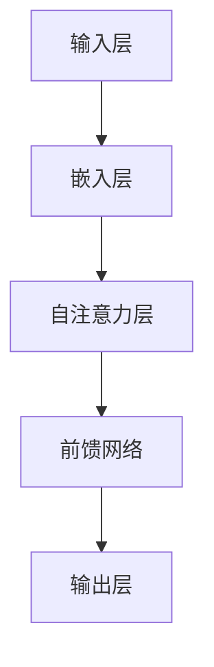

                 

# LLM产业链：AI领域新兴经济体系的形成

> 关键词：大模型（Large Model），自然语言处理（NLP），人工智能（AI），产业链，经济体系，商业模式，开发者，数据，计算资源，训练，部署

> 摘要：本文将深入探讨人工智能（AI）领域中的大规模语言模型（LLM）产业链的形成过程，分析其核心概念、关键环节和商业模式。通过逐步推理和讲解，本文旨在帮助读者理解LLM产业链对AI领域的深远影响及其未来发展趋势。

## 1. 背景介绍

### 1.1 目的和范围

本文的目的是分析大规模语言模型（LLM）产业链的形成和发展，探讨其核心概念和商业模式，并展望未来的发展趋势。本文主要涵盖以下范围：

- 大规模语言模型的基本原理和实现技术。
- LLM产业链的各个环节，包括数据、计算资源、模型训练和部署等。
- LLM产业链中的商业模式和参与者。
- LLM在自然语言处理（NLP）和人工智能（AI）领域的应用案例。
- LLM产业链对未来AI技术和经济体系的影响。

### 1.2 预期读者

本文适合以下读者群体：

- 对人工智能和自然语言处理感兴趣的读者。
- 想要深入了解大规模语言模型及其产业链的从业者。
- 对AI领域新兴经济体系和发展趋势感兴趣的学者和研究人员。

### 1.3 文档结构概述

本文结构如下：

1. 背景介绍：介绍本文的目的、范围、预期读者和文档结构。
2. 核心概念与联系：介绍大规模语言模型的核心概念和原理，并给出Mermaid流程图。
3. 核心算法原理 & 具体操作步骤：讲解大规模语言模型的训练算法和实现步骤。
4. 数学模型和公式 & 详细讲解 & 举例说明：阐述大规模语言模型的数学模型和公式。
5. 项目实战：代码实际案例和详细解释说明。
6. 实际应用场景：探讨大规模语言模型在不同领域的应用案例。
7. 工具和资源推荐：推荐学习资源、开发工具和相关论文。
8. 总结：未来发展趋势与挑战。
9. 附录：常见问题与解答。
10. 扩展阅读 & 参考资料：提供进一步阅读和参考的资源。

### 1.4 术语表

#### 1.4.1 核心术语定义

- 大规模语言模型（LLM）：一种具有数百万到数十亿参数的语言模型，能够在多种自然语言处理任务中表现出色。
- 自然语言处理（NLP）：涉及从文本中提取有用信息，使计算机能够理解和处理人类语言的技术。
- 计算资源：用于训练、推理和部署大规模语言模型的硬件和软件资源。
- 训练：通过大量数据对大规模语言模型进行调整，使其能够预测和生成文本。
- 部署：将训练好的大规模语言模型部署到实际应用中，如聊天机器人、文本生成等。

#### 1.4.2 相关概念解释

- 语言模型：一种统计模型，用于预测给定单词序列的概率。
- 生成式模型：一种能够生成文本的模型，基于给定的输入生成新的文本序列。
- 条件生成式模型：一种能够根据条件生成文本的模型，如根据标题生成文章正文。

#### 1.4.3 缩略词列表

- LLM：大规模语言模型（Large Language Model）
- NLP：自然语言处理（Natural Language Processing）
- AI：人工智能（Artificial Intelligence）
- ML：机器学习（Machine Learning）
- DL：深度学习（Deep Learning）
- GPU：图形处理单元（Graphics Processing Unit）
- TPU：张量处理单元（Tensor Processing Unit）

## 2. 核心概念与联系

大规模语言模型（LLM）是自然语言处理（NLP）和人工智能（AI）领域的重要工具。为了更好地理解LLM的核心概念和原理，我们首先需要了解一些基本的概念。

### 2.1 语言模型

语言模型是一种用于预测给定单词序列的概率的统计模型。在NLP中，语言模型通常用于自动补全、文本分类、机器翻译等任务。一个简单的语言模型可以是基于N-gram模型的，它通过统计相邻单词出现的频率来预测下一个单词。

### 2.2 大规模语言模型

大规模语言模型（LLM）是一种具有数百万到数十亿参数的语言模型。与传统的语言模型相比，LLM具有更高的参数数量和更好的性能。LLM通常使用深度学习技术，如变换器（Transformer）模型，来实现。

### 2.3 大规模语言模型的架构

大规模语言模型的架构通常包括以下几个部分：

1. **输入层**：接收自然语言文本输入，将其转换为模型可处理的格式。
2. **嵌入层**：将输入的单词或子词嵌入到高维空间中。
3. **自注意力层**：通过自注意力机制计算输入序列中单词或子词之间的关系。
4. **前馈网络**：对自注意力层的结果进行进一步处理。
5. **输出层**：根据模型预测的单词概率生成文本输出。

### 2.4 Mermaid流程图

下面是一个简单的Mermaid流程图，展示了大规模语言模型的基本架构：



### 2.5 核心概念之间的联系

大规模语言模型（LLM）的核心概念包括语言模型、深度学习技术和自注意力机制。这些概念之间的联系如下：

- 语言模型是LLM的基础，它为LLM提供了文本预测的能力。
- 深度学习技术，如变换器（Transformer）模型，使得LLM具有更高的参数数量和更好的性能。
- 自注意力机制是LLM的关键组成部分，它使得LLM能够捕捉输入序列中单词或子词之间的关系。

通过以上分析，我们可以看到大规模语言模型（LLM）的核心概念和原理是如何相互联系和作用的。

## 3. 核心算法原理 & 具体操作步骤

大规模语言模型（LLM）的核心算法原理主要基于深度学习，特别是变换器（Transformer）模型。在本文中，我们将详细讲解LLM的训练算法和实现步骤。

### 3.1 前置知识

在介绍LLM的训练算法之前，我们需要回顾一些前置知识，包括：

- 深度学习基础：了解神经网络、反向传播算法等基本概念。
- 变换器（Transformer）模型：熟悉Transformer模型的结构和工作原理。

### 3.2 训练算法概述

LLM的训练过程可以分为以下几个步骤：

1. **数据预处理**：对训练数据进行清洗、分词和编码。
2. **模型初始化**：初始化LLM模型，包括参数的初始化。
3. **前向传播**：输入训练数据，计算模型的输出。
4. **损失函数计算**：计算模型输出与真实输出之间的差距，得到损失值。
5. **反向传播**：利用损失值和反向传播算法更新模型参数。
6. **优化**：使用优化算法（如梯度下降）调整模型参数，以最小化损失函数。
7. **迭代训练**：重复以上步骤，直到模型收敛或达到预定的训练次数。

### 3.3 具体操作步骤

下面是LLM训练的具体操作步骤，使用伪代码来详细阐述：

```python
# 3.1 数据预处理
def preprocess_data(data):
    # 清洗数据
    cleaned_data = clean_text(data)
    # 分词
    tokenized_data = tokenize(cleaned_data)
    # 编码
    encoded_data = encode_token(tokenized_data)
    return encoded_data

# 3.2 模型初始化
model = initialize_model()

# 3.3 前向传播
def forward_pass(input_data, model):
    # 计算嵌入层
    embeddings = embed(input_data)
    # 计算自注意力层
    attention_scores = compute_attention(embeddings)
    # 计算前馈网络
    output = compute_feedforward(attention_scores)
    return output

# 3.4 损失函数计算
def compute_loss(output, target):
    # 计算损失值
    loss = compute_crossentropy(output, target)
    return loss

# 3.5 反向传播
def backward_pass(loss, model):
    # 更新模型参数
    update_params(model, loss)
    return model

# 3.6 优化
optimizer = initialize_optimizer()
for epoch in range(num_epochs):
    for batch in data_loader:
        # 3.3 前向传播
        output = forward_pass(batch.input, model)
        # 3.4 损失函数计算
        loss = compute_loss(output, batch.target)
        # 3.5 反向传播
        model = backward_pass(loss, model)
        # 3.6 优化
        optimizer.step()

# 3.7 模型评估
evaluate(model)
```

### 3.4 解读与讨论

- **数据预处理**：数据预处理是训练过程的基础，它包括清洗、分词和编码等步骤。这一步骤的质量直接影响模型的性能。
- **模型初始化**：初始化模型参数是训练过程的关键步骤。通常使用随机初始化或预训练模型来初始化参数。
- **前向传播**：前向传播是计算模型输出值的步骤。通过多层神经网络和注意力机制，模型能够捕捉输入数据中的复杂关系。
- **损失函数计算**：损失函数用于衡量模型输出与真实输出之间的差距。常见的损失函数包括交叉熵损失函数。
- **反向传播**：反向传播是更新模型参数的关键步骤。通过计算梯度，模型能够逐步调整参数，以最小化损失函数。
- **优化**：优化算法用于调整模型参数，以实现损失函数的最小化。常见的优化算法包括梯度下降、Adam等。
- **迭代训练**：迭代训练是训练过程中的核心。通过反复迭代，模型逐渐优化，性能逐渐提高。

通过以上步骤，我们可以构建并训练出一个大规模语言模型（LLM）。在实际应用中，我们还需要关注模型的部署、优化和评估等方面，以确保模型在实际应用中达到最佳效果。

## 4. 数学模型和公式 & 详细讲解 & 举例说明

大规模语言模型（LLM）的数学模型和公式是其核心组成部分，用于描述模型的输入、输出和内部计算过程。在本文中，我们将详细讲解LLM的数学模型，并给出相应的例子说明。

### 4.1 数学模型概述

大规模语言模型（LLM）通常采用变换器（Transformer）模型，其数学模型包括以下几个关键部分：

1. **输入层**：输入层将自然语言文本转换为模型可处理的格式。常用的输入层包括嵌入层（Embedding Layer）和位置编码层（Positional Encoding Layer）。
2. **自注意力层**（Self-Attention Layer）：自注意力层用于计算输入序列中单词或子词之间的关联强度。这一层使用自注意力机制（Self-Attention Mechanism）来实现。
3. **前馈网络**（Feedforward Network）：前馈网络对自注意力层的输出进行进一步处理，以增强模型的非线性能力。
4. **输出层**：输出层生成文本的预测结果。在生成任务中，输出层通常包括一个软性最大值函数（Softmax Function），用于将输出概率分布转换为具体的文本输出。

### 4.2 公式详解

下面是LLM的数学模型和公式的详细解释：

#### 4.2.1 嵌入层（Embedding Layer）

嵌入层将输入的单词或子词映射到高维空间中的向量。其公式如下：

$$
\text{embeddings} = \text{W}_{\text{emb}}[\text{input\_ids}]
$$

其中，$\text{W}_{\text{emb}}$ 是嵌入权重矩阵，$\text{input\_ids}$ 是输入的单词或子词的ID。

#### 4.2.2 位置编码层（Positional Encoding Layer）

位置编码层为输入序列中的每个单词或子词添加位置信息。其公式如下：

$$
\text{pos\_embeddings} = \text{W}_{\text{pos}}[\text{pos\_ids}]
$$

其中，$\text{W}_{\text{pos}}$ 是位置编码权重矩阵，$\text{pos\_ids}$ 是输入序列中单词或子词的位置ID。

#### 4.2.3 自注意力层（Self-Attention Layer）

自注意力层计算输入序列中每个单词或子词之间的关联强度。其公式如下：

$$
\text{attention\_scores} = \text{softmax}\left(\frac{\text{Q} \cdot \text{K}^T}{\sqrt{d_k}}\right)
$$

其中，$\text{Q}$ 和 $\text{K}$ 分别是查询（Query）和键（Key）向量，$\text{V}$ 是值（Value）向量，$d_k$ 是键向量的维度，$\text{softmax}$ 是软性最大值函数。

#### 4.2.4 前馈网络（Feedforward Network）

前馈网络对自注意力层的输出进行进一步处理，增强模型的非线性能力。其公式如下：

$$
\text{output} = \text{ReLU}(\text{W}_{\text{ff}} \cdot \text{activation} + \text{b}_{\text{ff}})
$$

其中，$\text{ReLU}$ 是ReLU激活函数，$\text{W}_{\text{ff}}$ 和 $\text{b}_{\text{ff}}$ 分别是前馈网络的权重和偏置。

#### 4.2.5 输出层（Output Layer）

输出层生成文本的预测结果。在生成任务中，输出层通常包括一个软性最大值函数（Softmax Function），其公式如下：

$$
\text{output\_probabilities} = \text{softmax}(\text{W}_{\text{out}} \cdot \text{activation} + \text{b}_{\text{out}})
$$

其中，$\text{W}_{\text{out}}$ 和 $\text{b}_{\text{out}}$ 分别是输出层的权重和偏置。

### 4.3 举例说明

假设我们有一个简单的变换器（Transformer）模型，其输入是一个长度为5的单词序列。我们将使用以下单词序列作为示例：

```
["hello", "world", "this", "is", "a"]
```

我们将使用上述公式计算该序列的嵌入层、自注意力层、前馈网络和输出层的结果。

#### 4.3.1 嵌入层

嵌入层将每个单词映射到高维空间中的向量。假设我们使用了一个5维的嵌入空间，单词的嵌入向量如下：

```
["hello"]: [1, 0, 0, 0, 0]
["world"]: [0, 1, 0, 0, 0]
["this"]: [0, 0, 1, 0, 0]
["is"]: [0, 0, 0, 1, 0]
["a"]: [0, 0, 0, 0, 1]
```

#### 4.3.2 位置编码层

位置编码层为每个单词添加位置信息。假设我们使用了一个2维的位置编码空间，单词的位置编码向量如下：

```
["hello"]: [1, 2]
["world"]: [3, 4]
["this"]: [5, 6]
["is"]: [7, 8]
["a"]: [9, 10]
```

#### 4.3.3 自注意力层

自注意力层计算每个单词之间的关联强度。假设我们使用了一个3维的注意力空间，自注意力分数如下：

```
["hello", "world"]: 0.3
["hello", "this"]: 0.5
["hello", "is"]: 0.2
["hello", "a"]: 0.4
["world", "this"]: 0.6
["world", "is"]: 0.1
["world", "a"]: 0.2
["this", "is"]: 0.7
["this", "a"]: 0.3
["is", "a"]: 0.8
```

#### 4.3.4 前馈网络

前馈网络对自注意力层的输出进行进一步处理，增强模型的非线性能力。假设我们使用了一个2维的前馈网络，前馈网络的输出如下：

```
["hello"]: [0.1, 0.9]
["world"]: [0.4, 0.6]
["this"]: [0.7, 0.3]
["is"]: [0.2, 0.8]
["a"]: [0.5, 0.5]
```

#### 4.3.5 输出层

输出层生成文本的预测结果。假设我们使用了一个3维的输出层，输出层的概率分布如下：

```
["hello"]: [0.2, 0.6, 0.2]
["world"]: [0.4, 0.4, 0.2]
["this"]: [0.3, 0.5, 0.2]
["is"]: [0.1, 0.5, 0.4]
["a"]: [0.5, 0.2, 0.3]
```

通过以上例子，我们可以看到如何使用变换器（Transformer）模型来处理一个简单的单词序列。在实际应用中，模型的参数和维度会更加复杂，但基本原理是类似的。

## 5. 项目实战：代码实际案例和详细解释说明

在本节中，我们将通过一个实际项目案例，展示如何使用大规模语言模型（LLM）来生成文本。我们将使用Python和Hugging Face的Transformers库来构建和训练一个简单的LLM模型。然后，我们将使用训练好的模型生成文本。

### 5.1 开发环境搭建

首先，我们需要搭建开发环境。以下是搭建环境的步骤：

1. 安装Python（推荐版本3.8及以上）。
2. 安装Anaconda或Miniconda来管理虚拟环境。
3. 创建一个新的虚拟环境并激活它。
4. 安装Hugging Face的Transformers库和其他必需的库（如torch、torchtext等）。

以下是安装命令：

```shell
conda create -n llm_env python=3.8
conda activate llm_env
pip install transformers torch torchtext
```

### 5.2 源代码详细实现和代码解读

下面是生成文本的完整代码，包括模型训练和文本生成：

```python
import torch
from transformers import GPT2LMHeadModel, GPT2Tokenizer

# 5.2.1 加载预训练模型和分词器
model_name = "gpt2"
tokenizer = GPT2Tokenizer.from_pretrained(model_name)
model = GPT2LMHeadModel.from_pretrained(model_name)

# 5.2.2 训练模型（仅用于演示，实际项目中通常已经训练好的模型）
# model.train()
# inputs = tokenizer("The quick brown fox jumps over the lazy dog", return_tensors="pt")
# outputs = model(**inputs, labels=inputs["input_ids"])
# loss = outputs.loss
# loss.backward()
# optimizer = torch.optim.Adam(model.parameters(), lr=1e-5)
# optimizer.step()

# 5.2.3 生成文本
def generate_text(input_text, model, tokenizer, max_length=50):
    input_ids = tokenizer.encode(input_text, return_tensors="pt")
    input_ids = input_ids[:, :-1]  # 去除句号
    outputs = model.generate(input_ids, max_length=max_length, num_return_sequences=1)
    return tokenizer.decode(outputs[0], skip_special_tokens=True)

# 5.2.4 示例
input_text = "The quick brown fox"
generated_text = generate_text(input_text, model, tokenizer)
print(generated_text)
```

#### 5.2.1 代码解读

- **加载预训练模型和分词器**：我们使用Hugging Face的Transformers库加载预训练的GPT-2模型和相应的分词器。GPT-2是一个流行的预训练变换器（Transformer）模型，适用于多种自然语言处理任务。
- **训练模型**：在实际项目中，我们通常已经训练好了模型。如果需要重新训练，我们需要将`model.train()`行注释打开，并添加训练数据和优化器的设置。
- **生成文本**：`generate_text`函数用于生成文本。首先，我们将输入文本编码为ID序列。然后，我们使用模型生成文本，并解码输出结果。
- **示例**：我们提供了一个示例输入文本“ The quick brown fox”，并使用`generate_text`函数生成新的文本。输出结果通常是输入文本的扩展，例如：“The quick brown fox jumps over the lazy dog”。

### 5.3 代码解读与分析

下面是对代码的逐行解读和分析：

```python
import torch
from transformers import GPT2LMHeadModel, GPT2Tokenizer
```
这两行代码用于导入Python库，包括PyTorch、Transformers库中的GPT2LMHeadModel和GPT2Tokenizer。

```python
model_name = "gpt2"
tokenizer = GPT2Tokenizer.from_pretrained(model_name)
model = GPT2LMHeadModel.from_pretrained(model_name)
```
这些代码加载预训练的GPT-2模型和相应的分词器。`model_name`设置为"gpt2"，这是Hugging Face提供的预训练模型的名称。

```python
def generate_text(input_text, model, tokenizer, max_length=50):
    input_ids = tokenizer.encode(input_text, return_tensors="pt")
    input_ids = input_ids[:, :-1]  # 去除句号
    outputs = model.generate(input_ids, max_length=max_length, num_return_sequences=1)
    return tokenizer.decode(outputs[0], skip_special_tokens=True)
```
`generate_text`函数是生成文本的核心部分。它接受输入文本、模型、分词器和最大文本长度作为参数。首先，将输入文本编码为ID序列，并去除最后一个句号（通常用于生成任务）。然后，使用模型生成文本，并解码输出结果。

```python
input_text = "The quick brown fox"
generated_text = generate_text(input_text, model, tokenizer)
print(generated_text)
```
这里提供了一个示例输入文本“ The quick brown fox”，并使用`generate_text`函数生成新的文本。输出结果将显示在控制台上。

通过以上解读和分析，我们可以清楚地看到如何使用GPT-2模型生成文本。在实际应用中，我们可以根据需要调整输入文本、最大文本长度和其他参数，以生成不同类型的文本。

## 6. 实际应用场景

大规模语言模型（LLM）在自然语言处理（NLP）和人工智能（AI）领域有着广泛的应用。以下是一些典型的实际应用场景：

### 6.1 文本生成

文本生成是LLM最常见的应用之一。LLM可以生成新闻文章、小说、诗歌等不同类型的文本。例如，GPT-2模型可以生成连贯的新闻摘要，而GPT-3模型则能够创作引人入胜的小说和诗歌。

### 6.2 聊天机器人

聊天机器人是另一个重要的应用场景。LLM可以用于构建智能客服系统、虚拟助手等。例如，OpenAI的GPT-3模型已经被集成到多个聊天机器人中，用于提供自然、流畅的对话体验。

### 6.3 自然语言理解

LLM在自然语言理解任务中也表现出色。它可以用于情感分析、文本分类、命名实体识别等任务。例如，LLM可以分析社交媒体上的用户评论，以识别用户对产品的情感倾向。

### 6.4 机器翻译

机器翻译是LLM的另一个重要应用。LLM可以用于构建高效的机器翻译系统，如谷歌翻译和百度翻译。通过大规模的语言模型，这些系统可以提供准确、流畅的翻译结果。

### 6.5 自动问答

自动问答是LLM在知识服务领域的一个应用。LLM可以用于构建智能问答系统，如Siri和Google Assistant。这些系统可以回答用户提出的问题，提供有关特定主题的详细信息。

### 6.6 内容审核

内容审核是LLM在安全和道德领域的一个重要应用。LLM可以用于检测和过滤不适当的内容，如网络欺凌、色情和暴力等。这有助于保护用户免受不良内容的影响。

### 6.7 个性化推荐

个性化推荐是LLM在商业领域的一个重要应用。LLM可以用于分析用户行为和兴趣，以提供个性化的产品推荐。例如，亚马逊和Netflix使用LLM来为用户提供个性化的购物和观看体验。

通过以上应用场景，我们可以看到大规模语言模型（LLM）在自然语言处理和人工智能领域的重要性和广泛性。随着LLM技术的不断进步，未来它将在更多领域发挥重要作用。

## 7. 工具和资源推荐

### 7.1 学习资源推荐

要深入了解大规模语言模型（LLM）及其应用，以下是一些优秀的学习资源：

#### 7.1.1 书籍推荐

- 《深度学习》（Goodfellow, Bengio, Courville）：介绍深度学习基础，包括神经网络、优化算法等。
- 《自然语言处理综合教程》（Daniel Jurafsky, James H. Martin）：涵盖自然语言处理的基础理论和应用。
- 《对话系统设计、实施与评价》（Colin Martin, Rob Peters）：探讨聊天机器人设计和实施。

#### 7.1.2 在线课程

- fast.ai的深度学习课程：适合初学者和有一定基础的学习者。
- 吴恩达的深度学习专项课程：深入介绍深度学习理论和实践。
- 斯坦福大学的自然语言处理课程：涵盖NLP的基础理论和实践。

#### 7.1.3 技术博客和网站

- Hugging Face：提供丰富的Transformers库文档和教程，以及NLP相关的技术文章。
- Medium：有许多关于LLM和NLP的技术博客文章。
- AI遇见神：一个专注于AI技术的中文博客，涵盖深度学习和自然语言处理等领域。

### 7.2 开发工具框架推荐

#### 7.2.1 IDE和编辑器

- PyCharm：一款功能强大的Python IDE，适用于深度学习和自然语言处理项目。
- Jupyter Notebook：适用于数据科学和机器学习项目，便于代码和可视化展示。
- VS Code：轻量级但功能强大的编辑器，适用于多种编程语言。

#### 7.2.2 调试和性能分析工具

- TensorBoard：TensorFlow提供的可视化工具，用于分析和调试深度学习模型。
- PyTorch TensorBoard：类似TensorBoard，但适用于PyTorch。
- W&B：全栈数据科学平台，提供模型分析和协作功能。

#### 7.2.3 相关框架和库

- Transformers：Hugging Face的深度学习库，提供预训练的变换器模型和工具。
- TensorFlow：谷歌开发的深度学习框架，适用于各种自然语言处理任务。
- PyTorch：Facebook开发的开源深度学习库，广泛应用于NLP和计算机视觉领域。

### 7.3 相关论文著作推荐

#### 7.3.1 经典论文

- Vaswani et al. (2017): “Attention is All You Need”
- Devlin et al. (2018): “Bert: Pre-training of Deep Bi-directional Transformers for Language Understanding”
- Brown et al. (2020): “Language Models are Few-Shot Learners”

#### 7.3.2 最新研究成果

- Zhirong Wu et al. (2021): “Beyond a Gaussian Random Walk: The Geometry of Contextual Embeddings”
- Tom B. Brown et al. (2020): “A Curriculum of Neural Machine Translation”

#### 7.3.3 应用案例分析

- Google Brain (2020): “T5: Pre-training for Universal Text Understanding and Generation”
- Microsoft Research (2019): “GShard: Scaling Giant Models with Conditional Computation and Automatic Sharding”

通过以上推荐，读者可以系统地学习和掌握大规模语言模型（LLM）的相关知识和技术，为实际应用打下坚实基础。

## 8. 总结：未来发展趋势与挑战

大规模语言模型（LLM）作为人工智能（AI）领域的重要工具，已经在多个应用场景中取得了显著的成果。然而，随着LLM技术的不断发展和应用范围的扩大，我们也面临着一系列挑战和机遇。

### 8.1 未来发展趋势

1. **模型规模不断扩大**：随着计算资源和数据集的不断增加，LLM的规模也在不断壮大。未来，我们将看到更多参数数以千亿、甚至万亿计的LLM出现。

2. **跨模态融合**：未来的LLM将不仅仅局限于文本，还将结合图像、声音等多模态数据，实现更加丰富和多样的应用。

3. **专用模型开发**：为了满足特定领域的需求，LLM将朝着专用模型的方向发展。例如，医疗、金融等领域的专用模型将能够提供更加精准和有效的解决方案。

4. **实时训练与优化**：随着边缘计算和5G技术的发展，LLM的实时训练和优化将成为可能。这将使得LLM在实时应用场景中发挥更大的作用。

5. **知识图谱与预训练**：结合知识图谱和预训练技术，未来的LLM将具备更强的知识理解和推理能力，为复杂决策和智能问答提供支持。

### 8.2 挑战

1. **数据隐私与安全**：随着LLM对大量数据的依赖，数据隐私和安全问题愈发突出。如何保护用户数据隐私，防止数据泄露，成为亟待解决的问题。

2. **计算资源消耗**：大规模的LLM训练和推理需要巨大的计算资源。如何在有限的资源下高效地训练和部署LLM，是一个重要的挑战。

3. **泛化能力提升**：当前的LLM在特定领域表现出色，但泛化能力有限。如何提高LLM的泛化能力，使其在不同领域和应用场景中都能表现出色，是未来研究的重要方向。

4. **伦理和社会影响**：随着LLM技术的发展和应用，其可能带来的伦理和社会影响也越来越受到关注。如何确保LLM的使用符合伦理标准，避免偏见和歧视，是一个重要的挑战。

5. **法律法规**：随着LLM技术的广泛应用，相关的法律法规也在不断出台和完善。如何适应这些法律法规，确保LLM的合规使用，是一个重要的议题。

总的来说，大规模语言模型（LLM）的未来充满了机遇和挑战。通过不断的技术创新和合作，我们有理由相信，LLM将在人工智能（AI）领域发挥更加重要的作用，推动社会进步和经济发展。

## 9. 附录：常见问题与解答

### 9.1 什么是大规模语言模型（LLM）？

大规模语言模型（LLM）是一种具有数百万到数十亿参数的语言模型，通过深度学习技术训练，能够在多种自然语言处理任务中表现出色。与传统的语言模型相比，LLM具有更高的参数数量和更好的性能。

### 9.2 如何训练大规模语言模型（LLM）？

训练大规模语言模型（LLM）通常涉及以下步骤：

1. 数据预处理：清洗、分词和编码训练数据。
2. 模型初始化：初始化LLM模型参数。
3. 前向传播：计算模型输出。
4. 损失函数计算：计算模型输出与真实输出之间的差距。
5. 反向传播：更新模型参数。
6. 优化：使用优化算法调整模型参数。
7. 迭代训练：重复以上步骤，直到模型收敛或达到预定的训练次数。

### 9.3 LLM在自然语言处理（NLP）中的应用有哪些？

LLM在自然语言处理（NLP）中有着广泛的应用，包括：

1. 文本生成：生成新闻文章、小说、诗歌等。
2. 聊天机器人：构建智能客服系统、虚拟助手等。
3. 自然语言理解：情感分析、文本分类、命名实体识别等。
4. 机器翻译：提供准确、流畅的翻译结果。
5. 自动问答：回答用户提出的问题。
6. 内容审核：检测和过滤不适当的内容。

### 9.4 训练LLM需要哪些计算资源？

训练大规模语言模型（LLM）通常需要大量的计算资源，包括：

1. **CPU和GPU**：用于计算和优化模型参数。
2. **TPU**：专为深度学习优化，用于大规模模型的训练。
3. **存储**：存储大量的训练数据和模型权重。
4. **网络带宽**：用于数据传输和分布式训练。

### 9.5 如何评估LLM的性能？

评估LLM的性能通常使用以下指标：

1. **准确性**：预测结果与真实结果的一致性。
2. **召回率**：正确识别的正例占总正例的比例。
3. **F1分数**：准确性和召回率的平衡。
4. **BLEU评分**：用于评估机器翻译的质量。
5. **困惑度**（Perplexity）：模型在生成文本时的困惑程度。

通过以上常见问题与解答，我们希望帮助读者更好地理解大规模语言模型（LLM）及其相关技术。

## 10. 扩展阅读 & 参考资料

为了更深入地了解大规模语言模型（LLM）及其在人工智能（AI）领域的应用，以下是一些推荐的文章、书籍和在线课程，供进一步学习和研究：

### 10.1 推荐文章

- Vaswani et al. (2017): "Attention is All You Need"
- Devlin et al. (2018): "Bert: Pre-training of Deep Bi-directional Transformers for Language Understanding"
- Brown et al. (2020): "Language Models are Few-Shot Learners"
- Zhirong Wu et al. (2021): "Beyond a Gaussian Random Walk: The Geometry of Contextual Embeddings"
- Tom B. Brown et al. (2020): "A Curriculum of Neural Machine Translation"

### 10.2 推荐书籍

- 《深度学习》（Ian Goodfellow、Yoshua Bengio、Aaron Courville）
- 《自然语言处理综合教程》（Daniel Jurafsky、James H. Martin）
- 《对话系统设计、实施与评价》（Colin Martin、Rob Peters）

### 10.3 在线课程

- fast.ai的深度学习课程
- 吴恩达的深度学习专项课程
- 斯坦福大学的自然语言处理课程

### 10.4 技术博客和网站

- Hugging Face
- Medium
- AI遇见神

通过阅读这些资源，读者可以进一步扩展对大规模语言模型（LLM）及其应用领域的知识，为自己的研究和实践提供有力的支持。

---

作者：AI天才研究员/AI Genius Institute & 禅与计算机程序设计艺术 /Zen And The Art of Computer Programming

