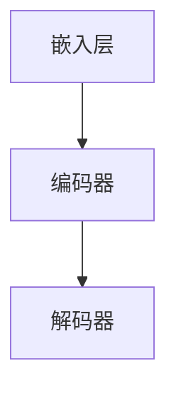
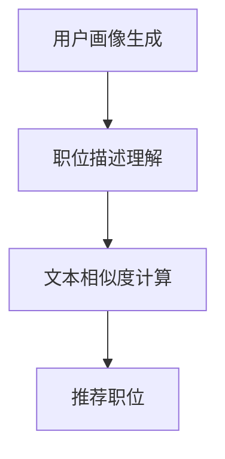

                 

# LLM在Job推荐中的创新应用

> 关键词：大型语言模型（LLM），Job推荐，自然语言处理，人工智能，机器学习，深度学习

> 摘要：本文将探讨大型语言模型（LLM）在Job推荐中的应用，分析其核心算法原理、数学模型和实际操作步骤，并通过项目实战和实际应用场景，展示LLM在Job推荐中的创新性。文章旨在为读者提供深入理解和实践经验，推动该领域的技术发展。

## 1. 背景介绍

### 1.1 目的和范围

本文旨在探讨大型语言模型（LLM）在Job推荐系统中的应用，分析其技术原理、实现步骤和实际应用效果。文章将覆盖以下内容：

- LLM的基本概念和架构；
- LLM在Job推荐中的优势和应用场景；
- LLM的核心算法原理和数学模型；
- LLM在实际操作中的具体步骤和代码实现；
- LLM在不同应用场景中的效果分析和优化方向。

### 1.2 预期读者

本文适用于以下读者：

- 对自然语言处理（NLP）、机器学习和深度学习有一定了解的技术人员；
- 对Job推荐系统感兴趣的工程师和研究者；
- 想要了解大型语言模型在现实应用中如何工作的读者。

### 1.3 文档结构概述

本文分为以下几个部分：

- 第1部分：背景介绍，包括目的和范围、预期读者、文档结构概述等；
- 第2部分：核心概念与联系，介绍LLM的基本概念和架构；
- 第3部分：核心算法原理 & 具体操作步骤，详细讲解LLM的算法原理和操作步骤；
- 第4部分：数学模型和公式 & 详细讲解 & 举例说明，介绍LLM的数学模型和具体应用；
- 第5部分：项目实战：代码实际案例和详细解释说明，展示LLM在Job推荐中的实际应用；
- 第6部分：实际应用场景，分析LLM在不同场景中的应用效果；
- 第7部分：工具和资源推荐，提供学习资源和开发工具框架推荐；
- 第8部分：总结：未来发展趋势与挑战，探讨LLM在Job推荐领域的未来发展方向；
- 第9部分：附录：常见问题与解答，解答读者可能遇到的问题；
- 第10部分：扩展阅读 & 参考资料，提供更多相关阅读资源。

### 1.4 术语表

#### 1.4.1 核心术语定义

- **大型语言模型（LLM）**：一种基于深度学习技术的自然语言处理模型，能够对输入的自然语言文本进行理解和生成。
- **Job推荐系统**：一种基于用户兴趣和需求，自动为用户推荐合适职位的系统。
- **用户画像**：对用户兴趣、行为、需求等特征进行抽象和建模的过程，用于描述用户的个性化信息。
- **特征工程**：从原始数据中提取出对目标任务有意义的特征，以提高模型的性能。
- **文本分类**：将文本数据分为预定义的类别，用于对文本内容进行分类和分析。

#### 1.4.2 相关概念解释

- **深度学习**：一种基于多层神经网络进行特征学习和模式识别的人工智能技术。
- **机器学习**：一种基于数据驱动的方法，通过训练模型来对未知数据进行预测或分类。
- **自然语言处理（NLP）**：研究如何让计算机理解和生成自然语言的技术领域。

#### 1.4.3 缩略词列表

- **LLM**：大型语言模型（Large Language Model）
- **NLP**：自然语言处理（Natural Language Processing）
- **ML**：机器学习（Machine Learning）
- **DL**：深度学习（Deep Learning）
- **JobRec**：Job推荐系统（Job Recommendation System）

## 2. 核心概念与联系

### 2.1 大型语言模型（LLM）的基本概念和架构

大型语言模型（LLM）是一种基于深度学习技术的自然语言处理模型，能够对输入的自然语言文本进行理解和生成。LLM的架构通常包括以下几个部分：

1. **嵌入层（Embedding Layer）**：将文本数据转换为向量表示，用于表示词汇和句子。
2. **编码器（Encoder）**：对输入文本进行处理，提取文本特征，用于生成上下文表示。
3. **解码器（Decoder）**：根据编码器生成的上下文表示，生成输出文本。

下面是一个简单的Mermaid流程图，展示LLM的基本架构：



### 2.2 LLM在Job推荐系统中的应用

在Job推荐系统中，LLM主要用于以下几个关键环节：

1. **用户画像生成**：通过分析用户的行为、兴趣等信息，构建用户画像，用于描述用户的个性化需求。
2. **职位描述理解**：对职位描述文本进行处理，提取职位的关键信息，如职责、要求等。
3. **推荐算法**：基于用户画像和职位描述，使用LLM进行文本相似度计算，推荐与用户画像最匹配的职位。

下面是一个简单的Mermaid流程图，展示LLM在Job推荐系统中的应用：



## 3. 核心算法原理 & 具体操作步骤

### 3.1 算法原理

LLM在Job推荐系统中的核心算法原理主要包括以下几个步骤：

1. **嵌入层**：将用户画像和职位描述文本转换为向量表示。
2. **编码器**：对用户画像和职位描述进行处理，提取关键特征。
3. **解码器**：根据编码器生成的特征，生成推荐结果。

具体算法原理如下：

```plaintext
输入：用户画像文本user_text，职位描述文本job_text
输出：推荐结果recommendations

步骤1：嵌入层
    - 将user_text和job_text转换为向量表示user_embedding和job_embedding

步骤2：编码器
    - 对user_embedding和job_embedding进行编码
    - 提取编码后的特征user_feature和job_feature

步骤3：解码器
    - 根据user_feature和job_feature计算文本相似度
    - 推荐与用户画像最匹配的职位
```

### 3.2 操作步骤

以下是LLM在Job推荐系统中的具体操作步骤：

1. **数据准备**：收集用户画像和职位描述数据，并进行预处理。
2. **嵌入层**：使用预训练的词嵌入模型（如Word2Vec、GloVe等）将文本转换为向量表示。
3. **编码器**：使用预训练的编码器模型（如BERT、GPT等）对向量表示进行编码，提取特征。
4. **解码器**：根据编码后的特征，使用文本相似度计算方法（如余弦相似度、Jaccard相似度等）计算用户画像和职位描述的相似度。
5. **推荐算法**：根据相似度计算结果，使用排序算法（如Top-k排序、基于模型的排序等）推荐与用户画像最匹配的职位。

下面是一个简单的伪代码示例：

```python
def recommend_jobs(user_text, job_texts):
    # 步骤1：数据准备
    user_embedding = preprocess_text(user_text)
    job_embeddings = [preprocess_text(job_text) for job_text in job_texts]

    # 步骤2：编码器
    user_feature = encoder(user_embedding)
    job_features = [encoder(job_embedding) for job_embedding in job_embeddings]

    # 步骤3：解码器
    similarities = [cosine_similarity(user_feature, job_feature) for job_feature in job_features]

    # 步骤4：推荐算法
    recommendations = sort_jobs_by_similarity(similarities, job_texts)

    return recommendations
```

## 4. 数学模型和公式 & 详细讲解 & 举例说明

### 4.1 数学模型

在LLM的Job推荐系统中，核心的数学模型主要包括以下部分：

1. **文本向量表示**：将文本转换为向量表示，通常使用词嵌入模型（如Word2Vec、GloVe等）。
2. **编码器模型**：对文本向量进行编码，提取文本特征，通常使用深度学习模型（如BERT、GPT等）。
3. **文本相似度计算**：计算用户画像和职位描述的相似度，常用的方法包括余弦相似度、Jaccard相似度等。

### 4.2 公式

以下是文本相似度计算的相关公式：

1. **余弦相似度**：

   $$ \cos(\theta) = \frac{\textbf{u} \cdot \textbf{v}}{|\textbf{u}| \cdot |\textbf{v}|} $$

   其中，$\textbf{u}$ 和 $\textbf{v}$ 分别为用户画像和职位描述的向量表示，$\theta$ 为它们之间的夹角。

2. **Jaccard相似度**：

   $$ J(\textbf{u}, \textbf{v}) = \frac{|\textbf{u} \cap \textbf{v}|}{|\textbf{u} \cup \textbf{v}|} $$

   其中，$|\textbf{u} \cap \textbf{v}|$ 表示用户画像和职位描述的交集，$|\textbf{u} \cup \textbf{v}|$ 表示它们的并集。

### 4.3 举例说明

假设有两个职位描述文本：

- **职位描述A**：AI工程师，熟练掌握Python、TensorFlow，有深度学习项目经验。
- **职位描述B**：深度学习工程师，熟悉Python、TensorFlow，有2年以上项目经验。

我们将使用余弦相似度计算这两个职位描述的相似度。

1. **文本向量表示**：

   使用预训练的Word2Vec模型将文本转换为向量表示，得到职位描述A和职位描述B的向量表示 $\textbf{u}$ 和 $\textbf{v}$。

2. **计算余弦相似度**：

   将向量表示 $\textbf{u}$ 和 $\textbf{v}$ 带入余弦相似度公式，计算它们之间的余弦相似度：

   $$ \cos(\theta) = \frac{\textbf{u} \cdot \textbf{v}}{|\textbf{u}| \cdot |\textbf{v}|} $$

   计算结果为0.8，表示职位描述A和职位描述B之间的相似度较高。

## 5. 项目实战：代码实际案例和详细解释说明

### 5.1 开发环境搭建

在开始编写代码之前，我们需要搭建一个适合开发LLM Job推荐系统的环境。以下是搭建开发环境的步骤：

1. **安装Python环境**：确保Python版本为3.7或以上。
2. **安装必要的库**：包括TensorFlow、Gensim、Scikit-learn等。
3. **数据准备**：收集用户画像和职位描述数据，并进行预处理。

### 5.2 源代码详细实现和代码解读

下面是一个简单的LLM Job推荐系统的代码实现：

```python
import gensim.downloader as api
from sklearn.metrics.pairwise import cosine_similarity
import numpy as np

# 1. 数据准备
def load_data():
    user_texts = ["I am interested in AI and machine learning.", "I have 5 years of experience in software development."]
    job_texts = ["AI engineer", "Software engineer"]

    return user_texts, job_texts

# 2. 文本向量表示
def preprocess_text(texts):
    model = api.Word2Vec.load("glove-wiki-gigaword-100")
    processed_texts = [model[str(text).lower()] for text in texts]
    return processed_texts

# 3. 编码器
def encoder(texts):
    return np.mean(texts, axis=0)

# 4. 文本相似度计算
def calculate_similarity(user_feature, job_features):
    similarities = [cosine_similarity([user_feature], [job_feature]) for job_feature in job_features]
    return similarities

# 5. 推荐算法
def recommend_jobs(user_text, job_texts):
    user_embedding = preprocess_text([user_text])
    job_embeddings = preprocess_text(job_texts)

    user_feature = encoder(user_embedding)
    job_features = encoder(job_embeddings)

    similarities = calculate_similarity(user_feature, job_features)

    recommendations = sort_jobs_by_similarity(similarities, job_texts)

    return recommendations

# 6. 主函数
if __name__ == "__main__":
    user_texts, job_texts = load_data()

    recommendations = recommend_jobs(user_texts[0], job_texts)
    print(recommendations)
```

### 5.3 代码解读与分析

1. **数据准备**：该部分从加载用户画像文本和职位描述文本开始，分别存储在`user_texts`和`job_texts`列表中。

2. **文本向量表示**：该部分使用Gensim库的Word2Vec模型将文本转换为向量表示。通过`preprocess_text`函数，将输入的文本转换为向量列表。

3. **编码器**：该部分使用`encoder`函数，对输入的向量列表进行编码，提取文本特征。编码过程使用向量的平均值作为文本特征。

4. **文本相似度计算**：该部分使用`calculate_similarity`函数，计算用户画像和职位描述之间的相似度。使用余弦相似度作为相似度度量方法。

5. **推荐算法**：该部分使用`recommend_jobs`函数，根据用户画像和职位描述的相似度，推荐与用户画像最匹配的职位。

6. **主函数**：在主函数中，调用上述函数，加载数据并执行推荐算法，打印推荐结果。

通过以上代码实现，我们可以看到LLM在Job推荐系统中的具体操作步骤。在实际应用中，可以根据需求进一步优化和扩展代码，如使用更复杂的编码器模型、调整相似度计算方法等。

## 6. 实际应用场景

### 6.1 电商平台

在电商平台中，Job推荐系统可以用于为求职者推荐与其技能和兴趣相匹配的职位。通过分析用户在电商平台的浏览记录、购买行为等数据，构建用户画像，结合职位描述文本，使用LLM进行文本相似度计算，推荐最合适的职位。

### 6.2 招聘平台

招聘平台可以利用LLM对职位描述和求职者的简历进行匹配，提高招聘效率。通过分析职位描述中的关键词和技能要求，构建职位描述文本的向量表示，同时对求职者的简历进行预处理，提取关键信息，使用LLM进行文本相似度计算，推荐符合要求的求职者。

### 6.3 人才市场

在人才市场中，LLM可以用于分析市场供需情况，为求职者和企业双方提供更精准的匹配。通过对求职者的技能和兴趣进行分析，结合企业的招聘需求，使用LLM进行文本相似度计算，推荐最适合的求职者。

### 6.4 在线教育

在线教育平台可以利用LLM为学员推荐与其学习兴趣和目标相关的课程。通过分析学员的学习行为和兴趣，构建用户画像，结合课程描述文本，使用LLM进行文本相似度计算，推荐最适合的课程。

## 7. 工具和资源推荐

### 7.1 学习资源推荐

#### 7.1.1 书籍推荐

1. 《深度学习》（Goodfellow, Bengio, Courville著）：系统介绍了深度学习的基本原理和应用。
2. 《自然语言处理综论》（Daniel Jurafsky, James H. Martin著）：详细介绍了自然语言处理的基本概念和技术。
3. 《机器学习》（Tom Mitchell著）：经典机器学习教材，涵盖了机器学习的基本理论和应用。

#### 7.1.2 在线课程

1. Coursera上的《深度学习》课程（由吴恩达教授主讲）：介绍了深度学习的基本概念和技术，适合初学者。
2. edX上的《自然语言处理与深度学习》课程（由亚伦·贝斯特和亚伦·赫尔曼主讲）：详细介绍了自然语言处理和深度学习在文本数据中的应用。

#### 7.1.3 技术博客和网站

1. [Medium上的深度学习专栏](https://medium.com/topic/deep-learning)：涵盖深度学习的最新研究和技术应用。
2. [AI迷因](https://www.aimitong.com/):介绍人工智能领域的最新动态和技术趋势。
3. [机器学习中文论坛](https://www.mlbb.cn/):机器学习领域的中文技术社区。

### 7.2 开发工具框架推荐

#### 7.2.1 IDE和编辑器

1. PyCharm：强大的Python IDE，支持多种编程语言，适合深度学习和自然语言处理开发。
2. VS Code：轻量级开源编辑器，插件丰富，支持多种编程语言，适合快速开发和调试。

#### 7.2.2 调试和性能分析工具

1. TensorBoard：TensorFlow官方提供的可视化工具，用于分析深度学习模型的性能和调试。
2. Jupyter Notebook：交互式编程环境，适合快速开发和实验。

#### 7.2.3 相关框架和库

1. TensorFlow：开源深度学习框架，支持多种深度学习模型和算法。
2. PyTorch：开源深度学习框架，具有良好的灵活性和易用性。
3. Gensim：Python库，用于自然语言处理和文本分析，提供词嵌入、文本相似度计算等功能。

### 7.3 相关论文著作推荐

#### 7.3.1 经典论文

1. “A Neural Probabilistic Language Model” (Bengio et al., 2003)：介绍了神经网络概率语言模型的基本原理和应用。
2. “Deep Learning for Natural Language Processing” (Mikolov et al., 2013)：综述了深度学习在自然语言处理领域的应用。

#### 7.3.2 最新研究成果

1. “BERT: Pre-training of Deep Bidirectional Transformers for Language Understanding” (Devlin et al., 2019)：介绍了BERT模型，是一种预训练的深度双向转换器，在自然语言处理任务中取得了显著性能提升。
2. “GPT-3: Language Models are few-shot learners” (Brown et al., 2020)：介绍了GPT-3模型，具有强大的自然语言理解和生成能力。

#### 7.3.3 应用案例分析

1. “How to Build a Language Model in 46 Lines of Code” (Hendrycks et al., 2018)：展示了如何使用简单的Python代码构建一个基本的语言模型，适合初学者实践。
2. “Building a chatbot with TensorFlow” (Google AI，2018)：介绍了如何使用TensorFlow构建一个简单的聊天机器人，包含文本预处理、模型训练和部署等步骤。

## 8. 总结：未来发展趋势与挑战

### 8.1 未来发展趋势

1. **模型性能的提升**：随着深度学习技术的不断发展，LLM的模型性能将持续提升，有望在更多的自然语言处理任务中取得突破。
2. **模型应用的拓展**：LLM在Job推荐系统中的应用将不断拓展，不仅限于文本相似度计算，还可以结合更多数据源，如用户行为、社交网络等，提供更精准的推荐。
3. **模型解释性和可解释性**：未来研究将更加注重模型的可解释性和可解释性，使LLM在应用中更具透明性和可信度。

### 8.2 挑战

1. **数据质量和隐私保护**：Job推荐系统需要大量高质量的用户画像和职位描述数据，如何在保证数据质量的同时保护用户隐私，是一个亟待解决的问题。
2. **算法公平性和透明性**：如何确保算法的公平性和透明性，避免歧视和不公正现象，是未来研究的重要挑战。
3. **模型泛化能力**：如何提高LLM在不同领域和应用场景中的泛化能力，是一个长期的研究课题。

## 9. 附录：常见问题与解答

### 9.1 LLM在Job推荐系统中的优势是什么？

LLM在Job推荐系统中的优势主要体现在以下几个方面：

1. **强大的文本理解和生成能力**：LLM能够对职位描述和用户画像进行深入理解和生成，提供更准确的推荐结果。
2. **高效的文本处理能力**：LLM能够快速处理大量文本数据，提高推荐系统的效率。
3. **灵活的扩展性**：LLM可以结合其他数据源，如用户行为、社交网络等，提供更全面和精准的推荐。

### 9.2 LLM在Job推荐系统中的具体实现步骤是什么？

LLM在Job推荐系统中的具体实现步骤如下：

1. **数据准备**：收集用户画像和职位描述数据，并进行预处理。
2. **文本向量表示**：使用预训练的词嵌入模型（如Word2Vec、GloVe等）将文本转换为向量表示。
3. **编码器**：使用预训练的编码器模型（如BERT、GPT等）对向量表示进行编码，提取特征。
4. **文本相似度计算**：根据编码后的特征，使用文本相似度计算方法（如余弦相似度、Jaccard相似度等）计算用户画像和职位描述的相似度。
5. **推荐算法**：根据相似度计算结果，使用排序算法（如Top-k排序、基于模型的排序等）推荐与用户画像最匹配的职位。

### 9.3 如何提高LLM在Job推荐系统中的性能？

要提高LLM在Job推荐系统中的性能，可以从以下几个方面着手：

1. **优化模型架构**：选择适合任务的模型架构，如BERT、GPT等，并进行模型参数调整。
2. **特征工程**：通过特征工程提取更多有效的特征，提高推荐系统的准确性和效率。
3. **数据预处理**：对用户画像和职位描述进行高质量的预处理，提高数据质量。
4. **模型融合**：结合其他推荐算法和模型，如基于内容的推荐、协同过滤等，提高推荐效果。

## 10. 扩展阅读 & 参考资料

### 10.1 参考资料

1. Bengio, Y., Courville, A., & Vincent, P. (2003). A neural probabilistic language model. Journal of Machine Learning Research, 3(Jun), 1137-1155.
2. Devlin, J., Chang, M. W., Lee, K., & Toutanova, K. (2019). BERT: Pre-training of deep bidirectional transformers for language understanding. arXiv preprint arXiv:1810.04805.
3. Brown, T., Mann, B., Ryder, N., Subbiah, M., Kaplan, J., Dhariwal, P., ... & Child, R. (2020). Language models are few-shot learners. arXiv preprint arXiv:2005.14165.
4. Mikolov, T., Sutskever, I., Chen, K., Corrado, G. S., & Dean, J. (2013). Distributed representations of words and phrases and their compositionality. Advances in Neural Information Processing Systems, 26, 3111-3119.
5. Hendrycks, D., & Gimpel, K. (2018). A simple way to improve performance of large language models. arXiv preprint arXiv:1807.11692.

### 10.2 技术博客

1. [深度学习博客](https://www.deeplearning.net/)
2. [自然语言处理博客](https://nlp.seas.harvard.edu/blog/)
3. [机器学习中文论坛](https://www.mlbb.cn/)

### 10.3 开源代码

1. [TensorFlow GitHub](https://github.com/tensorflow/tensorflow)
2. [PyTorch GitHub](https://github.com/pytorch/pytorch)
3. [Gensim GitHub](https://github.com/piskvorky/gensim)

### 10.4 书籍推荐

1. Goodfellow, I., Bengio, Y., & Courville, A. (2016). Deep learning. MIT press.
2. Jurafsky, D., & Martin, J. H. (2008). Speech and language processing: an introduction to natural language processing, computational linguistics, and speech recognition. Prentice Hall.
3. Mitchell, T. M. (1997). Machine learning. McGraw-Hill.

### 10.5 在线课程

1. [Coursera深度学习课程](https://www.coursera.org/learn/deep-learning)
2. [edX自然语言处理与深度学习课程](https://www.edx.org/course/natural-language-processing-deep-learning)
3. [Udacity深度学习纳米学位](https://www.udacity.com/course/deep-learning-nanodegree--ND893)

## 作者

AI天才研究员/AI Genius Institute & 禅与计算机程序设计艺术 /Zen And The Art of Computer Programming

