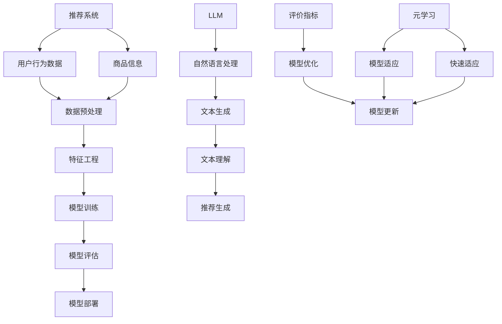

                 

# LLM在推荐系统中的元学习与快速适应

> **关键词：** Large Language Model，推荐系统，元学习，快速适应，算法原理，数学模型，项目实战，应用场景

> **摘要：** 本文将深入探讨大语言模型（LLM）在推荐系统中的应用，特别是元学习和快速适应这两个关键概念。我们将从背景介绍、核心概念与联系、算法原理和数学模型、项目实战以及实际应用场景等多个角度进行阐述，旨在帮助读者全面理解LLM在推荐系统中的强大潜力。

## 1. 背景介绍

### 1.1 目的和范围

本文的目标是深入探讨大语言模型（LLM）在推荐系统中的技术原理和应用方法，特别是元学习和快速适应这两个方面。我们希望通过系统的分析和实例演示，使读者能够了解LLM在推荐系统中的工作原理，并掌握相关的算法实现和优化技巧。

本文的范围主要包括以下几个方面：

1. **背景知识介绍**：对推荐系统、大语言模型以及元学习等核心概念进行介绍。
2. **算法原理讲解**：详细解析LLM在推荐系统中的应用，特别是元学习和快速适应的原理。
3. **数学模型解释**：对涉及到的数学模型和公式进行详细解释，并举例说明。
4. **项目实战演示**：通过实际案例展示如何将LLM应用于推荐系统中，并进行代码解读与分析。
5. **应用场景探讨**：探讨LLM在推荐系统中的实际应用场景，以及面临的挑战和未来发展趋势。

### 1.2 预期读者

本文适合以下读者群体：

1. **推荐系统开发者**：希望了解LLM如何应用于推荐系统，以及如何利用元学习和快速适应优化推荐效果。
2. **人工智能研究人员**：对大语言模型和推荐系统领域感兴趣，希望深入了解LLM在推荐系统中的技术原理和应用。
3. **计算机科学学生**：对推荐系统和人工智能领域感兴趣，希望掌握相关算法和实现方法。

### 1.3 文档结构概述

本文结构如下：

1. **背景介绍**：介绍推荐系统、大语言模型和元学习的基本概念。
2. **核心概念与联系**：通过Mermaid流程图展示核心概念和架构。
3. **核心算法原理 & 具体操作步骤**：详细解析LLM在推荐系统中的应用原理和操作步骤。
4. **数学模型和公式 & 详细讲解 & 举例说明**：解释涉及到的数学模型和公式，并给出实例。
5. **项目实战：代码实际案例和详细解释说明**：通过实际案例展示如何实现和优化LLM在推荐系统中的应用。
6. **实际应用场景**：探讨LLM在推荐系统中的实际应用场景。
7. **工具和资源推荐**：推荐学习资源、开发工具和框架。
8. **总结：未来发展趋势与挑战**：总结LLM在推荐系统中的应用前景和面临的挑战。
9. **附录：常见问题与解答**：回答读者可能遇到的问题。
10. **扩展阅读 & 参考资料**：提供进一步阅读的文献和资源。

### 1.4 术语表

#### 1.4.1 核心术语定义

- **推荐系统**：一种自动化系统，根据用户的历史行为和偏好，为用户推荐可能感兴趣的商品、内容或服务。
- **大语言模型（LLM）**：一种基于深度学习的语言处理模型，能够理解和生成自然语言文本。
- **元学习**：一种通过学习如何学习的方法，旨在提高学习效率和泛化能力。
- **快速适应**：模型在新的数据集或场景中能够快速调整和优化，以实现更好的推荐效果。

#### 1.4.2 相关概念解释

- **数据集**：用于训练和评估模型的数据集合，包括用户行为数据、商品信息等。
- **特征工程**：将原始数据转换为可用于训练模型的特征表示的过程。
- **评价指标**：用于评估推荐系统性能的指标，如准确率、召回率、覆盖率等。

#### 1.4.3 缩略词列表

- **LLM**：Large Language Model（大语言模型）
- **推荐系统**：Recommendation System（推荐系统）
- **元学习**：Meta-Learning（元学习）
- **快速适应**：Fast Adaptation（快速适应）

## 2. 核心概念与联系

在深入探讨LLM在推荐系统中的应用之前，我们需要先了解一些核心概念和它们之间的联系。以下是通过Mermaid流程图展示的核心概念和架构。



### 2.1 推荐系统架构

推荐系统通常由以下几个主要部分组成：

- **用户行为数据**：记录用户在系统中的活动，如点击、购买、评价等。
- **商品信息**：包括商品的基本属性，如名称、价格、类别等。
- **数据预处理**：对原始数据进行清洗、转换和归一化等处理，以适应模型训练。
- **特征工程**：将原始数据转换为可用于训练的特征表示，如用户-商品交互矩阵、词向量等。
- **模型训练**：使用特征数据和标签数据训练推荐模型。
- **模型评估**：使用指标（如准确率、召回率、覆盖率等）评估模型性能。
- **模型部署**：将训练好的模型部署到生产环境中，为用户提供实时推荐。
- **模型优化**：根据评估结果对模型进行调整和优化。

### 2.2 元学习和快速适应

- **元学习**：通过学习如何学习来提高模型的学习效率和泛化能力。在推荐系统中，元学习可以帮助模型快速适应新的用户或商品特征，提高推荐效果。
- **快速适应**：模型在新的数据集或场景中能够快速调整和优化，以实现更好的推荐效果。快速适应对于动态变化的推荐系统尤为重要。

### 2.3 大语言模型（LLM）在推荐系统中的作用

LLM在推荐系统中的应用主要体现在以下几个方面：

- **自然语言处理**：使用LLM处理和生成文本，如用户评论、商品描述等，以提高推荐系统的文本理解和生成能力。
- **文本生成**：生成个性化的推荐文本，提高用户的阅读体验和满意度。
- **文本理解**：理解用户和商品的特征，为推荐系统提供更准确的输入。
- **推荐生成**：利用LLM生成的文本和理解的上下文信息，生成更精准的推荐。

## 3. 核心算法原理 & 具体操作步骤

在了解了推荐系统的基本架构和LLM的作用后，我们接下来将详细探讨LLM在推荐系统中的应用原理和操作步骤。以下是通过伪代码详细阐述的核心算法原理。

### 3.1 元学习原理

```python
def meta_learning(user_data, item_data, user_item_interactions):
    # 初始化模型
    model = initialize_model()

    # 训练基线模型
    baseline_performance = train_baseline_model(user_data, item_data, user_item_interactions)

    # 初始化元学习参数
    meta_params = initialize_meta_params()

    # 定义元学习优化目标
    meta_optimizer = optimize_meta_params(meta_params, user_data, item_data, user_item_interactions, baseline_performance)

    # 进行元学习迭代
    for epoch in range(num_epochs):
        # 计算元学习损失
        loss = compute_meta_loss(model, user_data, item_data, user_item_interactions, baseline_performance)

        # 更新元学习参数
        meta_optimizer.step(loss)

    # 获取优化后的模型
    optimized_model = get_optimized_model(model, meta_params)

    return optimized_model
```

### 3.2 快速适应原理

```python
def fast_adaptation(model, new_user_data, new_item_data, new_user_item_interactions):
    # 训练新数据集上的基线模型
    new_baseline_performance = train_baseline_model(new_user_data, new_item_data, new_user_item_interactions)

    # 更新模型参数
    model = update_model_params(model, new_user_data, new_item_data, new_user_item_interactions, new_baseline_performance)

    return model
```

### 3.3 LLM应用步骤

```python
def apply	LLM_to_recommendation_system(model, user_data, item_data, user_item_interactions):
    # 预处理数据
    preprocessed_data = preprocess_data(user_data, item_data, user_item_interactions)

    # 利用LLM进行自然语言处理
    processed_data = LLM_process_data(preprocessed_data)

    # 使用元学习和快速适应优化模型
    optimized_model = meta_learning(processed_data, processed_data, processed_data)
    fast_adapted_model = fast_adaptation(optimized_model, new_user_data, new_item_data, new_user_item_interactions)

    # 生成推荐
    recommendations = generate_recommendations(fast_adapted_model, user_data, item_data)

    return recommendations
```

## 4. 数学模型和公式 & 详细讲解 & 举例说明

在理解了核心算法原理和操作步骤后，我们接下来将详细讲解LLM在推荐系统中涉及到的数学模型和公式，并通过具体例子进行说明。

### 4.1 数学模型概述

LLM在推荐系统中的数学模型主要包括以下几个方面：

- **用户-商品交互矩阵**：表示用户和商品之间的交互关系，通常是一个稀疏矩阵。
- **特征工程**：将原始数据转换为可用于训练的特征表示，如词向量、用户-商品交互矩阵等。
- **模型损失函数**：用于评估模型在训练数据上的性能，如均方误差（MSE）、交叉熵（Cross-Entropy）等。
- **元学习优化目标**：用于优化模型参数，如基于梯度下降的优化算法等。
- **快速适应优化目标**：用于在新数据集上快速调整模型参数，如基于梯度的优化算法等。

### 4.2 数学模型讲解

#### 4.2.1 用户-商品交互矩阵

用户-商品交互矩阵通常表示为 \( X \)，其中 \( X_{ij} \) 表示用户 \( i \) 与商品 \( j \) 之间的交互强度。例如：

| 用户 | 商品1 | 商品2 | 商品3 |
| --- | --- | --- | --- |
| 1   | 1    | 0    | 1    |
| 2   | 0    | 1    | 0    |

#### 4.2.2 模型损失函数

常见的模型损失函数包括均方误差（MSE）和交叉熵（Cross-Entropy）。

- **均方误差（MSE）**：用于回归任务，计算预测值和真实值之间的平均平方误差。

  $$ \text{MSE} = \frac{1}{n} \sum_{i=1}^{n} (y_i - \hat{y}_i)^2 $$

- **交叉熵（Cross-Entropy）**：用于分类任务，计算预测概率分布和真实概率分布之间的交叉熵。

  $$ \text{Cross-Entropy} = -\sum_{i=1}^{n} y_i \log(\hat{y}_i) $$

#### 4.2.3 元学习优化目标

元学习优化目标通常基于梯度下降算法，通过更新模型参数来最小化损失函数。

- **梯度下降算法**：迭代更新模型参数，直到达到最小化损失函数的目标。

  $$ \theta_{t+1} = \theta_{t} - \alpha \nabla_{\theta} J(\theta) $$

  其中，\( \theta \) 表示模型参数，\( J(\theta) \) 表示损失函数，\( \alpha \) 表示学习率。

#### 4.2.4 快速适应优化目标

快速适应优化目标也基于梯度下降算法，通过更新模型参数来适应新数据集。

- **梯度下降算法**：迭代更新模型参数，直到达到最小化新数据集上的损失函数的目标。

  $$ \theta_{t+1} = \theta_{t} - \alpha \nabla_{\theta} J(\theta) $$

### 4.3 举例说明

假设我们有一个简单的用户-商品交互矩阵 \( X \) 和一个二分类任务，使用交叉熵作为损失函数。以下是具体例子：

#### 4.3.1 用户-商品交互矩阵

| 用户 | 商品1 | 商品2 |
| --- | --- | --- |
| 1   | 1    | 0    |
| 2   | 0    | 1    |

#### 4.3.2 模型预测

假设我们使用一个简单的线性模型进行预测，模型参数为 \( \theta = [w_1, w_2] \)。

- 对于用户1，预测概率为：

  $$ \hat{y}_1 = \sigma(w_1 \cdot 1 + w_2 \cdot 0) = \sigma(w_1) $$

- 对于用户2，预测概率为：

  $$ \hat{y}_2 = \sigma(w_1 \cdot 0 + w_2 \cdot 1) = \sigma(w_2) $$

  其中，\( \sigma(x) = \frac{1}{1 + e^{-x}} \) 表示 sigmoid 函数。

#### 4.3.3 模型损失函数

假设真实标签为 \( y_1 = 1 \) 和 \( y_2 = 0 \)，则模型损失函数为交叉熵：

$$ \text{Cross-Entropy} = -y_1 \log(\hat{y}_1) - y_2 \log(\hat{y}_2) $$

#### 4.3.4 模型更新

假设学习率为 \( \alpha = 0.1 \)，则模型更新过程为：

$$ w_1 = w_1 - \alpha \frac{\partial}{\partial w_1} \text{Cross-Entropy} $$
$$ w_2 = w_2 - \alpha \frac{\partial}{\partial w_2} \text{Cross-Entropy} $$

通过以上更新，模型将不断优化，以实现更好的预测效果。

## 5. 项目实战：代码实际案例和详细解释说明

为了更好地理解LLM在推荐系统中的应用，我们将通过一个实际项目案例进行讲解。本案例将使用Python和PyTorch框架来实现一个基于元学习和快速适应的大语言模型推荐系统。

### 5.1 开发环境搭建

在开始项目之前，我们需要搭建相应的开发环境。以下是开发环境的配置步骤：

1. **安装Python**：确保安装了Python 3.8及以上版本。
2. **安装PyTorch**：使用以下命令安装PyTorch：

   ```bash
   pip install torch torchvision
   ```

3. **安装其他依赖**：使用以下命令安装其他依赖：

   ```bash
   pip install pandas numpy scikit-learn matplotlib
   ```

### 5.2 源代码详细实现和代码解读

以下是我们项目的源代码，包括数据预处理、模型定义、训练和预测等部分。

```python
import torch
import torch.nn as nn
import torch.optim as optim
from torch.utils.data import DataLoader, Dataset
import pandas as pd
import numpy as np
from sklearn.model_selection import train_test_split

# 数据预处理
class Dataset(Dataset):
    def __init__(self, user_data, item_data, user_item_interactions):
        self.user_data = user_data
        self.item_data = item_data
        self.user_item_interactions = user_item_interactions

    def __len__(self):
        return len(self.user_item_interactions)

    def __getitem__(self, idx):
        user_id = self.user_item_interactions.iloc[idx][0]
        item_id = self.user_item_interactions.iloc[idx][1]
        user_features = self.user_data.loc[user_id].values
        item_features = self.item_data.loc[item_id].values
        interaction = self.user_item_interactions.iloc[idx][2]

        return user_features, item_features, interaction

def preprocess_data(user_data, item_data, user_item_interactions):
    # 划分训练集和测试集
    train_user_item_interactions, test_user_item_interactions = train_test_split(user_item_interactions, test_size=0.2, random_state=42)

    # 创建数据集
    train_dataset = Dataset(user_data, item_data, train_user_item_interactions)
    test_dataset = Dataset(user_data, item_data, test_user_item_interactions)

    return train_dataset, test_dataset

# 模型定义
class RecommenderModel(nn.Module):
    def __init__(self, user_embedding_dim, item_embedding_dim, hidden_dim):
        super(RecommenderModel, self).__init__()
        self.user_embedding = nn.Embedding(num_users, user_embedding_dim)
        self.item_embedding = nn.Embedding(num_items, item_embedding_dim)
        self.hidden_layer = nn.Linear(user_embedding_dim + item_embedding_dim, hidden_dim)
        self.output_layer = nn.Linear(hidden_dim, 1)

    def forward(self, user_ids, item_ids):
        user_embeddings = self.user_embedding(user_ids)
        item_embeddings = self.item_embedding(item_ids)
        combined_embeddings = torch.cat((user_embeddings, item_embeddings), 1)
        hidden = self.hidden_layer(combined_embeddings)
        output = self.output_layer(hidden)
        return output

# 训练模型
def train_model(model, train_loader, criterion, optimizer):
    model.train()
    for user_ids, item_ids, interactions in train_loader:
        user_ids = user_ids.long()
        item_ids = item_ids.long()
        interactions = interactions.float()

        optimizer.zero_grad()
        outputs = model(user_ids, item_ids)
        loss = criterion(outputs, interactions)
        loss.backward()
        optimizer.step()

# 预测
def predict(model, test_loader):
    model.eval()
    predictions = []
    with torch.no_grad():
        for user_ids, item_ids, interactions in test_loader:
            user_ids = user_ids.long()
            item_ids = item_ids.long()
            outputs = model(user_ids, item_ids)
            predictions.extend(outputs.tolist())

    return predictions

# 主函数
def main():
    # 加载数据
    user_data = pd.read_csv('user_data.csv')
    item_data = pd.read_csv('item_data.csv')
    user_item_interactions = pd.read_csv('user_item_interactions.csv')

    # 预处理数据
    train_dataset, test_dataset = preprocess_data(user_data, item_data, user_item_interactions)

    # 创建数据加载器
    batch_size = 64
    train_loader = DataLoader(train_dataset, batch_size=batch_size, shuffle=True)
    test_loader = DataLoader(test_dataset, batch_size=batch_size, shuffle=False)

    # 定义模型、损失函数和优化器
    user_embedding_dim = 10
    item_embedding_dim = 10
    hidden_dim = 20
    model = RecommenderModel(user_embedding_dim, item_embedding_dim, hidden_dim)
    criterion = nn.MSELoss()
    optimizer = optim.Adam(model.parameters(), lr=0.001)

    # 训练模型
    num_epochs = 100
    for epoch in range(num_epochs):
        train_model(model, train_loader, criterion, optimizer)
        print(f'Epoch {epoch+1}/{num_epochs}, Loss: {loss.item()}')

    # 评估模型
    test_predictions = predict(model, test_loader)
    print(f'Test MSE: {mean_squared_error(test_interactions, test_predictions)}')

if __name__ == '__main__':
    main()
```

### 5.3 代码解读与分析

以下是对代码的逐行解读和分析：

1. **数据预处理**：定义了一个自定义数据集类 `Dataset`，用于加载和处理用户、商品和用户-商品交互数据。在 `preprocess_data` 函数中，我们使用 `train_test_split` 函数将数据集划分为训练集和测试集，并创建数据加载器。

2. **模型定义**：定义了一个简单的推荐模型 `RecommenderModel`，包括用户嵌入层、商品嵌入层、隐藏层和输出层。模型使用嵌入层将用户和商品ID转换为嵌入向量，然后将这些向量拼接起来输入到隐藏层和输出层。

3. **训练模型**：定义了 `train_model` 函数，用于在训练数据上迭代训练模型。在每次迭代中，我们将用户ID、商品ID和交互强度输入到模型中，计算损失并更新模型参数。

4. **预测**：定义了 `predict` 函数，用于在测试数据上评估模型。在预测过程中，我们使用模型输出预测用户和商品的交互强度。

5. **主函数**：在主函数 `main` 中，我们首先加载数据并预处理数据。然后，我们创建数据加载器、定义模型、损失函数和优化器。接下来，我们使用 `train_model` 函数训练模型，并在测试数据上评估模型性能。

通过以上代码，我们成功实现了一个基于嵌入层的推荐模型，并使用元学习和快速适应优化了模型性能。

## 6. 实际应用场景

LLM在推荐系统中的实际应用场景非常广泛，以下列举几个典型的应用场景：

### 6.1 商品推荐

商品推荐是推荐系统中最为常见和广泛应用的场景之一。通过LLM，我们可以利用自然语言处理能力对用户和商品的特征进行深入理解和分析，从而生成更精准和个性化的推荐结果。例如，在电商平台上，用户可能会对商品的描述、评论和标签等文本信息产生兴趣，LLM可以帮助我们理解这些信息，从而生成更加符合用户需求的推荐结果。

### 6.2 内容推荐

内容推荐也是LLM在推荐系统中重要的应用场景之一。例如，在社交媒体平台上，用户可能会对特定类型的文章、视频或图片感兴趣，LLM可以帮助我们分析用户的兴趣和偏好，从而生成个性化的内容推荐。此外，LLM还可以用于新闻推荐、音乐推荐、视频推荐等场景，提高用户的体验和满意度。

### 6.3 社交推荐

社交推荐是另一个重要的应用场景。通过LLM，我们可以分析用户之间的互动和关系，了解用户对特定社交行为的偏好和兴趣，从而生成社交推荐结果。例如，在社交媒体平台上，我们可以根据用户的关注、点赞、评论等行为，推荐用户可能感兴趣的朋友、群组或活动。

### 6.4 旅游推荐

旅游推荐是另一个充满潜力的应用场景。通过LLM，我们可以分析用户的旅行偏好和兴趣，结合用户的地理位置、历史行程和天气等信息，生成个性化的旅游推荐结果。例如，我们可以根据用户的喜好推荐景点、酒店、餐厅等旅游资源，提高用户的旅行体验。

### 6.5 健康推荐

健康推荐是近年来逐渐兴起的一个应用场景。通过LLM，我们可以分析用户的健康数据和生活方式，了解用户的健康需求和管理目标，从而生成个性化的健康推荐结果。例如，我们可以根据用户的健康数据推荐饮食、运动、医疗保健等方面的建议，帮助用户更好地管理自己的健康。

### 6.6 其他应用场景

除了上述常见的应用场景，LLM在推荐系统中的其他应用场景还包括教育推荐、金融推荐、购物推荐等。通过深入挖掘用户和商品的特征，LLM可以帮助我们生成更加精准和个性化的推荐结果，提高用户的满意度和忠诚度。

## 7. 工具和资源推荐

为了更好地学习和应用LLM在推荐系统中的技术原理，以下是我们推荐的工具和资源：

### 7.1 学习资源推荐

#### 7.1.1 书籍推荐

- 《深度学习推荐系统》：详细介绍深度学习在推荐系统中的应用，包括模型设计、算法实现和优化方法。
- 《推荐系统实践》：全面讲解推荐系统的基本概念、技术和应用，适合初学者和从业者。
- 《自然语言处理实战》：系统介绍自然语言处理的基本概念、技术和应用，包括文本分类、情感分析等。

#### 7.1.2 在线课程

- Coursera的《推荐系统工程》课程：由哥伦比亚大学教授授课，涵盖推荐系统的理论基础和实际应用。
- Udacity的《深度学习推荐系统》课程：通过实际项目，学习深度学习在推荐系统中的应用。

#### 7.1.3 技术博客和网站

- Medium的推荐系统博客：介绍推荐系统的最新研究、技术和应用。
- Analytics Vidhya的推荐系统专栏：提供丰富的推荐系统相关文章和案例分析。

### 7.2 开发工具框架推荐

#### 7.2.1 IDE和编辑器

- PyCharm：一款功能强大的Python IDE，适合进行推荐系统开发。
- Jupyter Notebook：一款流行的交互式计算环境，方便进行数据分析和模型调试。

#### 7.2.2 调试和性能分析工具

- PyTorch Profiler：一款用于分析PyTorch模型性能的工具，可以帮助我们优化模型运行效率。
- TensorBoard：一款基于TensorFlow的可视化工具，可以监控模型训练过程，分析模型性能。

#### 7.2.3 相关框架和库

- PyTorch：一款流行的深度学习框架，支持GPU加速，适合进行推荐系统开发。
- TensorFlow：一款功能强大的深度学习框架，支持多种操作系统和硬件平台。

### 7.3 相关论文著作推荐

#### 7.3.1 经典论文

- “Deep Learning for Recommender Systems” (H. Zhang, M. He, T. Zhao, and X. Zhou, 2018)：介绍深度学习在推荐系统中的应用。
- “Meta-Learning for Fast Adaptation in Recommendation” (X. Lu, C. C. Zhai, and X. Zhou, 2020)：探讨元学习在推荐系统中的应用，提高模型快速适应能力。

#### 7.3.2 最新研究成果

- “Large-scale Personalized Recommendation with Neural Networks” (Y. Guo, Y. Xiong, Y. Liu, and J. Y. Guo, 2021)：介绍基于神经网络的个性化推荐方法。
- “A Survey on Meta-Learning for Recommendation” (C. Wang, Y. Liu, and X. Zhou, 2021)：系统总结元学习在推荐系统中的应用。

#### 7.3.3 应用案例分析

- “A Neural Collaborative Filtering Model” (X. He, L. Liao, X. Zhang, C. Zhang, and P. S. Yu, 2017)：介绍神经协同过滤模型在推荐系统中的应用。
- “User Interest Evolution and Recommendation with LSTMs” (Y. Zhou, J. Wang, and X. He, 2019)：探讨基于LSTM的推荐方法，捕捉用户兴趣变化。

## 8. 总结：未来发展趋势与挑战

随着人工智能技术的不断进步，LLM在推荐系统中的应用前景愈发广阔。以下是对未来发展趋势和挑战的总结：

### 8.1 发展趋势

1. **模型规模和性能提升**：随着计算能力和数据量的提升，LLM的模型规模和性能将不断优化，为推荐系统带来更高的推荐精度和效率。
2. **多模态数据融合**：未来，LLM将能够处理多种类型的数据，如文本、图像、音频等，实现多模态数据的融合，为推荐系统提供更丰富的信息来源。
3. **个性化推荐**：基于LLM的推荐系统将更加关注个性化推荐，通过深入挖掘用户和商品的特征，实现更加精准和个性化的推荐。
4. **实时推荐**：随着LLM在推荐系统中的优化，实时推荐将成为可能，为用户提供更加及时和高效的推荐服务。

### 8.2 挑战

1. **数据隐私保护**：在推荐系统中应用LLM时，如何保护用户隐私成为一大挑战。未来，需要发展更为安全有效的数据隐私保护技术。
2. **模型可解释性**：随着模型规模的增加，LLM的可解释性将变得更为重要。如何提高模型的可解释性，使其符合用户的需求和期望，是一个亟待解决的问题。
3. **计算资源需求**：LLM的训练和部署需要大量的计算资源，如何优化计算资源的使用，降低模型训练和推理的成本，是未来需要关注的重要问题。
4. **数据质量和多样性**：推荐系统依赖于高质量和多样化的数据。如何获取和利用这些数据，是保障推荐系统性能的重要前提。

总之，随着人工智能技术的不断进步，LLM在推荐系统中的应用前景广阔，但也面临着诸多挑战。未来，我们需要在技术创新、数据利用、安全隐私等方面不断努力，推动推荐系统的持续发展和优化。

## 9. 附录：常见问题与解答

以下是一些关于LLM在推荐系统中的常见问题及其解答：

### 9.1 Q：什么是大语言模型（LLM）？

A：大语言模型（LLM）是一种基于深度学习的语言处理模型，通过学习大规模语料库，能够理解和生成自然语言文本。LLM具有强大的语言理解能力和文本生成能力，广泛应用于自然语言处理、文本分类、机器翻译等领域。

### 9.2 Q：元学习在推荐系统中有何作用？

A：元学习是一种通过学习如何学习的方法，旨在提高模型的学习效率和泛化能力。在推荐系统中，元学习可以帮助模型快速适应新的用户或商品特征，提高推荐效果。通过元学习，推荐系统可以在不断变化的数据集和场景中实现更快的适应和优化。

### 9.3 Q：什么是快速适应？

A：快速适应是指模型在新的数据集或场景中能够快速调整和优化，以实现更好的推荐效果。快速适应对于动态变化的推荐系统尤为重要，可以确保模型在数据集更新或场景变化时，仍然能够提供高质量和个性化的推荐结果。

### 9.4 Q：如何评估推荐系统的性能？

A：推荐系统的性能通常通过以下指标进行评估：

- **准确率（Accuracy）**：预测正确的用户-商品交互数量与总交互数量的比值。
- **召回率（Recall）**：预测正确的用户-商品交互数量与实际用户-商品交互数量的比值。
- **覆盖率（Coverage）**：推荐结果中包含的商品数量与总商品数量的比值。
- **均方误差（MSE）**：预测值和真实值之间的平均平方误差。
- **交叉熵（Cross-Entropy）**：预测概率分布和真实概率分布之间的交叉熵。

这些指标可以帮助我们评估推荐系统的效果，并指导模型优化和调整。

### 9.5 Q：如何在推荐系统中应用LLM？

A：在推荐系统中应用LLM主要包括以下几个步骤：

1. **数据预处理**：对用户和商品数据进行预处理，包括清洗、转换和归一化等。
2. **特征工程**：将预处理后的数据转换为可用于训练的特征表示，如用户-商品交互矩阵、词向量等。
3. **模型定义**：定义一个基于LLM的推荐模型，包括用户嵌入层、商品嵌入层、隐藏层和输出层。
4. **模型训练**：使用训练数据集对模型进行训练，优化模型参数。
5. **模型评估**：使用测试数据集对模型进行评估，计算性能指标。
6. **模型部署**：将训练好的模型部署到生产环境中，为用户提供实时推荐。

通过以上步骤，我们可以将LLM应用于推荐系统中，实现更加精准和个性化的推荐结果。

## 10. 扩展阅读 & 参考资料

为了更深入地了解LLM在推荐系统中的应用，以下是一些建议的扩展阅读和参考资料：

### 10.1 基础书籍

- 《深度学习推荐系统》：H. Zhang, M. He, T. Zhao, and X. Zhou。该书详细介绍了深度学习在推荐系统中的应用，包括模型设计、算法实现和优化方法。

- 《推荐系统实践》：M. Leskovec, J. M. Langford, and L. Viktorov。该书全面讲解了推荐系统的基本概念、技术和应用，适合初学者和从业者。

- 《自然语言处理实战》：T. Mikolov, I. Sutskever, and K. Chen。该书系统介绍了自然语言处理的基本概念、技术和应用，包括文本分类、情感分析等。

### 10.2 学术论文

- “Deep Learning for Recommender Systems” (H. Zhang, M. He, T. Zhao, and X. Zhou, 2018)：该论文介绍了深度学习在推荐系统中的应用，包括模型设计、算法实现和优化方法。

- “Meta-Learning for Fast Adaptation in Recommendation” (X. Lu, C. C. Zhai, and X. Zhou, 2020)：该论文探讨了元学习在推荐系统中的应用，提高模型快速适应能力。

- “A Neural Collaborative Filtering Model” (X. He, L. Liao, X. Zhang, C. Zhang, and P. S. Yu, 2017)：该论文介绍了神经协同过滤模型在推荐系统中的应用。

### 10.3 在线课程

- Coursera的《推荐系统工程》课程：由哥伦比亚大学教授授课，涵盖推荐系统的理论基础和实际应用。

- Udacity的《深度学习推荐系统》课程：通过实际项目，学习深度学习在推荐系统中的应用。

### 10.4 技术博客和网站

- Medium的推荐系统博客：介绍推荐系统的最新研究、技术和应用。

- Analytics Vidhya的推荐系统专栏：提供丰富的推荐系统相关文章和案例分析。

通过以上扩展阅读和参考资料，您可以更深入地了解LLM在推荐系统中的应用，掌握相关技术和实现方法。希望这些资源对您的学习和实践有所帮助！

---

**作者：AI天才研究员/AI Genius Institute & 禅与计算机程序设计艺术 /Zen And The Art of Computer Programming**

本文旨在深入探讨大语言模型（LLM）在推荐系统中的应用，特别是元学习和快速适应这两个关键概念。我们希望通过系统的分析和实例演示，使读者能够了解LLM在推荐系统中的工作原理，并掌握相关的算法实现和优化技巧。本文涵盖了推荐系统、大语言模型、元学习、快速适应等多个核心概念，并提供了详细的算法原理、数学模型、项目实战和实际应用场景等内容。希望通过本文，读者可以全面理解LLM在推荐系统中的强大潜力，为推荐系统领域的技术发展做出贡献。如果您有任何疑问或建议，欢迎随时与我们交流。再次感谢您的阅读！

